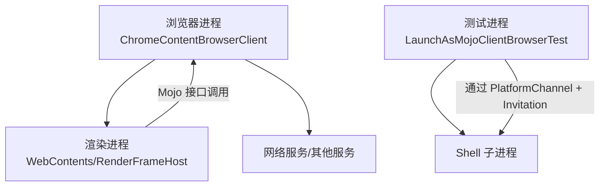
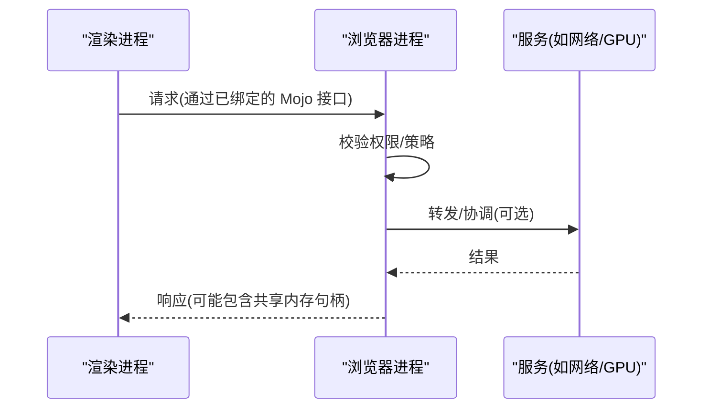
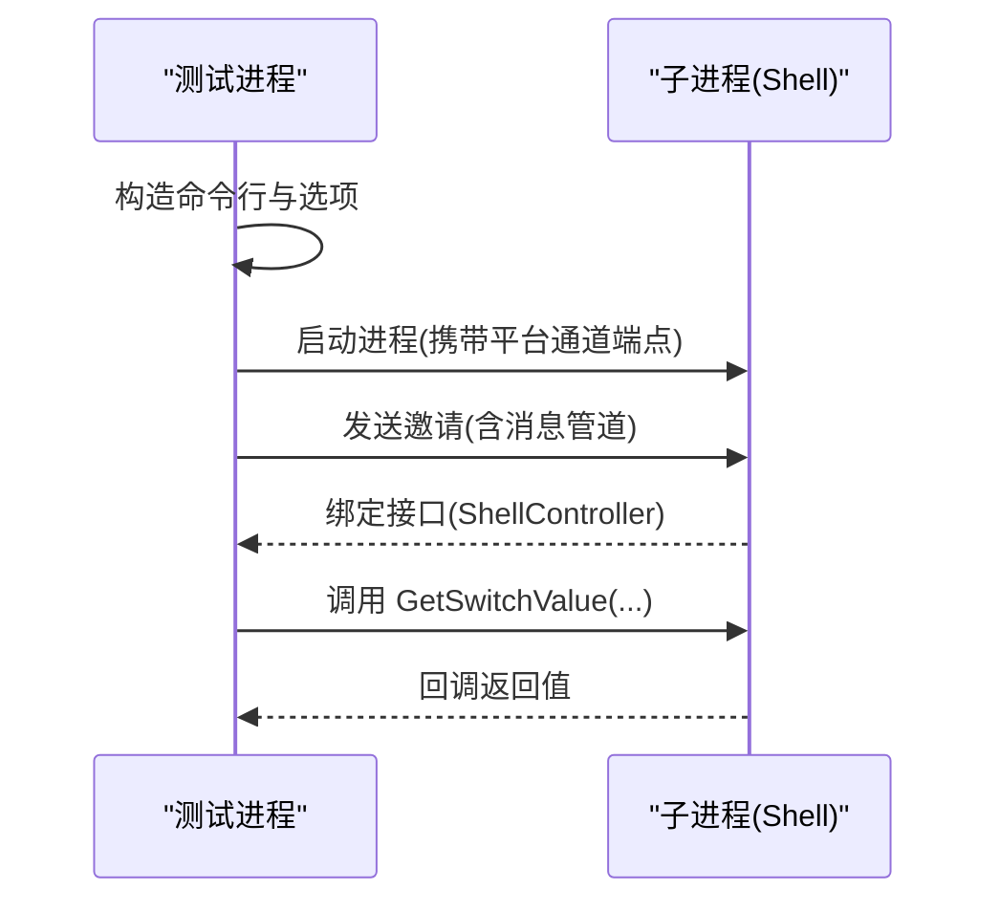
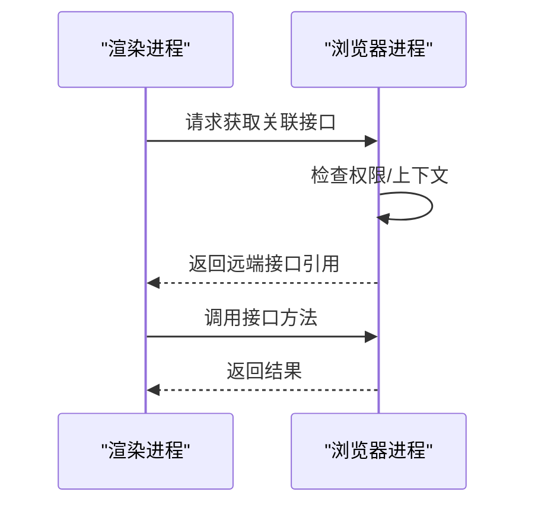
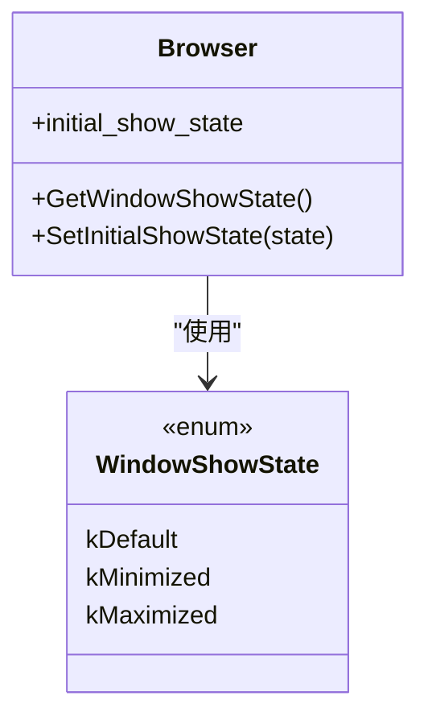
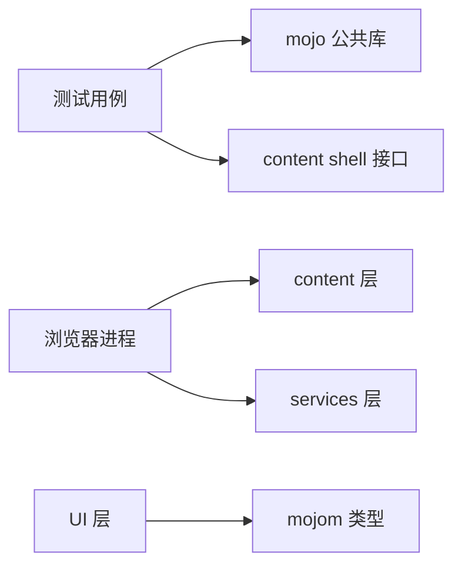

# 进程通信

本文引用的文件

- [chrome_content_browser_client.cc](https://github.com/Mcloud136/Mcloud-Browser/blob/main/src/chrome/browser/chrome_content_browser_client.cc)
- [launch_as_mojo_client_browsertest.cc](https://github.com/Mcloud136/Mcloud-Browser/blob/main/src/content/browser/launch_as_mojo_client_browsertest.cc)
- [browser.h](https://github.com/Mcloud136/Mcloud-Browser/blob/main/src/chrome/browser/ui/browser.h)

## 目录
1. [简介](#简介)
2. [项目结构](#项目结构)
3. [核心组件](#核心组件)
4. [架构总览](#架构总览)
5. [详细组件分析](#详细组件分析)
6. [依赖关系分析](#依赖关系分析)
7. [性能考量](#性能考量)
8. [故障排查指南](#故障排查指南)
9. [结论](#结论)
10. [附录](#附录)

## 简介
本文件面向 MCloud Browser（基于 Chromium）的进程通信机制，聚焦于 Mojo IPC 系统：接口定义、消息传递、服务发现、通道与共享内存的使用模式、同步/异步/事件订阅等通信范式，以及安全边界与权限控制。文档结合仓库中的实际代码片段路径，提供可追溯的实现参考与最佳实践建议，并给出监控与调试方法。

## 项目结构
MCloud Browser 在 Chromium 基础上扩展了浏览器端能力，并通过 content 层与渲染进程、GPU 进程、网络服务等交互。关键入口与桥接点包括：
- 浏览器端内容客户端：负责将浏览器功能暴露为 Mojo 接口，并在渲染进程请求时进行绑定与授权。
- 测试用例：演示如何通过邀请（Invitation）和平台通道（PlatformChannel）启动子进程并建立 Mojo 远程调用。
- UI 层类型：大量使用 mojom 类型作为跨进程参数与返回值，体现接口契约。

图表来源
- [chrome_content_browser_client.cc:990-1010](https://github.com/Mcloud136/Mcloud-Browser/blob/main/src/chrome/browser/chrome_content_browser_client.cc#L990-L1010)
- [launch_as_mojo_client_browsertest.cc:119-136](https://github.com/Mcloud136/Mcloud-Browser/blob/main/src/content/browser/launch_as_mojo_client_browsertest.cc#L119-L136)

章节来源
- [chrome_content_browser_client.cc:990-1010](https://github.com/Mcloud136/Mcloud-Browser/blob/main/src/chrome/browser/chrome_content_browser_client.cc#L990-L1010)
- [launch_as_mojo_client_browsertest.cc:119-136](https://github.com/Mcloud136/Mcloud-Browser/blob/main/src/content/browser/launch_as_mojo_client_browsertest.cc#L119-L136)
- [browser.h:251-252](https://github.com/Mcloud136/Mcloud-Browser/blob/main/src/chrome/browser/ui/browser.h#L251-L252)

## 核心组件
- ChromeContentBrowserClient：在浏览器进程中注册并实现各类 Mojo 接口，处理来自渲染进程的请求，协调安全策略与资源访问。
- LaunchAsMojoClientBrowserTest：展示如何以“邀请”方式启动子进程，并通过平台通道传递 Mojo 远端对象，完成跨进程绑定与调用。
- UI 层 mojom 类型：如 WindowShowState、NavigationBlockedReason 等，用于在不同进程间传递结构化数据，确保接口契约一致。

章节来源
- [chrome_content_browser_client.cc:990-1010](https://github.com/Mcloud136/Mcloud-Browser/blob/main/src/chrome/browser/chrome_content_browser_client.cc#L990-L1010)
- [launch_as_mojo_client_browsertest.cc:119-136](https://github.com/Mcloud136/Mcloud-Browser/blob/main/src/content/browser/launch_as_mojo_client_browsertest.cc#L119-L136)
- [browser.h:251-252](https://github.com/Mcloud136/Mcloud-Browser/blob/main/src/chrome/browser/ui/browser.h#L251-L252)

## 架构总览
Chromium 的进程模型将浏览器、渲染、GPU、网络等职责拆分到不同进程，通过 Mojo 进行类型安全的 IPC。典型流程如下：
- 服务发现：浏览器进程通过 ContentBrowserClient 暴露接口；渲染进程通过已知的接口名或关联接口获取远端代理。
- 通道建立：可使用 PlatformChannel 与 Invitation 在进程启动时交换管道端点，或直接通过服务管理器发现服务。
- 消息传递：调用方通过 Remote/AssociatedRemote 发起调用，接收方在服务端实现对应方法并返回结果。
- 共享内存：大对象传输通常采用零拷贝共享内存，减少序列化开销。
- 安全边界：通过 ChildProcessSecurityPolicy 与权限策略限制跨进程能力。

图表来源
- [chrome_content_browser_client.cc:990-1010](https://github.com/Mcloud136/Mcloud-Browser/blob/main/src/chrome/browser/chrome_content_browser_client.cc#L990-L1010)
- [launch_as_mojo_client_browsertest.cc:119-136](https://github.com/Mcloud136/Mcloud-Browser/blob/main/src/content/browser/launch_as_mojo_client_browsertest.cc#L119-L136)

## 详细组件分析

### 组件A：通过邀请与平台通道建立 Mojo 连接（测试用例）
该测试展示了从父进程启动子进程并建立 Mojo 连接的完整流程：
- 准备命令行为子进程，复制必要开关。
- 使用 PlatformChannel 准备远端端点，传递给子进程。
- 构建 OutgoingInvitation，附加消息管道，并通过 Send 将邀请发送给子进程。
- 在父进程侧获得 Remote，随后进行方法调用与回调处理。

图表来源
- [launch_as_mojo_client_browsertest.cc:119-136](https://github.com/Mcloud136/Mcloud-Browser/blob/main/src/content/browser/launch_as_mojo_client_browsertest.cc#L119-L136)
- [launch_as_mojo_client_browsertest.cc:160-184](https://github.com/Mcloud136/Mcloud-Browser/blob/main/src/content/browser/launch_as_mojo_client_browsertest.cc#L160-L184)

章节来源
- [launch_as_mojo_client_browsertest.cc:119-136](https://github.com/Mcloud136/Mcloud-Browser/blob/main/src/content/browser/launch_as_mojo_client_browsertest.cc#L119-L136)
- [launch_as_mojo_client_browsertest.cc:160-184](https://github.com/Mcloud136/Mcloud-Browser/blob/main/src/content/browser/launch_as_mojo_client_browsertest.cc#L160-L184)

### 组件B：浏览器端接口绑定与远程接口获取
浏览器端在渲染进程请求时，通过获取远程关联接口（GetRemoteAssociatedInterface）等方式，将特定能力暴露给渲染进程。此过程体现了服务发现与绑定：
- 渲染进程持有某个远端对象的引用。
- 通过关联接口机制，浏览器进程注入或返回所需的接口实例。
- 后续调用即走 Mojo 通道，受安全策略约束。

图表来源
- [chrome_content_browser_client.cc:990-1010](https://github.com/Mcloud136/Mcloud-Browser/blob/main/src/chrome/browser/chrome_content_browser_client.cc#L990-L1010)

章节来源
- [chrome_content_browser_client.cc:990-1010](https://github.com/Mcloud136/Mcloud-Browser/blob/main/src/chrome/browser/chrome_content_browser_client.cc#L990-L1010)

### 组件C：UI 层与跨进程数据类型
UI 层广泛使用 mojom 类型作为跨进程数据结构，例如窗口显示状态、导航阻塞原因等。这些类型由 mojom 定义，保证编译期类型安全与一致性。

图表来源
- [browser.h:251-252](https://github.com/Mcloud136/Mcloud-Browser/blob/main/src/chrome/browser/ui/browser.h#L251-L252)
- [browser.h:382-385](https://github.com/Mcloud136/Mcloud-Browser/blob/main/src/chrome/browser/ui/browser.h#L382-L385)

章节来源
- [browser.h:251-252](https://github.com/Mcloud136/Mcloud-Browser/blob/main/src/chrome/browser/ui/browser.h#L251-L252)
- [browser.h:382-385](https://github.com/Mcloud136/Mcloud-Browser/blob/main/src/chrome/browser/ui/browser.h#L382-L385)

## 依赖关系分析
- 浏览器进程依赖 content 层提供的进程与通道抽象，以及 services 层的网络、存储等服务。
- 测试用例依赖 mojo 公共库（Remote、PlatformChannel、Invitation）与 content shell 的测试接口。
- UI 层依赖 mojom 生成的类型头，确保跨进程数据结构一致。

图表来源
- [launch_as_mojo_client_browsertest.cc:119-136](https://github.com/Mcloud136/Mcloud-Browser/blob/main/src/content/browser/launch_as_mojo_client_browsertest.cc#L119-L136)
- [chrome_content_browser_client.cc:990-1010](https://github.com/Mcloud136/Mcloud-Browser/blob/main/src/chrome/browser/chrome_content_browser_client.cc#L990-L1010)
- [browser.h:251-252](https://github.com/Mcloud136/Mcloud-Browser/blob/main/src/chrome/browser/ui/browser.h#L251-L252)

章节来源
- [launch_as_mojo_client_browsertest.cc:119-136](https://github.com/Mcloud136/Mcloud-Browser/blob/main/src/content/browser/launch_as_mojo_client_browsertest.cc#L119-L136)
- [chrome_content_browser_client.cc:990-1010](https://github.com/Mcloud136/Mcloud-Browser/blob/main/src/chrome/browser/chrome_content_browser_client.cc#L990-L1010)
- [browser.h:251-252](https://github.com/Mcloud136/Mcloud-Browser/blob/main/src/chrome/browser/ui/browser.h#L251-L252)

## 性能考量
- 共享内存：对大对象传输优先使用共享内存，避免重复序列化与拷贝。在浏览器端返回数据时，尽量将缓冲置于共享内存并通过句柄传递。
- 批量调用：合并多次小调用为批量接口，降低通道往返次数。
- 关联接口：对于生命周期一致的强耦合对象，使用 AssociatedRemote/AssociatedReceiver，减少额外绑定开销。
- 线程模型：将耗时操作放到后台线程，避免阻塞主线程的消息循环。
- 缓存与去重：对频繁查询的结果进行缓存，减少跨进程调用频率。

[本节为通用指导，不直接分析具体文件]

## 故障排查指南
- 连接失败：检查 PlatformChannel 与 Invitation 是否正确传递；确认子进程是否成功启动并绑定接口。
- 权限拒绝：审查 ChildProcessSecurityPolicy 与权限策略，确保调用方具备所需权限。
- 回调未触发：确认事件循环运行正常，回调绑定正确且未被提前释放。
- 性能问题：使用 tracing 工具记录 IPC 调用链，定位瓶颈；检查是否存在过多小消息或阻塞调用。

章节来源
- [launch_as_mojo_client_browsertest.cc:160-184](https://github.com/Mcloud136/Mcloud-Browser/blob/main/src/content/browser/launch_as_mojo_client_browsertest.cc#L160-L184)
- [chrome_content_browser_client.cc:990-1010](https://github.com/Mcloud136/Mcloud-Browser/blob/main/src/chrome/browser/chrome_content_browser_client.cc#L990-L1010)

## 结论
MCloud Browser 基于 Chromium 的 Mojo IPC 实现了类型安全、可扩展的进程间通信。通过邀请与平台通道建立连接、通过关联接口进行服务发现与绑定、结合共享内存优化数据传输，能够满足高性能与高可靠性的需求。配合严格的权限与安全策略，可在复杂的多进程环境中稳定运行。

[本节为总结性内容，不直接分析具体文件]

## 附录
- 同步调用：适用于简单请求-响应场景，注意避免阻塞主线程。
- 异步回调：适用于耗时操作或事件驱动场景，确保回调生命周期管理。
- 事件订阅：通过事件接口实现一对多通知，适合状态变更广播。
- 调试工具：
  - chrome://tracing：采集 IPC 调用时序与耗时。
  - devtools：在渲染进程侧观察网络与脚本执行。
  - 日志与断点：在浏览器端与服务端设置断点，逐步验证调用路径。

[本节为通用指导，不直接分析具体文件]