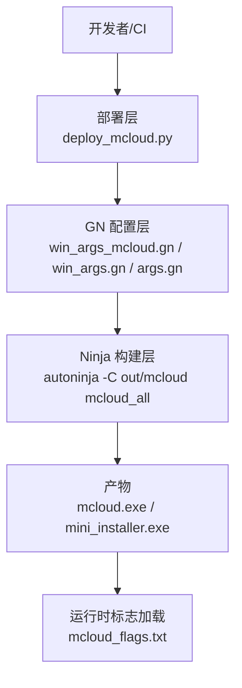
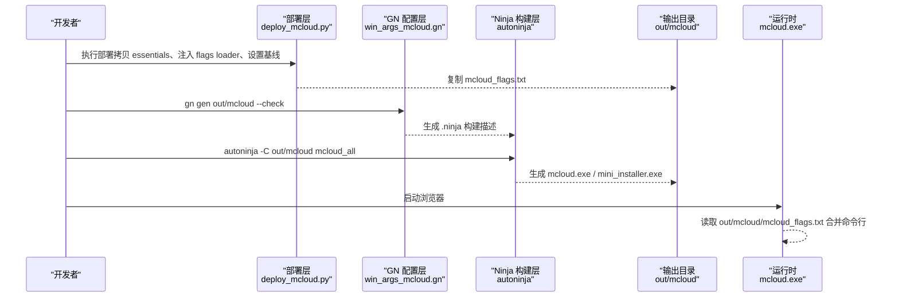
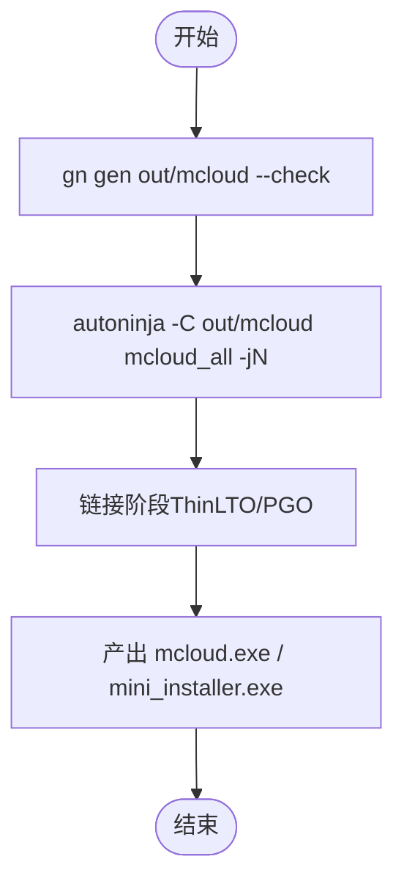
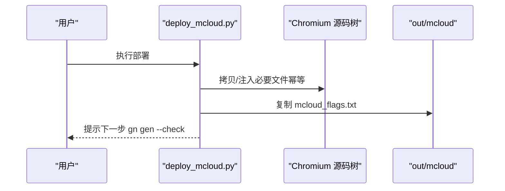
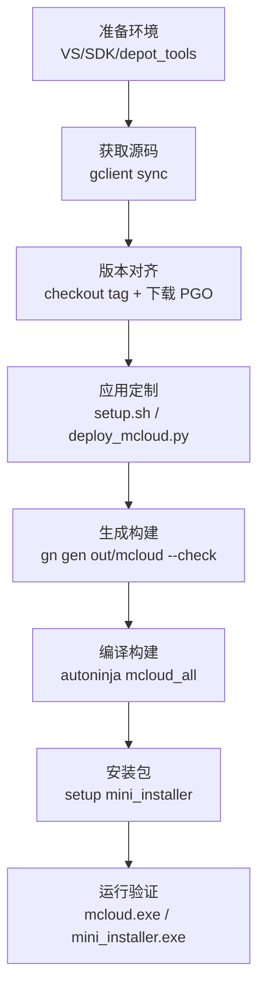
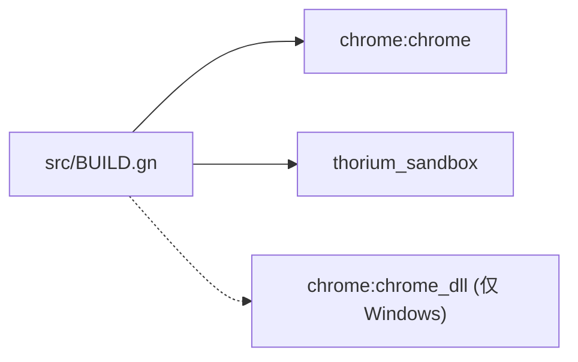

# 构建架构

本文引用的文件

- [args.gn](https://github.com/Mcloud136/Mcloud-Browser/blob/main/args.gn)
- [win_args.gn](https://github.com/Mcloud136/Mcloud-Browser/blob/main/win_args.gn)
- [win_args_mcloud.gn](https://github.com/Mcloud136/Mcloud-Browser/blob/main/win_args_mcloud.gn)
- [build_win.sh](https://github.com/Mcloud136/Mcloud-Browser/blob/main/build_win.sh)
- [docs/BUILDING_WIN.md](https://github.com/Mcloud136/Mcloud-Browser/blob/main/docs/BUILDING_WIN.md)
- [docs/ABOUT_GN_ARGS.md](https://github.com/Mcloud136/Mcloud-Browser/blob/main/docs/ABOUT_GN_ARGS.md)
- [setup.sh](https://github.com/Mcloud136/Mcloud-Browser/blob/main/setup.sh)
- [trunk.sh](https://github.com/Mcloud136/Mcloud-Browser/blob/main/trunk.sh)
- [version.sh](https://github.com/Mcloud136/Mcloud-Browser/blob/main/version.sh)
- [win_scripts/build_win.py](https://github.com/Mcloud136/Mcloud-Browser/blob/main/win_scripts/build_win.py)
- [win_scripts/deploy_mcloud.py](https://github.com/Mcloud136/Mcloud-Browser/blob/main/win_scripts/deploy_mcloud.py)
- [docs/architecture/build-pipeline-flow.md](https://github.com/Mcloud136/Mcloud-Browser/blob/main/docs/architecture/build-pipeline-flow.md)
- [src/BUILD.gn](https://github.com/Mcloud136/Mcloud-Browser/blob/main/src/BUILD.gn)

## 目录
1. [简介](#简介)
2. [项目结构](#项目结构)
3. [核心组件](#核心组件)
4. [架构总览](#架构总览)
5. [详细组件分析](#详细组件分析)
6. [依赖关系分析](#依赖关系分析)
7. [性能与优化](#性能与优化)
8. [故障排除指南](#故障排除指南)
9. [结论](#结论)
10. [附录：自定义构建配置指南](#附录自定义构建配置指南)

## 简介
本文件面向 MCloud Browser 的构建系统，系统性说明分层构建体系（GN 配置层、Ninja 构建层、部署层）的职责分工；解释 Windows 平台的完整构建流水线（从源码获取到最终可执行文件生成）；详述构建参数体系（args.gn、win_args.gn、win_args_mcloud.gn）的作用与优先级；并给出跨平台差异、并行编译、增量构建、缓存机制以及自定义构建配置与故障排除方法。

## 项目结构
MCloud Browser 在 Chromium 源码树之上进行二次定制，采用“脚本编排 + GN 参数 + Ninja 编译”的分层方式：
- 顶层脚本负责环境准备、源码同步、补丁应用、产物打包与安装器生成。
- GN 参数文件集中声明目标平台、编译器开关、媒体能力、PGO/LTO 等优化选项。
- Ninja 通过 GN 生成的构建描述执行实际的编译链接任务。
- 部署层通过 Python 脚本对 Chromium 源码进行定点注入（不整体覆盖源文件），确保可维护性与上游兼容性。

**图示来源**
- [win_scripts/deploy_mcloud.py:1-51](https://github.com/Mcloud136/Mcloud-Browser/blob/main/win_scripts/deploy_mcloud.py#L1-L51)
- [win_args_mcloud.gn:1-126](https://github.com/Mcloud136/Mcloud-Browser/blob/main/win_args_mcloud.gn#L1-L126)
- [win_args.gn:1-87](https://github.com/Mcloud136/Mcloud-Browser/blob/main/win_args.gn#L1-L87)
- [build_win.sh:42-51](https://github.com/Mcloud136/Mcloud-Browser/blob/main/build_win.sh#L42-L51)
- [docs/architecture/build-pipeline-flow.md:15-44](https://github.com/Mcloud136/Mcloud-Browser/blob/main/docs/architecture/build-pipeline-flow.md#L15-L44)

**章节来源**
- [docs/architecture/build-pipeline-flow.md:15-44](https://github.com/Mcloud136/Mcloud-Browser/blob/main/docs/architecture/build-pipeline-flow.md#L15-L44)
- [docs/BUILDING_WIN.md:203-233](https://github.com/Mcloud136/Mcloud-Browser/blob/main/docs/BUILDING_WIN.md#L203-L233)

## 核心组件
- GN 配置层：定义 target_os/target_cpu、SIMD 指令集、是否官方构建、调试/发布模式、V8/Blink 符号级别、媒体解码能力、Widevine、WebRTC、PGO/LTO 等。
- Ninja 构建层：基于 GN 输出，使用 autoninja 并行编译与链接，产出浏览器主程序与安装包。
- 部署层：将 MCloud 定制点以“定点注入”的方式应用到 Chromium 源码（如 compiler_opt.gni、BUILDCONFIG.gn、win/BUILD.gn、chrome_main_delegate.cc），并复制运行时标志文件。

**章节来源**
- [win_args_mcloud.gn:9-126](https://github.com/Mcloud136/Mcloud-Browser/blob/main/win_args_mcloud.gn#L9-L126)
- [win_args.gn:9-87](https://github.com/Mcloud136/Mcloud-Browser/blob/main/win_args.gn#L9-L87)
- [docs/ABOUT_GN_ARGS.md:35-173](https://github.com/Mcloud136/Mcloud-Browser/blob/main/docs/ABOUT_GN_ARGS.md#L35-L173)
- [win_scripts/deploy_mcloud.py:25-46](https://github.com/Mcloud136/Mcloud-Browser/blob/main/win_scripts/deploy_mcloud.py#L25-L46)

## 架构总览
下图展示 Windows 平台从源码获取到最终产物的端到端流程，包括部署、生成、编译与运行期标志加载。

**图示来源**
- [win_scripts/deploy_mcloud.py:25-46](https://github.com/Mcloud136/Mcloud-Browser/blob/main/win_scripts/deploy_mcloud.py#L25-L46)
- [docs/architecture/build-pipeline-flow.md:15-44](https://github.com/Mcloud136/Mcloud-Browser/blob/main/docs/architecture/build-pipeline-flow.md#L15-L44)
- [docs/BUILDING_WIN.md:203-233](https://github.com/Mcloud136/Mcloud-Browser/blob/main/docs/BUILDING_WIN.md#L203-L233)
- [build_win.sh:42-51](https://github.com/Mcloud136/Mcloud-Browser/blob/main/build_win.sh#L42-L51)

## 详细组件分析

### GN 配置层：参数体系与优先级
- 通用参数（Linux/macOS/Windows 共享）：位于根目录 args.gn，包含 SIMD、target_os/target_cpu、官方构建、调试/发布、V8/Blink 符号级别、媒体与 DRM、PGO/LTO 等。
- Windows 平台参数：win_args.gn 覆盖 target_os=win 及 Windows 专属开关（如 CFG Guard、RLZ）。
- MCloud 专用参数：win_args_mcloud.gn 针对 Intel Core i9-14900HX 等现代 CPU 启用 AVX2+FMA3，细化 V8/JIT、媒体、DRM、WebRTC、GPU（禁用 Vulkan）、资源上报等，并指定 PGO 数据路径。

优先级建议：
- 若同时存在多个 args.gn 文件，应以具体平台与产品专用的文件为准（例如 Windows MCloud 构建优先使用 win_args_mcloud.gn），再叠加通用参数。
- 实际生效顺序由 GN 解析逻辑决定，通常遵循“更具体的覆盖更通用的”原则。

关键要点：
- SIMD：use_sse3/use_sse41/use_sse42/use_avx/use_avx2/use_fma/use_avx512。
- 构建类型：is_official_build、is_debug、symbol_level、v8_symbol_level、blink_symbol_level。
- 优化：use_thin_lto、thin_lto_enable_optimizations、chrome_pgo_phase、pgo_data_path。
- 媒体/DRM：media_use_ffmpeg、proprietary_codecs、enable_widevine、bundle_widevine_cdm、rtc_use_h264/h265。
- 安全：win_enable_cfg_guards（Windows）、init_stack_vars_zero。

**章节来源**
- [args.gn:1-87](https://github.com/Mcloud136/Mcloud-Browser/blob/main/args.gn#L1-L87)
- [win_args.gn:1-87](https://github.com/Mcloud136/Mcloud-Browser/blob/main/win_args.gn#L1-L87)
- [win_args_mcloud.gn:9-126](https://github.com/Mcloud136/Mcloud-Browser/blob/main/win_args_mcloud.gn#L9-L126)
- [docs/ABOUT_GN_ARGS.md:35-173](https://github.com/Mcloud136/Mcloud-Browser/blob/main/docs/ABOUT_GN_ARGS.md#L35-L173)

### Ninja 构建层：并行编译与增量构建
- 入口命令：autoninja -C out/mcloud mcloud_all（或按目标拆分构建）。
- 并行度：通过 -j 参数控制并发任务数，通常设置为 CPU 核心数。
- 增量构建：GN/Ninja 基于依赖图与时间戳进行增量编译；配合 ThinLTO 增量缓存（thin_lto_enable_cache）可提升二次构建速度，但需注意非确定性风险。
- 产物：浏览器主程序与 mini_installer 安装包。

**图示来源**
- [build_win.sh:42-51](https://github.com/Mcloud136/Mcloud-Browser/blob/main/build_win.sh#L42-L51)
- [win_scripts/build_win.py:40-50](https://github.com/Mcloud136/Mcloud-Browser/blob/main/win_scripts/build_win.py#L40-L50)
- [docs/ABOUT_GN_ARGS.md:161-173](https://github.com/Mcloud136/Mcloud-Browser/blob/main/docs/ABOUT_GN_ARGS.md#L161-L173)

**章节来源**
- [docs/BUILDING_WIN.md:227-237](https://github.com/Mcloud136/Mcloud-Browser/blob/main/docs/BUILDING_WIN.md#L227-L237)
- [docs/ABOUT_GN_ARGS.md:161-173](https://github.com/Mcloud136/Mcloud-Browser/blob/main/docs/ABOUT_GN_ARGS.md#L161-L173)

### 部署层：定点注入与运行时标志
部署层以幂等方式对 Chromium 源码进行最小化改动：
- 复制 essential 文件（如 compiler_opt.gni、mcloud_flags.txt）。
- 接入 Polly/emit-relocs 接线（可选）。
- 设置 AVX2+FMA3 基线（win/BUILD.gn）。
- 注入运行时标志加载器（chrome_main_delegate.cc）。
- 将 mcloud_flags.txt 复制到 out/mcloud，供运行时读取。

**图示来源**
- [win_scripts/deploy_mcloud.py:25-46](https://github.com/Mcloud136/Mcloud-Browser/blob/main/win_scripts/deploy_mcloud.py#L25-L46)
- [docs/architecture/build-pipeline-flow.md:15-44](https://github.com/Mcloud136/Mcloud-Browser/blob/main/docs/architecture/build-pipeline-flow.md#L15-L44)

**章节来源**
- [win_scripts/deploy_mcloud.py:1-51](https://github.com/Mcloud136/Mcloud-Browser/blob/main/win_scripts/deploy_mcloud.py#L1-L51)
- [docs/architecture/build-pipeline-flow.md:15-44](https://github.com/Mcloud136/Mcloud-Browser/blob/main/docs/architecture/build-pipeline-flow.md#L15-L44)

### Windows 平台完整构建流水线
步骤概览：
1. 环境准备：安装 Visual Studio、SDK、depot_tools，配置 PATH 与环境变量。
2. 获取源码：gclient sync 拉取 Chromium 源码与依赖。
3. 版本对齐：checkout 对应 tag 并下载 PGO 配置文件。
4. 应用 MCloud 定制：setup.sh 复制源码与补丁；或 deploy_mcloud.py 进行定点注入。
5. 生成构建：gn args/out/mcloud 编辑参数；gn gen out/mcloud --check。
6. 编译构建：autoninja -C out/mcloud mcloud_all（或 build_win.sh / build_win.py）。
7. 安装包：autoninja -C out/mcloud setup mini_installer。
8. 运行与验证：启动 mcloud.exe；mini_installer.exe 用于安装。

**图示来源**
- [docs/BUILDING_WIN.md:15-233](https://github.com/Mcloud136/Mcloud-Browser/blob/main/docs/BUILDING_WIN.md#L15-L233)
- [trunk.sh:77-83](https://github.com/Mcloud136/Mcloud-Browser/blob/main/trunk.sh#L77-L83)
- [version.sh:49-106](https://github.com/Mcloud136/Mcloud-Browser/blob/main/version.sh#L49-L106)
- [setup.sh:54-202](https://github.com/Mcloud136/Mcloud-Browser/blob/main/setup.sh#L54-L202)
- [win_scripts/build_win.py:40-50](https://github.com/Mcloud136/Mcloud-Browser/blob/main/win_scripts/build_win.py#L40-L50)

**章节来源**
- [docs/BUILDING_WIN.md:15-233](https://github.com/Mcloud136/Mcloud-Browser/blob/main/docs/BUILDING_WIN.md#L15-L233)
- [trunk.sh:77-83](https://github.com/Mcloud136/Mcloud-Browser/blob/main/trunk.sh#L77-L83)
- [version.sh:49-106](https://github.com/Mcloud136/Mcloud-Browser/blob/main/version.sh#L49-L106)
- [setup.sh:54-202](https://github.com/Mcloud136/Mcloud-Browser/blob/main/setup.sh#L54-L202)
- [win_scripts/build_win.py:40-50](https://github.com/Mcloud136/Mcloud-Browser/blob/main/win_scripts/build_win.py#L40-L50)

### 跨平台构建支持（Linux、macOS、Windows）
- Linux：args.gn 中 target_os=linux，启用 VAAPI、HLS、HEVC 等平台特性；可通过 infra/DEBUG 中的脚本进行调试构建。
- macOS：通过 setup.sh --mac 复制 Mac 特定文件与 PGO 配置；mac_args.list 提供大量 GN 参数参考。
- Windows：win_args.gn 与 win_args_mcloud.gn 覆盖 Windows 专属开关（CFG Guard、RLZ、Vulkan 禁用等）；通过 build_win.sh 或 build_win.py 驱动构建。

差异处理要点：
- target_os/target_cpu 决定平台与架构。
- 媒体与 GPU 后端：Linux 倾向 VAAPI；Windows 默认 D3D12（禁用 Vulkan）。
- 安全与优化：Windows 启用 CFG Guard；各平台均启用 ThinLTO/PGO（Release）。

**章节来源**
- [args.gn:11-87](https://github.com/Mcloud136/Mcloud-Browser/blob/main/args.gn#L11-L87)
- [win_args.gn:11-87](https://github.com/Mcloud136/Mcloud-Browser/blob/main/win_args.gn#L11-L87)
- [win_args_mcloud.gn:70-114](https://github.com/Mcloud136/Mcloud-Browser/blob/main/win_args_mcloud.gn#L70-L114)
- [setup.sh:230-248](https://github.com/Mcloud136/Mcloud-Browser/blob/main/setup.sh#L230-L248)
- [other/Mac/mac_args.list:4822-5094](https://github.com/Mcloud136/Mcloud-Browser/blob/main/other/Mac/mac_args.list#L4822-L5094)

## 依赖关系分析
- 顶层 src/BUILD.gn 定义了 thorium 组目标，聚合 chrome 主程序与沙箱等依赖，并在 Windows 下额外依赖 chrome_dll。
- 构建产物依赖 GN 参数与部署层注入的配置，确保编译时优化与运行时标志的一致性。

**图示来源**
- [src/BUILD.gn:91-105](https://github.com/Mcloud136/Mcloud-Browser/blob/main/src/BUILD.gn#L91-L105)

**章节来源**
- [src/BUILD.gn:91-105](https://github.com/Mcloud136/Mcloud-Browser/blob/main/src/BUILD.gn#L91-L105)

## 性能与优化
- 并行编译：autoninja -jN 根据 CPU 核心数设置并发任务；避免过多链接导致内存压力。
- 增量构建：GN/Ninja 依赖图与时间戳；ThinLTO 增量缓存（thin_lto_enable_cache）可加速二次构建，但需关注非确定性。
- 缓存机制：ccache（Linux/macOS）可通过 CCACHE_BASEDIR 提高命中率；Windows 主要依赖 Ninja 增量与 LTO 缓存。
- 编译优化：ThinLTO（use_thin_lto）、PGO（chrome_pgo_phase 与 pgo_data_path）、V8/TurboFan/Maglev 优化、文本段分割（use_text_section_splitting）。
- 运行时优化：mcloud_flags.txt 在 BasicStartupComplete 早期加载，合并 enable/disable-features 与 V8 参数。

**章节来源**
- [docs/ABOUT_GN_ARGS.md:161-173](https://github.com/Mcloud136/Mcloud-Browser/blob/main/docs/ABOUT_GN_ARGS.md#L161-L173)
- [docs/architecture/build-pipeline-flow.md:38-44](https://github.com/Mcloud136/Mcloud-Browser/blob/main/docs/architecture/build-pipeline-flow.md#L38-L44)
- [docs/BUILDING.md:166-190](https://github.com/Mcloud136/Mcloud-Browser/blob/main/docs/BUILDING.md#L166-L190)

## 故障排除指南
常见问题与建议：
- Python 路径冲突：确保 depot_tools 的 python.bat 优先于系统 Python，避免 GN 误判导致过度重建。
- VS/SDK 版本：必须安装匹配的 Visual Studio 2022 与 Windows SDK 10.1.22621.2428，以及调试工具。
- 索引器干扰：首次 gclient 运行如遇文件系统错误，尝试关闭 Windows 索引。
- Defender 扫描：若构建缓慢，可使用 Microsoft Defender 性能分析工具排查。
- PGO 数据路径：确保 pgo_data_path 指向正确的 .profdata 文件，并与内核大版本匹配。
- 部署失败：deploy_mcloud.py 任一阶段失败即中止，检查 CR_DIR/THOR_DIR 环境变量与路径权限。

**章节来源**
- [docs/BUILDING_WIN.md:103-114](https://github.com/Mcloud136/Mcloud-Browser/blob/main/docs/BUILDING_WIN.md#L103-L114)
- [docs/BUILDING_WIN.md:17-49](https://github.com/Mcloud136/Mcloud-Browser/blob/main/docs/BUILDING_WIN.md#L17-L49)
- [docs/BUILDING_WIN.md:275-283](https://github.com/Mcloud136/Mcloud-Browser/blob/main/docs/BUILDING_WIN.md#L275-L283)
- [win_scripts/deploy_mcloud.py:35-40](https://github.com/Mcloud136/Mcloud-Browser/blob/main/win_scripts/deploy_mcloud.py#L35-L40)

## 结论
MCloud Browser 的构建系统以 GN 参数为核心、Ninja 为执行引擎、部署层进行最小化定制注入，形成清晰的分层职责。Windows 平台流水线从环境准备、源码同步、版本对齐、定制注入、生成构建到产物打包与运行期标志加载，形成闭环。通过并行编译、增量构建、ThinLTO/PGO 与运行时标志，实现高性能与可维护性的平衡。跨平台差异通过 target_os/target_cpu 与平台专属参数文件管理，便于统一维护与扩展。

## 附录：自定义构建配置指南
- 选择参数文件：
  - 通用：args.gn
  - Windows：win_args.gn
  - Windows MCloud 专用：win_args_mcloud.gn
- 修改步骤：
  1. 编辑 out/mcloud/args.gn（或通过 gn args 打开编辑器）。
  2. 根据需要调整 SIMD、PGO、媒体与 DRM、安全开关等。
  3. 执行 gn gen out/mcloud --check 验证配置。
  4. 使用 autoninja 构建目标（如 mcloud_all）。
- 注意事项：
  - PGO 数据路径需与内核大版本一致。
  - Windows 上 ICF 由 /OPT:ICF 保障，GN 层的 use_icf 仅作开关。
  - 部署层变更应通过 deploy_mcloud.py 进行，保持幂等与可重复性。

**章节来源**
- [docs/ABOUT_GN_ARGS.md:35-173](https://github.com/Mcloud136/Mcloud-Browser/blob/main/docs/ABOUT_GN_ARGS.md#L35-L173)
- [win_args_mcloud.gn:9-126](https://github.com/Mcloud136/Mcloud-Browser/blob/main/win_args_mcloud.gn#L9-L126)
- [docs/BUILDING_WIN.md:203-233](https://github.com/Mcloud136/Mcloud-Browser/blob/main/docs/BUILDING_WIN.md#L203-L233)
- [win_scripts/deploy_mcloud.py:25-46](https://github.com/Mcloud136/Mcloud-Browser/blob/main/win_scripts/deploy_mcloud.py#L25-L46)