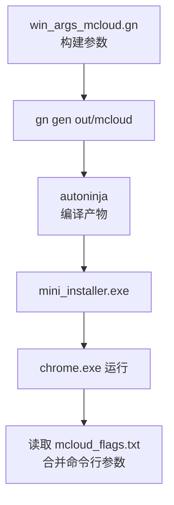
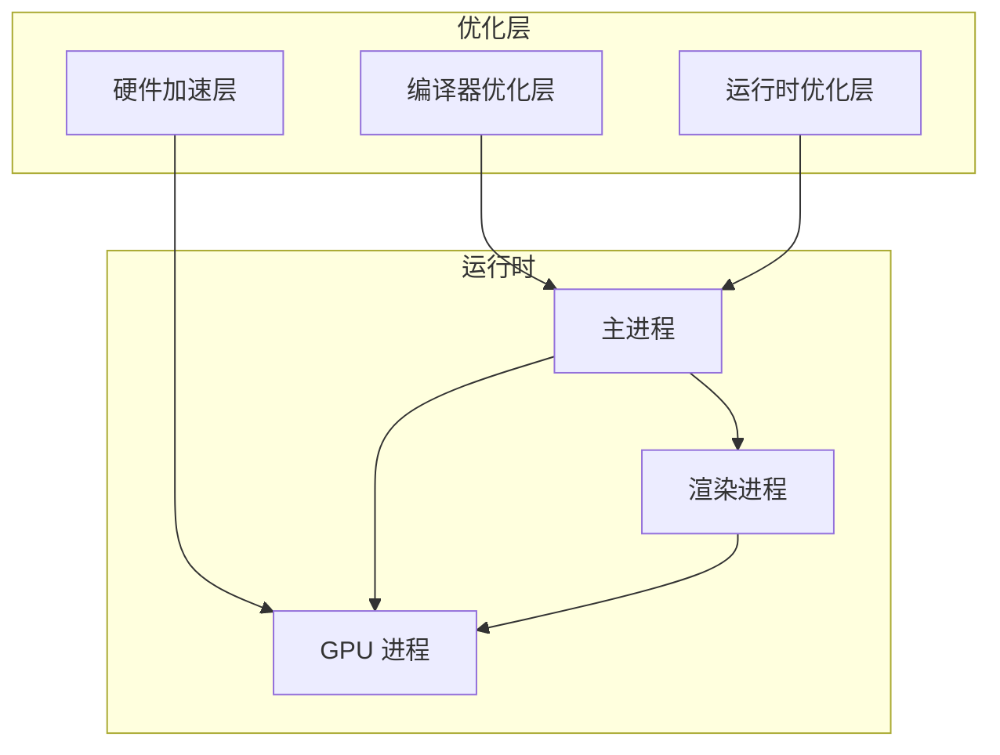
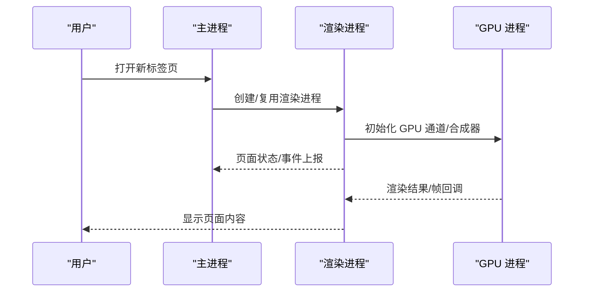
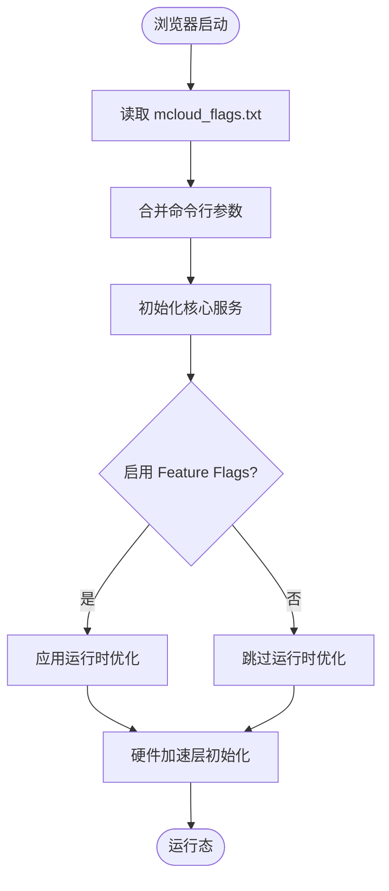
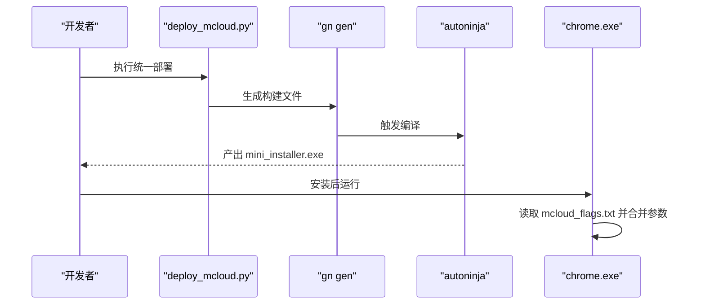
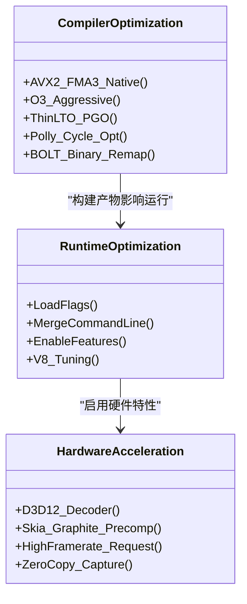
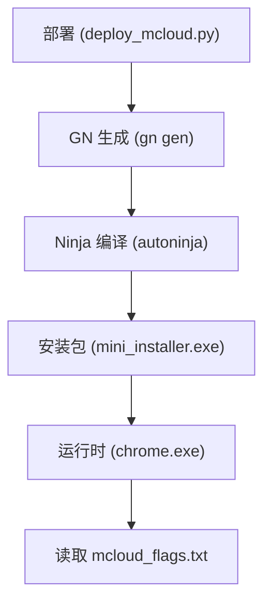

# 架构设计

本文引用的文件

- [README.md](https://github.com/Mcloud136/Mcloud-Browser/blob/main/README.md)
- [win_args_mcloud.gn](https://github.com/Mcloud136/Mcloud-Browser/blob/main/win_args_mcloud.gn)
- [mcloud_flags.txt](https://github.com/Mcloud136/Mcloud-Browser/blob/main/mcloud_flags.txt)
- [docs/architecture/build-pipeline-flow.md](https://github.com/Mcloud136/Mcloud-Browser/blob/main/docs/architecture/build-pipeline-flow.md)
- [docs/architecture/build-pipeline-flow.dot](https://github.com/Mcloud136/Mcloud-Browser/blob/main/docs/architecture/build-pipeline-flow.dot)
- [win_scripts/deploy_mcloud.py](https://github.com/Mcloud136/Mcloud-Browser/blob/main/win_scripts/deploy_mcloud.py)
- [win_scripts/append_polly_configs.py](https://github.com/Mcloud136/Mcloud-Browser/blob/main/win_scripts/append_polly_configs.py)
- [src/media/base/media_switches.cc](https://github.com/Mcloud136/Mcloud-Browser/blob/main/src/media/base/media_switches.cc)
- [src/content/gpu/BUILD.gn](https://github.com/Mcloud136/Mcloud-Browser/blob/main/src/content/gpu/BUILD.gn)
- [src/tools/clang/scripts/build.py](https://github.com/Mcloud136/Mcloud-Browser/blob/main/src/tools/clang/scripts/build.py)
- [docs/superpowers/specs/2026-06-19-performance-optimization-design.md](https://github.com/Mcloud136/Mcloud-Browser/blob/main/docs/superpowers/specs/2026-06-19-performance-optimization-design.md)
- [other/Mac/mac_args.list](https://github.com/Mcloud136/Mcloud-Browser/blob/main/other/Mac/mac_args.list)

## 目录
1. [简介](#简介)
2. [项目结构](#项目结构)
3. [核心组件](#核心组件)
4. [架构总览](#架构总览)
5. [详细组件分析](#详细组件分析)
6. [依赖关系分析](#依赖关系分析)
7. [性能优化架构](#性能优化架构)
8. [构建系统分层与流程](#构建系统分层与流程)
9. [故障排查指南](#故障排查指南)
10. [结论](#结论)

## 简介
本架构设计文档面向 MCloud Browser（基于 Chromium M151）的多进程模型、MCloud 特有的三层优化架构（编译器优化层、运行时优化层、硬件加速层）、以及从 GN 到 Ninja 的完整构建流水线。文档同时覆盖 AVX2 指令集支持、Polly 循环优化、BOLT 二进制布局等关键技术，并提供架构图与交互流程图，帮助开发者理解整体设计与数据流。

## 项目结构
- 顶层配置与脚本：
  - win_args_mcloud.gn：Windows x64 目标构建参数（SIMD、LTO、PGO、V8、媒体、GPU 等）。
  - mcloud_flags.txt：运行时启动标志集合（feature flags、V8 参数、渲染/网络/内存优化等）。
  - win_scripts/deploy_mcloud.py：统一部署编排器，按序执行定点注入步骤并复制 flags。
  - docs/architecture/build-pipeline-flow.*：构建流水线可视化与说明。
- 源码定制点：
  - src/media/base/media_switches.cc：媒体相关特性开关（如 OOP 视频解码等）。
  - src/content/gpu/BUILD.gn：GPU 子模块依赖与构建定义。
  - src/tools/clang/scripts/build.py：LLVM/Clang 构建脚本中的 BOLT 相关链接选项。
- 参考与历史：
  - other/Mac/mac_args.list：GN 参数列表参考（用于验证参数有效性）。
  - README.md：项目概述、性能优化清单、基准与发布说明。

**图表来源**
- [win_args_mcloud.gn:1-126](https://github.com/Mcloud136/Mcloud-Browser/blob/main/win_args_mcloud.gn#L1-L126)
- [docs/architecture/build-pipeline-flow.md:15-44](https://github.com/Mcloud136/Mcloud-Browser/blob/main/docs/architecture/build-pipeline-flow.md#L15-L44)
- [docs/architecture/build-pipeline-flow.dot:1-86](https://github.com/Mcloud136/Mcloud-Browser/blob/main/docs/architecture/build-pipeline-flow.dot#L1-L86)

**章节来源**
- [win_args_mcloud.gn:1-126](https://github.com/Mcloud136/Mcloud-Browser/blob/main/win_args_mcloud.gn#L1-L126)
- [mcloud_flags.txt:1-120](https://github.com/Mcloud136/Mcloud-Browser/blob/main/mcloud_flags.txt#L1-L120)
- [docs/architecture/build-pipeline-flow.md:15-44](https://github.com/Mcloud136/Mcloud-Browser/blob/main/docs/architecture/build-pipeline-flow.md#L15-L44)

## 核心组件
- 主进程（Browser Process）：负责窗口管理、用户输入、页面生命周期协调、资源调度、安全策略与扩展管理等。
- 渲染进程（Renderer Process）：每个站点或隔离上下文独立进程，执行 Blink/V8，进行 DOM/JS/CSS 解析与绘制。
- GPU 进程（GPU Process）：处理图形命令缓冲、合成、着色器编译与缓存、硬件解码管线协调等。
- MCloud 优化层：
  - 编译器优化层：AVX2/FMA3 原生编译、-O3、ThinLTO、PGO；可选 Polly 循环优化与 BOLT 后链接。
  - 运行时优化层：通过 mcloud_flags.txt 注入 66 项启动标志，覆盖启动、V8、页面加载、内存、多线程、渲染、媒体等全链路。
  - 硬件加速层：D3D12/D3D11 视频解码、Skia Graphite 预编译、高帧率请求、零拷贝捕获等。

**章节来源**
- [README.md:61-176](https://github.com/Mcloud136/Mcloud-Browser/blob/main/README.md#L61-L176)
- [mcloud_flags.txt:1-120](https://github.com/Mcloud136/Mcloud-Browser/blob/main/mcloud_flags.txt#L1-L120)
- [win_args_mcloud.gn:1-126](https://github.com/Mcloud136/Mcloud-Browser/blob/main/win_args_mcloud.gn#L1-L126)

## 架构总览
MCloud Browser 在 Chromium 多进程模型之上叠加了三层优化：
- 编译器优化层：在构建期通过 GN/Ninja 注入 SIMD、LTO、PGO、Polly、BOLT 等能力。
- 运行时优化层：在浏览器启动早期读取 mcloud_flags.txt，合并到命令行，启用 feature flags 与 V8 参数。
- 硬件加速层：利用 GPU 进程与媒体子系统，结合平台 API（D3D12/D3D11）实现高效解码与渲染。

**图表来源**
- [src/content/gpu/BUILD.gn:43-87](https://github.com/Mcloud136/Mcloud-Browser/blob/main/src/content/gpu/BUILD.gn#L43-L87)
- [src/media/base/media_switches.cc:1364-1391](https://github.com/Mcloud136/Mcloud-Browser/blob/main/src/media/base/media_switches.cc#L1364-L1391)
- [docs/architecture/build-pipeline-flow.md:15-44](https://github.com/Mcloud136/Mcloud-Browser/blob/main/docs/architecture/build-pipeline-flow.md#L15-L44)

## 详细组件分析

### 多进程模型与职责划分
- 主进程：
  - 负责应用生命周期、UI 管理、扩展与策略、网络栈协调、存储与权限。
  - 通过 Mojo IPC 与渲染/GPU 进程通信，调度任务与资源。
- 渲染进程：
  - 执行网页 JS/CSS/DOM，使用 Blink/V8，生成绘制命令。
  - 受沙箱保护，限制对系统资源的直接访问。
- GPU 进程：
  - 管理命令缓冲、合成器、着色器缓存、硬件解码通道。
  - 与媒体子系统协作，将解码后的帧送入合成路径。

**图表来源**
- [src/content/gpu/BUILD.gn:43-87](https://github.com/Mcloud136/Mcloud-Browser/blob/main/src/content/gpu/BUILD.gn#L43-L87)
- [src/media/base/media_switches.cc:1364-1391](https://github.com/Mcloud136/Mcloud-Browser/blob/main/src/media/base/media_switches.cc#L1364-L1391)

**章节来源**
- [src/content/gpu/BUILD.gn:43-87](https://github.com/Mcloud136/Mcloud-Browser/blob/main/src/content/gpu/BUILD.gn#L43-L87)
- [src/media/base/media_switches.cc:1364-1391](https://github.com/Mcloud136/Mcloud-Browser/blob/main/src/media/base/media_switches.cc#L1364-L1391)

### MCloud 三层优化架构协同机制
- 编译器优化层：
  - AVX2 + FMA3 原生编译，-O3 极致优化，ThinLTO + PGO 热点路径优化。
  - Polly 循环优化与 BOLT 二进制布局为可选增强，需前置工具链就绪。
- 运行时优化层：
  - 启动时读取 mcloud_flags.txt，合并 enable/disable-features 与普通开关，用户命令行优先级更高。
  - 覆盖启动、V8、页面加载、内存、多线程、渲染、媒体等全链路优化。
- 硬件加速层：
  - 默认启用 D3D12 视频解码，针对核显问题回退至 D3D11 以避免首帧绿屏。
  - Skia Graphite 预编译消除着色器卡顿，资源池精确复用减少碎片。

**图表来源**
- [docs/architecture/build-pipeline-flow.md:38-44](https://github.com/Mcloud136/Mcloud-Browser/blob/main/docs/architecture/build-pipeline-flow.md#L38-L44)
- [mcloud_flags.txt:1-120](https://github.com/Mcloud136/Mcloud-Browser/blob/main/mcloud_flags.txt#L1-L120)

**章节来源**
- [win_args_mcloud.gn:1-126](https://github.com/Mcloud136/Mcloud-Browser/blob/main/win_args_mcloud.gn#L1-L126)
- [mcloud_flags.txt:1-120](https://github.com/Mcloud136/Mcloud-Browser/blob/main/mcloud_flags.txt#L1-L120)
- [docs/architecture/build-pipeline-flow.md:38-44](https://github.com/Mcloud136/Mcloud-Browser/blob/main/docs/architecture/build-pipeline-flow.md#L38-L44)

### 构建系统分层与流程（GN → Ninja）
- 部署阶段：
  - deploy_mcloud.py 顺序执行 7 步：复制 essential 文件、Polly 接线、AVX2 基线、源默认值修改、注入 flags 加载器、复制 flags 到输出目录。
- 生成与编译：
  - gn gen out/mcloud --check 生成构建文件；autoninja 编译 mcloud_all 并打包 mini_installer。
- 运行时闭环：
  - chrome.exe 在 BasicStartupComplete 早期读取 exe 同目录的 mcloud_flags.txt，逐行解析并合并进命令行。

**图表来源**
- [win_scripts/deploy_mcloud.py:1-51](https://github.com/Mcloud136/Mcloud-Browser/blob/main/win_scripts/deploy_mcloud.py#L1-L51)
- [docs/architecture/build-pipeline-flow.md:15-44](https://github.com/Mcloud136/Mcloud-Browser/blob/main/docs/architecture/build-pipeline-flow.md#L15-L44)
- [docs/architecture/build-pipeline-flow.dot:1-86](https://github.com/Mcloud136/Mcloud-Browser/blob/main/docs/architecture/build-pipeline-flow.dot#L1-L86)

**章节来源**
- [win_scripts/deploy_mcloud.py:1-51](https://github.com/Mcloud136/Mcloud-Browser/blob/main/win_scripts/deploy_mcloud.py#L1-L51)
- [docs/architecture/build-pipeline-flow.md:15-44](https://github.com/Mcloud136/Mcloud-Browser/blob/main/docs/architecture/build-pipeline-flow.md#L15-L44)

## 依赖关系分析
- 构建依赖：
  - win_args_mcloud.gn 提供目标平台、SIMD、LTO、PGO、媒体、GPU 等构建参数。
  - append_polly_configs.py 向 compiler/BUILD.gn 追加 polly/emit-relocs 配置与 import。
  - tools/clang/scripts/build.py 在启用 BOLT 时添加 emit-relocs 与 -znow 链接选项。
- 运行时依赖：
  - media_switches.cc 控制 OOP 视频解码等媒体特性。
  - content/gpu BUILD.gn 定义 GPU 子模块依赖，确保 GPU 进程正确构建与链接。

**图表来源**
- [win_args_mcloud.gn:1-126](https://github.com/Mcloud136/Mcloud-Browser/blob/main/win_args_mcloud.gn#L1-L126)
- [win_scripts/append_polly_configs.py:1-71](https://github.com/Mcloud136/Mcloud-Browser/blob/main/win_scripts/append_polly_configs.py#L1-L71)
- [src/tools/clang/scripts/build.py:1262-1296](https://github.com/Mcloud136/Mcloud-Browser/blob/main/src/tools/clang/scripts/build.py#L1262-L1296)
- [src/content/gpu/BUILD.gn:43-87](https://github.com/Mcloud136/Mcloud-Browser/blob/main/src/content/gpu/BUILD.gn#L43-L87)

**章节来源**
- [win_scripts/append_polly_configs.py:1-71](https://github.com/Mcloud136/Mcloud-Browser/blob/main/win_scripts/append_polly_configs.py#L1-L71)
- [src/tools/clang/scripts/build.py:1262-1296](https://github.com/Mcloud136/Mcloud-Browser/blob/main/src/tools/clang/scripts/build.py#L1262-L1296)
- [src/content/gpu/BUILD.gn:43-87](https://github.com/Mcloud136/Mcloud-Browser/blob/main/src/content/gpu/BUILD.gn#L43-L87)

## 性能优化架构
- AVX2 指令集支持：
  - 通过 use_avx2/use_fma 启用 AVX2+FMA3 原生编译，最低 CPU 要求为 Haswell/Ryzen 及以上。
  - 关键模块（V8、FFmpeg、Skia、WebRTC 等）自动选择 AVX2 优化路径。
- Polly 循环优化：
  - 通过 append_polly_configs.py 注入 -mllvm:-polly 等参数，需自建含 Polly 的 clang。
  - 当前默认关闭，待工具链就绪后启用。
- BOLT 二进制布局：
  - 通过 emit-relocs 与 -znow 保留重定位信息，供 BOLT 进行 PLT 优化。
  - 当前默认关闭，待后链接流程落地后启用。
- 运行时优化：
  - 66 项启动标志覆盖启动、V8、页面加载、内存、多线程、渲染、媒体等全链路。
  - 实测导航提速、内存节省与启动速度提升。

**图表来源**
- [win_args_mcloud.gn:1-126](https://github.com/Mcloud136/Mcloud-Browser/blob/main/win_args_mcloud.gn#L1-L126)
- [mcloud_flags.txt:1-120](https://github.com/Mcloud136/Mcloud-Browser/blob/main/mcloud_flags.txt#L1-L120)
- [docs/superpowers/specs/2026-06-19-performance-optimization-design.md:25-98](https://github.com/Mcloud136/Mcloud-Browser/blob/main/docs/superpowers/specs/2026-06-19-performance-optimization-design.md#L25-L98)

**章节来源**
- [README.md:61-176](https://github.com/Mcloud136/Mcloud-Browser/blob/main/README.md#L61-L176)
- [win_args_mcloud.gn:1-126](https://github.com/Mcloud136/Mcloud-Browser/blob/main/win_args_mcloud.gn#L1-L126)
- [mcloud_flags.txt:1-120](https://github.com/Mcloud136/Mcloud-Browser/blob/main/mcloud_flags.txt#L1-L120)
- [docs/superpowers/specs/2026-06-19-performance-optimization-design.md:25-98](https://github.com/Mcloud136/Mcloud-Browser/blob/main/docs/superpowers/specs/2026-06-19-performance-optimization-design.md#L25-L98)

## 构建系统分层与流程
- 分层设计：
  - GN 配置层：win_args_mcloud.gn 定义目标平台、SIMD、LTO、PGO、媒体、GPU 等。
  - 部署脚本层：deploy_mcloud.py 统一编排，执行定点注入与复制。
  - Ninja 构建层：autoninja 编译 mcloud_all 并打包 mini_installer。
  - 运行时代码层：chrome.exe 启动时读取 mcloud_flags.txt 并合并命令行。
- 完整流程：
  - 部署 → GN 生成 → Ninja 编译 → 安装包 → 运行时 flags 加载。
  - CI 验证与发布路径并行存在，但发布不执行构建，仅上传产物。

**图表来源**
- [docs/architecture/build-pipeline-flow.md:15-44](https://github.com/Mcloud136/Mcloud-Browser/blob/main/docs/architecture/build-pipeline-flow.md#L15-L44)
- [docs/architecture/build-pipeline-flow.dot:1-86](https://github.com/Mcloud136/Mcloud-Browser/blob/main/docs/architecture/build-pipeline-flow.dot#L1-L86)

**章节来源**
- [docs/architecture/build-pipeline-flow.md:15-44](https://github.com/Mcloud136/Mcloud-Browser/blob/main/docs/architecture/build-pipeline-flow.md#L15-L44)
- [docs/architecture/build-pipeline-flow.dot:1-86](https://github.com/Mcloud136/Mcloud-Browser/blob/main/docs/architecture/build-pipeline-flow.dot#L1-L86)

## 故障排查指南
- 启动失败或标志未生效：
  - 检查 mcloud_flags.txt 是否复制到 out/mcloud 且 chrome.exe 能读取。
  - 确认用户命令行参数优先级高于内置标志。
- 视频播放绿屏：
  - 核显场景下 D3D12VideoDecoder 可能首帧异常，已默认禁用以回退 D3D11。
- 构建失败：
  - 确认 GN 参数有效（参考 mac_args.list 验证）。
  - 检查 Polly/BOLT 前置条件是否满足，避免无效开关导致构建失败。

**章节来源**
- [mcloud_flags.txt:83-88](https://github.com/Mcloud136/Mcloud-Browser/blob/main/mcloud_flags.txt#L83-L88)
- [other/Mac/mac_args.list:4822-4861](https://github.com/Mcloud136/Mcloud-Browser/blob/main/other/Mac/mac_args.list#L4822-L4861)

## 结论
MCloud Browser 在 Chromium 多进程模型基础上，通过编译器优化层、运行时优化层与硬件加速层的协同，实现了高性能浏览体验。构建系统采用 GN/Ninja 分层设计，配合统一的部署脚本与运行时标志注入，确保优化可维护、可验证。未来可在工具链就绪后启用 Polly 与 BOLT，进一步提升计算与启动性能。