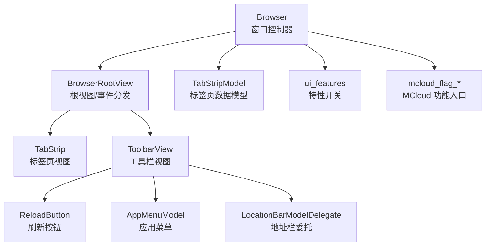
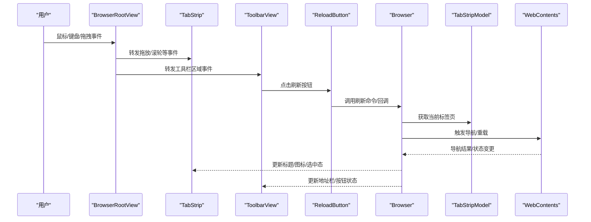
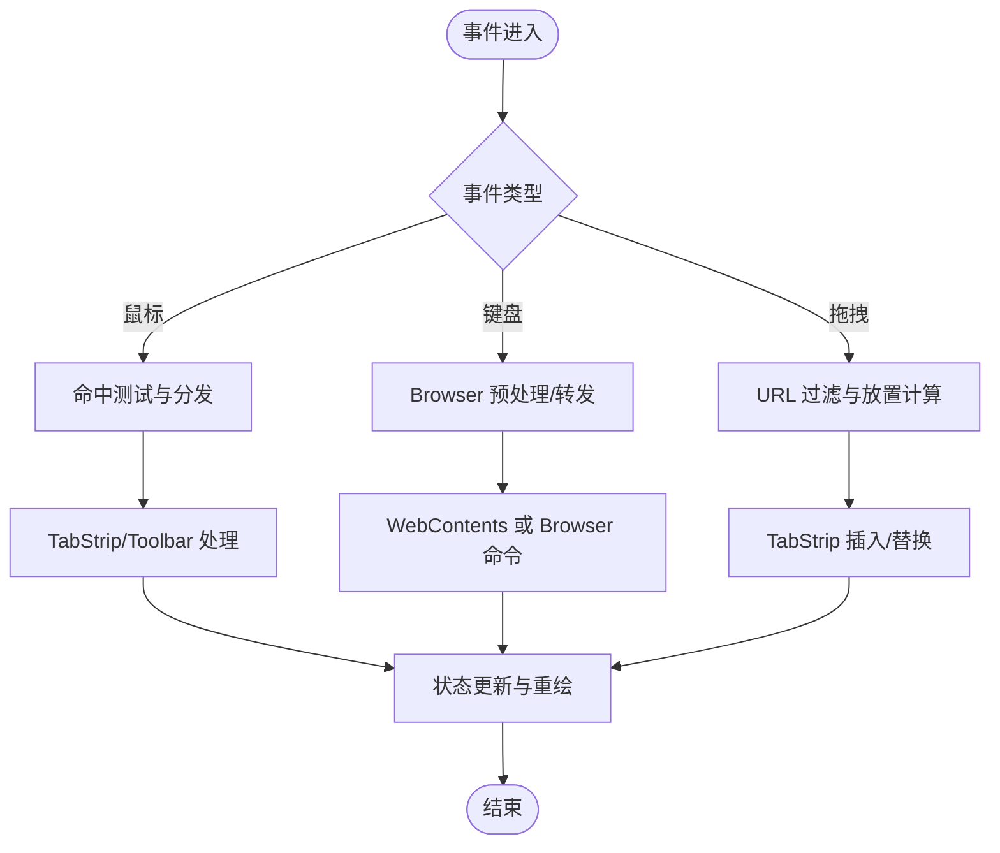
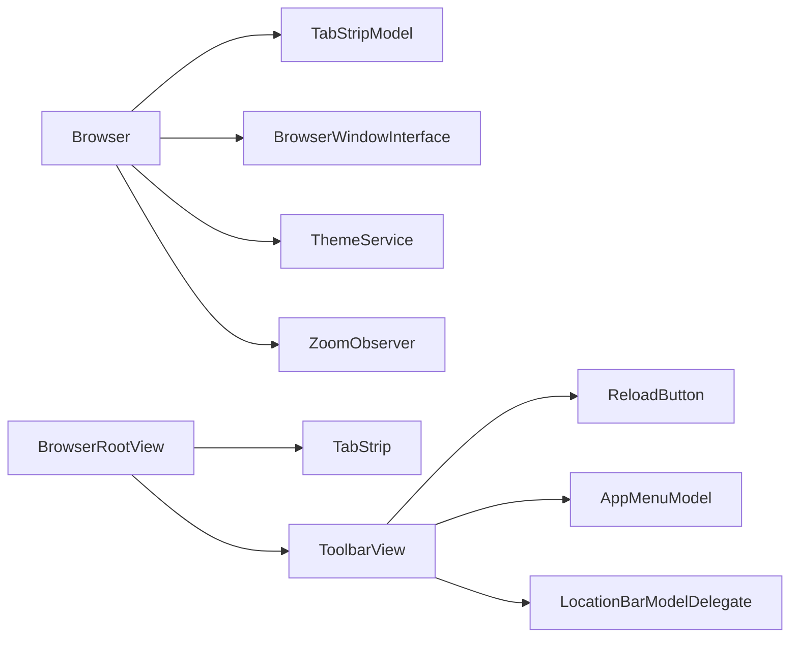

# UI 组件交互

<cite>
**本文引用的文件**
- [browser.h](file://src/chrome/browser/ui/browser.h)
- [browser.cc](file://src/chrome/browser/ui/browser.cc)
- [browser_root_view.h](file://src/chrome/browser/ui/views/frame/browser_root_view.h)
- [tab_strip_model.cc](file://src/chrome/browser/ui/tabs/tab_strip_model.cc)
- [tab_strip.cc](file://src/chrome/browser/ui/views/tabs/tab_strip.cc)
- [reload_button.h](file://src/chrome/browser/ui/views/toolbar/reload_button.h)
- [reload_button.cc](file://src/chrome/browser/ui/views/toolbar/reload_button.cc)
- [ui_features.cc](file://src/chrome/browser/ui/ui_features.cc)
- [mcloud_flag_entries.h](file://src/chrome/browser/mcloud_flag_entries.h)
- [mcloud_flag_choices.h](file://src/chrome/browser/mcloud_flag_choices.h)
- [app_menu_model.cc](file://src/chrome/browser/ui/toolbar/app_menu_model.cc)
- [chrome_location_bar_model_delegate.cc](file://src/chrome/browser/ui/toolbar/chrome_location_bar_model_delegate.cc)
</cite>

## 目录
1. [简介](#简介)
2. [项目结构](#项目结构)
3. [核心组件](#核心组件)
4. [架构总览](#架构总览)
5. [详细组件分析](#详细组件分析)
6. [依赖关系分析](#依赖关系分析)
7. [性能考量](#性能考量)
8. [故障排查指南](#故障排查指南)
9. [结论](#结论)
10. [附录](#附录)

## 简介
本文件面向 MCloud Browser 的桌面端 UI 子系统，聚焦浏览器窗口、标签页、工具栏等视图组件之间的交互与通信机制。文档基于 Chromium Views 框架的事件处理流程，解释鼠标、键盘事件的传递与响应；阐述 UI 状态管理（视图更新、重绘优化、内存管理）；并说明 Chrome/MCloud 特定的扩展点（自定义控件、主题系统、国际化）。最后提供调试与性能分析方法，以及可操作的扩展示例路径，帮助读者在现有代码基础上进行二次定制。

## 项目结构
MCloud Browser 的 UI 相关代码主要位于 src/chrome/browser/ui 及其子目录：
- 顶层窗口与生命周期：Browser（窗口级控制器）
- 视图根容器：BrowserRootView（负责拖放、滚动、事件转发）
- 标签页模型与视图：TabStripModel / TabStrip
- 工具栏按钮与菜单：ReloadButton、AppMenuModel、LocationBarModelDelegate
- 特性开关与平台能力：ui_features、mcloud_flag_*

图表来源
- [browser.h:117-130](file://src/chrome/browser/ui/browser.h#L117-L130)
- [browser_root_view.h:25-90](file://src/chrome/browser/ui/views/frame/browser_root_view.h#L25-L90)
- [tab_strip_model.cc:1-50](file://src/chrome/browser/ui/tabs/tab_strip_model.cc#L1-L50)
- [reload_button.h:1-40](file://src/chrome/browser/ui/views/toolbar/reload_button.h#L1-L40)
- [app_menu_model.cc:1-40](file://src/chrome/browser/ui/toolbar/app_menu_model.cc#L1-L40)
- [chrome_location_bar_model_delegate.cc:1-40](file://src/chrome/browser/ui/toolbar/chrome_location_bar_model_delegate.cc#L1-L40)

章节来源
- [browser.h:117-130](file://src/chrome/browser/ui/browser.h#L117-L130)
- [browser_root_view.h:25-90](file://src/chrome/browser/ui/views/frame/browser_root_view.h#L25-L90)

## 核心组件
- Browser：单窗口级控制器，持有窗口、标签页模型、工具栏、书签栏等特征，协调导航、关闭流程、全屏、焦点、键盘/手势事件等。
- BrowserRootView：Views RootView 实现，负责将拖放事件转发给 TabStrip，处理滚轮、鼠标离开等，计算偏好尺寸与绘制子视图。
- TabStripModel / TabStrip：标签页的数据模型与视图，承载打开/关闭/选择/分组/拆分等逻辑与渲染。
- 工具栏组件：ReloadButton 等按钮通过命令/回调与 Browser 交互；AppMenuModel 构建菜单项；LocationBarModelDelegate 处理地址栏输入与导航。
- 特性与标志：ui_features 暴露平台/编译期特性；mcloud_flag_* 提供 MCloud 特有功能开关与条目。

章节来源
- [browser.h:117-130](file://src/chrome/browser/ui/browser.h#L117-L130)
- [browser_root_view.h:25-90](file://src/chrome/browser/ui/views/frame/browser_root_view.h#L25-L90)
- [tab_strip_model.cc:1-50](file://src/chrome/browser/ui/tabs/tab_strip_model.cc#L1-L50)
- [reload_button.h:1-40](file://src/chrome/browser/ui/views/toolbar/reload_button.h#L1-L40)
- [app_menu_model.cc:1-40](file://src/chrome/browser/ui/toolbar/app_menu_model.cc#L1-L40)
- [chrome_location_bar_model_delegate.cc:1-40](file://src/chrome/browser/ui/toolbar/chrome_location_bar_model_delegate.cc#L1-L40)
- [ui_features.cc:1-40](file://src/chrome/browser/ui/ui_features.cc#L1-L40)
- [mcloud_flag_entries.h:1-40](file://src/chrome/browser/mcloud_flag_entries.h#L1-L40)
- [mcloud_flag_choices.h:1-40](file://src/chrome/browser/mcloud_flag_choices.h#L1-L40)

## 架构总览
下图展示了从用户输入到 UI 更新的典型路径：事件进入 BrowserRootView，再分发给 TabStrip/Toolbar；Browser 作为中枢协调状态变化与 WebContents 操作；工具栏按钮通过命令或回调触发导航或页面动作。

图表来源
- [browser_root_view.h:73-90](file://src/chrome/browser/ui/views/frame/browser_root_view.h#L73-L90)
- [reload_button.h:1-40](file://src/chrome/browser/ui/views/toolbar/reload_button.h#L1-L40)
- [browser.h:658-711](file://src/chrome/browser/ui/browser.h#L658-L711)
- [tab_strip_model.cc:1-50](file://src/chrome/browser/ui/tabs/tab_strip_model.cc#L1-L50)

## 详细组件分析

### Browser：窗口控制器与事件枢纽
- 职责
  - 窗口生命周期：创建、显示、关闭、全屏切换、会话恢复。
  - 标签页集合：通过 TabStripModel 管理打开/关闭/选择/分组/拆分等。
  - 事件处理：键盘、手势、拖拽、焦点、顶部控件高度等。
  - 导航与页面控制：打开 URL、保存内容、缩放、画中画、预览等。
  - 状态同步：标题、图标、工具栏可见性、书签栏等。
- 关键接口（节选）
  - 创建与参数：Create/CreateParams
  - 窗口特性：SupportsWindowFeature/CanSupportWindowFeature
  - 导航与 UI 更新：UpdateUIForNavigationInTab
  - 关闭流程：MaybeWarnBeforeClosing/HandleBeforeClose/TryToCloseWindow
  - 事件：PreHandleKeyboardEvent/HandleKeyboardEvent/PreHandleGestureEvent
  - 拖拽：PreHandleDragUpdate/PreHandleDragExit/HandleDragEnded
- 设计要点
  - 以观察者模式订阅 TabStripModel、WebContentsCollection、ThemeService 等，保持 UI 与状态一致。
  - 通过 BrowserWindowInterface 抽象底层窗口差异，便于跨平台。

章节来源
- [browser.h:117-130](file://src/chrome/browser/ui/browser.h#L117-L130)
- [browser.h:346-413](file://src/chrome/browser/ui/browser.h#L346-L413)
- [browser.h:487-517](file://src/chrome/browser/ui/browser.h#L487-L517)
- [browser.h:519-599](file://src/chrome/browser/ui/browser.h#L519-L599)
- [browser.h:658-711](file://src/chrome/browser/ui/browser.h#L658-L711)

### BrowserRootView：根视图与事件分发
- 职责
  - 将拖放事件转发给 TabStrip，使“标签条上方区域”也能接收放置。
  - 处理滚轮、鼠标离开、偏好尺寸计算、子视图绘制。
  - 维护 DropInfo，过滤 URL、计算放置位置（插入前/替换/是否包含分组）。
- 关键接口（节选）
  - GetDropFormats/AreDropTypesRequired/CanDrop/OnDragEntered/OnDragUpdated/GetDropCallback
  - OnMouseWheel/OnMouseExited
  - CalculatePreferredSize/PaintChildren
- 设计要点
  - 使用 DropTarget 抽象不同放置目标，统一处理坐标转换与索引计算。
  - 异步过滤 URL 后回调，避免阻塞主线程。

章节来源
- [browser_root_view.h:25-90](file://src/chrome/browser/ui/views/frame/browser_root_view.h#L25-L90)
- [browser_root_view.h:104-154](file://src/chrome/browser/ui/views/frame/browser_root_view.h#L104-L154)

### 标签页：TabStripModel 与 TabStrip
- TabStripModel
  - 标签页数据模型，维护打开/关闭/选择/分组/拆分等状态。
  - 向 Browser 发出变更通知，驱动 UI 更新。
- TabStrip
  - 标签页视图，渲染标签、拖拽排序、分组头、音频指示器等。
  - 与 BrowserRootView 协作，接收放置事件并决定插入位置。

章节来源
- [tab_strip_model.cc:1-50](file://src/chrome/browser/ui/tabs/tab_strip_model.cc#L1-L50)
- [tab_strip.cc:1-50](file://src/chrome/browser/ui/views/tabs/tab_strip.cc#L1-L50)

### 工具栏：按钮、菜单与地址栏
- ReloadButton
  - 刷新按钮视图，点击时通过命令或回调通知 Browser 执行刷新。
- AppMenuModel
  - 构建应用菜单项，支持命令路由与状态绑定。
- LocationBarModelDelegate
  - 地址栏输入、自动补全、导航委托，与 Browser 协同完成跳转。

章节来源
- [reload_button.h:1-40](file://src/chrome/browser/ui/views/toolbar/reload_button.h#L1-L40)
- [reload_button.cc:1-50](file://src/chrome/browser/ui/views/toolbar/reload_button.cc#L1-L50)
- [app_menu_model.cc:1-40](file://src/chrome/browser/ui/toolbar/app_menu_model.cc#L1-L40)
- [chrome_location_bar_model_delegate.cc:1-40](file://src/chrome/browser/ui/toolbar/chrome_location_bar_model_delegate.cc#L1-L40)

### 事件处理流程（鼠标/键盘/拖拽）
- 鼠标事件
  - 进入 BrowserRootView -> 根据命中测试分发到 TabStrip/Toolbar -> 按钮/标签处理点击、悬停、按下等。
- 键盘事件
  - Browser::PreHandleKeyboardEvent/HandleKeyboardEvent 拦截全局快捷键、组合键，必要时交由 WebContents 处理。
- 拖拽事件
  - BrowserRootView 收集并过滤 URL，计算放置索引，最终由 TabStrip 完成插入/替换。

图表来源
- [browser.h:707-711](file://src/chrome/browser/ui/browser.h#L707-L711)
- [browser_root_view.h:73-90](file://src/chrome/browser/ui/views/frame/browser_root_view.h#L73-L90)

章节来源
- [browser.h:707-711](file://src/chrome/browser/ui/browser.h#L707-L711)
- [browser_root_view.h:73-90](file://src/chrome/browser/ui/views/frame/browser_root_view.h#L73-L90)

### UI 状态管理与重绘优化
- 状态来源
  - Browser 持有窗口特性、标签页模型、工具栏可见性等状态。
  - TabStripModel 维护标签页集合状态。
  - 主题服务、缩放服务等外部状态通过观察者同步到 UI。
- 更新策略
  - 导航开始时调用 UpdateUIForNavigationInTab 更新地址栏、加载指示器、标题等。
  - 标签页选择/分组/拆分变更时，Browser 收到 TabStripModel 回调并刷新对应视图。
- 重绘优化
  - 使用 Views 的脏矩形与局部重绘，避免整窗重绘。
  - 延迟/批处理 UI 更新（如批量标签变更），减少闪烁。
- 内存管理
  - 通过弱指针、观察者注销、及时释放不再使用的视图对象，防止悬挂引用。
  - 关闭流程中清理 beforeunload、下载中断提示等临时状态。

章节来源
- [browser.h:487-517](file://src/chrome/browser/ui/browser.h#L487-L517)
- [browser.h:519-599](file://src/chrome/browser/ui/browser.h#L519-L599)
- [browser_root_view.h:104-154](file://src/chrome/browser/ui/views/frame/browser_root_view.h#L104-L154)

### Chrome/MCloud 特定扩展点
- 自定义控件
  - 通过继承 views::View 或现有按钮基类，注册命令/回调与 Browser 交互。
  - 参考 ReloadButton 的实现方式，在工具栏中添加新按钮。
- 主题系统
  - 通过 ThemeServiceObserver 监听主题变化，动态调整颜色、图标、布局。
- 国际化支持
  - 使用 GRD/GRDP 资源文件定义字符串，结合 ui::GetString16 等 API 获取本地化文本。
- 功能开关
  - ui_features 暴露平台/编译期特性；mcloud_flag_entries.h 与 mcloud_flag_choices.h 提供 MCloud 特有开关与选项。

章节来源
- [ui_features.cc:1-40](file://src/chrome/browser/ui/ui_features.cc#L1-L40)
- [mcloud_flag_entries.h:1-40](file://src/chrome/browser/mcloud_flag_entries.h#L1-L40)
- [mcloud_flag_choices.h:1-40](file://src/chrome/browser/mcloud_flag_choices.h#L1-L40)

## 依赖关系分析
- 松耦合设计
  - Browser 通过接口与 TabStripModel、BrowserWindowInterface 交互，降低对具体实现的耦合。
  - BrowserRootView 仅关注事件分发与放置逻辑，不直接持有复杂业务状态。
- 直接依赖
  - Browser 依赖 TabStripModel、ThemeService、ZoomObserver 等。
  - BrowserRootView 依赖 TabStrip、ToolbarView 进行事件转发。
- 间接依赖
  - 工具栏按钮依赖命令系统与 Browser 的回调。
  - 地址栏委托依赖 Navigation 与 WebContents。

图表来源
- [browser.h:117-130](file://src/chrome/browser/ui/browser.h#L117-L130)
- [browser_root_view.h:25-90](file://src/chrome/browser/ui/views/frame/browser_root_view.h#L25-L90)
- [reload_button.h:1-40](file://src/chrome/browser/ui/views/toolbar/reload_button.h#L1-L40)
- [app_menu_model.cc:1-40](file://src/chrome/browser/ui/toolbar/app_menu_model.cc#L1-L40)
- [chrome_location_bar_model_delegate.cc:1-40](file://src/chrome/browser/ui/toolbar/chrome_location_bar_model_delegate.cc#L1-L40)

章节来源
- [browser.h:117-130](file://src/chrome/browser/ui/browser.h#L117-L130)
- [browser_root_view.h:25-90](file://src/chrome/browser/ui/views/frame/browser_root_view.h#L25-L90)

## 性能考量
- 事件处理
  - 在 BrowserRootView 中尽早过滤无效事件，减少不必要的分发。
  - 使用异步 URL 过滤与放置计算，避免阻塞主线程。
- 视图更新
  - 仅在状态变化时触发局部重绘，避免整窗刷新。
  - 批量更新标签页状态（如批量打开/关闭）以减少抖动。
- 内存管理
  - 及时注销观察者，避免循环引用。
  - 使用弱指针与生命周期管理，防止悬挂指针导致的崩溃。
- 测量与优化
  - 使用 DevTools Performance 面板记录帧率、重绘区域。
  - 通过内存快照定位泄漏与高占用对象。

[本节为通用指导，不直接分析具体文件]

## 故障排查指南
- 常见问题
  - 拖放失效：检查 BrowserRootView 的 GetDropFormats/CanDrop/OnDragEntered 是否正确实现；确认 TabStrip 已设置 DropTarget。
  - 键盘快捷键冲突：在 Browser::PreHandleKeyboardEvent 中确认优先级与转发逻辑。
  - 刷新无响应：检查 ReloadButton 的命令/回调是否绑定到 Browser 的刷新方法。
- 调试建议
  - 启用日志与断点，跟踪事件流与状态变更。
  - 使用 DevTools 查看网络与渲染性能，定位卡顿与重绘热点。
  - 通过单元测试验证关键路径（如标签页打开/关闭、导航流程）。

章节来源
- [browser_root_view.h:73-90](file://src/chrome/browser/ui/views/frame/browser_root_view.h#L73-L90)
- [browser.h:707-711](file://src/chrome/browser/ui/browser.h#L707-L711)
- [reload_button.h:1-40](file://src/chrome/browser/ui/views/toolbar/reload_button.h#L1-L40)

## 结论
MCloud Browser 的 UI 子系统以 Browser 为核心，结合 BrowserRootView 的事件分发、TabStripModel/TabStrip 的标签页管理、工具栏按钮与菜单的命令路由，形成清晰且可扩展的交互架构。通过 Views 框架的局部重绘与状态同步机制，保证了流畅的用户体验。借助 ui_features 与 mcloud_flag_* 提供的扩展点，开发者可以便捷地定制控件、主题与功能开关。配合 DevTools 与单元测试，可有效提升调试效率与质量保障。

[本节为总结，不直接分析具体文件]

## 附录
- 扩展与定制示例路径
  - 添加工具栏按钮：参考 [reload_button.h](file://src/chrome/browser/ui/views/toolbar/reload_button.h) 与 [reload_button.cc](file://src/chrome/browser/ui/views/toolbar/reload_button.cc)，在工具栏中注册新按钮并绑定命令。
  - 自定义放置行为：参考 [browser_root_view.h](file://src/chrome/browser/ui/views/frame/browser_root_view.h) 中的 DropTarget 与 DropInfo，实现新的放置目标与索引计算。
  - 功能开关集成：参考 [mcloud_flag_entries.h](file://src/chrome/browser/mcloud_flag_entries.h) 与 [mcloud_flag_choices.h](file://src/chrome/browser/mcloud_flag_choices.h)，新增 MCloud 特有开关并在 UI 中读取与响应。
  - 地址栏与导航：参考 [chrome_location_bar_model_delegate.cc](file://src/chrome/browser/ui/toolbar/chrome_location_bar_model_delegate.cc)，扩展自动补全与导航逻辑。
  - 应用菜单：参考 [app_menu_model.cc](file://src/chrome/browser/ui/toolbar/app_menu_model.cc)，添加菜单项与命令路由。

[本节为指引，不直接分析具体文件]