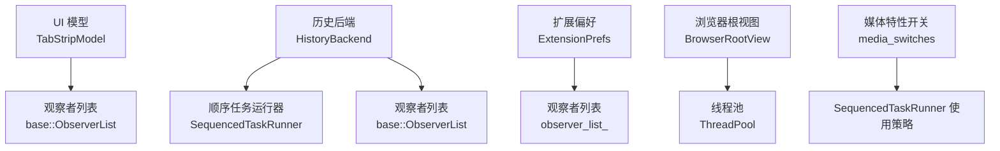
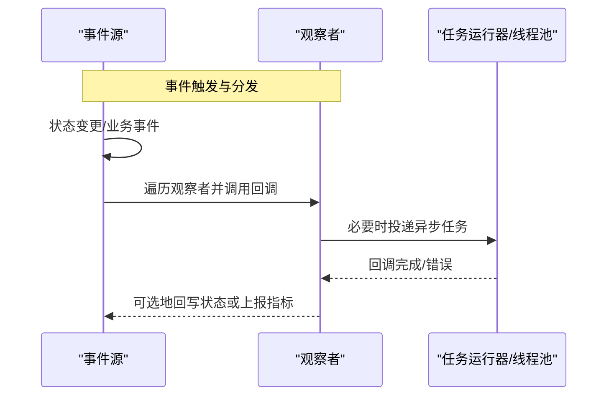
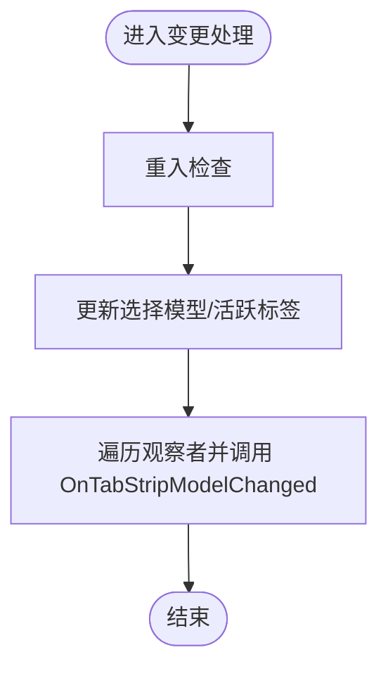
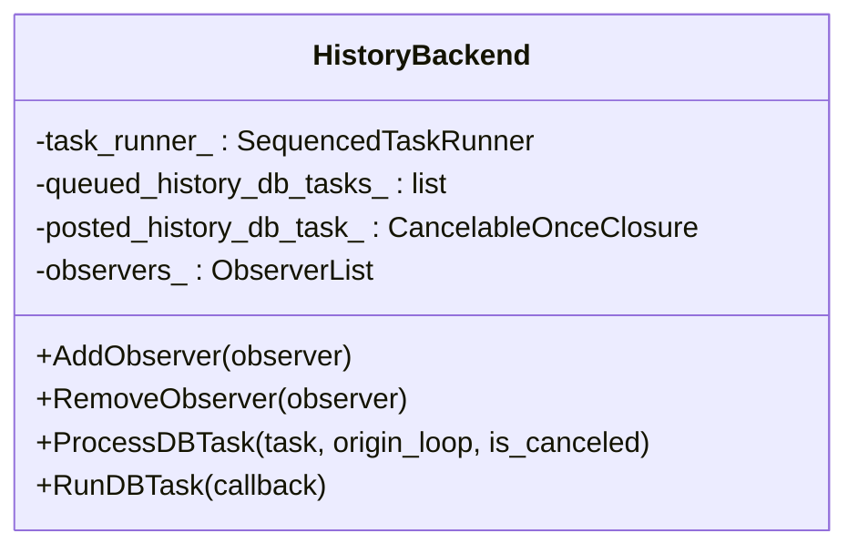
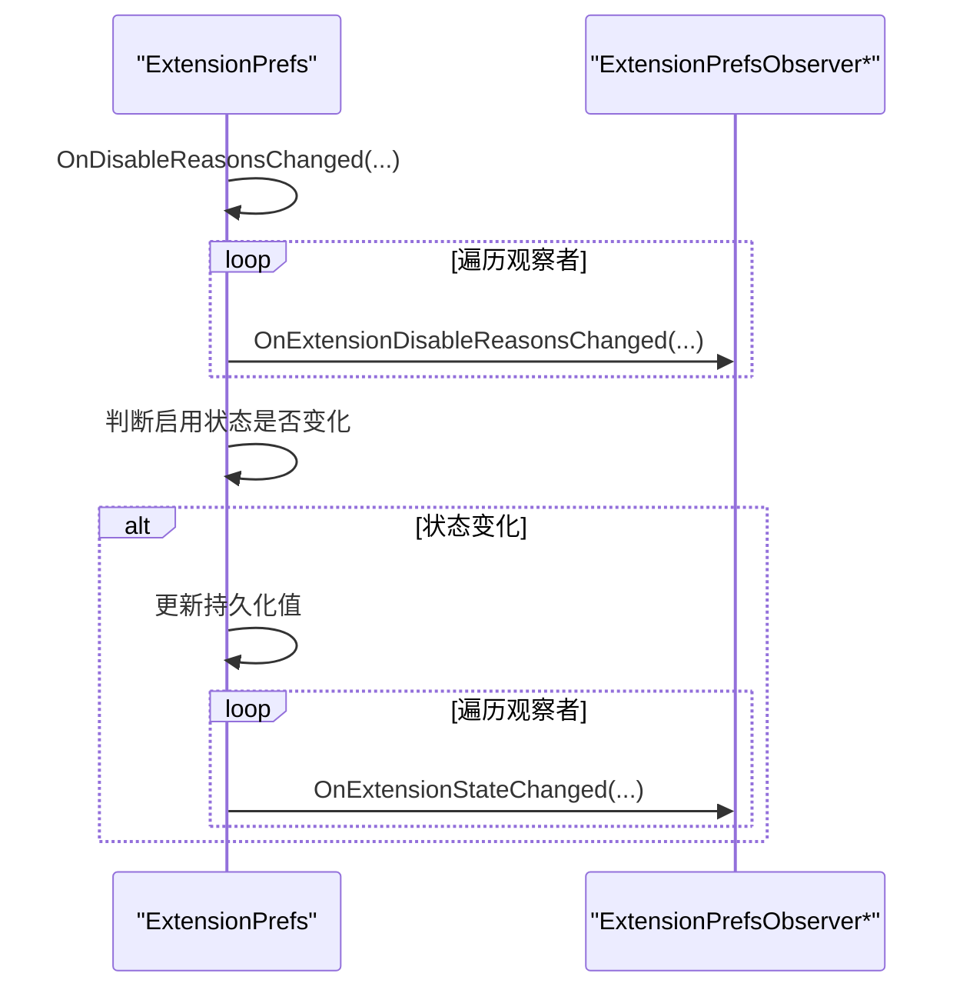
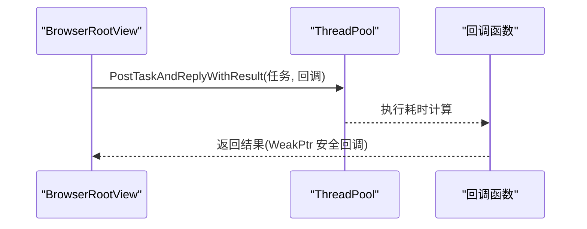
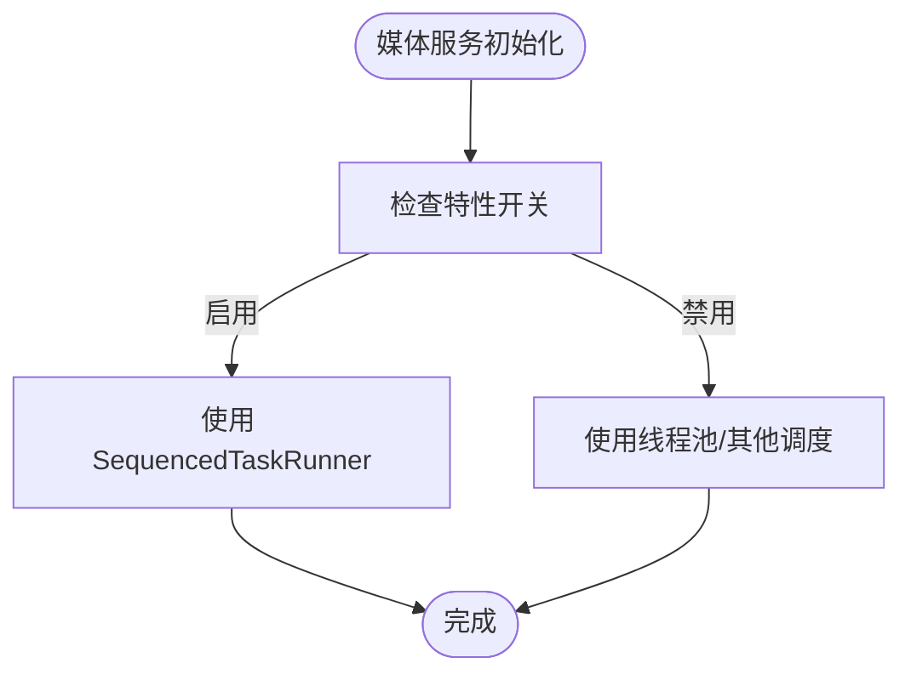
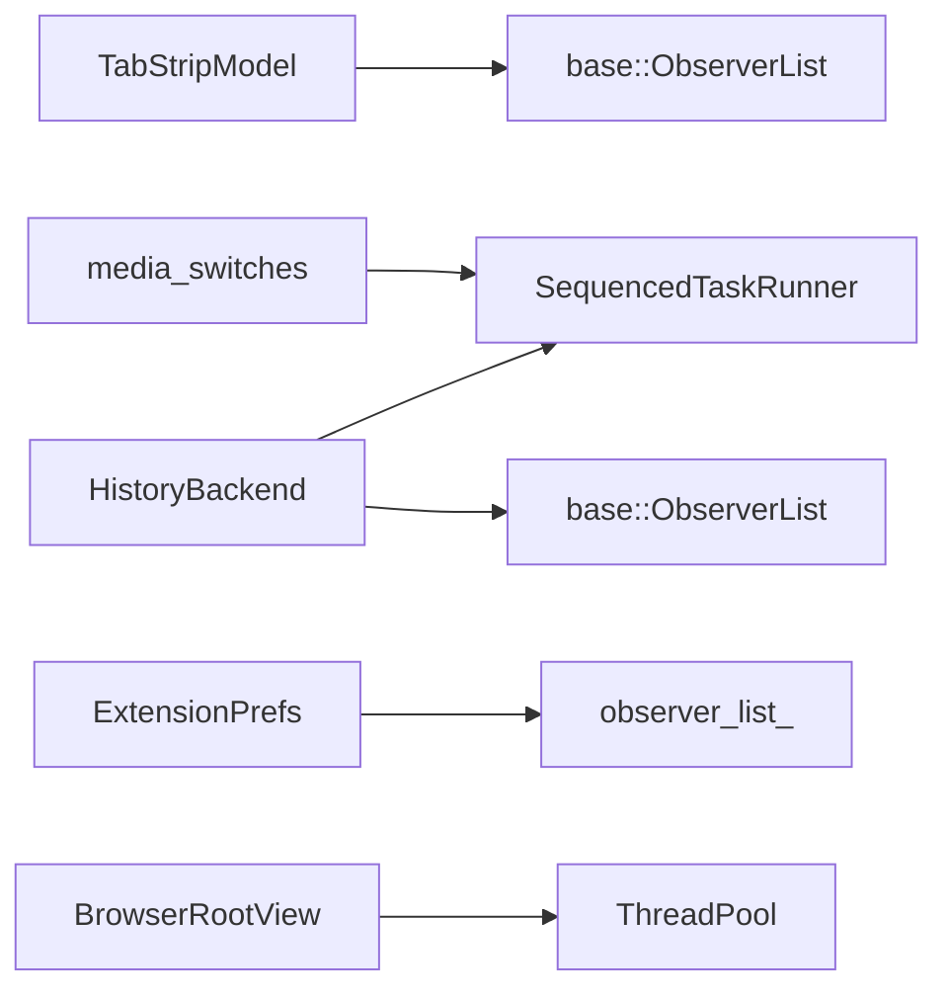

# 事件驱动架构

<cite>
**本文引用的文件**
- [tab_strip_model.cc](file://src/chrome/browser/ui/tabs/tab_strip_model.cc)
- [history_backend.h](file://src/components/history/core/browser/history_backend.h)
- [history_backend.cc](file://src/components/history/core/browser/history_backend.cc)
- [extension_prefs.cc](file://src/extensions/browser/extension_prefs.cc)
- [browser_root_view.cc](file://src/chrome/browser/ui/views/frame/browser_root_view.cc)
- [media_switches.cc](file://src/media/base/media_switches.cc)
</cite>

## 目录
1. [简介](#简介)
2. [项目结构](#项目结构)
3. [核心组件](#核心组件)
4. [架构总览](#架构总览)
5. [详细组件分析](#详细组件分析)
6. [依赖关系分析](#依赖关系分析)
7. [性能考虑](#性能考虑)
8. [故障排查指南](#故障排查指南)
9. [结论](#结论)
10. [附录](#附录)

## 简介
本文件面向 MCloud Browser（基于 Chromium）的事件驱动架构，系统性阐述回调系统、观察者模式、异步任务调度与内存安全机制，并结合仓库中的实际代码片段给出可视化流程图与时序图。重点覆盖：
- 观察者模式的订阅/发布/通知流程
- 任务队列、优先级与线程池的使用
- 弱引用与循环引用检测、资源释放策略
- 批处理、延迟执行与取消机制等性能优化手段
- 自定义事件处理器与回调链的实现要点

## 项目结构
围绕事件驱动的核心实现分布在以下模块：
- UI 层模型与观察者：标签页条模型 TabStripModel 使用 base::ObserverList 管理观察者，并在状态变更时统一分发事件。
- 数据层后端：HistoryBackend 维护数据库任务队列、顺序任务运行器与观察者列表，提供 AddObserver/RemoveObserver 接口。
- 扩展偏好：ExtensionPrefs 通过 observer_list_ 广播扩展启用/禁用原因变化等事件。
- UI 交互与异步任务：BrowserRootView 在拖放过滤等场景中通过 ThreadPool 提交可阻塞任务并回调结果。
- 媒体服务特性开关：media_switches 中定义是否使用 SequencedTaskRunner 的开关，体现任务序列化的能力选择。

**图示来源**
- [tab_strip_model.cc:318-344](file://src/chrome/browser/ui/tabs/tab_strip_model.cc#L318-L344)
- [history_backend.h:621-624](file://src/components/history/core/browser/history_backend.h#L621-L624)
- [history_backend.h:1149-1161](file://src/components/history/core/browser/history_backend.h#L1149-L1161)
- [extension_prefs.cc:1996-2002](file://src/extensions/browser/extension_prefs.cc#L1996-L2002)
- [browser_root_view.cc:287-295](file://src/chrome/browser/ui/views/frame/browser_root_view.cc#L287-L295)
- [media_switches.cc:1389-1418](file://src/media/base/media_switches.cc#L1389-L1418)

**章节来源**
- [tab_strip_model.cc:318-344](file://src/chrome/browser/ui/tabs/tab_strip_model.cc#L318-L344)
- [history_backend.h:621-624](file://src/components/history/core/browser/history_backend.h#L621-L624)
- [history_backend.h:1149-1161](file://src/components/history/core/browser/history_backend.h#L1149-L1161)
- [extension_prefs.cc:1996-2002](file://src/extensions/browser/extension_prefs.cc#L1996-L2002)
- [browser_root_view.cc:287-295](file://src/chrome/browser/ui/views/frame/browser_root_view.cc#L287-L295)
- [media_switches.cc:1389-1418](file://src/media/base/media_switches.cc#L1389-L1418)

## 核心组件
- TabStripModel：集中管理标签页集合的状态变更，并通过基类 ObserverList 向所有注册的观察者发送统一变更事件。
- HistoryBackend：封装历史数据的顺序化访问与持久化，维护任务队列与已发布的 DB 任务句柄，支持关闭时取消未完成任务。
- ExtensionPrefs：以观察者模式对外暴露扩展偏好变更事件，确保多订阅者一致响应。
- BrowserRootView：在 UI 交互中利用线程池进行耗时计算，并以弱引用回调避免悬垂指针。
- media_switches：通过特性开关控制媒体相关服务是否使用顺序任务运行器，影响并发与序列化行为。

**章节来源**
- [tab_strip_model.cc:318-344](file://src/chrome/browser/ui/tabs/tab_strip_model.cc#L318-L344)
- [history_backend.cc:322-356](file://src/components/history/core/browser/history_backend.cc#L322-L356)
- [history_backend.cc:444-460](file://src/components/history/core/browser/history_backend.cc#L444-L460)
- [extension_prefs.cc:1996-2028](file://src/extensions/browser/extension_prefs.cc#L1996-L2028)
- [browser_root_view.cc:287-295](file://src/chrome/browser/ui/views/frame/browser_root_view.cc#L287-L295)
- [media_switches.cc:1389-1418](file://src/media/base/media_switches.cc#L1389-L1418)

## 架构总览
MCloud Browser 的事件驱动架构由“事件源 + 观察者 + 任务调度”三部分构成：
- 事件源：如 TabStripModel、HistoryBackend、ExtensionPrefs 等，负责状态变更或业务事件产生。
- 观察者：实现对应 Observer 接口的对象，通过 AddObserver/RemoveObserver 注册与注销。
- 任务调度：使用 base::SequencedTaskRunner、base::ThreadPool、base::CancelableOnceClosure 等工具，将事件处理与副作用（如 IO、计算）解耦到合适的线程与优先级。

[此图为概念性时序图，不直接映射具体源码文件]

## 详细组件分析

### 组件A：TabStripModel 观察者分发
- 职责：维护标签页集合，监听内部状态变化，并向所有观察者发送统一变更事件。
- 关键流程：
  - 设置/添加/移除观察者：SetTabStripUI/AddObserver/RemoveObserver。
  - 变更分发：OnChange 中遍历 observers_ 并调用 OnTabStripModelChanged。
  - 重入保护：ReentrancyCheck 防止同一线程内重入导致的不一致。
- 复杂度：观察者遍历为 O(N)，N 为观察者数量；典型场景下 N 较小。
- 优化点：批量变更合并、按需通知（仅通知受影响的子集）。

**图示来源**
- [tab_strip_model.cc:318-344](file://src/chrome/browser/ui/tabs/tab_strip_model.cc#L318-L344)
- [tab_strip_model.cc:681-688](file://src/chrome/browser/ui/tabs/tab_strip_model.cc#L681-L688)

**章节来源**
- [tab_strip_model.cc:318-344](file://src/chrome/browser/ui/tabs/tab_strip_model.cc#L318-L344)
- [tab_strip_model.cc:681-688](file://src/chrome/browser/ui/tabs/tab_strip_model.cc#L681-L688)

### 组件B：HistoryBackend 任务队列与观察者
- 职责：管理历史数据库的顺序访问、任务排队与取消，以及向观察者广播历史相关事件。
- 关键要素：
  - 任务队列：queued_history_db_tasks_ 保存待执行的 DB 任务。
  - 已发布任务：posted_history_db_task_ 用于在关闭时取消。
  - 顺序执行：task_runner_ 为 SequencedTaskRunner，保证单线程串行执行。
  - 观察者：observers_ 为 Unchecked 列表，允许在遍历期间安全移除。
- 关闭流程：Closing() 中取消已发布任务并清空队列，避免销毁期访问。

**图示来源**
- [history_backend.h:621-624](file://src/components/history/core/browser/history_backend.h#L621-L624)
- [history_backend.h:1149-1161](file://src/components/history/core/browser/history_backend.h#L1149-L1161)
- [history_backend.cc:322-356](file://src/components/history/core/browser/history_backend.cc#L322-L356)
- [history_backend.cc:444-460](file://src/components/history/core/browser/history_backend.cc#L444-L460)

**章节来源**
- [history_backend.h:621-624](file://src/components/history/core/browser/history_backend.h#L621-L624)
- [history_backend.h:1149-1161](file://src/components/history/core/browser/history_backend.h#L1149-L1161)
- [history_backend.cc:322-356](file://src/components/history/core/browser/history_backend.cc#L322-L356)
- [history_backend.cc:444-460](file://src/components/history/core/browser/history_backend.cc#L444-L460)

### 组件C：ExtensionPrefs 观察者通知
- 职责：当扩展禁用原因或启用状态发生变化时，通知所有订阅者。
- 关键流程：
  - AddObserver/RemoveObserver 管理订阅。
  - OnDisableReasonsChanged 中遍历 observer_list_ 并调用相应回调。
  - 根据新旧状态决定是否更新持久化值并再次通知。

**图示来源**
- [extension_prefs.cc:1996-2028](file://src/extensions/browser/extension_prefs.cc#L1996-L2028)

**章节来源**
- [extension_prefs.cc:1996-2028](file://src/extensions/browser/extension_prefs.cc#L1996-L2028)

### 组件D：BrowserRootView 异步任务与弱引用回调
- 职责：在拖放等 UI 交互中进行 URL MIME 类型过滤等耗时操作，并将结果回调到 UI 线程。
- 关键流程：
  - 使用 ThreadPool::PostTaskAndReplyWithResult 提交可阻塞任务，指定 MayBlock 与 USER_VISIBLE 优先级。
  - 回调中使用弱引用工厂获取 WeakPtr，避免对象生命周期结束后仍被调用。
- 性能考量：将 CPU 密集或 IO 密集工作移出 UI 线程，降低界面卡顿风险。

**图示来源**
- [browser_root_view.cc:287-295](file://src/chrome/browser/ui/views/frame/browser_root_view.cc#L287-L295)

**章节来源**
- [browser_root_view.cc:287-295](file://src/chrome/browser/ui/views/frame/browser_root_view.cc#L287-L295)

### 组件E：媒体服务任务序列化策略
- 职责：通过特性开关控制媒体服务是否使用 SequencedTaskRunner，影响并发与序列化行为。
- 关键点：
  - kUseSequencedTaskRunnerForMediaService：默认关闭，启用后媒体服务走顺序任务。
  - kUseSequencedTaskRunnerForMojoVEAProvider：在非 Windows 平台可按需启用。
  - kUseTaskRunnerForMojoAudioDecoderService：音频解码器可独立序列以避免阻塞。

**图示来源**
- [media_switches.cc:1389-1418](file://src/media/base/media_switches.cc#L1389-L1418)

**章节来源**
- [media_switches.cc:1389-1418](file://src/media/base/media_switches.cc#L1389-L1418)

## 依赖关系分析
- 松耦合：事件源通过抽象的 Observer 接口与实现解耦，便于替换与测试。
- 顺序与并发：HistoryBackend 使用 SequencedTaskRunner 保证顺序访问；UI 层使用 ThreadPool 提升吞吐。
- 取消与清理：HistoryBackend 在关闭时取消已发布任务，避免销毁期访问。
- 外部依赖：base::ObserverList、base::SequencedTaskRunner、base::ThreadPool、base::CancelableOnceClosure 等基础库支撑事件与任务调度。

**图示来源**
- [tab_strip_model.cc:318-344](file://src/chrome/browser/ui/tabs/tab_strip_model.cc#L318-L344)
- [history_backend.h:1149-1161](file://src/components/history/core/browser/history_backend.h#L1149-L1161)
- [extension_prefs.cc:1996-2002](file://src/extensions/browser/extension_prefs.cc#L1996-L2002)
- [browser_root_view.cc:287-295](file://src/chrome/browser/ui/views/frame/browser_root_view.cc#L287-L295)
- [media_switches.cc:1389-1418](file://src/media/base/media_switches.cc#L1389-L1418)

**章节来源**
- [tab_strip_model.cc:318-344](file://src/chrome/browser/ui/tabs/tab_strip_model.cc#L318-L344)
- [history_backend.h:1149-1161](file://src/components/history/core/browser/history_backend.h#L1149-L1161)
- [extension_prefs.cc:1996-2002](file://src/extensions/browser/extension_prefs.cc#L1996-L2002)
- [browser_root_view.cc:287-295](file://src/chrome/browser/ui/views/frame/browser_root_view.cc#L287-L295)
- [media_switches.cc:1389-1418](file://src/media/base/media_switches.cc#L1389-L1418)

## 性能考虑
- 事件批处理：在 TabStripModel 中可将多次变更合并为一次通知，减少观察者重复处理开销。
- 延迟执行：对非紧急的通知可使用 DelayedTaskRunner 或延时回调，避免阻塞主线程。
- 取消机制：HistoryBackend 在关闭时取消 posted_history_db_task_，避免无效执行与资源泄漏。
- 优先级管理：UI 交互任务使用 USER_VISIBLE 优先级，兼顾响应性与吞吐。
- 序列化与并发：媒体服务可通过特性开关选择 SequencedTaskRunner，避免跨线程竞争与死锁。

[本节为通用指导，不直接分析具体文件]

## 故障排查指南
- 观察者未收到通知：
  - 确认是否正确调用 AddObserver/RemoveObserver。
  - 检查是否在正确的线程上触发事件（UI 线程 vs 后台线程）。
- 任务未执行或被取消：
  - 检查任务是否已被 CancelableOnceClosure 取消。
  - 确认任务运行器是否可用（例如关闭阶段）。
- 回调悬垂指针：
  - 使用 WeakPtr 包装回调目标对象，避免对象销毁后仍被调用。
- 性能问题：
  - 评估任务是否应移至后台线程。
  - 合并高频事件，降低通知频率。

**章节来源**
- [history_backend.cc:444-460](file://src/components/history/core/browser/history_backend.cc#L444-L460)
- [browser_root_view.cc:287-295](file://src/chrome/browser/ui/views/frame/browser_root_view.cc#L287-L295)

## 结论
MCloud Browser 的事件驱动架构以观察者模式为核心，结合顺序任务运行器与线程池，实现了高内聚、低耦合的事件分发与异步处理。通过合理的取消机制、弱引用与优先级管理，系统在复杂交互与大数据量场景下仍能保持良好性能与稳定性。建议在新增事件处理器时遵循现有模式：明确事件源、规范观察者接口、合理选择任务调度方式，并关注批处理与取消策略以提升整体效率。

[本节为总结性内容，不直接分析具体文件]

## 附录
- 自定义事件处理器示例要点：
  - 定义事件源与观察者接口，使用 base::ObserverList 管理订阅。
  - 在状态变更处遍历观察者并调用回调。
  - 对耗时逻辑使用 SequencedTaskRunner 或 ThreadPool，并通过 WeakPtr 安全回调。
  - 在关闭或异常路径中取消未完成任务，避免资源泄漏。

[本节为概念性指导，不直接分析具体文件]