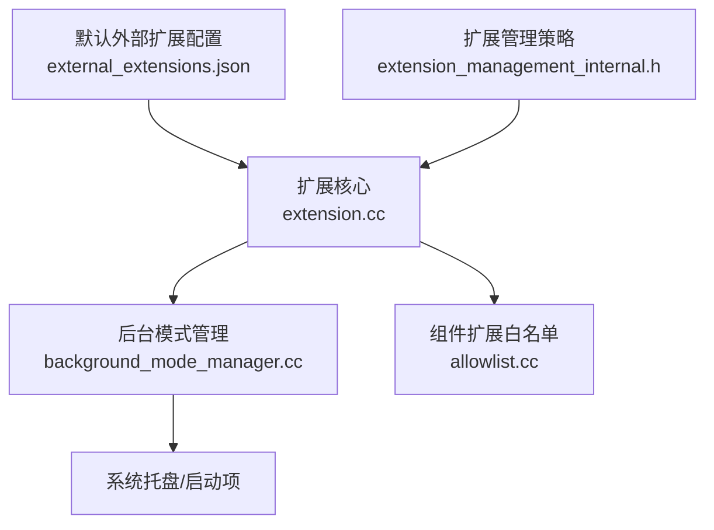
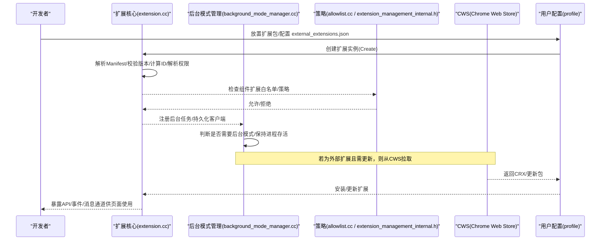
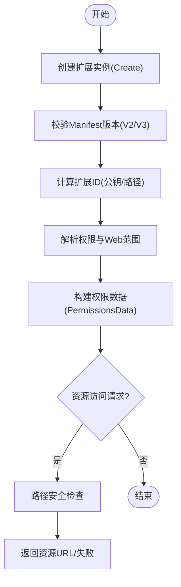
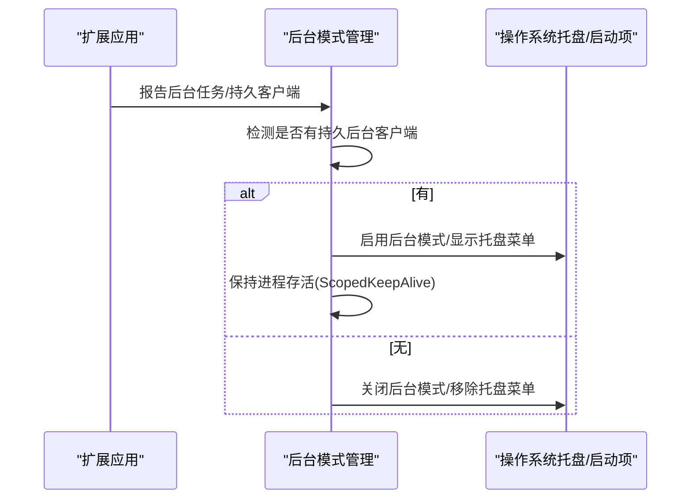
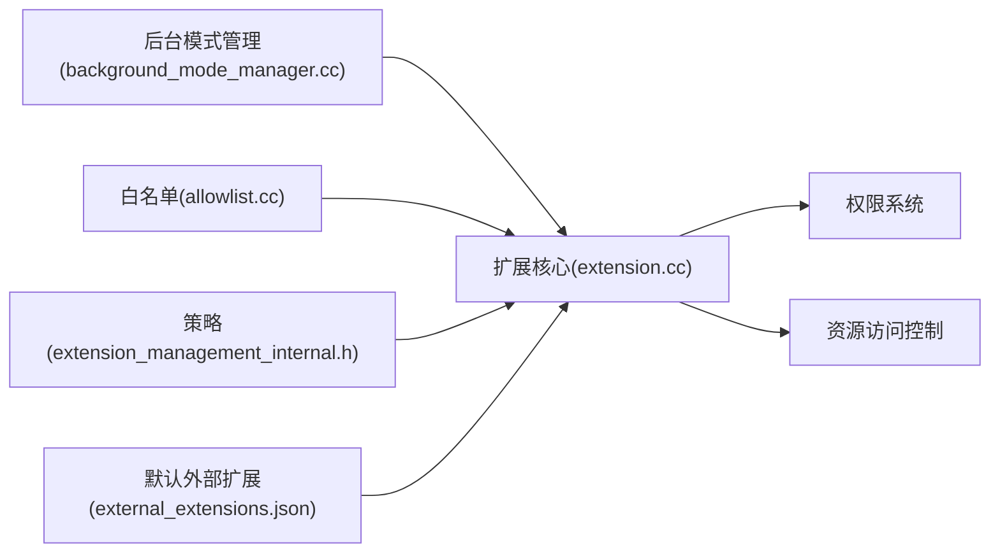

# 扩展机制

<cite>
**本文引用的文件**
- [extension.cc](file://src/extensions/common/extension.cc)
- [background_mode_manager.cc](file://src/chrome/browser/background/extensions/background_mode_manager.cc)
- [allowlist.cc](file://src/chrome/browser/extensions/component_extensions_allowlist/allowlist.cc)
- [external_extensions.json](file://infra/default_apps/external_extensions.json)
- [extension_management_internal.h](file://src/chrome/browser/extensions/extension_management_internal.h)
</cite>

## 目录
1. [简介](#简介)
2. [项目结构](#项目结构)
3. [核心组件](#核心组件)
4. [架构总览](#架构总览)
5. [详细组件分析](#详细组件分析)
6. [依赖关系分析](#依赖关系分析)
7. [性能考量](#性能考量)
8. [故障排查指南](#故障排查指南)
9. [结论](#结论)
10. [附录：开发指南与最佳实践](#附录开发指南与最佳实践)

## 简介
本文件面向 MCloud Browser（基于 Chromium）的扩展机制，系统性阐述 Chrome 扩展在浏览器中的生命周期、权限与安全模型、与浏览器的集成方式（API 暴露、事件监听、消息传递）、加载与管理流程（安装、更新、卸载），以及渲染进程隔离与安全模型。同时提供 Manifest 配置要点、调试技巧、针对特定站点（如 Bilibili、YouTube）的优化建议与最佳实践。内容严格基于仓库内源码与配置文件进行分析与归纳。

## 项目结构
围绕扩展机制的关键代码与配置分布如下：
- 扩展核心对象与清单解析：位于 src/extensions/common/extension.cc，负责扩展 ID 计算、Manifest 版本校验、权限解析、资源访问控制等。
- 后台模式管理：位于 src/chrome/browser/background/extensions/background_mode_manager.cc，负责后台运行、保持进程存活、托盘菜单与启动项联动。
- 组件扩展白名单：位于 src/chrome/browser/extensions/component_extensions_allowlist/allowlist.cc，限制可加载的内置/组件扩展。
- 默认外部扩展：位于 infra/default_apps/external_extensions.json，定义新配置文件中动态下载并安装的默认扩展。
- 扩展管理策略：位于 src/chrome/browser/extensions/extension_management_internal.h，定义安装模式、权限阻断、主机访问策略、最低版本要求等管理字段。

图表来源
- [extension.cc:235-287](file://src/extensions/common/extension.cc#L235-L287)
- [background_mode_manager.cc:272-333](file://src/chrome/browser/background/extensions/background_mode_manager.cc#L272-L333)
- [allowlist.cc:36-83](file://src/chrome/browser/extensions/component_extensions_allowlist/allowlist.cc#L36-L83)
- [external_extensions.json:1-14](file://infra/default_apps/external_extensions.json#L1-L14)
- [extension_management_internal.h:45-158](file://src/chrome/browser/extensions/extension_management_internal.h#L45-L158)

章节来源
- [extension.cc:235-287](file://src/extensions/common/extension.cc#L235-L287)
- [background_mode_manager.cc:272-333](file://src/chrome/browser/background/extensions/background_mode_manager.cc#L272-L333)
- [allowlist.cc:36-83](file://src/chrome/browser/extensions/component_extensions_allowlist/allowlist.cc#L36-L83)
- [external_extensions.json:1-14](file://infra/default_apps/external_extensions.json#L1-L14)
- [extension_management_internal.h:45-158](file://src/chrome/browser/extensions/extension_management_internal.h#L45-L158)

## 核心组件
- 扩展核心对象（Extension）：负责创建扩展实例、解析 Manifest、生成扩展 ID、权限集合构建、资源 URL 解析与安全检查、版本与指纹处理等。
- 后台模式管理器（BackgroundModeManager）：管理浏览器是否进入后台模式、维持进程存活、响应扩展应用列表变化、更新系统托盘菜单与开机自启设置。
- 组件扩展白名单（Allowlist）：限定哪些组件扩展可被加载，未在白名单内的组件扩展将被拒绝加载并记录错误。
- 默认外部扩展（external_extensions.json）：为新配置文件动态从 CWS 下载并安装指定扩展（例如 uBlock Origin）。
- 扩展管理策略（IndividualSettings/GlobalSettings）：支持按扩展或更新源粒度进行安装模式、权限阻断、主机访问策略、最低版本要求等管控。

章节来源
- [extension.cc:235-287](file://src/extensions/common/extension.cc#L235-L287)
- [background_mode_manager.cc:272-333](file://src/chrome/browser/background/extensions/background_mode_manager.cc#L272-L333)
- [allowlist.cc:36-83](file://src/chrome/browser/extensions/component_extensions_allowlist/allowlist.cc#L36-L83)
- [external_extensions.json:1-14](file://infra/default_apps/external_extensions.json#L1-L14)
- [extension_management_internal.h:45-158](file://src/chrome/browser/extensions/extension_management_internal.h#L45-L158)

## 架构总览
MCloud Browser 的扩展体系由“扩展核心 + 后台模式管理 + 策略与白名单”构成。扩展通过 Manifest 声明能力与权限，核心模块负责解析与校验；后台模式管理器确保具备后台任务的扩展能持续运行；策略与白名单保障安全边界与合规性；默认外部扩展简化部署。

图表来源
- [extension.cc:235-287](file://src/extensions/common/extension.cc#L235-L287)
- [background_mode_manager.cc:272-333](file://src/chrome/browser/background/extensions/background_mode_manager.cc#L272-L333)
- [allowlist.cc:36-83](file://src/chrome/browser/extensions/component_extensions_allowlist/allowlist.cc#L36-L83)
- [external_extensions.json:1-14](file://infra/default_apps/external_extensions.json#L1-L14)
- [extension_management_internal.h:45-158](file://src/chrome/browser/extensions/extension_management_internal.h#L45-L158)

## 详细组件分析

### 扩展核心（Extension）
- 功能要点
  - 支持 Manifest V2/V3，并在开发模式下对 MV2 给出弃用警告。
  - 根据公钥或路径计算扩展 ID，保证跨平台稳定标识。
  - 解析权限集、Web 范围（extent）、共享特性，构建权限数据。
  - 提供资源 URL 解析与安全检查，防止越界访问。
  - 版本字符串与差分指纹用于更新与增量升级。
- 关键流程
  - 创建扩展：Create(path, location, value, flags, explicit_id, error)。
  - 初始化：InitFromValue(flags, error) 完成版本、必需特性、权限解析。
  - 资源访问：GetResource(relative_path) 进行路径合法性校验。
  - 版本与指纹：VersionString()、DifferentialFingerprint()。

图表来源
- [extension.cc:235-287](file://src/extensions/common/extension.cc#L235-L287)
- [extension.cc:328-356](file://src/extensions/common/extension.cc#L328-L356)
- [extension.cc:516-533](file://src/extensions/common/extension.cc#L516-L533)

章节来源
- [extension.cc:235-287](file://src/extensions/common/extension.cc#L235-L287)
- [extension.cc:328-356](file://src/extensions/common/extension.cc#L328-L356)
- [extension.cc:516-533](file://src/extensions/common/extension.cc#L516-L533)

### 后台模式管理（BackgroundModeManager）
- 功能要点
  - 监听扩展应用列表变化，识别新的后台应用并通知用户。
  - 在存在持久后台客户端时保持浏览器进程存活，避免无窗口退出。
  - 维护系统托盘菜单，支持打开任务管理器、退出、进入设置等。
  - 与开机自启策略联动（Windows 等平台）。
- 关键流程
  - 注册/注销 Profile：RegisterProfile/UnregisterProfile。
  - 扩展就绪回调：OnExtensionsReady 释放启动期 KeepAlive。
  - 后台模式开关：EnableBackgroundMode/DisableBackgroundMode。
  - 状态更新：UpdateKeepAliveAndTrayIcon 刷新托盘图标与菜单。

图表来源
- [background_mode_manager.cc:272-333](file://src/chrome/browser/background/extensions/background_mode_manager.cc#L272-L333)
- [background_mode_manager.cc:680-752](file://src/chrome/browser/background/extensions/background_mode_manager.cc#L680-L752)

章节来源
- [background_mode_manager.cc:272-333](file://src/chrome/browser/background/extensions/background_mode_manager.cc#L272-L333)
- [background_mode_manager.cc:680-752](file://src/chrome/browser/background/extensions/background_mode_manager.cc#L680-L752)

### 组件扩展白名单（Allowlist）
- 功能要点
  - 仅允许白名单内的组件扩展加载，未列入的组件扩展将被拒绝并记录错误。
  - 支持按扩展 ID 与 Manifest 资源 ID 两种方式进行白名单判定。
  - 在不同平台（如 ChromeOS）提供额外条件白名单。
- 影响
  - 防止非预期组件扩展被加载，提升安全性与稳定性。

章节来源
- [allowlist.cc:36-83](file://src/chrome/browser/extensions/component_extensions_allowlist/allowlist.cc#L36-L83)

### 默认外部扩展（external_extensions.json）
- 功能要点
  - 在新配置文件中动态从 CWS 下载并安装指定的扩展（示例：uBlock Origin）。
  - 通过 external_update_url 指定更新源。
- 使用场景
  - 企业或发行版预置常用扩展，简化用户初始体验。

章节来源
- [external_extensions.json:1-14](file://infra/default_apps/external_extensions.json#L1-L14)

### 扩展管理策略（IndividualSettings/GlobalSettings）
- 功能要点
  - 安装模式：强制安装、推荐安装、允许安装、阻止安装。
  - 权限阻断：blocked_permissions 阻止特定 API 权限。
  - 主机访问策略：policy_blocked_hosts/policy_allowed_hosts 控制运行时主机访问。
  - 最低版本要求：minimum_version_required 禁用旧版本。
  - 全局策略：install_sources、allowed_types、manifest_v2_setting、unpublished_availability_setting。
- 影响
  - 提供细粒度的管理与安全控制，适用于企业环境或受控分发。

章节来源
- [extension_management_internal.h:45-158](file://src/chrome/browser/extensions/extension_management_internal.h#L45-L158)
- [extension_management_internal.h:160-196](file://src/chrome/browser/extensions/extension_management_internal.h#L160-L196)

## 依赖关系分析
- 扩展核心依赖 Manifest 解析与权限系统，构建权限数据后交由上层服务使用。
- 后台模式管理依赖扩展应用列表变化事件，驱动进程生命周期与 UI 状态。
- 白名单与策略作为安全门控，拦截不合规的组件扩展与行为。
- 默认外部扩展通过配置文件注入，触发 CWS 下载与安装流程。

图表来源
- [extension.cc:235-287](file://src/extensions/common/extension.cc#L235-L287)
- [background_mode_manager.cc:272-333](file://src/chrome/browser/background/extensions/background_mode_manager.cc#L272-L333)
- [allowlist.cc:36-83](file://src/chrome/browser/extensions/component_extensions_allowlist/allowlist.cc#L36-L83)
- [extension_management_internal.h:45-158](file://src/chrome/browser/extensions/extension_management_internal.h#L45-L158)
- [external_extensions.json:1-14](file://infra/default_apps/external_extensions.json#L1-L14)

章节来源
- [extension.cc:235-287](file://src/extensions/common/extension.cc#L235-L287)
- [background_mode_manager.cc:272-333](file://src/chrome/browser/background/extensions/background_mode_manager.cc#L272-L333)
- [allowlist.cc:36-83](file://src/chrome/browser/extensions/component_extensions_allowlist/allowlist.cc#L36-L83)
- [extension_management_internal.h:45-158](file://src/chrome/browser/extensions/extension_management_internal.h#L45-L158)
- [external_extensions.json:1-14](file://infra/default_apps/external_extensions.json#L1-L14)

## 性能考量
- 扩展创建与解析：避免在热路径中进行重型解析，尽量延迟到首次使用时。
- 权限解析：最小化权限声明，减少权限检查开销。
- 资源访问：合理使用相对路径与缓存，避免频繁 I/O。
- 后台模式：仅在必要时保持进程存活，避免常驻导致内存占用过高。
- 更新机制：利用差分指纹与增量更新，降低带宽与时间成本。

[本节为通用指导，不直接分析具体文件]

## 故障排查指南
- 组件扩展未加载
  - 现象：日志提示组件扩展不在白名单。
  - 排查：确认扩展 ID 是否在 allowlist 中，或是否为受支持的 Manifest 资源 ID。
  - 参考：[allowlist.cc:36-83](file://src/chrome/browser/extensions/component_extensions_allowlist/allowlist.cc#L36-L83)
- 扩展无法安装/更新
  - 现象：Manifest 版本不支持或更新源不可达。
  - 排查：检查 Manifest 版本范围、external_update_url 可达性、策略是否阻止安装。
  - 参考：[extension.cc:92-151](file://src/extensions/common/extension.cc#L92-L151)、[external_extensions.json:1-14](file://infra/default_apps/external_extensions.json#L1-L14)、[extension_management_internal.h:45-158](file://src/chrome/browser/extensions/extension_management_internal.h#L45-L158)
- 后台模式异常
  - 现象：浏览器在无窗口情况下退出或托盘菜单不更新。
  - 排查：确认是否存在持久后台客户端、后台模式偏好是否启用、KeepAlive 是否正确释放。
  - 参考：[background_mode_manager.cc:272-333](file://src/chrome/browser/background/extensions/background_mode_manager.cc#L272-L333)、[background_mode_manager.cc:680-752](file://src/chrome/browser/background/extensions/background_mode_manager.cc#L680-L752)

章节来源
- [allowlist.cc:36-83](file://src/chrome/browser/extensions/component_extensions_allowlist/allowlist.cc#L36-L83)
- [extension.cc:92-151](file://src/extensions/common/extension.cc#L92-L151)
- [external_extensions.json:1-14](file://infra/default_apps/external_extensions.json#L1-L14)
- [extension_management_internal.h:45-158](file://src/chrome/browser/extensions/extension_management_internal.h#L45-L158)
- [background_mode_manager.cc:272-333](file://src/chrome/browser/background/extensions/background_mode_manager.cc#L272-L333)
- [background_mode_manager.cc:680-752](file://src/chrome/browser/background/extensions/background_mode_manager.cc#L680-L752)

## 结论
MCloud Browser 的扩展机制以扩展核心为基础，结合后台模式管理与策略白名单，形成完整的安全与生命周期管理体系。通过 Manifest 解析、权限控制、资源访问安全、默认外部扩展与策略管控，既保证了扩展生态的灵活性，又确保了安全性与可控性。开发者应遵循最小权限原则、合理声明 Manifest、利用策略与白名单进行合规部署，并结合调试技巧与最佳实践提升用户体验。

[本节为总结，不直接分析具体文件]

## 附录：开发指南与最佳实践

### Manifest 配置要点
- 版本选择：优先使用 Manifest V3；如需 V2，注意弃用警告与兼容性。
- 权限声明：仅声明必要权限，避免过度授权。
- Web 范围：精确声明可访问的主机与路径，避免宽泛匹配。
- 背景脚本：如需后台任务，确保正确声明并考虑后台模式。
- 更新源：对外部扩展配置 external_update_url，确保可访问。

章节来源
- [extension.cc:92-151](file://src/extensions/common/extension.cc#L92-L151)
- [external_extensions.json:1-14](file://infra/default_apps/external_extensions.json#L1-L14)

### API 使用、事件监听与消息传递
- API 暴露：扩展通过 Manifest 声明后可在对应上下文中调用浏览器提供的 API。
- 事件监听：监听页面导航、媒体事件、剪贴板等事件，按需处理。
- 消息传递：使用扩展内部消息通道与页面脚本通信，注意权限与来源校验。
- 安全建议：对传入消息进行校验，避免执行不可信代码。

[本节为通用指导，不直接分析具体文件]

### 调试技巧
- 查看扩展日志：关注组件扩展白名单与策略相关日志。
- 验证权限：使用浏览器扩展管理界面检查已授予权限。
- 资源访问：确保相对路径合法，避免越界访问。
- 后台模式：确认后台任务是否正常运行，托盘菜单是否正常。

章节来源
- [allowlist.cc:36-83](file://src/chrome/browser/extensions/component_extensions_allowlist/allowlist.cc#L36-L83)
- [extension.cc:328-356](file://src/extensions/common/extension.cc#L328-L356)
- [background_mode_manager.cc:272-333](file://src/chrome/browser/background/extensions/background_mode_manager.cc#L272-L333)

### 针对特定网站的优化（Bilibili、YouTube）
- 精确匹配主机：在 Manifest 中声明目标网站域名，避免全量匹配。
- 最小权限：仅申请必要的 host 权限与 API。
- 内容脚本：针对页面结构编写稳定的选择器与事件处理。
- 性能优化：避免阻塞主线程，使用异步处理与节流。
- 兼容性与回退：针对不同版本页面结构提供兼容逻辑。

[本节为通用指导，不直接分析具体文件]

### 最佳实践
- 安全优先：遵循最小权限原则，严格校验输入与来源。
- 可维护性：模块化代码，清晰注释，单元测试覆盖关键逻辑。
- 可观测性：记录关键操作与错误，便于问题定位。
- 渐进式增强：优先使用现代 API，提供降级方案。

[本节为通用指导，不直接分析具体文件]