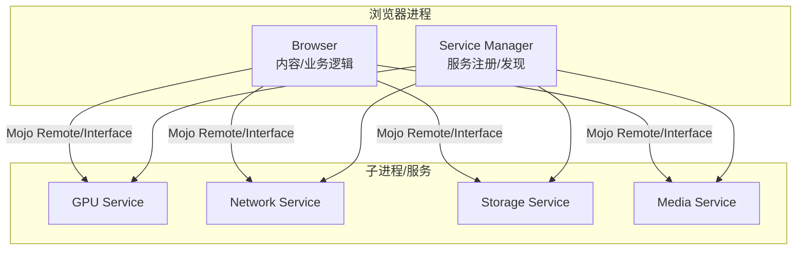
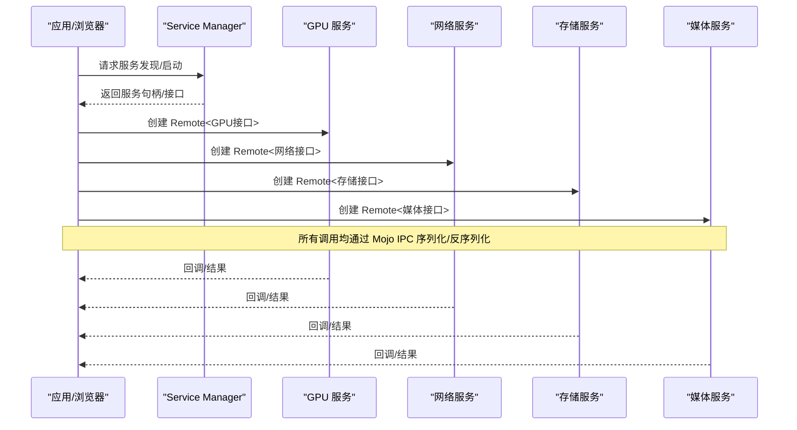
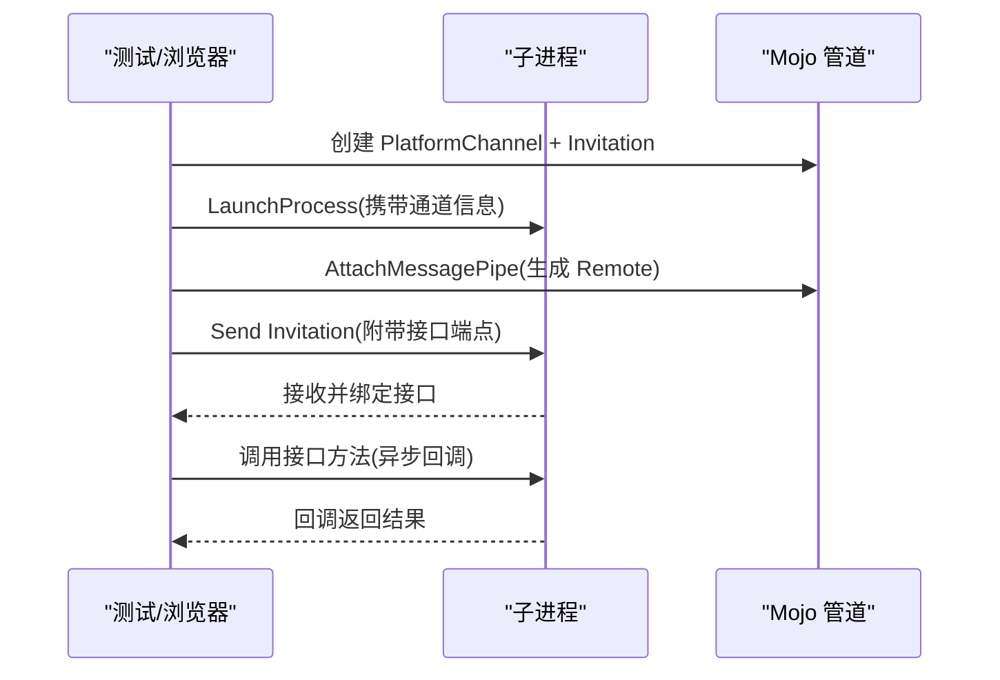
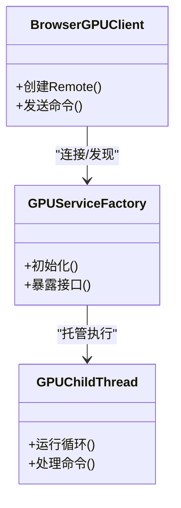
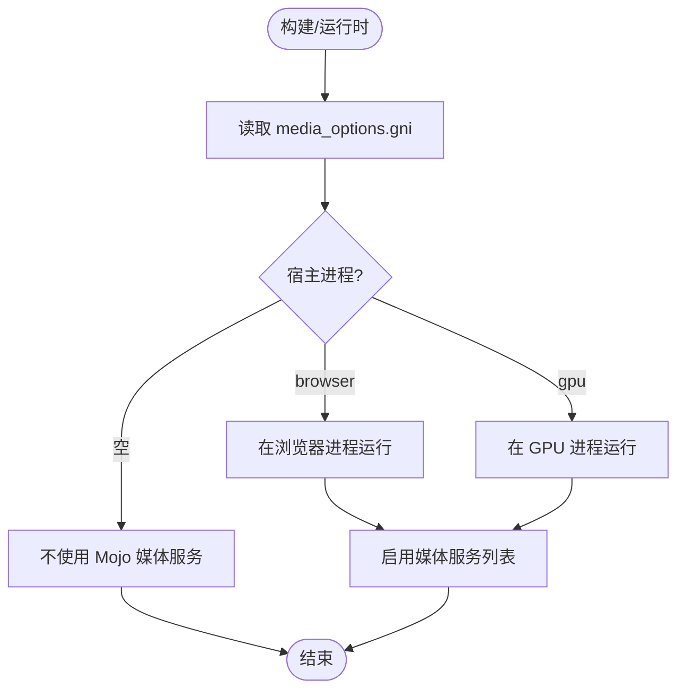
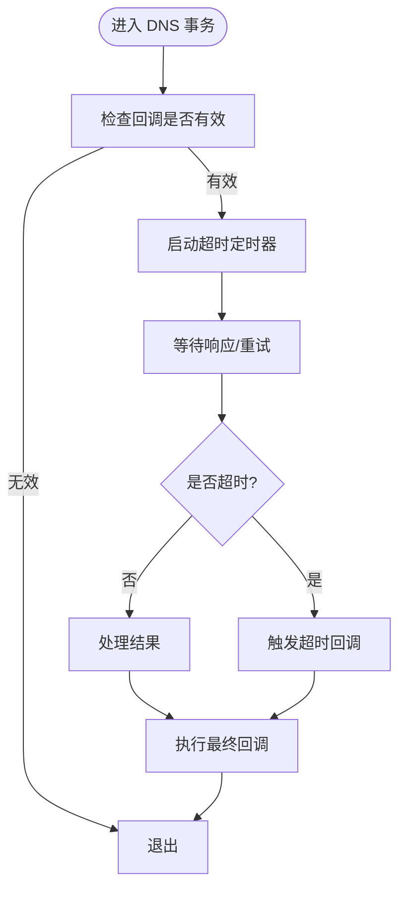
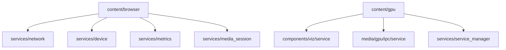
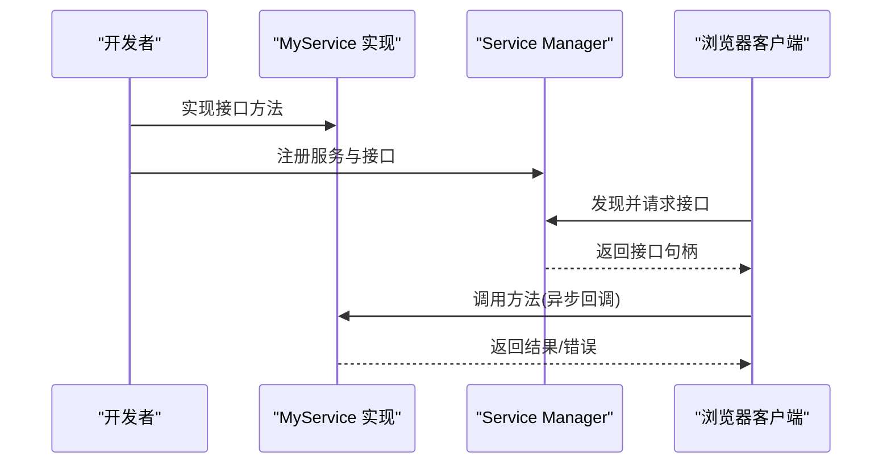

# 核心服务通信

本文引用的文件

- [launch_as_mojo_client_browsertest.cc](https://github.com/Mcloud136/Mcloud-Browser/blob/main/src/content/browser/launch_as_mojo_client_browsertest.cc)
- [BUILD.gn (content/browser)](https://github.com/Mcloud136/Mcloud-Browser/blob/main/src/content/browser/BUILD.gn)
- [BUILD.gn (content/gpu)](https://github.com/Mcloud136/Mcloud-Browser/blob/main/src/content/gpu/BUILD.gn)
- [media_options.gni](https://github.com/Mcloud136/Mcloud-Browser/blob/main/src/media/media_options.gni)
- [args.list (infra)](https://github.com/Mcloud136/Mcloud-Browser/blob/main/infra/args.list)
- [win_args.list](https://github.com/Mcloud136/Mcloud-Browser/blob/main/infra/win_args.list)
- [mac_args.list](https://github.com/Mcloud136/Mcloud-Browser/blob/main/other/Mac/mac_args.list)
- [android args.list](https://github.com/Mcloud136/Mcloud-Browser/blob/main/arm/android/args.list)
- [dns_transaction.cc](https://github.com/Mcloud136/Mcloud-Browser/blob/main/src/net/dns/dns_transaction.cc)

## 目录
1. [简介](#简介)
2. [项目结构](#项目结构)
3. [核心组件](#核心组件)
4. [架构总览](#架构总览)
5. [详细组件分析](#详细组件分析)
6. [依赖关系分析](#依赖关系分析)
7. [性能考量](#性能考量)
8. [故障排查指南](#故障排查指南)
9. [结论](#结论)
10. [附录：如何添加新服务与接口（示例）](#附录如何添加新服务与接口示例)

## 简介
本文件聚焦 MCloud Browser 的核心服务通信机制，围绕 Mojo IPC、浏览器服务架构（网络、存储、GPU）、服务注册与发现、异步调用模式（回调、错误、超时），以及调试与监控工具的使用进行系统化说明。文档同时提供“如何添加新服务和接口”的可操作指引，帮助开发者在现有架构上扩展能力。

## 项目结构
MCloud Browser 基于 Chromium 的模块化架构，核心通信通过 Mojo IPC 实现，服务以独立进程或模块形式存在，由 service_manager 统一管理与发现。关键目录与职责：
- content/browser：浏览器端逻辑，负责发起与服务端的 Mojo 连接、生命周期管理、资源协调等。
- content/gpu：GPU 子进程的入口与绑定，暴露 GPU 相关接口供浏览器端调用。
- media/media_options.gni：集中配置媒体相关 Mojo 服务的宿主进程与启用项。
- infra/*_args.list：平台构建参数汇总，包含 Mojo、GPU、媒体服务等开关。
- net/dns：DNS 事务层，体现异步调用与超时的典型实现。

[该图为概念性架构图，不直接映射具体源码文件]

## 核心组件
- Mojo IPC 客户端与远程接口：通过 mojo::Remote 建立跨进程调用通道，支持同步/异步方法、回调与错误处理。
- 服务注册与发现：service_manager 负责服务声明、启动与接口绑定；浏览器端通过名称或类型查找并连接。
- GPU 服务：content/gpu 暴露 GPU 相关接口，受构建参数控制是否启用及运行位置。
- 媒体服务：通过 media_options.gni 配置哪些媒体功能走 Mojo 以及宿主进程（browser/gpu）。
- DNS 异步与超时：net/dns 展示了典型的异步任务、重试与超时回调流程。

**章节来源**
- [BUILD.gn (content/browser):223-256](https://github.com/Mcloud136/Mcloud-Browser/blob/main/src/content/browser/BUILD.gn#L223-L256)
- [BUILD.gn (content/gpu):33-84](https://github.com/Mcloud136/Mcloud-Browser/blob/main/src/content/gpu/BUILD.gn#L33-L84)
- [media_options.gni:286-337](https://github.com/Mcloud136/Mcloud-Browser/blob/main/src/media/media_options.gni#L286-L337)
- [dns_transaction.cc:1720-1762](https://github.com/Mcloud136/Mcloud-Browser/blob/main/src/net/dns/dns_transaction.cc#L1720-L1762)

## 架构总览
下图展示浏览器进程与各类服务之间的 Mojo 通信路径，包括服务发现、接口绑定、消息传递与回调返回。

[该图为概念性序列图，不直接映射具体源码文件]

## 详细组件分析

### Mojo IPC 客户端与远程接口
- 使用 mojo::Remote 绑定远端接口，支持异步回调与可选版本参数。
- 通过 PlatformChannel 与 Invitation 在进程间传递管道端点，完成首次握手。
- 测试用例展示了完整的“启动子进程—传递邀请—绑定接口—调用—关闭”的流程。

**图示来源**
- [launch_as_mojo_client_browsertest.cc:119-136](https://github.com/Mcloud136/Mcloud-Browser/blob/main/src/content/browser/launch_as_mojo_client_browsertest.cc#L119-L136)
- [launch_as_mojo_client_browsertest.cc:160-184](https://github.com/Mcloud136/Mcloud-Browser/blob/main/src/content/browser/launch_as_mojo_client_browsertest.cc#L160-L184)

**章节来源**
- [launch_as_mojo_client_browsertest.cc:119-136](https://github.com/Mcloud136/Mcloud-Browser/blob/main/src/content/browser/launch_as_mojo_client_browsertest.cc#L119-L136)
- [launch_as_mojo_client_browsertest.cc:160-184](https://github.com/Mcloud136/Mcloud-Browser/blob/main/src/content/browser/launch_as_mojo_client_browsertest.cc#L160-L184)

### GPU 服务注册与调用
- content/gpu 目标定义了 GPU 子进程所需源文件与依赖，包括服务工厂、主线程、绑定器等。
- 通过 service_manager 暴露 GPU 接口，浏览器端通过 Remote 调用渲染/合成相关能力。
- 构建时可通过 GN 参数控制是否启用 GPU 服务日志与特性。

**图示来源**
- [BUILD.gn (content/gpu):33-84](https://github.com/Mcloud136/Mcloud-Browser/blob/main/src/content/gpu/BUILD.gn#L33-L84)

**章节来源**
- [BUILD.gn (content/gpu):33-84](https://github.com/Mcloud136/Mcloud-Browser/blob/main/src/content/gpu/BUILD.gn#L33-L84)

### 媒体服务（Mojo Media Services）
- media_options.gni 定义默认启用的媒体服务列表与宿主进程（browser/gpu）。
- 可配置项包括 renderer、cdm、audio_decoder、video_decoder 等，不同平台有不同默认值。
- 当 enable_library_cdms 为真时，CDM 服务运行在独立的 utility 进程，其他服务仍按 host 配置运行。

**图示来源**
- [media_options.gni:286-337](https://github.com/Mcloud136/Mcloud-Browser/blob/main/src/media/media_options.gni#L286-L337)

**章节来源**
- [media_options.gni:286-337](https://github.com/Mcloud136/Mcloud-Browser/blob/main/src/media/media_options.gni#L286-L337)
- [args.list (infra):3815-3843](https://github.com/Mcloud136/Mcloud-Browser/blob/main/infra/args.list#L3815-L3843)
- [win_args.list:3587-3615](https://github.com/Mcloud136/Mcloud-Browser/blob/main/infra/win_args.list#L3587-L3615)
- [mac_args.list:3392-3424](https://github.com/Mcloud136/Mcloud-Browser/blob/main/other/Mac/mac_args.list#L3392-L3424)
- [android args.list:3647-3678](https://github.com/Mcloud136/Mcloud-Browser/blob/main/arm/android/args.list#L3647-L3678)

### 异步调用模式：回调、错误与超时
- 浏览器侧通过 Remote 发起异步调用，服务端在完成后回调结果或错误。
- DNS 事务层展示了超时计时器、失败重试与最终回调的统一处理流程。

**图示来源**
- [dns_transaction.cc:1720-1762](https://github.com/Mcloud136/Mcloud-Browser/blob/main/src/net/dns/dns_transaction.cc#L1720-L1762)

**章节来源**
- [dns_transaction.cc:1720-1762](https://github.com/Mcloud136/Mcloud-Browser/blob/main/src/net/dns/dns_transaction.cc#L1720-L1762)

### 服务注册表（Binder 风格）与版本兼容
- 在 Chromium 体系中，服务注册与发现由 service_manager 统一管理，而非传统 Android Binder。
- 服务通过声明式清单与接口契约暴露，客户端通过名称/类型查找并建立连接。
- 版本兼容性通常通过接口版本号或向后兼容的字段设计来保障。

[该图为概念性流程图，不直接映射具体源码文件]

## 依赖关系分析
- content/browser 依赖大量 services/* 公共头与 mojom 绑定，形成对网络、设备、指标、媒体会话等能力的抽象访问。
- content/gpu 依赖 viz、media/gpu、service_manager 等，确保 GPU 子进程具备渲染与媒体处理能力。
- 构建参数（infra/*_args.list）影响是否启用特定服务与日志级别。

**图示来源**
- [BUILD.gn (content/browser):223-256](https://github.com/Mcloud136/Mcloud-Browser/blob/main/src/content/browser/BUILD.gn#L223-L256)
- [BUILD.gn (content/gpu):48-84](https://github.com/Mcloud136/Mcloud-Browser/blob/main/src/content/gpu/BUILD.gn#L48-L84)

**章节来源**
- [BUILD.gn (content/browser):223-256](https://github.com/Mcloud136/Mcloud-Browser/blob/main/src/content/browser/BUILD.gn#L223-L256)
- [BUILD.gn (content/gpu):48-84](https://github.com/Mcloud136/Mcloud-Browser/blob/main/src/content/gpu/BUILD.gn#L48-L84)

## 性能考量
- 合理选择媒体服务宿主进程（browser/gpu）以降低跨进程开销与内存拷贝。
- 谨慎启用 GPU 服务日志，避免高频 I/O 影响渲染性能。
- 使用异步调用与批处理减少阻塞；对长耗时任务设置合理的超时与重试策略。
- 利用 service_manager 的服务隔离提升稳定性与安全性。

[本节为通用指导，不直接分析具体文件]

## 故障排查指南
- 确认服务是否已注册并可被 discovery：检查 service_manager 配置与依赖是否满足。
- 验证 Mojo 管道建立：参考测试用例中的 PlatformChannel 与 Invitation 用法，确保端点正确传递。
- 检查超时与回调：定位超时定时器与回调链，确认未提前释放对象或事件循环未运行。
- 查看构建开关：根据平台 args.list 调整媒体服务与 GPU 日志开关，辅助定位问题。

**章节来源**
- [launch_as_mojo_client_browsertest.cc:119-136](https://github.com/Mcloud136/Mcloud-Browser/blob/main/src/content/browser/launch_as_mojo_client_browsertest.cc#L119-L136)
- [dns_transaction.cc:1720-1762](https://github.com/Mcloud136/Mcloud-Browser/blob/main/src/net/dns/dns_transaction.cc#L1720-L1762)
- [args.list (infra):3815-3843](https://github.com/Mcloud136/Mcloud-Browser/blob/main/infra/args.list#L3815-L3843)

## 结论
MCloud Browser 通过 Mojo IPC 与 service_manager 实现了高内聚、低耦合的服务化架构。GPU、媒体、网络、存储等服务以独立进程或模块形式存在，通过统一的接口契约与发现机制协作。异步调用与超时机制保障了系统的健壮性与可观测性。借助本文档提供的分析与示例，开发者可以高效地扩展新的服务与接口，并保持与现有架构的一致性。

[本节为总结性内容，不直接分析具体文件]

## 附录：如何添加新服务与接口（示例）
以下步骤以“新增一个名为 MyService 的跨进程服务”为例，展示从接口定义到注册与调用的完整流程。

- 定义接口（mojom）
  - 在合适的模块下新增 .mojom 文件，声明接口与方法签名。
  - 在 BUILD.gn 中配置 mojom 目标，生成对应语言绑定。

- 实现服务端
  - 在服务进程中实现接口类，继承自生成的基类。
  - 在 service_manager 中注册服务，暴露接口名称与版本。

- 暴露与发现
  - 在 service_manager 清单中声明服务与接口。
  - 确保依赖项与权限配置正确。

- 客户端调用
  - 在浏览器端通过 service_manager 发现并获取接口句柄。
  - 使用 mojo::Remote 绑定接口，发起异步调用并处理回调与错误。

- 测试与调试
  - 编写单元测试与集成测试，覆盖正常路径与异常路径。
  - 使用日志与追踪工具观察 IPC 调用与超时行为。

[该图为概念性序列图，不直接映射具体源码文件]

**章节来源**
- [BUILD.gn (content/browser):223-256](https://github.com/Mcloud136/Mcloud-Browser/blob/main/src/content/browser/BUILD.gn#L223-L256)
- [BUILD.gn (content/gpu):33-84](https://github.com/Mcloud136/Mcloud-Browser/blob/main/src/content/gpu/BUILD.gn#L33-L84)
- [launch_as_mojo_client_browsertest.cc:119-136](https://github.com/Mcloud136/Mcloud-Browser/blob/main/src/content/browser/launch_as_mojo_client_browsertest.cc#L119-L136)