# 组件交互

<cite>
**本文引用的文件**
- [README.md](file://README.md)
- [chrome_main_delegate.cc](file://src/chrome/app/chrome_main_delegate.cc)
- [chrome_content_browser_client.cc](file://src/chrome/browser/chrome_content_browser_client.cc)
- [profile_network_context_service.cc](file://src/chrome/browser/net/profile_network_context_service.cc)
- [browser.cc](file://src/chrome/browser/ui/browser.cc)
- [shell_main_delegate.cc](file://src/content/shell/app/shell_main_delegate.cc)
- [launch_as_mojo_client_browsertest.cc](file://src/content/browser/launch_as_mojo_client_browsertest.cc)
- [features.cc](file://src/third_party/blink/common/features.cc)
- [mcloud_flags.txt](file://mcloud_flags.txt)
- [win_args.gn](file://win_args.gn)
- [args.list](file://infra/args.list)
- [gn_args.list](file://infra/gn_args.list)
</cite>

## 目录
1. [简介](#简介)
2. [项目结构](#项目结构)
3. [核心组件](#核心组件)
4. [架构总览](#架构总览)
5. [详细组件分析](#详细组件分析)
6. [依赖关系分析](#依赖关系分析)
7. [性能考量](#性能考量)
8. [故障排查指南](#故障排查指南)
9. [结论](#结论)
10. [附录](#附录)

## 简介
本文件面向 MCloud Browser 的“组件交互”主题，聚焦浏览器核心组件之间的协作机制与接口约定，覆盖 UI 框架、渲染引擎、网络栈、存储服务的交互；解释 C++ 接口、Mojo 服务与 IPC 消息传递；说明事件驱动架构（事件分发、回调、异步处理）；描述组件生命周期管理（初始化顺序、依赖注入、资源释放）；给出扩展点说明（插件系统、主题系统、协议处理集成）；并提供调试与性能分析工具的使用指引。

MCloud Browser 基于 Chromium M151，通过 AVX2 原生编译、编译器优化与运行时标志注入实现高性能浏览体验，并在 Windows x64 平台发布。

**章节来源**
- [README.md:18-33](file://README.md#L18-L33)

## 项目结构
MCloud Browser 在 Chromium 源码基础上进行定制，关键目录与职责如下：
- src/chrome/app：应用主入口与委托（ChromeMainDelegate），负责进程启动、采样器与崩溃上报等早期初始化。
- src/chrome/browser：浏览器端核心逻辑，包括 ContentBrowserClient 实现、网络上下文配置、UI 窗口与标签页管理等。
- src/content：内容层（Content）抽象，提供浏览器/渲染/GPU/Utility 客户端创建与 Shell 测试入口。
- src/components：通用能力组件（历史、下载、策略、安全状态等）。
- infra：构建参数与平台相关补丁/清单（如 args.list、gn_args.list、Flatpak 适配等）。
- mcloud_flags.txt：内置运行时优化标志集合，随安装包分发并在启动时注入。

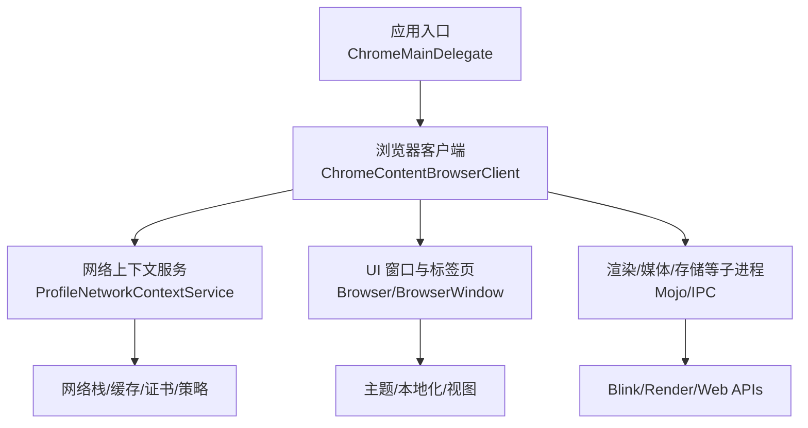

**图表来源**
- [chrome_main_delegate.cc:976-1005](file://src/chrome/app/chrome_main_delegate.cc#L976-L1005)
- [chrome_content_browser_client.cc:1-200](file://src/chrome/browser/chrome_content_browser_client.cc#L1-L200)
- [profile_network_context_service.cc:1324-1463](file://src/chrome/browser/net/profile_network_context_service.cc#L1324-L1463)
- [browser.cc:602-638](file://src/chrome/browser/ui/browser.cc#L602-L638)

**章节来源**
- [chrome_main_delegate.cc:976-1005](file://src/chrome/app/chrome_main_delegate.cc#L976-L1005)
- [chrome_content_browser_client.cc:1-200](file://src/chrome/browser/chrome_content_browser_client.cc#L1-L200)
- [profile_network_context_service.cc:1324-1463](file://src/chrome/browser/net/profile_network_context_service.cc#L1324-L1463)
- [browser.cc:602-638](file://src/chrome/browser/ui/browser.cc#L602-L638)

## 核心组件
- 应用入口与委托（ChromeMainDelegate）
  - 负责早期初始化、采样器设置、崩溃上报、Content 客户端创建与注入。
  - 在进程启动阶段完成线程池、日志、Tracing、Crashpad 等基础设施准备。
- 浏览器客户端（ChromeContentBrowserClient）
  - 统一接入浏览器侧功能：导航节流、下载、媒体、WebUI、策略、预取、安全状态、设备 API 等。
  - 作为浏览器进程与 Content 层的对接点，协调各子系统。
- 网络上下文服务（ProfileNetworkContextService）
  - 为每个 Profile/StoragePartition 配置 NetworkContext 参数（HTTP 缓存、Cookie、代理、HSTS、SCT、证书策略等）。
  - 将策略与偏好注入到网络栈，并支持动态更新。
- UI 窗口与标签页（Browser/BrowserWindow）
  - 管理窗口生命周期、主题观察、DevTools 可用性、标签页模型观察者等。
  - 与 WebContents、TabStripModel 协作，驱动页面显示与交互。
- 内容层与 Shell（content/shell）
  - 提供测试与最小化运行环境，创建 Browser/GPU/Renderer/Utility 客户端实例。
  - 用于验证 Mojo 绑定与跨进程通信。

**章节来源**
- [chrome_main_delegate.cc:1632-1669](file://src/chrome/app/chrome_main_delegate.cc#L1632-L1669)
- [chrome_content_browser_client.cc:1-200](file://src/chrome/browser/chrome_content_browser_client.cc#L1-L200)
- [profile_network_context_service.cc:1324-1463](file://src/chrome/browser/net/profile_network_context_service.cc#L1324-L1463)
- [browser.cc:602-638](file://src/chrome/browser/ui/browser.cc#L602-L638)
- [shell_main_delegate.cc:474-506](file://src/content/shell/app/shell_main_delegate.cc#L474-L506)

## 架构总览
下图展示 MCloud Browser 的核心组件交互：应用入口初始化后，创建浏览器客户端；浏览器客户端协调 UI、网络、存储、渲染等子系统；网络上下文服务负责将策略与偏好注入网络栈；Mojo/IPC 贯穿跨进程通信。

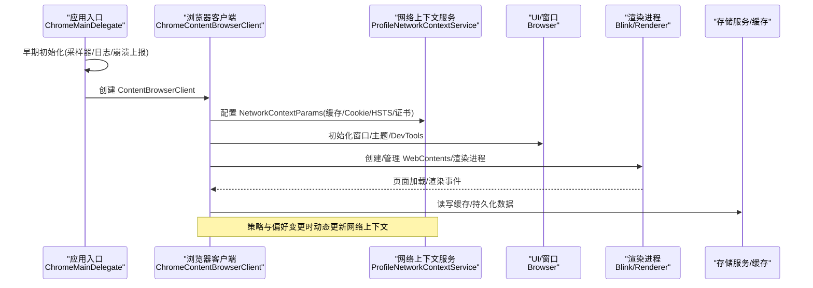

**图表来源**
- [chrome_main_delegate.cc:976-1005](file://src/chrome/app/chrome_main_delegate.cc#L976-L1005)
- [chrome_content_browser_client.cc:1-200](file://src/chrome/browser/chrome_content_browser_client.cc#L1-L200)
- [profile_network_context_service.cc:1324-1463](file://src/chrome/browser/net/profile_network_context_service.cc#L1324-L1463)
- [browser.cc:602-638](file://src/chrome/browser/ui/browser.cc#L602-L638)

## 详细组件分析

### 应用入口与委托（ChromeMainDelegate）
- 职责
  - 进程级早期初始化：线程池、采样器、日志、Tracing、Crashpad、命令行动态键值。
  - 创建并注入 Content 客户端（Browser/GPU/Renderer/Utility）。
- 关键点
  - 采样器在合适时机启动，避免阻塞启动路径。
  - 崩溃上报与异常处理器在用户数据目录就绪后初始化。
  - 根据进程类型（kProcessType）区分不同角色。

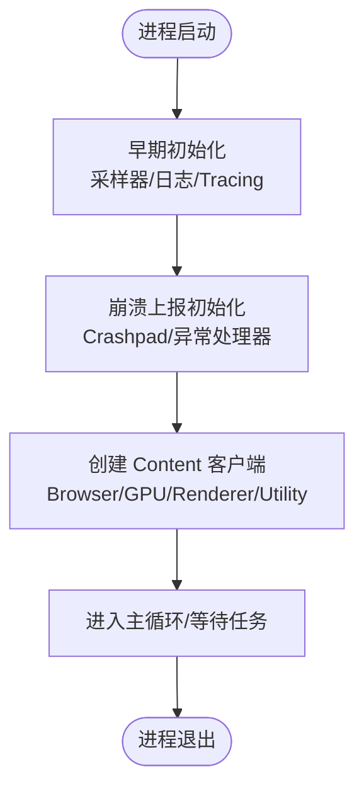

**图表来源**
- [chrome_main_delegate.cc:976-1005](file://src/chrome/app/chrome_main_delegate.cc#L976-L1005)
- [chrome_main_delegate.cc:1632-1669](file://src/chrome/app/chrome_main_delegate.cc#L1632-L1669)

**章节来源**
- [chrome_main_delegate.cc:976-1005](file://src/chrome/app/chrome_main_delegate.cc#L976-L1005)
- [chrome_main_delegate.cc:1632-1669](file://src/chrome/app/chrome_main_delegate.cc#L1632-L1669)

### 浏览器客户端（ChromeContentBrowserClient）
- 职责
  - 统一接入浏览器功能：导航节流、下载、媒体、WebUI、策略、预取、安全状态、设备 API、翻译、任务管理等。
  - 协调 Profile、StoragePartition、SystemNetworkContextManager 等。
- 关键点
  - 大量子系统通过工厂或 KeyedService 按需创建与注入。
  - 与网络上下文服务协作，确保策略与偏好一致。

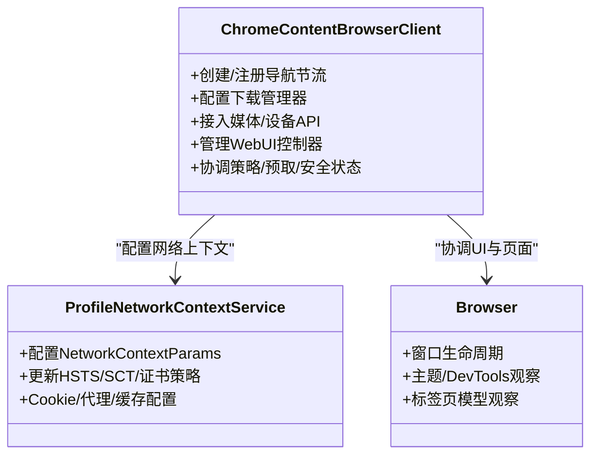

**图表来源**
- [chrome_content_browser_client.cc:1-200](file://src/chrome/browser/chrome_content_browser_client.cc#L1-L200)
- [profile_network_context_service.cc:1324-1463](file://src/chrome/browser/net/profile_network_context_service.cc#L1324-L1463)
- [browser.cc:602-638](file://src/chrome/browser/ui/browser.cc#L602-L638)

**章节来源**
- [chrome_content_browser_client.cc:1-200](file://src/chrome/browser/chrome_content_browser_client.cc#L1-L200)
- [profile_network_context_service.cc:1324-1463](file://src/chrome/browser/net/profile_network_context_service.cc#L1324-L1463)
- [browser.cc:602-638](file://src/chrome/browser/ui/browser.cc#L602-L638)

### 网络上下文服务（ProfileNetworkContextService）
- 职责
  - 为每个 Profile/StoragePartition 配置 NetworkContext 参数：HTTP 缓存、Cookie、代理、HSTS、SCT、证书策略、报告间隔等。
  - 支持动态更新（如 CT 策略、SSL 合规、CORS 头支持）。
- 关键点
  - 非 OTR 模式启用磁盘缓存，路径由用户缓存目录决定。
  - 通过 SystemNetworkContextManager 统一默认参数。
  - 与策略服务（如 FirstPartySets、TrackingProtection）联动。

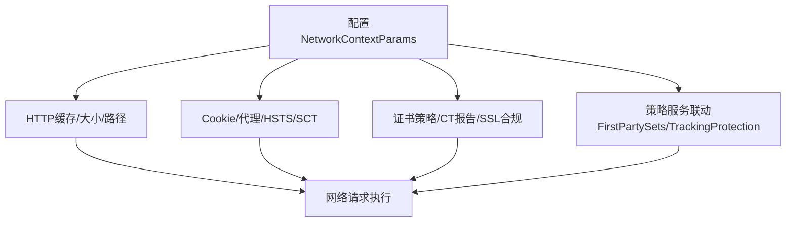

**图表来源**
- [profile_network_context_service.cc:1324-1463](file://src/chrome/browser/net/profile_network_context_service.cc#L1324-L1463)

**章节来源**
- [profile_network_context_service.cc:1324-1463](file://src/chrome/browser/net/profile_network_context_service.cc#L1324-L1463)

### UI 窗口与标签页（Browser/BrowserWindow）
- 职责
  - 管理窗口可见性、垂直标签条折叠宽度、卸载控制器等。
  - 订阅主题服务变化、DevTools 可用性变化。
  - 维护 ProfileKeepAlive，防止 Profile 被过早回收。
- 关键点
  - 在窗口初始化前需先初始化 BrowserWindowFeatures，以便后续组件可用。
  - 与 TabStripModel 和 WebContents 紧密协作。

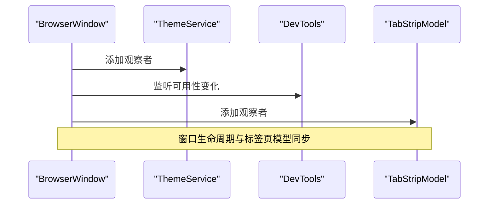

**图表来源**
- [browser.cc:602-638](file://src/chrome/browser/ui/browser.cc#L602-L638)

**章节来源**
- [browser.cc:602-638](file://src/chrome/browser/ui/browser.cc#L602-L638)

### 内容层与 Shell（content/shell）
- 职责
  - 提供最小化的 Content 运行环境，便于测试与验证。
  - 创建 Browser/GPU/Renderer/Utility 客户端实例，支持 WebTest 模式。
- 关键点
  - 在测试模式下使用特定客户端（WebTest*）。
  - 用于验证 Mojo 绑定与跨进程通信流程。

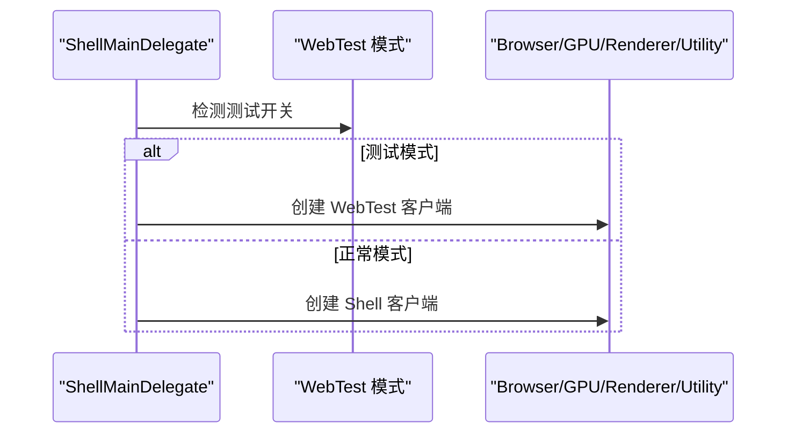

**图表来源**
- [shell_main_delegate.cc:474-506](file://src/content/shell/app/shell_main_delegate.cc#L474-L506)

**章节来源**
- [shell_main_delegate.cc:474-506](file://src/content/shell/app/shell_main_delegate.cc#L474-L506)

### Mojo 与 IPC 消息传递
- 职责
  - 通过 Mojo 暴露服务接口，供子进程或外部进程调用。
  - 支持测试场景下的远程绑定与消息传递。
- 关键点
  - 测试用例演示了如何启动 Content Shell 并通过 Mojo Remote 获取命令行参数。
  - 构建参数控制是否使用 ipcz-based Mojo Core。

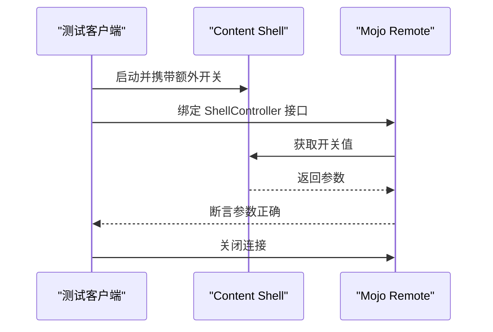

**图表来源**
- [launch_as_mojo_client_browsertest.cc:156-187](file://src/content/browser/launch_as_mojo_client_browsertest.cc#L156-L187)
- [gn_args.list:3934-3965](file://infra/gn_args.list#L3934-L3965)

**章节来源**
- [launch_as_mojo_client_browsertest.cc:156-187](file://src/content/browser/launch_as_mojo_client_browsertest.cc#L156-L187)
- [gn_args.list:3934-3965](file://infra/gn_args.list#L3934-L3965)

### 事件驱动架构（事件分发、回调、异步处理）
- 事件分发
  - UI 层通过观察者模式订阅主题、DevTools 可用性、标签页模型变化。
  - 网络层通过策略服务与偏好变更触发网络上下文更新。
- 回调机制
  - 使用 base::BindRepeating/base::OnceCallback 进行回调绑定。
  - 异步任务通过 ThreadPool/SequencedTaskRunner 调度。
- 异步处理
  - 媒体、下载、预取、缓存清理等耗时操作均异步执行。
  - 特征开关（features）控制行为分支，减少阻塞路径。

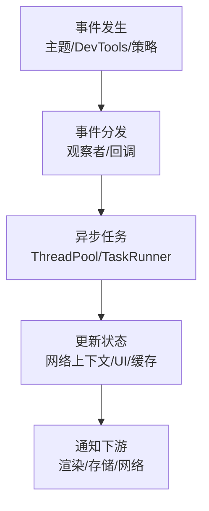

**章节来源**
- [browser.cc:602-638](file://src/chrome/browser/ui/browser.cc#L602-L638)
- [profile_network_context_service.cc:1324-1463](file://src/chrome/browser/net/profile_network_context_service.cc#L1324-L1463)
- [features.cc:586-621](file://src/third_party/blink/common/features.cc#L586-L621)

### 组件生命周期管理（初始化顺序、依赖注入、资源释放）
- 初始化顺序
  - 应用入口早期初始化 → 创建 Content 客户端 → 浏览器客户端装配 → 网络上下文配置 → UI 窗口初始化。
- 依赖注入
  - 通过工厂/KeyedService 按需注入（下载、媒体、策略、预取等）。
  - 网络上下文服务集中注入策略与偏好。
- 资源释放
  - 窗口卸载控制器、ProfileKeepAlive、缓存清理、Mojo 连接关闭。

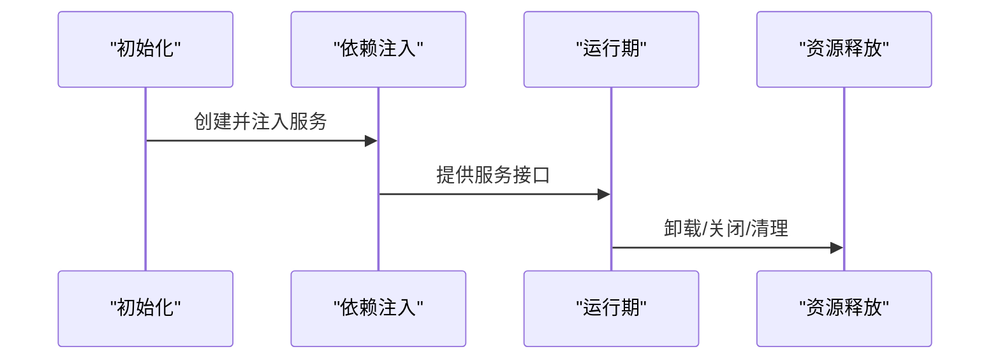

**章节来源**
- [chrome_main_delegate.cc:976-1005](file://src/chrome/app/chrome_main_delegate.cc#L976-L1005)
- [chrome_content_browser_client.cc:1-200](file://src/chrome/browser/chrome_content_browser_client.cc#L1-L200)
- [profile_network_context_service.cc:1324-1463](file://src/chrome/browser/net/profile_network_context_service.cc#L1324-L1463)
- [browser.cc:602-638](file://src/chrome/browser/ui/browser.cc#L602-L638)

### 组件扩展点（插件系统、主题系统、协议处理）
- 插件系统
  - 通过 extensions 模块与 ExtensionRegistry/ExtensionSystem 管理扩展生命周期与偏好。
  - 支持组件扩展、安装时间偏好迁移、待处理更新应用。
- 主题系统
  - 通过 ThemeService 与 NativeTheme（如 GTK）协同，支持系统主题切换与菜单绘制。
- 协议处理
  - 通过 ProtocolHandlerRegistry 与 ExternalProtocolHandler 处理自定义协议与外部协议。
  - 与 ContentSettings、Policy 等协作，确保安全与策略一致。

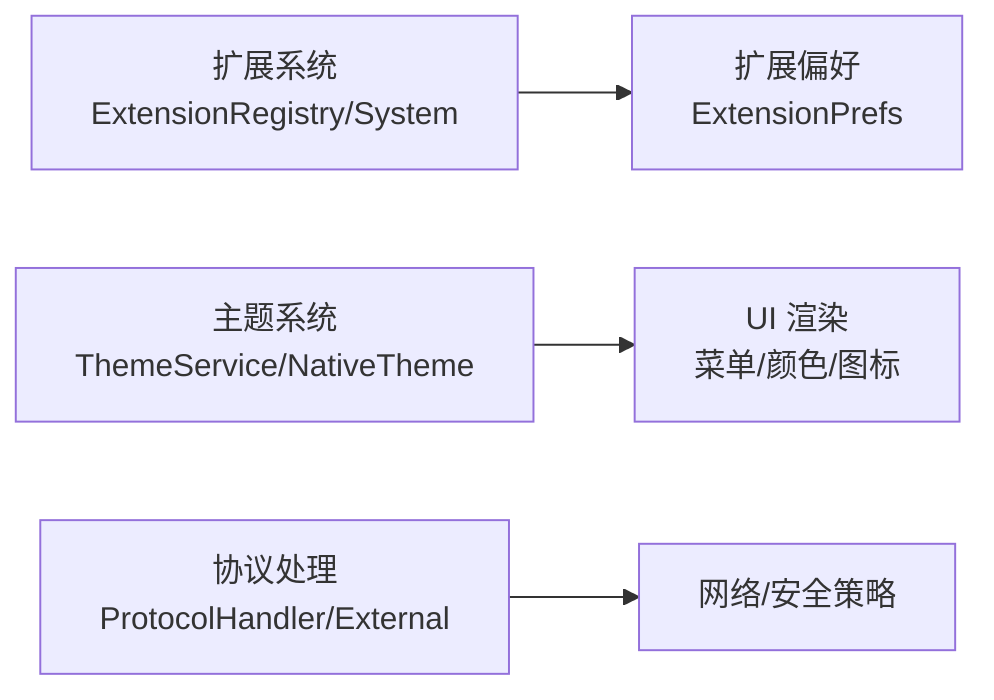

**图表来源**
- [extensions/browser/extension_prefs.cc:2539-2571](file://src/extensions/browser/extension_prefs.cc#L2539-L2571)
- [ui/gtk/native_theme_gtk.cc:116-157](file://src/ui/gtk/native_theme_gtk.cc#L116-L157)
- [chrome_content_browser_client.cc:1-200](file://src/chrome/browser/chrome_content_browser_client.cc#L1-L200)

**章节来源**
- [extensions/browser/extension_prefs.cc:2539-2571](file://src/extensions/browser/extension_prefs.cc#L2539-L2571)
- [ui/gtk/native_theme_gtk.cc:116-157](file://src/ui/gtk/native_theme_gtk.cc#L116-L157)
- [chrome_content_browser_client.cc:1-200](file://src/chrome/browser/chrome_content_browser_client.cc#L1-L200)

## 依赖关系分析
- 组件耦合
  - ChromeMainDelegate 与 ChromeContentBrowserClient：强耦合（客户端创建与注入）。
  - ChromeContentBrowserClient 与 ProfileNetworkContextService：中耦合（策略与偏好注入）。
  - Browser 与 ThemeService/DevTools：松耦合（观察者模式）。
- 直接/间接依赖
  - 网络上下文服务依赖策略服务、偏好服务、系统网络上下文管理器。
  - UI 层依赖本地化、资源包、平台主题。
- 外部依赖
  - Mojo/IPC 用于跨进程通信。
  - Blink 特性开关影响渲染行为。

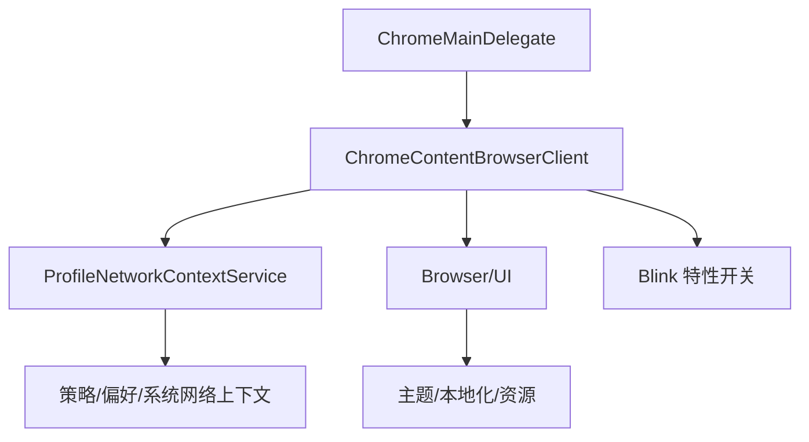

**图表来源**
- [chrome_main_delegate.cc:976-1005](file://src/chrome/app/chrome_main_delegate.cc#L976-L1005)
- [chrome_content_browser_client.cc:1-200](file://src/chrome/browser/chrome_content_browser_client.cc#L1-L200)
- [profile_network_context_service.cc:1324-1463](file://src/chrome/browser/net/profile_network_context_service.cc#L1324-L1463)
- [features.cc:586-621](file://src/third_party/blink/common/features.cc#L586-L621)

**章节来源**
- [chrome_main_delegate.cc:976-1005](file://src/chrome/app/chrome_main_delegate.cc#L976-L1005)
- [chrome_content_browser_client.cc:1-200](file://src/chrome/browser/chrome_content_browser_client.cc#L1-L200)
- [profile_network_context_service.cc:1324-1463](file://src/chrome/browser/net/profile_network_context_service.cc#L1324-L1463)
- [features.cc:586-621](file://src/third_party/blink/common/features.cc#L586-L621)

## 性能考量
- 启动速度优化
  - 通过内置标志注入（如 SendGPUChannelEarly、DeferSpeculativeRFHCreation、InitialWebUI 等）减少启动阻塞。
- V8 脚本加速
  - 调整 Maglev/TurboFan 阈值，启用 Sparkplug 基线代码修补。
- 页面加载加速
  - 线程化 preload 扫描、离线程消费代码缓存、系统字体预载、HTTP 缓存预热。
- 内存优化
  - 标签页丢弃、内存压力冻结、分区分配优化、旧瓦片回收。
- 多线程优化
  - IO 响应性提升、Mojo 专用线程、自旋锁、关闭标签加速。
- 视频/媒体优化
  - 专用媒体线程、硬件解码、零拷贝捕获、批量读取。
- GPU/渲染优化
  - 命令缓冲区解析切片、Skia Graphite 预编译、资源池复用、高刷支持。
- 网络优化
  - 后退/前进缓存、异步 DNS、TLS 1.3 早期数据、书签/新标签页预取。

**章节来源**
- [README.md:73-176](file://README.md#L73-L176)
- [mcloud_flags.txt](file://mcloud_flags.txt)
- [win_args.gn](file://win_args.gn)
- [args.list:3815-3843](file://infra/args.list#L3815-L3843)

## 故障排查指南
- 启动问题
  - 检查用户数据目录是否正确设置，崩溃上报是否初始化。
  - 验证内置标志注入是否生效（可通过基准工具验证）。
- 网络问题
  - 检查 NetworkContextParams 配置（缓存、Cookie、代理、HSTS、SCT）。
  - 确认策略服务（FirstPartySets、TrackingProtection）是否启用。
- UI 问题
  - 主题切换是否生效，菜单绘制是否正常。
  - DevTools 可用性变化是否被正确处理。
- 性能问题
  - 使用 Tracing/采样器定位热点路径。
  - 调整 V8 阈值与页面加载优化标志。

**章节来源**
- [chrome_main_delegate.cc:1632-1669](file://src/chrome/app/chrome_main_delegate.cc#L1632-L1669)
- [profile_network_context_service.cc:1324-1463](file://src/chrome/browser/net/profile_network_context_service.cc#L1324-L1463)
- [browser.cc:602-638](file://src/chrome/browser/ui/browser.cc#L602-L638)
- [README.md:357-375](file://README.md#L357-L375)

## 结论
MCloud Browser 在 Chromium 基础上通过精细的组件协作与优化标志注入，实现了高性能、可扩展的浏览器架构。应用入口、浏览器客户端、网络上下文服务与 UI 窗口形成清晰的分层与职责边界；Mojo/IPC 保障跨进程通信；事件驱动与异步处理提升响应性；扩展点支持插件、主题与协议处理的灵活集成；调试与性能工具链完善，便于持续优化与问题定位。

## 附录
- 构建与运行
  - 参考 README 中的从源码构建步骤与 CI/CD 简化工作流。
  - 使用 benchmark 工具采集基线与验证内置标志注入。
- 标志与参数
  - mcloud_flags.txt 包含运行时优化标志集合。
  - win_args.gn 与 args.list 提供构建与运行时参数参考。

**章节来源**
- [README.md:194-264](file://README.md#L194-L264)
- [README.md:268-298](file://README.md#L268-L298)
- [README.md:357-375](file://README.md#L357-L375)
- [mcloud_flags.txt](file://mcloud_flags.txt)
- [win_args.gn](file://win_args.gn)
- [args.list:3815-3843](file://infra/args.list#L3815-L3843)