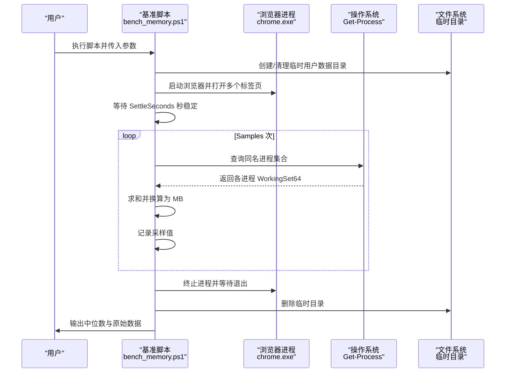
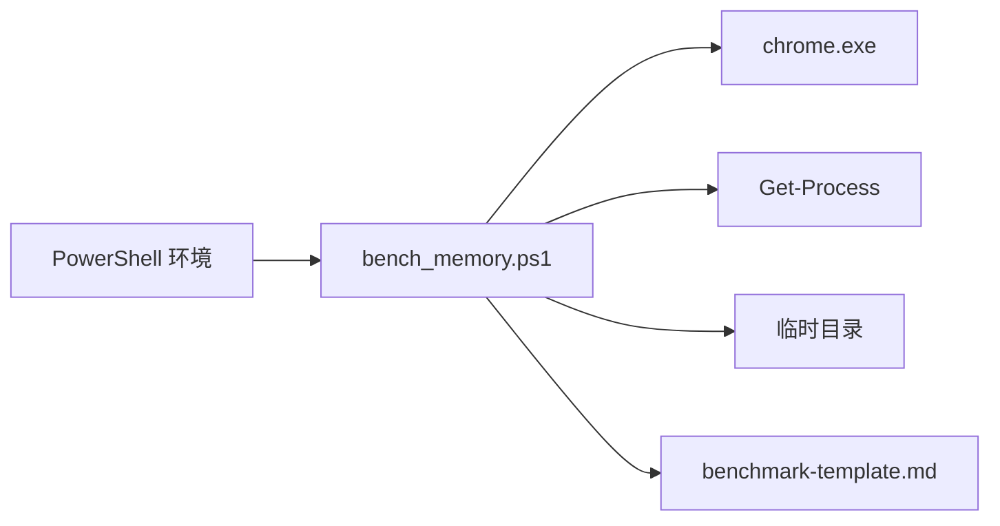

# 内存使用测试

本文引用的文件

- [bench_memory.ps1](https://github.com/Mcloud136/Mcloud-Browser/blob/main/benchmark/bench_memory.ps1)
- [bench_startup.ps1](https://github.com/Mcloud136/Mcloud-Browser/blob/main/benchmark/bench_startup.ps1)
- [bench_navigation.ps1](https://github.com/Mcloud136/Mcloud-Browser/blob/main/benchmark/bench_navigation.ps1)
- [benchmark-template.md](https://github.com/Mcloud136/Mcloud-Browser/blob/main/docs/dev-logs/benchmark-template.md)
- [M150-benchmark.md](https://github.com/Mcloud136/Mcloud-Browser/blob/main/docs/dev-logs/M150-benchmark.md)
- [mcloud_flags.txt](https://github.com/Mcloud136/Mcloud-Browser/blob/main/mcloud_flags.txt)

## 目录
1. [简介](#简介)
2. [项目结构](#项目结构)
3. [核心组件](#核心组件)
4. [架构总览](#架构总览)
5. [详细组件分析](#详细组件分析)
6. [依赖关系分析](#依赖关系分析)
7. [性能考量](#性能考量)
8. [故障排查指南](#故障排查指南)
9. [结论](#结论)
10. [附录](#附录)

## 简介
本文件面向 MCloud Browser 的内存使用基准测试，重点围绕 benchmark/bench_memory.ps1 脚本，系统阐述其内存监控机制、多标签页场景下的内存占用测量方法、参数配置（ChromeExe、Tabs、SettleSeconds、Samples、SampleInterval、UrlsFile、ExtraFlags）、采样策略与数据收集方式。文档还解释内存峰值计算方法、稳定期等待机制、异常内存增长检测思路，并提供内存优化分析与泄漏检测指南，以及不同负载场景下的基准用例与调优建议。

## 项目结构
- 基准脚本位于 benchmark/ 目录，包含启动时间、导航速度、内存等多类基准。
- 结果记录模板位于 docs/dev-logs/benchmark-template.md，用于统一记录环境与 KPI。
- 浏览器内置标志与优化项在 mcloud_flags.txt 中集中管理，影响内存行为。

图表来源
- [bench_memory.ps1:13-21](https://github.com/Mcloud136/Mcloud-Browser/blob/main/benchmark/bench_memory.ps1#L13-L21)
- [bench_memory.ps1:30-53](https://github.com/Mcloud136/Mcloud-Browser/blob/main/benchmark/bench_memory.ps1#L30-L53)
- [bench_memory.ps1:58-77](https://github.com/Mcloud136/Mcloud-Browser/blob/main/benchmark/bench_memory.ps1#L58-L77)

章节来源
- [bench_memory.ps1:1-78](https://github.com/Mcloud136/Mcloud-Browser/blob/main/benchmark/bench_memory.ps1#L1-L78)
- [benchmark-template.md:1-39](https://github.com/Mcloud136/Mcloud-Browser/blob/main/docs/dev-logs/benchmark-template.md#L1-L39)

## 核心组件
- 参数解析：ChromeExe、Tabs、SettleSeconds、Samples、SampleInterval、UrlsFile、ExtraFlags。
- 目标构建：根据 Tabs 数量生成目标 URL 列表（默认 about:blank，或从 UrlsFile 读取）。
- 进程生命周期：创建独立用户数据目录，启动 chrome.exe，等待稳定期，采集内存，清理资源。
- 内存采样：按主进程名汇总所有子进程的 WorkingSet64 并求和，转换为 MB，多次采样取中位数。
- 结果输出：打印每次采样值与最终中位数，提示将结果与环境信息记录到文档模板。

章节来源
- [bench_memory.ps1:13-21](https://github.com/Mcloud136/Mcloud-Browser/blob/main/benchmark/bench_memory.ps1#L13-L21)
- [bench_memory.ps1:30-53](https://github.com/Mcloud136/Mcloud-Browser/blob/main/benchmark/bench_memory.ps1#L30-L53)
- [bench_memory.ps1:58-77](https://github.com/Mcloud136/Mcloud-Browser/blob/main/benchmark/bench_memory.ps1#L58-L77)

## 架构总览
下图展示 bench_memory.ps1 的执行流程与关键交互点：

图表来源
- [bench_memory.ps1:47-53](https://github.com/Mcloud136/Mcloud-Browser/blob/main/benchmark/bench_memory.ps1#L47-L53)
- [bench_memory.ps1:55-67](https://github.com/Mcloud136/Mcloud-Browser/blob/main/benchmark/bench_memory.ps1#L55-L67)
- [bench_memory.ps1:69-77](https://github.com/Mcloud136/Mcloud-Browser/blob/main/benchmark/bench_memory.ps1#L69-L77)

## 详细组件分析

### 参数配置与加载逻辑
- ChromeExe：指定被测浏览器可执行文件路径；若不存在则报错退出。
- Tabs：标签页数量；用于决定打开的目标数。
- SettleSeconds：稳定期等待时长，确保页面渲染、网络请求、后台任务趋于稳定后再采样。
- Samples：采样次数；默认 5 次。
- SampleInterval：采样间隔；默认 5 秒，避免连续采样带来的抖动。
- UrlsFile：可选 URL 列表文件；每行一个 URL，支持 https/http；未提供时默认使用 about:blank。
- ExtraFlags：额外命令行参数，可用于注入实验性开关或调试选项。

章节来源
- [bench_memory.ps1:13-21](https://github.com/Mcloud136/Mcloud-Browser/blob/main/benchmark/bench_memory.ps1#L13-L21)
- [bench_memory.ps1:25-39](https://github.com/Mcloud136/Mcloud-Browser/blob/main/benchmark/bench_memory.ps1#L25-L39)

### 内存采样策略与数据收集
- 进程聚合：通过 Get-Process 获取与 ChromeExe 同名的所有进程（包括主进程与子进程），对每个进程的 WorkingSet64 属性求和，得到当前工作集总量。
- 单位换算：将字节转换为 MB，保留一位小数。
- 多次采样：按 Samples 次数循环，每次间隔 SampleInterval 秒，记录采样值数组。
- 统计方法：计算采样值的中位数作为“K2 内存峰值”指标；中位数能降低单次波动的影响。

章节来源
- [bench_memory.ps1:58-67](https://github.com/Mcloud136/Mcloud-Browser/blob/main/benchmark/bench_memory.ps1#L58-L67)
- [bench_memory.ps1:41-45](https://github.com/Mcloud136/Mcloud-Browser/blob/main/benchmark/bench_memory.ps1#L41-L45)
- [bench_memory.ps1:73-77](https://github.com/Mcloud136/Mcloud-Browser/blob/main/benchmark/bench_memory.ps1#L73-L77)

### 稳定期等待机制
- 目的：让浏览器完成首屏渲染、网络请求、缓存预热、后台任务初始化等，使内存占用趋于稳定。
- 实现：启动后直接 Sleep SettleSeconds 秒，再进行首次采样。
- 注意事项：对于复杂站点或大量媒体内容，可能需要更长的稳定期；可通过增大 SettleSeconds 提升稳定性。

章节来源
- [bench_memory.ps1:55-56](https://github.com/Mcloud136/Mcloud-Browser/blob/main/benchmark/bench_memory.ps1#L55-L56)

### 异常内存增长检测
- 脚本本身不内置自动异常检测，但可通过以下方法识别：
  - 观察多次采样的趋势：如果采样值持续上升且无收敛迹象，可能存在内存泄漏或持续增长的任务。
  - 对比不同负载：例如 about:blank vs 真实站点；若后者显著高于前者且随时间增长，需进一步定位。
  - 结合外部工具：如 Windows 任务管理器、PerfView、Visual Studio Diagnostic Tools、Chrome DevTools Memory 面板进行深度分析。
- 建议：在报告中记录采样序列与趋势图，便于回归分析。

章节来源
- [bench_memory.ps1:58-67](https://github.com/Mcloud136/Mcloud-Browser/blob/main/benchmark/bench_memory.ps1#L58-L67)
- [M150-benchmark.md:28-41](https://github.com/Mcloud136/Mcloud-Browser/blob/main/docs/dev-logs/M150-benchmark.md#L28-L41)

### 多标签页场景与 URL 策略
- 默认策略：使用 about:blank 以降低网络波动干扰，聚焦于浏览器内核与渲染进程的基线内存。
- 自定义策略：通过 UrlsFile 提供真实站点 URL，模拟实际使用场景；URL 会循环分配给 Tabs 个标签页。
- 进程模型：Chromium 的多进程架构下，每个标签页可能对应独立的渲染进程，因此总内存是主进程与各子进程之和。

章节来源
- [bench_memory.ps1:30-39](https://github.com/Mcloud136/Mcloud-Browser/blob/main/benchmark/bench_memory.ps1#L30-L39)
- [bench_memory.ps1:50-53](https://github.com/Mcloud136/Mcloud-Browser/blob/main/benchmark/bench_memory.ps1#L50-L53)

### 结果记录与报告
- 输出格式：打印每次采样值与最终中位数，提示将结果与环境信息记录到 docs/dev-logs/。
- 模板字段：环境信息（CPU、内存、OS、GPU、电源模式、扩展）与 KPI（K1-K7），其中 K2 即本脚本的内存峰值。
- 示例参考：M150-benchmark.md 展示了完整的记录格式与原始数据样例。

章节来源
- [bench_memory.ps1:73-77](https://github.com/Mcloud136/Mcloud-Browser/blob/main/benchmark/bench_memory.ps1#L73-L77)
- [benchmark-template.md:1-39](https://github.com/Mcloud136/Mcloud-Browser/blob/main/docs/dev-logs/benchmark-template.md#L1-L39)
- [M150-benchmark.md:1-49](https://github.com/Mcloud136/Mcloud-Browser/blob/main/docs/dev-logs/M150-benchmark.md#L1-L49)

### 与其他基准脚本的关系
- bench_startup.ps1：测量冷启动时间（K1），使用 WaitForInputIdle 作为首屏可交互代理指标。
- bench_navigation.ps1：测量导航响应速度，对比预载功能开启/关闭的收益。
- 三者共同构成 MCloud Browser 的基础性能评估体系，便于在不同版本间对比回归。

章节来源
- [bench_startup.ps1:1-70](https://github.com/Mcloud136/Mcloud-Browser/blob/main/benchmark/bench_startup.ps1#L1-L70)
- [bench_navigation.ps1:1-109](https://github.com/Mcloud136/Mcloud-Browser/blob/main/benchmark/bench_navigation.ps1#L1-L109)

## 依赖关系分析
- 外部依赖：
  - Windows PowerShell 环境（PowerShell 5+ 推荐）。
  - 被测浏览器 chrome.exe 必须存在且可执行。
  - 操作系统进程信息查询接口（Get-Process）。
- 内部依赖：
  - 临时用户数据目录隔离，避免历史状态干扰。
  - 可选 URL 列表文件，用于真实站点场景。
  - 文档模板用于标准化结果记录。

图表来源
- [bench_memory.ps1:25-28](https://github.com/Mcloud136/Mcloud-Browser/blob/main/benchmark/bench_memory.ps1#L25-L28)
- [bench_memory.ps1:47-53](https://github.com/Mcloud136/Mcloud-Browser/blob/main/benchmark/bench_memory.ps1#L47-L53)
- [bench_memory.ps1:58-67](https://github.com/Mcloud136/Mcloud-Browser/blob/main/benchmark/bench_memory.ps1#L58-L67)
- [benchmark-template.md:1-39](https://github.com/Mcloud136/Mcloud-Browser/blob/main/docs/dev-logs/benchmark-template.md#L1-L39)

章节来源
- [bench_memory.ps1:25-28](https://github.com/Mcloud136/Mcloud-Browser/blob/main/benchmark/bench_memory.ps1#L25-L28)
- [bench_memory.ps1:47-53](https://github.com/Mcloud136/Mcloud-Browser/blob/main/benchmark/bench_memory.ps1#L47-L53)
- [bench_memory.ps1:58-67](https://github.com/Mcloud136/Mcloud-Browser/blob/main/benchmark/bench_memory.ps1#L58-L67)
- [benchmark-template.md:1-39](https://github.com/Mcloud136/Mcloud-Browser/blob/main/docs/dev-logs/benchmark-template.md#L1-L39)

## 性能考量
- 稳定期设置：SettleSeconds 过短可能导致采样偏小；过长则增加测试耗时。建议根据站点复杂度调整。
- 采样频率：SampleInterval 过小可能引入系统调度抖动；过大可能错过峰值。默认 5 秒较为平衡。
- 标签数量：Tabs 越大，进程越多，内存越高；注意系统资源限制与测试机配置。
- URL 选择：about:blank 适合基线对比；真实站点需考虑网络、媒体、JS 执行等因素。
- 环境变量：确保电源模式为高性能，关闭无关程序，减少系统干扰。
- 结果解读：中位数优于平均值，更能反映典型情况；同时应关注采样序列的趋势与方差。

[本节为通用指导，不直接分析具体文件]

## 故障排查指南
- 常见错误：
  - ChromeExe 不存在：检查路径是否正确，或通过 -ChromeExe 指定。
  - 权限不足：以管理员身份运行 PowerShell 或使用具备访问进程信息的权限。
  - 端口/网络冲突：使用 UrlsFile 时确保站点可达，必要时切换至内网或本地服务。
- 诊断步骤：
  - 查看控制台输出，确认进程数与采样值是否合理。
  - 使用任务管理器观察浏览器进程的工作集变化。
  - 使用 PerfView 或 Visual Studio 捕获堆快照，定位潜在泄漏。
  - 结合 Chrome DevTools Memory 面板分析 JS Heap 与 DOM 节点。
- 回归验证：
  - 固定环境（CPU、内存、OS、GPU、电源模式、扩展）重复测试。
  - 记录完整原始数据与趋势图，便于跨版本对比。

章节来源
- [bench_memory.ps1:25-28](https://github.com/Mcloud136/Mcloud-Browser/blob/main/benchmark/bench_memory.ps1#L25-L28)
- [bench_memory.ps1:58-67](https://github.com/Mcloud136/Mcloud-Browser/blob/main/benchmark/bench_memory.ps1#L58-L67)
- [M150-benchmark.md:43-49](https://github.com/Mcloud136/Mcloud-Browser/blob/main/docs/dev-logs/M150-benchmark.md#L43-L49)

## 结论
bench_memory.ps1 提供了标准化的多标签页内存基准测试能力，通过稳定期等待、多进程工作集汇总与中位数统计，能够可靠地衡量 MCloud Browser 在多标签场景下的内存占用。配合文档模板与历史报告，可实现版本间的回归对比与性能调优。建议在真实站点场景下结合更多诊断工具进行深入分析，并根据业务需求调整参数以获得更具代表性的结果。

[本节为总结性内容，不直接分析具体文件]

## 附录

### 内存优化分析与泄漏检测指南
- 优化方向：
  - 启用内存相关标志：如 DiscardOnCommitLimit、SustainedPMUrgentDiscarding、PartitionAllocSortActiveSlotSpans、LowerPAMemoryLimitForNonMainRenderers、ReclaimOldPrepaintTiles、PruneOldTransferCacheEntries、InfiniteTabsFreezing 等，这些标志已在 mcloud_flags.txt 中集中管理。
  - 控制媒体与缓存：减少不必要的视频缓冲与传输缓存条目，降低 GPU 与内存压力。
  - 多标签冻结：利用 InfiniteTabsFreezing 与压力触发冻结，降低后台标签内存占用。
- 泄漏检测：
  - 使用 Chrome DevTools Memory 面板录制 Heap Snapshot，比较不同时间点对象增长。
  - 使用 Performance 面板观察长时间运行的任务与内存曲线。
  - 使用 Windows 工具（PerfView、ProcMon）辅助定位非预期分配。
  - 在基准报告中记录采样序列与趋势，标注异常点与可能原因。

章节来源
- [mcloud_flags.txt:27-38](https://github.com/Mcloud136/Mcloud-Browser/blob/main/mcloud_flags.txt#L27-L38)
- [bench_memory.ps1:58-67](https://github.com/Mcloud136/Mcloud-Browser/blob/main/benchmark/bench_memory.ps1#L58-L67)
- [M150-benchmark.md:28-41](https://github.com/Mcloud136/Mcloud-Browser/blob/main/docs/dev-logs/M150-benchmark.md#L28-L41)

### 不同负载场景下的基准测试用例
- 基础基线：Tabs=50，UrlsFile 为空（about:blank），SettleSeconds=90，Samples=5，SampleInterval=5。
- 真实站点：提供 UrlsFile，包含常用网站（如 example.com、bilibili.com、qq.com），观察网络与媒体对内存的影响。
- 高负载：增加 Tabs 至 100 或更高，延长 SettleSeconds，观察内存增长与稳定性。
- 对比测试：分别运行 preload-on 与 preload-off（参考 bench_navigation.ps1），评估预载功能对内存与加载速度的影响。

章节来源
- [bench_memory.ps1:13-21](https://github.com/Mcloud136/Mcloud-Browser/blob/main/benchmark/bench_memory.ps1#L13-L21)
- [bench_navigation.ps1:23-46](https://github.com/Mcloud136/Mcloud-Browser/blob/main/benchmark/bench_navigation.ps1#L23-L46)
- [bench_navigation.ps1:93-109](https://github.com/Mcloud136/Mcloud-Browser/blob/main/benchmark/bench_navigation.ps1#L93-L109)

### 性能调优建议
- 调整稳定期：根据站点复杂度适当增加 SettleSeconds，确保采样时处于稳态。
- 控制采样间隔：在高频变化的场景中，适当减小 SampleInterval 以捕捉峰值；在稳定场景中保持默认即可。
- 优化标志组合：基于 mcloud_flags.txt 中的内存优化标志，逐步启用并观察 K2 的变化，找到最佳平衡点。
- 环境与硬件：确保高性能电源模式，关闭无关程序，使用物理 GPU 而非虚拟显示适配器进行媒体相关测试。
- 结果记录：按照 benchmark-template.md 填写环境信息与 KPI，保留原始数据以便回溯。

章节来源
- [bench_memory.ps1:55-67](https://github.com/Mcloud136/Mcloud-Browser/blob/main/benchmark/bench_memory.ps1#L55-L67)
- [mcloud_flags.txt:27-38](https://github.com/Mcloud136/Mcloud-Browser/blob/main/mcloud_flags.txt#L27-L38)
- [benchmark-template.md:1-39](https://github.com/Mcloud136/Mcloud-Browser/blob/main/docs/dev-logs/benchmark-template.md#L1-L39)