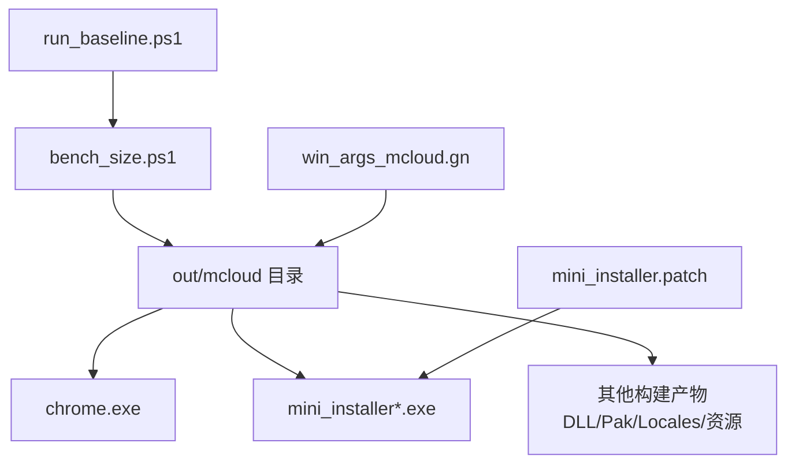
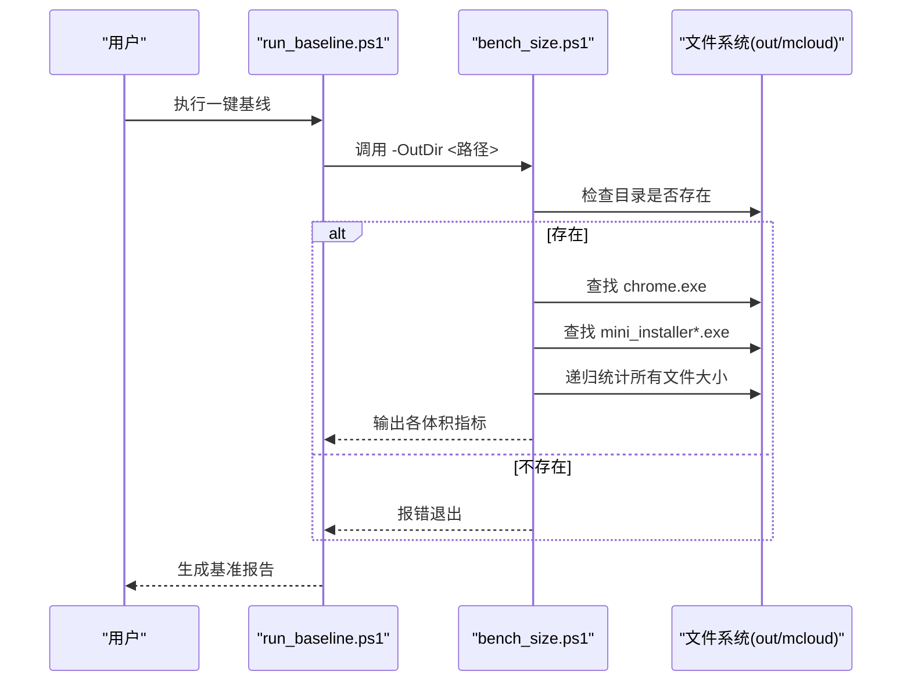
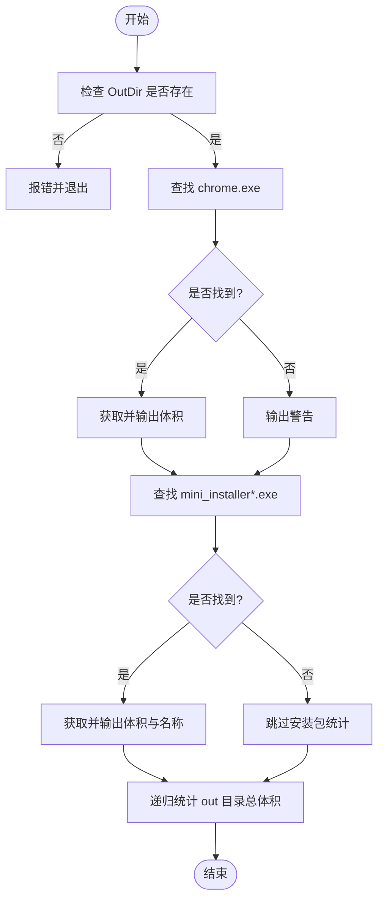
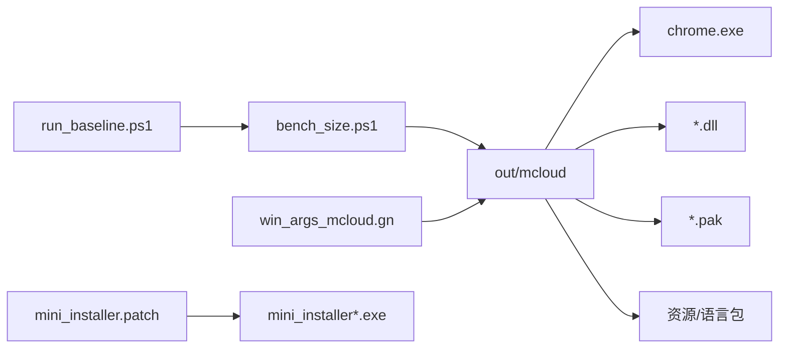

# 包大小测试

本文引用的文件

- [benchmark/bench_size.ps1](https://github.com/Mcloud136/Mcloud-Browser/blob/main/benchmark/bench_size.ps1)
- [benchmark/run_baseline.ps1](https://github.com/Mcloud136/Mcloud-Browser/blob/main/benchmark/run_baseline.ps1)
- [win_args_mcloud.gn](https://github.com/Mcloud136/Mcloud-Browser/blob/main/win_args_mcloud.gn)
- [other/mini_installer.patch](https://github.com/Mcloud136/Mcloud-Browser/blob/main/other/mini_installer.patch)
- [docs/dev-logs/benchmark-template.md](https://github.com/Mcloud136/Mcloud-Browser/blob/main/docs/dev-logs/benchmark-template.md)
- [docs/dev-logs/M150-benchmark.md](https://github.com/Mcloud136/Mcloud-Browser/blob/main/docs/dev-logs/M150-benchmark.md)

## 目录
1. [简介](#简介)
2. [项目结构](#项目结构)
3. [核心组件](#核心组件)
4. [架构总览](#架构总览)
5. [详细组件分析](#详细组件分析)
6. [依赖关系分析](#依赖关系分析)
7. [性能与体积优化建议](#性能与体积优化建议)
8. [故障排查指南](#故障排查指南)
9. [结论](#结论)
10. [附录](#附录)

## 简介
本文件面向 MCloud Browser 的“包大小基准测试”，聚焦于 benchmark/bench_size.ps1 脚本的二进制体积测量与分析能力，说明其如何扫描构建输出目录、统计文件大小、识别安装包产物，并给出不同构建配置下的体积对比与增量更新影响评估方法。同时提供可执行文件、动态库、资源文件的分类统计思路与冗余清理建议，帮助持续跟踪二进制体积变化趋势。

## 项目结构
- 基准测试脚本位于 benchmark 目录，其中 bench_size.ps1 负责 K7（体积）指标采集；run_baseline.ps1 统一编排 K1/K2/K7 三项自动化流程，并将结果写入 docs/dev-logs/{版本}-benchmark.md。
- 构建配置集中在 win_args_mcloud.gn，定义了目标平台、SIMD、链接优化、PGO、V8/WebUI 优化等关键开关，直接影响最终二进制与资源体积。
- Windows 安装器打包逻辑通过 other/mini_installer.patch 进行定制，影响 mini_installer 产物及打包内容。
- 历史基线记录在 docs/dev-logs 中，便于跨版本对比。

图表来源
- [benchmark/bench_size.ps1:1-44](https://github.com/Mcloud136/Mcloud-Browser/blob/main/benchmark/bench_size.ps1#L1-L44)
- [benchmark/run_baseline.ps1:45-55](https://github.com/Mcloud136/Mcloud-Browser/blob/main/benchmark/run_baseline.ps1#L45-L55)
- [win_args_mcloud.gn:1-126](https://github.com/Mcloud136/Mcloud-Browser/blob/main/win_args_mcloud.gn#L1-L126)
- [other/mini_installer.patch:147-223](https://github.com/Mcloud136/Mcloud-Browser/blob/main/other/mini_installer.patch#L147-L223)

章节来源
- [benchmark/bench_size.ps1:1-44](https://github.com/Mcloud136/Mcloud-Browser/blob/main/benchmark/bench_size.ps1#L1-L44)
- [benchmark/run_baseline.ps1:1-78](https://github.com/Mcloud136/Mcloud-Browser/blob/main/benchmark/run_baseline.ps1#L1-L78)
- [win_args_mcloud.gn:1-126](https://github.com/Mcloud136/Mcloud-Browser/blob/main/win_args_mcloud.gn#L1-L126)
- [other/mini_installer.patch:147-223](https://github.com/Mcloud136/Mcloud-Browser/blob/main/other/mini_installer.patch#L147-L223)

## 核心组件
- K7 体积测量脚本：读取 out 目录，定位 chrome.exe 与 mini_installer 产物，递归统计构建目录总体积，并以 MB 为单位格式化输出。
- 基线编排脚本：自动依次执行冷启动、内存、体积三项基准，汇总环境信息与原始数据，生成 Markdown 报告。
- 构建配置：通过 GN 参数控制编译优化、符号级别、ThinLTO、PGO、WebUI 优化、媒体解码器等，显著影响二进制与资源体积。
- 安装器补丁：对 mini_installer 的输入产物、签名拷贝、多架构变体等进行定制，影响安装包体积与内容。

章节来源
- [benchmark/bench_size.ps1:1-44](https://github.com/Mcloud136/Mcloud-Browser/blob/main/benchmark/bench_size.ps1#L1-L44)
- [benchmark/run_baseline.ps1:1-78](https://github.com/Mcloud136/Mcloud-Browser/blob/main/benchmark/run_baseline.ps1#L1-L78)
- [win_args_mcloud.gn:1-126](https://github.com/Mcloud136/Mcloud-Browser/blob/main/win_args_mcloud.gn#L1-L126)
- [other/mini_installer.patch:147-223](https://github.com/Mcloud136/Mcloud-Browser/blob/main/other/mini_installer.patch#L147-L223)

## 架构总览
K7 体积测量的工作流如下：
- run_baseline.ps1 调用 bench_size.ps1 传入 out 目录路径。
- bench_size.ps1 校验目录存在后，查找 chrome.exe 与 mini_installer 产物，计算并打印各自大小。
- 递归遍历 out 目录所有文件，累加得到构建目录总体积。
- 将输出作为原始数据纳入基准报告，供后续对比分析。

图表来源
- [benchmark/run_baseline.ps1:45-55](https://github.com/Mcloud136/Mcloud-Browser/blob/main/benchmark/run_baseline.ps1#L45-L55)
- [benchmark/bench_size.ps1:15-40](https://github.com/Mcloud136/Mcloud-Browser/blob/main/benchmark/bench_size.ps1#L15-L40)

## 详细组件分析

### K7 体积测量脚本（bench_size.ps1）
- 功能要点
  - 参数 OutDir：指定构建输出目录，默认指向 out/mcloud。
  - 错误处理：若目录不存在则直接报错退出，避免静默失败。
  - 可执行文件检测：定位 chrome.exe 并输出其体积；未找到时发出警告。
  - 安装包检测：按通配符匹配 mini_installer 相关 exe，取第一个并输出体积与文件名。
  - 总体积统计：递归列出 out 目录下所有文件，累加长度得到构建目录总体积。
  - 提示：体积为观测指标，记录到 docs/dev-logs/ 即可，不设上限。

- 复杂度与性能
  - 时间复杂度：O(N)，N 为 out 目录文件数（递归遍历）。
  - 空间复杂度：O(1)，仅维护累计值与少量变量。
  - I/O 密集：大量文件读取长度，建议在 SSD 上运行以提升速度。

- 可扩展点
  - 可按扩展名分类统计（如 .exe/.dll/.pak/.dat），便于定位体积热点。
  - 可排除 obj 中间产物或特定子目录，减少无关统计。
  - 可增加增量对比模式，比较两次构建差异。

图表来源
- [benchmark/bench_size.ps1:15-40](https://github.com/Mcloud136/Mcloud-Browser/blob/main/benchmark/bench_size.ps1#L15-L40)

章节来源
- [benchmark/bench_size.ps1:1-44](https://github.com/Mcloud136/Mcloud-Browser/blob/main/benchmark/bench_size.ps1#L1-L44)

### 基线编排脚本（run_baseline.ps1）
- 功能要点
  - 统一采集 K1/K2/K7，并将环境与原始数据写入 docs/dev-logs/{版本}-benchmark.md。
  - 调用 bench_size.ps1 完成 K7 体积测量，并捕获输出用于报告。
  - 提供模板化报告结构，便于归档与对比。

- 使用方式
  - 指定 Version、ChromeExe、OutDir 等参数，一键生成包含 K1/K2/K7 的完整报告。

章节来源
- [benchmark/run_baseline.ps1:1-78](https://github.com/Mcloud136/Mcloud-Browser/blob/main/benchmark/run_baseline.ps1#L1-L78)
- [docs/dev-logs/benchmark-template.md:1-39](https://github.com/Mcloud136/Mcloud-Browser/blob/main/docs/dev-logs/benchmark-template.md#L1-L39)

### 构建配置（win_args_mcloud.gn）
- 关键开关对体积的影响
  - symbol_level/v8_symbol_level/blink_symbol_level：设为 0 可显著减小二进制体积。
  - exclude_unwind_tables：移除调试 unwind 表，减小体积。
  - is_full_optimization_build/use_thin_lto：启用 LTO 有助于去除冗余代码，降低体积。
  - optimize_webui：优化 WebUI 资源与编译产物。
  - media_use_ffmpeg/is_component_ffmpeg：静态链接 FFmpeg 可能增大体积，但有利于 LTO 优化；按需取舍。
  - enable_widevine/bundle_widevine_cdm：禁用 Widevine 可减小体积。
  - enable_reporting/enable_profiling：关闭遥测与 profiling 可减少额外代码与资源。
  - PGO（chrome_pgo_phase=2）：结合真实负载优化，通常能缩小体积并提升性能。

- 建议
  - 发布构建保持 symbol_level=0、exclude_unwind_tables=true、use_thin_lto=true。
  - 根据产品需求选择性启用/禁用媒体解码器、DRM、遥测等功能模块。
  - 定期运行 PGO，确保 profdata 与内核版本匹配。

章节来源
- [win_args_mcloud.gn:1-126](https://github.com/Mcloud136/Mcloud-Browser/blob/main/win_args_mcloud.gn#L1-L126)

### 安装器打包（mini_installer.patch）
- 定制点
  - 修改 mini_installer 的输入产物（例如替换 mcloud.exe、加入 mcloud_flags.txt）。
  - 增加多架构变体目标（SSE3/SSE4/AVX/AVX2/AVX512），便于分发不同 CPU 版本的安装包。
  - 调整打包参数与日志输出，支持增量打包选项（如 --last_chrome_installer、--setup_exe_format=DIFF）。
  - 新增 silent/debug 参数，便于自动化安装与问题定位。

- 体积影响
  - 打包内容越多，安装包越大；合理裁剪产物与启用差分打包可降低下载体积。
  - 多架构变体会产生多个安装包，需权衡兼容性与体积。

章节来源
- [other/mini_installer.patch:147-223](https://github.com/Mcloud136/Mcloud-Browser/blob/main/other/mini_installer.patch#L147-L223)

## 依赖关系分析
- 脚本依赖
  - run_baseline.ps1 依赖 bench_size.ps1 完成 K7 测量。
  - bench_size.ps1 依赖 Windows PowerShell 文件系统能力（Get-ChildItem、Measure-Object）。
- 构建产物依赖
  - out 目录由 GN/Ninja 构建系统生成，受 win_args_mcloud.gn 控制。
  - mini_installer 产物由 Chromium 安装器构建流程生成，经 mini_installer.patch 定制。
- 报告依赖
  - 基准报告基于 docs/dev-logs/benchmark-template.md 的结构组织，便于归档与对比。

图表来源
- [benchmark/run_baseline.ps1:45-55](https://github.com/Mcloud136/Mcloud-Browser/blob/main/benchmark/run_baseline.ps1#L45-L55)
- [benchmark/bench_size.ps1:24-40](https://github.com/Mcloud136/Mcloud-Browser/blob/main/benchmark/bench_size.ps1#L24-L40)
- [win_args_mcloud.gn:1-126](https://github.com/Mcloud136/Mcloud-Browser/blob/main/win_args_mcloud.gn#L1-L126)
- [other/mini_installer.patch:147-223](https://github.com/Mcloud136/Mcloud-Browser/blob/main/other/mini_installer.patch#L147-L223)

章节来源
- [benchmark/run_baseline.ps1:1-78](https://github.com/Mcloud136/Mcloud-Browser/blob/main/benchmark/run_baseline.ps1#L1-L78)
- [benchmark/bench_size.ps1:1-44](https://github.com/Mcloud136/Mcloud-Browser/blob/main/benchmark/bench_size.ps1#L1-L44)
- [win_args_mcloud.gn:1-126](https://github.com/Mcloud136/Mcloud-Browser/blob/main/win_args_mcloud.gn#L1-L126)
- [other/mini_installer.patch:147-223](https://github.com/Mcloud136/Mcloud-Browser/blob/main/other/mini_installer.patch#L147-L223)

## 性能与体积优化建议
- 构建配置优化
  - 保持 symbol_level=0、exclude_unwind_tables=true、use_thin_lto=true，以最小化二进制体积。
  - 合理使用 PGO（phase=2），确保 profdata 与内核版本一致，获得更优体积与性能。
  - 按需关闭遥测、profiling、Widevine 等可选功能，减少嵌入代码与资源。
  - 媒体解码器与 DRM 按需启用，避免不必要的编解码器与密钥模块。

- 分类统计与热点定位
  - 按扩展名分类统计：.exe/.dll/.pak/.dat/.pdb 等，快速定位体积热点。
  - 排除 obj 中间产物或临时目录，避免干扰统计。
  - 针对大型 .pak 资源文件，审查是否可压缩或按需加载。

- 增量更新影响评估
  - 使用 mini_installer 的差分打包选项（如 --last_chrome_installer、--setup_exe_format=DIFF）生成增量安装包，降低下载体积。
  - 对比相邻版本的 out 目录差异，识别新增/变更的大文件，评估对增量包的影响。

- 冗余清理指南
  - 清理重复或过时的资源文件（如旧版图标、未使用的本地化字符串）。
  - 移除调试符号（.pdb）与非必要日志文件，仅在需要时保留。
  - 精简第三方库与组件，避免引入未使用的功能模块。

[本节为通用指导，不直接分析具体文件]

## 故障排查指南
- 常见错误
  - 构建目录不存在：bench_size.ps1 会报错并退出，请确认 OutDir 路径正确且已构建。
  - 未找到 chrome.exe：可能尚未构建或产物命名不同，请检查构建输出目录。
  - 未找到 mini_installer：可能未启用安装器构建或产物命名不同，请检查构建配置。

- 诊断步骤
  - 确认 out 目录结构与产物命名是否符合预期。
  - 检查 win_args_mcloud.gn 中的安装器相关开关是否启用。
  - 查看 mini_installer.patch 的定制点，确保产物列表与打包逻辑一致。

章节来源
- [benchmark/bench_size.ps1:15-35](https://github.com/Mcloud136/Mcloud-Browser/blob/main/benchmark/bench_size.ps1#L15-L35)
- [other/mini_installer.patch:147-223](https://github.com/Mcloud136/Mcloud-Browser/blob/main/other/mini_installer.patch#L147-L223)

## 结论
bench_size.ps1 提供了轻量、可靠的 K7 体积测量能力，能够统计 chrome.exe、mini_installer 与构建目录总体积，并与 run_baseline.ps1 集成形成完整的基准报告。结合 win_args_mcloud.gn 的构建优化与 mini_installer.patch 的安装器定制，可在不同构建配置下实现体积对比与增量更新评估。建议持续跟踪体积趋势，按扩展名分类定位热点，配合 LTO、PGO 与功能裁剪策略，稳步优化包大小。

[本节为总结性内容，不直接分析具体文件]

## 附录
- 历史基线示例
  - M150 基线记录了 chrome.exe、mini_installer 与 out/mcloud 总体积，可作为参考。
  - 报告模板提供了标准字段与环境信息，便于跨版本对比。

章节来源
- [docs/dev-logs/M150-benchmark.md:1-49](https://github.com/Mcloud136/Mcloud-Browser/blob/main/docs/dev-logs/M150-benchmark.md#L1-L49)
- [docs/dev-logs/benchmark-template.md:1-39](https://github.com/Mcloud136/Mcloud-Browser/blob/main/docs/dev-logs/benchmark-template.md#L1-L39)