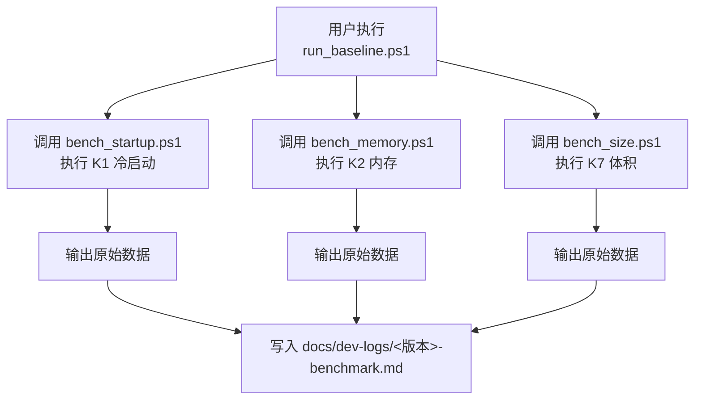
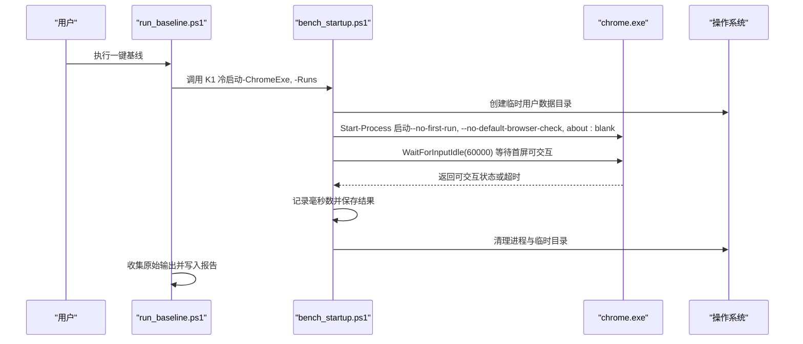
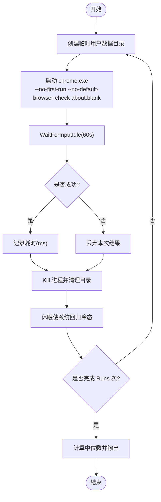
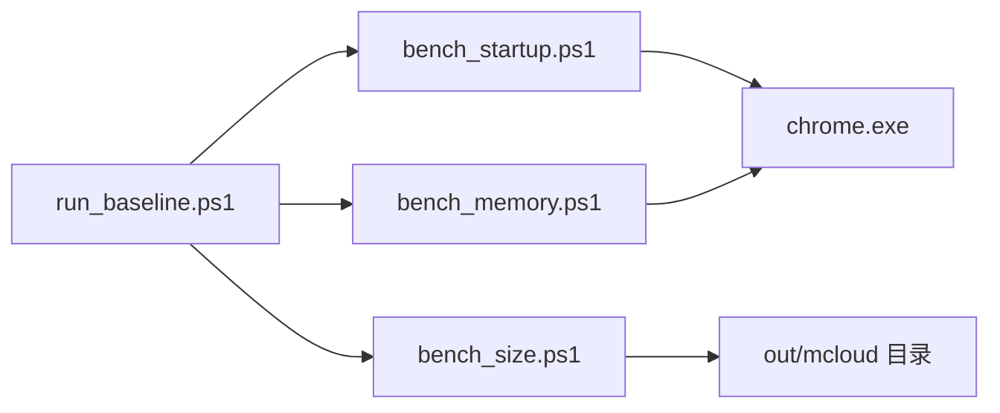

# 启动时间测试

本文引用的文件

- [bench_startup.ps1](https://github.com/Mcloud136/Mcloud-Browser/blob/main/benchmark/bench_startup.ps1)
- [run_baseline.ps1](https://github.com/Mcloud136/Mcloud-Browser/blob/main/benchmark/run_baseline.ps1)
- [bench_memory.ps1](https://github.com/Mcloud136/Mcloud-Browser/blob/main/benchmark/bench_memory.ps1)
- [bench_size.ps1](https://github.com/Mcloud136/Mcloud-Browser/blob/main/benchmark/bench_size.ps1)
- [benchmark-template.md](https://github.com/Mcloud136/Mcloud-Browser/blob/main/docs/dev-logs/benchmark-template.md)
- [M151-benchmark.md](https://github.com/Mcloud136/Mcloud-Browser/blob/main/docs/dev-logs/M151-benchmark.md)
- [mcloud_flags.txt](https://github.com/Mcloud136/Mcloud-Browser/blob/main/mcloud_flags.txt)

## 目录
1. [简介](#简介)
2. [项目结构](#项目结构)
3. [核心组件](#核心组件)
4. [架构总览](#架构总览)
5. [详细组件分析](#详细组件分析)
6. [依赖关系分析](#依赖关系分析)
7. [性能注意事项](#性能注意事项)
8. [故障排查指南](#故障排查指南)
9. [结论](#结论)
10. [附录](#附录)

## 简介
本文件面向 MCloud Browser 的“K1 冷启动时间”基准测试，围绕 benchmark/bench_startup.ps1 脚本的实现原理、测试方法、参数配置、测量点定义、结果解读与优化建议进行系统化说明。同时提供一键基线采集流程（run_baseline.ps1）与报告模板使用方式，帮助在 Windows 环境下稳定复现并记录浏览器冷启动性能。

## 项目结构
与启动时间基准相关的脚本与文档主要位于以下位置：
- 基准脚本：benchmark/
  - bench_startup.ps1：K1 冷启动时间测量
  - run_baseline.ps1：一键采集 K1/K2/K7 基线并生成报告
  - bench_memory.ps1：K2 内存峰值（配合 K1 一起评估整体体验）
  - bench_size.ps1：K7 二进制体积（观测指标）
- 报告模板与历史示例：docs/dev-logs/
  - benchmark-template.md：统一报告格式
  - M151-benchmark.md：历史版本基线示例
- 启动相关标志参考：mcloud_flags.txt（用于理解影响启动时间的内置特性开关）

图表来源
- [run_baseline.ps1:45-55](https://github.com/Mcloud136/Mcloud-Browser/blob/main/benchmark/run_baseline.ps1#L45-L55)
- [bench_startup.ps1:32-58](https://github.com/Mcloud136/Mcloud-Browser/blob/main/benchmark/bench_startup.ps1#L32-L58)
- [bench_memory.ps1:47-77](https://github.com/Mcloud136/Mcloud-Browser/blob/main/benchmark/bench_memory.ps1#L47-L77)
- [bench_size.ps1:24-40](https://github.com/Mcloud136/Mcloud-Browser/blob/main/benchmark/bench_size.ps1#L24-L40)

章节来源
- [run_baseline.ps1:1-78](https://github.com/Mcloud136/Mcloud-Browser/blob/main/benchmark/run_baseline.ps1#L1-L78)
- [bench_startup.ps1:1-70](https://github.com/Mcloud136/Mcloud-Browser/blob/main/benchmark/bench_startup.ps1#L1-L70)
- [bench_memory.ps1:1-78](https://github.com/Mcloud136/Mcloud-Browser/blob/main/benchmark/bench_memory.ps1#L1-L78)
- [bench_size.ps1:1-44](https://github.com/Mcloud136/Mcloud-Browser/blob/main/benchmark/bench_size.ps1#L1-L44)
- [benchmark-template.md:1-39](https://github.com/Mcloud136/Mcloud-Browser/blob/main/docs/dev-logs/benchmark-template.md#L1-L39)

## 核心组件
- K1 冷启动测量（bench_startup.ps1）
  - 每次使用全新临时用户数据目录，启动 chrome.exe，等待主窗口可交互（WaitForInputIdle），记录耗时。
  - 默认运行 5 次，取中位数作为 K1 指标。
  - 自动清理进程与临时目录，并在每轮之间休眠以尽量回归冷态。
- 一键基线采集（run_baseline.ps1）
  - 依次执行 K1、K2、K7，收集原始输出，按模板生成 Markdown 报告到 docs/dev-logs/{Version}-benchmark.md。
- 辅助指标
  - K2 内存峰值（bench_memory.ps1）：打开固定数量标签页，驻留后汇总所有浏览器进程的 WorkingSet64。
  - K7 体积（bench_size.ps1）：统计 chrome.exe、安装包及构建目录体积（仅观测）。

章节来源
- [bench_startup.ps1:12-70](https://github.com/Mcloud136/Mcloud-Browser/blob/main/benchmark/bench_startup.ps1#L12-L70)
- [run_baseline.ps1:11-78](https://github.com/Mcloud136/Mcloud-Browser/blob/main/benchmark/run_baseline.ps1#L11-L78)
- [bench_memory.ps1:13-78](https://github.com/Mcloud136/Mcloud-Browser/blob/main/benchmark/bench_memory.ps1#L13-L78)
- [bench_size.ps1:9-44](https://github.com/Mcloud136/Mcloud-Browser/blob/main/benchmark/bench_size.ps1#L9-L44)

## 架构总览
下图展示了从用户触发到最终报告生成的端到端流程，以及关键测量点。

图表来源
- [run_baseline.ps1:45-55](https://github.com/Mcloud136/Mcloud-Browser/blob/main/benchmark/run_baseline.ps1#L45-L55)
- [bench_startup.ps1:32-58](https://github.com/Mcloud136/Mcloud-Browser/blob/main/benchmark/bench_startup.ps1#L32-L58)

## 详细组件分析

### K1 冷启动测量（bench_startup.ps1）
- 实现要点
  - 参数：ChromeExe（默认指向构建产物路径）、Runs（默认 5）。
  - 每次循环：
    - 创建独立临时用户数据目录，确保“冷配置”。
    - 使用 Stopwatch 计时，Start-Process 启动 chrome.exe，附加关键参数避免首次运行向导和默认浏览器检查。
    - 通过 WaitForInputIdle 等待主窗口可交互，最长 60 秒保护。
    - 记录耗时，清理进程与目录，间隔休眠让系统回归冷态。
  - 统计：计算中位数并输出原始数据。
- 测量点定义
  - 起点：Stopwatch.StartNew() 开始计时。
  - 终点：WaitForInputIdle 返回（表示 UI 已就绪并可接收输入），作为“首屏可交互”的代理指标。
  - 该指标覆盖进程创建、初始化、UI 线程准备等阶段，适合比较不同构建或配置的冷启动差异。
- 复杂度与稳定性
  - 时间复杂度 O(Runs)，空间复杂度 O(Runs)。
  - 通过隔离用户数据目录与进程间休眠降低缓存与残留状态干扰。

图表来源
- [bench_startup.ps1:32-58](https://github.com/Mcloud136/Mcloud-Browser/blob/main/benchmark/bench_startup.ps1#L32-L58)
- [bench_startup.ps1:65-69](https://github.com/Mcloud136/Mcloud-Browser/blob/main/benchmark/bench_startup.ps1#L65-L69)

章节来源
- [bench_startup.ps1:12-70](https://github.com/Mcloud136/Mcloud-Browser/blob/main/benchmark/bench_startup.ps1#L12-L70)

### 一键基线采集（run_baseline.ps1）
- 功能
  - 依次执行 K1、K2、K7，捕获标准输出，组装为 Markdown 报告。
  - 自动写入 docs/dev-logs/{Version}-benchmark.md，便于归档与对比。
- 环境信息
  - 自动采集 CPU、内存、OS、GPU/驱动等信息，便于结果复现与对比。
- 使用建议
  - 指定 Version、ChromeExe、OutDir，保证与构建产物一致。
  - 将 K3-K6 手工流程结果补充至同一报告。

章节来源
- [run_baseline.ps1:11-78](https://github.com/Mcloud136/Mcloud-Browser/blob/main/benchmark/run_baseline.ps1#L11-L78)
- [benchmark-template.md:1-39](https://github.com/Mcloud136/Mcloud-Browser/blob/main/docs/dev-logs/benchmark-template.md#L1-L39)

### 辅助指标：K2 内存峰值（bench_memory.ps1）
- 方法
  - 以全新用户数据目录打开固定数量标签页（默认 50），驻留稳定后对全部浏览器进程 WorkingSet64 求和。
  - 支持自定义 UrlsFile 与 ExtraFlags，便于站点级或特定场景测试。
- 用途
  - 与 K1 结合评估“冷启动 + 多标签驻留”的整体资源占用。

章节来源
- [bench_memory.ps1:13-78](https://github.com/Mcloud136/Mcloud-Browser/blob/main/benchmark/bench_memory.ps1#L13-L78)

### 辅助指标：K7 二进制体积（bench_size.ps1）
- 方法
  - 统计 chrome.exe、mini_installer（如存在）与 out/mcloud 总体积。
- 用途
  - 观测指标，不设置上限，用于跟踪构建变更对体积的影响。

章节来源
- [bench_size.ps1:9-44](https://github.com/Mcloud136/Mcloud-Browser/blob/main/benchmark/bench_size.ps1#L9-L44)

## 依赖关系分析
- 脚本间依赖
  - run_baseline.ps1 依赖 bench_startup.ps1、bench_memory.ps1、bench_size.ps1 的输出，统一生成报告。
- 外部依赖
  - Windows PowerShell、System.Diagnostics.Stopwatch、Start-Process、Get-Process 等系统 API。
  - Chrome 可执行文件路径需正确指向构建产物。
- 潜在耦合点
  - ChromeExe 路径不一致会导致测试失败。
  - 系统电源模式、后台任务、杀毒软件扫描等会影响冷启动稳定性。

图表来源
- [run_baseline.ps1:45-55](https://github.com/Mcloud136/Mcloud-Browser/blob/main/benchmark/run_baseline.ps1#L45-L55)
- [bench_startup.ps1:32-58](https://github.com/Mcloud136/Mcloud-Browser/blob/main/benchmark/bench_startup.ps1#L32-L58)
- [bench_memory.ps1:47-77](https://github.com/Mcloud136/Mcloud-Browser/blob/main/benchmark/bench_memory.ps1#L47-L77)
- [bench_size.ps1:24-40](https://github.com/Mcloud136/Mcloud-Browser/blob/main/benchmark/bench_size.ps1#L24-L40)

章节来源
- [run_baseline.ps1:45-55](https://github.com/Mcloud136/Mcloud-Browser/blob/main/benchmark/run_baseline.ps1#L45-L55)

## 性能注意事项
- 测试环境与条件
  - 关闭所有浏览器实例，避免进程复用干扰。
  - 尽量清空系统缓存，减少磁盘 I/O 波动。
  - 电源模式设为高性能，避免 CPU 降频导致启动变慢。
- 测量点选择
  - WaitForInputIdle 作为“首屏可交互”的代理指标，能较好反映冷启动的用户感知时间。
  - 若需更细粒度阶段划分，可在浏览器内部埋点（例如主进程早期初始化、UI 线程就绪等），但当前脚本以黑盒方式测量。
- 统计方法
  - 多次运行取中位数，降低异常值影响；建议至少 5 次，必要时增加样本量。
- 启动标志影响
  - mcloud_flags.txt 中的启动特性开关可能显著影响冷启动时间（如预渲染、GPU 通道提前发送、初始 WebUI 优化等）。
  - 建议在对比不同构建时保持标志集一致，或在报告中明确标注所用标志。

[本节为通用指导，不直接分析具体文件]

## 故障排查指南
- 常见问题
  - ChromeExe 不存在：确认路径正确或使用 -ChromeExe 指定。
  - 无有效结果：检查是否发生超时（WaitForInputIdle 超过 60 秒），或进程未能正常创建。
  - 结果波动大：检查是否有其他程序占用 CPU/磁盘，或电源模式非高性能。
- 调试技巧
  - 单独运行 bench_startup.ps1 并观察控制台输出，定位具体哪一轮失败。
  - 手动执行相同命令行参数启动浏览器，验证是否能快速进入可交互状态。
  - 查看 docs/dev-logs/{Version}-benchmark.md 中的原始数据，识别异常值。
- 参考案例
  - M151-benchmark.md 提供了完整的环境信息与 KPI 结果，可作为对照与排障参考。

章节来源
- [bench_startup.ps1:19-22](https://github.com/Mcloud136/Mcloud-Browser/blob/main/benchmark/bench_startup.ps1#L19-L22)
- [bench_startup.ps1:41-51](https://github.com/Mcloud136/Mcloud-Browser/blob/main/benchmark/bench_startup.ps1#L41-L51)
- [bench_startup.ps1:60-63](https://github.com/Mcloud136/Mcloud-Browser/blob/main/benchmark/bench_startup.ps1#L60-L63)
- [M151-benchmark.md:1-30](https://github.com/Mcloud136/Mcloud-Browser/blob/main/docs/dev-logs/M151-benchmark.md#L1-L30)

## 结论
- bench_startup.ps1 通过“冷配置 + 首屏可交互”的黑盒测量方式，提供了稳定、可复现的 K1 冷启动指标。
- run_baseline.ps1 将 K1/K2/K7 自动化串联，统一输出报告，便于版本对比与归档。
- 为保证结果可比性，应严格控制环境变量、电源模式、标志集与样本量，并结合 K2/K7 综合评估。

[本节为总结性内容，不直接分析具体文件]

## 附录
- 常用命令
  - 单独执行 K1：.\benchmark\bench_startup.ps1 -ChromeExe "<路径>" -Runs 5
  - 一键基线：.\benchmark\run_baseline.ps1 -Version "M151" -ChromeExe "<路径>" -OutDir "<路径>"
- 报告模板
  - 使用 docs/dev-logs/benchmark-template.md 统一格式，便于团队共享与对比。
- 启动标志参考
  - 参见 mcloud_flags.txt，了解影响冷启动的关键特性开关。

章节来源
- [bench_startup.ps1:12-15](https://github.com/Mcloud136/Mcloud-Browser/blob/main/benchmark/bench_startup.ps1#L12-L15)
- [run_baseline.ps1:11-15](https://github.com/Mcloud136/Mcloud-Browser/blob/main/benchmark/run_baseline.ps1#L11-L15)
- [benchmark-template.md:1-39](https://github.com/Mcloud136/Mcloud-Browser/blob/main/docs/dev-logs/benchmark-template.md#L1-L39)
- [mcloud_flags.txt:1-25](https://github.com/Mcloud136/Mcloud-Browser/blob/main/mcloud_flags.txt#L1-L25)