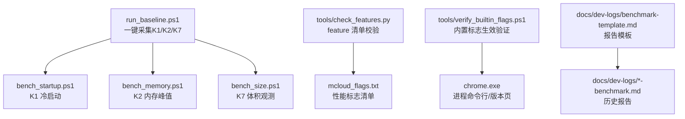
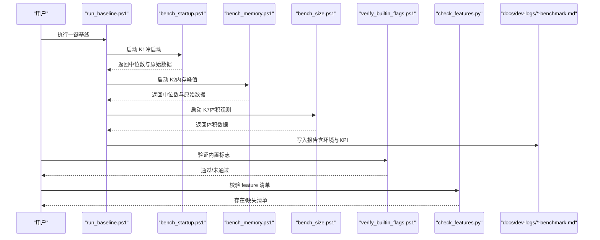
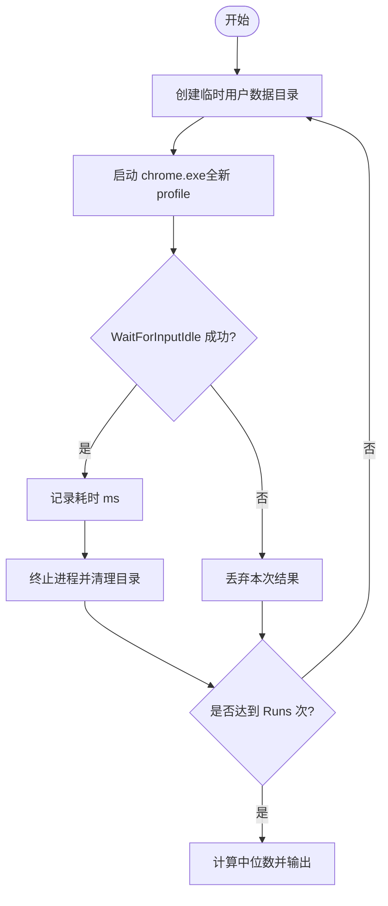
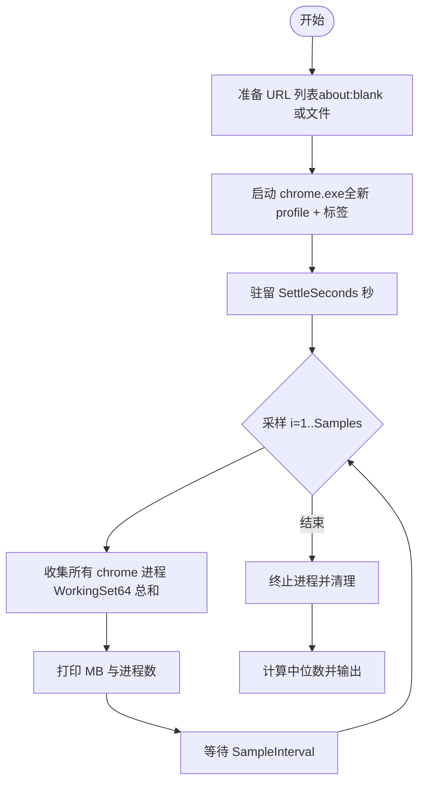
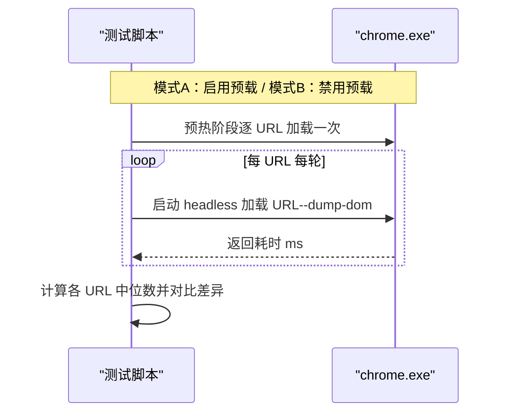
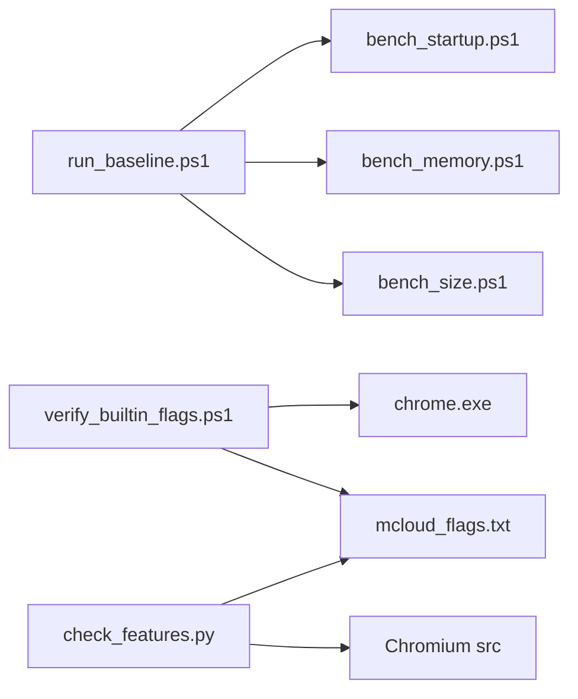

# 基准测试框架

本文引用的文件

- [run_baseline.ps1](https://github.com/Mcloud136/Mcloud-Browser/blob/main/benchmark/run_baseline.ps1)
- [bench_startup.ps1](https://github.com/Mcloud136/Mcloud-Browser/blob/main/benchmark/bench_startup.ps1)
- [bench_memory.ps1](https://github.com/Mcloud136/Mcloud-Browser/blob/main/benchmark/bench_memory.ps1)
- [bench_navigation.ps1](https://github.com/Mcloud136/Mcloud-Browser/blob/main/benchmark/bench_navigation.ps1)
- [bench_size.ps1](https://github.com/Mcloud136/Mcloud-Browser/blob/main/benchmark/bench_size.ps1)
- [check_features.py](https://github.com/Mcloud136/Mcloud-Browser/blob/main/benchmark/tools/check_features.py)
- [verify_builtin_flags.ps1](https://github.com/Mcloud136/Mcloud-Browser/blob/main/benchmark/tools/verify_builtin_flags.ps1)
- [mcloud_flags.txt](https://github.com/Mcloud136/Mcloud-Browser/blob/main/mcloud_flags.txt)
- [benchmark-template.md](https://github.com/Mcloud136/Mcloud-Browser/blob/main/docs/dev-logs/benchmark-template.md)
- [M150-benchmark.md](https://github.com/Mcloud136/Mcloud-Browser/blob/main/docs/dev-logs/M150-benchmark.md)
- [M151-benchmark.md](https://github.com/Mcloud136/Mcloud-Browser/blob/main/docs/dev-logs/M151-benchmark.md)
- [M151-opt-benchmark.md](https://github.com/Mcloud136/Mcloud-Browser/blob/main/docs/dev-logs/M151-opt-benchmark.md)

## 目录
1. [简介](#简介)
2. [项目结构](#项目结构)
3. [核心组件](#核心组件)
4. [架构总览](#架构总览)
5. [详细组件分析](#详细组件分析)
6. [依赖关系分析](#依赖关系分析)
7. [性能考量](#性能考量)
8. [故障排查指南](#故障排查指南)
9. [结论](#结论)
10. [附录](#附录)

## 简介
本框架为 MCloud Browser 提供一套可重复、可对比的基准测试能力，覆盖启动时间、内存占用、页面加载、二进制体积等关键指标，并配套内置标志注入验证与 feature 清单校验工具。通过统一脚本与报告模板，支持基线采集、版本对比、回归定位与优化评估。

## 项目结构
基准测试相关代码集中在 benchmark 目录，包含：
- 自动化执行入口：一键采集 K1/K2/K7 并生成报告
- 单项测试脚本：冷启动、内存、导航、体积
- 辅助工具：feature 清单有效性校验、内置标志生效验证
- 报告模板与历史报告：标准化输出与归档

图表来源
- [run_baseline.ps1:1-78](https://github.com/Mcloud136/Mcloud-Browser/blob/main/benchmark/run_baseline.ps1#L1-L78)
- [bench_startup.ps1:1-70](https://github.com/Mcloud136/Mcloud-Browser/blob/main/benchmark/bench_startup.ps1#L1-L70)
- [bench_memory.ps1:1-78](https://github.com/Mcloud136/Mcloud-Browser/blob/main/benchmark/bench_memory.ps1#L1-L78)
- [bench_size.ps1:1-44](https://github.com/Mcloud136/Mcloud-Browser/blob/main/benchmark/bench_size.ps1#L1-L44)
- [check_features.py:1-153](https://github.com/Mcloud136/Mcloud-Browser/blob/main/benchmark/tools/check_features.py#L1-L153)
- [verify_builtin_flags.ps1:1-98](https://github.com/Mcloud136/Mcloud-Browser/blob/main/benchmark/tools/verify_builtin_flags.ps1#L1-L98)
- [mcloud_flags.txt:1-120](https://github.com/Mcloud136/Mcloud-Browser/blob/main/mcloud_flags.txt#L1-L120)
- [benchmark-template.md:1-39](https://github.com/Mcloud136/Mcloud-Browser/blob/main/docs/dev-logs/benchmark-template.md#L1-L39)

章节来源
- [run_baseline.ps1:1-78](https://github.com/Mcloud136/Mcloud-Browser/blob/main/benchmark/run_baseline.ps1#L1-L78)
- [bench_startup.ps1:1-70](https://github.com/Mcloud136/Mcloud-Browser/blob/main/benchmark/bench_startup.ps1#L1-L70)
- [bench_memory.ps1:1-78](https://github.com/Mcloud136/Mcloud-Browser/blob/main/benchmark/bench_memory.ps1#L1-L78)
- [bench_size.ps1:1-44](https://github.com/Mcloud136/Mcloud-Browser/blob/main/benchmark/bench_size.ps1#L1-L44)
- [check_features.py:1-153](https://github.com/Mcloud136/Mcloud-Browser/blob/main/benchmark/tools/check_features.py#L1-L153)
- [verify_builtin_flags.ps1:1-98](https://github.com/Mcloud136/Mcloud-Browser/blob/main/benchmark/tools/verify_builtin_flags.ps1#L1-L98)
- [mcloud_flags.txt:1-120](https://github.com/Mcloud136/Mcloud-Browser/blob/main/mcloud_flags.txt#L1-L120)
- [benchmark-template.md:1-39](https://github.com/Mcloud136/Mcloud-Browser/blob/main/docs/dev-logs/benchmark-template.md#L1-L39)

## 核心组件
- 一键基线采集器：按固定流程依次执行 K1/K2/K7，汇总环境信息、KPI 摘要与原始数据，输出到 docs/dev-logs 下按版本命名的报告。
- K1 冷启动测试：使用全新用户数据目录启动浏览器，等待主窗口初始化完成（以 WaitForInputIdle 作为首屏可交互代理），多次运行取中位数。
- K2 内存峰值测试：打开固定数量标签页（默认 about:blank，也可指定 URL 列表），驻留稳定后对全部浏览器进程 WorkingSet64 求和，多次采样取中位数。
- K7 体积观测：统计 chrome.exe、安装包（如 mini_installer）及构建目录总体积，仅记录不约束。
- 导航响应测试：在同一构建下对比“启用预载类特性”与“禁用预载类特性”的页面加载耗时，用于验证预载收益。
- 内置标志验证：通过 headless 抓取 chrome://version 或子进程命令行，确认 mcloud_flags.txt 中的代表特性已注入生效。
- Feature 清单校验：解析 mcloud_flags.txt 中的 feature 名称，在 Chromium 源码树中检索是否仍存在，输出失效项以便升级维护。

章节来源
- [run_baseline.ps1:1-78](https://github.com/Mcloud136/Mcloud-Browser/blob/main/benchmark/run_baseline.ps1#L1-L78)
- [bench_startup.ps1:1-70](https://github.com/Mcloud136/Mcloud-Browser/blob/main/benchmark/bench_startup.ps1#L1-L70)
- [bench_memory.ps1:1-78](https://github.com/Mcloud136/Mcloud-Browser/blob/main/benchmark/bench_memory.ps1#L1-L78)
- [bench_size.ps1:1-44](https://github.com/Mcloud136/Mcloud-Browser/blob/main/benchmark/bench_size.ps1#L1-L44)
- [bench_navigation.ps1:1-109](https://github.com/Mcloud136/Mcloud-Browser/blob/main/benchmark/bench_navigation.ps1#L1-L109)
- [verify_builtin_flags.ps1:1-98](https://github.com/Mcloud136/Mcloud-Browser/blob/main/benchmark/tools/verify_builtin_flags.ps1#L1-L98)
- [check_features.py:1-153](https://github.com/Mcloud136/Mcloud-Browser/blob/main/benchmark/tools/check_features.py#L1-L153)
- [mcloud_flags.txt:1-120](https://github.com/Mcloud136/Mcloud-Browser/blob/main/mcloud_flags.txt#L1-L120)

## 架构总览
整体工作流由“配置驱动 + 脚本编排 + 结果归档”构成：
- 配置层：mcloud_flags.txt 定义性能开关；GN 构建参数决定编译优化。
- 执行层：PowerShell 脚本负责进程生命周期管理、计时、采样与清理。
- 验证层：Python/PowerShell 工具校验 feature 存在性与标志注入。
- 输出层：统一报告模板与历史报告便于对比与归档。

图表来源
- [run_baseline.ps1:1-78](https://github.com/Mcloud136/Mcloud-Browser/blob/main/benchmark/run_baseline.ps1#L1-L78)
- [bench_startup.ps1:1-70](https://github.com/Mcloud136/Mcloud-Browser/blob/main/benchmark/bench_startup.ps1#L1-L70)
- [bench_memory.ps1:1-78](https://github.com/Mcloud136/Mcloud-Browser/blob/main/benchmark/bench_memory.ps1#L1-L78)
- [bench_size.ps1:1-44](https://github.com/Mcloud136/Mcloud-Browser/blob/main/benchmark/bench_size.ps1#L1-L44)
- [verify_builtin_flags.ps1:1-98](https://github.com/Mcloud136/Mcloud-Browser/blob/main/benchmark/tools/verify_builtin_flags.ps1#L1-L98)
- [check_features.py:1-153](https://github.com/Mcloud136/Mcloud-Browser/blob/main/benchmark/tools/check_features.py#L1-L153)

## 详细组件分析

### K1 冷启动时间测试
- 目标：测量冷启动到中位可交互时间的稳定性与趋势。
- 方法要点：
  - 每次使用全新临时用户数据目录，避免缓存干扰。
  - 启动参数包含禁用首次运行与默认浏览器检查，减少噪声。
  - 以 WaitForInputIdle 作为首屏可交互代理，超时保护避免卡死。
  - 多次运行取中位数，丢弃无效样本。
- 参数说明：
  - ChromeExe：浏览器可执行路径。
  - Runs：运行次数（默认 5）。
- 输出格式：
  - 标准输出打印每次耗时与最终中位数。
  - 建议将原始数据与环境信息回填至报告模板。

图表来源
- [bench_startup.ps1:1-70](https://github.com/Mcloud136/Mcloud-Browser/blob/main/benchmark/bench_startup.ps1#L1-L70)

章节来源
- [bench_startup.ps1:1-70](https://github.com/Mcloud136/Mcloud-Browser/blob/main/benchmark/bench_startup.ps1#L1-L70)

### K2 内存峰值测试
- 目标：评估多标签场景下的内存占用稳定性。
- 方法要点：
  - 默认打开约 50 个 about:blank 标签，也可通过 URL 文件指定真实站点。
  - 驻留一段时间使内存趋于稳定，再多次采样 WorkingSet64 总和。
  - 对同一进程名（chrome）的所有进程进行汇总。
- 参数说明：
  - ChromeExe：浏览器可执行路径。
  - Tabs：标签数量（默认 50）。
  - SettleSeconds：驻留秒数（默认 90）。
  - Samples：采样次数（默认 5）。
  - SampleInterval：采样间隔（默认 5）。
  - UrlsFile：URL 列表文件路径（可选）。
  - ExtraFlags：额外启动参数（可选）。
- 输出格式：
  - 标准输出打印每次采样 MB 值与进程数，最终输出中位数与原始数据。

图表来源
- [bench_memory.ps1:1-78](https://github.com/Mcloud136/Mcloud-Browser/blob/main/benchmark/bench_memory.ps1#L1-L78)

章节来源
- [bench_memory.ps1:1-78](https://github.com/Mcloud136/Mcloud-Browser/blob/main/benchmark/bench_memory.ps1#L1-L78)

### K7 二进制体积观测
- 目标：记录 chrome.exe、安装包与构建目录体积，仅作观测。
- 方法要点：
  - 统计 chrome.exe 文件大小。
  - 查找 mini_installer 并记录大小。
  - 递归统计 out/mcloud 目录总体积。
- 参数说明：
  - OutDir：构建输出目录（默认 out/mcloud）。
- 输出格式：
  - 标准输出打印各体积项，提示仅观测。

章节来源
- [bench_size.ps1:1-44](https://github.com/Mcloud136/Mcloud-Browser/blob/main/benchmark/bench_size.ps1#L1-L44)

### 导航响应速度测试（预载收益验证）
- 目标：验证预载/预连接类特性对页面加载响应的实际收益。
- 方法要点：
  - 同一构建下对比两种模式：启用预载 vs 禁用预载（通过 --disable-features 传入一组特征）。
  - 每种模式先预热一遍 URL 列表，再测 N 轮，取中位数。
  - 使用 headless 模式与 --dump-dom 快速度量加载耗时。
- 参数说明：
  - ChromeExe：浏览器可执行路径。
  - Runs：每模式运行次数（默认 3）。
- 输出格式：
  - 标准输出打印每个 URL 的各轮耗时与中位数，最后给出 on/off 差异百分比。

图表来源
- [bench_navigation.ps1:1-109](https://github.com/Mcloud136/Mcloud-Browser/blob/main/benchmark/bench_navigation.ps1#L1-L109)

章节来源
- [bench_navigation.ps1:1-109](https://github.com/Mcloud136/Mcloud-Browser/blob/main/benchmark/bench_navigation.ps1#L1-L109)

### 内置启动标志生效验证
- 目标：确保 mcloud_flags.txt 中的标志被正确注入到运行时。
- 方法要点：
  - 首选 headless 抓取 chrome://version 页面内容，匹配代表 feature。
  - 若 headless 路径不可用，回退到子进程命令行探测（WMI 查询进程命令行）。
  - 抽取三组代表 feature（启动/内存/媒体）进行抽查。
- 参数说明：
  - ChromeExe：浏览器可执行路径。
- 输出格式：
  - 标准输出打印每个代表 feature 的命中情况，最终给出通过/未通过。

章节来源
- [verify_builtin_flags.ps1:1-98](https://github.com/Mcloud136/Mcloud-Browser/blob/main/benchmark/tools/verify_builtin_flags.ps1#L1-L98)

### Feature 清单有效性校验
- 目标：在升级 Chromium 源码时，校验 mcloud_flags.txt 中的 feature 是否仍存在于源码树中。
- 方法要点：
  - 解析 mcloud_flags.txt 中的 --enable-features/--disable-features 条目，提取 feature 名称。
  - 全源码扫描（排除 third_party 主体，仅保留 blink），匹配标识符边界，避免误报。
  - 输出存在/缺失清单，缺失时退出码为 1，便于集成检查。
- 参数说明：
  - --flags：mcloud_flags.txt 路径（默认仓库根目录）。
  - --src：Chromium src 目录（必填）。
- 输出格式：
  - 标准输出打印解析到的 feature 数量、扫描进度与缺失列表。

章节来源
- [check_features.py:1-153](https://github.com/Mcloud136/Mcloud-Browser/blob/main/benchmark/tools/check_features.py#L1-L153)

### 一键基线采集与报告生成
- 目标：自动化执行 K1/K2/K7，生成结构化报告，便于归档与对比。
- 方法要点：
  - 收集 CPU/GPU/OS/内存/电源模式等信息。
  - 依次调用 K1/K2/K7，捕获标准输出作为原始数据。
  - 组装 KPI 表格与原始数据块，写入 docs/dev-logs/{Version}-benchmark.md。
- 参数说明：
  - Version：版本号（默认 M150）。
  - ChromeExe：浏览器可执行路径。
  - OutDir：构建输出目录。
- 输出格式：
  - Markdown 报告，包含环境信息、KPI 表、原始数据与结论区。

章节来源
- [run_baseline.ps1:1-78](https://github.com/Mcloud136/Mcloud-Browser/blob/main/benchmark/run_baseline.ps1#L1-L78)
- [benchmark-template.md:1-39](https://github.com/Mcloud136/Mcloud-Browser/blob/main/docs/dev-logs/benchmark-template.md#L1-L39)

## 依赖关系分析
- 脚本间依赖：
  - run_baseline.ps1 依赖 bench_startup.ps1、bench_memory.ps1、bench_size.ps1。
  - bench_navigation.ps1 独立，但依赖浏览器可执行与网络可达性。
- 工具与配置依赖：
  - verify_builtin_flags.ps1 依赖 chrome.exe 与同目录 mcloud_flags.txt。
  - check_features.py 依赖 mcloud_flags.txt 与 Chromium src 目录。
- 外部依赖：
  - Windows 系统 API（进程管理、WMI、Stopwatch）。
  - 浏览器 headless 模式与 chrome://version 页面。

图表来源
- [run_baseline.ps1:1-78](https://github.com/Mcloud136/Mcloud-Browser/blob/main/benchmark/run_baseline.ps1#L1-L78)
- [verify_builtin_flags.ps1:1-98](https://github.com/Mcloud136/Mcloud-Browser/blob/main/benchmark/tools/verify_builtin_flags.ps1#L1-L98)
- [check_features.py:1-153](https://github.com/Mcloud136/Mcloud-Browser/blob/main/benchmark/tools/check_features.py#L1-L153)

章节来源
- [run_baseline.ps1:1-78](https://github.com/Mcloud136/Mcloud-Browser/blob/main/benchmark/run_baseline.ps1#L1-L78)
- [verify_builtin_flags.ps1:1-98](https://github.com/Mcloud136/Mcloud-Browser/blob/main/benchmark/tools/verify_builtin_flags.ps1#L1-L98)
- [check_features.py:1-153](https://github.com/Mcloud136/Mcloud-Browser/blob/main/benchmark/tools/check_features.py#L1-L153)

## 性能考量
- 环境控制：
  - 关闭其他浏览器实例，尽量清空系统缓存，保证冷态一致性。
  - 电源模式设为高性能，避免频率调度引入波动。
- 指标选择：
  - K1 使用 WaitForInputIdle 作为首屏可交互代理，适合跨版本对比，但绝对值受场景影响。
  - K2 使用 WorkingSet64 总和衡量内存占用，注意进程数变化对结果的影响。
  - K7 仅观测，不作为硬性约束。
- 采样策略：
  - 多次运行取中位数，降低异常值影响。
  - 导航测试采用预热+多轮采样，提升可比性。
- 预载特性权衡：
  - 预载/预连接类特性可能带来内存代价，需结合真实站点场景评估收益与成本。

[本节为通用指导，无需具体文件引用]

## 故障排查指南
- chrome.exe 不存在：
  - 现象：脚本报错提示路径无效。
  - 处理：通过 -ChromeExe 指定正确的可执行路径。
- 启动超时：
  - 现象：K1 等待主窗口初始化超时。
  - 处理：检查系统资源占用、杀毒软件拦截、用户数据目录权限。
- 内存采样异常：
  - 现象：进程数过少或过多导致结果不稳定。
  - 处理：确认标签数量与 URL 列表，适当增加驻留时间与采样次数。
- 内置标志未生效：
  - 现象：verify_builtin_flags.ps1 未检测到代表 feature。
  - 处理：确认 mcloud_flags.txt 位于 exe 同目录，且当前构建包含标志加载逻辑。
- Feature 缺失：
  - 现象：check_features.py 报告部分 feature 未在源码中找到。
  - 处理：从 mcloud_flags.txt 移除失效项，并在升级报告中记录原因与替代方案。

章节来源
- [bench_startup.ps1:1-70](https://github.com/Mcloud136/Mcloud-Browser/blob/main/benchmark/bench_startup.ps1#L1-L70)
- [bench_memory.ps1:1-78](https://github.com/Mcloud136/Mcloud-Browser/blob/main/benchmark/bench_memory.ps1#L1-L78)
- [verify_builtin_flags.ps1:1-98](https://github.com/Mcloud136/Mcloud-Browser/blob/main/benchmark/tools/verify_builtin_flags.ps1#L1-L98)
- [check_features.py:1-153](https://github.com/Mcloud136/Mcloud-Browser/blob/main/benchmark/tools/check_features.py#L1-L153)

## 结论
本框架以脚本化、可重复的方式实现 MCloud Browser 的关键性能指标采集与验证，覆盖启动、内存、导航与体积维度，并通过内置标志验证与 feature 清单校验保障构建质量。借助统一报告模板与历史归档，支持基线建立、版本对比与回归定位。建议在真实 GPU 环境下补充 K3-K6 手工流程，完善端到端性能闭环。

[本节为总结，无需具体文件引用]

## 附录

### 运行基线与比较不同版本
- 基线采集：
  - 执行 run_baseline.ps1，指定 Version、ChromeExe、OutDir，自动生成 docs/dev-logs/{Version}-benchmark.md。
- 版本对比：
  - 在同机同方法下运行新版本，比较 K1/K2/K7 的中位数与原始数据。
  - 结合 M150/M151 历史报告，观察趋势与回归。

章节来源
- [run_baseline.ps1:1-78](https://github.com/Mcloud136/Mcloud-Browser/blob/main/benchmark/run_baseline.ps1#L1-L78)
- [M150-benchmark.md:1-49](https://github.com/Mcloud136/Mcloud-Browser/blob/main/docs/dev-logs/M150-benchmark.md#L1-L49)
- [M151-benchmark.md:1-30](https://github.com/Mcloud136/Mcloud-Browser/blob/main/docs/dev-logs/M151-benchmark.md#L1-L30)

### 自定义测试用例开发指南
- 新增指标：
  - 参考现有脚本结构，封装参数解析、进程生命周期管理、计时与采样逻辑。
  - 输出标准格式（中位数与原始数据），便于统一归档。
- 最佳实践：
  - 使用全新用户数据目录隔离状态。
  - 设置合理的超时与重试机制。
  - 明确场景假设（如 about:blank vs 真实站点），确保可比性。
  - 在报告中注明环境与参数，便于复现。

[本节为通用指导，无需具体文件引用]

### 常见示例与参考
- 导航收益验证：
  - 使用 bench_navigation.ps1 对比启用/禁用预载类的加载耗时，关注 bilibili 等站点的差异化表现。
- 内存代价评估：
  - 使用 bench_memory.ps1 的 ExtraFlags 参数，针对特定 feature 组合评估内存变化。
- 标志注入验证：
  - 使用 verify_builtin_flags.ps1 抽查代表 feature，确保 mcloud_flags.txt 生效。

章节来源
- [bench_navigation.ps1:1-109](https://github.com/Mcloud136/Mcloud-Browser/blob/main/benchmark/bench_navigation.ps1#L1-L109)
- [bench_memory.ps1:1-78](https://github.com/Mcloud136/Mcloud-Browser/blob/main/benchmark/bench_memory.ps1#L1-L78)
- [verify_builtin_flags.ps1:1-98](https://github.com/Mcloud136/Mcloud-Browser/blob/main/benchmark/tools/verify_builtin_flags.ps1#L1-L98)
- [M151-opt-benchmark.md:1-78](https://github.com/Mcloud136/Mcloud-Browser/blob/main/docs/dev-logs/M151-opt-benchmark.md#L1-L78)