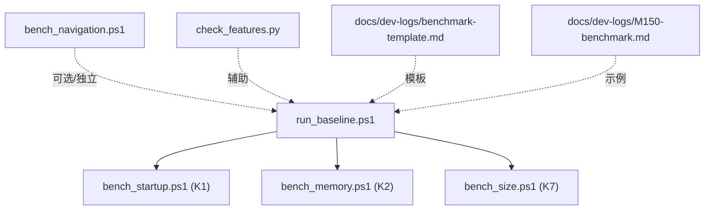
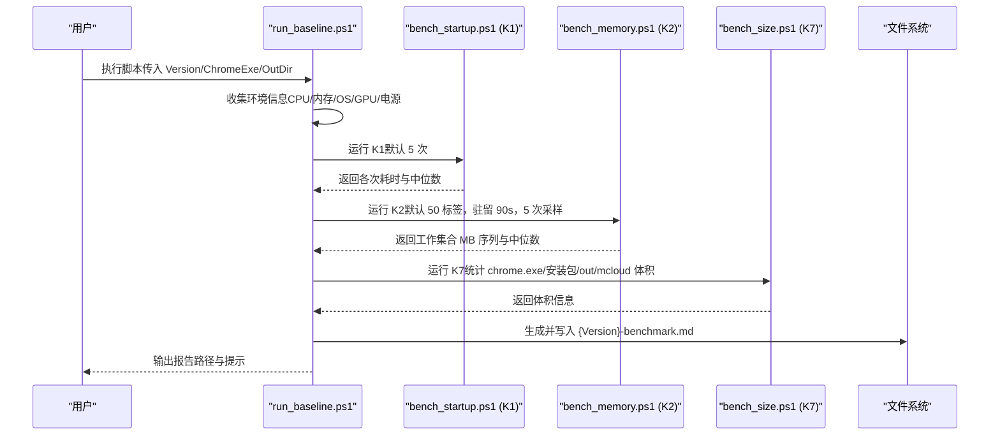
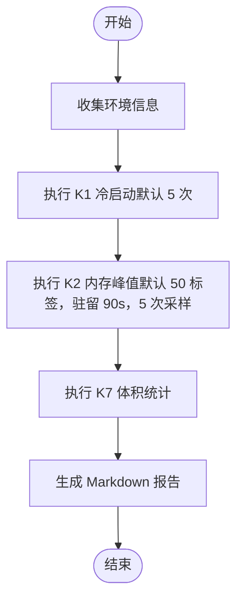
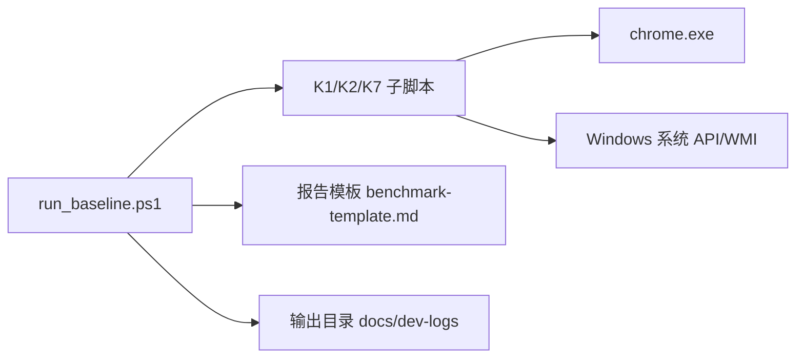

# 基线测试执行器

<cite>
**本文引用的文件**
- [run_baseline.ps1](file://benchmark/run_baseline.ps1)
- [bench_startup.ps1](file://benchmark/bench_startup.ps1)
- [bench_memory.ps1](file://benchmark/bench_memory.ps1)
- [bench_navigation.ps1](file://benchmark/bench_navigation.ps1)
- [bench_size.ps1](file://benchmark/bench_size.ps1)
- [check_features.py](file://benchmark/tools/check_features.py)
- [benchmark-template.md](file://docs/dev-logs/benchmark-template.md)
- [M150-benchmark.md](file://docs/dev-logs/M150-benchmark.md)
</cite>

## 目录
1. [简介](#简介)
2. [项目结构](#项目结构)
3. [核心组件](#核心组件)
4. [架构总览](#架构总览)
5. [详细组件分析](#详细组件分析)
6. [依赖关系分析](#依赖关系分析)
7. [性能与稳定性考量](#性能与稳定性考量)
8. [故障排查指南](#故障排查指南)
9. [结论](#结论)
10. [附录：使用示例与最佳实践](#附录使用示例与最佳实践)

## 简介
本文件面向 MCloud Browser 的基线测试执行器，围绕 benchmark/run_baseline.ps1 脚本展开，说明其如何一键采集 K1（冷启动）、K2（内存峰值）、K7（二进制体积）三项核心基准，并生成标准化的 Markdown 报告。文档同时覆盖参数配置、执行流程、自动化编排、环境信息收集、结果汇总与原始数据记录方法，并提供不同版本对比的最佳实践与输出归档规范。

## 项目结构
基准测试相关脚本集中于 benchmark 目录，其中 run_baseline.ps1 作为统一入口，依次调用 K1/K2/K7 子脚本；导航类预载优化验证由 bench_navigation.ps1 提供独立能力；工具 check_features.py 用于校验运行时 feature 清单有效性；标准化报告模板位于 docs/dev-logs/benchmark-template.md，历史报告示例见 docs/dev-logs/M150-benchmark.md。

图表来源
- [run_baseline.ps1:1-78](file://benchmark/run_baseline.ps1#L1-L78)
- [bench_startup.ps1:1-70](file://benchmark/bench_startup.ps1#L1-L70)
- [bench_memory.ps1:1-78](file://benchmark/bench_memory.ps1#L1-L78)
- [bench_size.ps1:1-44](file://benchmark/bench_size.ps1#L1-L44)
- [bench_navigation.ps1:1-109](file://benchmark/bench_navigation.ps1#L1-L109)
- [check_features.py:1-153](file://benchmark/tools/check_features.py#L1-L153)
- [benchmark-template.md:1-39](file://docs/dev-logs/benchmark-template.md#L1-L39)
- [M150-benchmark.md:1-49](file://docs/dev-logs/M150-benchmark.md#L1-L49)

章节来源
- [run_baseline.ps1:1-78](file://benchmark/run_baseline.ps1#L1-L78)
- [bench_startup.ps1:1-70](file://benchmark/bench_startup.ps1#L1-L70)
- [bench_memory.ps1:1-78](file://benchmark/bench_memory.ps1#L1-L78)
- [bench_size.ps1:1-44](file://benchmark/bench_size.ps1#L1-L44)
- [bench_navigation.ps1:1-109](file://benchmark/bench_navigation.ps1#L1-L109)
- [check_features.py:1-153](file://benchmark/tools/check_features.py#L1-L153)
- [benchmark-template.md:1-39](file://docs/dev-logs/benchmark-template.md#L1-L39)
- [M150-benchmark.md:1-49](file://docs/dev-logs/M150-benchmark.md#L1-L49)

## 核心组件
- run_baseline.ps1：统一编排器，负责参数解析、环境信息采集、顺序执行 K1/K2/K7、汇总结果并写入 Markdown 报告。
- bench_startup.ps1：K1 冷启动时间测量，使用全新用户数据目录，等待主窗口可交互作为首屏指标，多次采样取中位数。
- bench_memory.ps1：K2 内存峰值测量，打开固定数量标签页，驻留稳定后对全部浏览器进程 WorkingSet64 求和，多次采样取中位数。
- bench_size.ps1：K7 二进制体积观测，统计 chrome.exe、安装包（如存在）及构建目录总体积。
- bench_navigation.ps1：导航响应速度基准，对比启用/禁用预载类特性对页面加载时延的影响（独立于 K1/K2/K7）。
- check_features.py：校验 mcloud_flags.txt 中的 feature 在当前 Chromium 源码中是否仍然有效，辅助升级与回归检查。

章节来源
- [run_baseline.ps1:1-78](file://benchmark/run_baseline.ps1#L1-L78)
- [bench_startup.ps1:1-70](file://benchmark/bench_startup.ps1#L1-L70)
- [bench_memory.ps1:1-78](file://benchmark/bench_memory.ps1#L1-L78)
- [bench_size.ps1:1-44](file://benchmark/bench_size.ps1#L1-L44)
- [bench_navigation.ps1:1-109](file://benchmark/bench_navigation.ps1#L1-L109)
- [check_features.py:1-153](file://benchmark/tools/check_features.py#L1-L153)

## 架构总览
run_baseline.ps1 采用“编排 + 子任务”的架构：
- 参数层：Version、ChromeExe、OutDir 三个关键参数控制被测版本、可执行路径与输出目录。
- 环境层：自动采集 CPU、内存、OS、GPU/驱动、电源模式提示等，形成报告的环境信息表。
- 执行层：按序调用 K1/K2/K7，捕获标准输出以便回填到报告的“原始数据”段。
- 报告层：按 benchmark-template.md 的结构生成 Markdown 报告，落盘至 docs/dev-logs/{Version}-benchmark.md。

图表来源
- [run_baseline.ps1:1-78](file://benchmark/run_baseline.ps1#L1-L78)
- [bench_startup.ps1:1-70](file://benchmark/bench_startup.ps1#L1-L70)
- [bench_memory.ps1:1-78](file://benchmark/bench_memory.ps1#L1-L78)
- [bench_size.ps1:1-44](file://benchmark/bench_size.ps1#L1-L44)

## 详细组件分析

### run_baseline.ps1（统一编排器）
- 功能要点
  - 参数：Version（默认 M150）、ChromeExe（默认 out/mcloud/chrome.exe）、OutDir（默认 out/mcloud）。
  - 环境信息：通过系统 WMI 获取 CPU、内存、操作系统、GPU/驱动，提示电源模式需设为高性能，扩展为无（使用全新用户数据目录）。
  - 执行流程：依次调用 K1/K2/K7，并将各自的标准输出追加到报告的“原始数据”段落。
  - 报告输出：按模板生成标题、日期、构建信息、环境信息表、KPI 摘要表、原始数据块、结论与异常记录占位；最终写入 docs/dev-logs/{Version}-benchmark.md。
- 复杂度与性能
  - 主要开销来自 K1/K2 的实际浏览器启动与驻留；K7 为轻量级文件统计。
  - 采样次数与驻留时长可通过子脚本参数调整，影响整体执行时间。
- 错误处理
  - 设置 $ErrorActionPreference = Stop，遇到错误立即终止，便于 CI 或人工快速定位问题。
- 集成点
  - 依赖各子脚本的命令行约定；依赖 docs/dev-logs 目录存在性（不存在则创建）。

章节来源
- [run_baseline.ps1:1-78](file://benchmark/run_baseline.ps1#L1-L78)

#### 执行流程图（K1→K2→K7）

图表来源
- [run_baseline.ps1:1-78](file://benchmark/run_baseline.ps1#L1-L78)

### bench_startup.ps1（K1 冷启动）
- 方法
  - 每次使用全新临时用户数据目录，启动 chrome.exe 并等待 WaitForInputIdle 作为首屏可交互代理指标，记录耗时。
  - 默认 5 次采样，丢弃超时项，计算中位数。
- 关键点
  - 隔离性：全新用户数据目录避免缓存/状态干扰。
  - 稳定性：每次结束后清理进程与目录，并短暂休眠让系统回到冷态。
- 输出
  - 打印每次耗时与中位数，以及原始数据序列，供上层脚本汇总。

章节来源
- [bench_startup.ps1:1-70](file://benchmark/bench_startup.ps1#L1-L70)

### bench_memory.ps1（K2 内存峰值）
- 方法
  - 以全新用户数据目录打开固定数量标签页（默认 50），驻留稳定（默认 90 秒）后，对所有浏览器进程 WorkingSet64 求和得到 MB 值。
  - 支持从 UrlsFile 读取 URL 列表（每行一个），否则使用 about:blank 降低网络波动。
  - 默认 5 次采样，间隔 5 秒，计算中位数。
- 关键点
  - 进程聚合：按主进程名查找所有子进程并求和，确保多进程场景准确。
  - 资源清理：测试完成后强制关闭进程并删除临时用户数据目录。
- 输出
  - 打印每次采样结果与中位数，以及原始数据序列。

章节来源
- [bench_memory.ps1:1-78](file://benchmark/bench_memory.ps1#L1-L78)

### bench_size.ps1（K7 体积）
- 方法
  - 统计 chrome.exe 体积、mini_installer（如存在）体积、out/mcloud 目录总体积。
- 关键点
  - 仅观测指标，不设上限；便于趋势跟踪与回归预警。
- 输出
  - 格式化输出各项体积，便于直接粘贴到报告。

章节来源
- [bench_size.ps1:1-44](file://benchmark/bench_size.ps1#L1-L44)

### bench_navigation.ps1（导航响应速度，预载优化验证）
- 目的
  - 验证预载/预连接类特性对“打开页面”响应速度的收益。
- 方法
  - 同一构建下对比两种模式：默认启用预载 vs 通过 --disable-features 禁用预载类特性。
  - 每种模式先预热一遍 URL 列表（建立预测器/预连接/缓存状态），再测 N 轮取中位数。
- 关键点
  - 使用 headless 模式与 dump-dom 方式测量加载耗时，减少 UI 干扰。
  - 内置一组国内可直连的测试 URL，便于复现。
- 输出
  - 分别输出 on/off 模式下各 URL 的中位数，并计算差异百分比。

章节来源
- [bench_navigation.ps1:1-109](file://benchmark/bench_navigation.ps1#L1-L109)

### check_features.py（feature 清单校验）
- 功能
  - 解析 mcloud_flags.txt 中的 feature 名称，在目标 Chromium 源码树中检索是否存在，输出失效清单。
- 关键点
  - 排除 third_party 主体，仅扫描 blink 等白名单子树；避免误报。
  - 非 feature 类开关不在校验范围；退出码 1 表示存在失效项，便于接入升级检查清单。
- 适用场景
  - 内核升级后快速发现被移除或更名的 feature，指导更新 mcloud_flags.txt。

章节来源
- [check_features.py:1-153](file://benchmark/tools/check_features.py#L1-L153)

## 依赖关系分析
- 脚本间耦合
  - run_baseline.ps1 强依赖 K1/K2/K7 子脚本的命令行约定与输出格式。
  - 报告生成依赖 docs/dev-logs 目录与 benchmark-template.md 的结构约定。
- 外部依赖
  - Windows 系统命令与 WMI（CPU/内存/OS/GPU 采集）。
  - Chrome 可执行文件路径与构建产物（chrome.exe、mini_installer）。
- 潜在循环依赖
  - 无循环依赖；脚本为单向调用链。
- 接口契约
  - 子脚本需在成功时返回 0 并在控制台输出可读文本；失败时返回非 0 并输出错误信息。

图表来源
- [run_baseline.ps1:1-78](file://benchmark/run_baseline.ps1#L1-L78)
- [bench_startup.ps1:1-70](file://benchmark/bench_startup.ps1#L1-L70)
- [bench_memory.ps1:1-78](file://benchmark/bench_memory.ps1#L1-L78)
- [bench_size.ps1:1-44](file://benchmark/bench_size.ps1#L1-L44)
- [benchmark-template.md:1-39](file://docs/dev-logs/benchmark-template.md#L1-L39)

章节来源
- [run_baseline.ps1:1-78](file://benchmark/run_baseline.ps1#L1-L78)
- [bench_startup.ps1:1-70](file://benchmark/bench_startup.ps1#L1-L70)
- [bench_memory.ps1:1-78](file://benchmark/bench_memory.ps1#L1-L78)
- [bench_size.ps1:1-44](file://benchmark/bench_size.ps1#L1-L44)
- [benchmark-template.md:1-39](file://docs/dev-logs/benchmark-template.md#L1-L39)

## 性能与稳定性考量
- 采样策略
  - K1/K2 默认 5 次采样取中位数，有助于抑制单次噪声；可根据环境稳定性调整 Runs/Samples。
- 驻留与预热
  - K2 默认驻留 90 秒，确保工作集稳定；如需站点级测试，可使用 UrlsFile 指定 URL 列表。
  - bench_navigation.ps1 在每种模式下先预热 URL 列表，再正式测量，提升可比性。
- 资源隔离
  - 使用全新用户数据目录避免缓存/状态污染；测试结束后清理临时目录。
- 环境一致性
  - 建议电源模式设为高性能；GPU 为远程虚拟显示适配器时，视频解码与滚动流畅度建议在本地物理 GPU 复测。
- 可扩展性
  - 新增指标（如 K3-K6）可在 run_baseline.ps1 中按相同模式扩展调用；报告模板已预留相应行。

[本节为通用指导，不直接分析具体文件]

## 故障排查指南
- chrome.exe 不存在
  - 现象：子脚本报错并退出。
  - 处理：通过 -ChromeExe 指定正确路径；确认构建产物存在。
- 构建目录不存在
  - 现象：K7 报错。
  - 处理：通过 -OutDir 指向正确的 out/mcloud 路径；确保已构建。
- 超时或无有效结果
  - 现象：K1 未获得有效采样。
  - 处理：检查系统负载、防病毒软件、权限；适当增加超时或重试。
- 内存采样不稳定
  - 现象：K2 结果波动较大。
  - 处理：延长 SettleSeconds；关闭其他占用资源的程序；使用 UrlsFile 替换 about:blank 进行站点级测试。
- feature 失效
  - 现象：check_features.py 报告 NOT_FOUND。
  - 处理：从 mcloud_flags.txt 移除失效项或在升级报告中记录原因；必要时寻找替代 feature。

章节来源
- [bench_startup.ps1:1-70](file://benchmark/bench_startup.ps1#L1-L70)
- [bench_memory.ps1:1-78](file://benchmark/bench_memory.ps1#L1-L78)
- [bench_size.ps1:1-44](file://benchmark/bench_size.ps1#L1-L44)
- [check_features.py:1-153](file://benchmark/tools/check_features.py#L1-L153)

## 结论
run_baseline.ps1 提供了 MCloud Browser 的一键基线测试能力，覆盖 K1/K2/K7 三项核心指标，并通过标准化模板输出 Markdown 报告，便于归档与对比。配合 bench_navigation.ps1 与 check_features.py，可进一步验证预载优化效果与运行时标志的有效性。建议在稳定的高性能电源环境下执行，保持方法与场景一致，以确保跨版本对比的可比性与可复现性。

[本节为总结性内容，不直接分析具体文件]

## 附录：使用示例与最佳实践

### 基本用法
- 一键执行 K1/K2/K7：
  - 在 PowerShell 中运行：.\benchmark\run_baseline.ps1
  - 默认使用 Version=M150、ChromeExe=默认 out/mcloud/chrome.exe、OutDir=默认 out/mcloud。
- 指定版本与路径：
  - .\benchmark\run_baseline.ps1 -Version M151 -ChromeExe "D:\path\to\chrome.exe" -OutDir "D:\path\to\out\mcloud"

### 参数说明
- Version：版本号，用于报告标题与归档文件名。
- ChromeExe：被测浏览器可执行文件路径。
- OutDir：构建输出目录，用于 K7 体积统计。

### 执行流程与自动化编排
- 环境信息采集：CPU、内存、OS、GPU/驱动、电源模式提示。
- 顺序执行：K1 → K2 → K7。
- 结果汇总：将各子脚本输出追加到报告的“原始数据”段。
- 报告归档：写入 docs/dev-logs/{Version}-benchmark.md。

### 标准化报告规范
- 结构参考：docs/dev-logs/benchmark-template.md
- 字段要求：
  - 测试日期、构建信息、对照基准。
  - 环境信息表（必填）。
  - KPI 结果表（K1/K2/K7 至少填写本项目值）。
  - 原始数据块（保留各次采样序列）。
  - 结论与异常记录（回归项、异常波动、环境干扰说明）。
- 历史示例：docs/dev-logs/M150-benchmark.md

### 不同版本的对比测试方法
- 保持方法一致：同一机器、同一电源模式、同一采样次数与驻留时长。
- 分版本执行：分别以不同 Version 参数执行，生成对应 Markdown 报告。
- 横向对比：在同一份报告中补充“对照基准”列，或直接比较不同版本的报告。
- 预载优化验证：使用 bench_navigation.ps1 对比启用/禁用预载特性的差异。

### 输出格式与归档流程
- 输出位置：docs/dev-logs/{Version}-benchmark.md
- 归档建议：
  - 按版本命名文件，便于检索。
  - 将原始数据块保留在报告中，便于回溯。
  - 结合 CI/CD 将报告纳入发布物或知识库。

### 最佳实践
- 环境准备：
  - 关闭所有浏览器实例，清空系统缓存。
  - 电源模式设为高性能。
  - 如需站点级测试，准备 UrlsFile（每行一个 URL）。
- 执行前校验：
  - 使用 check_features.py 校验 mcloud_flags.txt 中的 feature 有效性。
- 执行后复核：
  - 检查报告是否完整，原始数据是否齐全。
  - 如有异常，记录到“结论与异常记录”。

章节来源
- [run_baseline.ps1:1-78](file://benchmark/run_baseline.ps1#L1-L78)
- [bench_startup.ps1:1-70](file://benchmark/bench_startup.ps1#L1-L70)
- [bench_memory.ps1:1-78](file://benchmark/bench_memory.ps1#L1-L78)
- [bench_size.ps1:1-44](file://benchmark/bench_size.ps1#L1-L44)
- [bench_navigation.ps1:1-109](file://benchmark/bench_navigation.ps1#L1-L109)
- [check_features.py:1-153](file://benchmark/tools/check_features.py#L1-L153)
- [benchmark-template.md:1-39](file://docs/dev-logs/benchmark-template.md#L1-L39)
- [M150-benchmark.md:1-49](file://docs/dev-logs/M150-benchmark.md#L1-L49)