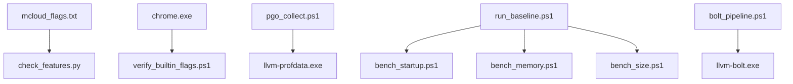
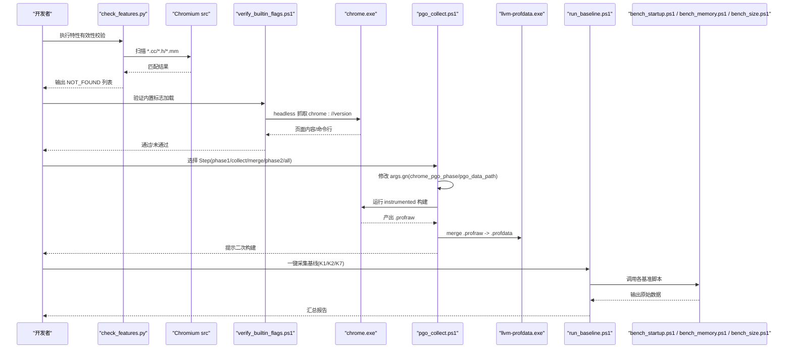
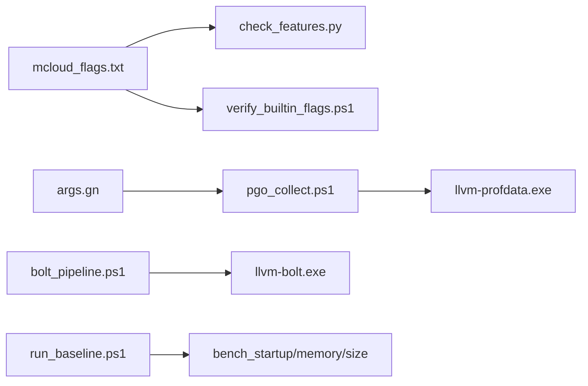

# 测试辅助工具

本文引用的文件

- [check_features.py](https://github.com/Mcloud136/Mcloud-Browser/blob/main/benchmark/tools/check_features.py)
- [pgo_collect.ps1](https://github.com/Mcloud136/Mcloud-Browser/blob/main/benchmark/tools/pgo_collect.ps1)
- [verify_builtin_flags.ps1](https://github.com/Mcloud136/Mcloud-Browser/blob/main/benchmark/tools/verify_builtin_flags.ps1)
- [run_baseline.ps1](https://github.com/Mcloud136/Mcloud-Browser/blob/main/benchmark/run_baseline.ps1)
- [bench_startup.ps1](https://github.com/Mcloud136/Mcloud-Browser/blob/main/benchmark/bench_startup.ps1)
- [bench_memory.ps1](https://github.com/Mcloud136/Mcloud-Browser/blob/main/benchmark/bench_memory.ps1)
- [bench_size.ps1](https://github.com/Mcloud136/Mcloud-Browser/blob/main/benchmark/bench_size.ps1)
- [bolt_pipeline.ps1](https://github.com/Mcloud136/Mcloud-Browser/blob/main/benchmark/tools/bolt_pipeline.ps1)
- [mcloud_flags.txt](https://github.com/Mcloud136/Mcloud-Browser/blob/main/mcloud_flags.txt)

## 目录
1. [简介](#简介)
2. [项目结构](#项目结构)
3. [核心组件](#核心组件)
4. [架构总览](#架构总览)
5. [详细组件分析](#详细组件分析)
6. [依赖关系分析](#依赖关系分析)
7. [性能考量](#性能考量)
8. [故障排除指南](#故障排除指南)
9. [结论](#结论)
10. [附录：集成与扩展](#附录：集成与扩展)

## 简介
本文件面向 MCloud Browser 基准测试的“辅助工具集”，聚焦以下三个关键工具：
- check_features.py：校验 mcloud_flags.txt 中启用的特性在目标 Chromium 源码中是否仍然有效，避免上游变更导致构建或运行时异常。
- pgo_collect.ps1：以真实用户场景采集 PGO 原始数据并生成 .profdata，驱动二次优化构建，使热点优化贴合产品定位。
- verify_builtin_flags.ps1：验证内置启动标志加载器是否将 mcloud_flags.txt 中的特性注入到浏览器进程命令行（通过 headless 抓取 chrome://version 或子进程命令行探测）。

这些工具与基准脚本（K1/K2/K7）协同工作，确保测试环境稳定、指标可复现，并对测试结果准确性与性能产生直接影响。

## 项目结构
MCloud Browser 的基准与辅助工具集中在 benchmark 目录，其中 tools 子目录包含专用辅助脚本；根级 mcloud_flags.txt 集中管理性能相关特性开关。

图表来源
- [check_features.py:1-153](https://github.com/Mcloud136/Mcloud-Browser/blob/main/benchmark/tools/check_features.py#L1-L153)
- [pgo_collect.ps1:1-106](https://github.com/Mcloud136/Mcloud-Browser/blob/main/benchmark/tools/pgo_collect.ps1#L1-L106)
- [verify_builtin_flags.ps1:1-98](https://github.com/Mcloud136/Mcloud-Browser/blob/main/benchmark/tools/verify_builtin_flags.ps1#L1-L98)
- [run_baseline.ps1:1-78](https://github.com/Mcloud136/Mcloud-Browser/blob/main/benchmark/run_baseline.ps1#L1-L78)
- [bench_startup.ps1:1-70](https://github.com/Mcloud136/Mcloud-Browser/blob/main/benchmark/bench_startup.ps1#L1-L70)
- [bench_memory.ps1:1-78](https://github.com/Mcloud136/Mcloud-Browser/blob/main/benchmark/bench_memory.ps1#L1-L78)
- [bench_size.ps1:1-44](https://github.com/Mcloud136/Mcloud-Browser/blob/main/benchmark/bench_size.ps1#L1-L44)
- [bolt_pipeline.ps1:1-108](https://github.com/Mcloud136/Mcloud-Browser/blob/main/benchmark/tools/bolt_pipeline.ps1#L1-L108)

章节来源
- [mcloud_flags.txt:1-120](https://github.com/Mcloud136/Mcloud-Browser/blob/main/mcloud_flags.txt#L1-L120)
- [run_baseline.ps1:1-78](https://github.com/Mcloud136/Mcloud-Browser/blob/main/benchmark/run_baseline.ps1#L1-L78)

## 核心组件
- check_features.py：解析 mcloud_flags.txt 中的 --enable-features/--disable-features 条目，扫描目标 Chromium src 树（排除 third_party 主体，仅保留 blink），输出未找到项，便于升级前清理或替换。
- pgo_collect.ps1：分阶段引导 PGO 流程（phase1-build → collect → merge → phase2-build），自动修改 args.gn 中的 chrome_pgo_phase 与 pgo_data_path，驱动 instrumented 构建收集 .profraw，合并为 .profdata，再触发二次优化构建。
- verify_builtin_flags.ps1：以 headless 模式抓取 chrome://version，检查代表 feature 是否出现在输出中；若失败则回退到子进程命令行探测，确认 LoadMcloudPerformanceFlags() 是否生效。

章节来源
- [check_features.py:44-110](https://github.com/Mcloud136/Mcloud-Browser/blob/main/benchmark/tools/check_features.py#L44-L110)
- [pgo_collect.ps1:21-106](https://github.com/Mcloud136/Mcloud-Browser/blob/main/benchmark/tools/pgo_collect.ps1#L21-L106)
- [verify_builtin_flags.ps1:15-98](https://github.com/Mcloud136/Mcloud-Browser/blob/main/benchmark/tools/verify_builtin_flags.ps1#L15-L98)

## 架构总览
下图展示了辅助工具与基准脚本、构建产物及外部工具的交互关系。

图表来源
- [check_features.py:113-148](https://github.com/Mcloud136/Mcloud-Browser/blob/main/benchmark/tools/check_features.py#L113-L148)
- [verify_builtin_flags.ps1:40-98](https://github.com/Mcloud136/Mcloud-Browser/blob/main/benchmark/tools/verify_builtin_flags.ps1#L40-L98)
- [pgo_collect.ps1:56-99](https://github.com/Mcloud136/Mcloud-Browser/blob/main/benchmark/tools/pgo_collect.ps1#L56-L99)
- [run_baseline.ps1:45-78](https://github.com/Mcloud136/Mcloud-Browser/blob/main/benchmark/run_baseline.ps1#L45-L78)

## 详细组件分析

### 特性检查工具 check_features.py
- 作用：从 mcloud_flags.txt 提取所有 feature 名称，扫描目标 Chromium src 树，判断是否存在；不存在时返回非零退出码，便于 CI 阻断。
- 参数：
  - --flags：mcloud_flags.txt 路径（默认仓库根目录）
  - --src：目标 Chromium src 目录（必填）
- 执行流程：
  1) 解析 flags 文件，去重保序提取 feature 名
  2) 构造正则匹配（避免长名前缀误报）
  3) 遍历 src 树（跳过 out/.git/testdata/test/tests/third_party 等），仅在 .cc/.h/.mm 中检索
  4) 对 third_party 仅扫描白名单（blink）
  5) 输出 found/not_found，not_found 存在时退出码为 1
- 复杂度与性能：
  - 时间复杂度近似 O(N·F)，N 为扫描文件数，F 为特征数量；通过 early exit（remaining 为空即停止）优化
  - 空间复杂度主要取决于 remaining 集合与正则编译开销
- 错误处理：
  - flags 文件不存在或 src 目录无效直接报错退出
  - 文件读取异常被忽略，继续扫描
- 集成建议：
  - 在升级前作为门禁步骤，防止上游移除/更名特性导致构建或行为异常
  - 与文档规范联动，记录移除原因与替代方案

章节来源
- [check_features.py:23-110](https://github.com/Mcloud136/Mcloud-Browser/blob/main/benchmark/tools/check_features.py#L23-L110)
- [check_features.py:113-148](https://github.com/Mcloud136/Mcloud-Browser/blob/main/benchmark/tools/check_features.py#L113-L148)
- [mcloud_flags.txt:8-120](https://github.com/Mcloud136/Mcloud-Browser/blob/main/mcloud_flags.txt#L8-L120)

### PGO 配置文件收集工具 pgo_collect.ps1
- 作用：以真实使用场景采集 PGO 原始数据，生成 .profdata，驱动二次优化构建，提升热点代码命中率。
- 参数：
  - -Step：phase1-build | collect | merge | phase2-build | all
  - -OutDir：构建输出目录（默认 out/mcloud）
  - -LlvmBin：llvm-profdata.exe 所在目录（自动探测）
  - -CollectSeconds：场景驱动时长（默认 300 秒）
- 执行流程：
  1) phase1-build：设置 chrome_pgo_phase=1，提示 gn gen + 全量构建
  2) collect：运行 instrumented 构建，设置环境变量导出 .profraw，模拟真实场景后终止进程
  3) merge：调用 llvm-profdata.exe 合并 .profraw 为 .profdata
  4) phase2-build：设置 chrome_pgo_phase=2 并指向 pgo_data_path，提示再次全量构建
  5) all：分阶段指引（含两次人工干预的全量构建）
- 依赖与前置：
  - 需要 llvm-profdata.exe（Chromium 内置工具链不含，需自备）
  - 两次全量构建耗时较长，建议在空闲时段执行
- 错误处理：
  - 缺少 chrome.exe 或未产生 .profraw 会抛出异常
  - 未找到 llvm-profdata.exe 会明确提示安装或指定路径
- 集成建议：
  - 与 bolt_pipeline.ps1 配合，形成 PGO + BOLT 双优化流水线
  - 二次构建后按规范进行对比验证（如 K1 冷启动）

章节来源
- [pgo_collect.ps1:21-106](https://github.com/Mcloud136/Mcloud-Browser/blob/main/benchmark/tools/pgo_collect.ps1#L21-L106)

### 内置标志验证工具 verify_builtin_flags.ps1
- 作用：验证 LoadMcloudPerformanceFlags() 是否将 mcloud_flags.txt 注入到进程命令行，确保内置标志生效。
- 参数：
  - -ChromeExe：chrome.exe 路径（默认 out/mcloud/chrome.exe）
- 执行流程：
  1) 检查 chrome.exe 与同目录 mcloud_flags.txt 是否存在
  2) 以 headless=new 模式抓取 chrome://version，检查代表 feature 是否出现
  3) 若 headless 路径失败，回退到子进程命令行探测（WMI 查询）
  4) 全部代表 feature 命中则通过，否则给出排查提示
- 代表特性：SpareRendererForSitePerProcess、InfiniteTabsFreezing、PlatformHEVCDecoderSupport
- 错误处理：
  - 缺失 chrome.exe 或 mcloud_flags.txt 直接报错退出
  - headless 无输出时降级到子进程探测
- 集成建议：
  - 在每次构建后快速验证，确保标志加载器正确工作
  - 与 docs/dev-logs 记录闭环，便于追溯

章节来源
- [verify_builtin_flags.ps1:15-98](https://github.com/Mcloud136/Mcloud-Browser/blob/main/benchmark/tools/verify_builtin_flags.ps1#L15-L98)

### 基准脚本与基线采集 run_baseline.ps1
- 作用：一键采集 K1 冷启动、K2 内存、K7 体积三项自动化基准，生成标准化报告。
- 参数：
  - -Version：版本号（默认 M150）
  - -ChromeExe：chrome.exe 路径
  - -OutDir：构建输出目录
- 执行流程：
  1) 收集环境信息（CPU/GPU/OS/内存/电源模式/扩展）
  2) 依次调用 bench_startup.ps1、bench_memory.ps1、bench_size.ps1
  3) 汇总原始数据并写入 docs/dev-logs/{版本}-benchmark.md
- 集成建议：
  - 作为基线采集入口，后续手工补充 K3-K6 结果
  - 与辅助工具配合，确保环境与标志一致

章节来源
- [run_baseline.ps1:11-78](https://github.com/Mcloud136/Mcloud-Browser/blob/main/benchmark/run_baseline.ps1#L11-L78)
- [bench_startup.ps1:12-70](https://github.com/Mcloud136/Mcloud-Browser/blob/main/benchmark/bench_startup.ps1#L12-L70)
- [bench_memory.ps1:13-78](https://github.com/Mcloud136/Mcloud-Browser/blob/main/benchmark/bench_memory.ps1#L13-L78)
- [bench_size.ps1:9-44](https://github.com/Mcloud136/Mcloud-Browser/blob/main/benchmark/bench_size.ps1#L9-L44)

## 依赖关系分析
- 外部工具依赖：
  - llvm-profdata.exe：用于 PGO 原始数据合并
  - llvm-bolt.exe / merge-fdata.exe：用于 BOLT 插桩与 profile 合并
- 内部依赖：
  - mcloud_flags.txt：特性清单，被 check_features.py 与 verify_builtin_flags.ps1 引用
  - args.gn：被 pgo_collect.ps1 动态修改以控制 PGO 阶段与数据路径
- 耦合与内聚：
  - 辅助工具与基准脚本解耦良好，通过命令行参数与文件系统约定协作
  - PGO 与 BOLT 流水线独立但可串联，便于分阶段验证

图表来源
- [pgo_collect.ps1:31-54](https://github.com/Mcloud136/Mcloud-Browser/blob/main/benchmark/tools/pgo_collect.ps1#L31-L54)
- [bolt_pipeline.ps1:30-45](https://github.com/Mcloud136/Mcloud-Browser/blob/main/benchmark/tools/bolt_pipeline.ps1#L30-L45)
- [check_features.py:116-133](https://github.com/Mcloud136/Mcloud-Browser/blob/main/benchmark/tools/check_features.py#L116-L133)
- [verify_builtin_flags.ps1:26-44](https://github.com/Mcloud136/Mcloud-Browser/blob/main/benchmark/tools/verify_builtin_flags.ps1#L26-L44)

章节来源
- [pgo_collect.ps1:31-54](https://github.com/Mcloud136/Mcloud-Browser/blob/main/benchmark/tools/pgo_collect.ps1#L31-L54)
- [bolt_pipeline.ps1:30-45](https://github.com/Mcloud136/Mcloud-Browser/blob/main/benchmark/tools/bolt_pipeline.ps1#L30-L45)

## 性能考量
- 扫描效率：check_features.py 通过 early exit 与文件类型过滤减少 I/O 与正则开销
- 构建成本：pgo_collect.ps1 涉及两次全量构建，应安排在空闲时段；合理设置 CollectSeconds 平衡数据质量与耗时
- 验证开销：verify_builtin_flags.ps1 的 headless 抓取轻量，子进程探测作为兜底，整体开销可控
- 基准稳定性：run_baseline.ps1 使用全新用户数据目录与固定标签集，降低网络与缓存波动影响

[本节为通用指导，不直接分析具体文件]

## 故障排除指南
- check_features.py
  - 现象：NOT_FOUND 较多
  - 排查：确认 --src 指向正确的 Chromium 源码树；检查 mcloud_flags.txt 中特性是否已被上游移除或更名
  - 处理：移除失效特性并在升级报告中记录原因；如需替代特性，按规范审核新增
- pgo_collect.ps1
  - 现象：未产生 .profraw
  - 排查：确认已执行 phase1-build 且 chrome.exe 为 instrumented 构建；检查 LLVM_PROFILE_FILE 可写权限
  - 现象：merge 失败
  - 排查：确认 llvm-profdata.exe 可用；检查 .profraw 文件完整性
- verify_builtin_flags.ps1
  - 现象：headless 无输出
  - 排查：改用子进程命令行探测；确认 chrome.exe 与 mcloud_flags.txt 位于同一目录
  - 现象：代表特性未命中
  - 排查：确认 chrome_main_delegate.cc 已编入当前构建；检查 LoadMcloudPerformanceFlags() 逻辑
- 基准脚本
  - 现象：K1/K2 超时或无有效结果
  - 排查：关闭其他浏览器实例；确保系统处于冷态；调整 SettleSeconds/Samples

章节来源
- [check_features.py:124-148](https://github.com/Mcloud136/Mcloud-Browser/blob/main/benchmark/tools/check_features.py#L124-L148)
- [pgo_collect.ps1:61-85](https://github.com/Mcloud136/Mcloud-Browser/blob/main/benchmark/tools/pgo_collect.ps1#L61-L85)
- [verify_builtin_flags.ps1:46-98](https://github.com/Mcloud136/Mcloud-Browser/blob/main/benchmark/tools/verify_builtin_flags.ps1#L46-L98)
- [bench_startup.ps1:32-58](https://github.com/Mcloud136/Mcloud-Browser/blob/main/benchmark/bench_startup.ps1#L32-L58)
- [bench_memory.ps1:55-71](https://github.com/Mcloud136/Mcloud-Browser/blob/main/benchmark/bench_memory.ps1#L55-L71)

## 结论
本工具集围绕“特性有效性”“PGO 数据采集”“内置标志验证”三大主题，为 MCloud Browser 基准测试提供稳定、可复现的环境保障。通过 check_features.py 提前规避上游变更风险，通过 pgo_collect.ps1 实现贴合产品定位的热点优化，通过 verify_builtin_flags.ps1 确保标志加载器正确工作。结合 run_baseline.ps1 的基线采集，可形成完整的性能回归与优化闭环。

[本节为总结性内容，不直接分析具体文件]

## 附录：集成与扩展
- 集成方式
  - 在 CI 中加入 check_features.py 作为升级前门禁
  - 在构建机空闲时段执行 pgo_collect.ps1 的 full 流程，二次构建后进行 K1 对比
  - 每次构建后运行 verify_builtin_flags.ps1 快速验证标志加载
  - 使用 run_baseline.ps1 生成标准化报告，归档至 docs/dev-logs
- 自定义扩展
  - 新增特性：在 mcloud_flags.txt 中添加 --enable-features/--disable-features 条目，并通过 check_features.py 验证
  - 新增 PGO 场景：调整 pgo_collect.ps1 的 CollectSeconds 或增加典型站点 URL 列表
  - 新增验证点：在 verify_builtin_flags.ps1 的代表特性列表中追加新特性，确保覆盖关键路径
- 最佳实践
  - 保持 mcloud_flags.txt 与源码同步，及时清理失效特性
  - 记录每次 PGO/BOLT 优化的前后对比数据，便于回溯
  - 基准测试前确保电源模式为高性能，关闭无关进程，保证环境一致性

[本节为通用指导，不直接分析具体文件]