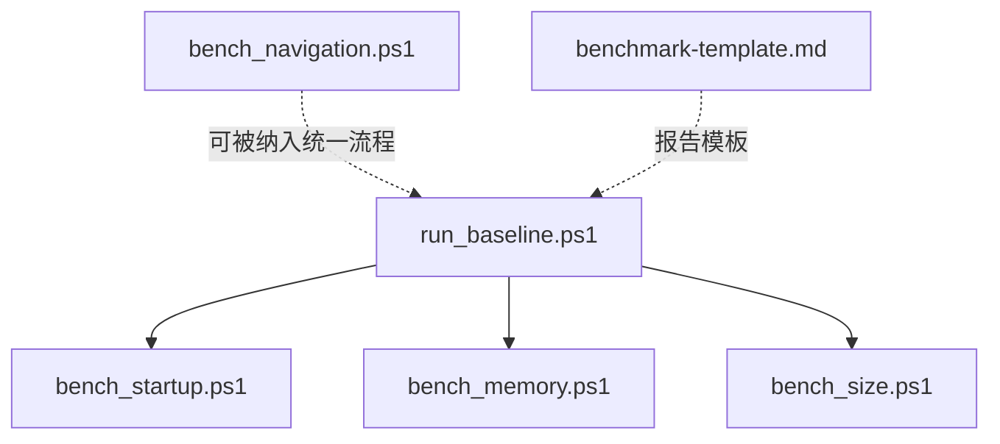
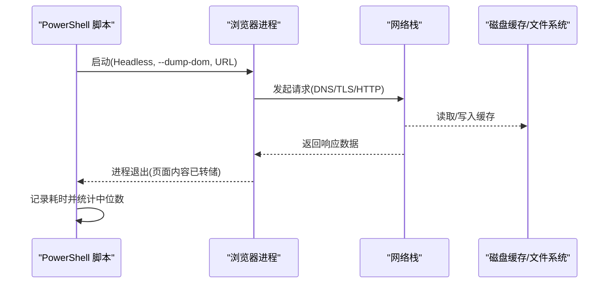

# 页面加载测试

本文引用的文件

- [bench_navigation.ps1](https://github.com/Mcloud136/Mcloud-Browser/blob/main/benchmark/bench_navigation.ps1)
- [run_baseline.ps1](https://github.com/Mcloud136/Mcloud-Browser/blob/main/benchmark/run_baseline.ps1)
- [bench_startup.ps1](https://github.com/Mcloud136/Mcloud-Browser/blob/main/benchmark/bench_startup.ps1)
- [bench_memory.ps1](https://github.com/Mcloud136/Mcloud-Browser/blob/main/benchmark/bench_memory.ps1)
- [bench_size.ps1](https://github.com/Mcloud136/Mcloud-Browser/blob/main/benchmark/bench_size.ps1)
- [benchmark-template.md](https://github.com/Mcloud136/Mcloud-Browser/blob/main/docs/dev-logs/benchmark-template.md)
- [url_request_http_job.cc](https://github.com/Mcloud136/Mcloud-Browser/blob/main/src/net/url_request/url_request_http_job.cc)
- [features.cc](https://github.com/Mcloud136/Mcloud-Browser/blob/main/src/third_party/blink/common/features.cc)

## 目录
1. [简介](#简介)
2. [项目结构](#项目结构)
3. [核心组件](#核心组件)
4. [架构总览](#架构总览)
5. [详细组件分析](#详细组件分析)
6. [依赖关系分析](#依赖关系分析)
7. [性能考量](#性能考量)
8. [故障排查指南](#故障排查指南)
9. [结论](#结论)
10. [附录](#附录)

## 简介
本文件围绕 MCloud Browser 的页面加载基准测试，重点解析 benchmark/bench_navigation.ps1 脚本如何测量“打开页面”的响应速度，并通过启用与禁用预载类特性进行对比。该脚本采用无头模式启动浏览器、预热缓存与预测器、对一组 URL 执行多次加载并统计中位数，最终输出两种模式的差异百分比。同时，文档补充了网络环境模拟、指标采集方式（首字节时间、DOM 构建时间、渲染完成时间）的可行实现路径，并提供不同网站类型的测试用例建议与优化建议。

## 项目结构
基准测试相关脚本集中在 benchmark 目录下，统一由 run_baseline.ps1 编排 K1/K2/K7 等基线任务；导航加载基准由 bench_navigation.ps1 独立提供。模板化报告位于 docs/dev-logs/benchmark-template.md，便于归档结果。

图表来源
- [run_baseline.ps1:1-78](https://github.com/Mcloud136/Mcloud-Browser/blob/main/benchmark/run_baseline.ps1#L1-L78)
- [bench_startup.ps1:1-70](https://github.com/Mcloud136/Mcloud-Browser/blob/main/benchmark/bench_startup.ps1#L1-L70)
- [bench_memory.ps1:1-78](https://github.com/Mcloud136/Mcloud-Browser/blob/main/benchmark/bench_memory.ps1#L1-L78)
- [bench_size.ps1:1-44](https://github.com/Mcloud136/Mcloud-Browser/blob/main/benchmark/bench_size.ps1#L1-L44)
- [benchmark-template.md:1-39](https://github.com/Mcloud136/Mcloud-Browser/blob/main/docs/dev-logs/benchmark-template.md#L1-L39)

章节来源
- [run_baseline.ps1:1-78](https://github.com/Mcloud136/Mcloud-Browser/blob/main/benchmark/run_baseline.ps1#L1-L78)
- [bench_navigation.ps1:1-109](https://github.com/Mcloud136/Mcloud-Browser/blob/main/benchmark/bench_navigation.ps1#L1-L109)
- [benchmark-template.md:1-39](https://github.com/Mcloud136/Mcloud-Browser/blob/main/docs/dev-logs/benchmark-template.md#L1-L39)

## 核心组件
- 导航加载基准：bench_navigation.ps1
  - 通过 --headless、--dump-dom 驱动单页加载，使用系统计时器统计端到端耗时。
  - 定义一组预载/预连接/预热特性集合，分别以启用和禁用两种方式运行，形成对照。
  - 先对目标 URL 列表进行一次预热，再执行 N 轮采样，取中位数作为结果。
- 基线编排：run_baseline.ps1
  - 统一调用 K1（冷启动）、K2（内存峰值）、K7（体积），并将原始输出写入 docs/dev-logs/{版本}-benchmark.md。
- 其他基准：
  - bench_startup.ps1：冷启动时间（K1）。
  - bench_memory.ps1：固定标签数下的内存峰值（K2）。
  - bench_size.ps1：二进制体积观测（K7）。

章节来源
- [bench_navigation.ps1:16-109](https://github.com/Mcloud136/Mcloud-Browser/blob/main/benchmark/bench_navigation.ps1#L16-L109)
- [run_baseline.ps1:11-78](https://github.com/Mcloud136/Mcloud-Browser/blob/main/benchmark/run_baseline.ps1#L11-L78)
- [bench_startup.ps1:12-70](https://github.com/Mcloud136/Mcloud-Browser/blob/main/benchmark/bench_startup.ps1#L12-L70)
- [bench_memory.ps1:13-78](https://github.com/Mcloud136/Mcloud-Browser/blob/main/benchmark/bench_memory.ps1#L13-L78)
- [bench_size.ps1:9-44](https://github.com/Mcloud136/Mcloud-Browser/blob/main/benchmark/bench_size.ps1#L9-L44)

## 架构总览
导航加载基准的整体流程如下：PowerShell 脚本启动浏览器进程，传入 headless 与 dump-dom 参数，等待进程退出后记录耗时；重复多轮后计算中位数；对比启用与禁用预载特性的两组结果，输出差异百分比。

图表来源
- [bench_navigation.ps1:54-96](https://github.com/Mcloud136/Mcloud-Browser/blob/main/benchmark/bench_navigation.ps1#L54-L96)
- [url_request_http_job.cc:1958-2133](https://github.com/Mcloud136/Mcloud-Browser/blob/main/src/net/url_request/url_request_http_job.cc#L1958-L2133)

章节来源
- [bench_navigation.ps1:54-96](https://github.com/Mcloud136/Mcloud-Browser/blob/main/benchmark/bench_navigation.ps1#L54-L96)
- [url_request_http_job.cc:1958-2133](https://github.com/Mcloud136/Mcloud-Browser/blob/main/src/net/url_request/url_request_http_job.cc#L1958-L2133)

## 详细组件分析

### 导航加载基准（bench_navigation.ps1）
- 功能要点
  - 定义预载/预连接/预热特性列表，并在“关闭预载”模式下通过命令行禁用这些特性，从而评估其对“打开页面”时延的影响。
  - 使用临时用户数据目录隔离每次测试，避免历史状态干扰。
  - 先对目标 URL 列表执行一次预热，再执行 N 轮采样，减少冷启动偏差。
  - 使用系统 Stopwatch 统计从进程启动到退出的总耗时，作为“页面加载耗时”的代理指标。
- 关键流程
  - 构造命令行参数：headless、disable-gpu、user-data-dir、no-first-run、no-default-browser-check、dump-dom、URL。
  - 循环执行 Measure-Url，收集每 URL 的多轮耗时。
  - 计算每组的中位数，并比较“开启预载”与“关闭预载”的差异百分比。
- 适用场景
  - 适合评估预载/预连接/预热类特性在“首次打开页面”时的收益或代价。
  - 由于是单次加载场景，预载的真实收益通常在重复导航/预测命中场景更明显，因此该结果为下界参考。

图表来源
- [bench_navigation.ps1:48-109](https://github.com/Mcloud136/Mcloud-Browser/blob/main/benchmark/bench_navigation.ps1#L48-L109)

章节来源
- [bench_navigation.ps1:23-46](https://github.com/Mcloud136/Mcloud-Browser/blob/main/benchmark/bench_navigation.ps1#L23-L46)
- [bench_navigation.ps1:48-109](https://github.com/Mcloud136/Mcloud-Browser/blob/main/benchmark/bench_navigation.ps1#L48-L109)

### 基线编排（run_baseline.ps1）
- 功能要点
  - 依次执行 K1（冷启动）、K2（内存峰值）、K7（体积），将各基准的原始输出汇总到统一报告中。
  - 自动收集环境信息（CPU、内存、OS、GPU、电源模式提示、扩展情况）。
  - 输出文件路径为 docs/dev-logs/{Version}-benchmark.md，便于归档与对比。
- 与导航基准的关系
  - 当前未直接集成 bench_navigation.ps1，但可通过扩展 run_baseline.ps1 将其纳入统一基线流程。

章节来源
- [run_baseline.ps1:11-78](https://github.com/Mcloud136/Mcloud-Browser/blob/main/benchmark/run_baseline.ps1#L11-L78)
- [benchmark-template.md:1-39](https://github.com/Mcloud136/Mcloud-Browser/blob/main/docs/dev-logs/benchmark-template.md#L1-L39)

### 冷启动基准（bench_startup.ps1）
- 方法
  - 每次使用全新临时用户数据目录启动浏览器，等待主窗口进入空闲状态（WaitForInputIdle）作为“首屏可交互”的代理指标。
  - 默认执行 5 次，取中位数。
- 用途
  - 衡量浏览器冷启动开销，作为 K1 指标。

章节来源
- [bench_startup.ps1:12-70](https://github.com/Mcloud136/Mcloud-Browser/blob/main/benchmark/bench_startup.ps1#L12-L70)

### 内存基准（bench_memory.ps1）
- 方法
  - 以全新用户数据目录打开固定数量标签页（默认 50），驻留稳定后对所有浏览器进程的 WorkingSet64 求和，得到内存占用。
  - 支持自定义 URL 列表文件，降低网络波动影响。
- 用途
  - 衡量多标签场景下的内存峰值，作为 K2 指标。

章节来源
- [bench_memory.ps1:13-78](https://github.com/Mcloud136/Mcloud-Browser/blob/main/benchmark/bench_memory.ps1#L13-L78)

### 体积基准（bench_size.ps1）
- 方法
  - 统计 chrome.exe、安装包（如存在）以及 out/mcloud 总体积。
- 用途
  - 作为 K7 观测指标，不设上限，仅用于趋势跟踪。

章节来源
- [bench_size.ps1:9-44](https://github.com/Mcloud136/Mcloud-Browser/blob/main/benchmark/bench_size.ps1#L9-L44)

## 依赖关系分析
- 脚本层依赖
  - bench_navigation.ps1 依赖 Windows PowerShell 运行时与 Chromium 构建产物（chrome.exe）。
  - run_baseline.ps1 依赖多个子基准脚本，形成组合式基线流程。
- 内核/网络层依赖
  - 浏览器网络栈会记录 HTTP 请求的总时长、缓存命中与否、TLS/QUIC 使用情况等指标，可用于后续深入分析。
  - Blink 特性（如 LCP timing predictor、字体 URL 预测器等）会影响页面加载时序，可作为优化切入点。

图表来源
- [bench_navigation.ps1:54-96](https://github.com/Mcloud136/Mcloud-Browser/blob/main/benchmark/bench_navigation.ps1#L54-L96)
- [url_request_http_job.cc:1958-2133](https://github.com/Mcloud136/Mcloud-Browser/blob/main/src/net/url_request/url_request_http_job.cc#L1958-L2133)
- [features.cc:1271-1306](https://github.com/Mcloud136/Mcloud-Browser/blob/main/src/third_party/blink/common/features.cc#L1271-L1306)

章节来源
- [bench_navigation.ps1:54-96](https://github.com/Mcloud136/Mcloud-Browser/blob/main/benchmark/bench_navigation.ps1#L54-L96)
- [url_request_http_job.cc:1958-2133](https://github.com/Mcloud136/Mcloud-Browser/blob/main/src/net/url_request/url_request_http_job.cc#L1958-L2133)
- [features.cc:1271-1306](https://github.com/Mcloud136/Mcloud-Browser/blob/main/src/third_party/blink/common/features.cc#L1271-L1306)

## 性能考量
- 指标说明与测量方法
  - 首字节时间（TTFB）：当前脚本以进程端到端耗时作为“页面加载耗时”的代理指标；如需精确 TTFB，可在网络层通过 LoadTimingInfo 或 Telemetry 采集 receive_headers_end 等时间点。
  - DOM 构建时间：可使用 Headless DevTools Protocol 或注入 JavaScript 监听 DOMContentLoaded 事件，记录从导航开始到 DOM 就绪的时间。
  - 渲染完成时间：可使用 Headless DevTools Protocol 或注入 JavaScript 监听 load 事件，或使用 Performance API（如 window.performance.getEntriesByType('navigation')）获取更细粒度指标。
- 网络环境模拟
  - 建议在稳定网络环境下运行，必要时结合限速/丢包工具模拟弱网，观察预载/预连接在不同网络条件下的收益。
  - 使用独立的 user-data-dir 隔离缓存与预测器状态，确保每次测试的可重复性。
- 统计与稳定性
  - 多轮采样取中位数可降低异常值影响；建议至少 3 轮以上，复杂站点可增加样本量。
  - 预热步骤有助于建立预测器与预连接状态，使结果更接近真实使用场景。
- 预载特性评估
  - 当前脚本通过 --disable-features 批量禁用预载类特性，形成对照；注意某些特性可能影响启动或渲染管线，需结合具体业务场景解读结果。

[本节为通用指导，不直接分析具体文件]

## 故障排查指南
- 常见问题
  - chrome.exe 路径错误：确认 -ChromeExe 指向正确的构建产物。
  - 权限问题：确保有权限创建/删除临时用户数据目录。
  - 网络超时：检查 DNS、代理、防火墙设置；必要时更换测试 URL。
  - GPU 干扰：已使用 --disable-gpu，若仍有异常，可尝试在无头模式下进一步限制图形能力。
- 定位方法
  - 增加日志输出：在 Measure-Url 前后打印时间戳，辅助定位瓶颈阶段。
  - 切换 URL 集：使用静态资源较少的站点（如 example.com）验证基础流程，再逐步替换为复杂站点。
  - 结合内核指标：通过浏览器内置指标（如 Net.HttpJob.TotalTime*）分析网络耗时分布。

章节来源
- [bench_navigation.ps1:93-109](https://github.com/Mcloud136/Mcloud-Browser/blob/main/benchmark/bench_navigation.ps1#L93-L109)
- [url_request_http_job.cc:1958-2133](https://github.com/Mcloud136/Mcloud-Browser/blob/main/src/net/url_request/url_request_http_job.cc#L1958-L2133)

## 结论
bench_navigation.ps1 提供了简洁有效的“打开页面”响应速度基准，通过启用与禁用预载类特性进行对照，帮助量化预载/预连接/预热机制的收益与代价。其采用无头模式与 dump-dom 的方式，避免了 UI 渲染带来的额外开销，适合回归与持续集成。对于更精细的指标（TTFB、DOM 构建、渲染完成），可结合 Headless DevTools Protocol 或注入 JS 进行增强采集。配合 run_baseline.ps1 的统一编排，可将导航基准纳入整体基线体系，形成完整的性能监控闭环。

[本节为总结性内容，不直接分析具体文件]

## 附录

### 测试场景配置建议
- 站点类型
  - 静态站点：example.com（低复杂度，验证基础流程）
  - 视频/媒体站点：bilibili.com（高媒体负载，观察解码与渲染压力）
  - 社交/电商站点：qq.com（高交互与动态内容，观察 JS 执行与网络并发）
- 网络条件
  - 稳定宽带：评估最佳性能
  - 弱网/高延迟：评估预连接/预渲染的收益
- 运行参数
  - Runs：建议 ≥3，复杂站点建议 ≥5
  - ExtraFlags：可按需添加 --disable-gpu、--disable-extensions 等

[本节为概念性内容，不直接分析具体文件]

### 不同网站类型的基准数据对比分析（示例框架）
- 指标维度
  - 中位数耗时（ms）：on vs off
  - 差异百分比：反映预载特性收益/代价
- 分析方法
  - 同站点多轮采样，剔除异常值
  - 对比不同网络条件下的差异
  - 结合内核指标（Net.HttpJob.*）定位瓶颈阶段

[本节为概念性内容，不直接分析具体文件]

### 网络优化建议
- 启用合理的预连接与预渲染策略，针对高频访问域名建立持久连接。
- 利用 HTTP/2 或 HTTP/3（QUIC）提升多路复用与抗丢包能力。
- 合理设置缓存策略，减少重复请求。
- 对首屏关键资源进行优先级调度与内联，缩短首字节时间与 DOM 构建时间。

[本节为通用指导，不直接分析具体文件]

### 性能瓶颈定位方法
- 网络层：查看 Net.HttpJob.TotalTime*、BytesSent/Received、缓存命中情况。
- 渲染层：通过 Headless DevTools Protocol 或注入 JS 获取 DOMContentLoaded/load 时间。
- 特性开关：逐项启用/禁用可疑特性，定位对加载时序影响较大的模块。

章节来源
- [url_request_http_job.cc:1958-2133](https://github.com/Mcloud136/Mcloud-Browser/blob/main/src/net/url_request/url_request_http_job.cc#L1958-L2133)
- [features.cc:1271-1306](https://github.com/Mcloud136/Mcloud-Browser/blob/main/src/third_party/blink/common/features.cc#L1271-L1306)