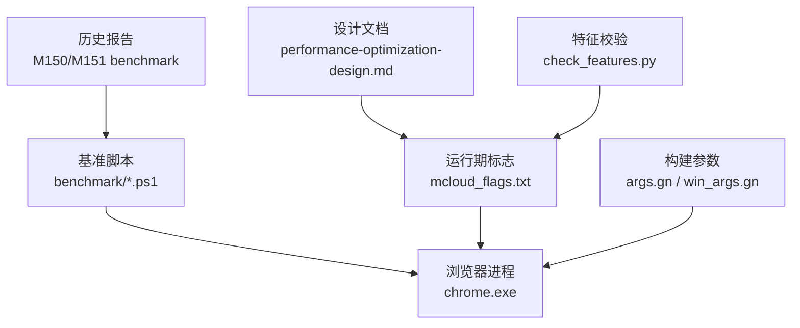
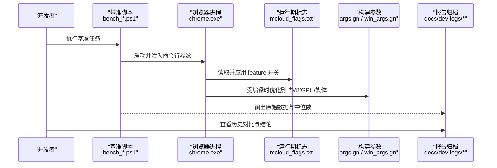
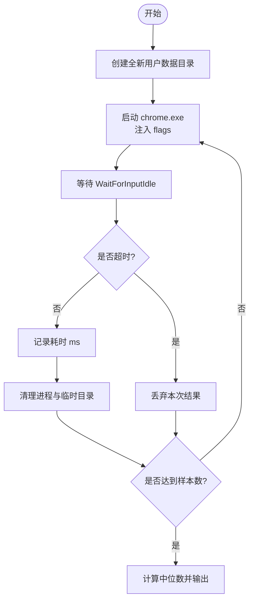
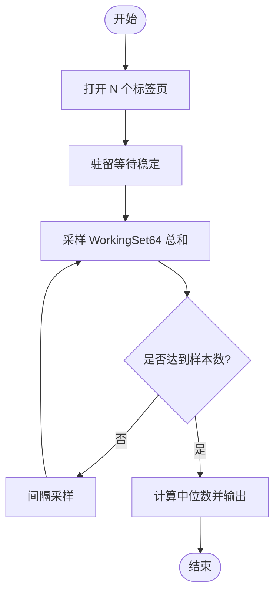
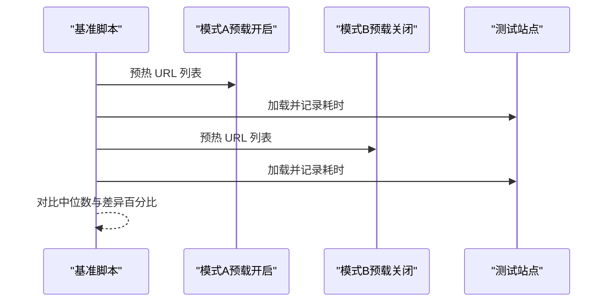
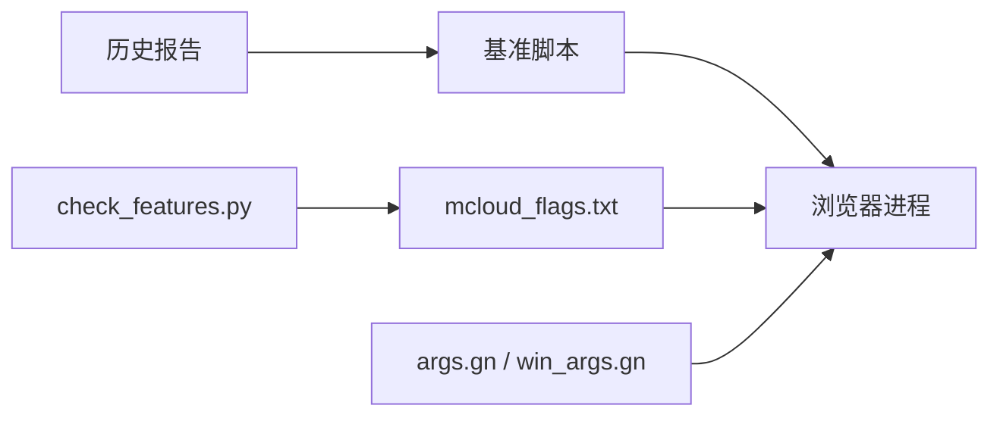

# 性能分析

<cite>
**本文引用的文件**
- [bench_startup.ps1](file://benchmark/bench_startup.ps1)
- [bench_navigation.ps1](file://benchmark/bench_navigation.ps1)
- [bench_memory.ps1](file://benchmark/bench_memory.ps1)
- [bench_size.ps1](file://benchmark/bench_size.ps1)
- [run_baseline.ps1](file://benchmark/run_baseline.ps1)
- [check_features.py](file://benchmark/tools/check_features.py)
- [mcloud_flags.txt](file://mcloud_flags.txt)
- [args.gn](file://args.gn)
- [win_args.gn](file://win_args.gn)
- [2026-06-19-performance-optimization-design.md](file://docs/superpowers/specs/2026-06-19-performance-optimization-design.md)
- [M150-benchmark.md](file://docs/dev-logs/M150-benchmark.md)
- [M151-opt-benchmark.md](file://docs/dev-logs/M151-opt-benchmark.md)
- [benchmark-template.md](file://docs/dev-logs/benchmark-template.md)
</cite>

## 目录
1. [简介](#简介)
2. [项目结构](#项目结构)
3. [核心组件](#核心组件)
4. [架构总览](#架构总览)
5. [详细组件分析](#详细组件分析)
6. [依赖关系分析](#依赖关系分析)
7. [性能考量](#性能考量)
8. [故障排查指南](#故障排查指南)
9. [结论](#结论)
10. [附录](#附录)

## 简介
本文件面向 MCloud Browser 的性能分析与优化实践，围绕启动时间、内存使用模式、页面加载与渲染性能等关键维度，系统化说明指标采集方法、工具链使用、回归检测与趋势追踪、报告解读与优化建议、瓶颈定位方法与策略，并给出实际测试案例与最佳实践。文档基于仓库内基准脚本、构建参数与历史报告进行整理，确保可复现与可追溯。

## 项目结构
MCloud Browser 的性能工程主要由以下部分组成：
- 基准脚本：覆盖冷启动（K1）、内存峰值（K2）、导航响应（预载收益验证）、二进制体积（K7）等自动化采集。
- 运行期标志：通过 mcloud_flags.txt 集中管理运行时 feature 开关，无需重编译即可调整行为。
- 构建参数：通过 args.gn/win_args.gn 控制编译优化、媒体解码、V8 特性等。
- 设计文档与历史报告：记录优化目标、风险与预期收益，以及版本基线与对比结果。

图表来源
- [bench_startup.ps1:1-70](file://benchmark/bench_startup.ps1#L1-L70)
- [bench_memory.ps1:1-78](file://benchmark/bench_memory.ps1#L1-L78)
- [bench_navigation.ps1:1-109](file://benchmark/bench_navigation.ps1#L1-L109)
- [bench_size.ps1:1-44](file://benchmark/bench_size.ps1#L1-L44)
- [mcloud_flags.txt:1-120](file://mcloud_flags.txt#L1-L120)
- [args.gn:1-87](file://args.gn#L1-L87)
- [win_args.gn:1-87](file://win_args.gn#L1-L87)
- [2026-06-19-performance-optimization-design.md:1-188](file://docs/superpowers/specs/2026-06-19-performance-optimization-design.md#L1-L188)
- [M150-benchmark.md:1-49](file://docs/dev-logs/M150-benchmark.md#L1-L49)
- [M151-opt-benchmark.md:1-78](file://docs/dev-logs/M151-opt-benchmark.md#L1-L78)

章节来源
- [bench_startup.ps1:1-70](file://benchmark/bench_startup.ps1#L1-L70)
- [bench_memory.ps1:1-78](file://benchmark/bench_memory.ps1#L1-L78)
- [bench_navigation.ps1:1-109](file://benchmark/bench_navigation.ps1#L1-L109)
- [bench_size.ps1:1-44](file://benchmark/bench_size.ps1#L1-L44)
- [run_baseline.ps1:1-78](file://benchmark/run_baseline.ps1#L1-L78)
- [check_features.py:1-153](file://benchmark/tools/check_features.py#L1-L153)
- [mcloud_flags.txt:1-120](file://mcloud_flags.txt#L1-L120)
- [args.gn:1-87](file://args.gn#L1-L87)
- [win_args.gn:1-87](file://win_args.gn#L1-L87)
- [2026-06-19-performance-optimization-design.md:1-188](file://docs/superpowers/specs/2026-06-19-performance-optimization-design.md#L1-L188)
- [M150-benchmark.md:1-49](file://docs/dev-logs/M150-benchmark.md#L1-L49)
- [M151-opt-benchmark.md:1-78](file://docs/dev-logs/M151-opt-benchmark.md#L1-L78)

## 核心组件
- 启动时间基准（K1）：使用全新用户数据目录启动浏览器，等待主窗口可交互（WaitForInputIdle），统计中位数耗时。适用于评估冷启动优化效果。
- 内存峰值基准（K2）：打开固定数量标签页，驻留稳定后汇总所有浏览器进程的 WorkingSet64，采样多次取中位数，反映多标签场景下的内存占用。
- 导航响应基准（预载收益验证）：对比启用/禁用预载类 feature 的页面加载耗时，验证预连接/预取/预热对“打开页面”的实际收益。
- 二进制体积（K7）：仅观测 chrome.exe、安装包与构建目录总体积，用于跟踪构建变化带来的体积影响。
- 一键基线采集：按顺序执行 K1/K2/K7，生成统一格式报告，便于归档与对比。
- Feature 清单校验：解析 mcloud_flags.txt 中的 feature 名称，在 Chromium 源码树中检索是否存在，避免上游变更导致失效。

章节来源
- [bench_startup.ps1:1-70](file://benchmark/bench_startup.ps1#L1-L70)
- [bench_memory.ps1:1-78](file://benchmark/bench_memory.ps1#L1-L78)
- [bench_navigation.ps1:1-109](file://benchmark/bench_navigation.ps1#L1-L109)
- [bench_size.ps1:1-44](file://benchmark/bench_size.ps1#L1-L44)
- [run_baseline.ps1:1-78](file://benchmark/run_baseline.ps1#L1-L78)
- [check_features.py:1-153](file://benchmark/tools/check_features.py#L1-L153)

## 架构总览
下图展示从基准脚本到浏览器进程、再到构建参数与运行期标志的整体交互关系，体现“配置驱动 + 自动化采集 + 报告归档”的闭环流程。

图表来源
- [bench_startup.ps1:1-70](file://benchmark/bench_startup.ps1#L1-L70)
- [bench_memory.ps1:1-78](file://benchmark/bench_memory.ps1#L1-L78)
- [bench_navigation.ps1:1-109](file://benchmark/bench_navigation.ps1#L1-L109)
- [bench_size.ps1:1-44](file://benchmark/bench_size.ps1#L1-L44)
- [mcloud_flags.txt:1-120](file://mcloud_flags.txt#L1-L120)
- [args.gn:1-87](file://args.gn#L1-L87)
- [win_args.gn:1-87](file://win_args.gn#L1-L87)
- [M150-benchmark.md:1-49](file://docs/dev-logs/M150-benchmark.md#L1-L49)

## 详细组件分析

### 启动时间分析（K1）
- 方法：每次使用全新临时用户数据目录启动浏览器，等待主窗口创建与 UI 初始化完成（WaitForInputIdle），记录耗时；默认多次运行取中位数。
- 适用场景：评估冷启动优化（如提前发送 GPU 通道、延迟推测性渲染帧创建、跳过拼写/翻译初始化、空渲染进程保持策略等）。
- 注意事项：about:blank 场景下绝对值偏小；跨版本对比需保持同一方法与场景。

图表来源
- [bench_startup.ps1:1-70](file://benchmark/bench_startup.ps1#L1-L70)

章节来源
- [bench_startup.ps1:1-70](file://benchmark/bench_startup.ps1#L1-L70)
- [M150-benchmark.md:1-49](file://docs/dev-logs/M150-benchmark.md#L1-L49)

### 内存使用模式分析（K2）
- 方法：以全新用户数据目录打开固定数量标签页（默认 about:blank 或指定 URL 列表），驻留稳定后汇总所有浏览器进程的 WorkingSet64，采样多次取中位数。
- 适用场景：评估多标签页场景下的内存占用与回收策略（如分区分配器优化、预绘制瓦片回收、传输缓存清理等）。
- 注意事项：真实站点场景下内存代价可能显著高于 about:blank；需结合业务 URL 集评估。

图表来源
- [bench_memory.ps1:1-78](file://benchmark/bench_memory.ps1#L1-L78)

章节来源
- [bench_memory.ps1:1-78](file://benchmark/bench_memory.ps1#L1-L78)
- [M151-opt-benchmark.md:1-78](file://docs/dev-logs/M151-opt-benchmark.md#L1-L78)

### 页面加载性能分析（导航响应）
- 方法：在同一构建下对比两种模式加载一组页面的耗时：
  - 模式 A：内置 flags 全部生效（含预载类）。
  - 模式 B：通过命令行禁用预载类 feature，比较差异。
- 适用场景：验证预连接/预取/预热对“打开页面”的实际收益，识别不稳定收益项。
- 注意事项：单页一次性加载场景预载收益有限；真实收益在重复导航/预测命中场景更明显。

图表来源
- [bench_navigation.ps1:1-109](file://benchmark/bench_navigation.ps1#L1-L109)

章节来源
- [bench_navigation.ps1:1-109](file://benchmark/bench_navigation.ps1#L1-L109)
- [M151-opt-benchmark.md:1-78](file://docs/dev-logs/M151-opt-benchmark.md#L1-L78)

### 渲染性能分析（GPU/合成/高帧率）
- 相关标志：包括 Canvas OOP 光栅化、直接合成、命令缓冲区解析切片增大、Skia Graphite 预编译、资源池精确大小复用、允许高帧率请求等。
- 作用：提升渲染管线效率、减少同步开销、提高合成与绘制吞吐。
- 评估方式：结合滚动掉帧率（K5）与视频播放流畅度（K6）手工流程采集；在本地物理 GPU 环境复测以获得可信结果。

章节来源
- [mcloud_flags.txt:1-120](file://mcloud_flags.txt#L1-L120)
- [2026-06-19-performance-optimization-design.md:1-188](file://docs/superpowers/specs/2026-06-19-performance-optimization-design.md#L1-L188)
- [M150-benchmark.md:1-49](file://docs/dev-logs/M150-benchmark.md#L1-L49)

### 视频解码与媒体优化
- 相关标志：平台 HEVC 解码支持、硬件安全解密 AV1、专用媒体服务线程、原生 Opus 解码、加密媒体遮挡跟踪、MediaFoundation 批量读取、D3D11 视频捕获零拷贝等。
- 问题修复：针对 Intel 核显 D3D12 视频解码器启动头几秒绿屏/花屏问题，显式禁用该 feature 回退至 D3D11VideoDecoder，保证稳定性且不影响硬解能力。
- 评估方式：K6 视频解码 CPU 占比手工流程采集；建议在本地物理 GPU 环境复测。

章节来源
- [mcloud_flags.txt:1-120](file://mcloud_flags.txt#L1-L120)
- [2026-06-19-performance-optimization-design.md:1-188](file://docs/superpowers/specs/2026-06-19-performance-optimization-design.md#L1-L188)
- [M150-benchmark.md:1-49](file://docs/dev-logs/M150-benchmark.md#L1-L49)

### 构建参数与 V8 优化
- 编译优化：启用 SIMD（SSE/AVX/FMA）、官方构建、ThinLTO、PGO Phase 2、V8 Maglev/TurboFan、WASM SIMD 等。
- V8 标志：修正 invocation_count_for_maglev/turbofan 阈值，更快进入 JIT；启用 OSR-from-Maglev 与 Sparkplug+。
- 媒体与 DRM：启用 FFmpeg、HLS、HEVC/H.264/H.265、Widevine（按需）。
- 评估方式：K4 JS 基准（Speedometer/JetStream）手工流程采集；结合 K1/K2/K7 综合评估。

章节来源
- [args.gn:1-87](file://args.gn#L1-L87)
- [win_args.gn:1-87](file://win_args.gn#L1-L87)
- [mcloud_flags.txt:1-120](file://mcloud_flags.txt#L1-L120)
- [2026-06-19-performance-optimization-design.md:1-188](file://docs/superpowers/specs/2026-06-19-performance-optimization-design.md#L1-L188)

## 依赖关系分析
- 基准脚本依赖浏览器进程与操作系统 API（进程管理、计时器、文件系统）。
- 运行期标志通过命令行注入，影响浏览器内部功能开关。
- 构建参数影响最终二进制行为与性能特性。
- 特征校验脚本依赖 Chromium 源码树，确保 feature 名称有效性。

图表来源
- [bench_startup.ps1:1-70](file://benchmark/bench_startup.ps1#L1-L70)
- [bench_memory.ps1:1-78](file://benchmark/bench_memory.ps1#L1-L78)
- [bench_navigation.ps1:1-109](file://benchmark/bench_navigation.ps1#L1-L109)
- [bench_size.ps1:1-44](file://benchmark/bench_size.ps1#L1-L44)
- [check_features.py:1-153](file://benchmark/tools/check_features.py#L1-L153)
- [mcloud_flags.txt:1-120](file://mcloud_flags.txt#L1-L120)
- [args.gn:1-87](file://args.gn#L1-L87)
- [win_args.gn:1-87](file://win_args.gn#L1-L87)

章节来源
- [bench_startup.ps1:1-70](file://benchmark/bench_startup.ps1#L1-L70)
- [bench_memory.ps1:1-78](file://benchmark/bench_memory.ps1#L1-L78)
- [bench_navigation.ps1:1-109](file://benchmark/bench_navigation.ps1#L1-L109)
- [bench_size.ps1:1-44](file://benchmark/bench_size.ps1#L1-L44)
- [check_features.py:1-153](file://benchmark/tools/check_features.py#L1-L153)
- [mcloud_flags.txt:1-120](file://mcloud_flags.txt#L1-L120)
- [args.gn:1-87](file://args.gn#L1-L87)
- [win_args.gn:1-87](file://win_args.gn#L1-L87)

## 性能考量
- 启动时间：优先关注冷启动代理指标的一致性；跨版本对比需固定方法与场景。
- 内存占用：区分 about:blank 与真实站点场景；对内存代价大的预载类 feature 做二分取舍。
- 页面加载：预载收益依赖预测命中率；单页一次性加载场景收益有限，应关注重复导航与预测命中。
- 渲染性能：在本地物理 GPU 环境复测滚动掉帧率与视频流畅度；注意远程虚拟显示适配器不代表本机独显。
- 构建优化：合理使用 PGO、ThinLTO、SIMD、V8 优化；关注体积变化（K7）作为观测指标。
- 回归检测：通过一键基线采集与历史报告对比，识别异常波动与回归项；结合特征校验避免上游变更导致的失效。

[本节为通用指导，不直接分析具体文件]

## 故障排查指南
- 特征失效：使用 check_features.py 校验 mcloud_flags.txt 中的 feature 是否在源码中存在；若不存在，按规范移除并在升级报告中记录原因。
- 启动超时：K1 等待主窗口可交互设置超时保护；若频繁超时，检查系统负载与浏览器实例冲突。
- 内存异常：K2 采样前确保充分驻留；若内存增长异常，检查预载类 feature 与真实站点集合的影响。
- 视频绿屏：针对 Intel 核显 D3D12 视频解码器问题，已显式禁用该 feature 回退至 D3D11VideoDecoder；如需恢复，待上游修复或 GPU 黑名单条目落地。
- 报告不完整：run_baseline.ps1 的 Tee 数据捕获缺陷已记录待修；建议手动回填原始数据至 docs/dev-logs/。

章节来源
- [check_features.py:1-153](file://benchmark/tools/check_features.py#L1-L153)
- [bench_startup.ps1:1-70](file://benchmark/bench_startup.ps1#L1-L70)
- [bench_memory.ps1:1-78](file://benchmark/bench_memory.ps1#L1-L78)
- [mcloud_flags.txt:1-120](file://mcloud_flags.txt#L1-L120)
- [M150-benchmark.md:1-49](file://docs/dev-logs/M150-benchmark.md#L1-L49)

## 结论
MCloud Browser 的性能工程已形成“配置驱动 + 自动化采集 + 报告归档”的完整闭环。通过 K1/K2/K7 自动化基准与导航响应验证，结合构建参数与运行期标志的精细化调优，能够在启动速度、内存占用、页面加载与渲染效率等方面取得可量化的改进。历史报告提供了清晰的基线与对比，便于持续追踪趋势与回归检测。建议在本地物理 GPU 环境复测渲染与视频相关指标，以确保结果的可靠性。

[本节为总结性内容，不直接分析具体文件]

## 附录
- 基准模板：docs/dev-logs/benchmark-template.md 提供标准报告结构，包含环境信息、KPI 结果、原始数据与结论。
- 一键基线：benchmark/run_baseline.ps1 自动执行 K1/K2/K7 并生成报告，便于归档与对比。
- 历史报告：docs/dev-logs/M150-benchmark.md 与 M151-opt-benchmark.md 提供版本基线与优化效果评估。

章节来源
- [benchmark-template.md:1-39](file://docs/dev-logs/benchmark-template.md#L1-L39)
- [run_baseline.ps1:1-78](file://benchmark/run_baseline.ps1#L1-L78)
- [M150-benchmark.md:1-49](file://docs/dev-logs/M150-benchmark.md#L1-L49)
- [M151-opt-benchmark.md:1-78](file://docs/dev-logs/M151-opt-benchmark.md#L1-L78)