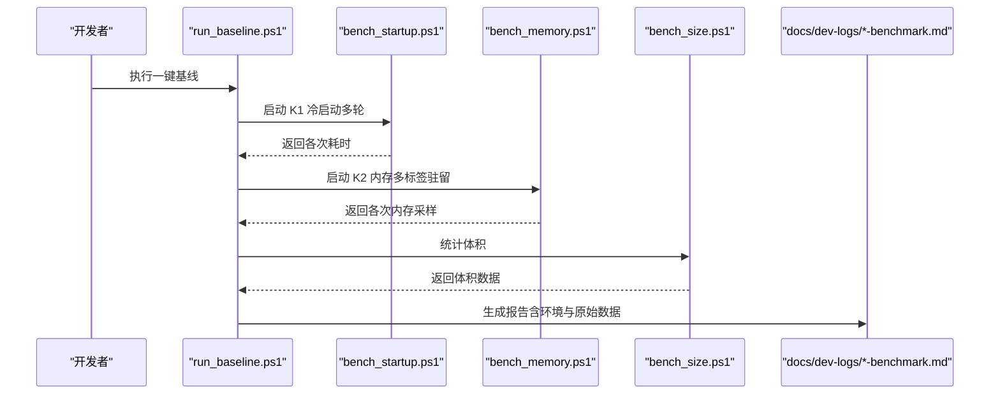
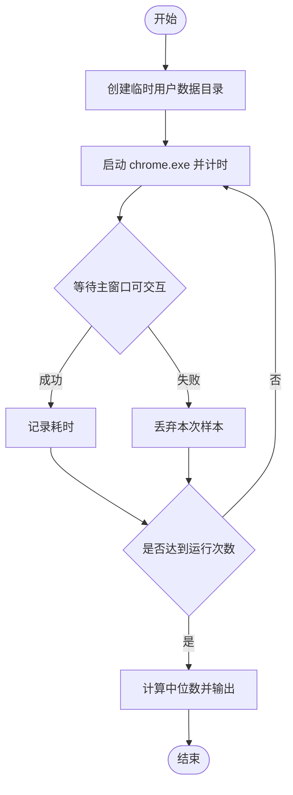
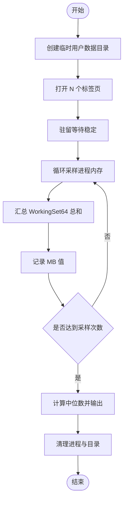
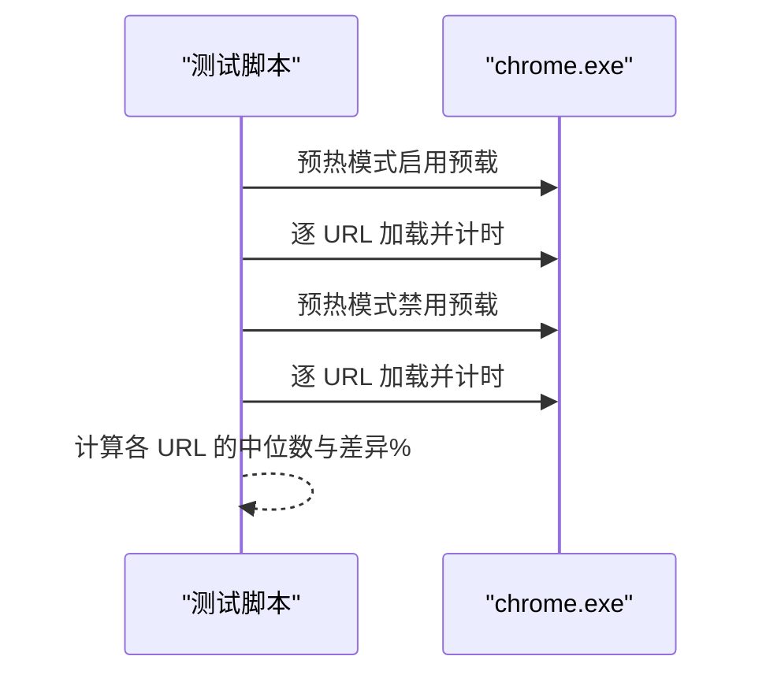
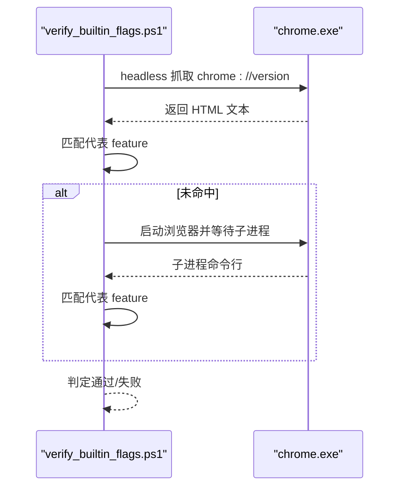
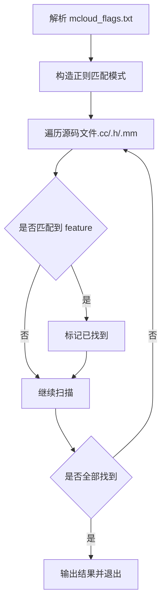
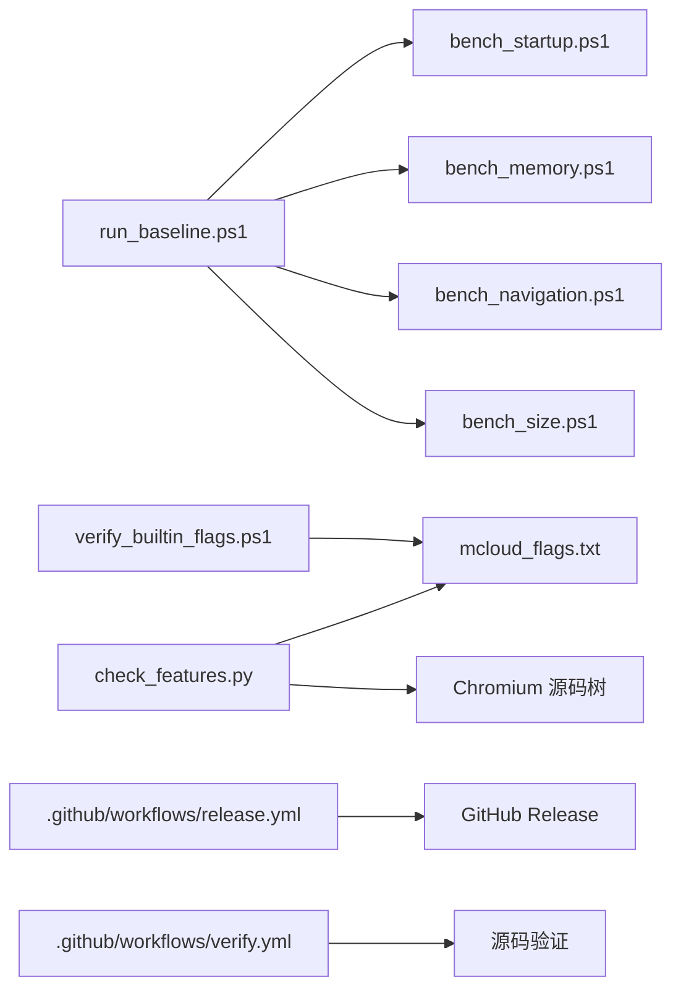

# 测试与基准

<cite>
**本文引用的文件**
- [run_baseline.ps1](file://benchmark/run_baseline.ps1)
- [bench_startup.ps1](file://benchmark/bench_startup.ps1)
- [bench_memory.ps1](file://benchmark/bench_memory.ps1)
- [bench_navigation.ps1](file://benchmark/bench_navigation.ps1)
- [bench_size.ps1](file://benchmark/bench_size.ps1)
- [check_features.py](file://benchmark/tools/check_features.py)
- [verify_builtin_flags.ps1](file://benchmark/tools/verify_builtin_flags.ps1)
- [mcloud_flags.txt](file://mcloud_flags.txt)
- [benchmark-template.md](file://docs/dev-logs/benchmark-template.md)
- [release.yml](file://.github/workflows/release.yml)
- [verify.yml](file://.github/workflows/verify.yml)
</cite>

## 目录
1. [简介](#简介)
2. [项目结构](#项目结构)
3. [核心组件](#核心组件)
4. [架构总览](#架构总览)
5. [详细组件分析](#详细组件分析)
6. [依赖关系分析](#依赖关系分析)
7. [性能考量](#性能考量)
8. [故障排查指南](#故障排查指南)
9. [结论](#结论)
10. [附录](#附录)

## 简介
本文件面向 MCloud Browser 的测试与基准测试体系，系统性说明框架设计理念、实现原理与使用方法。内容覆盖启动时间（K1）、内存使用（K2）、页面加载（K3/K4 方法学）、二进制体积（K7）等关键指标；提供一键采集基线、单项性能测试、内置标志验证等工具的使用说明；阐述测试结果分析方法、趋势追踪策略；并给出自动化流程集成方式与持续集成配置建议，以及自定义测试用例开发指南与最佳实践。

## 项目结构
MCloud 的基准测试位于仓库根目录下的 benchmark 目录，包含：
- 一键基线脚本：run_baseline.ps1
- 单项基准脚本：bench_startup.ps1、bench_memory.ps1、bench_navigation.ps1、bench_size.ps1
- 辅助工具：tools/check_features.py、tools/verify_builtin_flags.ps1
- 报告模板：docs/dev-logs/benchmark-template.md
- 构建产物与清单：mcloud_flags.txt（浏览器启动时注入的性能相关 flags）

```mermaid
graph TB
A["基准入口<br/>run_baseline.ps1"] --> B["冷启动 K1<br/>bench_startup.ps1"]
A --> C["内存峰值 K2<br/>bench_memory.ps1"]
A --> D["导航响应 K3/K4 方法学<br/>bench_navigation.ps1"]
A --> E["体积观测 K7<br/>bench_size.ps1"]
F["内置标志验证<br/>verify_builtin_flags.ps1"] --> G["mcloud_flags.txt"]
H["Feature 有效性校验<br/>check_features.py"] --> G
I["报告模板<br/>benchmark-template.md"] <-- J["结果归档位置<br/>docs/dev-logs/*-benchmark.md"]
```

图表来源
- [run_baseline.ps1:1-78](file://benchmark/run_baseline.ps1#L1-L78)
- [bench_startup.ps1:1-70](file://benchmark/bench_startup.ps1#L1-L70)
- [bench_memory.ps1:1-78](file://benchmark/bench_memory.ps1#L1-L78)
- [bench_navigation.ps1:1-109](file://benchmark/bench_navigation.ps1#L1-L109)
- [bench_size.ps1:1-44](file://benchmark/bench_size.ps1#L1-L44)
- [verify_builtin_flags.ps1:1-98](file://benchmark/tools/verify_builtin_flags.ps1#L1-L98)
- [check_features.py:1-153](file://benchmark/tools/check_features.py#L1-L153)
- [mcloud_flags.txt:1-120](file://mcloud_flags.txt#L1-L120)
- [benchmark-template.md:1-39](file://docs/dev-logs/benchmark-template.md#L1-L39)

章节来源
- [run_baseline.ps1:1-78](file://benchmark/run_baseline.ps1#L1-L78)
- [benchmark-template.md:1-39](file://docs/dev-logs/benchmark-template.md#L1-L39)

## 核心组件
- 一键基线采集：run_baseline.ps1 串联 K1/K2/K7，自动收集环境信息、执行测试、汇总原始数据并输出到 docs/dev-logs/{版本}-benchmark.md。
- 冷启动时间 K1：bench_startup.ps1 以全新用户数据目录启动 chrome.exe，等待主窗口可交互（WaitForInputIdle），多次运行取中位数。
- 内存峰值 K2：bench_memory.ps1 打开固定数量标签页（默认 50），驻留稳定后对全部浏览器进程 WorkingSet64 求和，采样多次取中位数。
- 导航响应 K3/K4 方法学：bench_navigation.ps1 对比“启用预载类特性”与“禁用预载类特性”在同一组 URL 上的首屏加载耗时，用于验证预载/预连接收益。
- 体积观测 K7：bench_size.ps1 统计 chrome.exe、安装包（如存在）及 out/mcloud 总体积，仅记录不约束。
- 内置标志验证：verify_builtin_flags.ps1 通过 headless 抓取 chrome://version 或子进程命令行，验证 mcloud_flags.txt 中的代表 feature 是否生效。
- Feature 清单校验：check_features.py 解析 mcloud_flags.txt 中的 feature 名称，在 Chromium 源码树中检索是否存在，输出失效项以便升级治理。

章节来源
- [bench_startup.ps1:1-70](file://benchmark/bench_startup.ps1#L1-L70)
- [bench_memory.ps1:1-78](file://benchmark/bench_memory.ps1#L1-L78)
- [bench_navigation.ps1:1-109](file://benchmark/bench_navigation.ps1#L1-L109)
- [bench_size.ps1:1-44](file://benchmark/bench_size.ps1#L1-L44)
- [verify_builtin_flags.ps1:1-98](file://benchmark/tools/verify_builtin_flags.ps1#L1-L98)
- [check_features.py:1-153](file://benchmark/tools/check_features.py#L1-L153)
- [mcloud_flags.txt:1-120](file://mcloud_flags.txt#L1-L120)

## 架构总览
整体工作流由“入口编排 + 单项基准 + 质量门禁 + 报告归档”构成。入口脚本负责环境准备、任务调度与结果聚合；单项基准各自封装测量逻辑与统计；质量门禁保障 flags 有效性与内置标志注入正确性；最终统一输出到标准化报告模板。



图表来源
- [run_baseline.ps1:1-78](file://benchmark/run_baseline.ps1#L1-L78)
- [bench_startup.ps1:1-70](file://benchmark/bench_startup.ps1#L1-L70)
- [bench_memory.ps1:1-78](file://benchmark/bench_memory.ps1#L1-L78)
- [bench_size.ps1:1-44](file://benchmark/bench_size.ps1#L1-L44)
- [benchmark-template.md:1-39](file://docs/dev-logs/benchmark-template.md#L1-L39)

## 详细组件分析

### 一键基线采集 run_baseline.ps1
- 功能：按顺序执行 K1、K2、K7，收集 CPU/GPU/OS/电源模式等信息，生成结构化报告。
- 关键点：
  - 每次调用单项脚本时传入 ChromeExe 路径与必要参数。
  - 将原始输出追加到报告末尾，便于回溯。
  - 输出目标为 docs/dev-logs/{Version}-benchmark.md，可直接归档。
- 适用场景：版本发布前快速建立基线，或在优化前后进行对比。

章节来源
- [run_baseline.ps1:1-78](file://benchmark/run_baseline.ps1#L1-L78)

### 冷启动时间 K1 bench_startup.ps1
- 测量方法：
  - 使用全新临时用户数据目录，避免缓存干扰。
  - 启动 chrome.exe 并等待 WaitForInputIdle，作为首屏可交互代理指标。
  - 默认 5 次运行，计算中位数。
- 注意事项：
  - 运行前关闭所有浏览器实例，尽量清空系统缓存。
  - 超时保护（最长 60 秒），丢弃无效样本。
- 输出：中位数与原始数据列表。



图表来源
- [bench_startup.ps1:1-70](file://benchmark/bench_startup.ps1#L1-L70)

章节来源
- [bench_startup.ps1:1-70](file://benchmark/bench_startup.ps1#L1-L70)

### 内存峰值 K2 bench_memory.ps1
- 测量方法：
  - 以全新用户数据目录启动浏览器，打开固定数量标签页（默认 50）。
  - 驻留稳定后，对全部浏览器进程 WorkingSet64 求和，采样多次取中位数。
  - 支持通过 UrlsFile 指定站点级测试集，否则使用 about:blank 降低网络波动。
- 关键点：
  - 支持 ExtraFlags 注入额外开关。
  - 采样间隔可调，默认 5 次采样。
- 输出：中位数与原始数据列表。



图表来源
- [bench_memory.ps1:1-78](file://benchmark/bench_memory.ps1#L1-L78)

章节来源
- [bench_memory.ps1:1-78](file://benchmark/bench_memory.ps1#L1-L78)

### 导航响应 K3/K4 方法学 bench_navigation.ps1
- 目的：验证预载/预连接类特性对“打开页面”响应速度的实际收益。
- 方法：
  - 同一构建下对比两种模式：启用预载类特性 vs 禁用预载类特性。
  - 每种模式先预热一遍 URL 列表，再测 N 轮，取中位数。
  - 使用 headless 模式与 --dump-dom 获取首屏加载耗时。
- 输出：每个 URL 的 on/off 中位数与差异百分比。



图表来源
- [bench_navigation.ps1:1-109](file://benchmark/bench_navigation.ps1#L1-L109)

章节来源
- [bench_navigation.ps1:1-109](file://benchmark/bench_navigation.ps1#L1-L109)

### 体积观测 K7 bench_size.ps1
- 功能：统计 chrome.exe、mini_installer（如存在）与 out/mcloud 总体积。
- 用途：仅观测记录，不设上限，纳入报告模板。

章节来源
- [bench_size.ps1:1-44](file://benchmark/bench_size.ps1#L1-L44)

### 内置标志验证 verify_builtin_flags.ps1
- 原理：headless 抓取 chrome://version，检查其中是否包含代表 feature；若不可用则回退到子进程命令行探测。
- 代表特征：从 mcloud_flags.txt 中选择启动/内存/媒体三类代表性 feature 进行抽查。
- 通过条件：全部代表 feature 出现在输出中。



图表来源
- [verify_builtin_flags.ps1:1-98](file://benchmark/tools/verify_builtin_flags.ps1#L1-L98)
- [mcloud_flags.txt:1-120](file://mcloud_flags.txt#L1-L120)

章节来源
- [verify_builtin_flags.ps1:1-98](file://benchmark/tools/verify_builtin_flags.ps1#L1-L98)
- [mcloud_flags.txt:1-120](file://mcloud_flags.txt#L1-L120)

### Feature 清单校验 check_features.py
- 功能：解析 mcloud_flags.txt 中的 feature 名称，在目标 Chromium 源码树中检索是否存在。
- 扫描策略：全源码树扫描，排除 third_party 主体（仅保留 blink），避免遗漏。
- 输出：存在/不存在清单，退出码 1 表示存在失效项，便于接入升级检查清单。



图表来源
- [check_features.py:1-153](file://benchmark/tools/check_features.py#L1-L153)
- [mcloud_flags.txt:1-120](file://mcloud_flags.txt#L1-L120)

章节来源
- [check_features.py:1-153](file://benchmark/tools/check_features.py#L1-L153)
- [mcloud_flags.txt:1-120](file://mcloud_flags.txt#L1-L120)

## 依赖关系分析
- 入口依赖：run_baseline.ps1 依赖 K1/K2/K7 脚本与报告模板。
- 数据依赖：verify_builtin_flags.ps1 依赖 mcloud_flags.txt；check_features.py 依赖 mcloud_flags.txt 与 Chromium 源码树。
- 构建产物依赖：bench_size.ps1 依赖 out/mcloud 构建产物。
- CI 集成：release.yml 负责基于 tag 发布安装包；verify.yml 用于源码验证。



图表来源
- [run_baseline.ps1:1-78](file://benchmark/run_baseline.ps1#L1-L78)
- [bench_startup.ps1:1-70](file://benchmark/bench_startup.ps1#L1-L70)
- [bench_memory.ps1:1-78](file://benchmark/bench_memory.ps1#L1-L78)
- [bench_navigation.ps1:1-109](file://benchmark/bench_navigation.ps1#L1-L109)
- [bench_size.ps1:1-44](file://benchmark/bench_size.ps1#L1-L44)
- [verify_builtin_flags.ps1:1-98](file://benchmark/tools/verify_builtin_flags.ps1#L1-L98)
- [check_features.py:1-153](file://benchmark/tools/check_features.py#L1-L153)
- [release.yml:1-79](file://.github/workflows/release.yml#L1-L79)
- [verify.yml:1-26](file://.github/workflows/verify.yml#L1-L26)

章节来源
- [release.yml:1-79](file://.github/workflows/release.yml#L1-L79)
- [verify.yml:1-26](file://.github/workflows/verify.yml#L1-L26)

## 性能考量
- 环境控制：
  - 使用全新用户数据目录避免缓存污染。
  - 关闭无关浏览器实例，确保冷态。
  - 电源模式设为高性能，减少外部波动。
- 统计方法：
  - 多次运行取中位数，降低异常值影响。
  - 内存采样设置驻留时间与采样间隔，确保稳定。
- 指标选择：
  - K1 使用 WaitForInputIdle 作为首屏可交互代理。
  - K2 使用 WorkingSet64 总和衡量内存占用。
  - K3/K4 通过 headless 加载与 dump-dom 评估首屏响应。
- 可重复性：
  - 固定 URL 集与参数，便于回归对比。
  - 报告模板统一结构与字段，便于趋势追踪。

[本节为通用指导，不直接分析具体文件]

## 故障排查指南
- 启动失败或无有效结果：
  - 检查 chrome.exe 路径是否正确。
  - 确认用户数据目录可写且未被占用。
  - 查看超时保护与进程清理逻辑。
- 内存采样异常：
  - 确认浏览器进程名与路径一致。
  - 增加驻留时间与采样次数。
- 内置标志未生效：
  - 确认 mcloud_flags.txt 位于 exe 同目录。
  - 使用 verify_builtin_flags.ps1 的两种探测路径进行诊断。
- Feature 失效：
  - 使用 check_features.py 扫描源码树，定位移除或更名的 feature。
  - 按规范处理失效项（移除或替换并记录原因）。

章节来源
- [bench_startup.ps1:1-70](file://benchmark/bench_startup.ps1#L1-L70)
- [bench_memory.ps1:1-78](file://benchmark/bench_memory.ps1#L1-L78)
- [verify_builtin_flags.ps1:1-98](file://benchmark/tools/verify_builtin_flags.ps1#L1-L98)
- [check_features.py:1-153](file://benchmark/tools/check_features.py#L1-L153)

## 结论
MCloud Browser 的测试与基准体系以“一键基线 + 单项基准 + 质量门禁 + 标准报告”为核心，覆盖启动、内存、导航与体积等关键维度。通过严格的测量方法与统计策略，结合内置标志验证与 feature 清单校验，形成闭环的质量保证流程。配合 GitHub Actions 的发布与验证工作流，可实现高效的持续集成与回归检测。

[本节为总结性内容，不直接分析具体文件]

## 附录
- 使用方法速查：
  - 一键基线：执行 run_baseline.ps1，指定版本、ChromeExe 与输出目录。
  - 单项测试：分别执行 bench_startup.ps1、bench_memory.ps1、bench_navigation.ps1、bench_size.ps1。
  - 内置标志验证：执行 verify_builtin_flags.ps1。
  - Feature 校验：执行 check_features.py，指定 flags 与 src 路径。
- 报告归档：
  - 将结果与原始数据写入 docs/dev-logs/{版本}-benchmark.md，遵循 benchmark-template.md 结构。
- 自定义测试用例开发指南：
  - 复用现有脚本的参数与统计方法（中位数、采样间隔、驻留时间）。
  - 保持环境变量与用户数据目录隔离，确保可重复性。
  - 新增指标时更新报告模板与一键基线编排。
- 性能回归检测与质量保证：
  - 将基准结果纳入版本发布前检查清单。
  - 对失效 feature 与未生效标志进行阻断式验证。
  - 结合 CI 工作流（release.yml、verify.yml）实现自动化发布与源码验证。

[本节为补充说明，不直接分析具体文件]