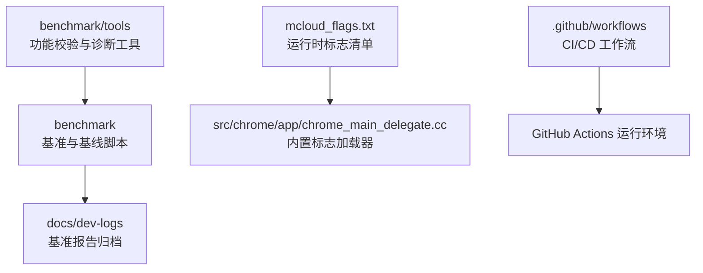
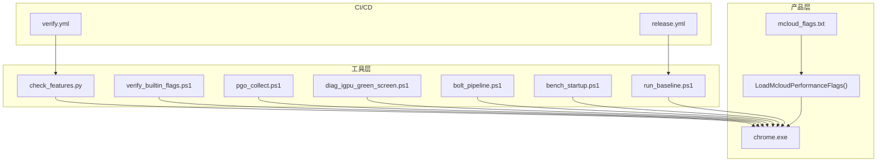
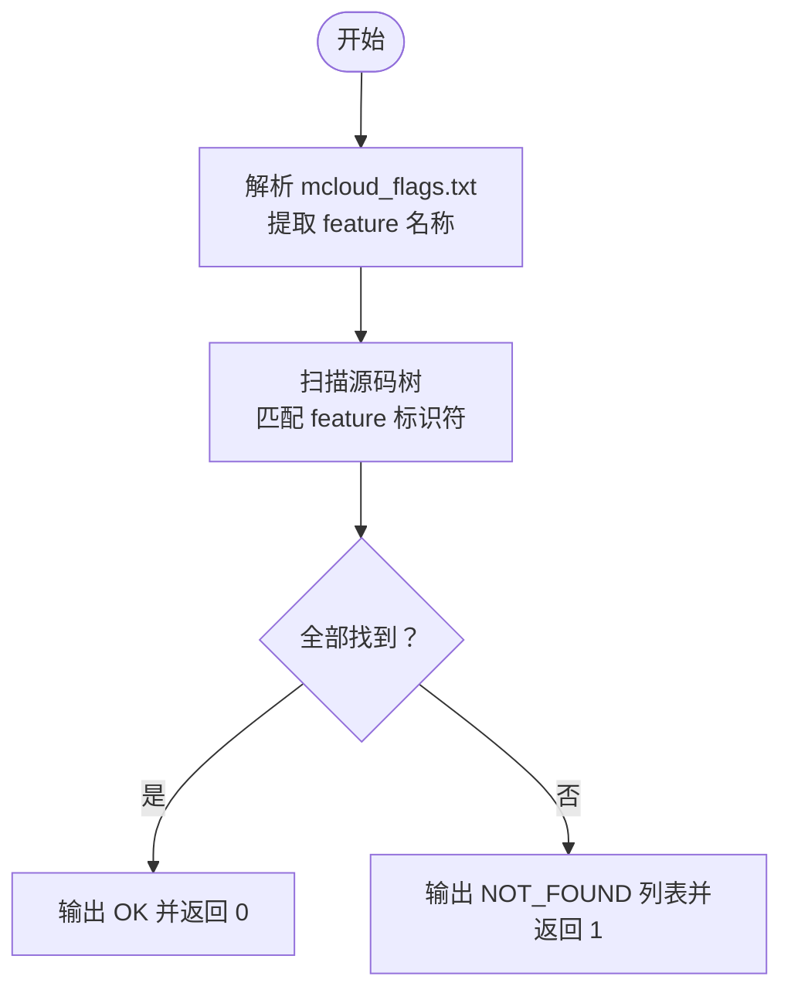
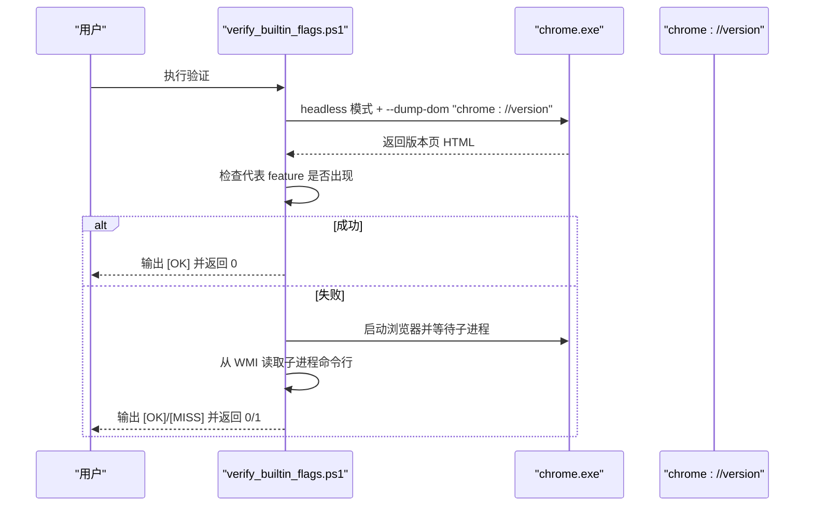
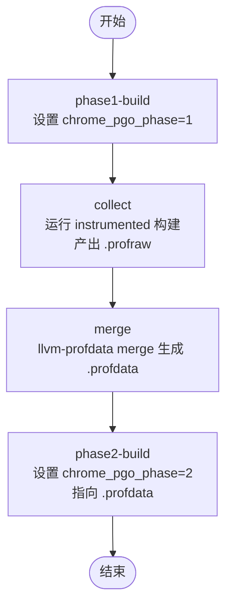
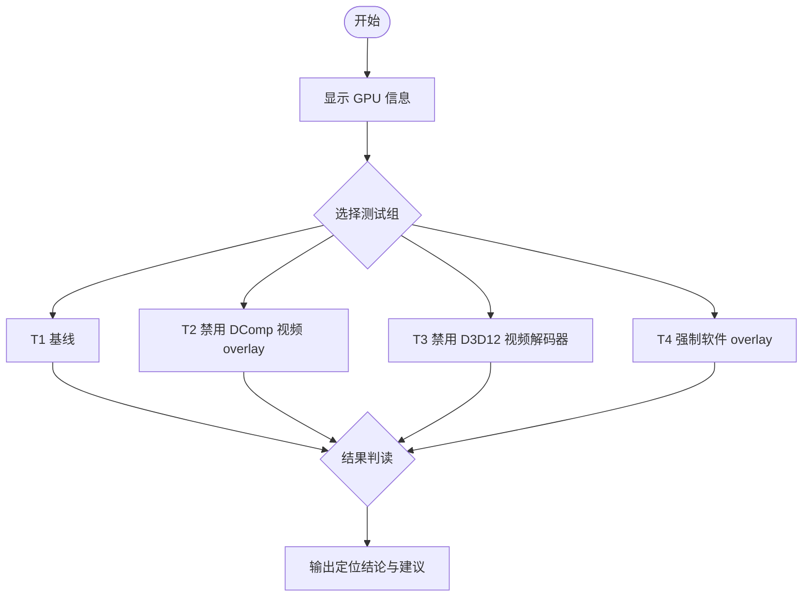
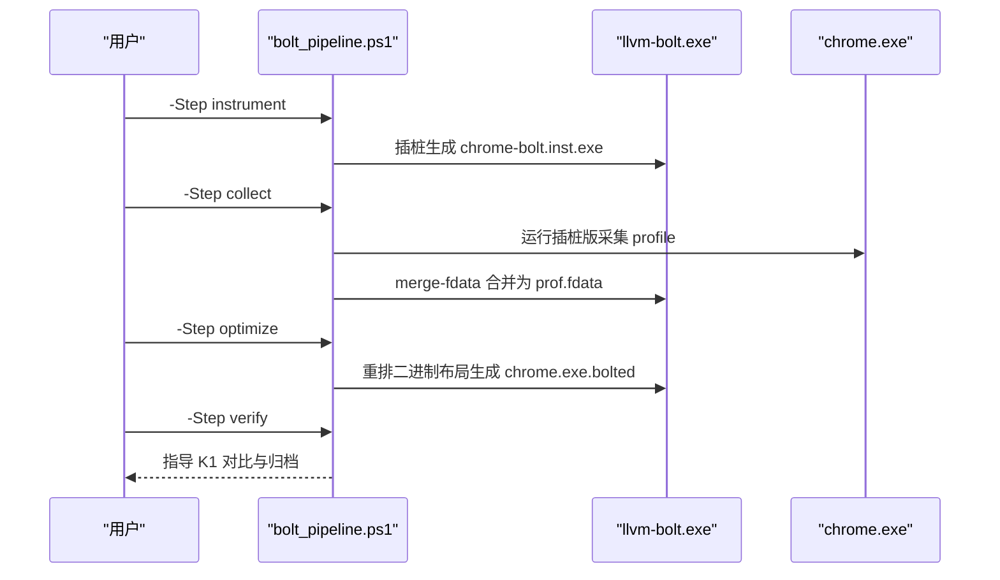
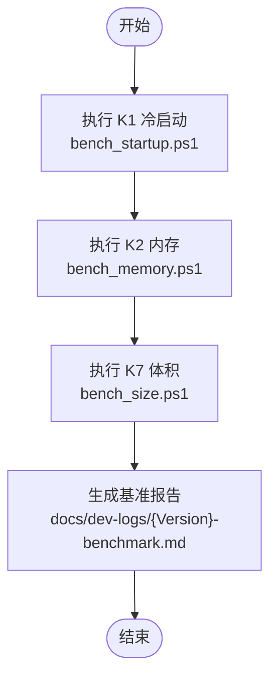
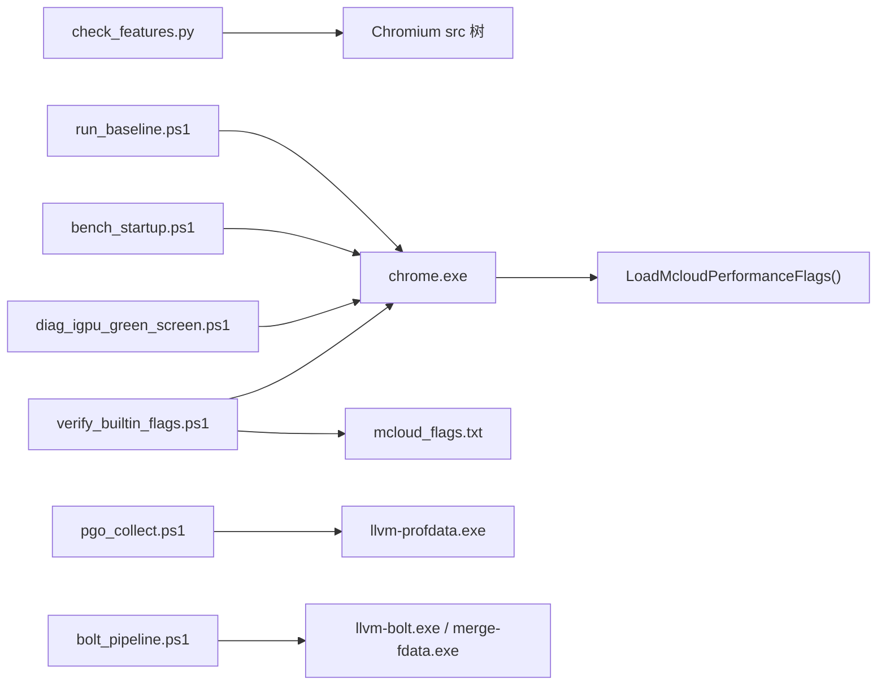

# 测试工具集

本文引用的文件

- [check_features.py](https://github.com/Mcloud136/Mcloud-Browser/blob/main/benchmark/tools/check_features.py)
- [verify_builtin_flags.ps1](https://github.com/Mcloud136/Mcloud-Browser/blob/main/benchmark/tools/verify_builtin_flags.ps1)
- [pgo_collect.ps1](https://github.com/Mcloud136/Mcloud-Browser/blob/main/benchmark/tools/pgo_collect.ps1)
- [diag_igpu_green_screen.ps1](https://github.com/Mcloud136/Mcloud-Browser/blob/main/benchmark/tools/diag_igpu_green_screen.ps1)
- [bolt_pipeline.ps1](https://github.com/Mcloud136/Mcloud-Browser/blob/main/benchmark/tools/bolt_pipeline.ps1)
- [bench_startup.ps1](https://github.com/Mcloud136/Mcloud-Browser/blob/main/benchmark/bench_startup.ps1)
- [run_baseline.ps1](https://github.com/Mcloud136/Mcloud-Browser/blob/main/benchmark/run_baseline.ps1)
- [mcloud_flags.txt](https://github.com/Mcloud136/Mcloud-Browser/blob/main/mcloud_flags.txt)
- [chrome_main_delegate.cc](https://github.com/Mcloud136/Mcloud-Browser/blob/main/src/chrome/app/chrome_main_delegate.cc)
- [inject_flags_loader.py](https://github.com/Mcloud136/Mcloud-Browser/blob/main/win_scripts/inject_flags_loader.py)
- [verify.yml](https://github.com/Mcloud136/Mcloud-Browser/blob/main/.github/workflows/verify.yml)
- [release.yml](https://github.com/Mcloud136/Mcloud-Browser/blob/main/.github/workflows/release.yml)

## 目录
1. [简介](#简介)
2. [项目结构](#项目结构)
3. [核心组件](#核心组件)
4. [架构总览](#架构总览)
5. [详细组件分析](#详细组件分析)
6. [依赖关系分析](#依赖关系分析)
7. [性能注意事项](#性能注意事项)
8. [故障排除指南](#故障排除指南)
9. [结论](#结论)
10. [附录](#附录)

## 简介
本文件系统化介绍 MCloud Browser 测试工具集，覆盖功能特性检查、内置标志验证、PGO 数据收集、GPU 问题诊断、BOLT 优化流水线，以及基准测试与基线采集。文档面向开发与测试人员，提供参数配置、执行环境、依赖要求、输出结果解读、故障排除方法，并给出在 CI/CD 中集成这些工具的实践建议与自动化脚本编写指南。

## 项目结构
测试工具集主要位于 benchmark/tools 与 benchmark 目录下，配合仓库根目录的 mcloud_flags.txt 与源码中的内置标志加载器（chrome_main_delegate.cc）协同工作。CI/CD 相关流程位于 .github/workflows。

图表来源
- [check_features.py:1-153](https://github.com/Mcloud136/Mcloud-Browser/blob/main/benchmark/tools/check_features.py#L1-L153)
- [verify_builtin_flags.ps1:1-98](https://github.com/Mcloud136/Mcloud-Browser/blob/main/benchmark/tools/verify_builtin_flags.ps1#L1-L98)
- [pgo_collect.ps1:1-106](https://github.com/Mcloud136/Mcloud-Browser/blob/main/benchmark/tools/pgo_collect.ps1#L1-L106)
- [diag_igpu_green_screen.ps1:1-105](https://github.com/Mcloud136/Mcloud-Browser/blob/main/benchmark/tools/diag_igpu_green_screen.ps1#L1-L105)
- [bolt_pipeline.ps1:1-108](https://github.com/Mcloud136/Mcloud-Browser/blob/main/benchmark/tools/bolt_pipeline.ps1#L1-L108)
- [bench_startup.ps1:1-70](https://github.com/Mcloud136/Mcloud-Browser/blob/main/benchmark/bench_startup.ps1#L1-L70)
- [run_baseline.ps1:1-78](https://github.com/Mcloud136/Mcloud-Browser/blob/main/benchmark/run_baseline.ps1#L1-L78)
- [mcloud_flags.txt:1-120](https://github.com/Mcloud136/Mcloud-Browser/blob/main/mcloud_flags.txt#L1-L120)
- [chrome_main_delegate.cc:239-258](https://github.com/Mcloud136/Mcloud-Browser/blob/main/src/chrome/app/chrome_main_delegate.cc#L239-L258)
- [verify.yml:1-26](https://github.com/Mcloud136/Mcloud-Browser/blob/main/.github/workflows/verify.yml#L1-L26)
- [release.yml:1-79](https://github.com/Mcloud136/Mcloud-Browser/blob/main/.github/workflows/release.yml#L1-L79)

章节来源
- [check_features.py:1-153](https://github.com/Mcloud136/Mcloud-Browser/blob/main/benchmark/tools/check_features.py#L1-L153)
- [verify_builtin_flags.ps1:1-98](https://github.com/Mcloud136/Mcloud-Browser/blob/main/benchmark/tools/verify_builtin_flags.ps1#L1-L98)
- [pgo_collect.ps1:1-106](https://github.com/Mcloud136/Mcloud-Browser/blob/main/benchmark/tools/pgo_collect.ps1#L1-L106)
- [diag_igpu_green_screen.ps1:1-105](https://github.com/Mcloud136/Mcloud-Browser/blob/main/benchmark/tools/diag_igpu_green_screen.ps1#L1-L105)
- [bolt_pipeline.ps1:1-108](https://github.com/Mcloud136/Mcloud-Browser/blob/main/benchmark/tools/bolt_pipeline.ps1#L1-L108)
- [bench_startup.ps1:1-70](https://github.com/Mcloud136/Mcloud-Browser/blob/main/benchmark/bench_startup.ps1#L1-L70)
- [run_baseline.ps1:1-78](https://github.com/Mcloud136/Mcloud-Browser/blob/main/benchmark/run_baseline.ps1#L1-L78)
- [mcloud_flags.txt:1-120](https://github.com/Mcloud136/Mcloud-Browser/blob/main/mcloud_flags.txt#L1-L120)
- [chrome_main_delegate.cc:239-258](https://github.com/Mcloud136/Mcloud-Browser/blob/main/src/chrome/app/chrome_main_delegate.cc#L239-L258)
- [verify.yml:1-26](https://github.com/Mcloud136/Mcloud-Browser/blob/main/.github/workflows/verify.yml#L1-L26)
- [release.yml:1-79](https://github.com/Mcloud136/Mcloud-Browser/blob/main/.github/workflows/release.yml#L1-L79)

## 核心组件
- 功能特性检查：check_features.py，用于校验 mcloud_flags.txt 中 feature 在当前 Chromium 源码树中是否仍存在。
- 内置标志验证：verify_builtin_flags.ps1，验证 chrome_main_delegate.cc 的 LoadMcloudPerformanceFlags() 是否将 mcloud_flags.txt 注入进程命令行。
- PGO 数据收集：pgo_collect.ps1，实现 phase1-build → collect → merge → phase2-build 的自采 PGO 流水线。
- GPU 绿屏诊断：diag_igpu_green_screen.ps1，通过四组受控启动配置二分定位核显视频绿屏/花屏问题层级。
- BOLT 后链接优化：bolt_pipeline.ps1，完成 instrument → collect → optimize → verify 的后链接优化流水线。
- 基准与基线：bench_startup.ps1、run_baseline.ps1，提供 K1 冷启动测量与一键采集 K1/K2/K7 基线报告。

章节来源
- [check_features.py:1-153](https://github.com/Mcloud136/Mcloud-Browser/blob/main/benchmark/tools/check_features.py#L1-L153)
- [verify_builtin_flags.ps1:1-98](https://github.com/Mcloud136/Mcloud-Browser/blob/main/benchmark/tools/verify_builtin_flags.ps1#L1-L98)
- [pgo_collect.ps1:1-106](https://github.com/Mcloud136/Mcloud-Browser/blob/main/benchmark/tools/pgo_collect.ps1#L1-L106)
- [diag_igpu_green_screen.ps1:1-105](https://github.com/Mcloud136/Mcloud-Browser/blob/main/benchmark/tools/diag_igpu_green_screen.ps1#L1-L105)
- [bolt_pipeline.ps1:1-108](https://github.com/Mcloud136/Mcloud-Browser/blob/main/benchmark/tools/bolt_pipeline.ps1#L1-L108)
- [bench_startup.ps1:1-70](https://github.com/Mcloud136/Mcloud-Browser/blob/main/benchmark/bench_startup.ps1#L1-L70)
- [run_baseline.ps1:1-78](https://github.com/Mcloud136/Mcloud-Browser/blob/main/benchmark/run_baseline.ps1#L1-L78)

## 架构总览
下图展示了工具集与浏览器构建产物、标志清单及 CI/CD 的关系。

图表来源
- [check_features.py:1-153](https://github.com/Mcloud136/Mcloud-Browser/blob/main/benchmark/tools/check_features.py#L1-L153)
- [verify_builtin_flags.ps1:1-98](https://github.com/Mcloud136/Mcloud-Browser/blob/main/benchmark/tools/verify_builtin_flags.ps1#L1-L98)
- [pgo_collect.ps1:1-106](https://github.com/Mcloud136/Mcloud-Browser/blob/main/benchmark/tools/pgo_collect.ps1#L1-L106)
- [diag_igpu_green_screen.ps1:1-105](https://github.com/Mcloud136/Mcloud-Browser/blob/main/benchmark/tools/diag_igpu_green_screen.ps1#L1-L105)
- [bolt_pipeline.ps1:1-108](https://github.com/Mcloud136/Mcloud-Browser/blob/main/benchmark/tools/bolt_pipeline.ps1#L1-L108)
- [bench_startup.ps1:1-70](https://github.com/Mcloud136/Mcloud-Browser/blob/main/benchmark/bench_startup.ps1#L1-L70)
- [run_baseline.ps1:1-78](https://github.com/Mcloud136/Mcloud-Browser/blob/main/benchmark/run_baseline.ps1#L1-L78)
- [mcloud_flags.txt:1-120](https://github.com/Mcloud136/Mcloud-Browser/blob/main/mcloud_flags.txt#L1-L120)
- [chrome_main_delegate.cc:239-258](https://github.com/Mcloud136/Mcloud-Browser/blob/main/src/chrome/app/chrome_main_delegate.cc#L239-L258)
- [verify.yml:1-26](https://github.com/Mcloud136/Mcloud-Browser/blob/main/.github/workflows/verify.yml#L1-L26)
- [release.yml:1-79](https://github.com/Mcloud136/Mcloud-Browser/blob/main/.github/workflows/release.yml#L1-L79)

## 详细组件分析

### 功能特性检查（check_features.py）
- 目标：解析 mcloud_flags.txt 中的 --enable-features / --disable-features 条目，扫描目标 Chromium 源码树，确认每个 feature 标识符是否存在；不存在则输出 NOT_FOUND 列表并返回非零退出码。
- 关键行为：
  - 支持 --flags 指定 flags 文件路径（默认仓库根目录的 mcloud_flags.txt）。
  - 支持 --src 指定目标 Chromium src 目录。
  - 扫描策略：全源码树扫描，排除 out/.git/testdata/test/tests/third_party（仅保留 third_party/blink），匹配特征名时避免子串误报。
  - 退出码：存在未找到 feature 时为 1；参数或文件错误为 2。
- 使用示例：
  - python3 benchmark/tools/check_features.py --src <chromium/src>
- 输出说明：
  - 打印解析到的 feature 数量与检索状态；若存在 NOT_FOUND，列出具体名称并提示处理要求。
- 适用场景：升级前校验 feature 有效性，防止上游移除或更名导致运行时失效。

图表来源
- [check_features.py:44-110](https://github.com/Mcloud136/Mcloud-Browser/blob/main/benchmark/tools/check_features.py#L44-L110)
- [check_features.py:113-148](https://github.com/Mcloud136/Mcloud-Browser/blob/main/benchmark/tools/check_features.py#L113-L148)

章节来源
- [check_features.py:1-153](https://github.com/Mcloud136/Mcloud-Browser/blob/main/benchmark/tools/check_features.py#L1-L153)

### 内置标志验证（verify_builtin_flags.ps1）
- 目标：验证 chrome_main_delegate.cc 的 LoadMcloudPerformanceFlags() 是否将 mcloud_flags.txt 注入进程命令行。
- 原理：以 headless 模式 dump chrome://version 页面，检查其中是否包含代表 feature；如失败则回退到子进程命令行探测。
- 参数：
  - -ChromeExe：指定 chrome.exe 路径（默认指向 out/mcloud/chrome.exe）。
- 前置条件：
  - chrome.exe 存在且同目录有 mcloud_flags.txt。
- 判定：
  - 三组代表 feature（SpareRendererForSitePerProcess、InfiniteTabsFreezing、PlatformHEVCDecoderSupport）全部出现则通过（退出码 0）。
- 输出说明：
  - 逐条打印 [OK] 或 [MISS]；最终汇总并通过颜色提示验证结果。
- 关联源码：
  - 内置标志加载逻辑位于 chrome_main_delegate.cc 的 LoadMcloudPerformanceFlags()。

图表来源
- [verify_builtin_flags.ps1:1-98](https://github.com/Mcloud136/Mcloud-Browser/blob/main/benchmark/tools/verify_builtin_flags.ps1#L1-L98)
- [chrome_main_delegate.cc:239-258](https://github.com/Mcloud136/Mcloud-Browser/blob/main/src/chrome/app/chrome_main_delegate.cc#L239-L258)

章节来源
- [verify_builtin_flags.ps1:1-98](https://github.com/Mcloud136/Mcloud-Browser/blob/main/benchmark/tools/verify_builtin_flags.ps1#L1-L98)
- [chrome_main_delegate.cc:239-258](https://github.com/Mcloud136/Mcloud-Browser/blob/main/src/chrome/app/chrome_main_delegate.cc#L239-L258)

### PGO 数据收集（pgo_collect.ps1）
- 目标：以真实用户场景采集 profraw，合并生成 .profdata，驱动 phase2 构建，使 PGO 热点优化贴合产品定位。
- 阶段：
  - phase1-build：设置 chrome_pgo_phase = 1，gn gen + 全量构建 instrumented 版本。
  - collect：运行 instrumented 构建，模拟多标签/浏览/视频等场景，产出 *.profraw。
  - merge：llvm-profdata merge 生成 .profdata。
  - phase2-build：设置 chrome_pgo_phase = 2，并将 pgo_data_path 指向生成的 .profdata，再次全量构建。
- 依赖：
  - llvm-profdata.exe（Chromium 内置工具链不含，需自备或通过 -LlvmBin 指定）。
- 参数：
  - -Step：phase1-build | collect | merge | phase2-build | all
  - -OutDir：构建输出目录（默认 out/mcloud）
  - -LlvmBin：llvm-profdata.exe 所在目录
  - -CollectSeconds：场景驱动时长（默认 300s）
- 输出说明：
  - 打印各阶段操作提示与结果；merge 后输出 .profdata 大小；phase2-build 提示后续对比验证步骤。

图表来源
- [pgo_collect.ps1:21-106](https://github.com/Mcloud136/Mcloud-Browser/blob/main/benchmark/tools/pgo_collect.ps1#L21-L106)

章节来源
- [pgo_collect.ps1:1-106](https://github.com/Mcloud136/Mcloud-Browser/blob/main/benchmark/tools/pgo_collect.ps1#L1-L106)

### GPU 绿屏诊断（diag_igpu_green_screen.ps1）
- 目标：二分定位“核显播放视频前几秒绿屏/花屏”的故障层级。
- 原理：通过四组受控启动配置逐一排除候选层级：
  - T1 基线：默认配置，预期复现问题。
  - T2 禁 DirectComposition 视频 overlay：命中则问题在 DComp/MPO overlay 路径。
  - T3 禁 D3D12 视频解码器：命中则问题在 D3D12 解码输出。
  - T4 强制软件 overlay：命中而 T2 不中则问题在硬件 overlay 平面（MPO）驱动。
- 参数：
  - -Test：T1 | T2 | T3 | T4 | ALL_INFO
  - -ChromePath：指定 chrome.exe 路径（默认 out/mcloud/chrome.exe）
- 输出说明：
  - 显示本机 GPU 环境与 HwSchMode；启动对应测试组并提示观察要点；最后给出结果判读指引。

图表来源
- [diag_igpu_green_screen.ps1:23-105](https://github.com/Mcloud136/Mcloud-Browser/blob/main/benchmark/tools/diag_igpu_green_screen.ps1#L23-L105)

章节来源
- [diag_igpu_green_screen.ps1:1-105](https://github.com/Mcloud136/Mcloud-Browser/blob/main/benchmark/tools/diag_igpu_green_screen.ps1#L1-L105)

### BOLT 后链接优化（bolt_pipeline.ps1）
- 目标：对 chrome.exe 进行插桩、采集 perf.fdata、重排二进制布局，并进行 K1 冷启动对比验证。
- 阶段：
  - instrument：llvm-bolt 对 chrome.exe 插桩生成 chrome-bolt.inst.exe。
  - collect：运行插桩版采集 profile，合并多文件为 prof.fdata。
  - optimize：依据 fdata 重排二进制布局，生成 chrome.exe.bolted。
  - verify：K1 冷启动对比通过后替换正式产物并归档 fdata。
- 依赖：
  - llvm-bolt.exe / merge-fdata.exe（Chromium 内置工具链不含，需自备或通过 -LlvmBin 指定）。
  - use_bolt = true 的构建（保留重定位信息）。
- 参数：
  - -Step：instrument | collect | optimize | verify | all
  - -OutDir：构建输出目录（默认 out/mcloud）
  - -LlvmBin：llvm-bolt.exe 所在目录
  - -CollectSeconds：插桩版运行时长（默认 120s）
- 输出说明：
  - 打印各阶段产物路径与大小；optimize 完成后提示下一步 verify。

图表来源
- [bolt_pipeline.ps1:19-108](https://github.com/Mcloud136/Mcloud-Browser/blob/main/benchmark/tools/bolt_pipeline.ps1#L19-L108)

章节来源
- [bolt_pipeline.ps1:1-108](https://github.com/Mcloud136/Mcloud-Browser/blob/main/benchmark/tools/bolt_pipeline.ps1#L1-L108)

### 基准与基线（bench_startup.ps1、run_baseline.ps1）
- bench_startup.ps1：
  - 测量 K1 冷启动时间，每次使用全新临时用户数据目录，等待主窗口初始化（WaitForInputIdle）作为首屏可交互代理指标，默认 5 次取中位数。
  - 参数：-ChromeExe、-Runs。
- run_baseline.ps1：
  - 一键采集 K1/K2/K7 基线，生成结构化报告至 docs/dev-logs/{Version}-benchmark.md。
  - 参数：-Version、-ChromeExe、-OutDir。
- 输出说明：
  - 打印原始数据与中位数；自动写入 Markdown 报告，便于归档与对比。

图表来源
- [bench_startup.ps1:1-70](https://github.com/Mcloud136/Mcloud-Browser/blob/main/benchmark/bench_startup.ps1#L1-L70)
- [run_baseline.ps1:1-78](https://github.com/Mcloud136/Mcloud-Browser/blob/main/benchmark/run_baseline.ps1#L1-L78)

章节来源
- [bench_startup.ps1:1-70](https://github.com/Mcloud136/Mcloud-Browser/blob/main/benchmark/bench_startup.ps1#L1-L70)
- [run_baseline.ps1:1-78](https://github.com/Mcloud136/Mcloud-Browser/blob/main/benchmark/run_baseline.ps1#L1-L78)

## 依赖关系分析
- 工具与构建产物：
  - 所有工具均依赖 out/mcloud/chrome.exe（可通过参数覆盖）。
  - verify_builtin_flags.ps1 依赖 exe 同目录的 mcloud_flags.txt。
- 工具与外部依赖：
  - pgo_collect.ps1 依赖 llvm-profdata.exe。
  - bolt_pipeline.ps1 依赖 llvm-bolt.exe 与 merge-fdata.exe。
- 源码耦合：
  - verify_builtin_flags.ps1 验证 chrome_main_delegate.cc 的 LoadMcloudPerformanceFlags() 行为。
  - inject_flags_loader.py 用于向当前上游 chrome_main_delegate.cc 注入加载器（确保编译期接入）。

图表来源
- [check_features.py:1-153](https://github.com/Mcloud136/Mcloud-Browser/blob/main/benchmark/tools/check_features.py#L1-L153)
- [verify_builtin_flags.ps1:1-98](https://github.com/Mcloud136/Mcloud-Browser/blob/main/benchmark/tools/verify_builtin_flags.ps1#L1-L98)
- [pgo_collect.ps1:1-106](https://github.com/Mcloud136/Mcloud-Browser/blob/main/benchmark/tools/pgo_collect.ps1#L1-L106)
- [bolt_pipeline.ps1:1-108](https://github.com/Mcloud136/Mcloud-Browser/blob/main/benchmark/tools/bolt_pipeline.ps1#L1-L108)
- [diag_igpu_green_screen.ps1:1-105](https://github.com/Mcloud136/Mcloud-Browser/blob/main/benchmark/tools/diag_igpu_green_screen.ps1#L1-L105)
- [bench_startup.ps1:1-70](https://github.com/Mcloud136/Mcloud-Browser/blob/main/benchmark/bench_startup.ps1#L1-L70)
- [run_baseline.ps1:1-78](https://github.com/Mcloud136/Mcloud-Browser/blob/main/benchmark/run_baseline.ps1#L1-L78)
- [chrome_main_delegate.cc:239-258](https://github.com/Mcloud136/Mcloud-Browser/blob/main/src/chrome/app/chrome_main_delegate.cc#L239-L258)

章节来源
- [check_features.py:1-153](https://github.com/Mcloud136/Mcloud-Browser/blob/main/benchmark/tools/check_features.py#L1-L153)
- [verify_builtin_flags.ps1:1-98](https://github.com/Mcloud136/Mcloud-Browser/blob/main/benchmark/tools/verify_builtin_flags.ps1#L1-L98)
- [pgo_collect.ps1:1-106](https://github.com/Mcloud136/Mcloud-Browser/blob/main/benchmark/tools/pgo_collect.ps1#L1-L106)
- [bolt_pipeline.ps1:1-108](https://github.com/Mcloud136/Mcloud-Browser/blob/main/benchmark/tools/bolt_pipeline.ps1#L1-L108)
- [diag_igpu_green_screen.ps1:1-105](https://github.com/Mcloud136/Mcloud-Browser/blob/main/benchmark/tools/diag_igpu_green_screen.ps1#L1-L105)
- [bench_startup.ps1:1-70](https://github.com/Mcloud136/Mcloud-Browser/blob/main/benchmark/bench_startup.ps1#L1-L70)
- [run_baseline.ps1:1-78](https://github.com/Mcloud136/Mcloud-Browser/blob/main/benchmark/run_baseline.ps1#L1-L78)
- [chrome_main_delegate.cc:239-258](https://github.com/Mcloud136/Mcloud-Browser/blob/main/src/chrome/app/chrome_main_delegate.cc#L239-L258)

## 性能注意事项
- 构建与工具链：
  - PGO 与 BOLT 需要额外工具链（llvm-profdata.exe、llvm-bolt.exe、merge-fdata.exe），不在 Chromium 内置工具链中。
  - 两次全量构建耗时较长，建议在构建机空闲时段执行。
- 测试环境：
  - 电源模式设为高性能；关闭其他浏览器实例；尽量清空系统缓存以减少噪声。
  - GPU 测试需在本地物理 GPU 环境复测，远程虚拟显示适配器可能影响结果。
- 指标解释：
  - K1 采用 WaitForInputIdle 代理指标，绝对值偏小，跨版本对比须保持同一方法与场景。
  - K7 体积变化为观测项，不作为约束指标。

## 故障排除指南
- check_features.py：
  - 错误：flags 文件不存在或 --src 无效 → 检查路径与目录有效性。
  - 结果：NOT_FOUND 列表 → 按规范移除或记录原因，必要时新增替代 feature。
- verify_builtin_flags.ps1：
  - 错误：chrome.exe 不存在或同目录缺少 mcloud_flags.txt → 补齐文件或修正路径。
  - 结果：headless 路径未确认 → 回退到子进程命令行探测；若仍失败，检查加载器是否已编入当前构建。
- pgo_collect.ps1：
  - 错误：未找到 llvm-profdata.exe → 安装 LLVM 工具链或用 -LlvmBin 指定。
  - 结果：无 .profraw → 确认 phase=1 构建且环境变量 LLVM_PROFILE_FILE 可写。
- diag_igpu_green_screen.ps1：
  - 错误：未知测试组 → 输入 T1/T2/T3/T4。
  - 结果：全部复现 → 解码器首帧初始化问题，抓 chrome://media-internals 日志进一步分析。
- bolt_pipeline.ps1：
  - 错误：未找到 llvm-bolt.exe → 安装 LLVM 工具链或用 -LlvmBin 指定。
  - 结果：无 profile 数据 → 检查 BOLT_PROFILE_DIR 输出与插桩产物。
- 基准脚本：
  - 超时或无有效结果 → 检查浏览器进程是否正常退出与清理；调整 Runs 与环境干扰。

章节来源
- [check_features.py:113-148](https://github.com/Mcloud136/Mcloud-Browser/blob/main/benchmark/tools/check_features.py#L113-L148)
- [verify_builtin_flags.ps1:21-98](https://github.com/Mcloud136/Mcloud-Browser/blob/main/benchmark/tools/verify_builtin_flags.ps1#L21-L98)
- [pgo_collect.ps1:35-99](https://github.com/Mcloud136/Mcloud-Browser/blob/main/benchmark/tools/pgo_collect.ps1#L35-L99)
- [diag_igpu_green_screen.ps1:29-105](https://github.com/Mcloud136/Mcloud-Browser/blob/main/benchmark/tools/diag_igpu_green_screen.ps1#L29-L105)
- [bolt_pipeline.ps1:30-108](https://github.com/Mcloud136/Mcloud-Browser/blob/main/benchmark/tools/bolt_pipeline.ps1#L30-L108)
- [bench_startup.ps1:17-70](https://github.com/Mcloud136/Mcloud-Browser/blob/main/benchmark/bench_startup.ps1#L17-L70)

## 结论
本测试工具集围绕 MCloud Browser 的性能与稳定性提供了完整的闭环能力：从功能特性校验、内置标志验证，到 PGO/BOLT 优化与 GPU 问题诊断，再到基准与基线采集。通过标准化参数与输出格式，可在本地与 CI/CD 环境中高效集成，保障升级与优化的质量与可追溯性。

## 附录
- 内置标志清单：mcloud_flags.txt，集中管理运行时标志，供加载器注入与工具校验。
- 注入加载器：inject_flags_loader.py 用于向当前上游 chrome_main_delegate.cc 注入加载器，确保编译期接入。
- CI/CD 集成建议：
  - verify.yml：在 push/main 与 PR 上运行源码验证（可扩展为运行 check_features.py）。
  - release.yml：发布流程中可加入基准报告生成与附件上传。
  - 推荐在 Windows 构建机上执行 PGO/BOLT 与 GPU 诊断，Linux 环境执行特性校验与源码验证。

章节来源
- [mcloud_flags.txt:1-120](https://github.com/Mcloud136/Mcloud-Browser/blob/main/mcloud_flags.txt#L1-L120)
- [inject_flags_loader.py:1-28](https://github.com/Mcloud136/Mcloud-Browser/blob/main/win_scripts/inject_flags_loader.py#L1-L28)
- [verify.yml:1-26](https://github.com/Mcloud136/Mcloud-Browser/blob/main/.github/workflows/verify.yml#L1-L26)
- [release.yml:1-79](https://github.com/Mcloud136/Mcloud-Browser/blob/main/.github/workflows/release.yml#L1-L79)