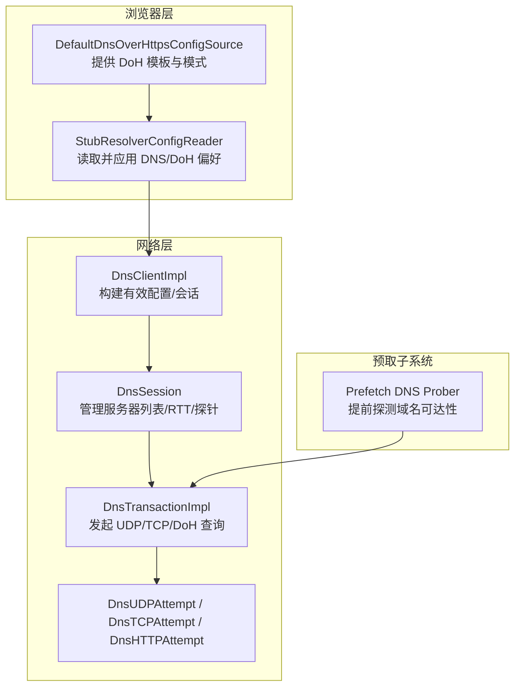
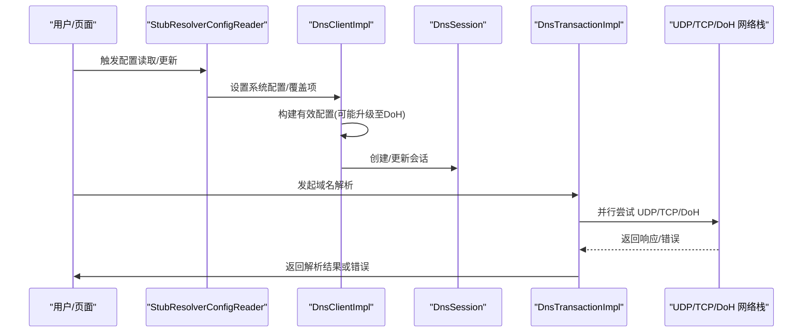
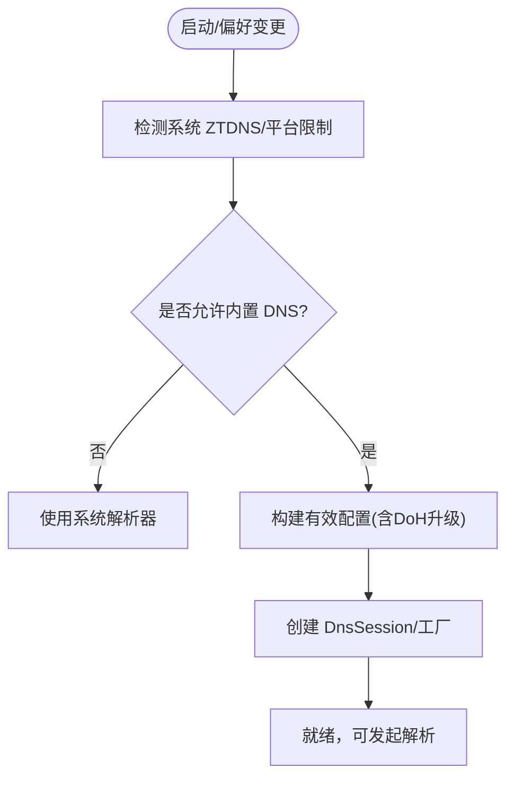
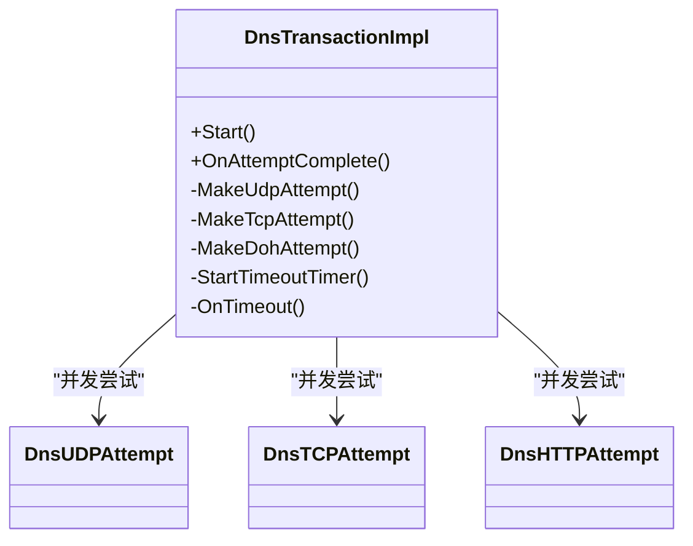
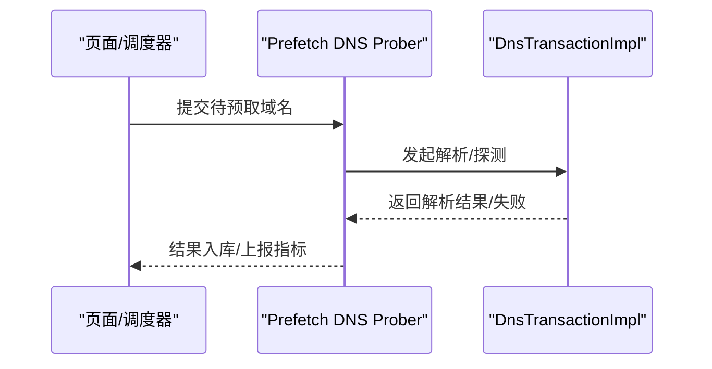
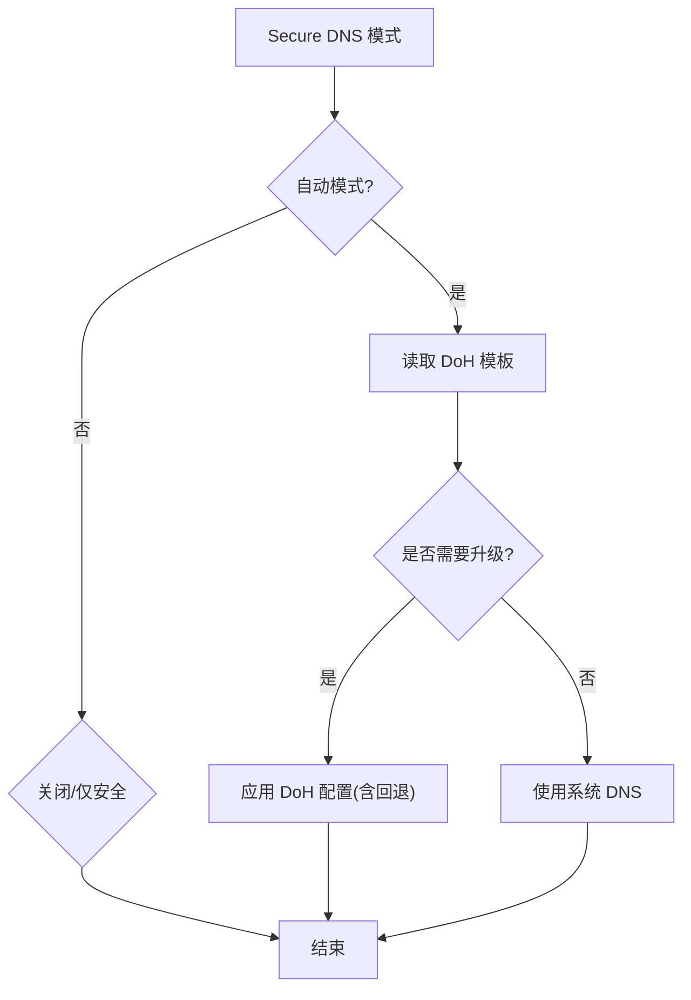
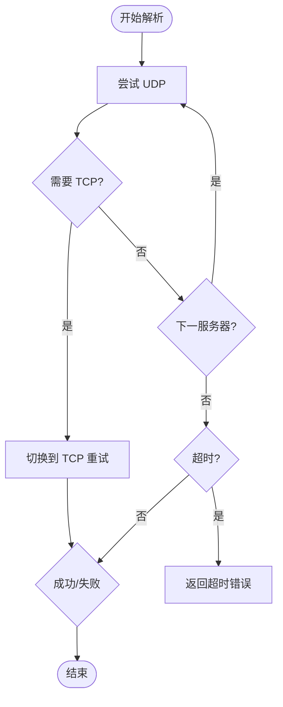

# DNS 解析优化

本文引用的文件

- [dns_client.cc](https://github.com/Mcloud136/Mcloud-Browser/blob/main/src/net/dns/dns_client.cc)
- [dns_transaction.cc](https://github.com/Mcloud136/Mcloud-Browser/blob/main/src/net/dns/dns_transaction.cc)
- [default_dns_over_https_config_source.cc](https://github.com/Mcloud136/Mcloud-Browser/blob/main/src/chrome/browser/net/default_dns_over_https_config_source.cc)
- [stub_resolver_config_reader.cc](https://github.com/Mcloud136/Mcloud-Browser/blob/main/src/chrome/browser/net/stub_resolver_config_reader.cc)

## 目录
1. [简介](#简介)
2. [项目结构](#项目结构)
3. [核心组件](#核心组件)
4. [架构总览](#架构总览)
5. [详细组件分析](#详细组件分析)
6. [依赖关系分析](#依赖关系分析)
7. [性能考量](#性能考量)
8. [故障排查指南](#故障排查指南)
9. [结论](#结论)
10. [附录](#附录)

## 简介
本文件面向 MCloud Browser 的 DNS 解析优化，重点阐述异步 DNS 解析（AsyncDns）的工作原理与实现机制，包括：
- DNS 查询的并行化、缓存策略与超时处理
- DNS 预取机制如何提前解析常用域名以降低页面加载时的 DNS 查找延迟
- DNS-over-HTTPS（DoH）的支持情况与配置方法
- DNS 解析失败的重试机制与故障转移策略
- DNS 性能监控工具与调试方法
- 常见 DNS 问题的诊断与解决方案
- 相关代码示例路径与配置参数说明

## 项目结构
与 DNS 解析优化相关的核心代码位于以下模块：
- net/dns：DNS 客户端与事务实现（UDP/TCP/DoH），包含重试、回退、超时等逻辑
- chrome/browser/net：浏览器侧对内置 DNS 客户端与 DoH 配置的读取与注入
- content/preloading/prefetch：预取子系统（含 DNS 探测相关组件，用于在导航前预热连接与解析）

图表来源
- [stub_resolver_config_reader.cc:146-196](https://github.com/Mcloud136/Mcloud-Browser/blob/main/src/chrome/browser/net/stub_resolver_config_reader.cc#L146-L196)
- [default_dns_over_https_config_source.cc:15-75](https://github.com/Mcloud136/Mcloud-Browser/blob/main/src/chrome/browser/net/default_dns_over_https_config_source.cc#L15-L75)
- [dns_client.cc:148-385](https://github.com/Mcloud136/Mcloud-Browser/blob/main/src/net/dns/dns_client.cc#L148-L385)
- [dns_transaction.cc:1182-1762](https://github.com/Mcloud136/Mcloud-Browser/blob/main/src/net/dns/dns_transaction.cc#L1182-L1762)

章节来源
- [stub_resolver_config_reader.cc:146-196](https://github.com/Mcloud136/Mcloud-Browser/blob/main/src/chrome/browser/net/stub_resolver_config_reader.cc#L146-L196)
- [default_dns_over_https_config_source.cc:15-75](https://github.com/Mcloud136/Mcloud-Browser/blob/main/src/chrome/browser/net/default_dns_over_https_config_source.cc#L15-L75)
- [dns_client.cc:148-385](https://github.com/Mcloud136/Mcloud-Browser/blob/main/src/net/dns/dns_client.cc#L148-L385)
- [dns_transaction.cc:1182-1762](https://github.com/Mcloud136/Mcloud-Browser/blob/main/src/net/dns/dns_transaction.cc#L1182-L1762)

## 核心组件
- StubResolverConfigReader：负责读取用户/策略偏好，计算 Secure DNS 模式与 DoH 模板，并将配置下发到 NetworkService，从而启用或禁用内置 DNS 客户端（AsyncDns）。
- DefaultDnsOverHttpsConfigSource：提供 DoH 模式、模板与自动模式回退开关，监听偏好变化并触发更新。
- DnsClientImpl：根据系统配置与覆盖项构建有效配置，决定是否使用安全（DoH）或不安全（UDP/TCP）事务，维护 DnsSession 与地址排序器。
- DnsTransactionImpl：封装一次完整的 DNS 解析生命周期，支持 UDP/TCP/DoH 多通道并发尝试、按 RTT 选择、回退周期、超时控制与错误分类。
- Prefetch DNS Prober：在导航前主动探测目标域名的可达性与解析结果，减少首屏 DNS 延迟。

章节来源
- [stub_resolver_config_reader.cc:146-196](https://github.com/Mcloud136/Mcloud-Browser/blob/main/src/chrome/browser/net/stub_resolver_config_reader.cc#L146-L196)
- [default_dns_over_https_config_source.cc:15-75](https://github.com/Mcloud136/Mcloud-Browser/blob/main/src/chrome/browser/net/default_dns_over_https_config_source.cc#L15-L75)
- [dns_client.cc:148-385](https://github.com/Mcloud136/Mcloud-Browser/blob/main/src/net/dns/dns_client.cc#L148-L385)
- [dns_transaction.cc:1182-1762](https://github.com/Mcloud136/Mcloud-Browser/blob/main/src/net/dns/dns_transaction.cc#L1182-L1762)

## 架构总览
下图展示了从浏览器偏好到实际 DNS 请求的完整链路，以及 DoH 升级与回退流程。

图表来源
- [stub_resolver_config_reader.cc:273-399](https://github.com/Mcloud136/Mcloud-Browser/blob/main/src/chrome/browser/net/stub_resolver_config_reader.cc#L273-L399)
- [dns_client.cc:313-385](https://github.com/Mcloud136/Mcloud-Browser/blob/main/src/net/dns/dns_client.cc#L313-L385)
- [dns_transaction.cc:1182-1762](https://github.com/Mcloud136/Mcloud-Browser/blob/main/src/net/dns/dns_transaction.cc#L1182-L1762)

## 详细组件分析

### 异步 DNS 解析（AsyncDns）工作原理
- 启用条件：通过 ShouldEnableAsyncDns 判断是否启用内置 DNS 客户端；Windows 上若启用 Zero Trust DNS 则禁用内置解析器，Android 会检查最小 SDK 版本。
- 配置注入：StubResolverConfigReader 将 Secure DNS 模式、DoH 模板、附加查询类型等下发给 NetworkService，从而激活内置解析器。
- 会话与工厂：DnsClientImpl 根据有效配置创建 DnsSession 与 DnsTransactionFactory，后续所有 DNS 查询均通过该工厂创建具体事务。

图表来源
- [stub_resolver_config_reader.cc:113-134](https://github.com/Mcloud136/Mcloud-Browser/blob/main/src/chrome/browser/net/stub_resolver_config_reader.cc#L113-L134)
- [stub_resolver_config_reader.cc:273-399](https://github.com/Mcloud136/Mcloud-Browser/blob/main/src/chrome/browser/net/stub_resolver_config_reader.cc#L273-L399)
- [dns_client.cc:313-385](https://github.com/Mcloud136/Mcloud-Browser/blob/main/src/net/dns/dns_client.cc#L313-L385)

章节来源
- [stub_resolver_config_reader.cc:113-134](https://github.com/Mcloud136/Mcloud-Browser/blob/main/src/chrome/browser/net/stub_resolver_config_reader.cc#L113-L134)
- [stub_resolver_config_reader.cc:273-399](https://github.com/Mcloud136/Mcloud-Browser/blob/main/src/chrome/browser/net/stub_resolver_config_reader.cc#L273-L399)
- [dns_client.cc:313-385](https://github.com/Mcloud136/Mcloud-Browser/blob/main/src/net/dns/dns_client.cc#L313-L385)

### DNS 查询的并行化、缓存策略与超时处理
- 并行化：DnsTransactionImpl 同时维护多个 DnsAttempt（UDP/TCP/DoH），按 RTT 与可用性动态选择最快路径；DoH 与经典 DNS 分别有独立的回退周期。
- 缓存策略：DNS 层通过 HostCache/ResolveContext 记录 RTT、服务器失败与可用状态；DoH 探针持续测试服务器质量，避免不可用节点。
- 超时处理：为每个事务设置整体超时，区分安全与非安全模式；当最后一个尝试的回退期到期时快速失败，避免长时间阻塞。

图表来源
- [dns_transaction.cc:1182-1762](https://github.com/Mcloud136/Mcloud-Browser/blob/main/src/net/dns/dns_transaction.cc#L1182-L1762)

章节来源
- [dns_transaction.cc:1182-1762](https://github.com/Mcloud136/Mcloud-Browser/blob/main/src/net/dns/dns_transaction.cc#L1182-L1762)

### DNS 预取机制（Prefetch）
- 目的：在用户交互或导航前，提前解析常用域名并建立连接，降低首屏 DNS 查找延迟。
- 能力：预取子系统包含 DNS 探测组件，可在后台对候选域名进行可达性探测与解析预热。
- 与 DNS 层的协作：预取探测最终仍走 DNS 事务通道，复用 RTT 统计与服务器可用性信息。

图表来源
- [content/browser/BUILD.gn:1596-1630](https://github.com/Mcloud136/Mcloud-Browser/blob/main/src/content/browser/BUILD.gn#L1596-L1630)
- [dns_transaction.cc:1182-1762](https://github.com/Mcloud136/Mcloud-Browser/blob/main/src/net/dns/dns_transaction.cc#L1182-L1762)

章节来源
- [content/browser/BUILD.gn:1596-1630](https://github.com/Mcloud136/Mcloud-Browser/blob/main/src/content/browser/BUILD.gn#L1596-L1630)
- [dns_transaction.cc:1182-1762](https://github.com/Mcloud136/Mcloud-Browser/blob/main/src/net/dns/dns_transaction.cc#L1182-L1762)

### DNS-over-HTTPS（DoH）支持与配置
- 默认模式：DoH 模式默认为“自动”，可通过偏好切换为“关闭”或“仅安全”。
- 模板与回退：支持自定义 DoH 模板；在自动模式下可选择回退到已知公共 DoH 服务器以提升可用性。
- 升级策略：当系统 DNS 未显式指定 DoH 且满足条件时，自动尝试基于系统 nameserver 或 DoT 主机名生成 DoH 配置。

图表来源
- [default_dns_over_https_config_source.cc:15-75](https://github.com/Mcloud136/Mcloud-Browser/blob/main/src/chrome/browser/net/default_dns_over_https_config_source.cc#L15-L75)
- [dns_client.cc:70-146](https://github.com/Mcloud136/Mcloud-Browser/blob/main/src/net/dns/dns_client.cc#L70-L146)
- [stub_resolver_config_reader.cc:273-399](https://github.com/Mcloud136/Mcloud-Browser/blob/main/src/chrome/browser/net/stub_resolver_config_reader.cc#L273-L399)

章节来源
- [default_dns_over_https_config_source.cc:15-75](https://github.com/Mcloud136/Mcloud-Browser/blob/main/src/chrome/browser/net/default_dns_over_https_config_source.cc#L15-L75)
- [dns_client.cc:70-146](https://github.com/Mcloud136/Mcloud-Browser/blob/main/src/net/dns/dns_client.cc#L70-L146)
- [stub_resolver_config_reader.cc:273-399](https://github.com/Mcloud136/Mcloud-Browser/blob/main/src/chrome/browser/net/stub_resolver_config_reader.cc#L273-L399)

### 重试机制与故障转移
- UDP 转 TCP：当 UDP 响应指示需要 TCP（TC 位）时，自动切换到 TCP 重试。
- 多服务器轮询：按 ResolveContext 提供的迭代器顺序尝试不同服务器，结合 RTT 与失败记录动态调整。
- 回退周期：每次尝试后根据服务器索引与尝试次数计算回退等待时间，避免雪崩与无效重试。
- 超时保护：整体事务超时与快速失败策略确保最坏情况下及时返回。

图表来源
- [dns_transaction.cc:1472-1485](https://github.com/Mcloud136/Mcloud-Browser/blob/main/src/net/dns/dns_transaction.cc#L1472-L1485)
- [dns_transaction.cc:1648-1682](https://github.com/Mcloud136/Mcloud-Browser/blob/main/src/net/dns/dns_transaction.cc#L1648-L1682)
- [dns_transaction.cc:1729-1750](https://github.com/Mcloud136/Mcloud-Browser/blob/main/src/net/dns/dns_transaction.cc#L1729-L1750)

章节来源
- [dns_transaction.cc:1472-1485](https://github.com/Mcloud136/Mcloud-Browser/blob/main/src/net/dns/dns_transaction.cc#L1472-L1485)
- [dns_transaction.cc:1648-1682](https://github.com/Mcloud136/Mcloud-Browser/blob/main/src/net/dns/dns_transaction.cc#L1648-L1682)
- [dns_transaction.cc:1729-1750](https://github.com/Mcloud136/Mcloud-Browser/blob/main/src/net/dns/dns_transaction.cc#L1729-L1750)

## 依赖关系分析
- StubResolverConfigReader 依赖 DefaultDnsOverHttpsConfigSource 获取 DoH 配置源，并通过 NetworkService 将配置下发。
- DnsClientImpl 依赖系统配置与覆盖项构建有效配置，必要时执行 DoH 升级。
- DnsTransactionImpl 依赖 DnsSession 提供的服务器列表、RTT 统计与探针信息，决定具体传输方式与重试策略。

图表来源
- [stub_resolver_config_reader.cc:146-196](https://github.com/Mcloud136/Mcloud-Browser/blob/main/src/chrome/browser/net/stub_resolver_config_reader.cc#L146-L196)
- [dns_client.cc:148-385](https://github.com/Mcloud136/Mcloud-Browser/blob/main/src/net/dns/dns_client.cc#L148-L385)
- [dns_transaction.cc:1182-1762](https://github.com/Mcloud136/Mcloud-Browser/blob/main/src/net/dns/dns_transaction.cc#L1182-L1762)

章节来源
- [stub_resolver_config_reader.cc:146-196](https://github.com/Mcloud136/Mcloud-Browser/blob/main/src/chrome/browser/net/stub_resolver_config_reader.cc#L146-L196)
- [dns_client.cc:148-385](https://github.com/Mcloud136/Mcloud-Browser/blob/main/src/net/dns/dns_client.cc#L148-L385)
- [dns_transaction.cc:1182-1762](https://github.com/Mcloud136/Mcloud-Browser/blob/main/src/net/dns/dns_transaction.cc#L1182-L1762)

## 性能考量
- 并行与 RTT 选择：通过并发尝试 UDP/TCP/DoH 并结合 RTT 统计，优先选择低延迟路径，显著降低解析耗时。
- DoH 探针：持续探测 DoH 服务器质量，避免不可用节点影响用户体验。
- 预取预热：在导航前对高频域名进行解析与连接预热，减少首屏 DNS 查找延迟。
- 超时与快速失败：合理设置事务超时与快速失败策略，避免长尾延迟拖慢整体性能。

[本节为通用性能讨论，不直接分析具体文件]

## 故障排查指南
- 启用/验证 AsyncDns：确认内置 DNS 客户端已启用，并在 NetworkService 中生效。
- 检查 DoH 模式与模板：查看当前 Secure DNS 模式与 DoH 模板是否正确，必要时切换为自动模式并启用回退。
- 观察日志与指标：关注 DNS 事务日志（UDP/TCP/DoH）、RTT 统计与服务器失败记录，定位问题根因。
- 常见问题：
  - 解析超时：检查网络连通性、DoH 服务器可达性与回退策略。
  - UDP 被阻断：自动切换到 TCP 或 DoH，确认服务端 TC 位与协议支持。
  - 父控/策略限制：在某些模式下需检查家长控制或企业策略是否禁用了 DoH。

章节来源
- [dns_transaction.cc:1182-1762](https://github.com/Mcloud136/Mcloud-Browser/blob/main/src/net/dns/dns_transaction.cc#L1182-L1762)
- [stub_resolver_config_reader.cc:273-399](https://github.com/Mcloud136/Mcloud-Browser/blob/main/src/chrome/browser/net/stub_resolver_config_reader.cc#L273-L399)

## 结论
MCloud Browser 通过内置异步 DNS 解析（AsyncDns）、DoH 支持与预取机制，实现了高效、可靠且安全的域名解析体验。其核心优势在于：
- 多通道并发与 RTT 自适应选择，最大化利用网络资源
- 完善的超时、重试与回退策略，提升鲁棒性
- 灵活的 DoH 配置与自动升级，兼顾安全与兼容性
- 预取预热降低首屏延迟，改善用户体验

[本节为总结性内容，不直接分析具体文件]

## 附录

### 关键配置参数与位置
- 内置 DNS 客户端开关：kBuiltInDnsClientEnabled
- 附加查询类型开关：kAdditionalDnsQueryTypesEnabled
- Happy Eyeballs V3 开关：kHappyEyeballsV3Enabled
- DoH 模式：kDnsOverHttpsMode
- DoH 模板：kDnsOverHttpsTemplates
- 自动模式回退到 DoH：kDnsOverHttpsAutomaticModeFallbackToDoh

章节来源
- [stub_resolver_config_reader.cc:186-196](https://github.com/Mcloud136/Mcloud-Browser/blob/main/src/chrome/browser/net/stub_resolver_config_reader.cc#L186-L196)
- [default_dns_over_https_config_source.cc:35-69](https://github.com/Mcloud136/Mcloud-Browser/blob/main/src/chrome/browser/net/default_dns_over_https_config_source.cc#L35-L69)

### 代码示例路径（便于进一步阅读）
- 异步 DNS 启用与配置注入：[stub_resolver_config_reader.cc:113-134](https://github.com/Mcloud136/Mcloud-Browser/blob/main/src/chrome/browser/net/stub_resolver_config_reader.cc#L113-L134)、[stub_resolver_config_reader.cc:273-399](https://github.com/Mcloud136/Mcloud-Browser/blob/main/src/chrome/browser/net/stub_resolver_config_reader.cc#L273-L399)
- DoH 配置源与偏好监听：[default_dns_over_https_config_source.cc:15-75](https://github.com/Mcloud136/Mcloud-Browser/blob/main/src/chrome/browser/net/default_dns_over_https_config_source.cc#L15-L75)
- 有效配置构建与 DoH 升级：[dns_client.cc:70-146](https://github.com/Mcloud136/Mcloud-Browser/blob/main/src/net/dns/dns_client.cc#L70-L146)、[dns_client.cc:313-385](https://github.com/Mcloud136/Mcloud-Browser/blob/main/src/net/dns/dns_client.cc#L313-L385)
- DNS 事务与重试/超时：[dns_transaction.cc:1182-1762](https://github.com/Mcloud136/Mcloud-Browser/blob/main/src/net/dns/dns_transaction.cc#L1182-L1762)
- 预取子系统（含 DNS 探测）：[content/browser/BUILD.gn:1596-1630](https://github.com/Mcloud136/Mcloud-Browser/blob/main/src/content/browser/BUILD.gn#L1596-L1630)