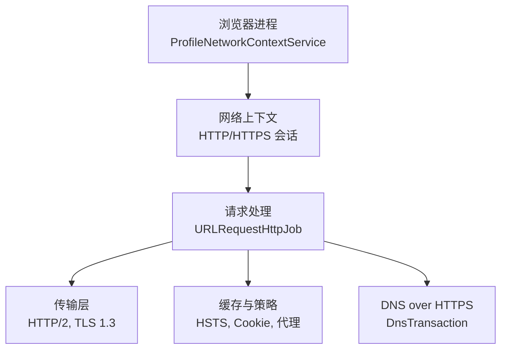
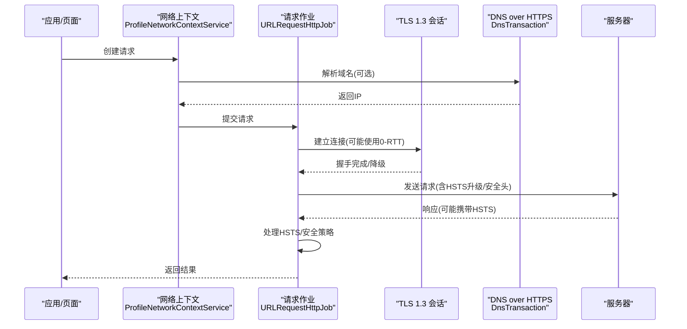
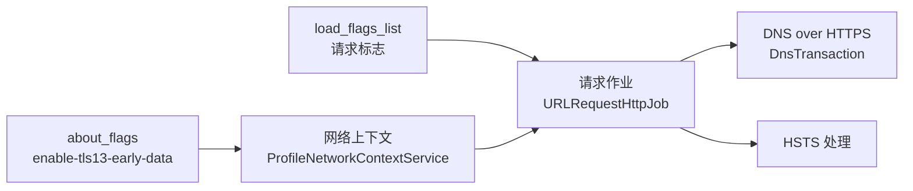

# HTTP 协议优化

<cite>
**本文引用的文件**
- [about_flags.cc](file://src/chrome/browser/about_flags.cc)
- [load_flags_list.h](file://src/net/base/load_flags_list.h)
- [url_request_http_job.cc](file://src/net/url_request/url_request_http_job.cc)
- [profile_network_context_service.cc](file://src/chrome/browser/net/profile_network_context_service.cc)
- [dns_transaction.cc](file://src/net/dns/dns_transaction.cc)
- [CMDLINE_FLAGS_LIST.md](file://docs/CMDLINE_FLAGS_LIST.md)
</cite>

## 目录
1. [简介](#简介)
2. [项目结构](#项目结构)
3. [核心组件](#核心组件)
4. [架构总览](#架构总览)
5. [详细组件分析](#详细组件分析)
6. [依赖关系分析](#依赖关系分析)
7. [性能考量](#性能考量)
8. [故障排查指南](#故障排查指南)
9. [结论](#结论)
10. [附录](#附录)

## 简介
本文件面向 MCloud Browser 的 HTTP 协议优化，聚焦以下主题：TLS 1.3 早期数据（0-RTT）的实现原理与安全、HTTP/2 多路复用与头部压缩、连接池与 Keep-Alive 生命周期管理、请求优先级调度与资源预连接（Preconnect）、以及性能分析与抓包技巧。文档基于仓库中实际代码与配置进行说明，并提供可操作的调优建议。

## 项目结构
MCloud Browser 的网络栈以 Chromium 网络层为核心，浏览器进程通过 ProfileNetworkContextService 构建并配置网络上下文；URL 请求经 URLRequestHttpJob 处理；DNS over HTTPS 在 DNS 事务中实现；功能开关由 about_flags 暴露；加载标志定义于 load_flags_list。

图表来源
- [profile_network_context_service.cc:1346-1378](file://src/chrome/browser/net/profile_network_context_service.cc#L1346-L1378)
- [url_request_http_job.cc:1198-1230](file://src/net/url_request/url_request_http_job.cc#L1198-L1230)
- [dns_transaction.cc:446-495](file://src/net/dns/dns_transaction.cc#L446-L495)

章节来源
- [profile_network_context_service.cc:1346-1378](file://src/chrome/browser/net/profile_network_context_service.cc#L1346-L1378)
- [url_request_http_job.cc:1198-1230](file://src/net/url_request/url_request_http_job.cc#L1198-L1230)
- [dns_transaction.cc:446-495](file://src/net/dns/dns_transaction.cc#L446-L495)

## 核心组件
- TLS 1.3 早期数据（0-RTT）开关：通过 about_flags 暴露 enable-tls13-early-data，映射到 net::features::kEnableTLS13EarlyData。
- 加载标志：load_flags_list.h 定义了多种请求级行为标志，如跳过缓存、最小化头、忽略限制等，影响网络栈行为。
- HSTS 处理：url_request_http_job.cc 对响应中的 Strict-Transport-Security 进行处理，仅在有效证书且非 IP/localhost 时接受。
- 网络上下文与缓存：profile_network_context_service.cc 启用 HTTP 缓存，并可配置磁盘缓存路径与大小。
- DNS over HTTPS：dns_transaction.cc 使用 HTTPS 发起 DNS 查询，设置最小头、禁用缓存与代理，避免死锁并支持预配置地址。

章节来源
- [about_flags.cc:6606-6608](file://src/chrome/browser/about_flags.cc#L6606-L6608)
- [load_flags_list.h:22-131](file://src/net/base/load_flags_list.h#L22-L131)
- [url_request_http_job.cc:1212-1230](file://src/net/url_request/url_request_http_job.cc#L1212-L1230)
- [profile_network_context_service.cc:1346-1378](file://src/chrome/browser/net/profile_network_context_service.cc#L1346-L1378)
- [dns_transaction.cc:446-495](file://src/net/dns/dns_transaction.cc#L446-L495)

## 架构总览
下图展示一次典型 HTTPS 请求从浏览器到网络的流程，包含 HSTS 处理、DNS over HTTPS、以及可能的 0-RTT 能力。

图表来源
- [profile_network_context_service.cc:1346-1378](file://src/chrome/browser/net/profile_network_context_service.cc#L1346-L1378)
- [url_request_http_job.cc:1212-1230](file://src/net/url_request/url_request_http_job.cc#L1212-L1230)
- [dns_transaction.cc:446-495](file://src/net/dns/dns_transaction.cc#L446-L495)
- [about_flags.cc:6606-6608](file://src/chrome/browser/about_flags.cc#L6606-L6608)

## 详细组件分析

### TLS 1.3 早期数据（0-RTT）
- 实现要点
  - 通过 about_flags 暴露 enable-tls13-early-data，启用后允许在 TLS 1.3 握手阶段发送早期数据，减少首字节延迟。
  - 0-RTT 使用重放保护令牌与密钥派生机制，仅对幂等请求提供有限的安全语义；非幂等请求需额外防护。
- 安全考虑
  - 重放攻击防护：客户端与服务端需维护重放窗口与令牌绑定；对非幂等请求应拒绝或严格校验。
  - 降级机制：若协商失败或检测到异常，自动回退到标准 1-RTT 握手，确保可用性。
  - 密钥派生：遵循 TLS 1.3 密钥派生函数（HKDF），为早期数据生成独立密钥空间，隔离后续握手密钥。
- 实践建议
  - 仅对幂等 GET/HEAD 等请求启用 0-RTT。
  - 结合服务端策略与日志监控，评估重放风险。
  - 在混合场景下保持降级兼容，避免强制 0-RTT 导致失败。

章节来源
- [about_flags.cc:6606-6608](file://src/chrome/browser/about_flags.cc#L6606-L6608)

### HTTP/2 多路复用与头部压缩
- 多路复用
  - 单连接并发：HTTP/2 在同一 TCP 连接上并行多个流，降低握手开销与队头阻塞。
  - 连接复用：配合 Keep-Alive，减少新建连接的 CPU 与内存消耗。
- 头部压缩
  - HPACK 压缩：对请求/响应头进行字典压缩，显著减少带宽占用。
  - 共享字典：部分平台支持共享字典以提升压缩效率。
- 服务端推送
  - 利用 PUSH_PROMISE 提前推送关键资源，但需谨慎使用以避免浪费带宽。
- 效果评估
  - 高并发小对象场景收益明显；长连接大文件场景需关注流优先级与拥塞控制。

[本节为概念性说明，不直接分析具体文件]

### 连接池管理与 Keep-Alive 生命周期
- 连接池
  - 按主机/端口/安全策略复用连接，减少握手次数。
  - 根据负载与超时策略回收空闲连接，平衡资源占用与复用收益。
- Keep-Alive
  - 合理设置超时时间，避免僵尸连接占用资源。
  - 在高并发环境下，监控连接数与复用率，调整最大连接数与空闲阈值。
- 缓存协同
  - 启用 HTTP 缓存可减少重复请求，提升整体吞吐。

章节来源
- [profile_network_context_service.cc:1346-1378](file://src/chrome/browser/net/profile_network_context_service.cc#L1346-L1378)

### 请求优先级调度与资源预连接（Preconnect）
- 优先级调度
  - 依据 LOAD_FLAG 控制请求行为，例如 IGNORE_LIMITS 用于避免死锁，PREFETCH 用于预取。
  - 主框架与子资源区分，避免关键资源被阻塞。
- 预连接（Preconnect）
  - 在导航前预先建立 DNS、TCP、TLS 连接，缩短首字节时间。
  - 结合 rel=preconnect 与 Speculation Rules，提高命中率。
- 最小化头
  - MINIMAL_HEADERS 用于合规场景（如 DoH），减少不必要信息泄露。

章节来源
- [load_flags_list.h:69-131](file://src/net/base/load_flags_list.h#L69-L131)

### DNS over HTTPS（DoH）
- 实现方式
  - 通过 HTTPS 发起 DNS 查询，设置最小头、禁用缓存与代理，避免循环依赖与死锁。
  - 支持 POST/GET 两种方法，适配不同服务器。
- 优势
  - 加密与隐私增强，规避传统 DNS 劫持。
  - 可配置预解析与预连接，加速后续请求。

章节来源
- [dns_transaction.cc:446-495](file://src/net/dns/dns_transaction.cc#L446-L495)

### HSTS 处理与安全策略
- 处理逻辑
  - 仅在 HTTPS 且证书有效时接受 HSTS 头，忽略 IP 与 localhost。
  - 将 HSTS 策略持久化，强制后续请求升级为 HTTPS。
- 安全意义
  - 防止中间人攻击与协议降级。
  - 与 0-RTT 配合时需确保握手完整性。

章节来源
- [url_request_http_job.cc:1212-1230](file://src/net/url_request/url_request_http_job.cc#L1212-L1230)

## 依赖关系分析
- about_flags 暴露 0-RTT 开关，驱动网络栈行为。
- load_flags_list 提供细粒度请求控制，影响缓存、代理、优先级等。
- profile_network_context_service 统一配置网络上下文与缓存策略。
- url_request_http_job 负责请求级安全策略（如 HSTS）。
- dns_transaction 实现 DoH，与 URL 请求协作。

图表来源
- [about_flags.cc:6606-6608](file://src/chrome/browser/about_flags.cc#L6606-L6608)
- [load_flags_list.h:22-131](file://src/net/base/load_flags_list.h#L22-L131)
- [profile_network_context_service.cc:1346-1378](file://src/chrome/browser/net/profile_network_context_service.cc#L1346-L1378)
- [url_request_http_job.cc:1212-1230](file://src/net/url_request/url_request_http_job.cc#L1212-L1230)
- [dns_transaction.cc:446-495](file://src/net/dns/dns_transaction.cc#L446-L495)

章节来源
- [about_flags.cc:6606-6608](file://src/chrome/browser/about_flags.cc#L6606-L6608)
- [load_flags_list.h:22-131](file://src/net/base/load_flags_list.h#L22-L131)
- [profile_network_context_service.cc:1346-1378](file://src/chrome/browser/net/profile_network_context_service.cc#L1346-L1378)
- [url_request_http_job.cc:1212-1230](file://src/net/url_request/url_request_http_job.cc#L1212-L1230)
- [dns_transaction.cc:446-495](file://src/net/dns/dns_transaction.cc#L446-L495)

## 性能考量
- 启用 0-RTT 的场景选择：优先幂等 GET/HEAD，结合服务端策略与监控。
- HTTP/2 多路复用：在高并发小对象场景显著提升吞吐；注意流优先级与拥塞控制。
- 头部压缩：HPACK 减少带宽；共享字典可进一步提升效率。
- 连接复用：Keep-Alive 与连接池降低握手成本；合理设置超时与上限。
- 预连接与预取：rel=preconnect 与 Prefetch 减少首字节延迟；避免过度预取造成浪费。
- DoH：提升隐私与抗劫持；注意与代理/缓存的兼容性。

[本节为通用指导，不直接分析具体文件]

## 故障排查指南
- 0-RTT 失败或降级
  - 检查是否启用了 enable-tls13-early-data。
  - 观察握手日志，确认是否发生降级至 1-RTT。
  - 验证服务端是否支持 0-RTT 及重放保护。
- HSTS 相关问题
  - 确认证书有效且非 IP/localhost。
  - 检查 HSTS 头是否正确设置与持久化。
- DoH 解析失败
  - 检查最小头、禁用缓存与代理设置。
  - 验证 DoH 服务器可达性与策略配置。
- 缓存与代理冲突
  - 使用 LOAD_BYPASS_CACHE 或 LOAD_DISABLE_CACHE 调试缓存命中。
  - 使用 LOAD_BYPASS_PROXY 排除代理干扰。

章节来源
- [about_flags.cc:6606-6608](file://src/chrome/browser/about_flags.cc#L6606-L6608)
- [url_request_http_job.cc:1212-1230](file://src/net/url_request/url_request_http_job.cc#L1212-L1230)
- [dns_transaction.cc:446-495](file://src/net/dns/dns_transaction.cc#L446-L495)
- [load_flags_list.h:22-131](file://src/net/base/load_flags_list.h#L22-L131)

## 结论
MCloud Browser 在网络层提供了丰富的优化能力：TLS 1.3 0-RTT 降低首字节延迟，HTTP/2 多路复用与头部压缩提升吞吐，连接池与 Keep-Alive 优化资源利用，预连接与预取改善首屏性能，DoH 增强隐私与安全性。通过合理的开关配置与策略调优，可在保证安全的前提下获得显著的性能收益。

[本节为总结，不直接分析具体文件]

## 附录
- 常用命令与标志
  - 参考 CMDLINE_FLAGS_LIST.md 获取命令行开关列表与说明。
  - 针对网络相关开关，结合业务场景启用或禁用。

章节来源
- [CMDLINE_FLAGS_LIST.md:1-200](file://docs/CMDLINE_FLAGS_LIST.md#L1-L200)