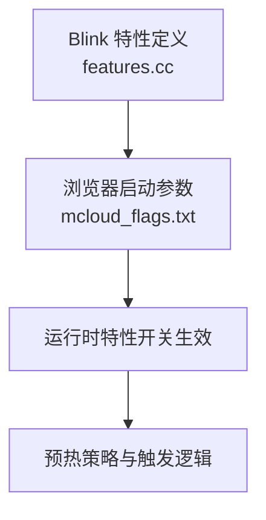
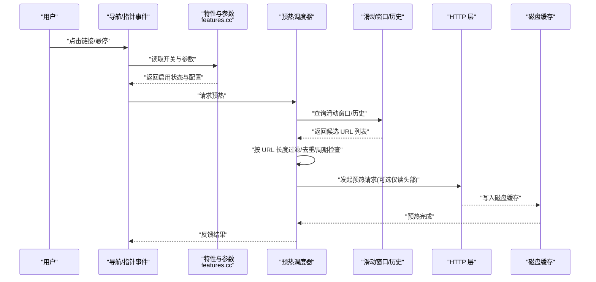
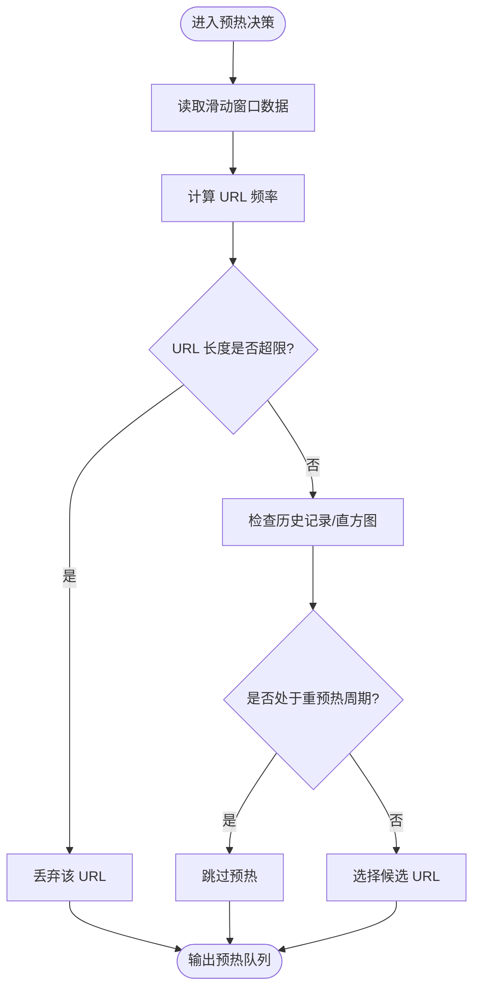
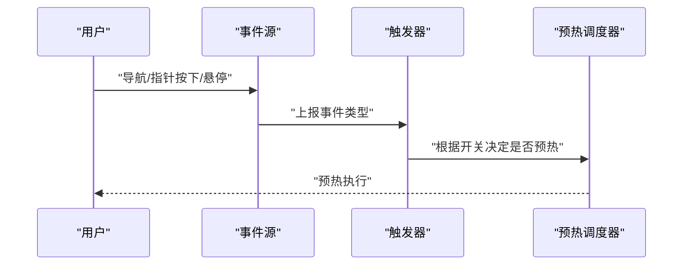
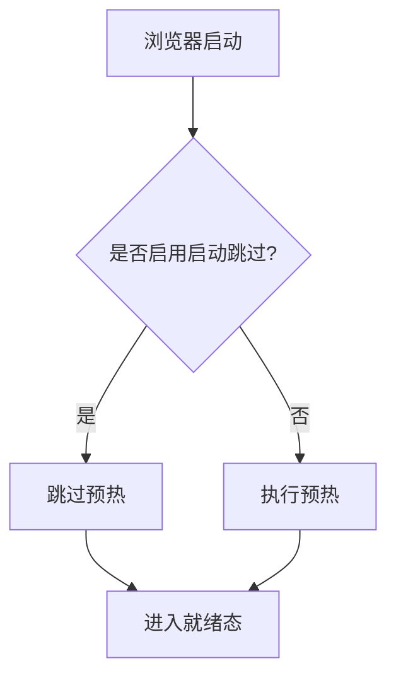

# HTTP 磁盘缓存预热

<cite>
**本文引用的文件**
- [features.cc](file://src/third_party/blink/common/features.cc)
- [mcloud_flags.txt](file://mcloud_flags.txt)
</cite>

## 目录
1. [简介](#简介)
2. [项目结构](#项目结构)
3. [核心组件](#核心组件)
4. [架构总览](#架构总览)
5. [详细组件分析](#详细组件分析)
6. [依赖关系分析](#依赖关系分析)
7. [性能考量](#性能考量)
8. [故障排除指南](#故障排除指南)
9. [结论](#结论)
10. [附录](#附录)

## 简介
HTTP 磁盘缓存预热（HttpDiskCachePrewarming）是一项在用户交互或导航发生前，提前将可能需要的资源预取到磁盘缓存的优化能力。通过滑动窗口与历史统计，系统可以识别高频访问的资源并主动预热，从而降低后续首字节时间与加载抖动。该功能默认关闭，可通过启用开关与一系列参数进行精细控制，包括 URL 长度限制、历史记录大小、重预热周期、触发条件（导航、指针按下/悬停）、启动时跳过预热等。

## 项目结构
本仓库中与 HTTP 磁盘缓存预热相关的配置与开关集中在 Blink 特性定义中，并通过浏览器启动参数统一启用。关键位置如下：
- 特性与参数定义：位于 Blink 公共特性文件中，集中管理 HttpDiskCachePrewarming 及其相关参数。
- 启用方式：通过命令行参数 --enable-features=HttpDiskCachePrewarming 开启。

**图表来源**
- [features.cc:1440-1496](file://src/third_party/blink/common/features.cc#L1440-L1496)
- [mcloud_flags.txt:75](file://mcloud_flags.txt#L75)

**章节来源**
- [features.cc:1440-1496](file://src/third_party/blink/common/features.cc#L1440-L1496)
- [mcloud_flags.txt:75](file://mcloud_flags.txt#L75)

## 核心组件
- 特性开关：kHttpDiskCachePrewarming
- 关键参数：
  - kHttpDiskCachePrewarmingMaxUrlLength：URL 最大长度阈值，用于过滤过长的 URL，避免无界增长与无效预热。
  - kHttpDiskCachePrewarmingHistorySize：历史记录容量，用于统计近期访问模式。
  - kHttpDiskCachePrewarmingReprewarmPeriod：重预热周期，控制对同一资源的重复预热间隔。
  - kHttpDiskCachePrewarmingTriggerOnNavigation：是否在导航时触发预热。
  - kHttpDiskCachePrewarmingTriggerOnPointerDownOrHover：是否在指针按下或悬停时触发预热。
  - kHttpDiskCachePrewarmingUseReadAndDiscardBodyOption：是否使用“读取并丢弃响应体”的方式预热，以降低带宽占用。
  - kHttpDiskCachePrewarmingSkipDuringBrowserStartup：是否在浏览器启动阶段跳过预热，减少冷启动开销。
  - kHttpDiskCachePrewarmingSlidingWindowSize：滑动窗口大小，用于统计短期访问频率。
  - kHttpDiskCachePrewarmingMaxHistogramBuckets：直方图桶上限，用于统计分布。

这些参数共同决定了预热的范围、时机、频率与资源消耗边界。

**章节来源**
- [features.cc:1440-1496](file://src/third_party/blink/common/features.cc#L1440-L1496)

## 架构总览
从特性开关到运行时的整体流程如下：
- 编译期/运行期：通过 features.cc 暴露特性与参数。
- 启动期：通过 mcloud_flags.txt 启用 HttpDiskCachePrewarming。
- 运行时：根据导航与指针事件触发预热；依据滑动窗口与历史统计选择候选 URL；按重预热周期去重；按 URL 长度限制过滤；可选择仅读取头部以节省带宽；启动阶段可跳过预热。

**图表来源**
- [features.cc:1440-1496](file://src/third_party/blink/common/features.cc#L1440-L1496)
- [mcloud_flags.txt:75](file://mcloud_flags.txt#L75)

## 详细组件分析

### 滑动窗口算法与历史统计
- 滑动窗口：基于 kHttpDiskCachePrewarmingSlidingWindowSize 维护一个时间窗口内的访问序列，用于捕捉短期热点。
- 历史统计：基于 kHttpDiskCachePrewarmingHistorySize 维护长期访问历史，结合直方图桶上限 kHttpDiskCachePrewarmingMaxHistogramBuckets 进行分布统计。
- 决策逻辑：在窗口内出现高频率的 URL 将被选为预热候选；同时考虑重预热周期以避免频繁重复预热。

**图表来源**
- [features.cc:1440-1496](file://src/third_party/blink/common/features.cc#L1440-L1496)

**章节来源**
- [features.cc:1440-1496](file://src/third_party/blink/common/features.cc#L1440-L1496)

### 触发机制：导航与指针交互
- 导航触发：当 kHttpDiskCachePrewarmingTriggerOnNavigation 为真时，页面导航前后会触发预热，优先预热当前页及关联子资源。
- 指针交互触发：当 kHttpDiskCachePrewarmingTriggerOnPointerDownOrHover 为真时，用户在锚点或可点击元素上按下或悬停会触发预热，提升交互即时性。

**图表来源**
- [features.cc:1440-1496](file://src/third_party/blink/common/features.cc#L1440-L1496)

**章节来源**
- [features.cc:1440-1496](file://src/third_party/blink/common/features.cc#L1440-L1496)

### 启动时跳过预热的优化策略
- 开关：kHttpDiskCachePrewarmingSkipDuringBrowserStartup
- 目的：在浏览器冷启动阶段跳过预热，避免与初始化任务争抢 I/O 与 CPU，缩短启动时间。
- 效果：首次启动更流畅，待主线程稳定后再逐步预热。

**图表来源**
- [features.cc:1440-1496](file://src/third_party/blink/common/features.cc#L1440-L1496)

**章节来源**
- [features.cc:1440-1496](file://src/third_party/blink/common/features.cc#L1440-L1496)

### 配置参数与调优方法
- kHttpDiskCachePrewarmingMaxUrlLength
  - 作用：限制预热 URL 的最大长度，防止过长 URL 导致内存与处理开销。
  - 调优：若站点 URL 较长且包含大量动态参数，可适当提高该值；否则保持默认以减少误预热。
- kHttpDiskCachePrewarmingHistorySize
  - 作用：历史记录容量，影响长期热点识别的准确性。
  - 调优：增大可提升命中率但增加内存；过小可能导致漏判。
- kHttpDiskCachePrewarmingReprewarmPeriod
  - 作用：重预热周期，控制同一资源重复预热的最小间隔。
  - 调优：较短周期会增加网络压力；较长周期可能错过热点变化。
- kHttpDiskCachePrewarmingTriggerOnNavigation / TriggerOnPointerDownOrHover
  - 作用：决定在哪些交互场景下触发预热。
  - 调优：移动端建议开启指针交互触发；桌面端可根据站点特点调整。
- kHttpDiskCachePrewarmingUseReadAndDiscardBodyOption
  - 作用：是否仅读取响应头并丢弃响应体，降低带宽占用。
  - 调优：在弱网环境下建议开启；强网环境可关闭以获得更完整的预热效果。
- kHttpDiskCachePrewarmingSlidingWindowSize
  - 作用：滑动窗口大小，影响短期热点检测灵敏度。
  - 调优：较大窗口更稳健但延迟更高；较小窗口更灵敏但噪声更多。
- kHttpDiskCachePrewarmingMaxHistogramBuckets
  - 作用：直方图桶上限，用于统计分布。
  - 调优：通常保持默认即可，除非有特定分布需求。

**章节来源**
- [features.cc:1440-1496](file://src/third_party/blink/common/features.cc#L1440-L1496)

## 依赖关系分析
- 特性开关依赖：HttpDiskCachePrewarming 由 Blink 特性系统提供，并在浏览器启动参数中启用。
- 参数依赖：各参数均绑定到同一特性对象，运行时由特性系统解析与应用。
- 外部集成：预热最终通过 HTTP 层写入磁盘缓存，具体实现细节不在本仓库范围内，但参数与触发逻辑在此处定义。

**图表来源**
- [features.cc:1440-1496](file://src/third_party/blink/common/features.cc#L1440-L1496)
- [mcloud_flags.txt:75](file://mcloud_flags.txt#L75)

**章节来源**
- [features.cc:1440-1496](file://src/third_party/blink/common/features.cc#L1440-L1496)
- [mcloud_flags.txt:75](file://mcloud_flags.txt#L75)

## 性能考量
- 内存与 I/O：历史记录与滑动窗口会占用内存；预热会产生额外 I/O。需平衡 HistorySize 与 SlidingWindowSize。
- 网络带宽：UseReadAndDiscardBodyOption 可降低带宽占用；在弱网环境下建议开启。
- 启动体验：SkipDuringBrowserStartup 可减少冷启动开销，提升首次启动速度。
- 命中率：合理设置 MaxUrlLength 与 RePreWarmPeriod 可提高命中率并减少无效预热。

[本节为通用指导，不直接分析具体文件]

## 故障排除指南
- 现象：预热未生效
  - 检查是否已启用 HttpDiskCachePrewarming（mcloud_flags.txt）。
  - 确认相关触发开关是否为真（导航/指针交互）。
- 现象：预热过多或无效
  - 降低 HistorySize 或调整 SlidingWindowSize。
  - 提高 MaxUrlLength 的阈值或检查 URL 是否过长。
  - 增大 RePreWarmPeriod 以减少重复预热。
- 现象：启动卡顿
  - 确保 SkipDuringBrowserStartup 为真，避免启动阶段预热。
- 现象：带宽占用过高
  - 开启 UseReadAndDiscardBodyOption，仅预热头部。

**章节来源**
- [mcloud_flags.txt:75](file://mcloud_flags.txt#L75)
- [features.cc:1440-1496](file://src/third_party/blink/common/features.cc#L1440-L1496)

## 结论
HTTP 磁盘缓存预热通过滑动窗口与历史统计识别热点资源，在导航与指针交互时主动预热至磁盘缓存，显著提升后续加载性能。通过合理的参数调优与启动阶段跳过预热，可在用户体验与资源消耗之间取得良好平衡。建议在真实站点上进行 A/B 测试，结合指标验证收益。

[本节为总结，不直接分析具体文件]

## 附录
- 启用方式：在浏览器启动参数中添加 --enable-features=HttpDiskCachePrewarming。
- 参考位置：
  - 特性与参数定义：features.cc
  - 启用参数：mcloud_flags.txt

**章节来源**
- [mcloud_flags.txt:75](file://mcloud_flags.txt#L75)
- [features.cc:1440-1496](file://src/third_party/blink/common/features.cc#L1440-L1496)