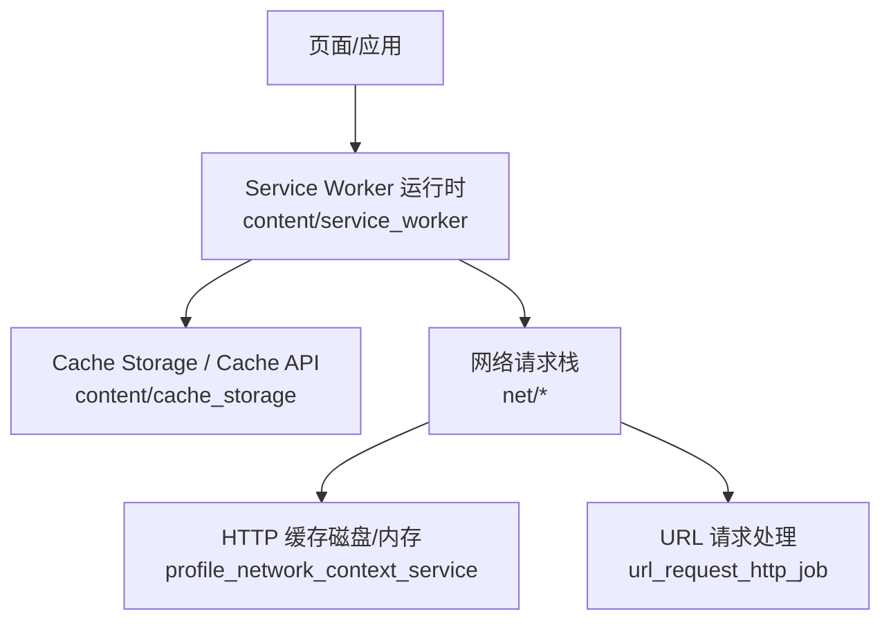
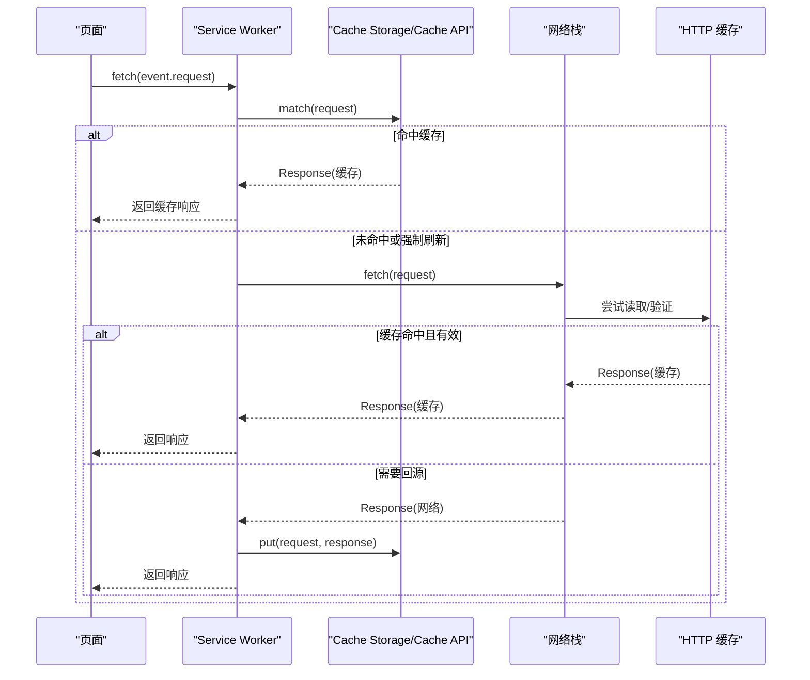
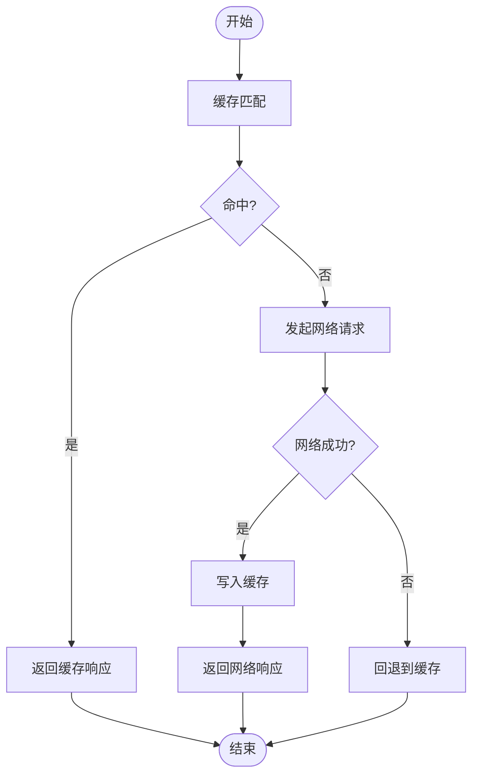
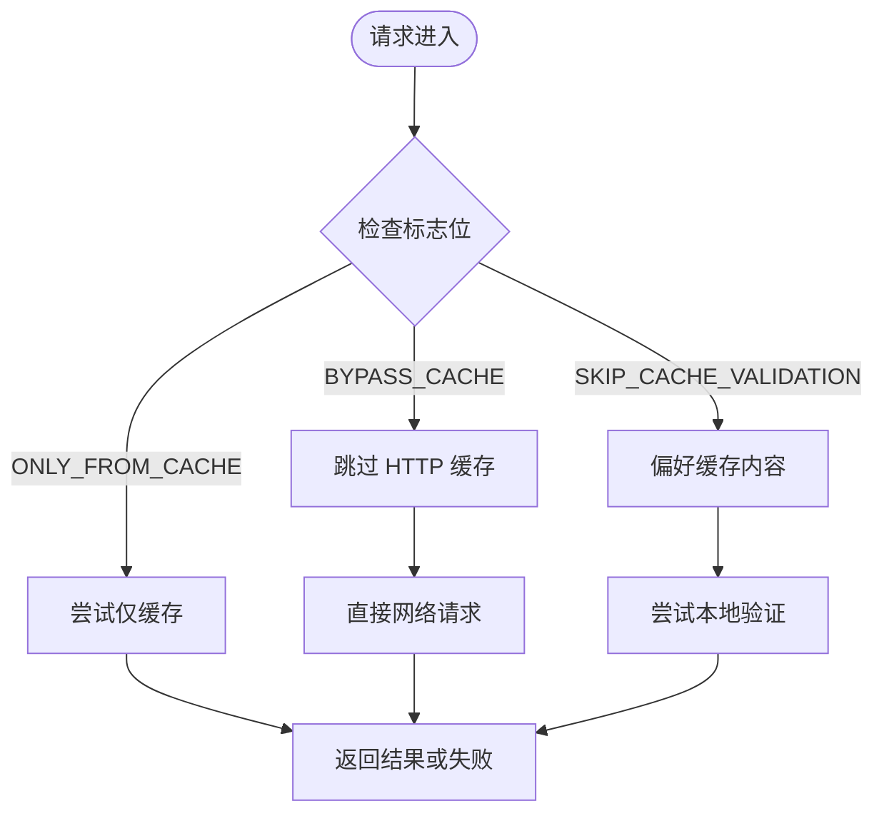
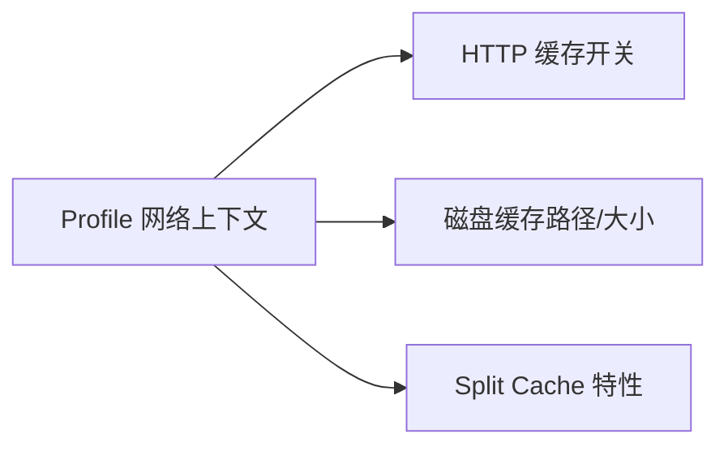
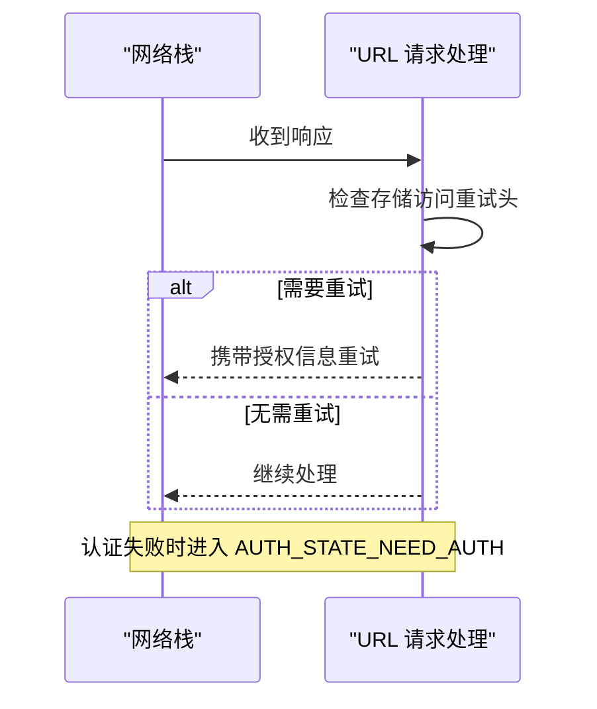
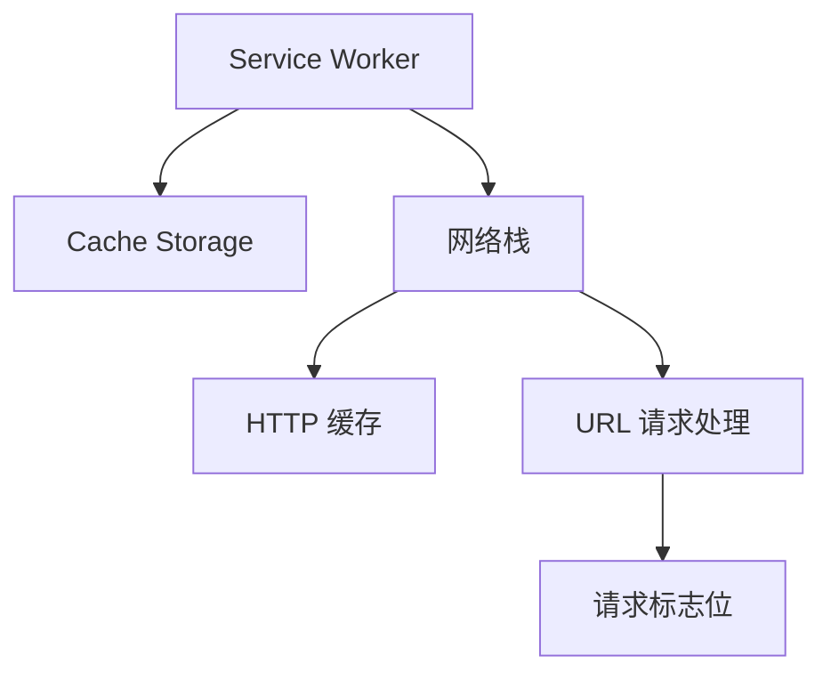

# Service Worker 缓存

本文引用的文件

- [src/content/browser/BUILD.gn](https://github.com/Mcloud136/Mcloud-Browser/blob/main/src/content/browser/BUILD.gn)
- [src/chrome/browser/net/profile_network_context_service.cc](https://github.com/Mcloud136/Mcloud-Browser/blob/main/src/chrome/browser/net/profile_network_context_service.cc)
- [src/chrome/app/chrome_main_delegate.cc](https://github.com/Mcloud136/Mcloud-Browser/blob/main/src/chrome/app/chrome_main_delegate.cc)
- [src/net/url_request/url_request_http_job.cc](https://github.com/Mcloud136/Mcloud-Browser/blob/main/src/net/url_request/url_request_http_job.cc)
- [src/net/base/load_flags_list.h](https://github.com/Mcloud136/Mcloud-Browser/blob/main/src/net/base/load_flags_list.h)
- [other/GPC.patch](https://github.com/Mcloud136/Mcloud-Browser/blob/main/other/GPC.patch)

## 目录
1. [简介](#简介)
2. [项目结构](#项目结构)
3. [核心组件](#核心组件)
4. [架构总览](#架构总览)
5. [详细组件分析](#详细组件分析)
6. [依赖关系分析](#依赖关系分析)
7. [性能考量](#性能考量)
8. [故障排查指南](#故障排查指南)
9. [结论](#结论)
10. [附录](#附录)

## 简介
本文件围绕 Service Worker 缓存展开，系统阐述 Cache API 与网络层（HTTP 缓存）的协同工作方式，解释“网络优先/缓存优先”策略在浏览器中的实现原理，包括请求拦截、响应匹配与缓存更新机制。同时给出 Application Cache 迁移到现代缓存策略的建议，覆盖离线资源管理、版本控制与增量更新策略，并提供开发工具使用指南与性能优化建议。内容基于仓库中 Chromium/Thorium 的网络与服务端进程相关源码进行归纳与解读。

## 项目结构
本项目为 Chromium/Thorium 浏览器工程，Service Worker 与缓存能力由 content 层与 net 层共同实现：
- content 层提供 Service Worker 运行时、注册表、脚本加载器、Cache Storage 桥接等能力，并通过构建配置将相关源文件纳入编译。
- net 层负责 HTTP 缓存、请求标志位、认证重试、存储访问重试等网络行为，并与 Profile 网络上下文集成以启用并配置磁盘缓存。

图表来源
- [src/content/browser/BUILD.gn:2120-2203](https://github.com/Mcloud136/Mcloud-Browser/blob/main/src/content/browser/BUILD.gn#L2120-L2203)
- [src/content/browser/BUILD.gn:774-795](https://github.com/Mcloud136/Mcloud-Browser/blob/main/src/content/browser/BUILD.gn#L774-L795)
- [src/chrome/browser/net/profile_network_context_service.cc:1350-1378](https://github.com/Mcloud136/Mcloud-Browser/blob/main/src/chrome/browser/net/profile_network_context_service.cc#L1350-L1378)
- [src/net/url_request/url_request_http_job.cc:1622-1658](https://github.com/Mcloud136/Mcloud-Browser/blob/main/src/net/url_request/url_request_http_job.cc#L1622-L1658)

章节来源
- [src/content/browser/BUILD.gn:2120-2203](https://github.com/Mcloud136/Mcloud-Browser/blob/main/src/content/browser/BUILD.gn#L2120-L2203)
- [src/content/browser/BUILD.gn:774-795](https://github.com/Mcloud136/Mcloud-Browser/blob/main/src/content/browser/BUILD.gn#L774-L795)
- [src/chrome/browser/net/profile_network_context_service.cc:1350-1378](https://github.com/Mcloud136/Mcloud-Browser/blob/main/src/chrome/browser/net/profile_network_context_service.cc#L1350-L1378)
- [src/net/url_request/url_request_http_job.cc:1622-1658](https://github.com/Mcloud136/Mcloud-Browser/blob/main/src/net/url_request/url_request_http_job.cc#L1622-L1658)

## 核心组件
- Service Worker 运行时与注册管理：负责 SW 生命周期、事件分发、与页面通信、以及通过 Fetch 事件拦截请求。
- Cache Storage 与 Cache API：提供站点隔离的键值型缓存空间，供 SW 读取/写入响应对象。
- HTTP 缓存：浏览器内置的 HTTP 缓存子系统，依据 HTTP 头与请求标志位决定命中、验证或回源。
- 网络上下文与磁盘缓存：Profile 级网络上下文开启并配置 HTTP 缓存路径与大小，支持 Split Cache 等特性。
- 请求标志位与重试逻辑：如仅从缓存、绕过缓存、跳过校验等；以及存储访问重试、代理/服务器认证重试。

章节来源
- [src/content/browser/BUILD.gn:2120-2203](https://github.com/Mcloud136/Mcloud-Browser/blob/main/src/content/browser/BUILD.gn#L2120-L2203)
- [src/content/browser/BUILD.gn:774-795](https://github.com/Mcloud136/Mcloud-Browser/blob/main/src/content/browser/BUILD.gn#L774-L795)
- [src/chrome/browser/net/profile_network_context_service.cc:1350-1378](https://github.com/Mcloud136/Mcloud-Browser/blob/main/src/chrome/browser/net/profile_network_context_service.cc#L1350-L1378)
- [src/net/base/load_flags_list.h:30-62](https://github.com/Mcloud136/Mcloud-Browser/blob/main/src/net/base/load_flags_list.h#L30-L62)
- [src/net/url_request/url_request_http_job.cc:1622-1658](https://github.com/Mcloud136/Mcloud-Browser/blob/main/src/net/url_request/url_request_http_job.cc#L1622-L1658)

## 架构总览
下图展示了 Service Worker 拦截请求后，如何在 Cache API 与 HTTP 缓存之间选择数据源，并结合网络状态与策略返回响应。

图表来源
- [src/content/browser/BUILD.gn:2120-2203](https://github.com/Mcloud136/Mcloud-Browser/blob/main/src/content/browser/BUILD.gn#L2120-L2203)
- [src/content/browser/BUILD.gn:774-795](https://github.com/Mcloud136/Mcloud-Browser/blob/main/src/content/browser/BUILD.gn#L774-L795)
- [src/chrome/browser/net/profile_network_context_service.cc:1350-1378](https://github.com/Mcloud136/Mcloud-Browser/blob/main/src/chrome/browser/net/profile_network_context_service.cc#L1350-L1378)

## 详细组件分析

### Service Worker 请求拦截与策略
- 请求拦截：SW 通过 fetch 事件获取请求，可调用 caches.match 先查 Cache Storage，再决定是否回源。
- 策略实现：
  - 网络优先（Network First）：先尝试网络，成功后写入缓存；失败时回退到缓存。
  - 缓存优先（Cache First）：先查缓存，命中则直接返回；否则回源并写回缓存。
- 兼容性：不同浏览器对 Cache API 的支持一致，但需考虑安全上下文（HTTPS）与同源限制。

图表来源
- [src/content/browser/BUILD.gn:2120-2203](https://github.com/Mcloud136/Mcloud-Browser/blob/main/src/content/browser/BUILD.gn#L2120-L2203)
- [src/content/browser/BUILD.gn:774-795](https://github.com/Mcloud136/Mcloud-Browser/blob/main/src/content/browser/BUILD.gn#L774-L795)

章节来源
- [src/content/browser/BUILD.gn:2120-2203](https://github.com/Mcloud136/Mcloud-Browser/blob/main/src/content/browser/BUILD.gn#L2120-L2203)
- [src/content/browser/BUILD.gn:774-795](https://github.com/Mcloud136/Mcloud-Browser/blob/main/src/content/browser/BUILD.gn#L774-L795)

### HTTP 缓存与请求标志位
- 请求标志位影响缓存行为：
  - 仅从缓存：无法命中则失败。
  - 绕过缓存：不读/写 HTTP 缓存。
  - 跳过校验：偏好使用缓存内容，不进行协议级校验。
- 这些标志位在请求构造阶段设置，驱动网络栈决策是否命中、验证或回源。

图表来源
- [src/net/base/load_flags_list.h:30-62](https://github.com/Mcloud136/Mcloud-Browser/blob/main/src/net/base/load_flags_list.h#L30-L62)

章节来源
- [src/net/base/load_flags_list.h:30-62](https://github.com/Mcloud136/Mcloud-Browser/blob/main/src/net/base/load_flags_list.h#L30-L62)

### 网络上下文与磁盘缓存配置
- 默认启用 HTTP 缓存，并为非 OTR 配置磁盘缓存路径与大小。
- 支持 Split Cache 特性默认启用，提升多站点隔离下的缓存效率与安全性。

图表来源
- [src/chrome/browser/net/profile_network_context_service.cc:1350-1378](https://github.com/Mcloud136/Mcloud-Browser/blob/main/src/chrome/browser/net/profile_network_context_service.cc#L1350-L1378)
- [src/chrome/app/chrome_main_delegate.cc:1007-1013](https://github.com/Mcloud136/Mcloud-Browser/blob/main/src/chrome/app/chrome_main_delegate.cc#L1007-L1013)

章节来源
- [src/chrome/browser/net/profile_network_context_service.cc:1350-1378](https://github.com/Mcloud136/Mcloud-Browser/blob/main/src/chrome/browser/net/profile_network_context_service.cc#L1350-L1378)
- [src/chrome/app/chrome_main_delegate.cc:1007-1013](https://github.com/Mcloud136/Mcloud-Browser/blob/main/src/chrome/app/chrome_main_delegate.cc#L1007-L1013)

### 存储访问重试与认证流程
- 当服务端要求存储访问授权时，网络层根据响应头触发重试流程。
- 代理/服务器认证失败时，进入相应认证状态并允许重试。

图表来源
- [src/net/url_request/url_request_http_job.cc:1622-1658](https://github.com/Mcloud136/Mcloud-Browser/blob/main/src/net/url_request/url_request_http_job.cc#L1622-L1658)

章节来源
- [src/net/url_request/url_request_http_job.cc:1622-1658](https://github.com/Mcloud136/Mcloud-Browser/blob/main/src/net/url_request/url_request_http_job.cc#L1622-L1658)

### GPC（全球隐私控制）与 SW 请求头
- 在 SW 上下文中，若启用 GPC，会在请求中附加相应头部，便于后端识别用户隐私偏好。
- 该行为通过 Blink 层注入，属于 SW 请求增强的一部分。

章节来源
- [other/GPC.patch:822-837](https://github.com/Mcloud136/Mcloud-Browser/blob/main/other/GPC.patch#L822-L837)

## 依赖关系分析
- Service Worker 模块依赖 content 层的缓存存储与调度器，用于读写 Cache Storage。
- 网络层依赖 profile 网络上下文提供的 HTTP 缓存配置与特性开关。
- URL 请求处理模块依赖请求标志位与响应头来决定缓存命中与重试行为。

图表来源
- [src/content/browser/BUILD.gn:2120-2203](https://github.com/Mcloud136/Mcloud-Browser/blob/main/src/content/browser/BUILD.gn#L2120-L2203)
- [src/content/browser/BUILD.gn:774-795](https://github.com/Mcloud136/Mcloud-Browser/blob/main/src/content/browser/BUILD.gn#L774-L795)
- [src/net/base/load_flags_list.h:30-62](https://github.com/Mcloud136/Mcloud-Browser/blob/main/src/net/base/load_flags_list.h#L30-L62)

章节来源
- [src/content/browser/BUILD.gn:2120-2203](https://github.com/Mcloud136/Mcloud-Browser/blob/main/src/content/browser/BUILD.gn#L2120-L2203)
- [src/content/browser/BUILD.gn:774-795](https://github.com/Mcloud136/Mcloud-Browser/blob/main/src/content/browser/BUILD.gn#L774-L795)
- [src/net/base/load_flags_list.h:30-62](https://github.com/Mcloud136/Mcloud-Browser/blob/main/src/net/base/load_flags_list.h#L30-L62)

## 性能考量
- 合理选择策略：静态资源采用缓存优先，动态数据采用网络优先并异步写回缓存。
- 利用 HTTP 缓存头：设置合适的 Cache-Control、ETag、Last-Modified，减少回源与校验开销。
- 使用请求标志位：在特定场景下使用 ONLY_FROM_CACHE 或 BYPASS_CACHE 控制缓存行为。
- 启用 Split Cache：在多站点环境下提升缓存隔离性与命中率。
- 避免过度缓存：对频繁变化的资源使用短 TTL 或版本号策略。

## 故障排查指南
- 缓存未命中：检查 Cache Storage 中是否存在对应键，确认 SW 是否正确写入。
- 仅从缓存失败：确认资源是否在缓存中，必要时放宽策略或清理无效缓存。
- 认证失败：查看网络日志，确认代理/服务器认证流程是否正常。
- 存储访问被拒绝：关注存储访问重试头，确保授权流程正确执行。
- 隐私控制影响：若启用 GPC，确认后端是否按预期处理隐私头。

章节来源
- [src/net/url_request/url_request_http_job.cc:1622-1658](https://github.com/Mcloud136/Mcloud-Browser/blob/main/src/net/url_request/url_request_http_job.cc#L1622-L1658)
- [other/GPC.patch:822-837](https://github.com/Mcloud136/Mcloud-Browser/blob/main/other/GPC.patch#L822-L837)

## 结论
Service Worker 缓存通过 Cache API 与 HTTP 缓存协同工作，结合请求标志位与网络上下文配置，实现了灵活高效的离线与缓存策略。通过合理的策略选择、版本控制与增量更新，可以显著提升用户体验与性能。建议在开发中使用 DevTools 调试 SW 与缓存，持续监控命中率与回源率，优化缓存策略。

## 附录
- Application Cache 迁移建议：
  - 弃用 AppCache，全面迁移至 Service Worker + Cache API。
  - 使用 SW 预缓存关键资源，并在更新时进行增量更新。
  - 通过版本号或哈希命名资源，确保缓存失效可控。
- 离线资源管理：
  - 定义白名单资源列表，按需预缓存。
  - 对大体积资源采用分片与懒加载。
- 版本控制与增量更新：
  - 使用 SW 的 install 事件拉取新版本资源，激活时替换旧缓存。
  - 保留历史版本一段时间，以便快速回滚。
- 开发工具使用：
  - 使用 Chrome DevTools 的 Application 面板查看 Cache Storage 与 SW 状态。
  - 使用 Network 面板观察缓存命中与回源情况。
- 性能优化建议：
  - 压缩与合并资源，减少请求数量。
  - 合理使用强缓存与协商缓存，降低带宽与延迟。
  - 监控缓存大小与配额，避免超出限制导致写入失败。