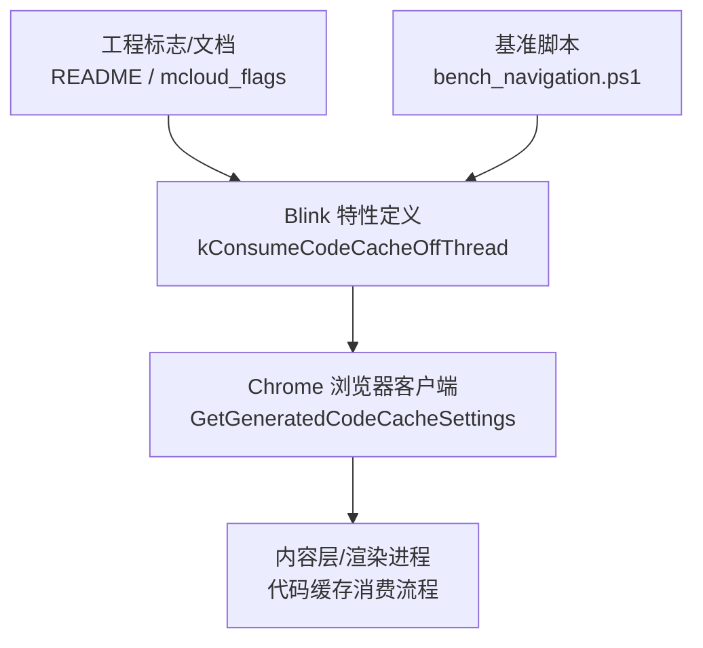
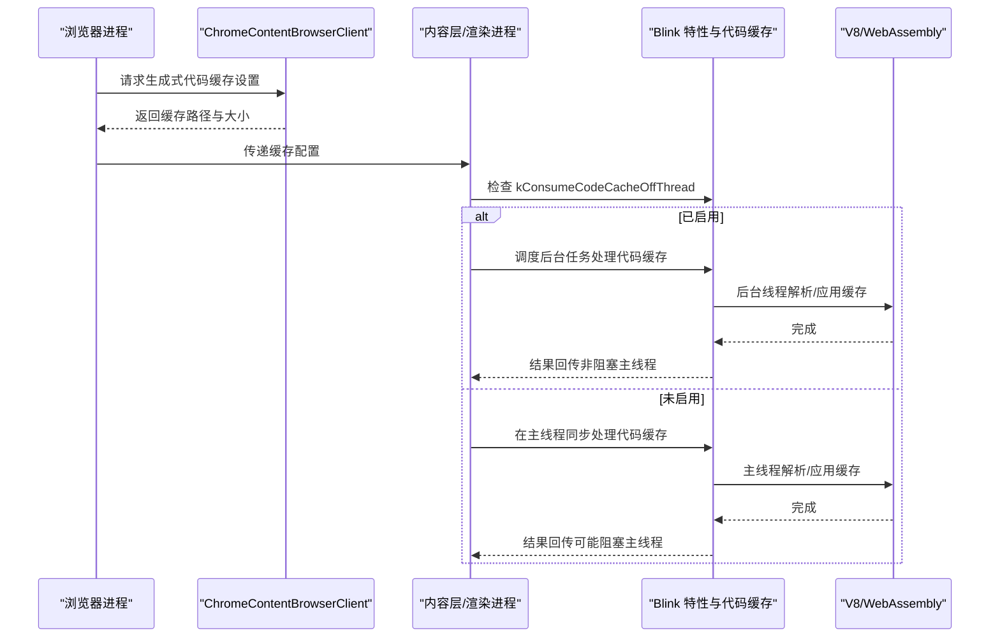
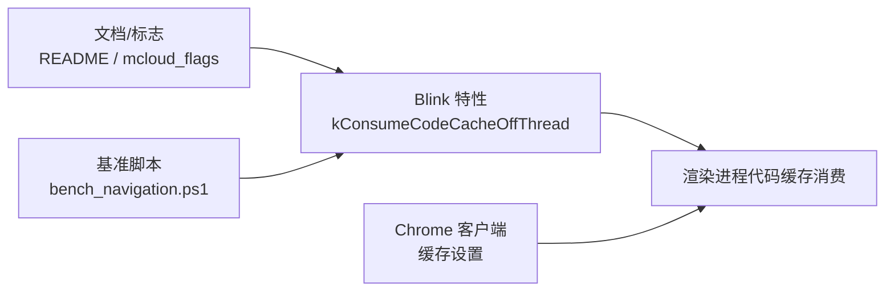

# 代码缓存离线程消费

<cite>
**本文引用的文件**
- [features.cc](file://src/third_party/blink/common/features.cc)
- [chrome_content_browser_client.cc](file://src/chrome/browser/chrome_content_browser_client.cc)
- [README.md](file://README.md)
- [mcloud_flags.txt](file://mcloud_flags.txt)
- [bench_navigation.ps1](file://benchmark/bench_navigation.ps1)
</cite>

## 目录
1. [简介](#简介)
2. [项目结构](#项目结构)
3. [核心组件](#核心组件)
4. [架构总览](#架构总览)
5. [详细组件分析](#详细组件分析)
6. [依赖关系分析](#依赖关系分析)
7. [性能考量](#性能考量)
8. [故障排查指南](#故障排查指南)
9. [结论](#结论)
10. [附录](#附录)

## 简介
本文件围绕“代码缓存离线程消费”（ConsumeCodeCacheOffThread）机制，系统阐述其在 Chromium/Blink 中的启用方式、主线程与后台线程的协作方式、对 JavaScript 与 WebAssembly 代码缓存的影响，以及如何通过该机制降低主线程阻塞、提升页面加载性能。文档同时给出可操作的基准测试方法与常见问题排查建议。

## 项目结构
与“代码缓存离线程消费”直接相关的实现与配置集中在以下位置：
- Blink 特性开关：在 Blink 公共特性定义中声明并默认启用“代码缓存离线程消费”。
- Chrome 浏览器客户端：提供生成式代码缓存的配置（路径、大小等），供渲染进程使用。
- 工程标志与文档：仓库根级 README 与 mcloud_flags 中包含对该特性的说明与启用方式；基准脚本包含对该特性的开关引用。

**图示来源**
- [features.cc:422-423](file://src/third_party/blink/common/features.cc#L422-L423)
- [chrome_content_browser_client.cc:3849-3868](file://src/chrome/browser/chrome_content_browser_client.cc#L3849-L3868)
- [README.md:103](file://README.md#L103)
- [mcloud_flags.txt:72](file://mcloud_flags.txt#L72)
- [bench_navigation.ps1:33](file://benchmark/bench_navigation.ps1#L33)

**章节来源**
- [features.cc:422-423](file://src/third_party/blink/common/features.cc#L422-L423)
- [chrome_content_browser_client.cc:3849-3868](file://src/chrome/browser/chrome_content_browser_client.cc#L3849-L3868)
- [README.md:103](file://README.md#L103)
- [mcloud_flags.txt:72](file://mcloud_flags.txt#L72)
- [bench_navigation.ps1:33](file://benchmark/bench_navigation.ps1#L33)

## 核心组件
- Blink 特性开关 kConsumeCodeCacheOffThread：控制是否允许在后台线程消费代码缓存，默认启用。
- ChromeContentBrowserClient::GetGeneratedCodeCacheSettings：为生成式代码缓存提供存储路径与容量策略，影响 JS/WASM 代码缓存的落盘与读取。
- 工程标志与文档：README 列出该特性名称；mcloud_flags 提供运行时启用方式；基准脚本用于评估开启/关闭时的性能差异。

**章节来源**
- [features.cc:422-423](file://src/third_party/blink/common/features.cc#L422-L423)
- [chrome_content_browser_client.cc:3849-3868](file://src/chrome/browser/chrome_content_browser_client.cc#L3849-L3868)
- [README.md:103](file://README.md#L103)
- [mcloud_flags.txt:72](file://mcloud_flags.txt#L72)
- [bench_navigation.ps1:33](file://benchmark/bench_navigation.ps1#L33)

## 架构总览
下图展示了从浏览器进程到渲染进程的代码缓存相关职责划分与数据流向。浏览器端负责配置缓存位置与大小；渲染端根据 Blink 特性决定是否将代码缓存的解码/应用工作迁移至后台线程执行，从而减少主线程阻塞。

**图示来源**
- [chrome_content_browser_client.cc:3849-3868](file://src/chrome/browser/chrome_content_browser_client.cc#L3849-L3868)
- [features.cc:422-423](file://src/third_party/blink/common/features.cc#L422-L423)

## 详细组件分析

### Blink 特性：kConsumeCodeCacheOffThread
- 作用：控制是否在后台线程消费代码缓存。默认启用，意味着在大多数情况下，JS/WASM 代码缓存的解码与应用可以不在主线程进行，从而降低首屏卡顿风险。
- 关联特性：背景资源获取与解码启动等特性共同构成整体异步化策略的一部分。

**章节来源**
- [features.cc:170-179](file://src/third_party/blink/common/features.cc#L170-L179)
- [features.cc:422-423](file://src/third_party/blink/common/features.cc#L422-L423)

### Chrome 浏览器客户端：生成式代码缓存设置
- 职责：提供生成式代码缓存的存储路径与容量策略。路径取自用户缓存目录，容量可由本地状态偏好项决定；若未显式设置则采用默认启发式大小。
- 影响范围：该设置会影响 JS 与 WASM 代码缓存的持久化位置与空间上限，是后端存储的基础设施。

**章节来源**
- [chrome_content_browser_client.cc:3849-3868](file://src/chrome/browser/chrome_content_browser_client.cc#L3849-L3868)

### 工程标志与启用方式
- README 列出特性名“ConsumeCodeCacheOffThread”，便于定位与理解。
- mcloud_flags 提供运行时启用方式（--enable-features=...）。
- 基准脚本 bench_navigation.ps1 将该特性纳入导航性能基准的开关集合，便于对比评估。

**章节来源**
- [README.md:103](file://README.md#L103)
- [mcloud_flags.txt:72](file://mcloud_flags.txt#L72)
- [bench_navigation.ps1:33](file://benchmark/bench_navigation.ps1#L33)

### 主线程与后台线程的数据同步机制（概念性说明）
- 当 kConsumeCodeCacheOffThread 启用时，代码缓存的解码与应用通常由后台线程完成，主线程仅做轻量协调与结果接收，避免长耗时 I/O 或 CPU 密集操作阻塞 UI 事件循环。
- 典型同步点包括：任务调度、结果回调、错误传播与资源释放。具体实现细节位于 Blink/Content 内部模块，此处不展开源码。

[本节为概念性说明，不直接分析具体文件]

### 代码缓存的存储格式、压缩策略与版本管理（概念性说明）
- 存储格式：由内容层/渲染进程与磁盘缓存子系统协同管理，具体二进制布局与元数据由底层实现决定。
- 压缩策略：可通过构建参数或运行期特性调整（例如 V8 区域压缩等），以平衡 CPU 与磁盘占用。
- 版本管理：缓存条目通常携带版本/哈希信息，用于失效与升级；具体策略由内容层与 V8/WASM 模块约定。

[本节为概念性说明，不直接分析具体文件]

## 依赖关系分析
- 特性开关依赖：Blink 特性列表定义了 kConsumeCodeCacheOffThread 的默认值与开关行为。
- 浏览器配置依赖：ChromeContentBrowserClient 提供的缓存路径与大小会直接影响渲染端的缓存读写。
- 基准与文档依赖：README 与 mcloud_flags 提供特性可见性与启用方法；基准脚本用于量化收益。

**图示来源**
- [features.cc:422-423](file://src/third_party/blink/common/features.cc#L422-L423)
- [chrome_content_browser_client.cc:3849-3868](file://src/chrome/browser/chrome_content_browser_client.cc#L3849-L3868)
- [README.md:103](file://README.md#L103)
- [mcloud_flags.txt:72](file://mcloud_flags.txt#L72)
- [bench_navigation.ps1:33](file://benchmark/bench_navigation.ps1#L33)

**章节来源**
- [features.cc:422-423](file://src/third_party/blink/common/features.cc#L422-L423)
- [chrome_content_browser_client.cc:3849-3868](file://src/chrome/browser/chrome_content_browser_client.cc#L3849-L3868)
- [README.md:103](file://README.md#L103)
- [mcloud_flags.txt:72](file://mcloud_flags.txt#L72)
- [bench_navigation.ps1:33](file://benchmark/bench_navigation.ps1#L33)

## 性能考量
- 主线程减负：启用 kConsumeCodeCacheOffThread 可将代码缓存的解码与应用移至后台线程，显著降低主线程阻塞时间，改善首帧与交互响应。
- 磁盘与内存权衡：增大缓存容量可减少重复解码，但会增加磁盘占用与可能的 I/O 竞争；需结合设备能力调优。
- 构建与运行期优化：可配合 V8 区域压缩等特性进一步降低内存与 CPU 开销。
- 基准方法：使用 bench_navigation.ps1 对开启/关闭该特性进行对比测量，关注关键指标如首次绘制时间、主线程阻塞时长、CPU 峰值等。

[本节提供通用指导，不直接分析具体文件]

## 故障排查指南
- 确认特性是否生效：检查 README 中的特性名与 mcloud_flags 中的 --enable-features 参数是否正确传入。
- 验证缓存路径与容量：通过 ChromeContentBrowserClient 的缓存设置逻辑确认路径与大小是否符合预期。
- 性能回归排查：使用基准脚本对比不同开关组合下的表现，定位异常波动。
- 常见症状：
  - 首屏卡顿：检查是否误关闭了 kConsumeCodeCacheOffThread。
  - 缓存命中率低：检查缓存容量与清理策略，必要时调大容量或延长保留周期。
  - 磁盘增长过快：评估压缩策略与清理策略，限制最大容量。

**章节来源**
- [README.md:103](file://README.md#L103)
- [mcloud_flags.txt:72](file://mcloud_flags.txt#L72)
- [chrome_content_browser_client.cc:3849-3868](file://src/chrome/browser/chrome_content_browser_client.cc#L3849-L3868)
- [bench_navigation.ps1:33](file://benchmark/bench_navigation.ps1#L33)

## 结论
“代码缓存离线程消费”通过在后台线程处理 JS/WASM 代码缓存的解码与应用，有效降低主线程阻塞，提升页面加载与交互性能。配合合理的缓存容量、压缩策略与版本管理，可在多类设备上获得稳定收益。建议在生产环境默认启用该特性，并通过基准测试持续验证效果。

[本节为总结性内容，不直接分析具体文件]

## 附录
- 快速启用：在启动参数中添加 --enable-features=ConsumeCodeCacheOffThread。
- 基准参考：使用 benchmark/bench_navigation.ps1 进行导航性能对比。
- 配置要点：确保生成的代码缓存路径存在且具备足够空间，合理设置容量以避免频繁重建。

[本节为补充信息，不直接分析具体文件]