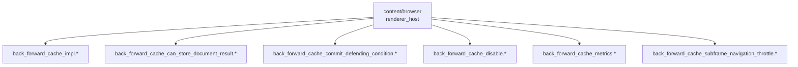
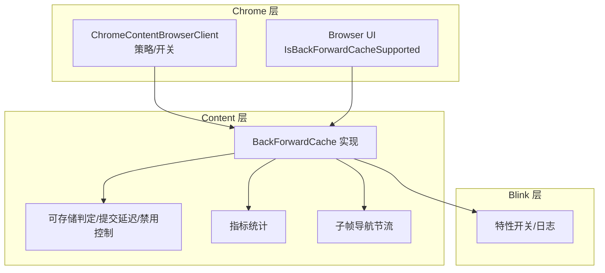
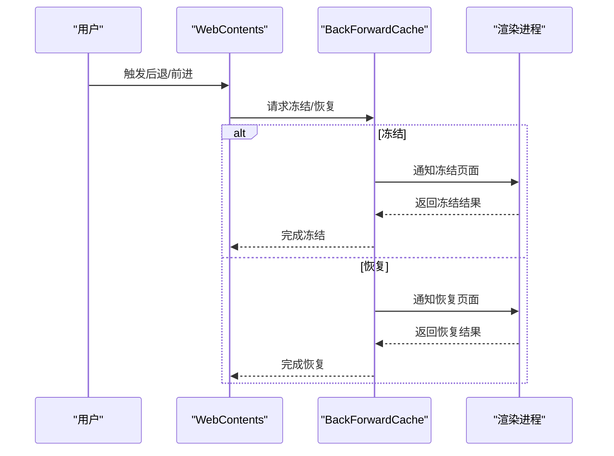
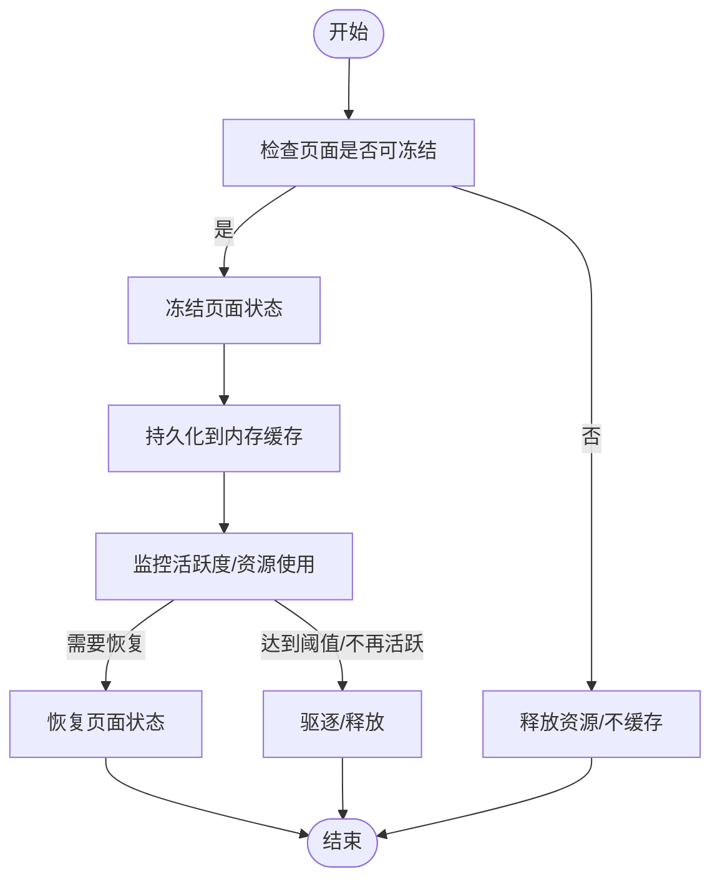
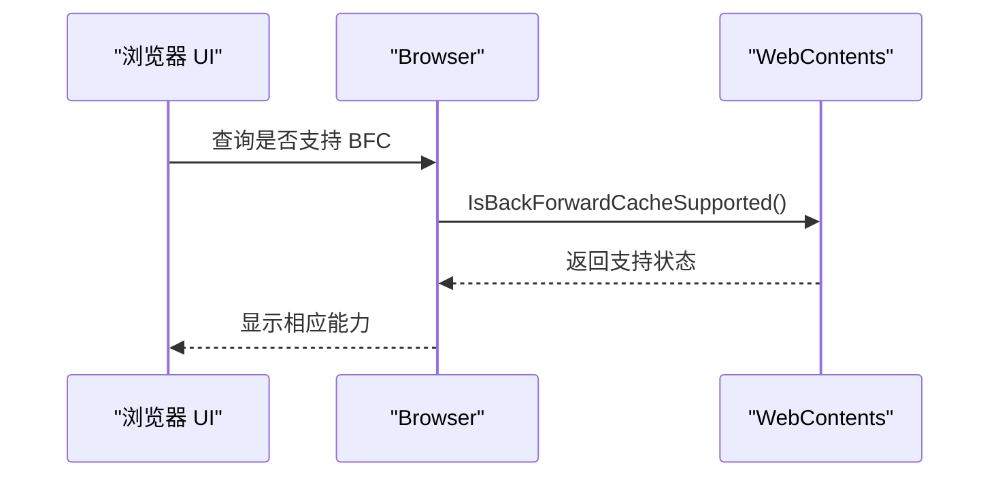

# 前进后退缓存

<cite>
**本文引用的文件**
- [src/content/browser/BUILD.gn](file://src/content/browser/BUILD.gn)
- [src/chrome/browser/chrome_content_browser_client.cc](file://src/chrome/browser/chrome_content_browser_client.cc)
- [src/chrome/browser/ui/browser.cc](file://src/chrome/browser/ui/browser.cc)
- [src/third_party/blink/common/features.cc](file://src/third_party/blink/common/features.cc)
</cite>

## 目录
1. [简介](#简介)
2. [项目结构](#项目结构)
3. [核心组件](#核心组件)
4. [架构总览](#架构总览)
5. [详细组件分析](#详细组件分析)
6. [依赖关系分析](#依赖关系分析)
7. [性能考量](#性能考量)
8. [故障排查指南](#故障排查指南)
9. [结论](#结论)
10. [附录](#附录)

## 简介
本文件围绕前进后退缓存（BackForwardCache，简称 BFC）在 Thorium/Chromium 工程中的实现与集成进行系统化说明。重点覆盖：
- 页面状态保存与恢复机制：DOM 状态、JavaScript 执行上下文、渲染器状态的冻结与解冻。
- 内存管理：页面冻结策略、资源释放时机、与标签页管理的协同。
- 与浏览器策略、开关及 Blink 特性的协调工作。
- 调试与性能监控方法，帮助开发者理解并优化前进/后退体验。

## 项目结构
BFC 的核心构建项集中在 content/browser 的 renderer_host 子模块中，包含以下关键文件（由构建脚本声明）：
- back_forward_cache_impl.*：实现主体逻辑
- back_forward_cache_can_store_document_result.*：判定是否可缓存
- back_forward_cache_commit_deferring_condition.*：提交延迟条件
- back_forward_cache_disable.*：禁用控制
- back_forward_cache_metrics.*：指标统计
- back_forward_cache_subframe_navigation_throttle.*：子帧导航节流

这些文件通过 BUILD.gn 被纳入编译，表明 BFC 是 content 层的重要能力，并在 Chrome 层通过策略和特性开关进行启用/禁用与行为调优。

图表来源
- [src/content/browser/BUILD.gn:1771-1782](file://src/content/browser/BUILD.gn#L1771-L1782)

章节来源
- [src/content/browser/BUILD.gn:1771-1782](file://src/content/browser/BUILD.gn#L1771-L1782)

## 核心组件
- 实现主体（Impl）：负责页面生命周期管理、冻结/解冻流程、与渲染进程的通信、以及与其他子系统（如导航控制器、资源协调器）的协作。
- 可存储判定：基于页面类型、网络策略、扩展、插件等规则判断是否允许进入 BFC。
- 提交延迟条件：在特定条件下推迟页面提交的决策，确保一致性。
- 禁用控制：提供运行时或策略层面的关闭能力。
- 指标统计：记录命中率、冻结时长、失败原因等，用于分析与优化。
- 子帧导航节流：对子帧导航进行节流，避免频繁切换影响稳定性。

章节来源
- [src/content/browser/BUILD.gn:1771-1782](file://src/content/browser/BUILD.gn#L1771-L1782)

## 架构总览
BFC 在 Chromium 中的职责边界如下：
- Chrome 层：通过策略与命令行开关控制是否启用 BFC，并对某些场景（如 Cache-Control: no-store）做特殊处理；同时暴露“是否支持”的能力查询接口。
- Content 层：实现 BFC 的具体逻辑，包括冻结/解冻、与渲染进程交互、指标上报等。
- Blink 层：提供特性开关与日志选项，影响 BFC 的行为与可观测性。

图表来源
- [src/chrome/browser/chrome_content_browser_client.cc:2872-2875](file://src/chrome/browser/chrome_content_browser_client.cc#L2872-L2875)
- [src/chrome/browser/chrome_content_browser_client.cc:8439-8458](file://src/chrome/browser/chrome_content_browser_client.cc#L8439-L8458)
- [src/chrome/browser/ui/browser.cc:1972-1972](file://src/chrome/browser/ui/browser.cc#L1972-L1972)
- [src/third_party/blink/common/features.cc:159-159](file://src/third_party/blink/common/features.cc#L159-L159)
- [src/third_party/blink/common/features.cc:1528-1528](file://src/third_party/blink/common/features.cc#L1528-L1528)

## 详细组件分析

### 页面状态保存与恢复机制（冻结/解冻）
- 冻结阶段：当页面从前台切换到后台且满足可缓存条件时，BFC 将冻结页面。冻结过程会暂停 JavaScript 执行、挂起定时器、冻结 DOM 树状态，并将渲染器进程中的页面状态序列化到内存中，以便后续快速恢复。
- 恢复阶段：用户触发前进/后退回到该页面时，BFC 将解冻页面，恢复 JavaScript 执行上下文、DOM 状态与渲染器状态，尽量保持用户感知的无缝体验。
- 资源释放时机：对于无法冻结或不再需要的页面，BFC 会在合适时机释放相关资源，避免内存占用过高。

图表来源
- [src/content/browser/BUILD.gn:1771-1782](file://src/content/browser/BUILD.gn#L1771-L1782)

章节来源
- [src/content/browser/BUILD.gn:1771-1782](file://src/content/browser/BUILD.gn#L1771-L1782)

### 内存管理机制（冻结/解冻策略与资源释放）
- 冻结策略：依据页面类型、网络响应头（如 Cache-Control）、扩展与插件使用情况、安全策略等综合判定是否可冻结。
- 资源释放：对不可冻结或长期不活跃的页面，及时释放其占用的内存与句柄，降低整体内存压力。
- 与标签页管理协同：BFC 与标签页生命周期联动，当标签页关闭或不再需要时，清理对应缓存条目。

图表来源
- [src/content/browser/BUILD.gn:1771-1782](file://src/content/browser/BUILD.gn#L1771-L1782)

章节来源
- [src/content/browser/BUILD.gn:1771-1782](file://src/content/browser/BUILD.gn#L1771-L1782)

### 与标签页管理的集成
- 能力查询：UI 层可通过接口查询当前 WebContents 是否支持 BFC，以决定是否展示相关功能或提示。
- 策略联动：Chrome 层根据策略决定是否启用 BFC，并在必要时通过命令行开关禁用。

图表来源
- [src/chrome/browser/ui/browser.cc:1972-1972](file://src/chrome/browser/ui/browser.cc#L1972-L1972)

章节来源
- [src/chrome/browser/ui/browser.cc:1972-1972](file://src/chrome/browser/ui/browser.cc#L1972-L1972)

### 与其他缓存系统的协调
- 网络缓存：BFC 与 HTTP 缓存、磁盘缓存等相互独立但互补。BFC 关注页面状态，网络缓存关注资源内容。两者共同提升加载与回退体验。
- 策略与开关：Chrome 层对 BFC 的策略与特性开关进行统一管理，确保与全局缓存策略一致。

章节来源
- [src/chrome/browser/chrome_content_browser_client.cc:2872-2875](file://src/chrome/browser/chrome_content_browser_client.cc#L2872-L2875)
- [src/chrome/browser/chrome_content_browser_client.cc:8439-8458](file://src/chrome/browser/chrome_content_browser_client.cc#L8439-L8458)

## 依赖关系分析
- Chrome 层依赖：
  - 策略读取与命令行开关：决定是否启用 BFC，或对特定页面（如 Cache-Control: no-store）做特殊处理。
  - UI 能力查询：为前端展示提供支撑。
- Content 层依赖：
  - 构建项：BFC 各子模块通过 BUILD.gn 组织，形成清晰的职责划分。
- Blink 层依赖：
  - 特性开关：控制 BFC 的特定行为（如 JavaScript 执行时的 DWC 行为）。
  - 日志选项：便于定位问题与收集诊断信息。

图表来源
- [src/chrome/browser/chrome_content_browser_client.cc:2872-2875](file://src/chrome/browser/chrome_content_browser_client.cc#L2872-L2875)
- [src/chrome/browser/chrome_content_browser_client.cc:8439-8458](file://src/chrome/browser/chrome_content_browser_client.cc#L8439-L8458)
- [src/third_party/blink/common/features.cc:159-159](file://src/third_party/blink/common/features.cc#L159-L159)
- [src/third_party/blink/common/features.cc:1528-1528](file://src/third_party/blink/common/features.cc#L1528-L1528)

章节来源
- [src/chrome/browser/chrome_content_browser_client.cc:2872-2875](file://src/chrome/browser/chrome_content_browser_client.cc#L2872-L2875)
- [src/chrome/browser/chrome_content_browser_client.cc:8439-8458](file://src/chrome/browser/chrome_content_browser_client.cc#L8439-L8458)
- [src/third_party/blink/common/features.cc:159-159](file://src/third_party/blink/common/features.cc#L159-L159)
- [src/third_party/blink/common/features.cc:1528-1528](file://src/third_party/blink/common/features.cc#L1528-L1528)

## 性能考量
- 冻结/解冻开销：冻结过程需序列化页面状态，恢复时需重建执行上下文与渲染状态。应评估页面复杂度与资源规模，避免过度冻结导致恢复延迟。
- 内存占用：BFC 缓存常驻内存，需设置合理的上限与驱逐策略，防止长期运行后内存膨胀。
- 指标驱动优化：利用 BFC 指标（命中率、失败原因、冻结时长）持续优化策略与阈值。
- 特性开关调优：结合 Blink 特性开关与 Chrome 策略，针对不同场景调整行为，平衡性能与兼容性。

[本节为通用指导，无需具体文件引用]

## 故障排查指南
- 确认策略与开关：
  - 检查 Chrome 层策略是否启用了 BFC，或在特定场景下被禁用。
  - 查看命令行开关是否覆盖了默认行为。
- 观察能力支持：
  - 通过 UI 层的接口查询当前页面是否支持 BFC，排除不支持的场景。
- 利用特性与日志：
  - 启用 Blink 的特性开关与日志选项，辅助定位冻结/恢复过程中的异常。
- 指标分析：
  - 关注 BFC 指标，识别高频失败原因与性能瓶颈。

章节来源
- [src/chrome/browser/chrome_content_browser_client.cc:2872-2875](file://src/chrome/browser/chrome_content_browser_client.cc#L2872-L2875)
- [src/chrome/browser/chrome_content_browser_client.cc:8439-8458](file://src/chrome/browser/chrome_content_browser_client.cc#L8439-L8458)
- [src/third_party/blink/common/features.cc:159-159](file://src/third_party/blink/common/features.cc#L159-L159)
- [src/third_party/blink/common/features.cc:1528-1528](file://src/third_party/blink/common/features.cc#L1528-L1528)

## 结论
BFC 在 Thorium/Chromium 中通过 content 层实现与 chrome 层策略、blink 特性开关的协同，提供了高效的页面状态保存与恢复能力。合理配置策略与开关、持续监控指标并结合调试工具，可以显著提升前进/后退体验与整体性能。

[本节为总结性内容，无需具体文件引用]

## 附录
- 关键构建项路径参考：
  - [src/content/browser/BUILD.gn:1771-1782](file://src/content/browser/BUILD.gn#L1771-L1782)
- 策略与开关参考：
  - [src/chrome/browser/chrome_content_browser_client.cc:2872-2875](file://src/chrome/browser/chrome_content_browser_client.cc#L2872-L2875)
  - [src/chrome/browser/chrome_content_browser_client.cc:8439-8458](file://src/chrome/browser/chrome_content_browser_client.cc#L8439-L8458)
- 能力查询参考：
  - [src/chrome/browser/ui/browser.cc:1972-1972](file://src/chrome/browser/ui/browser.cc#L1972-L1972)
- Blink 特性与日志参考：
  - [src/third_party/blink/common/features.cc:159-159](file://src/third_party/blink/common/features.cc#L159-L159)
  - [src/third_party/blink/common/features.cc:1528-1528](file://src/third_party/blink/common/features.cc#L1528-L1528)