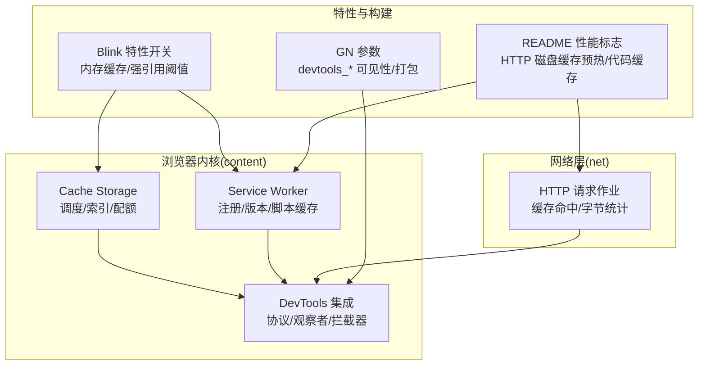
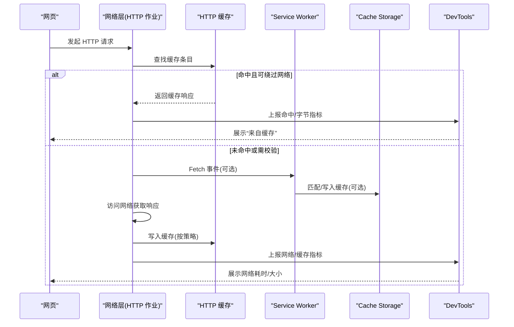
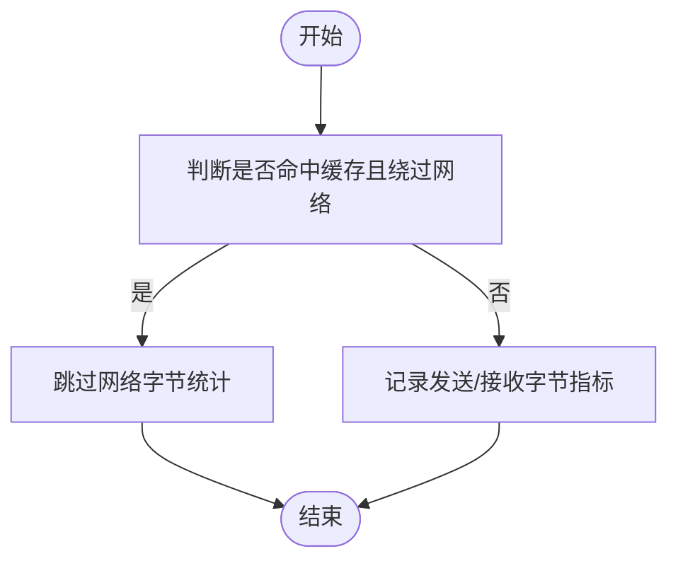
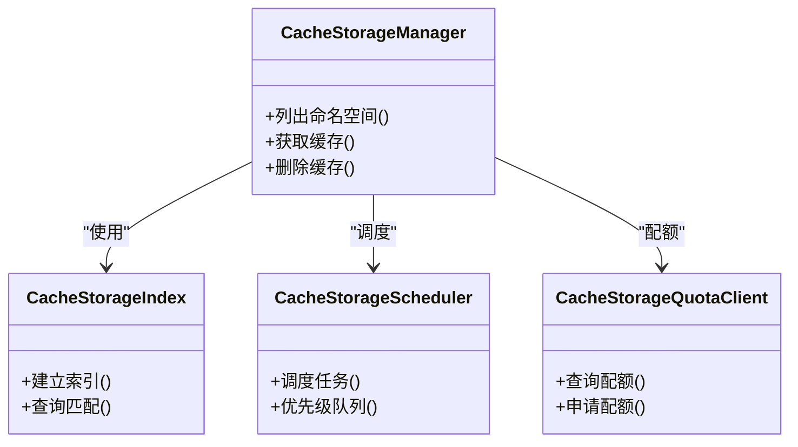
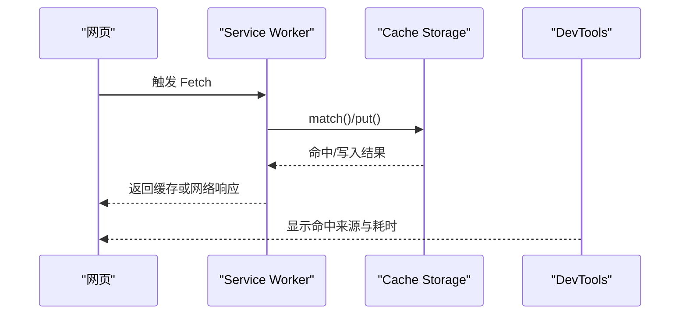
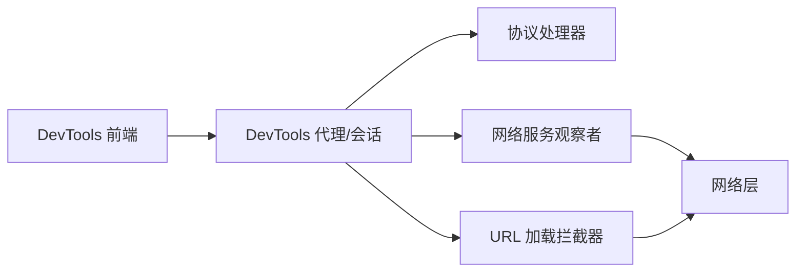
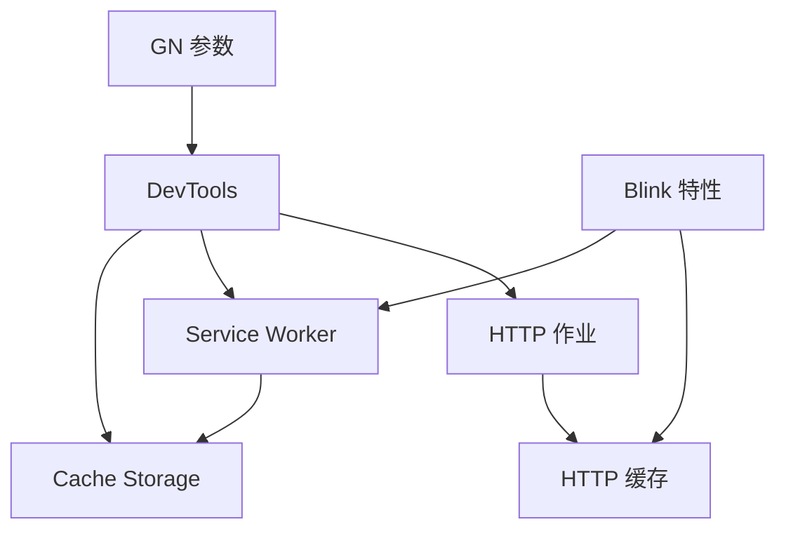

# 缓存监控工具

<cite>
**本文引用的文件**
- [src/content/browser/BUILD.gn](file://src/content/browser/BUILD.gn)
- [src/net/url_request/url_request_http_job.cc](file://src/net/url_request/url_request_http_job.cc)
- [src/third_party/blink/common/features.cc](file://src/third_party/blink/common/features.cc)
- [README.md](file://README.md)
- [infra/gn_args.list](file://infra/gn_args.list)
- [infra/win_gn_args.list](file://infra/win_gn_args.list)
- [other/Mac/mac_args.list](file://other/Mac/mac_args.list)
- [docs/CMDLINE_FLAGS_LIST.md](file://docs/CMDLINE_FLAGS_LIST.md)
- [benchmark/bench_memory.ps1](file://benchmark/bench_memory.ps1)
</cite>

## 目录
1. [简介](#简介)
2. [项目结构](#项目结构)
3. [核心组件](#核心组件)
4. [架构总览](#架构总览)
5. [详细组件分析](#详细组件分析)
6. [依赖关系分析](#依赖关系分析)
7. [性能考量](#性能考量)
8. [故障排查指南](#故障排查指南)
9. [结论](#结论)
10. [附录](#附录)

## 简介
本文件面向开发者与高级用户，系统介绍 Thorium（基于 Chromium）中的缓存监控与调试能力。内容涵盖：
- 内置的缓存性能监控界面与调试工具使用方法
- 缓存命中率统计、存储空间使用与性能指标分析
- 通过开发者工具查看与管理各类缓存（HTTP 缓存、代码缓存、Service Worker 缓存等）
- 缓存清理与优化脚本的使用指南
- 常见性能问题的诊断方法

本指南以仓库源码为依据，结合构建配置与基准脚本，提供可操作的实践建议。

## 项目结构
本项目在 content 层实现了 Cache Storage、Service Worker 以及 DevTools 集成；在网络层对 HTTP 请求命中缓存的行为进行度量；在构建配置中启用了 DevTools 前端可见性与资源打包策略；在 README 中汇总了与缓存相关的性能标志。

图表来源
- [src/content/browser/BUILD.gn:774-794](file://src/content/browser/BUILD.gn#L774-L794)
- [src/content/browser/BUILD.gn:2120-2218](file://src/content/browser/BUILD.gn#L2120-L2218)
- [src/content/browser/BUILD.gn:855-914](file://src/content/browser/BUILD.gn#L855-L914)
- [src/net/url_request/url_request_http_job.cc:1975-2000](file://src/net/url_request/url_request_http_job.cc#L1975-L2000)
- [src/third_party/blink/common/features.cc:1765-1783](file://src/third_party/blink/common/features.cc#L1765-L1783)
- [infra/gn_args.list:1282-1308](file://infra/gn_args.list#L1282-L1308)
- [README.md:98-117](file://README.md#L98-L117)

章节来源
- [src/content/browser/BUILD.gn:774-794](file://src/content/browser/BUILD.gn#L774-L794)
- [src/content/browser/BUILD.gn:2120-2218](file://src/content/browser/BUILD.gn#L2120-L2218)
- [src/content/browser/BUILD.gn:855-914](file://src/content/browser/BUILD.gn#L855-L914)
- [src/net/url_request/url_request_http_job.cc:1975-2000](file://src/net/url_request/url_request_http_job.cc#L1975-L2000)
- [src/third_party/blink/common/features.cc:1765-1783](file://src/third_party/blink/common/features.cc#L1765-L1783)
- [infra/gn_args.list:1282-1308](file://infra/gn_args.list#L1282-L1308)
- [README.md:98-117](file://README.md#L98-L117)

## 核心组件
- HTTP 缓存与指标
  - HTTP 请求在命中或绕过缓存时记录发送/接收字节等指标，用于评估缓存命中率与网络开销。
  - 关键路径：URL 请求作业在响应阶段判断是否完全绕过网络并上报指标。

- Cache Storage（应用级缓存）
  - 包含调度器、索引、管理器、配额客户端、直写入口等，支撑 Web API 级别的缓存操作与统计。

- Service Worker 缓存
  - 覆盖注册、版本管理、脚本加载、Fetch 分发、内部 UI 与指标收集，便于从 DevTools 观察缓存命中与更新流程。

- DevTools 集成
  - 提供 DevTools 代理、会话、协议处理器、网络服务观察者、URL 加载拦截器等，使开发者可在“网络”“应用”面板中查看缓存状态与行为。

- 特性开关与构建配置
  - Blink 特性控制内存缓存强引用阈值等；GN 参数控制 DevTools 前端可见性与打包方式；README 汇总了 HTTP 磁盘缓存预热、代码缓存等性能标志。

章节来源
- [src/net/url_request/url_request_http_job.cc:1975-2000](file://src/net/url_request/url_request_http_job.cc#L1975-L2000)
- [src/content/browser/BUILD.gn:774-794](file://src/content/browser/BUILD.gn#L774-L794)
- [src/content/browser/BUILD.gn:2120-2218](file://src/content/browser/BUILD.gn#L2120-L2218)
- [src/content/browser/BUILD.gn:855-914](file://src/content/browser/BUILD.gn#L855-L914)
- [src/third_party/blink/common/features.cc:1765-1783](file://src/third_party/blink/common/features.cc#L1765-L1783)
- [infra/gn_args.list:1282-1308](file://infra/gn_args.list#L1282-L1308)
- [README.md:98-117](file://README.md#L98-L117)

## 架构总览
下图展示了从页面发起网络请求到缓存命中、再到 DevTools 观测与指标上报的整体流程。

图表来源
- [src/net/url_request/url_request_http_job.cc:1975-2000](file://src/net/url_request/url_request_http_job.cc#L1975-L2000)
- [src/content/browser/BUILD.gn:2120-2218](file://src/content/browser/BUILD.gn#L2120-L2218)
- [src/content/browser/BUILD.gn:774-794](file://src/content/browser/BUILD.gn#L774-L794)
- [src/content/browser/BUILD.gn:855-914](file://src/content/browser/BUILD.gn#L855-L914)

## 详细组件分析

### HTTP 缓存命中率与指标
- 命中判定与指标上报
  - 当响应被缓存命中且未触发网络访问时，会跳过网络字节计数，避免重复统计；否则记录发送/接收字节等指标，用于衡量缓存命中率与网络负载。
- 使用建议
  - 在 DevTools “网络”面板中关注“来自缓存”的比例与响应大小；结合指标分布定位低命中率场景。

图表来源
- [src/net/url_request/url_request_http_job.cc:1975-2000](file://src/net/url_request/url_request_http_job.cc#L1975-L2000)

章节来源
- [src/net/url_request/url_request_http_job.cc:1975-2000](file://src/net/url_request/url_request_http_job.cc#L1975-L2000)

### Cache Storage（应用级缓存）
- 能力概览
  - 提供缓存命名空间、键值映射、调度器、配额管理与直写接口，支持页面通过 Web API 读写缓存。
- 监控要点
  - 在 DevTools “应用”面板查看缓存集合、条目数量与占用空间；关注配额使用与淘汰策略。

图表来源
- [src/content/browser/BUILD.gn:774-794](file://src/content/browser/BUILD.gn#L774-L794)

章节来源
- [src/content/browser/BUILD.gn:774-794](file://src/content/browser/BUILD.gn#L774-L794)

### Service Worker 缓存与 Fetch 拦截
- 能力概览
  - 负责注册、版本管理、脚本加载、Fetch 分发、内部 UI 与指标收集；可与 Cache Storage 配合实现离线与预取。
- 监控要点
  - 在 DevTools “应用”面板查看已安装版本、脚本缓存与缓存命中；在“网络”面板观察 Fetch 拦截与缓存命中情况。

图表来源
- [src/content/browser/BUILD.gn:2120-2218](file://src/content/browser/BUILD.gn#L2120-L2218)
- [src/content/browser/BUILD.gn:774-794](file://src/content/browser/BUILD.gn#L774-L794)

章节来源
- [src/content/browser/BUILD.gn:2120-2218](file://src/content/browser/BUILD.gn#L2120-L2218)
- [src/content/browser/BUILD.gn:774-794](file://src/content/browser/BUILD.gn#L774-L794)

### DevTools 集成与可视化
- 能力概览
  - 提供 DevTools 代理、会话、协议处理器、网络服务观察者、URL 加载拦截器等，使“网络”“应用”面板能够展示缓存命中、请求详情与存储用量。
- 使用建议
  - 开启 DevTools 后，在“网络”面板筛选“来自缓存”的请求；在“应用”面板检查 Cache Storage 与 Service Worker 缓存使用情况。

图表来源
- [src/content/browser/BUILD.gn:855-914](file://src/content/browser/BUILD.gn#L855-L914)

章节来源
- [src/content/browser/BUILD.gn:855-914](file://src/content/browser/BUILD.gn#L855-L914)

### 特性开关与构建配置
- 内存缓存强引用阈值
  - 通过 Blink 特性参数控制内存缓存强引用的总大小与单资源大小阈值，影响缓存驻留与回收策略。
- DevTools 构建参数
  - GN 参数控制 DevTools 前端组件可见性、快速打包与资源位置，确保开发期可访问完整的调试界面。
- 性能标志
  - README 汇总了 HTTP 磁盘缓存预热、代码缓存离线程消费、内联脚本缓存等标志，有助于提升首屏与后续加载性能。

章节来源
- [src/third_party/blink/common/features.cc:1765-1783](file://src/third_party/blink/common/features.cc#L1765-L1783)
- [infra/gn_args.list:1282-1308](file://infra/gn_args.list#L1282-L1308)
- [infra/win_gn_args.list:1242-1272](file://infra/win_gn_args.list#L1242-L1272)
- [other/Mac/mac_args.list:1180-1212](file://other/Mac/mac_args.list#L1180-L1212)
- [README.md:98-117](file://README.md#L98-L117)

## 依赖关系分析
- 组件耦合
  - HTTP 作业依赖底层缓存子系统；Service Worker 与 Cache Storage 协同工作；DevTools 通过观察者与拦截器接入网络与缓存链路。
- 外部依赖
  - 构建期通过 GN 参数启用 DevTools 前端功能；运行时通过 Blink 特性开关调整缓存行为。

图表来源
- [src/net/url_request/url_request_http_job.cc:1975-2000](file://src/net/url_request/url_request_http_job.cc#L1975-L2000)
- [src/content/browser/BUILD.gn:774-794](file://src/content/browser/BUILD.gn#L774-L794)
- [src/content/browser/BUILD.gn:2120-2218](file://src/content/browser/BUILD.gn#L2120-L2218)
- [src/content/browser/BUILD.gn:855-914](file://src/content/browser/BUILD.gn#L855-L914)
- [src/third_party/blink/common/features.cc:1765-1783](file://src/third_party/blink/common/features.cc#L1765-L1783)
- [infra/gn_args.list:1282-1308](file://infra/gn_args.list#L1282-L1308)

章节来源
- [src/net/url_request/url_request_http_job.cc:1975-2000](file://src/net/url_request/url_request_http_job.cc#L1975-L2000)
- [src/content/browser/BUILD.gn:774-794](file://src/content/browser/BUILD.gn#L774-L794)
- [src/content/browser/BUILD.gn:2120-2218](file://src/content/browser/BUILD.gn#L2120-L2218)
- [src/content/browser/BUILD.gN:855-914](file://src/content/browser/BUILD.gn#L855-L914)
- [src/third_party/blink/common/features.cc:1765-1783](file://src/third_party/blink/common/features.cc#L1765-L1783)
- [infra/gn_args.list:1282-1308](file://infra/gn_args.list#L1282-L1308)

## 性能考量
- 缓存命中率优化
  - 合理设置 HTTP 响应头与 SW 策略，提高命中比例；利用 DevTools “网络”面板分析未命中原因。
- 内存缓存阈值调优
  - 根据站点特征调整内存缓存强引用阈值，平衡驻留与回收，避免频繁重建导致性能抖动。
- 预热与离线程处理
  - 启用 HTTP 磁盘缓存预热与代码缓存离线程消费，降低首屏与冷启动延迟。
- 存储容量与配额
  - 监控 Cache Storage 与 SW 缓存占用，避免超出配额导致写入失败；定期清理过期条目。

[本节为通用指导，不直接分析具体文件]

## 故障排查指南
- 常见问题
  - 缓存命中率低：检查响应头、SW 策略与网络条件；在 DevTools “网络”面板筛选“来自缓存”的请求。
  - 缓存未生效：确认 SW 是否正确拦截与写入；在“应用”面板检查缓存集合与版本。
  - 内存占用过高：调整内存缓存阈值；清理无用缓存条目；评估 SW 缓存策略。
- 指标与日志
  - 使用指标上报（如 HTTP 作业字节统计）辅助定位问题；必要时缩短指标上传间隔以便快速验证。
- 参考命令与脚本
  - 可通过命令行标志调整指标上传间隔；使用基准脚本测量内存与工作集变化，评估缓存策略效果。

章节来源
- [docs/CMDLINE_FLAGS_LIST.md:1860-1864](file://docs/CMDLINE_FLAGS_LIST.md#L1860-L1864)
- [benchmark/bench_memory.ps1:1-36](file://benchmark/bench_memory.ps1#L1-L36)
- [benchmark/bench_memory.ps1:62-77](file://benchmark/bench_memory.ps1#L62-L77)

## 结论
Thorium 在 content 与 net 层提供了完善的缓存监控与调试能力。借助 DevTools 的“网络”与“应用”面板，结合 HTTP 指标与特性开关，可有效诊断与优化缓存命中率、存储空间与性能表现。通过合理的预热、离线程处理与阈值调优，可显著提升首屏与后续加载体验。

[本节为总结性内容，不直接分析具体文件]

## 附录
- 常用操作清单
  - 打开 DevTools，进入“网络”面板，勾选“保留日志”，刷新页面，筛选“来自缓存”的请求，观察命中率与响应大小。
  - 进入“应用”面板，查看 Cache Storage 与 Service Worker 缓存，清理过期或无用条目。
  - 在构建或运行期调整 GN 参数与特性开关，验证不同缓存策略的效果。
- 参考文件
  - 构建参数与 DevTools 可见性：见 GN 参数列表
  - 性能标志与优化项：见 README 的性能标志汇总
  - 指标与日志：见命令行标志列表

章节来源
- [infra/gn_args.list:1282-1308](file://infra/gn_args.list#L1282-L1308)
- [infra/win_gn_args.list:1242-1272](file://infra/win_gn_args.list#L1242-L1272)
- [other/Mac/mac_args.list:1180-1212](file://other/Mac/mac_args.list#L1180-L1212)
- [README.md:98-117](file://README.md#L98-L117)
- [docs/CMDLINE_FLAGS_LIST.md:1860-1864](file://docs/CMDLINE_FLAGS_LIST.md#L1860-L1864)