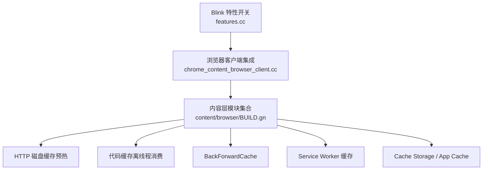
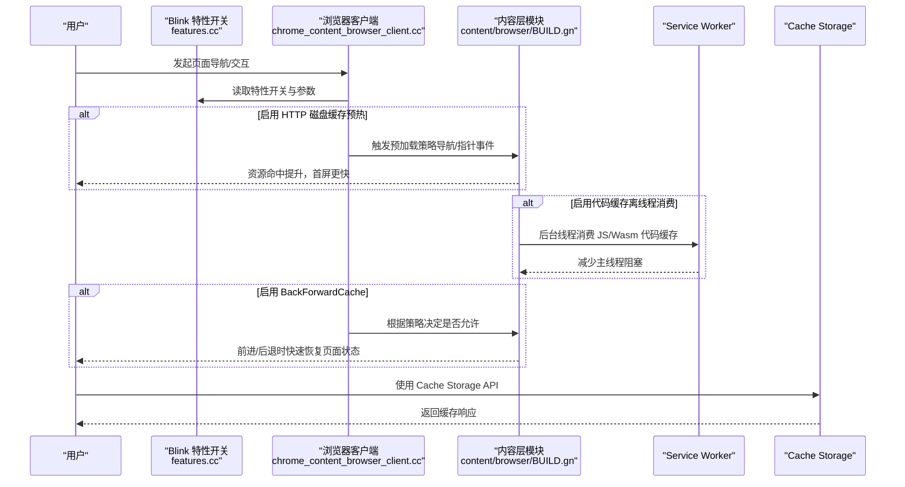
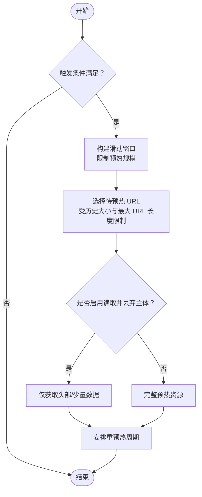
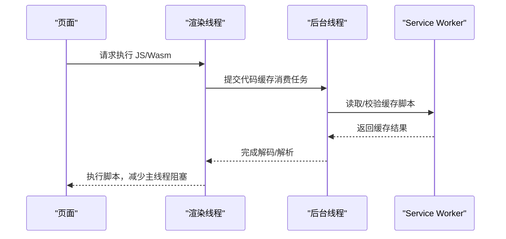
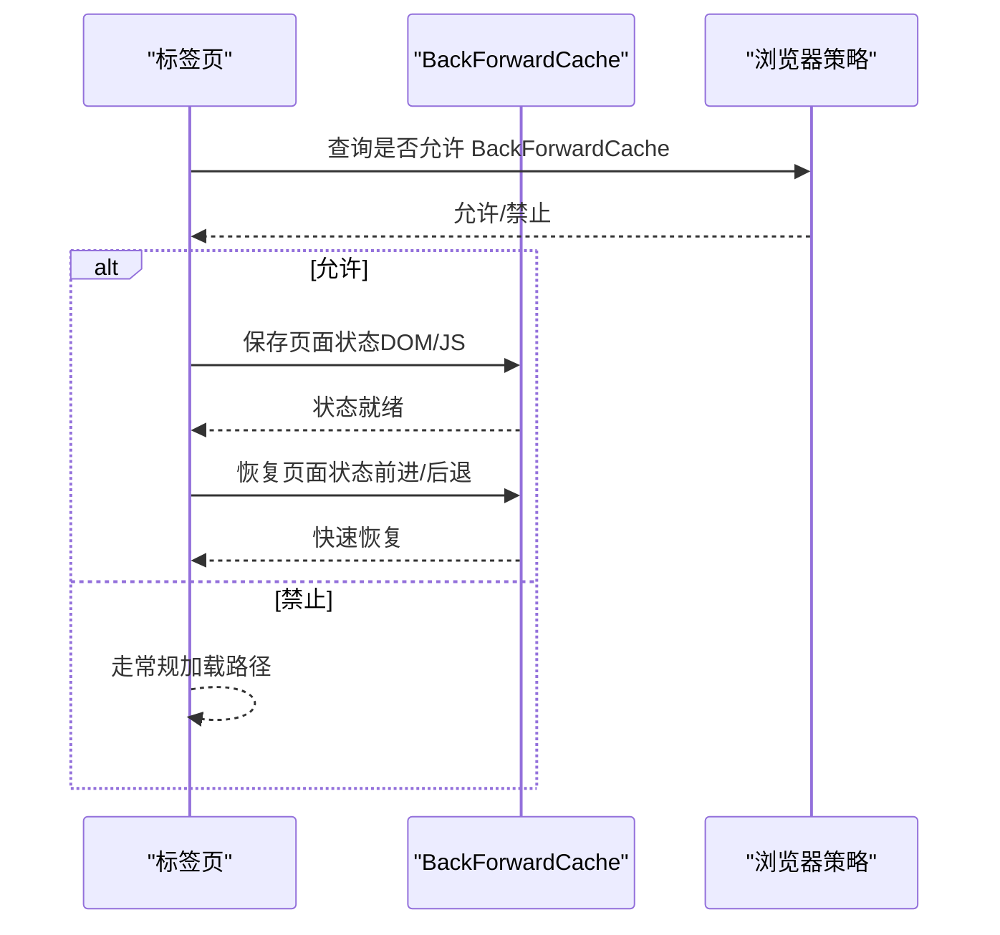
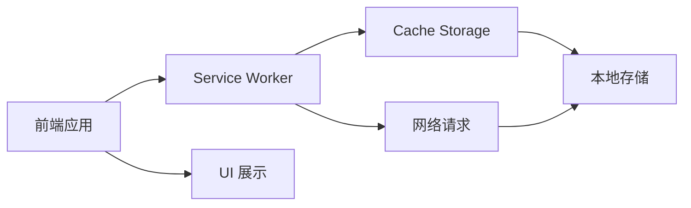
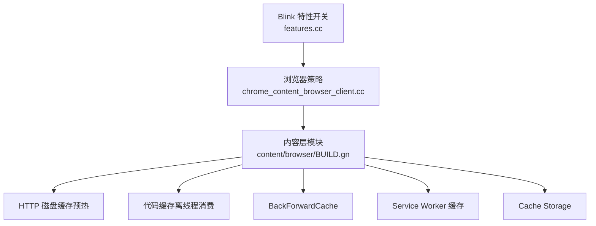

# 缓存策略

<cite>
**本文引用的文件**
- [features.cc](file://src/third_party/blink/common/features.cc)
- [chrome_content_browser_client.cc](file://src/chrome/browser/chrome_content_browser_client.cc)
- [BUILD.gn (content/browser)](file://src/content/browser/BUILD.gn)
</cite>

## 目录
1. [简介](#简介)
2. [项目结构](#项目结构)
3. [核心组件](#核心组件)
4. [架构总览](#架构总览)
5. [详细组件分析](#详细组件分析)
6. [依赖关系分析](#依赖关系分析)
7. [性能考量](#性能考量)
8. [故障排查指南](#故障排查指南)
9. [结论](#结论)
10. [附录](#附录)

## 简介
本文件面向 MCloud Browser 的缓存策略，聚焦以下主题：
- HTTP 磁盘缓存预热（HttpDiskCachePrewarming）的工作原理与配置项
- 代码缓存离线程消费（ConsumeCodeCacheOffThread）机制
- BackForwardCache 的实现要点、状态保存与恢复、内存管理
- Service Worker 缓存与 Application Cache 的使用场景与最佳实践
- 缓存性能监控与清理工具的使用方法

## 项目结构
MCloud Browser 基于 Chromium 内核，缓存相关能力分布在多个层级：
- Blink 特性开关与参数定义：位于 third_party/blink/common/features.cc，集中声明了 HttpDiskCachePrewarming、ConsumeCodeCacheOffThread、BackForwardCache 等特性开关及可调参数。
- 浏览器端集成与策略控制：位于 chrome/browser/chrome_content_browser_client.cc，负责将策略（如是否允许 BackForwardCache）注入到命令行或运行时行为中。
- 内容层模块组织：位于 content/browser/BUILD.gn，列出了与缓存相关的实现模块（如 BackForwardCache、Service Worker、Cache Storage、Code Cache Host 等），用于构建与依赖管理。

图表来源
- [features.cc:1434-1496](file://src/third_party/blink/common/features.cc#L1434-L1496)
- [chrome_content_browser_client.cc:2872-2875](file://src/chrome/browser/chrome_content_browser_client.cc#L2872-L2875)
- [BUILD.gn (content/browser):774-795](file://src/content/browser/BUILD.gn#L774-L795)
- [BUILD.gn (content/browser):1771-1782](file://src/content/browser/BUILD.gn#L1771-L1782)
- [BUILD.gn (content/browser):2120-2219](file://src/content/browser/BUILD.gn#L2120-L2219)

章节来源
- [features.cc:1434-1496](file://src/third_party/blink/common/features.cc#L1434-L1496)
- [chrome_content_browser_client.cc:2872-2875](file://src/chrome/browser/chrome_content_browser_client.cc#L2872-L2875)
- [BUILD.gn (content/browser):774-795](file://src/content/browser/BUILD.gn#L774-L795)
- [BUILD.gn (content/browser):1771-1782](file://src/content/browser/BUILD.gn#L1771-L1782)
- [BUILD.gn (content/browser):2120-2219](file://src/content/browser/BUILD.gn#L2120-L2219)

## 核心组件
- HTTP 磁盘缓存预热（HttpDiskCachePrewarming）
  - 通过特性开关启用，并支持多项可调参数，包括最大 URL 长度、历史大小、重预热周期、触发条件（导航、指针按下/悬停）、启动期跳过、滑动窗口大小、直方图桶数等。
- 代码缓存离线程消费（ConsumeCodeCacheOffThread）
  - 默认启用的特性开关，用于在后台线程处理 JavaScript/WebAssembly 的代码缓存消费，降低主线程阻塞。
- BackForwardCache
  - 由 content/browser 下的 back_forward_cache_* 模块提供，包含实现、指标、提交延迟条件、子帧导航节流等；浏览器端可通过策略决定是否禁用该功能。
- Service Worker 缓存
  - 由 service_worker/* 模块提供，涵盖上下文、注册、脚本加载、缓存写入、配额、指标等。
- Cache Storage 与应用缓存
  - cache_storage/* 模块提供 Cache Storage API 的宿主侧实现与调度、索引、配额、追踪等。

章节来源
- [features.cc:421-424](file://src/third_party/blink/common/features.cc#L421-L424)
- [features.cc:1434-1496](file://src/third_party/blink/common/features.cc#L1434-L1496)
- [chrome_content_browser_client.cc:2872-2875](file://src/chrome/browser/chrome_content_browser_client.cc#L2872-L2875)
- [BUILD.gn (content/browser):774-795](file://src/content/browser/BUILD.gn#L774-L795)
- [BUILD.gn (content/browser):1771-1782](file://src/content/browser/BUILD.gn#L1771-L1782)
- [BUILD.gn (content/browser):2120-2219](file://src/content/browser/BUILD.gn#L2120-L2219)

## 架构总览
下图展示了缓存相关特性从 Blink 特性开关到浏览器端策略再到内容层实现的总体流程。

图表来源
- [features.cc:421-424](file://src/third_party/blink/common/features.cc#L421-L424)
- [features.cc:1434-1496](file://src/third_party/blink/common/features.cc#L1434-L1496)
- [chrome_content_browser_client.cc:2872-2875](file://src/chrome/browser/chrome_content_browser_client.cc#L2872-L2875)
- [BUILD.gn (content/browser):774-795](file://src/content/browser/BUILD.gn#L774-L795)
- [BUILD.gn (content/browser):1771-1782](file://src/content/browser/BUILD.gn#L1771-L1782)
- [BUILD.gn (content/browser):2120-2219](file://src/content/browser/BUILD.gn#L2120-L2219)

## 详细组件分析

### HTTP 磁盘缓存预热（HttpDiskCachePrewarming）
- 工作原理
  - 通过特性开关启用后，可在特定用户交互（如导航、指针按下/悬停）时提前请求并缓存常用资源，从而降低后续实际访问时的网络延迟。
  - 支持“重预热周期”以周期性刷新已预热资源，确保缓存新鲜度。
  - 可配置“滑动窗口大小”和“历史大小”，用于限制预热的资源数量与范围，避免过度占用 I/O 与存储。
  - 支持“启动期跳过”，在浏览器启动阶段不执行预热，减少冷启动开销。
  - 可选“读取并丢弃主体”选项，仅预热头部或少量数据以降低带宽与内存压力。
- 关键配置项
  - 最大 URL 长度、历史大小、重预热周期、触发条件（导航、指针事件）、启动期跳过、滑动窗口大小、直方图桶数等。
- 存储布局优化建议
  - 结合滑动窗口与历史大小，优先预热高频资源，避免低频资源污染缓存。
  - 在低 I/O 设备或移动设备上，谨慎开启“读取并丢弃主体”，以减少带宽与内存占用。
  - 合理设置重预热周期，平衡缓存命中率与刷新成本。

图表来源
- [features.cc:1434-1496](file://src/third_party/blink/common/features.cc#L1434-L1496)

章节来源
- [features.cc:1434-1496](file://src/third_party/blink/common/features.cc#L1434-L1496)

### 代码缓存离线程消费（ConsumeCodeCacheOffThread）
- 工作机制
  - 默认启用，将 JavaScript 与 WebAssembly 的代码缓存消费迁移至后台线程，避免在主线程进行解码、解析等操作导致 UI 卡顿。
  - 与 Service Worker 脚本加载、更新检查协同，减少主线程阻塞时间。
- 适用场景
  - 大型 JS/Wasm 应用、频繁更新的 Service Worker 脚本、复杂页面初始化。
- 注意事项
  - 需确保后台线程的资源访问与队列调度合理，避免饥饿或背压。
  - 结合预热策略，提前准备常用脚本，进一步降低首次执行延迟。

图表来源
- [features.cc:421-424](file://src/third_party/blink/common/features.cc#L421-L424)
- [BUILD.gn (content/browser):2120-2219](file://src/content/browser/BUILD.gn#L2120-L2219)

章节来源
- [features.cc:421-424](file://src/third_party/blink/common/features.cc#L421-L424)
- [BUILD.gn (content/browser):2120-2219](file://src/content/browser/BUILD.gn#L2120-L2219)

### BackForwardCache（前进/后退缓存）
- 实现要点
  - 由 content/browser 下的 back_forward_cache_* 模块提供，包含实现、指标、提交延迟条件、子帧导航节流等。
  - 浏览器端可通过策略决定是否禁用该功能（例如通过策略开关注入命令行）。
- 状态保存与恢复
  - 在页面隐藏或离开时保存 DOM、JS 上下文等状态；在前进/后退时快速恢复，避免重新加载。
  - 通过提交延迟条件与子帧导航节流，确保状态一致性。
- 内存管理
  - 需要权衡内存占用与用户体验，对大页面或高内存消耗场景应谨慎启用或限制。
- 浏览器端策略
  - 若检测到策略禁止，则通过命令行开关禁用 BackForwardCache。

图表来源
- [chrome_content_browser_client.cc:2872-2875](file://src/chrome/browser/chrome_content_browser_client.cc#L2872-L2875)
- [BUILD.gn (content/browser):1771-1782](file://src/content/browser/BUILD.gn#L1771-L1782)

章节来源
- [chrome_content_browser_client.cc:2872-2875](file://src/chrome/browser/chrome_content_browser_client.cc#L2872-L2875)
- [BUILD.gn (content/browser):1771-1782](file://src/content/browser/BUILD.gn#L1771-L1782)

### Service Worker 缓存与 Cache Storage
- Service Worker 缓存
  - 通过 service_worker/* 模块提供上下文、注册、脚本加载、缓存写入、配额、指标等功能。
  - 适用于离线支持、请求拦截、资源预取与缓存策略定制。
- Cache Storage
  - 通过 cache_storage/* 模块提供 API 宿主侧实现，支持命名空间、索引、调度、配额与追踪。
  - 适合前端精细化的缓存管理与调试。
- 最佳实践
  - 明确缓存失效策略（版本化、指纹、TTL），避免脏读。
  - 结合 Service Worker 的请求拦截，统一缓存命中逻辑。
  - 利用配额与清理机制，防止存储空间膨胀。

图表来源
- [BUILD.gn (content/browser):774-795](file://src/content/browser/BUILD.gn#L774-L795)
- [BUILD.gn (content/browser):2120-2219](file://src/content/browser/BUILD.gn#L2120-L2219)

章节来源
- [BUILD.gn (content/browser):774-795](file://src/content/browser/BUILD.gn#L774-L795)
- [BUILD.gn (content/browser):2120-2219](file://src/content/browser/BUILD.gn#L2120-L2219)

## 依赖关系分析
- 特性开关依赖
  - HttpDiskCachePrewarming、ConsumeCodeCacheOffThread、BackForwardCache 等特性在 Blink 层定义，供上层模块读取与决策。
- 浏览器端策略依赖
  - Chrome 客户端根据策略决定是否禁用 BackForwardCache，影响内容层行为。
- 内容层模块依赖
  - content/browser 下的各缓存模块通过 BUILD.gn 组织，形成清晰的构建与依赖边界。

图表来源
- [features.cc:421-424](file://src/third_party/blink/common/features.cc#L421-L424)
- [features.cc:1434-1496](file://src/third_party/blink/common/features.cc#L1434-L1496)
- [chrome_content_browser_client.cc:2872-2875](file://src/chrome/browser/chrome_content_browser_client.cc#L2872-L2875)
- [BUILD.gn (content/browser):774-795](file://src/content/browser/BUILD.gn#L774-L795)
- [BUILD.gn (content/browser):1771-1782](file://src/content/browser/BUILD.gn#L1771-L1782)
- [BUILD.gn (content/browser):2120-2219](file://src/content/browser/BUILD.gn#L2120-L2219)

章节来源
- [features.cc:421-424](file://src/third_party/blink/common/features.cc#L421-L424)
- [features.cc:1434-1496](file://src/third_party/blink/common/features.cc#L1434-L1496)
- [chrome_content_browser_client.cc:2872-2875](file://src/chrome/browser/chrome_content_browser_client.cc#L2872-L2875)
- [BUILD.gn (content/browser):774-795](file://src/content/browser/BUILD.gn#L774-L795)
- [BUILD.gn (content/browser):1771-1782](file://src/content/browser/BUILD.gn#L1771-L1782)
- [BUILD.gn (content/browser):2120-2219](file://src/content/browser/BUILD.gn#L2120-L2219)

## 性能考量
- HTTP 磁盘缓存预热
  - 合理设置滑动窗口与历史大小，避免预热过多低频资源造成 I/O 抖动。
  - 在低带宽或移动设备上，优先使用“读取并丢弃主体”以减少带宽与内存压力。
  - 重预热周期不宜过短，以免频繁刷新导致额外开销。
- 代码缓存离线程消费
  - 确保后台线程池容量与任务队列合理，避免任务堆积与饥饿。
  - 结合预热策略，提前准备常用脚本，降低首次执行延迟。
- BackForwardCache
  - 对大页面或高内存消耗场景，评估内存占用与用户体验的平衡点。
  - 通过提交延迟条件与子帧导航节流，保证状态一致性与性能。
- Service Worker 与 Cache Storage
  - 采用版本化与指纹策略，避免脏缓存。
  - 定期清理过期缓存，结合配额管理，防止存储空间膨胀。

[本节为通用指导，无需具体文件引用]

## 故障排查指南
- BackForwardCache 被禁用
  - 检查浏览器策略是否设置了禁用开关，确认命令行参数是否正确注入。
- 预热效果不佳
  - 调整滑动窗口与历史大小，关注高频 URL 的命中率。
  - 检查触发条件（导航、指针事件）是否按预期生效。
- 代码缓存未生效
  - 确认 ConsumeCodeCacheOffThread 是否启用。
  - 检查 Service Worker 脚本加载与更新流程是否正常。
- 存储空间不足
  - 使用 Cache Storage 的配额与清理接口，定期删除过期缓存。
  - 结合 Service Worker 的缓存策略，控制缓存体积。

章节来源
- [chrome_content_browser_client.cc:2872-2875](file://src/chrome/browser/chrome_content_browser_client.cc#L2872-L2875)
- [features.cc:1434-1496](file://src/third_party/blink/common/features.cc#L1434-L1496)
- [BUILD.gn (content/browser):774-795](file://src/content/browser/BUILD.gn#L774-L795)
- [BUILD.gn (content/browser):2120-2219](file://src/content/browser/BUILD.gn#L2120-L2219)

## 结论
MCloud Browser 的缓存策略通过 Blink 特性开关、浏览器端策略与内容层模块的协同，实现了高效的 HTTP 磁盘缓存预热、代码缓存离线程消费、BackForwardCache 以及 Service Worker/Cache Storage 的精细化控制。合理配置与调优这些能力，可以显著提升页面加载速度与用户体验，同时兼顾内存与存储资源的合理使用。

[本节为总结性内容，无需具体文件引用]

## 附录
- 配置项速查
  - HttpDiskCachePrewarming：最大 URL 长度、历史大小、重预热周期、触发条件、启动期跳过、滑动窗口大小、直方图桶数等。
  - ConsumeCodeCacheOffThread：默认启用，用于后台线程消费代码缓存。
  - BackForwardCache：可通过策略禁用，影响前进/后退缓存行为。
- 监控与清理
  - 使用 DevTools 的 Network、Application 面板观察缓存命中与体积。
  - 通过 Cache Storage API 与 Service Worker 的缓存接口进行清理与调试。

[本节为补充信息，无需具体文件引用]