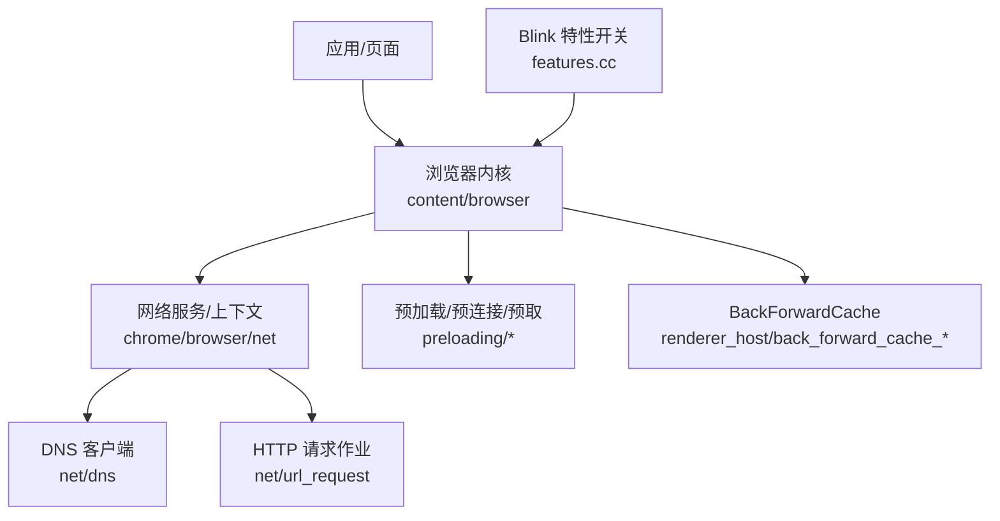
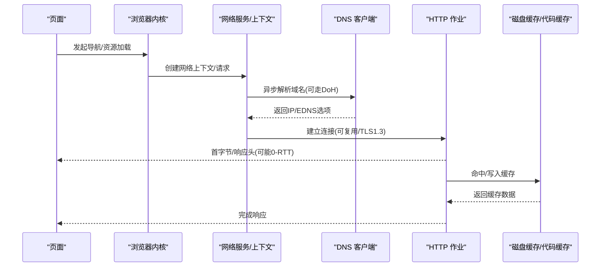
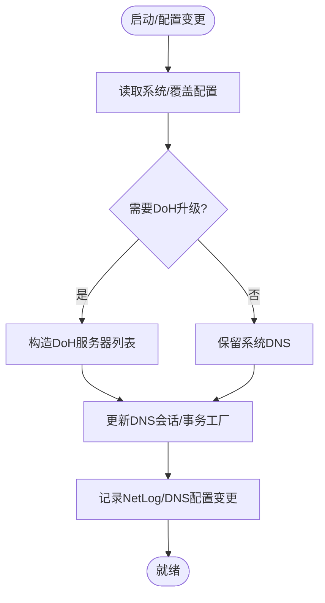
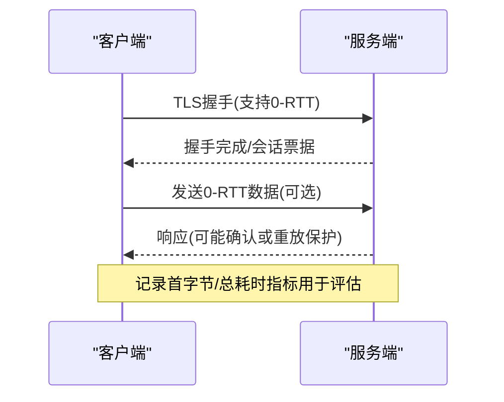
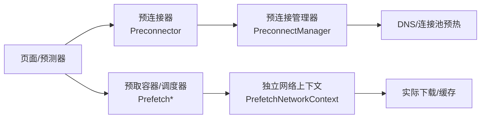
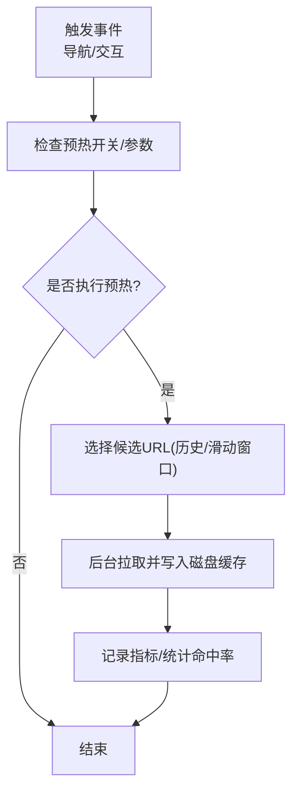
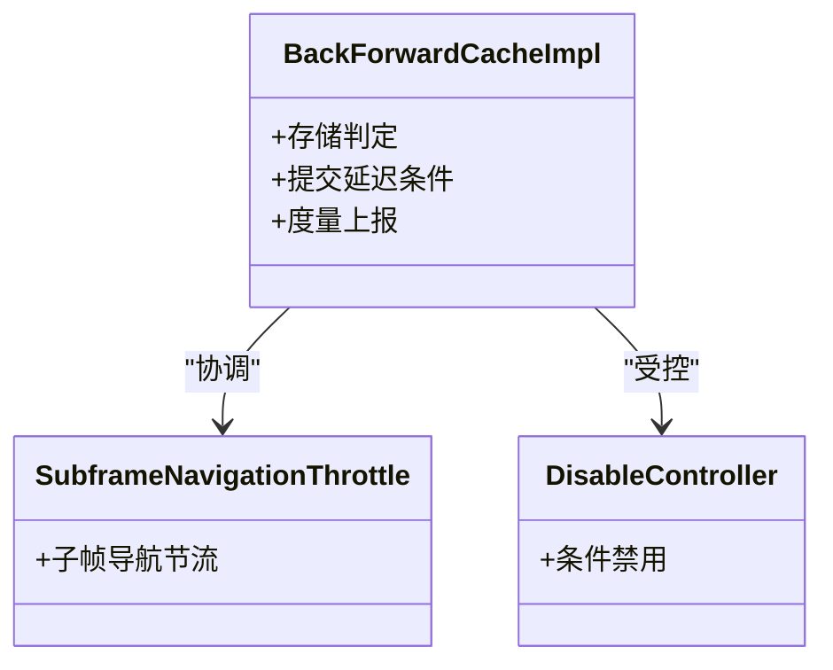
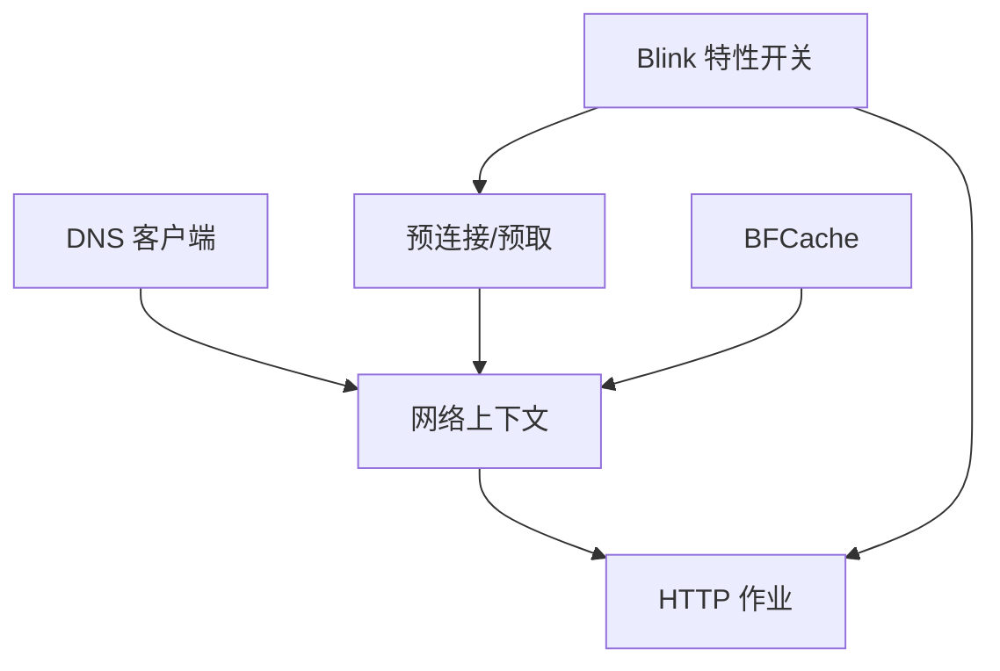

# 网络优化

<cite>
**本文引用的文件**
- [dns_client.cc](file://src/net/dns/dns_client.cc)
- [default_dns_over_https_config_source.cc](file://src/chrome/browser/net/default_dns_over_https_config_source.cc)
- [stub_resolver_config_reader.cc](file://src/chrome/browser/net/stub_resolver_config_reader.cc)
- [profile_network_context_service.cc](file://src/chrome/browser/net/profile_network_context_service.cc)
- [url_request_http_job.cc](file://src/net/url_request/url_request_http_job.cc)
- [features.cc](file://src/third_party/blink/common/features.cc)
- [BUILD.gn](file://src/content/browser/BUILD.gn)
- [README.md](file://README.md)
- [M151-opt-benchmark.md](file://docs/dev-logs/M151-opt-benchmark.md)
- [bench_navigation.ps1](file://benchmark/bench_navigation.ps1)
</cite>

## 目录
1. [简介](#简介)
2. [项目结构](#项目结构)
3. [核心组件](#核心组件)
4. [架构总览](#架构总览)
5. [详细组件分析](#详细组件分析)
6. [依赖关系分析](#依赖关系分析)
7. [性能考量](#性能考量)
8. [故障排查指南](#故障排查指南)
9. [结论](#结论)
10. [附录](#附录)

## 简介
本文件面向 MCloud Browser 的网络优化体系，系统性阐述异步 DNS 解析、TLS 1.3 早期数据（0-RTT）、预连接与预取机制、BackForwardCache（BFCache）工作原理与配置、HTTP 磁盘缓存预热、代码缓存离线程消费等关键能力；同时给出网络请求生命周期管理、资源调度策略、性能监控与分析方法以及常见问题诊断建议。内容基于仓库中的源码与文档进行提炼与组织，力求既深入又易于理解。

## 项目结构
围绕网络优化的相关实现主要分布在以下位置：
- 网络栈与 DNS：net/dns、net/url_request
- Chrome 层网络服务与偏好：chrome/browser/net
- Blink 特性开关与参数：third_party/blink/common/features.cc
- 预加载/预连接/预取构建清单：content/browser/BUILD.gn
- 页面恢复与缓存：content/renderer_host/back_forward_cache_*（在构建清单中声明）
- 性能基准与说明：README.md、docs/dev-logs、benchmark

图表来源
- [BUILD.gn:1578-1628](file://src/content/browser/BUILD.gn#L1578-L1628)
- [BUILD.gn:1771-1796](file://src/content/browser/BUILD.gn#L1771-L1796)
- [features.cc:1434-1497](file://src/third_party/blink/common/features.cc#L1434-L1497)

章节来源
- [BUILD.gn:1578-1628](file://src/content/browser/BUILD.gn#L1578-L1628)
- [BUILD.gn:1771-1796](file://src/content/browser/BUILD.gn#L1771-L1796)
- [features.cc:1434-1497](file://src/third_party/blink/common/features.cc#L1434-L1497)

## 核心组件
- 异步 DNS 解析与 DoH 升级：通过内置 DNS 客户端与默认 DoH 配置源协同工作，支持自动/强制模式与回退策略，并在系统配置变更时动态更新会话。
- TLS 1.3 0-RTT：HTTP 作业在 TLS 1.3 路径下记录首字节时间与总体耗时指标，便于评估 0-RTT 对时延的影响。
- 预连接与预取：构建清单包含 preconnect/prefetch 的完整实现集合，配合 LCP 源自动预连接等特性提升后续导航速度。
- HTTP 磁盘缓存预热：通过特性开关与参数控制触发时机、历史窗口大小、是否跳过启动阶段等，提前将常用资源打入磁盘缓存。
- 代码缓存离线程消费：启用后，JS/WASM 等代码缓存的解码与应用不再阻塞主线程，降低卡顿风险。
- BackForwardCache：渲染进程侧的页面快照缓存，结合提交延迟条件与度量，显著提升后退/前进恢复速度。

章节来源
- [dns_client.cc:148-230](file://src/net/dns/dns_client.cc#L148-L230)
- [default_dns_over_https_config_source.cc:15-75](file://src/chrome/browser/net/default_dns_over_https_config_source.cc#L15-L75)
- [url_request_http_job.cc:1909-1943](file://src/net/url_request/url_request_http_job.cc#L1909-L1943)
- [features.cc:421-423](file://src/third_party/blink/common/features.cc#L421-L423)
- [features.cc:1434-1497](file://src/third_party/blink/common/features.cc#L1434-L1497)
- [BUILD.gn:1578-1628](file://src/content/browser/BUILD.gn#L1578-L1628)
- [BUILD.gn:1771-1796](file://src/content/browser/BUILD.gn#L1771-L1796)

## 架构总览
下图展示了从页面到网络层的调用链路与关键优化点：

图表来源
- [dns_client.cc:148-230](file://src/net/dns/dns_client.cc#L148-L230)
- [url_request_http_job.cc:1909-1943](file://src/net/url_request/url_request_http_job.cc#L1909-L1943)

章节来源
- [dns_client.cc:148-230](file://src/net/dns/dns_client.cc#L148-L230)
- [url_request_http_job.cc:1909-1943](file://src/net/url_request/url_request_http_job.cc#L1909-L1943)

## 详细组件分析

### 异步 DNS 解析与 DoH 升级
- 内置 DNS 客户端负责组合系统配置与覆盖项，必要时执行 DoH 升级，并维护会话与事务工厂。
- 默认 DoH 配置源提供偏好注册与变更回调，确保在网络服务创建前设置默认值，避免重入问题。
- StubResolverConfigReader 在初始化时将“内置 DNS 客户端”默认值注入本地状态，并监听相关偏好变化以更新网络服务。

图表来源
- [dns_client.cc:70-146](file://src/net/dns/dns_client.cc#L70-L146)
- [dns_client.cc:313-385](file://src/net/dns/dns_client.cc#L313-L385)
- [default_dns_over_https_config_source.cc:15-75](file://src/chrome/browser/net/default_dns_over_https_config_source.cc#L15-L75)
- [stub_resolver_config_reader.cc:146-167](file://src/chrome/browser/net/stub_resolver_config_reader.cc#L146-L167)

章节来源
- [dns_client.cc:70-146](file://src/net/dns/dns_client.cc#L70-L146)
- [dns_client.cc:313-385](file://src/net/dns/dns_client.cc#L313-L385)
- [default_dns_over_https_config_source.cc:15-75](file://src/chrome/browser/net/default_dns_over_https_config_source.cc#L15-L75)
- [stub_resolver_config_reader.cc:146-167](file://src/chrome/browser/net/stub_resolver_config_reader.cc#L146-L167)

### TLS 1.3 早期数据（0-RTT）
- HTTP 作业在 TLS 1.3 路径上记录首字节时间与总体耗时，用于评估 0-RTT 的实际收益与影响。
- 指标区分缓存命中与非缓存场景，便于定位瓶颈。

图表来源
- [url_request_http_job.cc:1909-1943](file://src/net/url_request/url_request_http_job.cc#L1909-L1943)

章节来源
- [url_request_http_job.cc:1909-1943](file://src/net/url_request/url_request_http_job.cc#L1909-L1943)

### 预连接与预取机制
- 构建清单中包含完整的预连接管理器、预连接器、预取容器、调度器、网络上下文、匹配解析器等模块，支撑预测性资源获取。
- 配合 LCP 源自动预连接等特性，减少首屏关键资源的等待时间。

图表来源
- [BUILD.gn:1578-1628](file://src/content/browser/BUILD.gn#L1578-L1628)

章节来源
- [BUILD.gn:1578-1628](file://src/content/browser/BUILD.gn#L1578-L1628)

### HTTP 磁盘缓存预热
- 通过特性开关与参数控制预热行为：最大 URL 长度、历史大小、重新预热周期、触发时机（导航/指针按下或悬停）、是否跳过启动阶段、滑动窗口大小等。
- 预热可在用户交互或导航前将高频资源预先拉取并落盘，从而在真实访问时获得命中。

图表来源
- [features.cc:1434-1497](file://src/third_party/blink/common/features.cc#L1434-L1497)

章节来源
- [features.cc:1434-1497](file://src/third_party/blink/common/features.cc#L1434-L1497)

### 代码缓存离线程消费
- 启用后，代码缓存的解码与应用在后台线程进行，避免阻塞主线程，改善交互流畅度。
- 该特性默认开启，适用于 JS/WASM 等资源。

章节来源
- [features.cc:421-423](file://src/third_party/blink/common/features.cc#L421-L423)

### BackForwardCache（BFCache）
- 渲染进程侧的页面快照缓存，包含存储判定、提交延迟条件、子帧导航节流、禁用逻辑与度量等模块。
- 通过合理配置与节流策略，在后退/前进时快速恢复页面状态，显著降低重绘与重排成本。

图表来源
- [BUILD.gn:1771-1796](file://src/content/browser/BUILD.gn#L1771-L1796)

章节来源
- [BUILD.gn:1771-1796](file://src/content/browser/BUILD.gn#L1771-L1796)

## 依赖关系分析
- DNS 层依赖系统配置与 DoH 模板，并通过偏好变更回调驱动网络服务重建。
- HTTP 作业依赖底层事务与响应信息，记录 TLS1.3 与缓存命中指标。
- 预连接/预取模块依赖独立的网络上下文与调度器，避免干扰前台请求。
- BFCache 与提交延迟条件、子帧导航节流紧密耦合，共同保障页面恢复的正确性与性能。

图表来源
- [dns_client.cc:148-230](file://src/net/dns/dns_client.cc#L148-L230)
- [features.cc:1434-1497](file://src/third_party/blink/common/features.cc#L1434-L1497)
- [BUILD.gn:1578-1628](file://src/content/browser/BUILD.gn#L1578-L1628)
- [BUILD.gn:1771-1796](file://src/content/browser/BUILD.gn#L1771-L1796)

章节来源
- [dns_client.cc:148-230](file://src/net/dns/dns_client.cc#L148-L230)
- [features.cc:1434-1497](file://src/third_party/blink/common/features.cc#L1434-L1497)
- [BUILD.gn:1578-1628](file://src/content/browser/BUILD.gn#L1578-L1628)
- [BUILD.gn:1771-1796](file://src/content/browser/BUILD.gn#L1771-L1796)

## 性能考量
- 内存与速度的权衡：部分预载/预热特性以内存换取速度，若对内存敏感可评估关闭特定项后再测。
- 冷启动开销：预热类功能可能在启动阶段增加少量耗时，需结合样本评估。
- 单页一次性加载场景下，预载收益有限；真正的收益体现在重复导航与预测命中场景。
- 指标观测：利用内置指标（如 TLS1.3 首字节/总耗时、缓存命中）与基准脚本对比 on/off 差异。

章节来源
- [M151-opt-benchmark.md:71-78](file://docs/dev-logs/M151-opt-benchmark.md#L71-L78)
- [bench_navigation.ps1:100-108](file://benchmark/bench_navigation.ps1#L100-L108)
- [README.md:98-117](file://README.md#L98-L117)

## 故障排查指南
- DNS 解析异常
  - 检查系统/覆盖配置是否有效，确认 DoH 升级是否成功，关注 NetLog 中的 DNS 配置变更条目。
  - 参考 DNS 客户端的配置构建与会话更新流程，验证回退策略是否生效。
- TLS/0-RTT 问题
  - 观察 TLS1.3 首字节与总耗时指标，结合缓存命中情况判断是否为握手或重放保护导致的延迟。
- 预连接/预取未命中
  - 核对触发条件（导航/交互）、预热历史窗口与 URL 长度限制，确认是否被启动阶段跳过。
- BFCache 未生效
  - 检查提交延迟条件与子帧导航节流是否阻止了缓存，查看相关度量与禁用逻辑。
- 代码缓存未离线程
  - 确认特性开关已启用，并观察主线程阻塞是否消除。

章节来源
- [dns_client.cc:70-146](file://src/net/dns/dns_client.cc#L70-L146)
- [dns_client.cc:313-385](file://src/net/dns/dns_client.cc#L313-L385)
- [url_request_http_job.cc:1909-1943](file://src/net/url_request/url_request_http_job.cc#L1909-L1943)
- [features.cc:1434-1497](file://src/third_party/blink/common/features.cc#L1434-L1497)
- [BUILD.gn:1771-1796](file://src/content/browser/BUILD.gn#L1771-L1796)

## 结论
MCloud Browser 在网络层面构建了从 DNS、TLS、HTTP 到缓存与预加载的全链路优化体系。通过异步 DNS、TLS 1.3 0-RTT、预连接/预取、HTTP 磁盘缓存预热与代码缓存离线程消费等手段，显著降低了首屏与重复导航时延；借助 BFCache 进一步提升页面恢复速度。建议在业务场景中结合指标与基准测试，按需开启/调整相关特性，平衡性能与内存占用。

## 附录
- 相关特性开关与参数（示例）
  - HTTP 磁盘缓存预热：最大 URL 长度、历史大小、重新预热周期、触发时机、是否跳过启动阶段、滑动窗口大小等。
  - 代码缓存离线程消费：默认开启。
  - 预连接/预取：由构建清单集成，具体策略由调度器与匹配解析器决定。
- 参考文档与基准
  - 页面加载加速标志与取舍说明
  - 性能基准报告与导航基准脚本

章节来源
- [features.cc:1434-1497](file://src/third_party/blink/common/features.cc#L1434-L1497)
- [features.cc:421-423](file://src/third_party/blink/common/features.cc#L421-L423)
- [README.md:98-117](file://README.md#L98-L117)
- [M151-opt-benchmark.md:71-78](file://docs/dev-logs/M151-opt-benchmark.md#L71-L78)
- [bench_navigation.ps1:100-108](file://benchmark/bench_navigation.ps1#L100-L108)