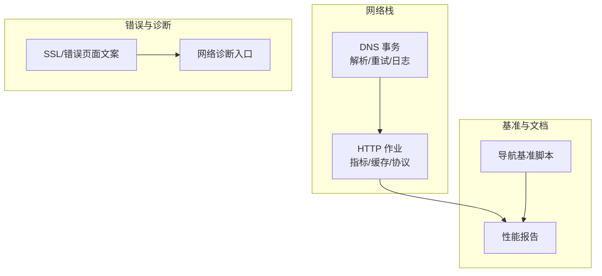
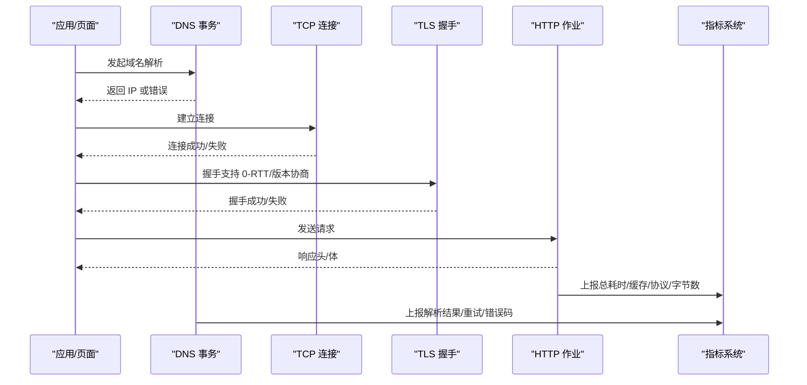
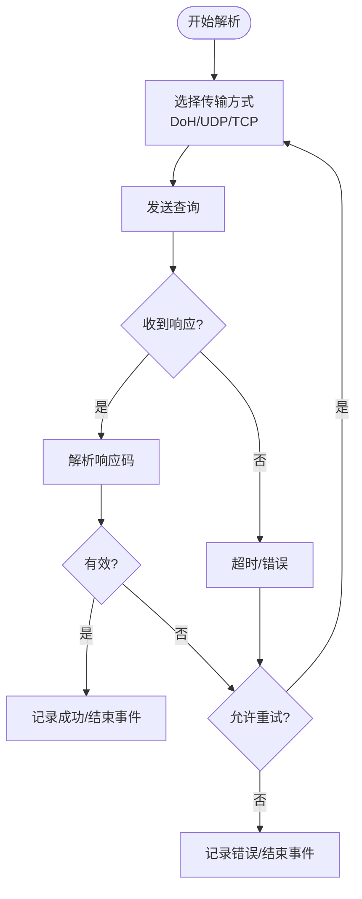
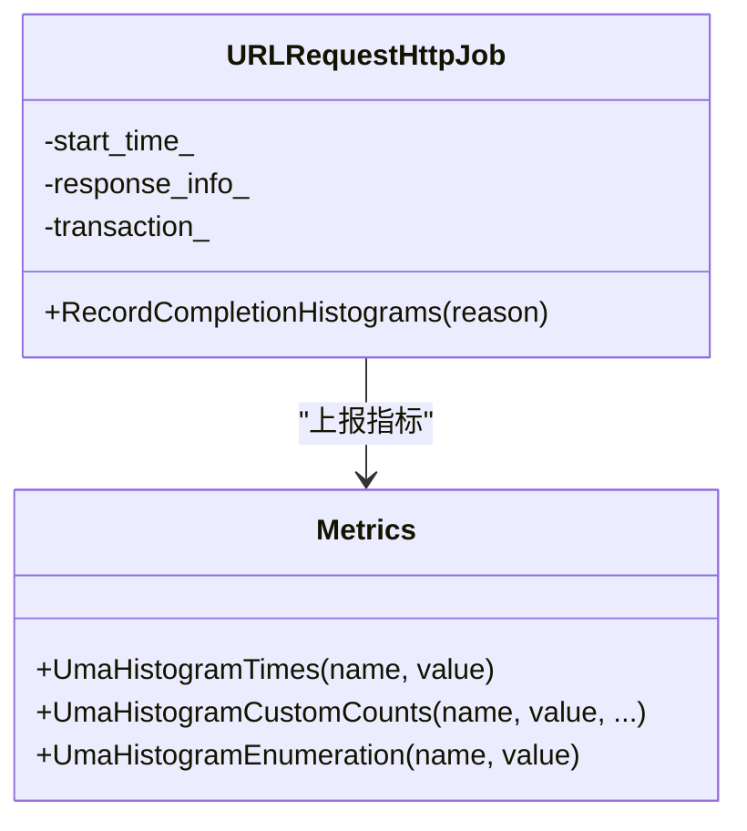
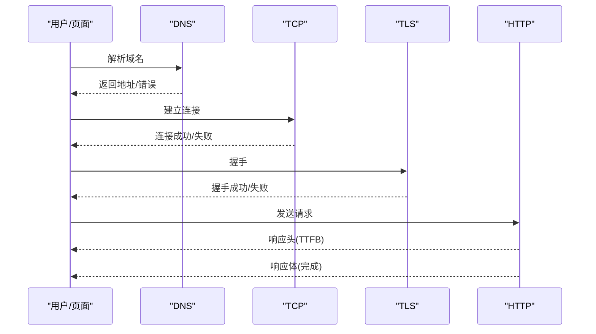
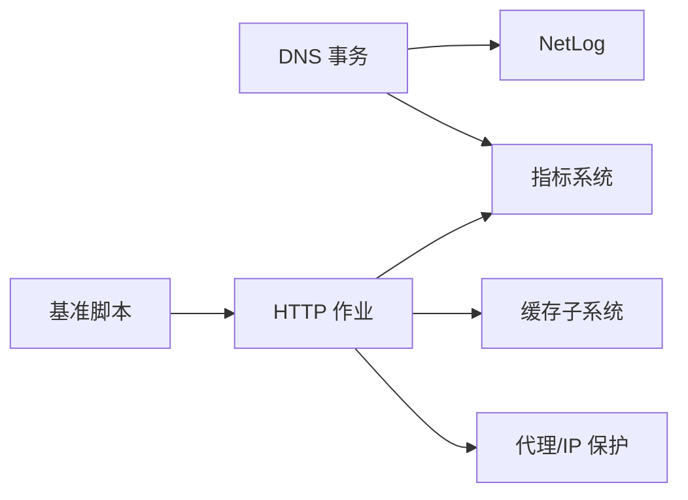

# 网络监控与分析

<cite>
**本文引用的文件**
- [dns_transaction.cc](file://src/net/dns/dns_transaction.cc)
- [url_request_http_job.cc](file://src/net/url_request/url_request_http_job.cc)
- [bench_navigation.ps1](file://benchmark/bench_navigation.ps1)
- [M151-opt-benchmark.md](file://docs/dev-logs/M151-opt-benchmark.md)
- [ssl_errors_strings.grdp](file://src/components/ssl_errors_strings.grdp)
- [error_page_strings.grdp](file://src/components/error_page_strings.grdp)
- [chromeos_strings.grd](file://src/chromeos/chromeos_strings.grd)
</cite>

## 目录
1. [简介](#简介)
2. [项目结构](#项目结构)
3. [核心组件](#核心组件)
4. [架构总览](#架构总览)
5. [详细组件分析](#详细组件分析)
6. [依赖关系分析](#依赖关系分析)
7. [性能考量](#性能考量)
8. [故障排查指南](#故障排查指南)
9. [结论](#结论)
10. [附录](#附录)

## 简介
本文件面向 MCloud Browser 的网络监控与性能分析，聚焦以下目标：
- 指标采集与分析：DNS 解析时间、TCP 连接建立时间、TLS 握手时间与首字节时间（TTFB）的观测方法与解读。
- 请求生命周期监控点：从发起、发送、响应到完成的完整流程跟踪。
- 错误分类与异常处理：网络超时、连接失败、证书错误的诊断方法。
- 基准测试工具：单页加载与多标签并发测试的使用与实践。
- 抓包分析与调优实践：结合 NetLog 与外部抓包工具的定位与优化建议。

## 项目结构
围绕网络监控与分析的关键代码与资源分布如下：
- DNS 解析与 DoH/DoT 事务：位于 net/dns 层，负责域名解析、重试、日志与指标上报。
- HTTP 作业与指标统计：位于 net/url_request 层，汇总总耗时、缓存命中、协议选择（QUIC/TLS）、带宽等指标。
- 基准脚本与报告：benchmark 目录提供导航响应速度对比脚本；docs/dev-logs 包含实测报告。
- 错误与帮助文案：components 与 chromeos 字符串资源用于错误提示与网络诊断入口。

图表来源
- [dns_transaction.cc:94-119](file://src/net/dns/dns_transaction.cc#L94-L119)
- [url_request_http_job.cc:1958-2149](file://src/net/url_request/url_request_http_job.cc#L1958-L2149)
- [bench_navigation.ps1:1-109](file://benchmark/bench_navigation.ps1#L1-L109)
- [error_page_strings.grdp:359-371](file://src/components/error_page_strings.grdp#L359-L371)

章节来源
- [dns_transaction.cc:94-119](file://src/net/dns/dns_transaction.cc#L94-L119)
- [url_request_http_job.cc:1958-2149](file://src/net/url_request/url_request_http_job.cc#L1958-L2149)
- [bench_navigation.ps1:1-109](file://benchmark/bench_navigation.ps1#L1-L109)
- [error_page_strings.grdp:359-371](file://src/components/error_page_strings.grdp#L359-L371)

## 核心组件
- DNS 事务（DnsTransaction/DnsAttempt）
  - 负责 DNS 查询发起、UDP/TCP/DoH 多种传输路径、重试策略、NetLog 事件记录与服务器成功率统计。
  - 关键行为包括：开始查询、构造尝试、发送/接收响应、解析响应码、记录成功或失败并结束事件。
- HTTP 作业（URLRequestHttpJob）
  - 负责 HTTP 请求完成后的指标汇总：总耗时、成功/取消分类、缓存命中、协议使用（QUIC/TLS1.3）、预过滤读取字节数、IP 保护链路与回退等。
  - 通过 Uma 直方图上报各类性能指标，便于后续分析与可视化。

章节来源
- [dns_transaction.cc:1517-1551](file://src/net/dns/dns_transaction.cc#L1517-L1551)
- [dns_transaction.cc:1597-1617](file://src/net/dns/dns_transaction.cc#L1597-L1617)
- [url_request_http_job.cc:1958-2149](file://src/net/url_request/url_request_http_job.cc#L1958-L2149)

## 架构总览
下图展示一次 HTTPS 导航从 DNS 解析到 HTTP 响应的关键阶段与指标采集点。

图表来源
- [dns_transaction.cc:1517-1551](file://src/net/dns/dns_transaction.cc#L1517-L1551)
- [dns_transaction.cc:1597-1617](file://src/net/dns/dns_transaction.cc#L1597-L1617)
- [url_request_http_job.cc:1958-2149](file://src/net/url_request/url_request_http_job.cc#L1958-L2149)

## 详细组件分析

### DNS 解析与指标采集
- 解析流程
  - 启动查询：记录 qname、选择 DoH 或经典 DNS 迭代器。
  - 构建尝试：创建 UDP/TCP/DoH 尝试，记录 NetLog 事件。
  - 发送与接收：按状态机推进，解析响应码，处理 NXDOMAIN/TC 标志等。
  - 结果处理：记录服务器成功/失败，结束事件，必要时触发重试。
- 可观测指标
  - 解析耗时：可通过 NetLog 事件起止时间计算。
  - 重试与回退：UDP 失败时回退 TCP/DoH，记录尝试次数与类型。
  - 错误码：NXDOMAIN、服务器失败、格式错误等。

图表来源
- [dns_transaction.cc:1517-1551](file://src/net/dns/dns_transaction.cc#L1517-L1551)
- [dns_transaction.cc:1597-1617](file://src/net/dns/dns_transaction.cc#L1597-L1617)

章节来源
- [dns_transaction.cc:1517-1551](file://src/net/dns/dns_transaction.cc#L1517-L1551)
- [dns_transaction.cc:1597-1617](file://src/net/dns/dns_transaction.cc#L1597-L1617)

### HTTP 作业与性能指标
- 指标覆盖
  - 总耗时：区分成功/取消、缓存命中/未命中、QUIC/TLS1.3 子维度。
  - 数据量：发送/接收字节数、预过滤读取字节数。
  - 安全与隐私：IP 保护链路与回退场景的耗时与流量统计。
- 采集时机
  - 在请求完成回调中统一汇总，避免重复或遗漏。
  - 对绕过网络的纯缓存命中不计入网络相关指标。

图表来源
- [url_request_http_job.cc:1958-2149](file://src/net/url_request/url_request_http_job.cc#L1958-L2149)

章节来源
- [url_request_http_job.cc:1958-2149](file://src/net/url_request/url_request_http_job.cc#L1958-L2149)

### 请求生命周期监控点（端到端）
- 发起：DNS 查询开始（NetLog 事件）。
- 解析：UDP/TCP/DoH 尝试与结果（错误码、重试）。
- 连接：TCP 连接建立（可从 NetLog 套接字事件推断）。
- 握手：TLS 握手（HTTP 作业记录 QUIC/TLS1.3 指标）。
- 发送：HTTP 请求头与体（指标统计发送字节）。
- 响应：响应头到达（TTFB 可由“首次响应头”与“请求开始”差值估算）。
- 完成：响应体下载与指标汇总（总耗时、缓存命中、协议选择）。

图表来源
- [dns_transaction.cc:1517-1551](file://src/net/dns/dns_transaction.cc#L1517-L1551)
- [url_request_http_job.cc:1958-2149](file://src/net/url_request/url_request_http_job.cc#L1958-L2149)

### 错误分类与异常处理
- DNS 错误
  - 名称不存在（NXDOMAIN）、服务器失败、响应格式错误、需要 TCP 重试等。
- 连接与超时
  - 连接失败、超时、IO 挂起后未完成。
- 证书与安全
  - 证书权威无效、弱密钥、名称约束违规、透明度要求不满足、过时 TLS 版本等。
- 用户侧诊断
  - 错误页提供“运行网络诊断”入口，引导用户使用系统或内置诊断工具。

章节来源
- [dns_transaction.cc:1597-1617](file://src/net/dns/dns_transaction.cc#L1597-L1617)
- [ssl_errors_strings.grdp:83-147](file://src/components/ssl_errors_strings.grdp#L83-L147)
- [error_page_strings.grdp:359-371](file://src/components/error_page_strings.grdp#L359-L371)
- [chromeos_strings.grd:2327-2349](file://src/chromeos/chromeos_strings.grd#L2327-L2349)

### 基准测试工具与实践
- 单页加载测试
  - 使用 bench_navigation.ps1 对一组 URL 进行预热与多轮测量，输出中位数耗时，对比启用/禁用预载类特性时的差异。
- 多标签并发测试
  - 可在同一进程内打开多个标签并行加载不同站点，观察资源竞争与调度影响；结合浏览器任务队列与网络优先级进行分析。
- 指标解读
  - 关注 TTFB、总耗时、缓存命中率、协议选择（QUIC/TLS1.3）与带宽利用率。
  - 结合 NetLog 事件与指标直方图定位瓶颈（DNS、TCP、TLS、服务端响应）。

章节来源
- [bench_navigation.ps1:1-109](file://benchmark/bench_navigation.ps1#L1-L109)
- [M151-opt-benchmark.md:34-60](file://docs/dev-logs/M151-opt-benchmark.md#L34-L60)

## 依赖关系分析
- DNS 事务依赖底层套接字与 NetLog，负责将解析过程结构化记录与上报。
- HTTP 作业依赖事务与响应信息，汇总多维度指标，并与 IP 保护、代理链、缓存子系统交互。
- 基准脚本驱动浏览器实例执行导航，收集端到端耗时，为优化决策提供数据支撑。

图表来源
- [dns_transaction.cc:94-119](file://src/net/dns/dns_transaction.cc#L94-L119)
- [url_request_http_job.cc:1958-2149](file://src/net/url_request/url_request_http_job.cc#L1958-L2149)
- [bench_navigation.ps1:1-109](file://benchmark/bench_navigation.ps1#L1-L109)

章节来源
- [dns_transaction.cc:94-119](file://src/net/dns/dns_transaction.cc#L94-L119)
- [url_request_http_job.cc:1958-2149](file://src/net/url_request/url_request_http_job.cc#L1958-L2149)
- [bench_navigation.ps1:1-109](file://benchmark/bench_navigation.ps1#L1-L109)

## 性能考量
- 指标维度
  - DNS：解析耗时、重试次数、DoH/UDP/TCP 选择。
  - TCP：连接建立耗时（可通过 NetLog 套接字事件估算）。
  - TLS：握手耗时、是否使用 0-RTT、协议版本。
  - HTTP：TTFB、总耗时、缓存命中、QUIC 使用率、带宽。
- 优化方向
  - 减少 DNS 重试与回退：优先 DoH 或就近服务器。
  - 提升 TLS 效率：启用 0-RTT、复用会话、合理证书链。
  - 利用缓存与预连接：命中缓存、预连接关键域名。
  - 协议选择：在可用情况下优先 QUIC 以降低延迟。
- 观测手段
  - 使用 NetLog 捕获完整事件序列，结合指标直方图定位瓶颈阶段。
  - 通过基准脚本对比不同配置下的端到端耗时变化。

[本节为通用指导，无需特定文件引用]

## 故障排查指南
- DNS 问题
  - 现象：解析失败、频繁回退 TCP/DoH。
  - 排查：查看 NetLog DNS 事件、错误码、重试次数；检查 DNS 配置与可达性。
- 连接与超时
  - 现象：连接失败、超时。
  - 排查：确认网络连通、代理设置、防火墙规则；检查 NetLog 套接字事件。
- 证书错误
  - 现象：证书权威无效、弱密钥、名称约束违规、TLS 版本过旧。
  - 排查：依据错误页文案定位具体原因；更新证书或调整 TLS 配置。
- 用户诊断
  - 使用错误页中的“运行网络诊断”链接，调用系统或内置诊断工具辅助定位。

章节来源
- [dns_transaction.cc:1597-1617](file://src/net/dns/dns_transaction.cc#L1597-L1617)
- [ssl_errors_strings.grdp:83-147](file://src/components/ssl_errors_strings.grdp#L83-L147)
- [error_page_strings.grdp:359-371](file://src/components/error_page_strings.grdp#L359-L371)
- [chromeos_strings.grd:2327-2349](file://src/chromeos/chromeos_strings.grd#L2327-L2349)

## 结论
- MCloud Browser 在网络层提供了完善的监控与指标体系：DNS 事务负责解析过程的细粒度记录，HTTP 作业汇总端到端性能指标，涵盖缓存、协议、带宽与安全链路。
- 通过 NetLog 与指标直方图，可精准定位 DNS、TCP、TLS 与 HTTP 各阶段的瓶颈。
- 基准脚本与实测报告为优化决策提供量化依据，建议在真实站点场景下评估预载与预连接特性的收益与代价。
- 错误分类与诊断入口帮助用户快速定位常见问题，结合抓包与日志可实现闭环排障。

[本节为总结，无需特定文件引用]

## 附录
- 抓包与 NetLog 联合分析
  - 开启 NetLog 捕获 DNS、套接字、HTTP 事件，导出 .netlog 文件。
  - 配合 Wireshark/tcpdump 抓取原始报文，关联时间戳与事件 ID 进行交叉验证。
- 常用指标口径
  - TTFB：从请求发送到首个响应头到达的时间。
  - 总耗时：从请求开始到响应完成的时间。
  - 缓存命中：完全本地命中不计入网络指标；304 触发的缓存命中计入网络相关指标。
- 多标签并发测试建议
  - 控制并发度与站点多样性，观察资源竞争与调度影响。
  - 结合任务优先级与网络队列，评估高负载下的稳定性与性能。

[本节为补充说明，无需特定文件引用]