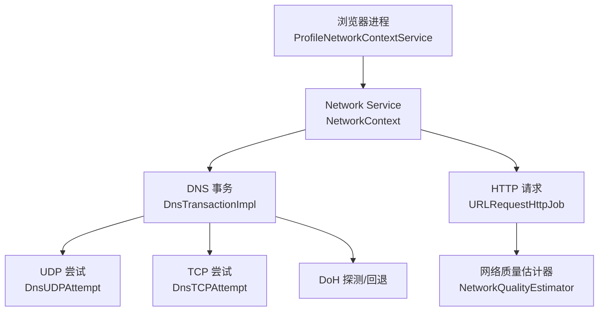
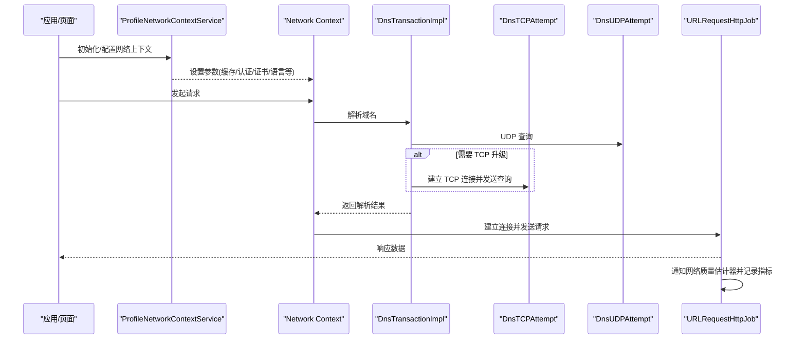
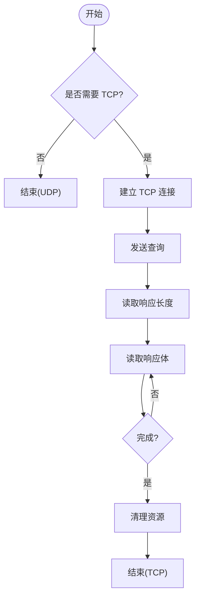
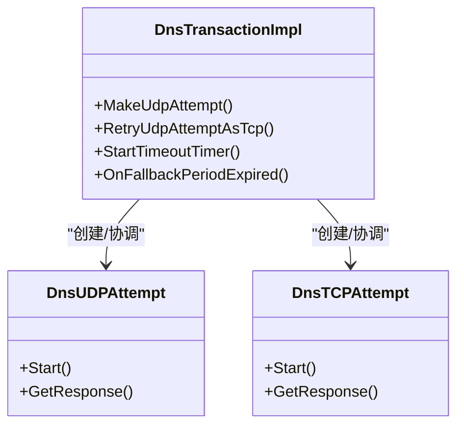
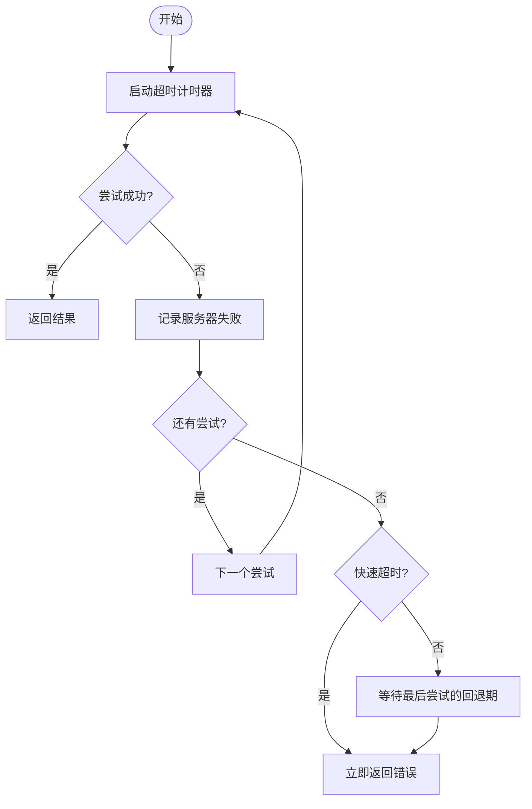
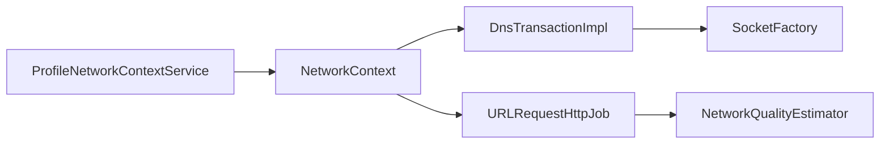

# 连接管理

本文引用的文件

- [profile_network_context_service.cc](https://github.com/Mcloud136/Mcloud-Browser/blob/main/src/chrome/browser/net/profile_network_context_service.cc)
- [dns_transaction.cc](https://github.com/Mcloud136/Mcloud-Browser/blob/main/src/net/dns/dns_transaction.cc)
- [url_request_http_job.cc](https://github.com/Mcloud136/Mcloud-Browser/blob/main/src/net/url_request/url_request_http_job.cc)
- [manpage.1.in](https://github.com/Mcloud136/Mcloud-Browser/blob/main/src/chrome/app/resources/manpage.1.in)
- [ui_chromeos_strings.grd](https://github.com/Mcloud136/Mcloud-Browser/blob/main/src/ui/chromeos/ui_chromeos_strings.grd)
- [components_settings_strings.grdp](https://github.com/Mcloud136/Mcloud-Browser/blob/main/src/components/components_settings_strings.grdp)

## 目录
1. [简介](#简介)
2. [项目结构](#项目结构)
3. [核心组件](#核心组件)
4. [架构总览](#架构总览)
5. [详细组件分析](#详细组件分析)
6. [依赖关系分析](#依赖关系分析)
7. [性能考量](#性能考量)
8. [故障排查指南](#故障排查指南)
9. [结论](#结论)
10. [附录](#附录)

## 简介
本文件聚焦 MCloud Browser 的网络连接管理，围绕连接池与连接复用、TCP 连接的建立/维护/销毁、连接优先级调度、超时与重试（含指数退避与故障转移）、代理与 SOCKS5 支持、以及连接性能监控与调试方法展开。文档基于仓库中的网络上下文配置、DNS 事务实现、HTTP 请求完成流程与命令行帮助等源码片段进行说明，力求以循序渐进的方式呈现从高层到代码级的完整视图。

## 项目结构
MCloud Browser 的网络能力由浏览器进程中的 ProfileNetworkContextService 统一配置并下发至 Network Service；底层 DNS 解析、UDP/TCP 尝试、DoH 探测与回退、以及 HTTP 请求生命周期在 net 层实现。关键路径包括：
- 浏览器侧：ProfileNetworkContextService 负责按 Profile/Partition 构造 NetworkContextParams，启用缓存、认证策略、证书策略等。
- DNS 层：DnsTransactionImpl 组织 UDP/TCP/DoH 多种尝试，处理失败回退、超时与退避。
- HTTP 层：URLRequestHttpJob 完成请求后上报网络质量估计器并记录指标。
- 代理与协议：命令行帮助文档明确支持 http/socks/socks4/socks5 等代理方案。

图表来源
- [profile_network_context_service.cc:570-597](https://github.com/Mcloud136/Mcloud-Browser/blob/main/src/chrome/browser/net/profile_network_context_service.cc#L570-L597)
- [dns_transaction.cc:1410-1470](https://github.com/Mcloud136/Mcloud-Browser/blob/main/src/net/dns/dns_transaction.cc#L1410-L1470)
- [dns_transaction.cc:713-885](https://github.com/Mcloud136/Mcloud-Browser/blob/main/src/net/dns/dns_transaction.cc#L713-L885)
- [url_request_http_job.cc:2149-2164](https://github.com/Mcloud136/Mcloud-Browser/blob/main/src/net/url_request/url_request_http_job.cc#L2149-L2164)

章节来源
- [profile_network_context_service.cc:570-597](https://github.com/Mcloud136/Mcloud-Browser/blob/main/src/chrome/browser/net/profile_network_context_service.cc#L570-L597)
- [dns_transaction.cc:1410-1470](https://github.com/Mcloud136/Mcloud-Browser/blob/main/src/net/dns/dns_transaction.cc#L1410-L1470)
- [dns_transaction.cc:713-885](https://github.com/Mcloud136/Mcloud-Browser/blob/main/src/net/dns/dns_transaction.cc#L713-L885)
- [url_request_http_job.cc:2149-2164](https://github.com/Mcloud136/Mcloud-Browser/blob/main/src/net/url_request/url_request_http_job.cc#L2149-L2164)

## 核心组件
- 网络上下文配置（ProfileNetworkContextService）
  - 负责为每个存储分区创建/配置 NetworkContextParams，开启 HTTP 缓存、设置认证策略、证书策略、语言头、QUIC 开关等。
  - 通过监听偏好变化动态更新网络行为（如 Accept-Language、Referrers、CT 策略、证书列表）。
- DNS 事务（DnsTransactionImpl）
  - 编排 UDP/TCP/DoH 多路尝试，处理服务器失败、超时、回退周期、TCP 升级重试、指数退避探测。
- HTTP 请求完成（URLRequestHttpJob）
  - 请求完成后通知网络质量估计器，记录完成直方图，设置响应体长度等。
- 代理与 SOCKS5
  - 命令行帮助文档明确支持 http/socks/socks4/socks5，并可按 URL 类型指定不同代理。

章节来源
- [profile_network_context_service.cc:570-597](https://github.com/Mcloud136/Mcloud-Browser/blob/main/src/chrome/browser/net/profile_network_context_service.cc#L570-L597)
- [profile_network_context_service.cc:638-658](https://github.com/Mcloud136/Mcloud-Browser/blob/main/src/chrome/browser/net/profile_network_context_service.cc#L638-L658)
- [dns_transaction.cc:1410-1470](https://github.com/Mcloud136/Mcloud-Browser/blob/main/src/net/dns/dns_transaction.cc#L1410-L1470)
- [dns_transaction.cc:959-975](https://github.com/Mcloud136/Mcloud-Browser/blob/main/src/net/dns/dns_transaction.cc#L959-L975)
- [url_request_http_job.cc:2149-2164](https://github.com/Mcloud136/Mcloud-Browser/blob/main/src/net/url_request/url_request_http_job.cc#L2149-L2164)
- [manpage.1.in:43-84](https://github.com/Mcloud136/Mcloud-Browser/blob/main/src/chrome/app/resources/manpage.1.in#L43-L84)

## 架构总览
下图展示从浏览器进程发起网络请求到 DNS 解析、TCP/UDP 传输、HTTP 完成的关键交互。

图表来源
- [profile_network_context_service.cc:570-597](https://github.com/Mcloud136/Mcloud-Browser/blob/main/src/chrome/browser/net/profile_network_context_service.cc#L570-L597)
- [dns_transaction.cc:1410-1470](https://github.com/Mcloud136/Mcloud-Browser/blob/main/src/net/dns/dns_transaction.cc#L1410-L1470)
- [dns_transaction.cc:713-885](https://github.com/Mcloud136/Mcloud-Browser/blob/main/src/net/dns/dns_transaction.cc#L713-L885)
- [url_request_http_job.cc:2149-2164](https://github.com/Mcloud136/Mcloud-Browser/blob/main/src/net/url_request/url_request_http_job.cc#L2149-L2164)

## 详细组件分析

### 连接池与连接复用策略
- 连接池位置与职责
  - 浏览器进程通过 ProfileNetworkContextService 为每个 StoragePartition 配置 NetworkContextParams，其中包含 HTTP 缓存、认证策略、证书策略等，这些参数直接影响底层连接复用与缓存命中。
  - 网络服务内部维护 SocketFactory、连接池与缓存后端，浏览器侧通过参数注入控制其启用与行为。
- 连接复用要点
  - 启用 HTTP 缓存可提升重复资源加载效率。
  - 认证凭据与隔离键影响连接共享范围（例如是否跨隔离域复用）。
  - QUIC 开关会影响基于 UDP 的复用与多路复用能力。
- 连接生命周期
  - 建立：DNS 解析成功后，HTTP 层根据目标地址与策略建立 TCP/QUIC 连接。
  - 维护：Keep-Alive、连接健康检查、错误恢复与重连。
  - 销毁：空闲超时、最大连接数限制、进程关闭时清理。

章节来源
- [profile_network_context_service.cc:570-597](https://github.com/Mcloud136/Mcloud-Browser/blob/main/src/chrome/browser/net/profile_network_context_service.cc#L570-L597)
- [profile_network_context_service.cc:638-658](https://github.com/Mcloud136/Mcloud-Browser/blob/main/src/chrome/browser/net/profile_network_context_service.cc#L638-L658)

### TCP 连接的建立、维护与销毁
- 建立
  - DNS 层在 UDP 不可用或需要大响应时切换到 TCP（ERR_DNS_SERVER_REQUIRES_TCP），使用 StreamSocket 建立连接并发送查询。
- 维护
  - 读写状态机驱动，分片写入与读取，处理部分读/写与缓冲区耗尽。
- 销毁
  - 错误回调触发清理，取消未完成尝试，释放套接字与缓冲。

图表来源
- [dns_transaction.cc:1472-1487](https://github.com/Mcloud136/Mcloud-Browser/blob/main/src/net/dns/dns_transaction.cc#L1472-L1487)
- [dns_transaction.cc:713-885](https://github.com/Mcloud136/Mcloud-Browser/blob/main/src/net/dns/dns_transaction.cc#L713-L885)

章节来源
- [dns_transaction.cc:1472-1487](https://github.com/Mcloud136/Mcloud-Browser/blob/main/src/net/dns/dns_transaction.cc#L1472-L1487)
- [dns_transaction.cc:713-885](https://github.com/Mcloud136/Mcloud-Browser/blob/main/src/net/dns/dns_transaction.cc#L713-L885)

### 连接优先级调度机制
- 多路尝试与优先级
  - DNS 事务同时维护多个尝试（UDP/TCP/DoH），按策略选择下一个尝试，并在失败时回退到下一类或下一台服务器。
- 关键资源优先获取
  - 对 DoH 等安全通道采用独立探测与回退周期，确保关键解析路径可用。
  - 失败时记录服务器失败并继续尝试其他路径，避免单点阻塞。

图表来源
- [dns_transaction.cc:1410-1470](https://github.com/Mcloud136/Mcloud-Browser/blob/main/src/net/dns/dns_transaction.cc#L1410-L1470)
- [dns_transaction.cc:713-885](https://github.com/Mcloud136/Mcloud-Browser/blob/main/src/net/dns/dns_transaction.cc#L713-L885)

章节来源
- [dns_transaction.cc:1410-1470](https://github.com/Mcloud136/Mcloud-Browser/blob/main/src/net/dns/dns_transaction.cc#L1410-L1470)
- [dns_transaction.cc:713-885](https://github.com/Mcloud136/Mcloud-Browser/blob/main/src/net/dns/dns_transaction.cc#L713-L885)

### 超时处理与重试策略（指数退避与故障转移）
- 超时
  - DNS 事务启动超时定时器，区分安全/经典模式的不同超时策略；超时后终止当前尝试并回调上层。
- 重试与回退
  - 当 UDP 需要 TCP 升级时，仅允许一次 TCP 重试，并使用新的查询 ID。
  - 对 DoH 探测使用指数退避策略（初始延迟、增长因子、抖动、上限），持续探测可用性。
- 故障转移
  - 记录服务器失败，若仍有尝试次数则继续尝试下一个服务器或协议；若无更多尝试且处于快速超时模式则立即返回。

图表来源
- [dns_transaction.cc:1729-1750](https://github.com/Mcloud136/Mcloud-Browser/blob/main/src/net/dns/dns_transaction.cc#L1729-L1750)
- [dns_transaction.cc:1648-1683](https://github.com/Mcloud136/Mcloud-Browser/blob/main/src/net/dns/dns_transaction.cc#L1648-L1683)
- [dns_transaction.cc:959-975](https://github.com/Mcloud136/Mcloud-Browser/blob/main/src/net/dns/dns_transaction.cc#L959-L975)

章节来源
- [dns_transaction.cc:1729-1750](https://github.com/Mcloud136/Mcloud-Browser/blob/main/src/net/dns/dns_transaction.cc#L1729-L1750)
- [dns_transaction.cc:1648-1683](https://github.com/Mcloud136/Mcloud-Browser/blob/main/src/net/dns/dns_transaction.cc#L1648-L1683)
- [dns_transaction.cc:959-975](https://github.com/Mcloud136/Mcloud-Browser/blob/main/src/net/dns/dns_transaction.cc#L959-L975)

### 代理服务器支持与 SOCKS5 实现细节
- 支持的代理类型
  - 命令行帮助文档明确支持 http、socks、socks4、socks5，其中 socks 等价于 socks5。
- 按 URL 类型指定代理
  - 可通过前缀为不同 URL 类型指定不同的代理服务器，便于精细化路由。
- 用户界面与设置
  - 设置项中包含 HTTP/SOCKS 代理主机与端口等字段，便于用户配置。

章节来源
- [manpage.1.in:43-84](https://github.com/Mcloud136/Mcloud-Browser/blob/main/src/chrome/app/resources/manpage.1.in#L43-L84)
- [ui_chromeos_strings.grd:1785-1805](https://github.com/Mcloud136/Mcloud-Browser/blob/main/src/ui/chromeos/ui_chromeos_strings.grd#L1785-L1805)

### 连接性能监控与调试方法
- 网络质量估计器
  - HTTP 请求完成后会通知网络质量估计器，用于评估网络状况与优化后续连接策略。
- 指标与日志
  - DNS 事务与 HTTP 请求均记录 NetLog 事件与直方图，可用于定位慢解析、连接失败与超时问题。
- 诊断入口
  - 系统提供连通性诊断相关字符串与工具入口，便于查看设备网络连接与网关等问题。

章节来源
- [url_request_http_job.cc:2149-2164](https://github.com/Mcloud136/Mcloud-Browser/blob/main/src/net/url_request/url_request_http_job.cc#L2149-L2164)
- [dns_transaction.cc:1458-1470](https://github.com/Mcloud136/Mcloud-Browser/blob/main/src/net/dns/dns_transaction.cc#L1458-L1470)
- [chromeos_strings.grd:2238-2280](https://github.com/Mcloud136/Mcloud-Browser/blob/main/src/chromeos/chromeos_strings.grd#L2238-L2280)

## 依赖关系分析
- ProfileNetworkContextService 依赖内容层的 StoragePartition 与 NetworkContext，用于下发配置。
- DNS 事务依赖网络会话上下文提供的 SocketFactory，创建 UDP/TCP 套接字。
- HTTP 请求依赖网络质量估计器与指标记录设施。

图表来源
- [profile_network_context_service.cc:570-597](https://github.com/Mcloud136/Mcloud-Browser/blob/main/src/chrome/browser/net/profile_network_context_service.cc#L570-L597)
- [dns_transaction.cc:1410-1470](https://github.com/Mcloud136/Mcloud-Browser/blob/main/src/net/dns/dns_transaction.cc#L1410-L1470)
- [url_request_http_job.cc:2149-2164](https://github.com/Mcloud136/Mcloud-Browser/blob/main/src/net/url_request/url_request_http_job.cc#L2149-L2164)

章节来源
- [profile_network_context_service.cc:570-597](https://github.com/Mcloud136/Mcloud-Browser/blob/main/src/chrome/browser/net/profile_network_context_service.cc#L570-L597)
- [dns_transaction.cc:1410-1470](https://github.com/Mcloud136/Mcloud-Browser/blob/main/src/net/dns/dns_transaction.cc#L1410-L1470)
- [url_request_http_job.cc:2149-2164](https://github.com/Mcloud136/Mcloud-Browser/blob/main/src/net/url_request/url_request_http_job.cc#L2149-L2164)

## 性能考量
- 启用 HTTP 缓存可减少重复下载与连接开销。
- 合理配置 QUIC 开关可在拥塞网络中提升吞吐与降低时延。
- DNS 多路尝试与回退策略有助于在弱网环境下更快获得解析结果。
- 指数退避探测可降低对不稳定 DoH 服务器的压力，提高整体稳定性。

[本节为通用指导，不直接分析具体文件]

## 故障排查指南
- 常见问题定位
  - DNS 解析失败：检查 UDP/TCP/DoH 各尝试是否都失败，关注回退周期与超时。
  - 连接超时：确认是否触发了快速超时或常规超时，结合 NetLog 查看具体阶段。
  - 代理问题：核对命令行或设置中的代理类型与地址是否正确，必要时切换为直连测试。
- 建议步骤
  - 启用详细日志（NetLog），捕获 DNS 与 HTTP 请求全过程。
  - 观察网络质量估计器的反馈，判断是否为网络拥塞或丢包导致。
  - 调整 QUIC 与缓存策略，对比不同配置下的表现。
  - 使用系统连通性诊断工具检查设备网络与网关状态。

章节来源
- [dns_transaction.cc:1729-1750](https://github.com/Mcloud136/Mcloud-Browser/blob/main/src/net/dns/dns_transaction.cc#L1729-L1750)
- [dns_transaction.cc:1648-1683](https://github.com/Mcloud136/Mcloud-Browser/blob/main/src/net/dns/dns_transaction.cc#L1648-L1683)
- [url_request_http_job.cc:2149-2164](https://github.com/Mcloud136/Mcloud-Browser/blob/main/src/net/url_request/url_request_http_job.cc#L2149-L2164)
- [chromeos_strings.grd:2238-2280](https://github.com/Mcloud136/Mcloud-Browser/blob/main/src/chromeos/chromeos_strings.grd#L2238-L2280)

## 结论
MCloud Browser 的连接管理以 ProfileNetworkContextService 为入口，将缓存、认证、证书等策略注入 NetworkContext；DNS 层通过 UDP/TCP/DoH 多路尝试与指数退避保障解析可靠性；HTTP 层在完成请求后上报网络质量估计器以优化后续连接。配合代理与 SOCKS5 支持，以及完善的日志与诊断工具，形成稳定高效的网络连接体系。

[本节为总结，不直接分析具体文件]

## 附录
- 相关设置与字符串
  - 预测服务与预连接：用于加速页面加载的 DNS 预取、TCP/SSL 预连接与预渲染。
  - 代理设置项：HTTP/SOCKS 代理主机与端口等。

章节来源
- [components_settings_strings.grdp:12-21](https://github.com/Mcloud136/Mcloud-Browser/blob/main/src/components/components_settings_strings.grdp#L12-L21)
- [ui_chromeos_strings.grd:1785-1805](https://github.com/Mcloud136/Mcloud-Browser/blob/main/src/ui/chromeos/ui_chromeos_strings.grd#L1785-L1805)