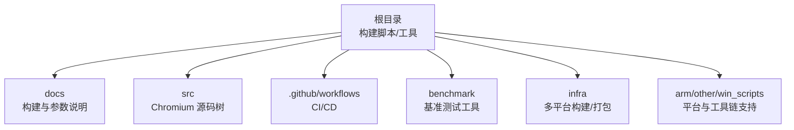
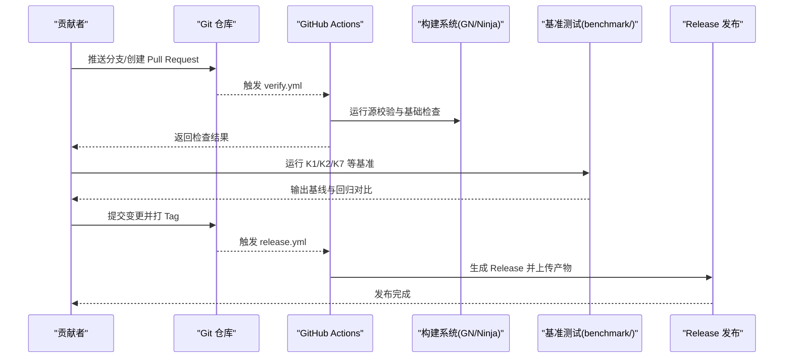
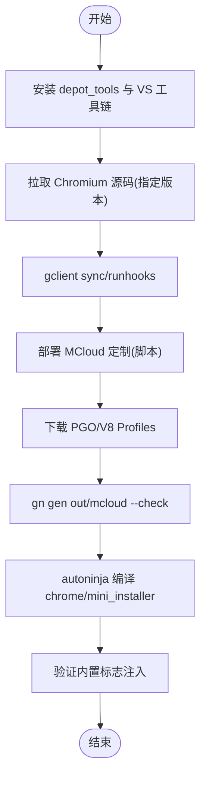
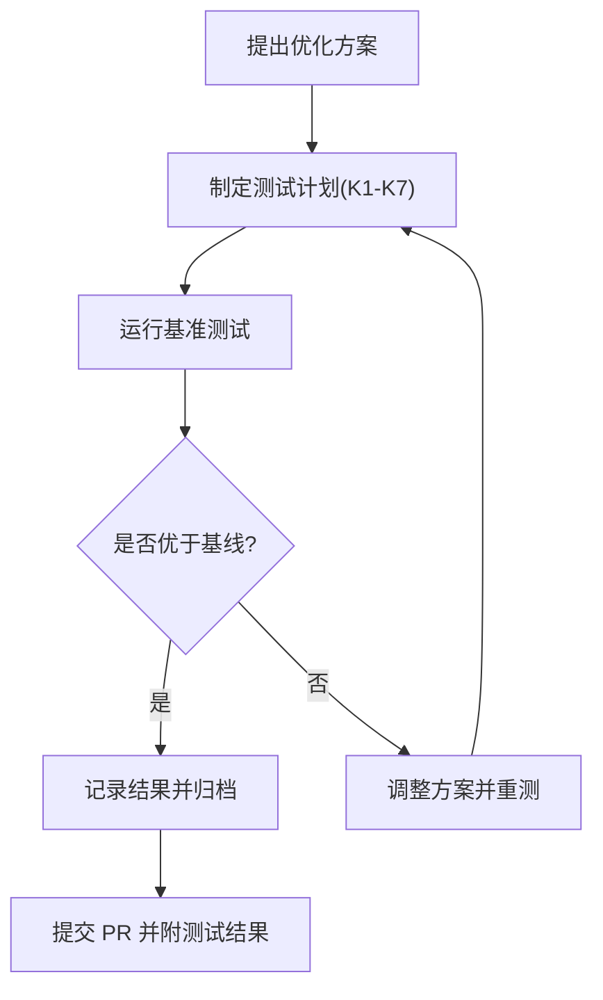
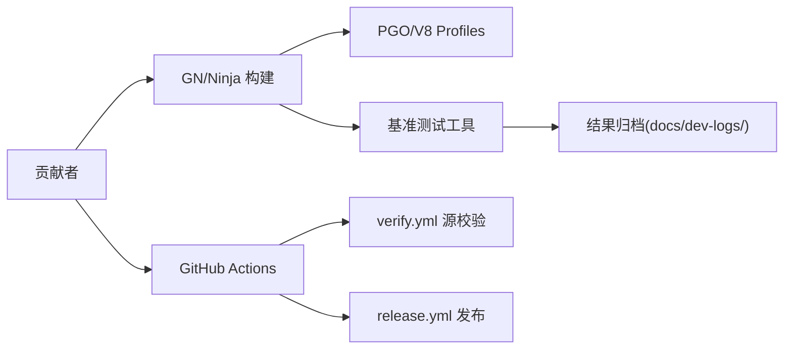

# 贡献指南

<cite>
**本文引用的文件**
- [README.md](file://README.md)
- [CODE_OF_CONDUCT.md](file://CODE_OF_CONDUCT.md)
- [SECURITY.md](file://SECURITY.md)
- [docs/README.md](file://docs/README.md)
- [docs/BUILDING.md](file://docs/BUILDING.md)
- [docs/ABOUT_GN_ARGS.md](file://docs/ABOUT_GN_ARGS.md)
- [docs/FAQ.md](file://docs/FAQ.md)
- [.github/workflows/release.yml](file://.github/workflows/release.yml)
- [.github/workflows/verify.yml](file://.github/workflows/verify.yml)
- [benchmark/README.md](file://benchmark/README.md)
</cite>

## 目录
1. [简介](#简介)
2. [项目结构](#项目结构)
3. [核心组件](#核心组件)
4. [架构总览](#架构总览)
5. [详细组件分析](#详细组件分析)
6. [依赖关系分析](#依赖关系分析)
7. [性能优化贡献指南](#性能优化贡献指南)
8. [故障排查与常见问题](#故障排查与常见问题)
9. [结论](#结论)
10. [附录](#附录)

## 简介
本指南面向希望参与 MCloud Browser 开发的贡献者，涵盖开发环境搭建、代码规范、提交流程、代码审查标准、性能优化贡献方式、文档贡献要求，以及社区行为准则与安全漏洞报告流程。MCloud Browser 基于 Chromium M151，采用 AVX2 原生编译与多项运行时优化标志，聚焦 Windows x64 平台发布，提供高性能浏览体验。

## 项目结构
仓库采用“上层定制 + 下层 Chromium 源码”的组织方式：
- 根目录包含构建脚本、基准测试工具、平台特定配置与打包脚本；
- docs 目录集中了构建说明、GN 参数说明、FAQ 等开发者文档；
- src 为 Chromium 源码树（通过 gclient 同步），MCloud 的定制逻辑通过部署脚本与补丁注入到 Chromium 中；
- .github/workflows 提供发布与验证工作流；
- benchmark 提供性能基线采集与回归检测工具；
- infra 包含 Linux/macOS/Windows 多平台的构建与打包辅助内容；
- arm、other、win_scripts 等目录提供跨平台与 Windows 专用构建支持。

**章节来源**
- [docs/README.md:1-10](file://docs/README.md#L1-L10)
- [README.md:195-264](file://README.md#L195-L264)

## 核心组件
- 构建系统与参数：使用 GN/Ninja，通过 args.gn 与平台特定参数控制编译选项、PGO、ThinLTO、V8 优化等；
- 部署与定制：通过部署脚本将 MCloud 的默认值、flags 加载器注入、Polly/BOLT 接线等应用到 Chromium 源码；
- 基准测试体系：K1-K7 指标覆盖启动、内存、体积、页面加载、JS/WASM、滚动流畅度与视频解码；
- CI/CD：release.yml 负责打 tag 后生成 Release 并上传产物；verify.yml 在 PR 与 main 分支推送时执行源校验；
- 文档与 FAQ：提供构建、参数、常见问题解答与外部站点文档链接。

**章节来源**
- [docs/ABOUT_GN_ARGS.md:1-174](file://docs/ABOUT_GN_ARGS.md#L1-L174)
- [README.md:195-264](file://README.md#L195-L264)
- [benchmark/README.md:1-83](file://benchmark/README.md#L1-L83)
- [.github/workflows/release.yml:1-79](file://.github/workflows/release.yml#L1-L79)
- [.github/workflows/verify.yml:1-26](file://.github/workflows/verify.yml#L1-L26)

## 架构总览
下图展示了从贡献者提交到发布的关键流程，包括本地构建、基准测试、PR 校验与 GitHub Actions 发布。

**图表来源**
- [.github/workflows/verify.yml:1-26](file://.github/workflows/verify.yml#L1-L26)
- [.github/workflows/release.yml:1-79](file://.github/workflows/release.yml#L1-L79)
- [benchmark/README.md:1-83](file://benchmark/README.md#L1-L83)

## 详细组件分析

### 开发与构建环境搭建
- 前置条件：Windows 10/11 x64、Visual Studio 2022/2026 Build Tools、Git、Python 3.8+、足够磁盘与内存；
- depot_tools：克隆并加入 PATH；
- Chromium 源码：定向浅拉取目标 tag，gclient sync 与 runhooks；
- 部署 MCloud 定制：统一入口脚本按序复制 compiler_opt.gni、Polly 接线、AVX2 基线、D3D12/后台模式默认值、flags 加载器注入、mcloud_flags.txt 复制到 out/mcloud；
- PGO 配置：下载匹配版本的 profdata 与 V8 builtins profiles；
- 构建参数：gn gen out/mcloud --check，autoninja 编译 chrome 与 mini_installer；
- 内置标志验证：tools/verify_builtin_flags.ps1。

**图表来源**
- [README.md:195-264](file://README.md#L195-L264)

**章节来源**
- [README.md:195-264](file://README.md#L195-L264)
- [docs/BUILDING.md:122-213](file://docs/BUILDING.md#L122-L213)

### 代码规范与提交流程
- 分支策略：Fork 仓库，创建特性分支（如 feature/amazing-feature）；
- 提交信息：简洁明确，描述变更目的与影响范围；
- 提交前自检：确保构建通过、基准测试无回归；
- 推送与 PR：推送到分支并创建 Pull Request，附上变更说明与测试结果；
- 审查与合并：由维护者进行代码审查，确认符合规范与性能要求后合并。

**章节来源**
- [README.md:379-388](file://README.md#L379-L388)

### 代码审查流程与标准
- 审查重点：
  - 功能正确性与兼容性（不同 CPU/驱动/系统版本）；
  - 性能影响（启动、内存、体积、渲染、网络）；
  - 安全性（避免引入漏洞或绕过安全机制）；
  - 可维护性（代码清晰、注释充分、模块化）；
- 审查意见处理：
  - 根据评论逐项修改并补充测试或基准数据；
  - 必要时回滚或调整方案；
- 合并要求：
  - 所有 CI 检查通过；
  - 基准测试无显著回归；
  - 文档更新完整（如有）。

**章节来源**
- [.github/workflows/verify.yml:1-26](file://.github/workflows/verify.yml#L1-L26)
- [benchmark/README.md:65-83](file://benchmark/README.md#L65-L83)

### 性能优化贡献指导
- 基准测试编写与执行：
  - 使用 benchmark/ 下的自动化脚本（bench_startup.ps1、bench_memory.ps1、bench_size.ps1）；
  - 手工流程（K3-K6）遵循 README 中的步骤，记录环境与结果；
- 性能回归检测：
  - 每次优化前后跑全套 K1-K7；
  - 与同版本 stock Chromium 对照；
  - 结果归档至 docs/dev-logs/，并在 README/CHANGELOG 中引用。
- 优化项验证：
  - 使用 tools/check_features.py 校验 feature 清单有效性；
  - 对新增/修改的标志进行子进程注入验证（verify_builtin_flags.ps1）。

**图表来源**
- [benchmark/README.md:1-83](file://benchmark/README.md#L1-L83)

**章节来源**
- [benchmark/README.md:1-83](file://benchmark/README.md#L1-L83)
- [README.md:357-375](file://README.md#L357-L375)

### 文档贡献方式与要求
- 文档位置：docs 目录为主，包含构建说明、GN 参数、FAQ、决策记录等；
- 更新原则：
  - 保持与实际构建流程一致；
  - 及时更新参数说明与平台差异；
  - 对外部链接进行有效性检查；
- 贡献方式：
  - Fork 仓库，创建分支，修改文档并提交 PR；
  - 在 PR 中说明变更内容与影响范围。

**章节来源**
- [docs/README.md:1-10](file://docs/README.md#L1-L10)
- [docs/ABOUT_GN_ARGS.md:1-174](file://docs/ABOUT_GN_ARGS.md#L1-L174)
- [docs/FAQ.md:1-69](file://docs/FAQ.md#L1-L69)

### 社区行为准则
- 尊重与建设性：讨论围绕 MCloud Browser 与 Chromium，关注功能与代码，避免人身攻击；
- 发声机制：遇到不当行为可礼貌指出，或通过邮件联系社区经理；
- 禁止行为：骚扰、恐吓、持续破坏讨论、分发隐私信息等；
- 违规后果：警告、临时或永久封禁等。

**章节来源**
- [CODE_OF_CONDUCT.md:1-87](file://CODE_OF_CONDUCT.md#L1-L87)

### 安全漏洞报告流程
- Chromium 漏洞：上报至上游 Chromium 问题跟踪；
- MCloud Browser 漏洞：在 GitHub 创建 Issue，重大或零日漏洞直接发送邮件；
- 历史修复：参考 SECURITY.md 中的主要漏洞修复列表。

**章节来源**
- [SECURITY.md:1-21](file://SECURITY.md#L1-L21)

## 依赖关系分析
- 构建依赖：GN/Ninja、Python、VS 工具链、depot_tools；
- 性能优化依赖：PGO profdata、V8 builtins profiles、可选 Polly/BOLT；
- 基准测试依赖：PowerShell 脚本、Lighthouse、Speedometer/JetStream（手工流程）；
- CI 依赖：GitHub Actions、Python 3.12（verify.yml）、Node 24（环境变量强制）。

**图表来源**
- [docs/ABOUT_GN_ARGS.md:1-174](file://docs/ABOUT_GN_ARGS.md#L1-L174)
- [.github/workflows/verify.yml:1-26](file://.github/workflows/verify.yml#L1-L26)
- [.github/workflows/release.yml:1-79](file://.github/workflows/release.yml#L1-L79)
- [benchmark/README.md:1-83](file://benchmark/README.md#L1-L83)

**章节来源**
- [docs/ABOUT_GN_ARGS.md:1-174](file://docs/ABOUT_GN_ARGS.md#L1-L174)
- [.github/workflows/verify.yml:1-26](file://.github/workflows/verify.yml#L1-L26)
- [.github/workflows/release.yml:1-79](file://.github/workflows/release.yml#L1-L79)
- [benchmark/README.md:1-83](file://benchmark/README.md#L1-L83)

## 性能优化贡献指南
- 基准测试执行：
  - 自动脚本：bench_startup.ps1、bench_memory.ps1、bench_size.ps1；
  - 手工流程：K3-K6 遵循 README 步骤，记录环境与结果；
- 对照基准：
  - 每次发布前执行 K1-K7 全套；
  - 与同版本 stock Chromium 对照；
  - 内核升级前后各跑一次全套，附回归对比表；
- 结果归档：
  - 使用 docs/dev-logs/benchmark-template.md 模板归档；
  - README/CHANGELOG 中的性能数字必须可追溯到归档数据。

**章节来源**
- [benchmark/README.md:1-83](file://benchmark/README.md#L1-L83)
- [README.md:357-375](file://README.md#L357-L375)

## 故障排查与常见问题
- 构建失败：检查依赖安装、depot_tools 路径、args.gn 配置；
- 基准测试异常：确保电源模式、无扩展、清空缓存、固定环境；
- 内置标志未注入：使用 tools/verify_builtin_flags.ps1 验证；
- 更多问题：参考 docs/FAQ.md 与 docs/BUILDING.md 的调试章节。

**章节来源**
- [docs/FAQ.md:1-69](file://docs/FAQ.md#L1-L69)
- [docs/BUILDING.md:279-283](file://docs/BUILDING.md#L279-L283)

## 结论
本指南提供了参与 MCloud Browser 开发的完整路径：从环境搭建、代码规范、提交流程到性能优化与文档贡献，同时明确了社区行为准则与安全漏洞报告流程。建议新贡献者先熟悉构建与基准测试体系，再逐步深入源码定制与优化。

## 附录
- 快速链接：
  - 构建说明：docs/BUILDING.md；
  - GN 参数说明：docs/ABOUT_GN_ARGS.md；
  - 常见问题：docs/FAQ.md；
  - 基准测试：benchmark/README.md；
  - CI/CD：.github/workflows/*.yml。

**章节来源**
- [docs/BUILDING.md:1-352](file://docs/BUILDING.md#L1-L352)
- [docs/ABOUT_GN_ARGS.md:1-174](file://docs/ABOUT_GN_ARGS.md#L1-L174)
- [docs/FAQ.md:1-69](file://docs/FAQ.md#L1-L69)
- [benchmark/README.md:1-83](file://benchmark/README.md#L1-L83)
- [.github/workflows/release.yml:1-79](file://.github/workflows/release.yml#L1-L79)
- [.github/workflows/verify.yml:1-26](file://.github/workflows/verify.yml#L1-L26)