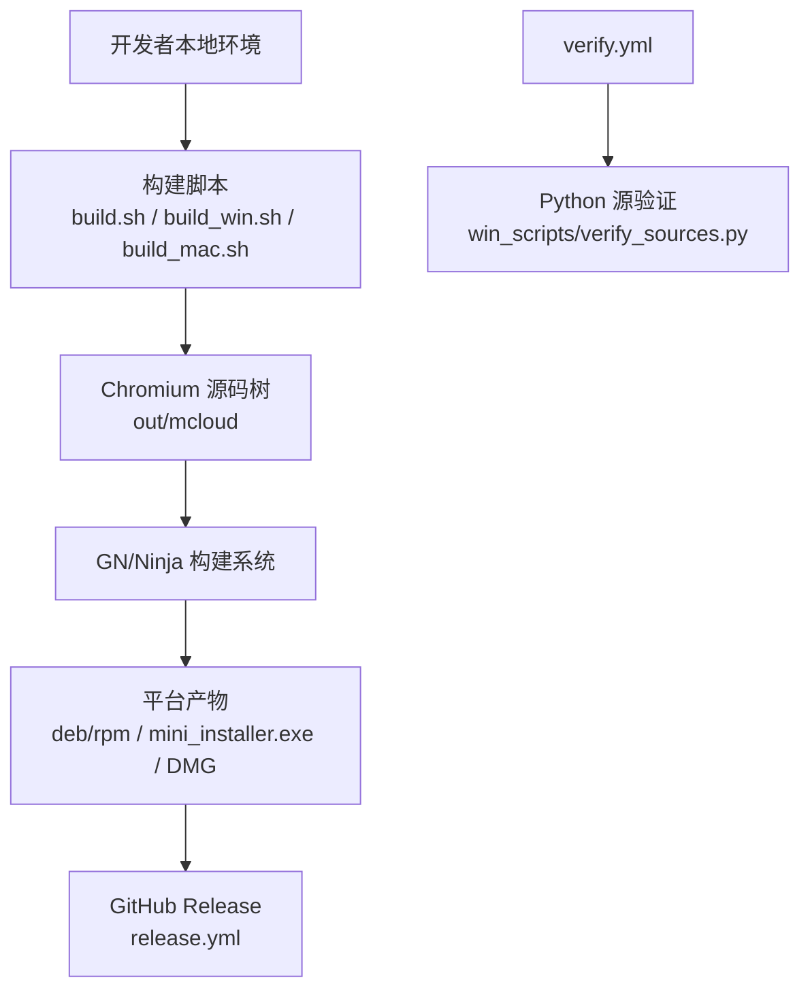
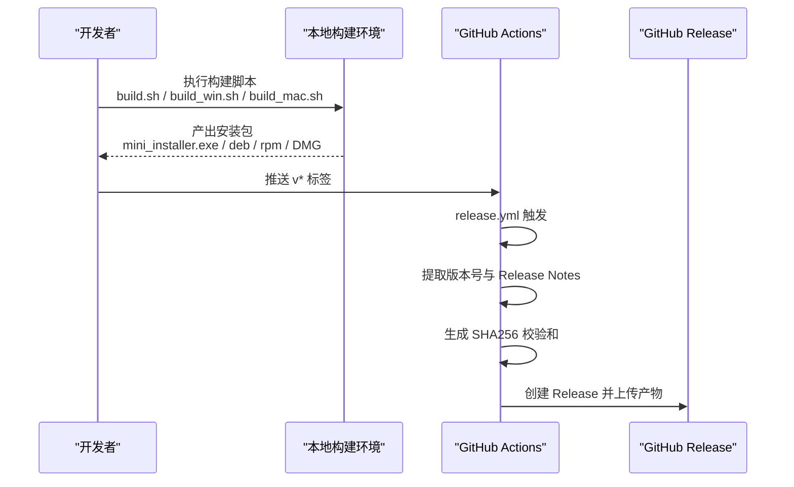
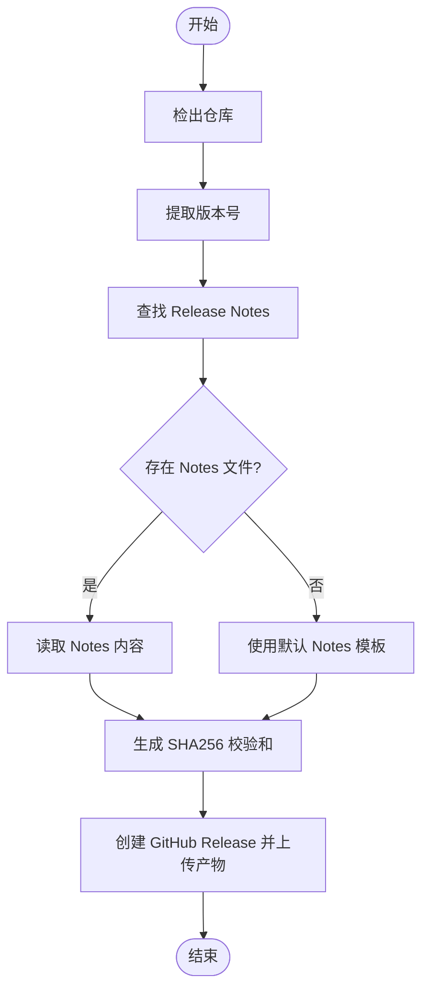
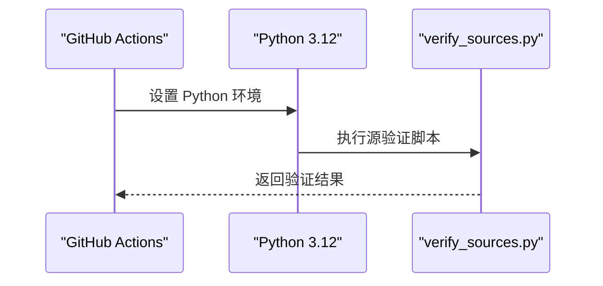
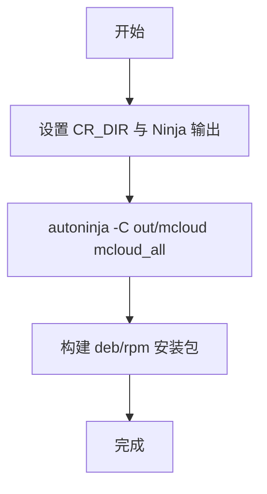
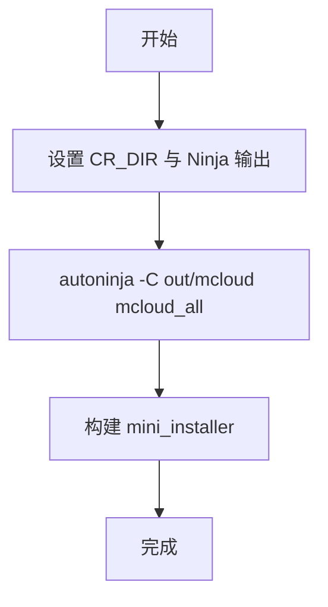
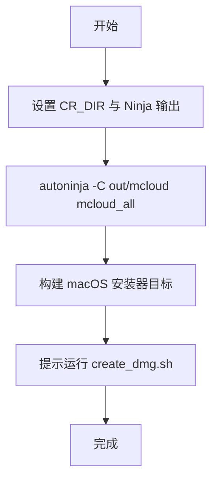
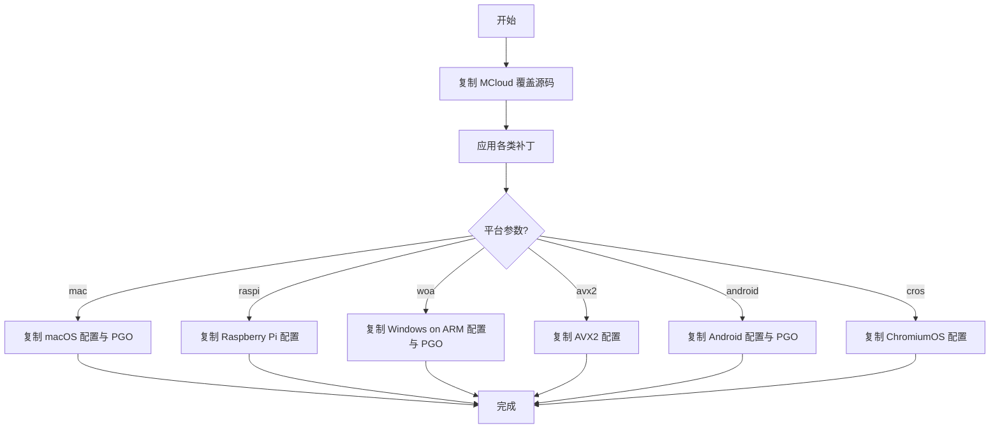
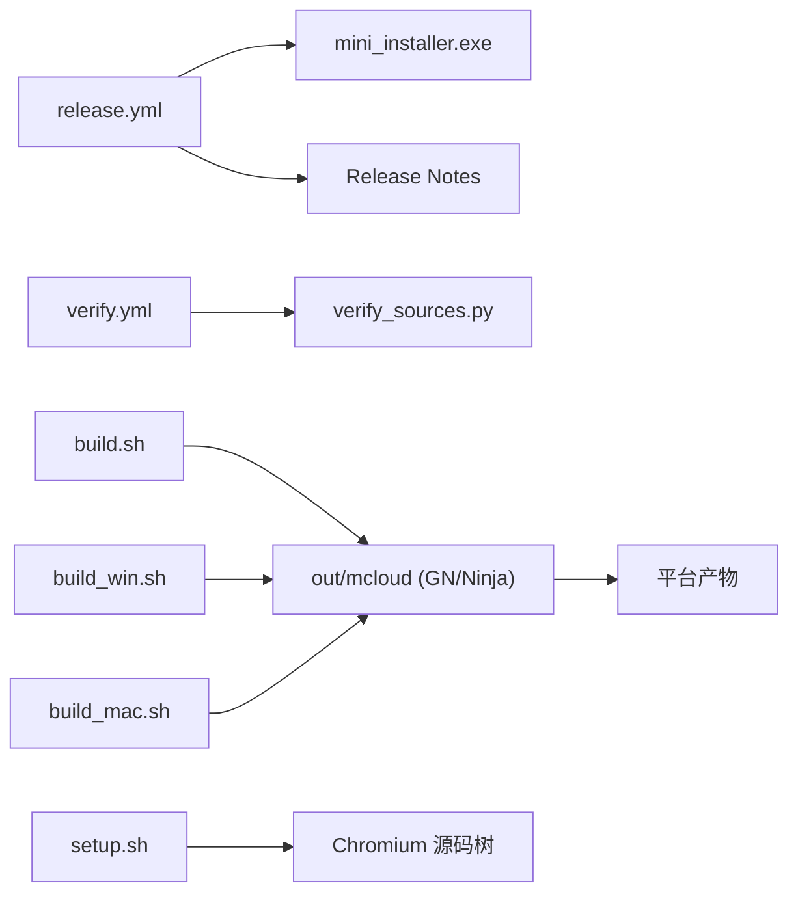

# CI/CD 流水线

<cite>
**本文引用的文件**
- [release.yml](file://.github/workflows/release.yml)
- [verify.yml](file://.github/workflows/verify.yml)
- [build.sh](file://build.sh)
- [build_win.sh](file://build_win.sh)
- [build_mac.sh](file://build_mac.sh)
- [setup.sh](file://setup.sh)
- [args.gn](file://args.gn)
- [win_args.gn](file://win_args.gn)
- [README.md](file://README.md)
- [BUILDING.md](file://docs/BUILDING.md)
- [BUILDING_WIN.md](file://docs/BUILDING_WIN.md)
- [2026-06-20-cicd-workflow-design.md](file://docs/superpowers/specs/2026-06-20-cicd-workflow-design.md)
- [2026-06-20-cicd-workflow.md](file://docs/superpowers/plans/2026-06-20-cicd-workflow.md)
</cite>

## 目录
1. [简介](#简介)
2. [项目结构](#项目结构)
3. [核心组件](#核心组件)
4. [架构总览](#架构总览)
5. [详细组件分析](#详细组件分析)
6. [依赖关系分析](#依赖关系分析)
7. [性能考量](#性能考量)
8. [故障排除指南](#故障排除指南)
9. [结论](#结论)
10. [附录](#附录)

## 简介
本文件面向 MCloud Browser 的 CI/CD 流水线，聚焦 GitHub Actions 工作流配置、触发条件、并行构建策略、缓存与依赖管理、Windows 平台自动化构建流程（源码获取、依赖安装、编译优化、测试执行、产物生成），以及 Linux/macOS 构建差异与适配。同时提供本地模拟 CI 环境的构建方法与常见问题排查建议，并总结构建性能优化技巧。

当前仓库采用“简化发布”策略：CI 不负责完整编译，仅负责在推送 v* 标签时读取 Release Notes 并上传已生成的安装包到 GitHub Release；验证类任务用于检查脚本与源码一致性。

## 项目结构
- 工作流定义位于 .github/workflows：
  - release.yml：推送 v* 标签时创建 GitHub Release，读取 Release Notes，生成 SHA256 校验和并上传产物。
  - verify.yml：在 push main、PR 或手动触发时运行 Python 源验证脚本。
- 构建脚本：
  - build.sh：Linux 构建入口，调用 autoninja 构建 mcloud_all 并打包 deb/rpm。
  - build_win.sh：Windows 构建入口，调用 autoninja 构建 mcloud_all 并生成 mini_installer。
  - build_mac.sh：macOS 构建入口，构建 mcloud_all 及 macOS 安装器目标。
  - setup.sh：将 MCloud 覆盖源码与补丁应用到 Chromium 树，并按平台参数复制额外资源与 PGO 配置。
- GN 构建参数：
  - args.gn：Linux 默认发布构建参数（含 LTO、V8 优化、媒体解码、Widevine 等）。
  - win_args.gn：Windows 发布构建参数（含 CFG、LTO、V8 优化、媒体解码、Widevine 等）。
- 文档：
  - README.md 中说明了当前 CI/CD 简化策略与本地构建+发布流程。
  - BUILDING.md / BUILDING_WIN.md 提供了各平台构建前置、GN 参数与构建命令说明。
  - docs/superpowers 下包含 CI/CD 设计与计划文档，解释为何选择“本地编译 + CI 发布”的架构。

**图示来源**
- [release.yml:1-79](file://.github/workflows/release.yml#L1-L79)
- [verify.yml:1-26](file://.github/workflows/verify.yml#L1-L26)
- [build.sh:1-59](file://build.sh#L1-L59)
- [build_win.sh:1-59](file://build_win.sh#L1-L59)
- [build_mac.sh:1-84](file://build_mac.sh#L1-L84)

**章节来源**
- [release.yml:1-79](file://.github/workflows/release.yml#L1-L79)
- [verify.yml:1-26](file://.github/workflows/verify.yml#L1-L26)
- [build.sh:1-59](file://build.sh#L1-L59)
- [build_win.sh:1-59](file://build_win.sh#L1-L59)
- [build_mac.sh:1-84](file://build_mac.sh#L1-L84)
- [setup.sh:1-408](file://setup.sh#L1-L408)
- [args.gn:1-87](file://args.gn#L1-L87)
- [win_args.gn:1-87](file://win_args.gn#L1-L87)
- [README.md:265-301](file://README.md#L265-L301)
- [BUILDING.md:1-352](file://docs/BUILDING.md#L1-L352)
- [BUILDING_WIN.md:1-288](file://docs/BUILDING_WIN.md#L1-L288)
- [2026-06-20-cicd-workflow-design.md:1-144](file://docs/superpowers/specs/2026-06-20-cicd-workflow-design.md#L1-L144)
- [2026-06-20-cicd-workflow.md:1-271](file://docs/superpowers/plans/2026-06-20-cicd-workflow.md#L1-L271)

## 核心组件
- GitHub Actions 工作流
  - release.yml：监听 v* 标签推送，提取版本号，查找最新 Release Notes，生成 SHA256 校验和，使用 softprops/action-gh-release 创建 Release 并上传安装包。
  - verify.yml：在 push main、PR、workflow_dispatch 时运行 Python 源验证脚本，确保源码与脚本一致性。
- 构建脚本
  - build.sh：设置 Ninja 输出摘要与状态，进入 Chromium 源码目录，构建 mcloud_all，再构建 Linux 安装包（deb/rpm）。
  - build_win.sh：类似地构建 mcloud_all 并生成 mini_installer。
  - build_mac.sh：构建 mcloud_all 并生成 macOS 安装器目标，提示后续创建 DMG。
- 源码准备与补丁
  - setup.sh：复制 MCloud 覆盖源码与补丁到 Chromium 树，按平台参数（--mac/--raspi/--woa/--avx2/--android/--cros）复制特定资源与 PGO 配置，并应用一系列补丁（HEVC、FTP、GPC、UI、WebUI、更新器等）。
- GN 构建参数
  - args.gn / win_args.gn：定义目标 OS/CPU、是否官方构建、调试开关、符号级别、LTO、V8 优化、媒体解码、Widevine、PGO 数据路径等。

**章节来源**
- [release.yml:1-79](file://.github/workflows/release.yml#L1-L79)
- [verify.yml:1-26](file://.github/workflows/verify.yml#L1-L26)
- [build.sh:1-59](file://build.sh#L1-L59)
- [build_win.sh:1-59](file://build_win.sh#L1-L59)
- [build_mac.sh:1-84](file://build_mac.sh#L1-L84)
- [setup.sh:1-408](file://setup.sh#L1-L408)
- [args.gn:1-87](file://args.gn#L1-L87)
- [win_args.gn:1-87](file://win_args.gn#L1-L87)

## 架构总览
当前 CI/CD 采用“本地编译 + CI 发布”的简化架构，避免在云端进行耗时且昂贵的 Chromium 全量编译。本地完成构建后，推送 v* 标签触发 release.yml，自动创建 Release 并上传安装包与校验和。verify.yml 作为轻量级验证任务，保证脚本与源码一致性。

**图示来源**
- [release.yml:1-79](file://.github/workflows/release.yml#L1-L79)
- [build.sh:1-59](file://build.sh#L1-L59)
- [build_win.sh:1-59](file://build_win.sh#L1-L59)
- [build_mac.sh:1-84](file://build_mac.sh#L1-L84)
- [README.md:265-301](file://README.md#L265-L301)

## 详细组件分析

### 发布工作流（release.yml）
- 触发条件：push 标签匹配 v*。
- 权限：contents: write。
- 步骤：
  - 检出仓库（fetch-depth: 0 以支持读取历史）。
  - 从标签提取版本号。
  - 查找 docs/superpowers/specs 下的最新 release-notes*.md，若不存在则使用默认模板。
  - 生成 mini_installer.exe 的 SHA256 校验和。
  - 使用 softprops/action-gh-release 创建 Release，上传安装包与校验和。

**图示来源**
- [release.yml:1-79](file://.github/workflows/release.yml#L1-L79)

**章节来源**
- [release.yml:1-79](file://.github/workflows/release.yml#L1-L79)

### 验证工作流（verify.yml）
- 触发条件：push main、pull_request、workflow_dispatch。
- 步骤：
  - 检出仓库。
  - 设置 Python 3.12。
  - 运行 win_scripts/verify_sources.py 进行源验证。

**图示来源**
- [verify.yml:1-26](file://.github/workflows/verify.yml#L1-L26)

**章节来源**
- [verify.yml:1-26](file://.github/workflows/verify.yml#L1-L26)

### Linux 构建流程（build.sh）
- 环境变量：CR_DIR 指定 Chromium 源码目录，默认 ~/chromium/src。
- 构建目标：mcloud_all，随后构建 stable_deb 与 stable_rpm。
- Ninja 输出：启用 NINJA_SUMMARIZE_BUILD 与 NINJA_STATUS 提升可读性。

**图示来源**
- [build.sh:1-59](file://build.sh#L1-L59)

**章节来源**
- [build.sh:1-59](file://build.sh#L1-L59)

### Windows 构建流程（build_win.sh）
- 环境变量：CR_DIR 指定 Chromium 源码目录，默认 ~/chromium/src。
- 构建目标：mcloud_all，随后构建 mcloud_installer（mini_installer）。
- 产物位置：out/mcloud/mcloud_mini_installer.exe。

**图示来源**
- [build_win.sh:1-59](file://build_win.sh#L1-L59)

**章节来源**
- [build_win.sh:1-59](file://build_win.sh#L1-L59)

### macOS 构建流程（build_mac.sh）
- 构建目标：mcloud_all，随后构建 chrome/installer/mac 与 minidump_stackwalk。
- 提示：构建完成后运行 create_dmg.sh 生成 DMG。

**图示来源**
- [build_mac.sh:1-84](file://build_mac.sh#L1-L84)

**章节来源**
- [build_mac.sh:1-84](file://build_mac.sh#L1-L84)

### 源码准备与补丁（setup.sh）
- 复制 MCloud 覆盖源码至 Chromium 树。
- 按平台参数复制第三方库与配置文件：
  - --mac：复制 mac ARM 配置与 PGO 配置。
  - --raspi/--arm64：复制 Raspberry Pi 相关构建文件与版本信息。
  - --woa：复制 Windows on ARM 相关配置与 PGO 配置。
  - --avx2/--avx512：复制对应 SIMD 变体的第三方库与 wrapper。
  - --android：复制 Android 构建文件与 PGO 配置。
  - --cros：复制 ChromiumOS 构建文件与版本信息。
- 应用补丁：HEVC、FTP、GPC、UI、WebUI、更新器、快捷键、隐私沙盒、崩溃修复、deb 依赖生成等。

**图示来源**
- [setup.sh:1-408](file://setup.sh#L1-L408)

**章节来源**
- [setup.sh:1-408](file://setup.sh#L1-L408)

### GN 构建参数（args.gn / win_args.gn）
- 公共优化：is_official_build=true、symbol_level=0、use_lld=true、use_icf=true、thin_lto_enable_optimizations=true、v8_* 优化、media_use_ffmpeg/libvpx、enable_widevine/bundle_widevine_cdm。
- Linux 特有：target_os="linux"、enable_linux_installer=true、disable_fieldtrial_testing_config=true、optimize_webui=true。
- Windows 特有：target_os="win"、win_enable_cfg_guards=true、enable_discovery=false、enable_media_drm_storage=true、enable_rlz=true。
- PGO：chrome_pgo_phase=2，pgo_data_path 指向下载的 profdata 文件。

**章节来源**
- [args.gn:1-87](file://args.gn#L1-L87)
- [win_args.gn:1-87](file://win_args.gn#L1-L87)

## 依赖关系分析
- 工作流与脚本依赖：
  - release.yml 依赖本地产物 mini_installer.exe 与 Release Notes 文件。
  - verify.yml 依赖 Python 环境与 win_scripts/verify_sources.py。
- 构建脚本与 GN：
  - build.sh/build_win.sh/build_mac.sh 依赖 GN 生成的 out/mcloud 目录与对应的构建目标。
  - setup.sh 依赖 Chromium 源码树与补丁集合，按平台参数注入配置。
- 平台差异：
  - Linux：构建 deb/rpm 安装包。
  - Windows：构建 mini_installer。
  - macOS：构建安装器目标并提示生成 DMG。

**图示来源**
- [release.yml:1-79](file://.github/workflows/release.yml#L1-L79)
- [verify.yml:1-26](file://.github/workflows/verify.yml#L1-L26)
- [build.sh:1-59](file://build.sh#L1-L59)
- [build_win.sh:1-59](file://build_win.sh#L1-L59)
- [build_mac.sh:1-84](file://build_mac.sh#L1-L84)
- [setup.sh:1-408](file://setup.sh#L1-L408)

**章节来源**
- [release.yml:1-79](file://.github/workflows/release.yml#L1-L79)
- [verify.yml:1-26](file://.github/workflows/verify.yml#L1-L26)
- [build.sh:1-59](file://build.sh#L1-L59)
- [build_win.sh:1-59](file://build_win.sh#L1-L59)
- [build_mac.sh:1-84](file://build_mac.sh#L1-L84)
- [setup.sh:1-408](file://setup.sh#L1-L408)

## 性能考量
- 并行构建：通过 autoninja -jN 利用多核加速，Ninja 输出摘要与状态便于监控进度。
- 链接与优化：启用 LTO（thin_lto）、ICF、V8 优化、WebUI 优化，减少二进制体积并提升运行时性能。
- PGO：通过 chrome_pgo_phase=2 与 pgo_data_path 指向下载的 profdata 文件，提升关键路径性能。
- 平台差异：
  - Linux：deb/rpm 包构建集成在 build.sh 中，一次构建完成。
  - Windows：mini_installer 构建与验证内置于 build_win.sh。
  - macOS：构建安装器目标后需手动运行 create_dmg.sh。
- 缓存与依赖：
  - 当前 CI 不缓存 Chromium 源码与构建产物，因为采用本地编译策略。
  - 本地可考虑 ccache 与 depot_tools 缓存以提升重复构建速度。

[本节为通用指导，不直接分析具体文件]

## 故障排除指南
- 构建失败常见原因：
  - 缺少依赖：Linux 需安装 build/install-build-deps.sh 所列依赖；Windows 需 Visual Studio 2022 与 Windows SDK。
  - GN 参数错误：确认 args.gn/win_args.gn 中的 target_os/target_cpu/pgo_data_path 正确。
  - 补丁冲突：setup.sh 应用补丁时使用 git apply --reject，遇到冲突需手动解决。
- 工作流问题：
  - release.yml 未找到 mini_installer.exe：确认本地构建产物路径与文件名一致。
  - Release Notes 缺失：若 docs/superpowers/specs 下无 release-notes*.md，工作流会使用默认模板。
- 验证失败：
  - verify.yml 运行 Python 脚本失败：检查 Python 版本与脚本路径。

**章节来源**
- [BUILDING.md:1-352](file://docs/BUILDING.md#L1-L352)
- [BUILDING_WIN.md:1-288](file://docs/BUILDING_WIN.md#L1-L288)
- [release.yml:1-79](file://.github/workflows/release.yml#L1-L79)
- [verify.yml:1-26](file://.github/workflows/verify.yml#L1-L26)

## 结论
MCloud Browser 的 CI/CD 采用“本地编译 + CI 发布”的简化架构，显著降低云端构建成本与超时风险。release.yml 专注于在推送 v* 标签时创建 Release 并上传安装包与校验和；verify.yml 提供轻量级源码验证。构建脚本与 GN 参数为跨平台构建提供统一入口与优化选项。建议在本地完善构建与验证后再推送标签，以确保发布流程稳定高效。

[本节为总结性内容，不直接分析具体文件]

## 附录
- 本地模拟 CI 环境的构建方法：
  - Linux：执行 ./build.sh N（N 为并行任务数），构建 mcloud_all 并生成 deb/rpm。
  - Windows：执行 ./build_win.sh N，构建 mcloud_all 并生成 mini_installer。
  - macOS：执行 ./build_mac.sh N，构建 mcloud_all 并生成安装器目标，随后运行 create_dmg.sh。
- 发布流程参考 README.md 中的说明，包括本地构建、打 tag、生成校验和与上传 Release。

**章节来源**
- [README.md:265-301](file://README.md#L265-L301)
- [2026-06-20-cicd-workflow-design.md:1-144](file://docs/superpowers/specs/2026-06-20-cicd-workflow-design.md#L1-L144)
- [2026-06-20-cicd-workflow.md:1-271](file://docs/superpowers/plans/2026-06-20-cicd-workflow.md#L1-L271)