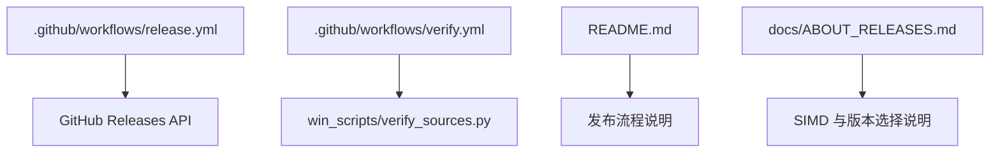
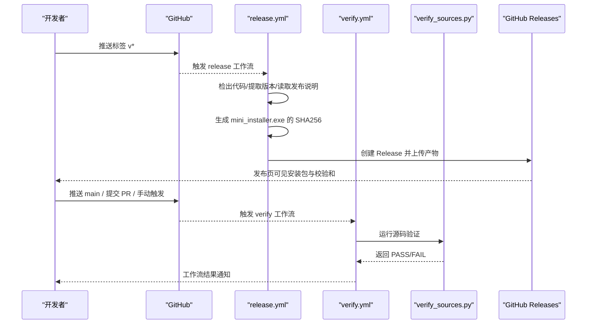
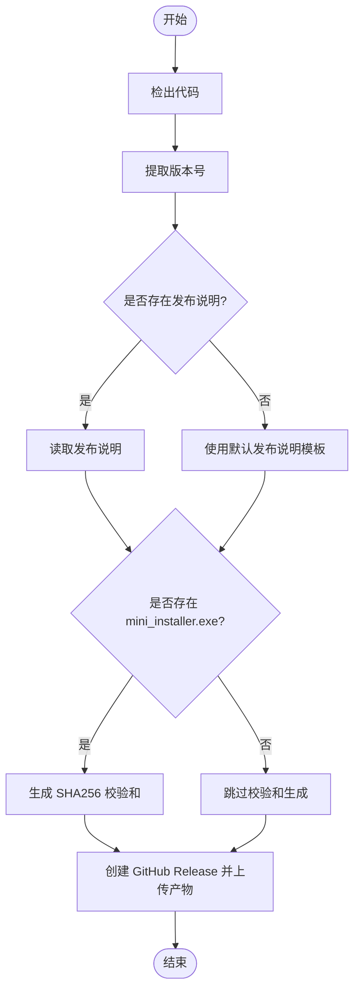
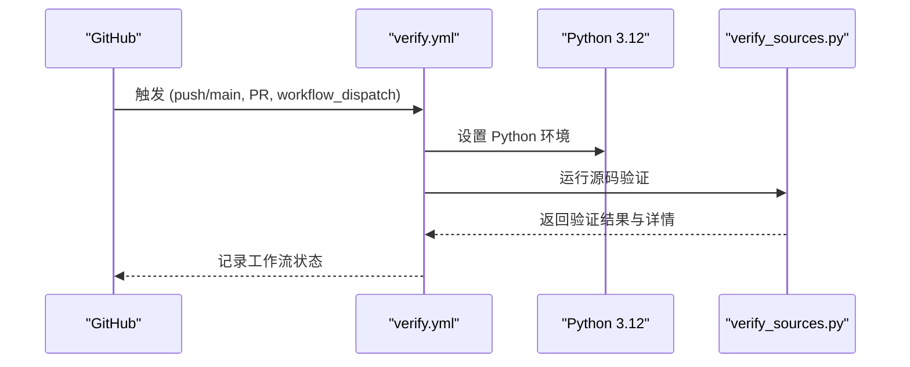
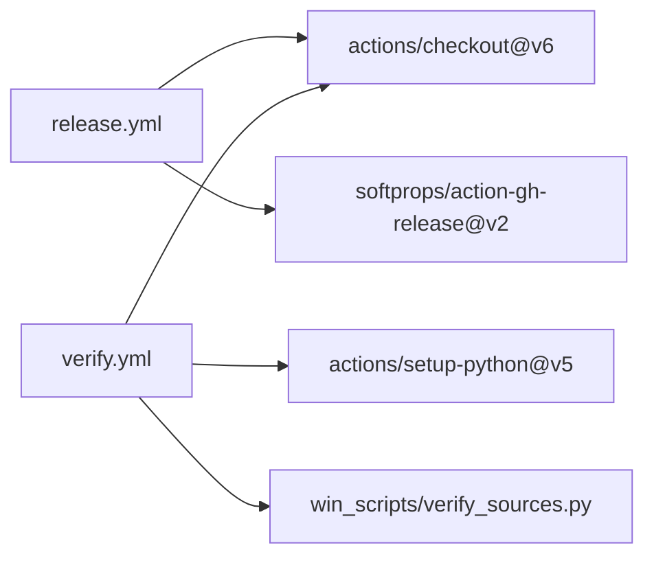

# GitHub Actions 工作流配置

<cite>
**本文引用的文件**
- [release.yml](file://.github/workflows/release.yml)
- [verify.yml](file://.github/workflows/verify.yml)
- [verify_sources.py](file://win_scripts/verify_sources.py)
- [README.md](file://README.md)
- [ABOUT_RELEASES.md](file://docs/ABOUT_RELEASES.md)
</cite>

## 目录
1. [简介](#简介)
2. [项目结构](#项目结构)
3. [核心组件](#核心组件)
4. [架构总览](#架构总览)
5. [详细组件分析](#详细组件分析)
6. [依赖关系分析](#依赖关系分析)
7. [性能与缓存建议](#性能与缓存建议)
8. [故障排除指南](#故障排除指南)
9. [结论](#结论)
10. [附录](#附录)

## 简介
本文件面向 MCloud Browser 的 CI/CD，聚焦于 .github/workflows 下的两个工作流：
- release.yml：在推送标签时创建 GitHub Release，并生成发布说明与校验和。
- verify.yml：在 main 分支推送、Pull Request 或手动触发时，验证构建脚本与 pak_src 源码完整性与语法。

本文档将详细说明触发条件、执行步骤、产物、并行策略、缓存机制、自定义扩展方式以及故障排除技巧。

## 项目结构
仓库中用于自动化的关键位置：
- .github/workflows：存放 GitHub Actions 工作流定义。
- win_scripts/verify_sources.py：源码验证脚本，被 verify.yml 调用。
- README.md：包含发布流程说明与注意事项（如安装包大小限制、命名约定等）。
- docs/ABOUT_RELEASES.md：关于 SIMD 优化与版本选择的背景说明，有助于理解发布产物定位。

图表来源
- [release.yml:1-79](file://.github/workflows/release.yml#L1-L79)
- [verify.yml:1-26](file://.github/workflows/verify.yml#L1-L26)
- [verify_sources.py:1-144](file://win_scripts/verify_sources.py#L1-L144)
- [README.md:265-301](file://README.md#L265-L301)
- [ABOUT_RELEASES.md:1-59](file://docs/ABOUT_RELEASES.md#L1-L59)

章节来源
- [release.yml:1-79](file://.github/workflows/release.yml#L1-L79)
- [verify.yml:1-26](file://.github/workflows/verify.yml#L1-L26)
- [README.md:265-301](file://README.md#L265-L301)

## 核心组件
- release.yml
  - 触发：仅对以 v 开头的标签推送触发。
  - 权限：写入仓库内容（用于创建 Release）。
  - 环境：强制使用 Node 24 运行 JavaScript 动作。
  - 步骤：检出代码、提取版本号、查找并发布说明、生成 SHA256 校验和、创建 GitHub Release。
  - 产物：Release 中包含 mini_installer.exe 及其同名 .sha256 文件。

- verify.yml
  - 触发：main 分支推送、任意 Pull Request、手动触发。
  - 步骤：检出代码、设置 Python 3.12、运行源码验证脚本。
  - 目的：确保关键构建脚本存在且语法正确，pak_src 源文件完整并可进行可选的 C 语法检查。

章节来源
- [release.yml:1-79](file://.github/workflows/release.yml#L1-L79)
- [verify.yml:1-26](file://.github/workflows/verify.yml#L1-L26)
- [verify_sources.py:1-144](file://win_scripts/verify_sources.py#L1-L144)

## 架构总览
下图展示了两个工作流的触发事件、执行环境与输出产物之间的关系。

图表来源
- [release.yml:1-79](file://.github/workflows/release.yml#L1-L79)
- [verify.yml:1-26](file://.github/workflows/verify.yml#L1-L26)
- [verify_sources.py:1-144](file://win_scripts/verify_sources.py#L1-L144)

## 详细组件分析

### release.yml 工作流
- 触发条件
  - 仅当推送的引用匹配标签模式 v* 时触发。
- 执行步骤
  - 检出代码（获取完整历史以便后续操作）。
  - 从标签中提取版本号。
  - 尝试查找最新的发布说明文档；若不存在则使用默认模板。
  - 若存在 mini_installer.exe，则生成其 SHA256 校验和文件。
  - 调用 GitHub Release 动作创建正式 Release，并上传安装包与校验和。
- 输出产物
  - GitHub Release 页面中的 mini_installer.exe 与对应 .sha256 文件。
- 注意事项
  - 安装包较大，遵循 README 中的发布流程说明，产物不纳入 git 版本控制，直接通过 Release 分发。
  - 工作流本身不包含编译步骤，假设 mini_installer.exe 已在本地构建并提交到仓库或通过其他方式准备。

图表来源
- [release.yml:1-79](file://.github/workflows/release.yml#L1-L79)

章节来源
- [release.yml:1-79](file://.github/workflows/release.yml#L1-L79)
- [README.md:265-301](file://README.md#L265-L301)

### verify.yml 工作流
- 触发条件
  - main 分支推送、任意 Pull Request、手动触发。
- 执行步骤
  - 检出代码。
  - 设置 Python 3.12。
  - 运行 win_scripts/verify_sources.py 进行源码验证。
- 验证内容
  - Python 脚本语法检查（排除 old/ 与 __pycache__）。
  - 关键构建脚本存在性检查。
  - pak_src 源文件存在性检查。
  - 可选：在 Windows 平台且有编译器时，对 pak_src/*.c 进行语法检查。
- 输出
  - 工作流日志显示 PASS/FAIL 及详细信息。

图表来源
- [verify.yml:1-26](file://.github/workflows/verify.yml#L1-L26)
- [verify_sources.py:1-144](file://win_scripts/verify_sources.py#L1-L144)

章节来源
- [verify.yml:1-26](file://.github/workflows/verify.yml#L1-L26)
- [verify_sources.py:1-144](file://win_scripts/verify_sources.py#L1-L144)

## 依赖关系分析
- release.yml 依赖
  - actions/checkout@v6：用于检出代码。
  - softprops/action-gh-release@v2：用于创建 GitHub Release 并上传附件。
  - 环境变量 FORCE_JAVASCRIPT_ACTIONS_TO_NODE24：强制使用 Node 24 运行 JS 动作。
- verify.yml 依赖
  - actions/checkout@v6：检出代码。
  - actions/setup-python@v5：安装 Python 3.12。
  - 内部脚本 win_scripts/verify_sources.py：执行源码验证逻辑。

图表来源
- [release.yml:1-79](file://.github/workflows/release.yml#L1-L79)
- [verify.yml:1-26](file://.github/workflows/verify.yml#L1-L26)
- [verify_sources.py:1-144](file://win_scripts/verify_sources.py#L1-L144)

章节来源
- [release.yml:1-79](file://.github/workflows/release.yml#L1-L79)
- [verify.yml:1-26](file://.github/workflows/verify.yml#L1-L26)
- [verify_sources.py:1-144](file://win_scripts/verify_sources.py#L1-L144)

## 性能与缓存建议
当前工作流未显式配置缓存，但可基于以下策略提升效率：
- 依赖缓存
  - Python 包缓存：为 setup-python 添加 pip 缓存路径，减少重复安装时间。
  - 工具链缓存：若未来引入编译步骤，可对 depot_tools、gn/ninja 等工具进行缓存。
- 构建缓存
  - 中间产物缓存：对 out/* 或临时构建目录进行缓存，避免重复编译。
  - 源码下载缓存：对 Chromium 源码或第三方依赖进行缓存（参考计划文档中的示例）。
- 产物缓存
  - 复用已生成的安装包或校验和，减少重复计算。
- 并行构建
  - 使用矩阵策略（matrix）在不同平台或不同优化级别上并行构建（例如 AVX2、SSE4.1 等），结合缓存降低整体耗时。
- 超时与重试
  - 合理设置 timeout-minutes，并为易失败步骤增加重试逻辑。

[本节提供通用指导，不直接分析具体文件]

## 故障排除指南
- release.yml 常见问题
  - 未找到 mini_installer.exe：确认该文件存在于工作目录；若不存在，工作流会跳过校验和生成。
  - 发布说明为空：若未找到发布说明文档，将使用默认模板；可通过放置最新文档来覆盖。
  - 权限不足：确保工作流具有 contents: write 权限以创建 Release。
- verify.yml 常见问题
  - Python 语法错误：根据日志定位失败的 .py 文件并修复。
  - 关键脚本缺失：确保 win_scripts/ 下必需脚本存在。
  - pak_src 源文件缺失：确保所有预期 C/H 文件存在。
  - C 语法检查失败：仅在 Windows 且有编译器时执行；若无编译器或平台非 Windows，将跳过。
- 调试技巧
  - 查看工作流日志：定位具体失败步骤与错误信息。
  - 本地复现：在本地运行 verify_sources.py 以快速验证问题。
  - 逐步启用缓存：先禁用缓存定位问题，再逐步恢复以确认是否由缓存导致。

章节来源
- [release.yml:1-79](file://.github/workflows/release.yml#L1-L79)
- [verify.yml:1-26](file://.github/workflows/verify.yml#L1-L26)
- [verify_sources.py:1-144](file://win_scripts/verify_sources.py#L1-L144)

## 结论
- release.yml 专注于标签驱动的发布流程，负责生成发布说明与校验和，并将安装包上传至 GitHub Releases。
- verify.yml 专注于源码完整性与语法验证，保障构建脚本与 pak_src 的可维护性。
- 当前工作流简洁高效，适合轻量级自动化；如需全量构建与多平台支持，可在现有基础上扩展缓存、矩阵构建与更丰富的触发条件。

[本节总结性内容，不直接分析具体文件]

## 附录
- 发布流程参考
  - README 中提供了本地构建、打标签与发布的具体步骤与命名约定，建议遵循以避免兼容性问题。
- SIMD 与版本选择
  - ABOUT_RELEASES.md 解释了不同 SIMD 指令集与 CPU 兼容性，有助于选择合适的发布版本。

章节来源
- [README.md:265-301](file://README.md#L265-L301)
- [ABOUT_RELEASES.md:1-59](file://docs/ABOUT_RELEASES.md#L1-L59)