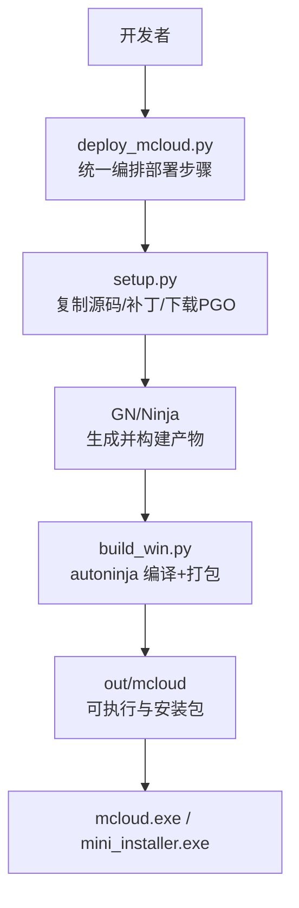
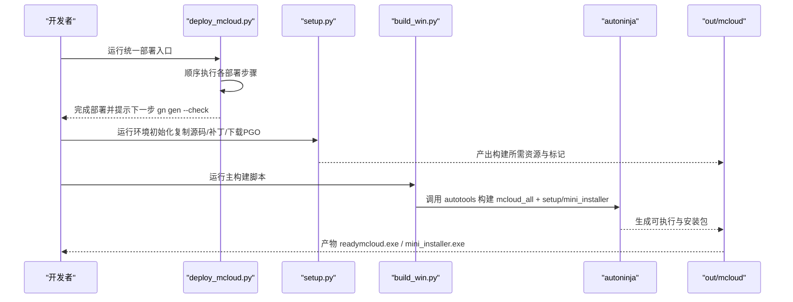
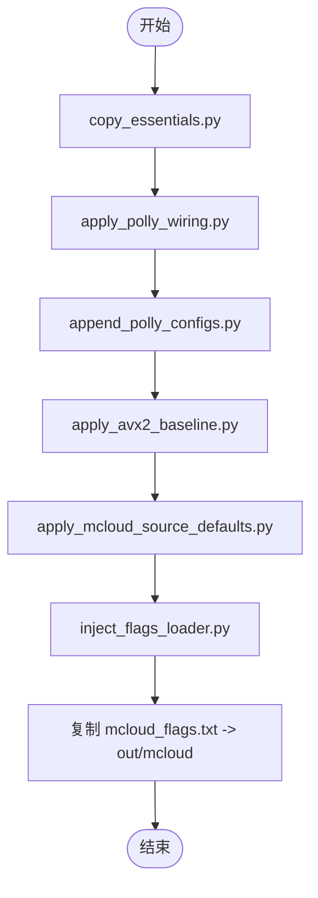
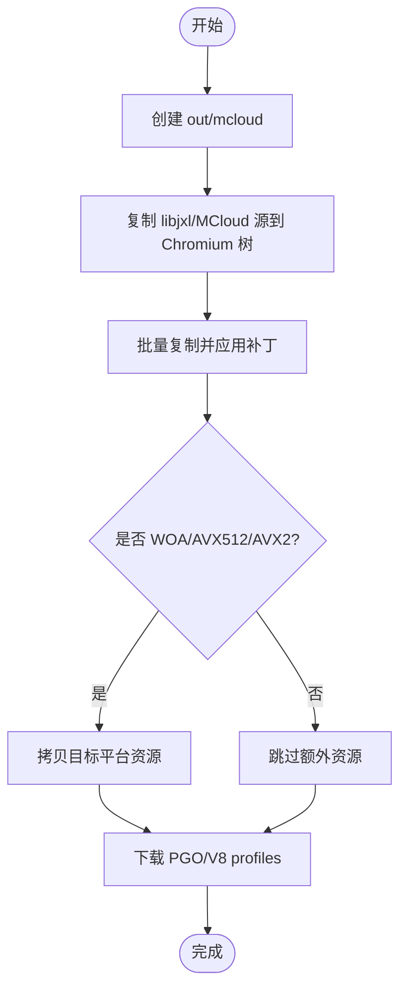
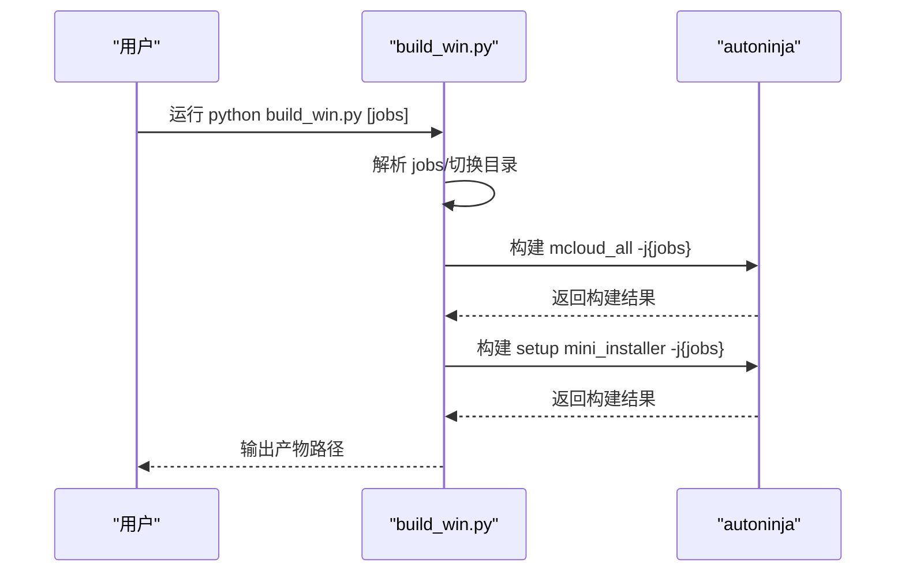
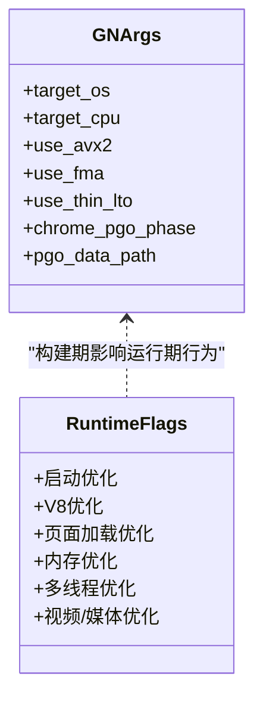
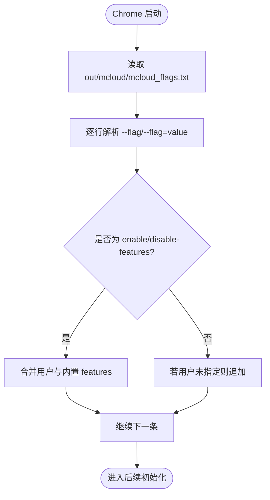
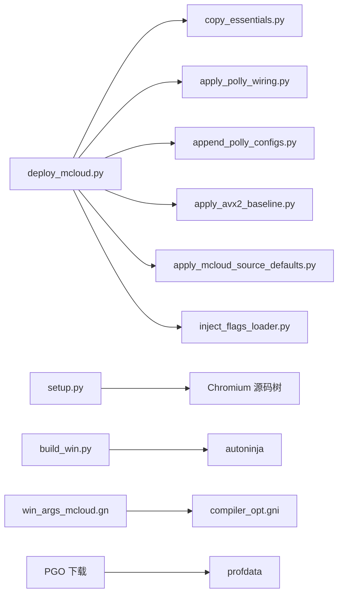

# Windows 自动化构建流程

本文引用的文件

- [win_scripts/build_win.py](https://github.com/Mcloud136/Mcloud-Browser/blob/main/win_scripts/build_win.py)
- [win_scripts/setup.py](https://github.com/Mcloud136/Mcloud-Browser/blob/main/win_scripts/setup.py)
- [win_scripts/deploy_mcloud.py](https://github.com/Mcloud136/Mcloud-Browser/blob/main/win_scripts/deploy_mcloud.py)
- [win_scripts/copy_essentials.py](https://github.com/Mcloud136/Mcloud-Browser/blob/main/win_scripts/copy_essentials.py)
- [win_scripts/apply_polly_wiring.py](https://github.com/Mcloud136/Mcloud-Browser/blob/main/win_scripts/apply_polly_wiring.py)
- [win_scripts/inject_flags_loader.py](https://github.com/Mcloud136/Mcloud-Browser/blob/main/win_scripts/inject_flags_loader.py)
- [win_args.gn](https://github.com/Mcloud136/Mcloud-Browser/blob/main/win_args.gn)
- [win_args_mcloud.gn](https://github.com/Mcloud136/Mcloud-Browser/blob/main/win_args_mcloud.gn)
- [mcloud_flags.txt](https://github.com/Mcloud136/Mcloud-Browser/blob/main/mcloud_flags.txt)
- [docs/BUILDING_WIN.md](https://github.com/Mcloud136/Mcloud-Browser/blob/main/docs/BUILDING_WIN.md)
- [README.md](https://github.com/Mcloud136/Mcloud-Browser/blob/main/README.md)

## 目录
1. [简介](#简介)
2. [项目结构](#项目结构)
3. [核心组件](#核心组件)
4. [架构总览](#架构总览)
5. [详细组件分析](#详细组件分析)
6. [依赖关系分析](#依赖关系分析)
7. [性能考虑](#性能考虑)
8. [故障排查指南](#故障排查指南)
9. [结论](#结论)
10. [附录](#附录)

## 简介
本文件面向在 Windows 平台上进行 MCloud Browser（基于 Chromium）的本地与 CI 化构建，系统性说明：
- build_win.py 主构建脚本的执行流程（源码准备、依赖安装、编译器配置、优化参数设置与最终打包）。
- setup.py 环境初始化脚本的功能（开发环境检查、工具链安装、路径配置、补丁应用与 PGO 下载）。
- deploy_mcloud.py 部署编排器的作用（构建任务调度、错误处理与日志管理）。
- 本地模拟 CI 环境的构建方法与性能优化技巧。
- 常见构建问题的诊断与解决方案。

## 项目结构
围绕 Windows 构建的关键脚本与配置文件分布如下：
- 构建入口与编排
  - win_scripts/build_win.py：调用 autoninja 执行编译与打包。
  - win_scripts/deploy_mcloud.py：统一编排多项定点部署步骤（复制关键文件、Polly/BOLT 接线、AVX2 基线、默认值注入、flags 加载器注入等）。
- 环境初始化与补丁
  - win_scripts/setup.py：将 MCloud 定制源复制到 Chromium 树、应用补丁、下载 PGO/V8 profiles、按目标平台拷贝额外资源。
- 构建参数与运行时标志
  - win_args.gn / win_args_mcloud.gn：GN 构建参数，包含 SIMD、LTO、PGO、V8 优化、媒体解码等。
  - mcloud_flags.txt：浏览器启动时由内置加载器注入的 66 项运行时优化标志。
- 文档与环境要求
  - docs/BUILDING_WIN.md：Windows 构建前置条件、depot_tools 配置、gn/ninja 使用与常见问题。
  - README.md：总体特性、性能优化栈、从源码构建步骤与发布流程。

图表来源
- [win_scripts/deploy_mcloud.py:1-51](https://github.com/Mcloud136/Mcloud-Browser/blob/main/win_scripts/deploy_mcloud.py#L1-L51)
- [win_scripts/setup.py:1-412](https://github.com/Mcloud136/Mcloud-Browser/blob/main/win_scripts/setup.py#L1-L412)
- [win_scripts/build_win.py:1-51](https://github.com/Mcloud136/Mcloud-Browser/blob/main/win_scripts/build_win.py#L1-L51)

章节来源
- [docs/BUILDING_WIN.md:1-288](https://github.com/Mcloud136/Mcloud-Browser/blob/main/docs/BUILDING_WIN.md#L1-L288)
- [README.md:1-408](https://github.com/Mcloud136/Mcloud-Browser/blob/main/README.md#L1-L408)

## 核心组件
- 构建编排器 deploy_mcloud.py
  - 顺序执行 copy_essentials.py、apply_polly_wiring.py、append_polly_configs.py、apply_avx2_baseline.py、apply_mcloud_source_defaults.py、inject_flags_loader.py。
  - 将 mcloud_flags.txt 复制到 out/mcloud，供运行时加载器读取。
- 环境初始化 setup.py
  - 创建输出目录、复制 libjxl 与 MCloud 定制源到 Chromium 树。
  - 批量复制并应用补丁（FFmpeg HEVC、策略模板、FTP/GPC/UI/下载栏/迷你安装器等）。
  - 根据目标平台（WOA/AVX512/AVX2）拷贝额外资源并下载对应 PGO/V8 profiles。
- 主构建脚本 build_win.py
  - 切换至 Chromium 源码目录，自动获取 CPU 核数作为并行度，调用 autoninja 构建 mcloud_all 与 setup/mini_installer。
- GN 构建参数
  - win_args.gn：基础 x64 构建开关（SIMD、LTO、PGO、媒体解码等）。
  - win_args_mcloud.gn：MCloud 专用优化参数（AVX2+FMA3、ThinLTO、PGO、V8 优化、媒体与 DRM 开关等）。
- 运行时标志注入
  - inject_flags_loader.py 向 chrome_main_delegate.cc 注入加载器，启动时读取 out/mcloud/mcloud_flags.txt 并合并到命令行。

章节来源
- [win_scripts/deploy_mcloud.py:1-51](https://github.com/Mcloud136/Mcloud-Browser/blob/main/win_scripts/deploy_mcloud.py#L1-L51)
- [win_scripts/setup.py:1-412](https://github.com/Mcloud136/Mcloud-Browser/blob/main/win_scripts/setup.py#L1-L412)
- [win_scripts/build_win.py:1-51](https://github.com/Mcloud136/Mcloud-Browser/blob/main/win_scripts/build_win.py#L1-L51)
- [win_args.gn:1-87](https://github.com/Mcloud136/Mcloud-Browser/blob/main/win_args.gn#L1-L87)
- [win_args_mcloud.gn:1-126](https://github.com/Mcloud136/Mcloud-Browser/blob/main/win_args_mcloud.gn#L1-L126)
- [win_scripts/inject_flags_loader.py:1-125](https://github.com/Mcloud136/Mcloud-Browser/blob/main/win_scripts/inject_flags_loader.py#L1-L125)

## 架构总览
下图展示了 Windows 自动化构建的整体流程与关键交互点：

图表来源
- [win_scripts/deploy_mcloud.py:1-51](https://github.com/Mcloud136/Mcloud-Browser/blob/main/win_scripts/deploy_mcloud.py#L1-L51)
- [win_scripts/setup.py:1-412](https://github.com/Mcloud136/Mcloud-Browser/blob/main/win_scripts/setup.py#L1-L412)
- [win_scripts/build_win.py:1-51](https://github.com/Mcloud136/Mcloud-Browser/blob/main/win_scripts/build_win.py#L1-L51)

## 详细组件分析

### 组件 A：deploy_mcloud.py（部署编排器）
- 职责
  - 统一编排 6 个定点部署步骤，确保幂等与可重复执行。
  - 将 mcloud_flags.txt 复制到 out/mcloud，供运行时加载器读取。
- 错误处理与日志
  - 对每个子步骤通过 subprocess.run 返回值判断失败并立即中止，便于定位问题。
  - 打印当前步骤名与整体进度，便于 CI 日志追踪。
- 与后续步骤的关系
  - 完成后需执行 gn gen out/mcloud --check 以验证构建配置。

图表来源
- [win_scripts/deploy_mcloud.py:1-51](https://github.com/Mcloud136/Mcloud-Browser/blob/main/win_scripts/deploy_mcloud.py#L1-L51)

章节来源
- [win_scripts/deploy_mcloud.py:1-51](https://github.com/Mcloud136/Mcloud-Browser/blob/main/win_scripts/deploy_mcloud.py#L1-L51)

### 组件 B：setup.py（环境初始化与补丁）
- 主要功能
  - 创建 out/mcloud 目录。
  - 复制 mcloud-libjxl 与 MCloud 定制源到 Chromium 树指定位置。
  - 复制并应用一系列补丁（FFmpeg HEVC、策略模板、FTP、GPC、UI、下载栏、迷你安装器、键盘快捷键、隐私沙盒禁用、更新器、悬空指针修复、Aero 崩溃修复、deb 依赖生成等）。
  - 根据目标平台（WOA/AVX512/AVX2）拷贝额外资源并下载对应 PGO/V8 profiles。
- 路径与环境
  - 通过 CR_DIR 与 THOR_DIR 环境变量定位 Chromium 源码与 MCloud 仓库。
  - 默认 CR_DIR=C:/src/chromium/src，THOR_DIR=%USERPROFILE%/mcloud。
- 错误处理
  - 封装 try_run/fail，命令失败即退出并打印上下文。

图表来源
- [win_scripts/setup.py:1-412](https://github.com/Mcloud136/Mcloud-Browser/blob/main/win_scripts/setup.py#L1-L412)

章节来源
- [win_scripts/setup.py:1-412](https://github.com/Mcloud136/Mcloud-Browser/blob/main/win_scripts/setup.py#L1-L412)

### 组件 C：build_win.py（主构建脚本）
- 执行流程
  - 解析参数（可选并行度），默认使用 os.cpu_count()。
  - 切换到 CR_DIR（Chromium 源码目录）。
  - 调用 autoninja 构建 mcloud_all 与 setup/mini_installer。
  - 输出产物路径（out/mcloud）。
- 错误处理
  - 封装 try_run/fail，命令失败即退出并打印上下文。

图表来源
- [win_scripts/build_win.py:1-51](https://github.com/Mcloud136/Mcloud-Browser/blob/main/win_scripts/build_win.py#L1-L51)

章节来源
- [win_scripts/build_win.py:1-51](https://github.com/Mcloud136/Mcloud-Browser/blob/main/win_scripts/build_win.py#L1-L51)

### 组件 D：GN 构建参数与优化配置
- win_args.gn
  - 启用 SSE/SSE4/AVX/AVX2/FMA 相关开关（注意 use_avx2=false 为通用示例，实际 MCloud 使用 AVX2+FMA3）。
  - 开启 ThinLTO、LLD、关闭调试符号、启用 WebUI 优化、媒体解码与 Widevine 相关开关。
  - 配置 PGO 阶段与 profdata 路径。
- win_args_mcloud.gn
  - 明确 AVX2+FMA3 原生编译，启用 is_full_optimization_build（-O3）、ThinLTO、V8 优化（Maglev/TurboFan/WASM SIMD）、媒体解码与 DRM 开关。
  - 配置 PGO 阶段与 profdata 路径（需与内核版本严格匹配）。
- 运行时标志
  - mcloud_flags.txt 提供 66 项运行时优化标志，覆盖启动、V8、页面加载、内存、多线程、渲染、视频缓冲等。
  - 通过 inject_flags_loader.py 注入到 chrome_main_delegate.cc，启动时读取 out/mcloud/mcloud_flags.txt 并合并到命令行。

图表来源
- [win_args.gn:1-87](https://github.com/Mcloud136/Mcloud-Browser/blob/main/win_args.gn#L1-L87)
- [win_args_mcloud.gn:1-126](https://github.com/Mcloud136/Mcloud-Browser/blob/main/win_args_mcloud.gn#L1-L126)
- [mcloud_flags.txt:1-120](https://github.com/Mcloud136/Mcloud-Browser/blob/main/mcloud_flags.txt#L1-L120)

章节来源
- [win_args.gn:1-87](https://github.com/Mcloud136/Mcloud-Browser/blob/main/win_args.gn#L1-L87)
- [win_args_mcloud.gn:1-126](https://github.com/Mcloud136/Mcloud-Browser/blob/main/win_args_mcloud.gn#L1-L126)
- [mcloud_flags.txt:1-120](https://github.com/Mcloud136/Mcloud-Browser/blob/main/mcloud_flags.txt#L1-L120)

### 组件 E：flags 加载器注入（inject_flags_loader.py）
- 功能
  - 向 chrome_main_delegate.cc 注入 LoadMcloudPerformanceFlags 函数。
  - 启动早期读取 out/mcloud/mcloud_flags.txt，逐行解析并追加到进程命令行。
  - enable/disable-features 与用户命令行合并（用户条目在后优先），其余标志若用户已指定则跳过。
- 依赖确认
  - 自动补齐必要的 include（如 base/strings/string_split.h）。
  - 校验 content_switches.h 已包含以支持 kEnableFeatures/kDisableFeatures。

图表来源
- [win_scripts/inject_flags_loader.py:1-125](https://github.com/Mcloud136/Mcloud-Browser/blob/main/win_scripts/inject_flags_loader.py#L1-L125)

章节来源
- [win_scripts/inject_flags_loader.py:1-125](https://github.com/Mcloud136/Mcloud-Browser/blob/main/win_scripts/inject_flags_loader.py#L1-L125)

## 依赖关系分析
- 脚本间依赖
  - deploy_mcloud.py 依赖 copy_essentials.py、apply_polly_wiring.py、append_polly_configs.py、apply_avx2_baseline.py、apply_mcloud_source_defaults.py、inject_flags_loader.py。
  - setup.py 独立负责源码与补丁准备，不直接依赖上述部署脚本。
  - build_win.py 仅依赖系统工具（autoninja）与 Chromium 源码树。
- 构建参数依赖
  - win_args_mcloud.gn 依赖 compiler_opt.gni（SIMD/Polly/BOLT/O3 开关声明）。
  - PGO 依赖 tools/update_pgo_profiles.py 与 v8/tools/builtins-pgo/download_profiles.py 下载的 profdata。
- 外部依赖
  - Visual Studio 2022/Build Tools、Windows SDK、depot_tools、Python、Git。

图表来源
- [win_scripts/deploy_mcloud.py:1-51](https://github.com/Mcloud136/Mcloud-Browser/blob/main/win_scripts/deploy_mcloud.py#L1-L51)
- [win_scripts/setup.py:1-412](https://github.com/Mcloud136/Mcloud-Browser/blob/main/win_scripts/setup.py#L1-L412)
- [win_scripts/build_win.py:1-51](https://github.com/Mcloud136/Mcloud-Browser/blob/main/win_scripts/build_win.py#L1-L51)
- [win_args_mcloud.gn:1-126](https://github.com/Mcloud136/Mcloud-Browser/blob/main/win_args_mcloud.gn#L1-L126)

章节来源
- [win_scripts/deploy_mcloud.py:1-51](https://github.com/Mcloud136/Mcloud-Browser/blob/main/win_scripts/deploy_mcloud.py#L1-L51)
- [win_scripts/setup.py:1-412](https://github.com/Mcloud136/Mcloud-Browser/blob/main/win_scripts/setup.py#L1-L412)
- [win_scripts/build_win.py:1-51](https://github.com/Mcloud136/Mcloud-Browser/blob/main/win_scripts/build_win.py#L1-L51)
- [win_args_mcloud.gn:1-126](https://github.com/Mcloud136/Mcloud-Browser/blob/main/win_args_mcloud.gn#L1-L126)

## 性能考虑
- 编译器优化栈
  - AVX2+FMA3 原生编译：通过 win_args_mcloud.gn 启用 use_avx2/use_fma，最大化 SIMD 加速。
  - -O3 极致优化：is_full_optimization_build=true 启用激进优化。
  - ThinLTO + PGO：thin_lto_enable_optimizations=true，chrome_pgo_phase=2，配合 pgo_data_path 指向匹配的 profdata。
- V8 优化
  - v8_enable_maglev/turbofan/wasm_simd256_revec 与 use_v8_context_snapshot 提升 JS 执行与快照生成效率。
- 运行时标志
  - mcloud_flags.txt 中的 66 项标志覆盖启动、V8、页面加载、内存、多线程、渲染、视频缓冲等全链路优化。
- 构建并行度
  - build_win.py 默认使用 os.cpu_count() 作为 -j 参数，建议设置为 CPU 核心数以缩短构建时间。
- Polly/BOLT
  - 当前 use_polly/use_bolt=false（受限于工具链与后链接流程），待 infra/build_polly.sh 与后链接流程就绪后再启用。

章节来源
- [win_args_mcloud.gn:1-126](https://github.com/Mcloud136/Mcloud-Browser/blob/main/win_args_mcloud.gn#L1-L126)
- [mcloud_flags.txt:1-120](https://github.com/Mcloud136/Mcloud-Browser/blob/main/mcloud_flags.txt#L1-L120)
- [win_scripts/build_win.py:1-51](https://github.com/Mcloud136/Mcloud-Browser/blob/main/win_scripts/build_win.py#L1-L51)

## 故障排查指南
- 环境未正确配置
  - 症状：找不到 Python/Git/depot_tools，或 VS/SDK 版本不匹配。
  - 处理：参考 docs/BUILDING_WIN.md 配置 PATH、DEPOT_TOOLS_WIN_TOOLCHAIN、vs2022_install，并确保 Windows SDK 与 Debugging Tools 版本正确。
- 源码与补丁冲突
  - 症状：git apply 失败或构建时报错。
  - 处理：重新运行 setup.py 以应用补丁；必要时清理 out/mcloud 并重新 gn gen。
- PGO 版本不匹配
  - 症状：构建或运行时报 PGO profile 不匹配。
  - 处理：确保 pgo_data_path 指向与内核大版本匹配的 profdata（M150=7871，M151=7922），并通过 tools/update_pgo_profiles.py 与 v8/tools/builtins-pgo/download_profiles.py 下载。
- flags 未生效
  - 症状：运行时标志未注入。
  - 处理：确认 deploy_mcloud.py 已将 mcloud_flags.txt 复制到 out/mcloud，且 inject_flags_loader.py 已成功注入加载器；可通过 benchmark/tools/verify_builtin_flags.ps1 验证。
- 构建速度慢
  - 处理：增大 -j 参数（build_win.py 默认使用 CPU 核数），关闭不必要的调试符号与组件构建，确保 SSD 与磁盘空间充足。

章节来源
- [docs/BUILDING_WIN.md:1-288](https://github.com/Mcloud136/Mcloud-Browser/blob/main/docs/BUILDING_WIN.md#L1-L288)
- [win_scripts/setup.py:1-412](https://github.com/Mcloud136/Mcloud-Browser/blob/main/win_scripts/setup.py#L1-L412)
- [win_scripts/deploy_mcloud.py:1-51](https://github.com/Mcloud136/Mcloud-Browser/blob/main/win_scripts/deploy_mcloud.py#L1-L51)
- [win_scripts/inject_flags_loader.py:1-125](https://github.com/Mcloud136/Mcloud-Browser/blob/main/win_scripts/inject_flags_loader.py#L1-L125)

## 结论
本流程通过 deploy_mcloud.py 统一编排部署步骤，setup.py 完成源码与补丁准备，build_win.py 调用 autoninja 执行构建与打包，结合 win_args_mcloud.gn 与 mcloud_flags.txt 实现 AVX2+FMA3 原生编译、ThinLTO+PGO 三重优化与 66 项运行时标志注入。该方案适用于本地开发与 CI 环境，具备幂等性、可重复性与良好的可观测性。

## 附录
- 本地模拟 CI 构建步骤
  - 设置环境变量 CR_DIR、THOR_DIR。
  - 运行 deploy_mcloud.py 完成部署。
  - 运行 setup.py 完成源码与补丁准备。
  - 执行 gn gen out/mcloud --check 验证构建配置。
  - 运行 build_win.py 执行构建与打包。
- 性能调优建议
  - 调整 -j 参数以匹配 CPU 核心数。
  - 确保 PGO profdata 与内核版本匹配。
  - 启用 AVX2+FMA3、ThinLTO、-O3 与 V8 优化。
  - 合理配置 mcloud_flags.txt 中的运行时标志。

章节来源
- [README.md:1-408](https://github.com/Mcloud136/Mcloud-Browser/blob/main/README.md#L1-L408)
- [docs/BUILDING_WIN.md:1-288](https://github.com/Mcloud136/Mcloud-Browser/blob/main/docs/BUILDING_WIN.md#L1-L288)