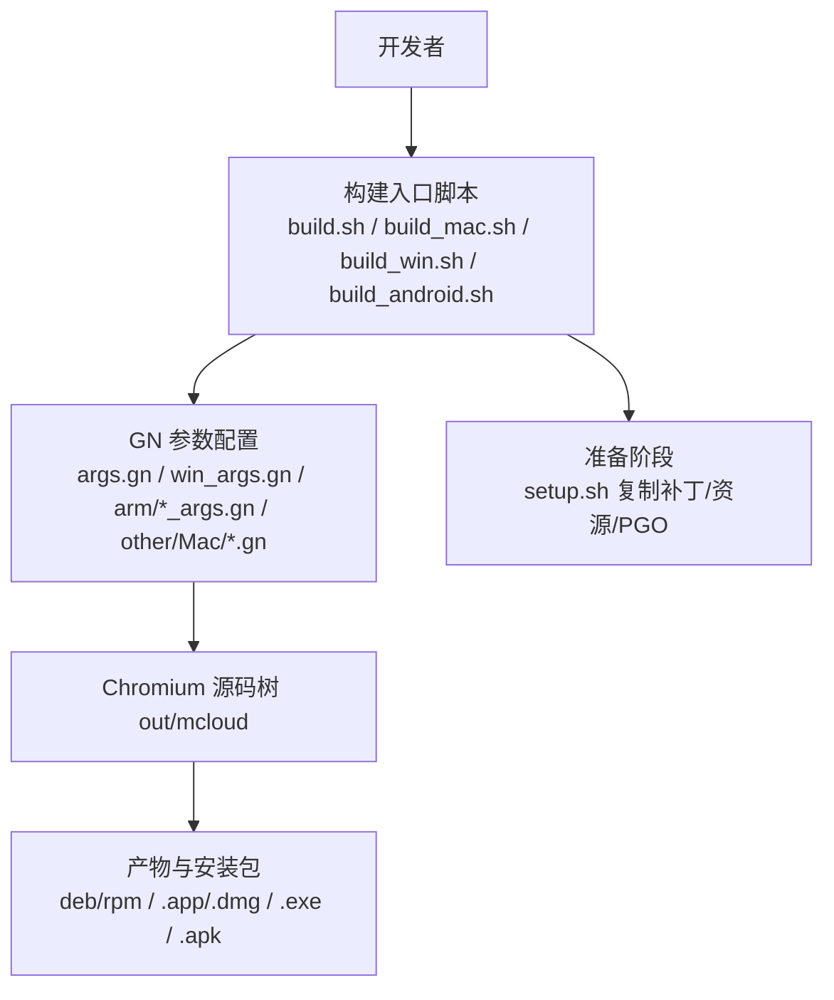
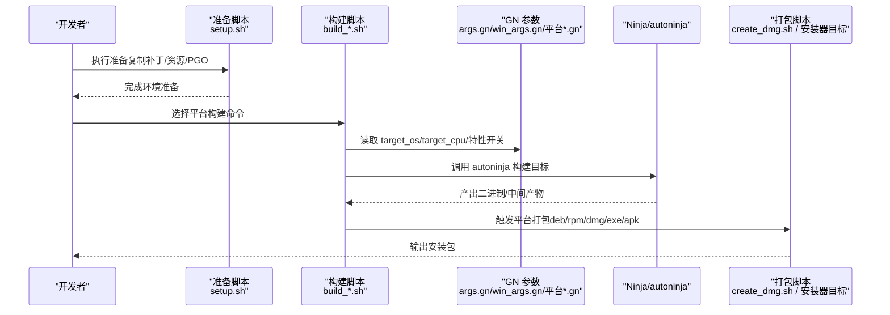
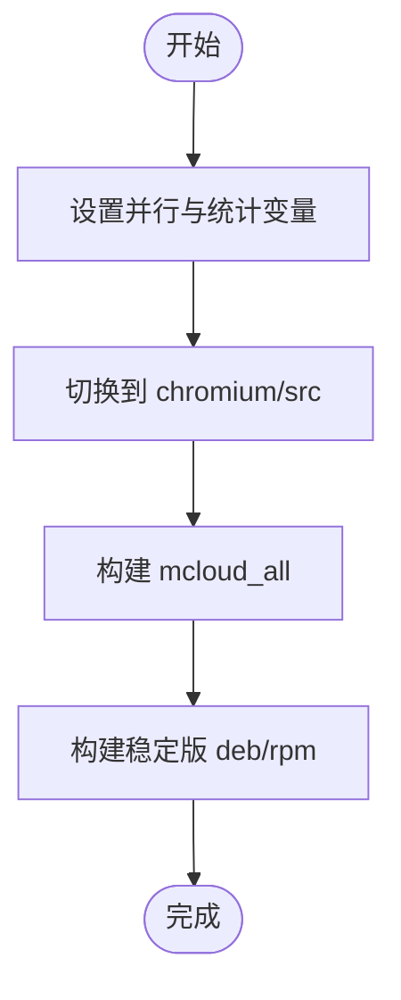
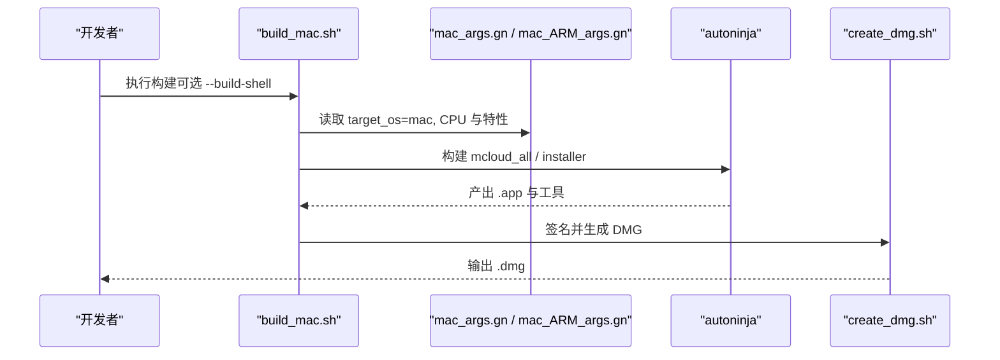
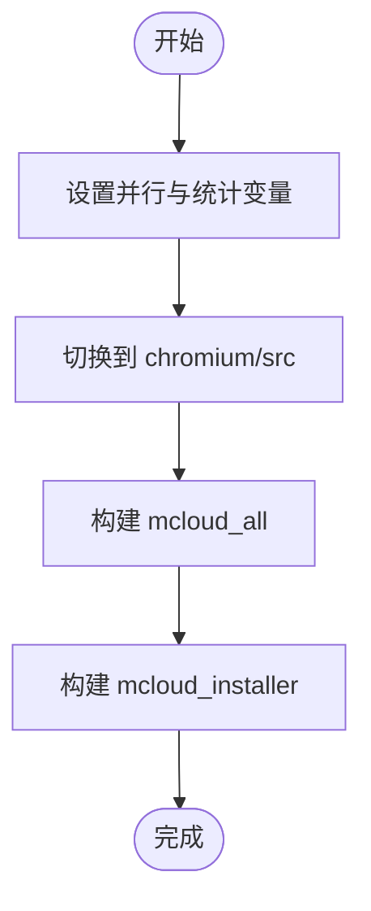
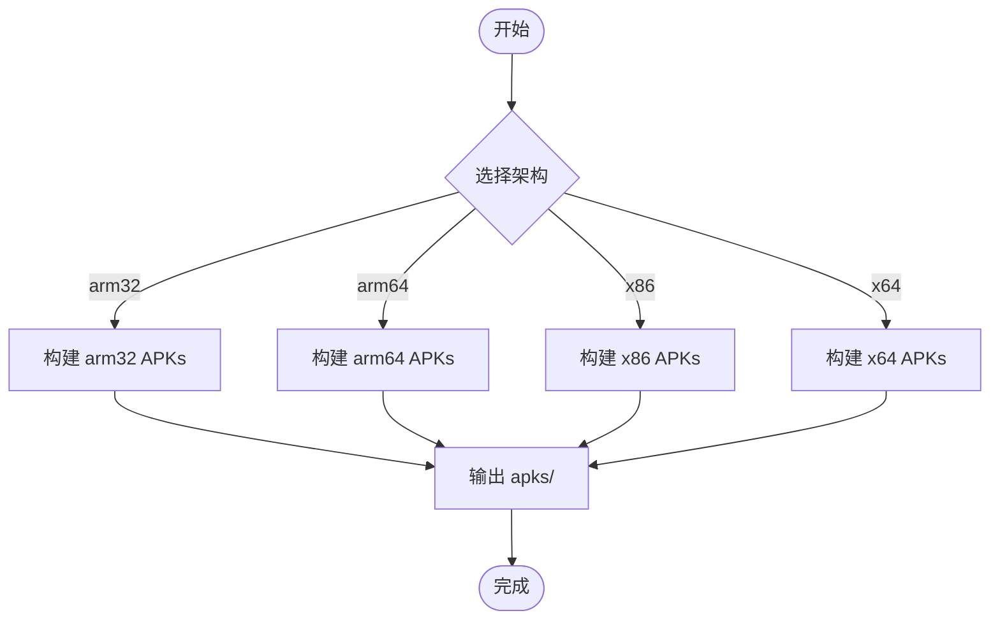
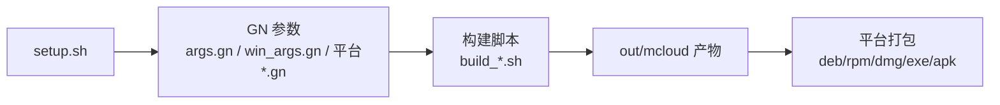

# 跨平台构建适配

本文引用的文件

- [build.sh](https://github.com/Mcloud136/Mcloud-Browser/blob/main/build.sh)
- [autobuild.sh](https://github.com/Mcloud136/Mcloud-Browser/blob/main/autobuild.sh)
- [args.gn](https://github.com/Mcloud136/Mcloud-Browser/blob/main/args.gn)
- [win_args.gn](https://github.com/Mcloud136/Mcloud-Browser/blob/main/win_args.gn)
- [build_mac.sh](https://github.com/Mcloud136/Mcloud-Browser/blob/main/build_mac.sh)
- [build_win.sh](https://github.com/Mcloud136/Mcloud-Browser/blob/main/build_win.sh)
- [build_android.sh](https://github.com/Mcloud136/Mcloud-Browser/blob/main/build_android.sh)
- [setup.sh](https://github.com/Mcloud136/Mcloud-Browser/blob/main/setup.sh)
- [arm/android/arm32_args.gn](https://github.com/Mcloud136/Mcloud-Browser/blob/main/arm/android/arm32_args.gn)
- [arm/android/arm64_args.gn](https://github.com/Mcloud136/Mcloud-Browser/blob/main/arm/android/arm64_args.gn)
- [other/Mac/mac_args.gn](https://github.com/Mcloud136/Mcloud-Browser/blob/main/other/Mac/mac_args.gn)
- [other/Mac/mac_ARM_args.gn](https://github.com/Mcloud136/Mcloud-Browser/blob/main/other/Mac/mac_ARM_args.gn)
- [arm/raspi/raspi_args.gn](https://github.com/Mcloud136/Mcloud-Browser/blob/main/arm/raspi/raspi_args.gn)
- [create_dmg.sh](https://github.com/Mcloud136/Mcloud-Browser/blob/main/create_dmg.sh)

## 目录
1. [简介](#简介)
2. [项目结构](#项目结构)
3. [核心组件](#核心组件)
4. [架构总览](#架构总览)
5. [详细组件分析](#详细组件分析)
6. [依赖关系分析](#依赖关系分析)
7. [性能考虑](#性能考虑)
8. [故障排查指南](#故障排查指南)
9. [结论](#结论)
10. [附录](#附录)

## 简介
本文件面向需要在 Linux、macOS、Android 等多平台上进行 Mcloud/Chromium 源码构建与发布的工程师，系统性说明各平台的构建差异、脚本职责、GN 参数配置要点、并行构建方法以及平台特定的依赖与兼容性处理。文档以仓库中的实际脚本与 GN 配置文件为依据，提供可操作的实践建议与排错指引。

## 项目结构
仓库采用“顶层脚本 + 平台特定 GN 参数 + 平台专用构建脚本”的分层组织方式：
- 顶层脚本：统一入口（Linux/macOS/Windows/Android），负责调用 ninja/gn、设置环境变量、触发打包等。
- GN 参数：按平台与架构拆分，集中管理编译优化、特性开关、签名与安装器选项等。
- 平台脚本：针对 macOS DMG、Windows Installer、Android APK 的收尾流程。
- 准备脚本：setup.sh 将补丁、资源与平台相关构建文件复制到 Chromium 源码树中，并下载 PGO 数据。

图表来源
- [build.sh:1-59](https://github.com/Mcloud136/Mcloud-Browser/blob/main/build.sh#L1-L59)
- [build_mac.sh:1-84](https://github.com/Mcloud136/Mcloud-Browser/blob/main/build_mac.sh#L1-L84)
- [build_win.sh:1-59](https://github.com/Mcloud136/Mcloud-Browser/blob/main/build_win.sh#L1-L59)
- [build_android.sh:1-140](https://github.com/Mcloud136/Mcloud-Browser/blob/main/build_android.sh#L1-L140)
- [setup.sh:1-408](https://github.com/Mcloud136/Mcloud-Browser/blob/main/setup.sh#L1-L408)

章节来源
- [build.sh:1-59](https://github.com/Mcloud136/Mcloud-Browser/blob/main/build.sh#L1-L59)
- [build_mac.sh:1-84](https://github.com/Mcloud136/Mcloud-Browser/blob/main/build_mac.sh#L1-L84)
- [build_win.sh:1-59](https://github.com/Mcloud136/Mcloud-Browser/blob/main/build_win.sh#L1-L59)
- [build_android.sh:1-140](https://github.com/Mcloud136/Mcloud-Browser/blob/main/build_android.sh#L1-L140)
- [setup.sh:1-408](https://github.com/Mcloud136/Mcloud-Browser/blob/main/setup.sh#L1-L408)

## 核心组件
- 通用构建脚本
  - Linux: build.sh 负责构建 mcloud_all 并生成 deb/rpm 安装包。
  - Windows: build_win.sh 构建 mcloud_all 并生成 mini_installer。
  - macOS: build_mac.sh 构建 mcloud_all 并生成 installer 目标；可选 --build-shell 同时构建 mcloud_shell。
  - Android: build_android.sh 根据参数选择 arm32/arm64/x86/x64 构建 chrome_public_apk/content_shell_apk/system_webview_*_apk。
- 自动构建脚本
  - autobuild.sh：仅用于测试与自动化，构建 debug/non-debug AVX 变体及 shell 目标，不用于发布。
- GN 参数
  - args.gn：Linux x64 默认发布配置，包含 SIMD、媒体解码、Widevine、Rust、ThinLTO、PGO 等。
  - win_args.gn：Windows x64 发布配置，启用 CFG Guard、RLZ、CDM 存储 ID 等 Windows 特有项。
  - arm/android/arm32_args.gn、arm/android/arm64_args.gn：Android ARM 架构参数，含 NEON、包名、系统 WebView 包名等。
  - other/Mac/mac_args.gn、other/Mac/mac_ARM_args.gn：macOS x64/ARM64 参数，启用 ICF、更新通知控制、PGO 路径等。
  - arm/raspi/raspi_args.gn：树莓派 ARM64 参数，禁用 Vulkan/SwiftShader，启用 VAAPI 等。
- 准备与打包
  - setup.sh：复制补丁、第三方库、版本信息，下载 PGO 数据，并按 --mac/--raspi/--android/--cros 等标志注入平台相关文件。
  - create_dmg.sh：对 macOS 应用签名并生成 DMG。

章节来源
- [build.sh:1-59](https://github.com/Mcloud136/Mcloud-Browser/blob/main/build.sh#L1-L59)
- [autobuild.sh:1-59](https://github.com/Mcloud136/Mcloud-Browser/blob/main/autobuild.sh#L1-L59)
- [args.gn:1-87](https://github.com/Mcloud136/Mcloud-Browser/blob/main/args.gn#L1-L87)
- [win_args.gn:1-87](https://github.com/Mcloud136/Mcloud-Browser/blob/main/win_args.gn#L1-L87)
- [arm/android/arm32_args.gn:1-96](https://github.com/Mcloud136/Mcloud-Browser/blob/main/arm/android/arm32_args.gn#L1-L96)
- [arm/android/arm64_args.gn:1-96](https://github.com/Mcloud136/Mcloud-Browser/blob/main/arm/android/arm64_args.gn#L1-L96)
- [other/Mac/mac_args.gn:1-90](https://github.com/Mcloud136/Mcloud-Browser/blob/main/other/Mac/mac_args.gn#L1-L90)
- [other/Mac/mac_ARM_args.gn:1-83](https://github.com/Mcloud136/Mcloud-Browser/blob/main/other/Mac/mac_ARM_args.gn#L1-L83)
- [arm/raspi/raspi_args.gn:1-91](https://github.com/Mcloud136/Mcloud-Browser/blob/main/arm/raspi/raspi_args.gn#L1-L91)
- [setup.sh:1-408](https://github.com/Mcloud136/Mcloud-Browser/blob/main/setup.sh#L1-L408)
- [create_dmg.sh:1-47](https://github.com/Mcloud136/Mcloud-Browser/blob/main/create_dmg.sh#L1-L47)

## 架构总览
下图展示了从开发者执行到最终产物的端到端流程，包括准备阶段、构建阶段与打包阶段，以及不同平台的关键差异点。

图表来源
- [setup.sh:54-202](https://github.com/Mcloud136/Mcloud-Browser/blob/main/setup.sh#L54-L202)
- [build.sh:42-51](https://github.com/Mcloud136/Mcloud-Browser/blob/main/build.sh#L42-L51)
- [build_mac.sh:67-76](https://github.com/Mcloud136/Mcloud-Browser/blob/main/build_mac.sh#L67-L76)
- [build_win.sh:42-51](https://github.com/Mcloud136/Mcloud-Browser/blob/main/build_win.sh#L42-L51)
- [build_android.sh:47-137](https://github.com/Mcloud136/Mcloud-Browser/blob/main/build_android.sh#L47-L137)
- [create_dmg.sh:31-40](https://github.com/Mcloud136/Mcloud-Browser/blob/main/create_dmg.sh#L31-L40)

## 详细组件分析

### Linux 构建与发布
- 构建入口：build.sh 设置 NINJA_SUMMARIZE_BUILD/NINJA_STATUS，进入 chromium/src 后调用 autoninja 构建 mcloud_all，随后构建 stable_deb 与 stable_rpm。
- GN 参数：args.gn 指定 target_os=linux、target_cpu=x64，开启 SSE/AVX、FFmpeg、VAAPI、Widevine、ThinLTO、PGO 等。
- 并行构建：通过传入 -j 参数控制并发任务数。
- 产物位置：out/mcloud 下的 deb/rpm 包。

图表来源
- [build.sh:42-51](https://github.com/Mcloud136/Mcloud-Browser/blob/main/build.sh#L42-L51)
- [args.gn:11-87](https://github.com/Mcloud136/Mcloud-Browser/blob/main/args.gn#L11-L87)

章节来源
- [build.sh:1-59](https://github.com/Mcloud136/Mcloud-Browser/blob/main/build.sh#L1-L59)
- [args.gn:1-87](https://github.com/Mcloud136/Mcloud-Browser/blob/main/args.gn#L1-L87)

### macOS 构建与 DMG 打包
- 构建入口：build_mac.sh 支持 --build-shell 构建 mcloud_shell；默认构建 mcloud_all 并触发 mac installer 目标。
- GN 参数：other/Mac/mac_args.gn（x64）、other/Mac/mac_ARM_args.gn（ARM64），启用 ICF、Widevine、HEVC、PGO 等，关闭 updater 与更新通知。
- 打包流程：create_dmg.sh 对 .app 签名并生成 UDBZ 压缩的 DMG。
- 并行构建：同 Linux，使用 -j 控制并发。

图表来源
- [build_mac.sh:30-76](https://github.com/Mcloud136/Mcloud-Browser/blob/main/build_mac.sh#L30-L76)
- [other/Mac/mac_args.gn:11-90](https://github.com/Mcloud136/Mcloud-Browser/blob/main/other/Mac/mac_args.gn#L11-L90)
- [other/Mac/mac_ARM_args.gn:3-83](https://github.com/Mcloud136/Mcloud-Browser/blob/main/other/Mac/mac_ARM_args.gn#L3-L83)
- [create_dmg.sh:31-40](https://github.com/Mcloud136/Mcloud-Browser/blob/main/create_dmg.sh#L31-L40)

章节来源
- [build_mac.sh:1-84](https://github.com/Mcloud136/Mcloud-Browser/blob/main/build_mac.sh#L1-L84)
- [other/Mac/mac_args.gn:1-90](https://github.com/Mcloud136/Mcloud-Browser/blob/main/other/Mac/mac_args.gn#L1-L90)
- [other/Mac/mac_ARM_args.gn:1-83](https://github.com/Mcloud136/Mcloud-Browser/blob/main/other/Mac/mac_ARM_args.gn#L1-L83)
- [create_dmg.sh:1-47](https://github.com/Mcloud136/Mcloud-Browser/blob/main/create_dmg.sh#L1-L47)

### Windows 构建与安装器
- 构建入口：build_win.sh 构建 mcloud_all 并触发 mcloud_installer（mini_installer）。
- GN 参数：win_args.gn 指定 target_os=win，启用 CFG Guard、RLZ、CDM 存储 ID、Widevine 等。
- 并行构建：同样通过 -j 控制并发。
- 产物位置：out/mcloud 下的 mcloud_mini_installer.exe。

图表来源
- [build_win.sh:42-51](https://github.com/Mcloud136/Mcloud-Browser/blob/main/build_win.sh#L42-L51)
- [win_args.gn:11-87](https://github.com/Mcloud136/Mcloud-Browser/blob/main/win_args.gn#L11-L87)

章节来源
- [build_win.sh:1-59](https://github.com/Mcloud136/Mcloud-Browser/blob/main/build_win.sh#L1-L59)
- [win_args.gn:1-87](https://github.com/Mcloud136/Mcloud-Browser/blob/main/win_args.gn#L1-L87)

### Android 构建与多架构
- 构建入口：build_android.sh 通过命令行参数选择架构（--arm32/--arm64/--x86/--x64），分别构建 chrome_public_apk、content_shell_apk、system_webview_*_apk。
- GN 参数：arm/android/arm32_args.gn、arm/android/arm64_args.gn 定义 target_os=android、CPU、NEON、包名、Widevine、HEVC、PGO 等。
- 并行构建：通过 cr_build_jobs 传入 -j。
- 产物位置：out/mcloud/apks/*.apk。

图表来源
- [build_android.sh:47-137](https://github.com/Mcloud136/Mcloud-Browser/blob/main/build_android.sh#L47-L137)
- [arm/android/arm32_args.gn:1-96](https://github.com/Mcloud136/Mcloud-Browser/blob/main/arm/android/arm32_args.gn#L1-L96)
- [arm/android/arm64_args.gn:1-96](https://github.com/Mcloud136/Mcloud-Browser/blob/main/arm/android/arm64_args.gn#L1-L96)

章节来源
- [build_android.sh:1-140](https://github.com/Mcloud136/Mcloud-Browser/blob/main/build_android.sh#L1-L140)
- [arm/android/arm32_args.gn:1-96](https://github.com/Mcloud136/Mcloud-Browser/blob/main/arm/android/arm32_args.gn#L1-L96)
- [arm/android/arm64_args.gn:1-96](https://github.com/Mcloud136/Mcloud-Browser/blob/main/arm/android/arm64_args.gn#L1-L96)

### 准备阶段与平台差异化注入
- setup.sh 负责：
  - 创建 out/mcloud 目录。
  - 复制 mcloud-libjxl、src/*、mcloud_shell、pak 工具等至 Chromium 源码树。
  - 批量应用补丁（FFmpeg HEVC、策略模板、FTP、GPC、UI 变更、Mini Installer、键盘快捷键、隐私沙盒等）。
  - 按标志注入平台相关资源与配置：
    - --mac：复制 arm/mac_arm.gni、版本文件、third_party 资源，下载 PGO。
    - --raspi/--arm64：复制 raspi 构建配置、wrapper、pak 二进制等。
    - --woa：复制 WOA 资源与 PGO。
    - --avx2/--avx512：替换 third_party、版本与 wrapper。
    - --android：复制 arm/android 资源，清理冲突图标，下载 PGO。
    - --cros：复制 CrOS 资源与版本文件。
- 该脚本是跨平台构建一致性的关键，确保源码树具备正确的补丁、资源与 PGO 数据。

章节来源
- [setup.sh:54-408](https://github.com/Mcloud136/Mcloud-Browser/blob/main/setup.sh#L54-L408)

## 依赖关系分析
- 脚本与 GN 参数的耦合
  - build.sh/build_mac.sh/build_win.sh/build_android.sh 均依赖 GN 参数决定 target_os/target_cpu 与特性开关。
  - setup.sh 为构建提供补丁与资源，直接影响 GN 参数生效范围（如启用/禁用某些特性）。
- 平台差异
  - Linux：args.gn 启用 VAAPI、发行版检查关闭、安装器启用。
  - Windows：win_args.gn 启用 CFG Guard、RLZ、CDM 存储 ID。
  - macOS：mac_args.gn/mac_ARM_args.gn 启用 ICF、关闭 updater/更新通知。
  - Android：arm*_args.gn 设置 NEON、包名、系统 WebView 包名、Widevine 解绑等。
  - Raspberry Pi：raspi_args.gn 禁用 Vulkan/SwiftShader，启用 VAAPI。

图表来源
- [setup.sh:54-408](https://github.com/Mcloud136/Mcloud-Browser/blob/main/setup.sh#L54-L408)
- [args.gn:11-87](https://github.com/Mcloud136/Mcloud-Browser/blob/main/args.gn#L11-L87)
- [win_args.gn:11-87](https://github.com/Mcloud136/Mcloud-Browser/blob/main/win_args.gn#L11-L87)
- [other/Mac/mac_args.gn:11-90](https://github.com/Mcloud136/Mcloud-Browser/blob/main/other/Mac/mac_args.gn#L11-L90)
- [other/Mac/mac_ARM_args.gn:3-83](https://github.com/Mcloud136/Mcloud-Browser/blob/main/other/Mac/mac_ARM_args.gn#L3-L83)
- [arm/android/arm32_args.gn:1-96](https://github.com/Mcloud136/Mcloud-Browser/blob/main/arm/android/arm32_args.gn#L1-L96)
- [arm/android/arm64_args.gn:1-96](https://github.com/Mcloud136/Mcloud-Browser/blob/main/arm/android/arm64_args.gn#L1-L96)
- [arm/raspi/raspi_args.gn:1-91](https://github.com/Mcloud136/Mcloud-Browser/blob/main/arm/raspi/raspi_args.gn#L1-L91)

章节来源
- [setup.sh:54-408](https://github.com/Mcloud136/Mcloud-Browser/blob/main/setup.sh#L54-L408)
- [args.gn:11-87](https://github.com/Mcloud136/Mcloud-Browser/blob/main/args.gn#L11-L87)
- [win_args.gn:11-87](https://github.com/Mcloud136/Mcloud-Browser/blob/main/win_args.gn#L11-L87)
- [other/Mac/mac_args.gn:11-90](https://github.com/Mcloud136/Mcloud-Browser/blob/main/other/Mac/mac_args.gn#L11-L90)
- [other/Mac/mac_ARM_args.gn:3-83](https://github.com/Mcloud136/Mcloud-Browser/blob/main/other/Mac/mac_ARM_args.gn#L3-L83)
- [arm/android/arm32_args.gn:1-96](https://github.com/Mcloud136/Mcloud-Browser/blob/main/arm/android/arm32_args.gn#L1-L96)
- [arm/android/arm64_args.gn:1-96](https://github.com/Mcloud136/Mcloud-Browser/blob/main/arm/android/arm64_args.gn#L1-L96)
- [arm/raspi/raspi_args.gn:1-91](https://github.com/Mcloud136/Mcloud-Browser/blob/main/arm/raspi/raspi_args.gn#L1-L91)

## 性能考虑
- 并行构建
  - 所有构建脚本均通过 -j 参数传递并发任务数，建议在多核机器上合理设置以提升构建速度。
- 链接与优化
  - 使用 ThinLTO、ICF、LLD 等加速链接与减小体积（Linux/macOS/Android 均有相应开关）。
- PGO（性能导向优化）
  - 各平台 GN 参数均包含 chrome_pgo_phase 与 pgo_data_path，需确保 PGO 数据可用且路径正确。
- 媒体与硬件加速
  - Linux/Raspberry Pi 启用 VAAPI；Android ARM 启用 NEON；macOS 启用 ICF；Windows 启用 CFG Guard。
- 调试与符号
  - symbol_level、v8_symbol_level、blink_symbol_level 设置为 0 以减小体积；必要时调整以增强调试能力。

[本节为通用指导，不直接分析具体文件]

## 故障排查指南
- 构建失败定位
  - 查看 autoninja 输出日志，确认是否因 GN 参数错误导致目标缺失或依赖未满足。
  - 若出现补丁应用失败，检查 setup.sh 中对应 patch 是否已存在或冲突。
- 常见环境问题
  - CR_DIR 环境变量未设置时默认指向 $HOME/chromium/src，请确保路径正确。
  - Android 构建需要 ADB 与合适的 SDK/NDK 环境；APK 输出位于 out/mcloud/apks。
  - macOS DMG 构建依赖 codesign 与 pkg-dmg，需确保签名工具可用。
- 平台特定问题
  - Linux：确认 deb/rpm 安装器目标可用；如需自定义目标，参考注释掉的行恢复独立目标构建。
  - Windows：确认 mini_installer 目标可用；检查 win_args.gn 中 CFG Guard 与 CDM 相关开关。
  - macOS：确认 mac_args.gn/mac_ARM_args.gn 中 CPU 与特性匹配当前主机；DMG 签名失败需检查证书。
  - Android：确认 arm*_args.gn 中 NEON、包名与系统 WebView 包名配置正确。
  - Raspberry Pi：raspi_args.gn 禁用了 Vulkan/SwiftShader，如需图形加速需评估兼容性与性能。

章节来源
- [build.sh:42-51](https://github.com/Mcloud136/Mcloud-Browser/blob/main/build.sh#L42-L51)
- [build_mac.sh:67-76](https://github.com/Mcloud136/Mcloud-Browser/blob/main/build_mac.sh#L67-L76)
- [build_win.sh:42-51](https://github.com/Mcloud136/Mcloud-Browser/blob/main/build_win.sh#L42-L51)
- [build_android.sh:47-137](https://github.com/Mcloud136/Mcloud-Browser/blob/main/build_android.sh#L47-L137)
- [create_dmg.sh:31-40](https://github.com/Mcloud136/Mcloud-Browser/blob/main/create_dmg.sh#L31-L40)
- [setup.sh:91-202](https://github.com/Mcloud136/Mcloud-Browser/blob/main/setup.sh#L91-L202)

## 结论
本项目通过清晰的脚本分层与平台化 GN 参数配置，实现了 Linux、macOS、Windows、Android 与 Raspberry Pi 的统一构建体验。setup.sh 作为准备阶段的核心，确保补丁、资源与 PGO 的一致性；各平台构建脚本聚焦于目标构建与打包；GN 参数则精确控制特性与优化。遵循本文档的实践建议，可在多平台上高效、稳定地完成构建与发布。

[本节为总结性内容，不直接分析具体文件]

## 附录
- 多平台并行构建最佳实践
  - 在 CI 环境中为每个平台维护独立的构建矩阵，使用 -j 控制并发。
  - 缓存 out/mcloud 与第三方依赖，减少重复构建时间。
  - 使用 PGO 数据提升运行性能，确保各平台 PGO 路径正确。
- 平台特定依赖管理
  - Linux：确保系统库与 VAAPI 驱动可用；deb/rpm 打包依赖相应工具链。
  - macOS：安装 Xcode 命令行工具与 pkg-dmg；确保代码签名证书可用。
  - Windows：配置 MSVC 与 LLD；确保 mini_installer 所需工具可用。
  - Android：配置 NDK 与 SDK；确保 ADB 可用以便安装测试 APK。
  - Raspberry Pi：确认交叉编译 sysroot 与 VAAPI 支持。

[本节为通用指导，不直接分析具体文件]