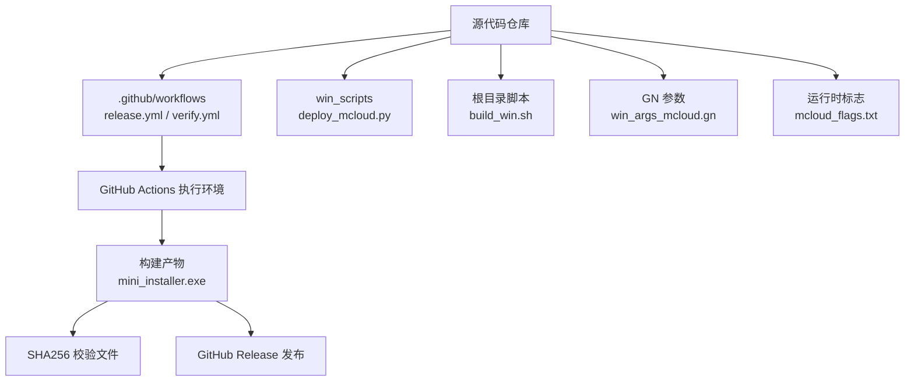
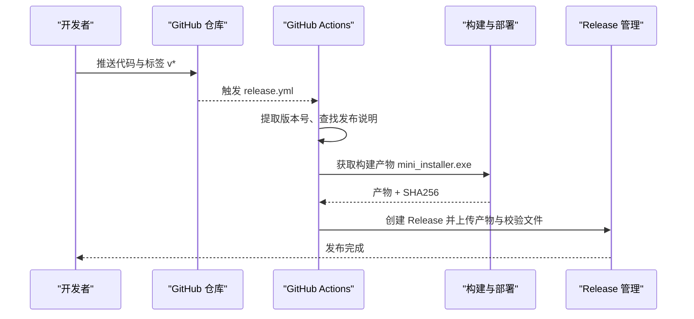
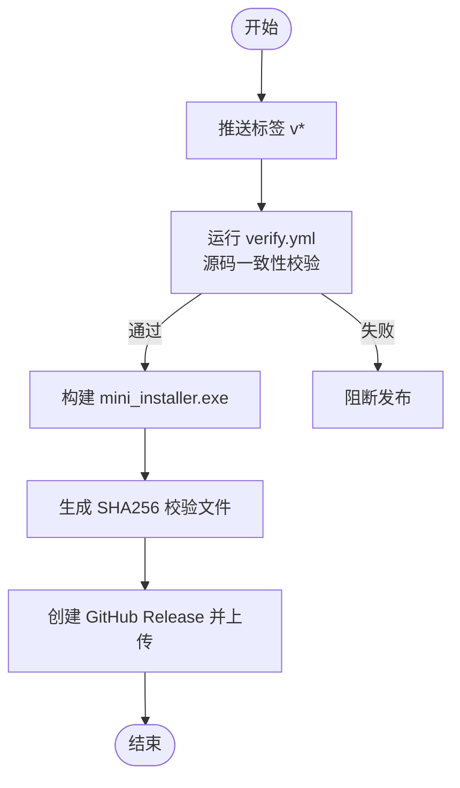
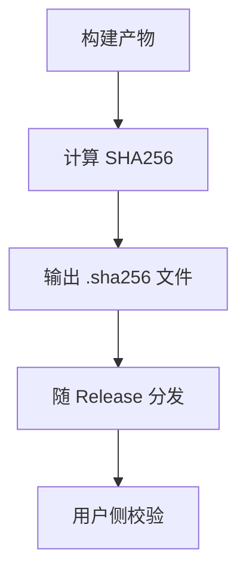
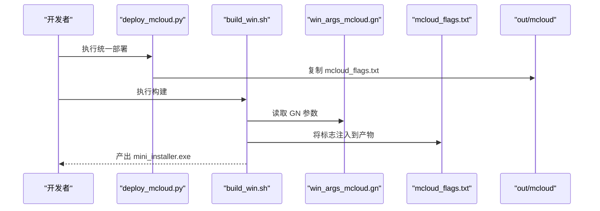
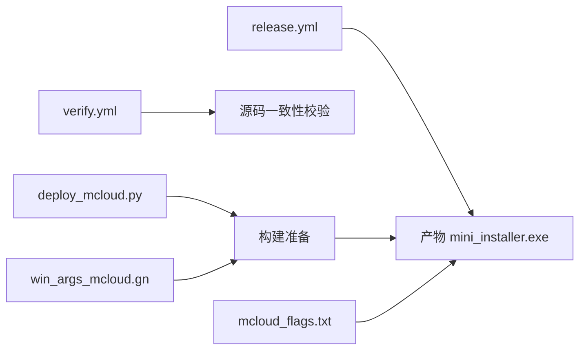

# 发布流程

<cite>
**本文引用的文件**
- [README.md](file://README.md)
- [ABOUT_RELEASES.md](file://docs/ABOUT_RELEASES.md)
- [release.yml](file://.github/workflows/release.yml)
- [verify.yml](file://.github/workflows/verify.yml)
- [deploy_mcloud.py](file://win_scripts/deploy_mcloud.py)
- [build_win.sh](file://build_win.sh)
- [win_args_mcloud.gn](file://win_args_mcloud.gn)
- [mcloud_flags.txt](file://mcloud_flags.txt)
</cite>

## 目录
1. [简介](#简介)
2. [项目结构](#项目结构)
3. [核心组件](#核心组件)
4. [架构总览](#架构总览)
5. [详细组件分析](#详细组件分析)
6. [依赖关系分析](#依赖关系分析)
7. [性能与质量门禁](#性能与质量门禁)
8. [故障排查指南](#故障排查指南)
9. [结论](#结论)
10. [附录](#附录)

## 简介
本文件面向 MCloud Browser 的发布流程，聚焦代码冻结、质量门禁、安全扫描、完整性校验与发布准备等关键环节；说明发布产物生成与验证（数字签名、哈希计算、文件完整性检查、多平台测试）；描述发布通知与更新机制（自动更新检查、增量更新支持、回滚策略）；并提供发布回滚与紧急修复的处理流程以及质量保证措施和故障恢复预案。

MCloud Browser 当前仅发布 Windows x64 平台，安装包通过 GitHub Releases 分发，附带 SHA256 校验文件，便于用户进行完整性验证。

**章节来源**
- [README.md:18-39](file://README.md#L18-L39)

## 项目结构
围绕发布的关键目录与文件：
- .github/workflows：CI/CD 工作流定义（触发、构建、打包、上传 Release）
- win_scripts：部署脚本与源码校验工具（统一部署入口、源文件校验）
- 根目录构建脚本：Windows 构建与产物产出
- GN 参数与运行时标志：win_args_mcloud.gn、mcloud_flags.txt
- 文档：发布说明模板与版本说明

**图表来源**
- [release.yml:1-79](file://.github/workflows/release.yml#L1-L79)
- [verify.yml:1-26](file://.github/workflows/verify.yml#L1-L26)
- [deploy_mcloud.py:1-51](file://win_scripts/deploy_mcloud.py#L1-L51)
- [build_win.sh:1-59](file://build_win.sh#L1-L59)
- [win_args_mcloud.gn:1-126](file://win_args_mcloud.gn#L1-L126)
- [mcloud_flags.txt:1-120](file://mcloud_flags.txt#L1-L120)

**章节来源**
- [release.yml:1-79](file://.github/workflows/release.yml#L1-L79)
- [verify.yml:1-26](file://.github/workflows/verify.yml#L1-L26)
- [deploy_mcloud.py:1-51](file://win_scripts/deploy_mcloud.py#L1-L51)
- [build_win.sh:1-59](file://build_win.sh#L1-L59)
- [win_args_mcloud.gn:1-126](file://win_args_mcloud.gn#L1-L126)
- [mcloud_flags.txt:1-120](file://mcloud_flags.txt#L1-L120)

## 核心组件
- 触发与编排：GitHub Actions 在推送标签时触发 release 工作流，提取版本号、查找并注入发布说明、生成 SHA256、创建 Release 并上传产物。
- 源码验证：独立 verify 工作流在 main 分支推送或 PR 时运行，调用 win_scripts/verify_sources.py 对构建脚本与 pak_src 进行一致性校验。
- 部署与构建：本地或 CI 中先执行统一部署脚本（deploy_mcloud.py），再使用 build_win.sh 编译并产出 mini_installer.exe。
- 构建参数与运行时标志：win_args_mcloud.gn 控制编译器优化、PGO、特性开关；mcloud_flags.txt 提供启动期优化标志，随安装包分发并在启动时注入。
- 产物与校验：产物命名遵循约定，附带 .sha256 文件供下载后校验。

**章节来源**
- [release.yml:1-79](file://.github/workflows/release.yml#L1-L79)
- [verify.yml:1-26](file://.github/workflows/verify.yml#L1-L26)
- [deploy_mcloud.py:1-51](file://win_scripts/deploy_mcloud.py#L1-L51)
- [build_win.sh:1-59](file://build_win.sh#L1-L59)
- [win_args_mcloud.gn:1-126](file://win_args_mcloud.gn#L1-L126)
- [mcloud_flags.txt:1-120](file://mcloud_flags.txt#L1-L120)

## 架构总览
下图展示从代码提交到 Release 发布的端到端流水线，包括源码验证、统一部署、构建打包、完整性校验与发布。

**图表来源**
- [release.yml:1-79](file://.github/workflows/release.yml#L1-L79)

**章节来源**
- [release.yml:1-79](file://.github/workflows/release.yml#L1-L79)

## 详细组件分析

### 代码冻结与质量门禁
- 代码冻结：以 Git 标签作为发布点，release 工作流仅在 push tag v* 时触发，确保发布基线稳定。
- 质量门禁：
  - 源码验证：verify.yml 在 main 分支推送或 PR 时运行，调用 win_scripts/verify_sources.py 校验构建脚本与 pak_src 的一致性，防止破坏性变更进入主干。
  - 构建产物校验：release 工作流在上传前生成 mini_installer.exe 的 SHA256 校验文件，保证产物可被下游验证。
  - 构建参数与标志治理：win_args_mcloud.gn 集中配置编译器优化、PGO、特性开关；mcloud_flags.txt 集中管理运行时标志，避免分散配置导致的不一致。

**图表来源**
- [release.yml:1-79](file://.github/workflows/release.yml#L1-L79)
- [verify.yml:1-26](file://.github/workflows/verify.yml#L1-L26)

**章节来源**
- [release.yml:1-79](file://.github/workflows/release.yml#L1-L79)
- [verify.yml:1-26](file://.github/workflows/verify.yml#L1-L26)

### 安全扫描与完整性校验
- 完整性校验：release 工作流为产物生成 SHA256 校验文件，用户可在安装前使用系统命令校验下载文件的完整性。
- 安全加固（构建期）：win_args_mcontrol.gn 启用 Control Flow Guard（CFG）、初始化栈变量为零等安全相关选项，降低运行时风险。
- 安全加固（运行期）：mcloud_flags.txt 包含多项运行时优化与安全相关特性开关（如禁用特定视频解码器以避免已知问题）。

**图表来源**
- [release.yml:60-67](file://.github/workflows/release.yml#L60-L67)
- [win_args_mcloud.gn:70-72](file://win_args_mcloud.gn#L70-L72)
- [mcloud_flags.txt:83-88](file://mcloud_flags.txt#L83-L88)

**章节来源**
- [release.yml:60-67](file://.github/workflows/release.yml#L60-L67)
- [win_args_mcloud.gn:70-72](file://win_args_mcloud.gn#L70-L72)
- [mcloud_flags.txt:83-88](file://mcloud_flags.txt#L83-L88)

### 发布准备与产物生成
- 统一部署：deploy_mcloud.py 按序执行拷贝必要文件、Polly/BOLT 接线、AVX2 基线设置、默认值注入、flags 加载器注入，并将 mcloud_flags.txt 复制到 out/mcloud 以便运行时读取。
- 构建与打包：build_win.sh 调用 autoninja 构建目标并产出 mini_installer.exe。
- 构建参数：win_args_mcloud.gn 指定 AVX2+FMA3 原生编译、PGO 数据路径、V8 优化、媒体与 GPU 特性等。
- 运行时标志：mcloud_flags.txt 提供启动期优化与行为调整，随安装包分发并在浏览器启动时注入。

**图表来源**
- [deploy_mcloud.py:1-51](file://win_scripts/deploy_mcloud.py#L1-L51)
- [build_win.sh:42-58](file://build_win.sh#L42-L58)
- [win_args_mcloud.gn:1-126](file://win_args_mcloud.gn#L1-L126)
- [mcloud_flags.txt:1-120](file://mcloud_flags.txt#L1-L120)

**章节来源**
- [deploy_mcloud.py:1-51](file://win_scripts/deploy_mcloud.py#L1-L51)
- [build_win.sh:42-58](file://build_win.sh#L42-L58)
- [win_args_mcloud.gn:1-126](file://win_args_mcloud.gn#L1-L126)
- [mcloud_flags.txt:1-120](file://mcloud_flags.txt#L1-L120)

### 数字签名与哈希计算
- 哈希计算：release 工作流在上传前为 mini_installer.exe 生成 SHA256 校验文件，文件名与版本对应，便于用户验证。
- 数字签名：仓库未包含签名步骤；建议在构建阶段集成代码签名（例如使用可信证书对安装包签名），并在 Release 说明中提供签名验证指引。

**章节来源**
- [release.yml:60-67](file://.github/workflows/release.yml#L60-L67)

### 多平台测试
- 当前发布范围限定为 Windows x64，因此多平台测试不在本次发布流程内。若未来扩展平台，需在 CI 中添加对应平台的构建与测试任务。

**章节来源**
- [README.md:20-23](file://README.md#L20-L23)

### 发布通知与更新机制
- 发布通知：release 工作流创建 GitHub Release 并附带发布说明（优先使用 docs/superpowers/specs/*release-notes*.md），用户可通过 Releases 页面获取更新信息。
- 自动更新检查：仓库未实现内置自动更新检查逻辑；如需实现，可在浏览器内部集成更新检查模块，定期查询远端版本并与本地版本比对。
- 增量更新支持：仓库未包含增量更新实现；如需支持，需引入差分补丁生成与合并机制（例如基于二进制差分的增量包）。
- 回滚策略：建议采用“保留上一版本”的策略，在发现严重问题时快速将用户引导至旧版本；同时配合灰度发布与回滚流程。

**章节来源**
- [release.yml:29-58](file://.github/workflows/release.yml#L29-L58)
- [release.yml:69-79](file://.github/workflows/release.yml#L69-L79)

### 发布回滚与紧急修复
- 回滚流程：
  - 立即停止新版本推广，将用户引导至上一个稳定版本的 Release。
  - 在仓库中保留旧版本标签与产物，必要时重新发布一个“修复版”标签（如 vX.Y.Z-fix）。
  - 在发布说明中明确回滚原因与修复内容。
- 紧急修复：
  - 针对关键缺陷，快速创建修复分支并提交最小化变更。
  - 打新标签并触发 release 工作流，生成新的产物与校验文件。
  - 同步更新发布说明，提示用户升级。

[本节为概念性流程说明，不直接分析具体文件]

## 依赖关系分析
- 工作流依赖：release.yml 依赖 GitHub Actions 提供的 Ubuntu 环境与软工 action；verify.yml 依赖 Python 环境。
- 构建依赖：deploy_mcloud.py 依赖 Chromium 源码树结构与 GN 构建系统；build_win.sh 依赖 ninja 与 MSVC 工具链。
- 配置依赖：win_args_mcloud.gn 影响编译优化、PGO、特性开关；mcloud_flags.txt 影响运行时行为。

**图表来源**
- [release.yml:1-79](file://.github/workflows/release.yml#L1-L79)
- [verify.yml:1-26](file://.github/workflows/verify.yml#L1-L26)
- [deploy_mcloud.py:1-51](file://win_scripts/deploy_mcloud.py#L1-L51)
- [win_args_mcloud.gn:1-126](file://win_args_mcloud.gn#L1-L126)
- [mcloud_flags.txt:1-120](file://mcloud_flags.txt#L1-L120)

**章节来源**
- [release.yml:1-79](file://.github/workflows/release.yml#L1-L79)
- [verify.yml:1-26](file://.github/workflows/verify.yml#L1-L26)
- [deploy_mcloud.py:1-51](file://win_scripts/deploy_mcloud.py#L1-L51)
- [win_args_mcloud.gn:1-126](file://win_args_mcloud.gn#L1-L126)
- [mcloud_flags.txt:1-120](file://mcloud_flags.txt#L1-L120)

## 性能与质量门禁
- 编译器优化：win_args_mcloud.gn 启用 -O3、ThinLTO、PGO，提升整体性能与稳定性。
- 运行时优化：mcloud_flags.txt 提供大量启动期与运行期优化标志，覆盖渲染、内存、网络、媒体等维度。
- 基准与验证：README 中提供了基准测试工具与验证脚本（如 verify_builtin_flags.ps1），可用于发布前的性能回归与标志有效性验证。

**章节来源**
- [win_args_mcloud.gn:33-57](file://win_args_mcloud.gn#L33-L57)
- [mcloud_flags.txt:8-120](file://mcloud_flags.txt#L8-L120)
- [README.md:357-375](file://README.md#L357-L375)

## 故障排查指南
- 构建失败：
  - 检查 deploy_mcloud.py 各步骤是否全部成功执行，关注返回码与日志。
  - 确认 GN 参数与 PGO 数据路径正确，避免路径错误或版本不匹配。
- 产物校验失败：
  - 使用系统命令计算下载的 mini_installer.exe 的 SHA256，并与 .sha256 文件对比。
- 运行时异常：
  - 检查 mcloud_flags.txt 中的标志是否与当前内核兼容，必要时临时禁用可疑标志。
- 源码验证失败：
  - 查看 verify.yml 触发的 verify_sources.py 输出，定位不一致的脚本或资源。

**章节来源**
- [deploy_mcloud.py:25-47](file://win_scripts/deploy_mcloud.py#L25-L47)
- [win_args_mcloud.gn:52-57](file://win_args_mcloud.gn#L52-L57)
- [release.yml:60-67](file://.github/workflows/release.yml#L60-L67)
- [verify.yml:19-25](file://.github/workflows/verify.yml#L19-L25)

## 结论
MCloud Browser 的发布流程以 Git 标签为发布基线，结合 GitHub Actions 实现自动化构建、完整性校验与 Release 发布；通过统一部署脚本与集中化的 GN 参数、运行时标志，确保构建一致性与运行稳定性；SHA256 校验文件为用户提供下载后的完整性保障。当前仅发布 Windows x64 平台，后续可扩展多平台构建与测试。对于自动更新与增量更新，可在浏览器内部集成相应机制；回滚与紧急修复应遵循保留旧版本、快速修复与清晰说明的原则。

[本节为总结性内容，不直接分析具体文件]

## 附录
- 构建与发布参考命令与流程见 README 中的“GitHub Actions CI/CD”与“发布流程”章节。
- 关于 SIMD 与 CPU 兼容性说明见 docs/ABOUT_RELEASES.md。

**章节来源**
- [README.md:268-298](file://README.md#L268-L298)
- [ABOUT_RELEASES.md:1-59](file://docs/ABOUT_RELEASES.md#L1-L59)