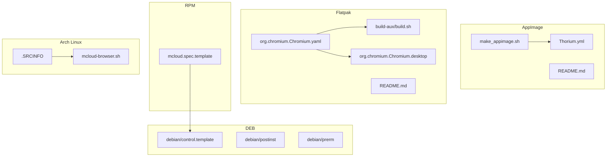
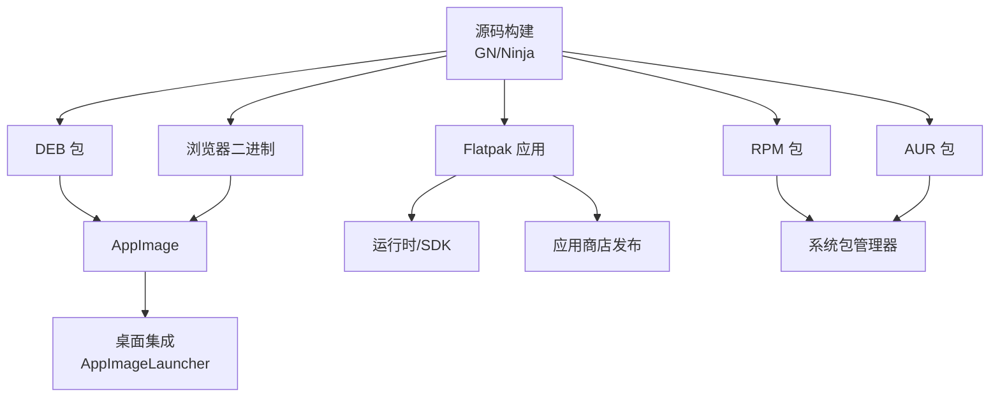
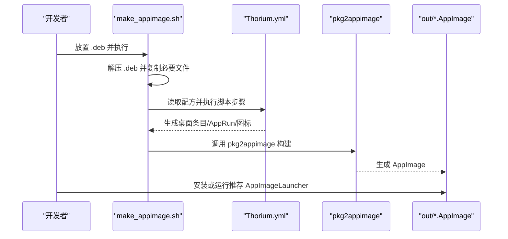
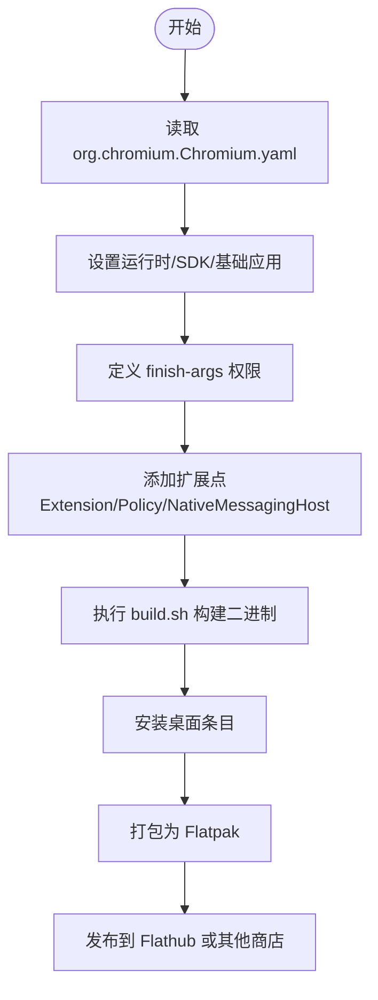
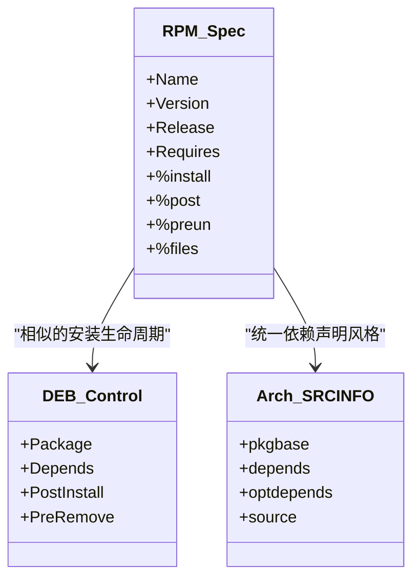
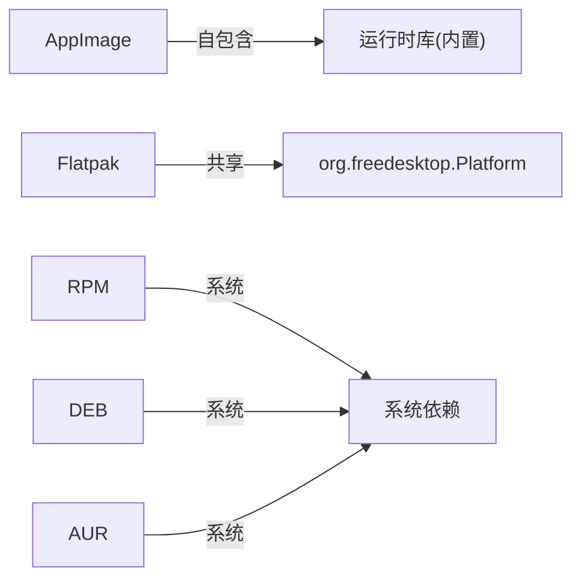

# Linux 包制作

<cite>
**本文引用的文件**
- [infra/APPIMAGE/README.md](file://infra/APPIMAGE/README.md)
- [infra/APPIMAGE/make_appimage.sh](file://infra/APPIMAGE/make_appimage.sh)
- [infra/APPIMAGE/Thorium.yml](file://infra/APPIMAGE/Thorium.yml)
- [infra/Flatpak/com.mcloud.browser/README.md](file://infra/Flatpak/com.mcloud.browser/README.md)
- [infra/Flatpak/com.mcloud.browser/org.chromium.Chromium.yaml](file://infra/Flatpak/com.mcloud.browser/org.chromium.Chromium.yaml)
- [infra/Flatpak/com.mcloud.browser/build-aux/build.sh](file://infra/Flatpak/com.mcloud.browser/build-aux/build.sh)
- [infra/Flatpak/com.mcloud.browser/org.chromium.Chromium.desktop](file://infra/Flatpak/com.mcloud.browser/org.chromium.Chromium.desktop)
- [src/chrome/installer/linux/rpm/mcloud.spec.template](file://src/chrome/installer/linux/rpm/mcloud.spec.template)
- [infra/Arch_Linux/.SRCINFO](file://infra/Arch_Linux/.SRCINFO)
- [infra/Arch_Linux/mcloud-browser.sh](file://infra/Arch_Linux/mcloud-browser.sh)
</cite>

## 目录
1. [简介](#简介)
2. [项目结构](#项目结构)
3. [核心组件](#核心组件)
4. [架构总览](#架构总览)
5. [详细组件分析](#详细组件分析)
6. [依赖分析](#依赖分析)
7. [性能与体积优化](#性能与体积优化)
8. [故障排查指南](#故障排查指南)
9. [结论](#结论)
10. [附录](#附录)

## 简介
本文件面向在 Linux 平台打包 Thorium/Mcloud Browser 的工程师与维护者，系统性说明以下目标：
- AppImage 包的构建流程：依赖管理、沙箱配置、桌面集成与分发格式转换。
- Flatpak 包的创建过程：元数据配置、运行时环境设置、权限管理与应用商店发布准备。
- 传统发行版打包方法：RPM、DEB（以模板为主）及 Arch Linux AUR 包的制作与依赖声明。
- 包大小优化策略：依赖共享、资源裁剪与增量更新机制。
- 跨发行版兼容性处理与测试验证流程。

## 项目结构
仓库中与 Linux 打包相关的核心目录与文件如下：
- AppImage：位于 infra/APPIMAGE，包含生成脚本与 pkg2appimage 配方。
- Flatpak：位于 infra/Flatpak/com.mcloud.browser，包含 Flatpak 清单、构建辅助脚本、补丁与桌面入口。
- RPM：位于 src/chrome/installer/linux/rpm，提供 spec 模板与安装后脚本片段。
- DEB：位于 src/chrome/installer/linux/debian，提供控制模板与 post/prerm 等钩子脚本。
- Arch Linux：位于 infra/Arch_Linux，提供 .SRCINFO 与启动包装脚本。

**图示来源**
- [infra/APPIMAGE/make_appimage.sh:1-79](file://infra/APPIMAGE/make_appimage.sh#L1-L79)
- [infra/APPIMAGE/Thorium.yml:1-77](file://infra/APPIMAGE/Thorium.yml#L1-L77)
- [infra/Flatpak/com.mcloud.browser/org.chromium.Chromium.yaml:1-153](file://infra/Flatpak/com.mcloud.browser/org.chromium.Chromium.yaml#L1-L153)
- [infra/Flatpak/com.mcloud.browser/build-aux/build.sh:1-16](file://infra/Flatpak/com.mcloud.browser/build-aux/build.sh#L1-L16)
- [src/chrome/installer/linux/rpm/mcloud.spec.template:1-235](file://src/chrome/installer/linux/rpm/mcloud.spec.template#L1-L235)
- [infra/Arch_Linux/.SRCINFO:1-29](file://infra/Arch_Linux/.SRCINFO#L1-L29)

**章节来源**
- [infra/APPIMAGE/README.md:1-20](file://infra/APPIMAGE/README.md#L1-L20)
- [infra/Flatpak/com.mcloud.browser/README.md:1-64](file://infra/Flatpak/com.mcloud.browser/README.md#L1-L64)

## 核心组件
- AppImage 构建流水线：通过 make_appimage.sh 从 .deb 提取产物，使用 Thorium.yml 进行资源整理、图标注入、桌面条目生成与 AppRun 封装，最终由 pkg2appimage 生成可分发的 .AppImage。
- Flatpak 应用清单：org.chromium.Chromium.yaml 定义运行时、SDK、扩展点、权限与模块；build.sh 负责链接工具链并构建二进制；desktop 文件提供桌面集成。
- RPM 打包模板：mcloud.spec.template 定义包元信息、依赖、安装路径、post/preun 钩子与系统服务集成。
- DEB 打包模板：control.template 与 postinst/prerm 提供 Debian/Ubuntu 系依赖声明与安装后行为。
- Arch Linux AUR：.SRCINFO 声明二进制包来源与依赖；mcloud-browser.sh 作为启动包装器支持用户命令行参数覆盖。

**章节来源**
- [infra/APPIMAGE/make_appimage.sh:1-79](file://infra/APPIMAGE/make_appimage.sh#L1-L79)
- [infra/APPIMAGE/Thorium.yml:1-77](file://infra/APPIMAGE/Thorium.yml#L1-L77)
- [infra/Flatpak/com.mcloud.browser/org.chromium.Chromium.yaml:1-153](file://infra/Flatpak/com.mcloud.browser/org.chromium.Chromium.yaml#L1-L153)
- [infra/Flatpak/com.mcloud.browser/build-aux/build.sh:1-16](file://infra/Flatpak/com.mcloud.browser/build-aux/build.sh#L1-L16)
- [src/chrome/installer/linux/rpm/mcloud.spec.template:1-235](file://src/chrome/installer/linux/rpm/mcloud.spec.template#L1-L235)
- [infra/Arch_Linux/.SRCINFO:1-29](file://infra/Arch_Linux/.SRCINFO#L1-L29)
- [infra/Arch_Linux/mcloud-browser.sh:1-12](file://infra/Arch_Linux/mcloud-browser.sh#L1-L12)

## 架构总览
下图展示三种主要打包产物的构建与集成关系：

**图示来源**
- [infra/APPIMAGE/Thorium.yml:1-77](file://infra/APPIMAGE/Thorium.yml#L1-L77)
- [infra/Flatpak/com.mcloud.browser/org.chromium.Chromium.yaml:1-153](file://infra/Flatpak/com.mcloud.browser/org.chromium.Chromium.yaml#L1-L153)
- [src/chrome/installer/linux/rpm/mcloud.spec.template:1-235](file://src/chrome/installer/linux/rpm/mcloud.spec.template#L1-L235)
- [infra/Arch_Linux/.SRCINFO:1-29](file://infra/Arch_Linux/.SRCINFO#L1-L29)

## 详细组件分析

### AppImage 构建流程
- 输入要求：将生成的 .deb 放入 infra/APPIMAGE 目录。
- 提取阶段：脚本解压 data.tar.xz，复制必要的二进制、图标与 shell 包装器到临时目录。
- 资源整理：根据 Thorium.yml 将库、图标、桌面条目与 AppRun 写入标准布局。
- 生成阶段：调用 pkg2appimage 完成压缩与打包，输出 .AppImage。
- 桌面集成：生成 mcloud-browser.desktop，支持多动作（新窗口、隐身模式、安全模式、深色模式）。
- 运行入口：AppRun 设置 LD_LIBRARY_PATH 并执行主程序，确保静态自包含运行。

**图示来源**
- [infra/APPIMAGE/make_appimage.sh:1-79](file://infra/APPIMAGE/make_appimage.sh#L1-L79)
- [infra/APPIMAGE/Thorium.yml:1-77](file://infra/APPIMAGE/Thorium.yml#L1-L77)

**章节来源**
- [infra/APPIMAGE/README.md:1-20](file://infra/APPIMAGE/README.md#L1-L20)
- [infra/APPIMAGE/make_appimage.sh:1-79](file://infra/APPIMAGE/make_appimage.sh#L1-L79)
- [infra/APPIMAGE/Thorium.yml:1-77](file://infra/APPIMAGE/Thorium.yml#L1-L77)

### Flatpak 包创建过程
- 元数据配置：org.chromium.Chromium.yaml 定义 app-id、运行时版本、命令、finish-args 权限、扩展点与模块。
- 运行时与环境：基于 org.freedesktop.Platform 与 org.chromium.Chromium.BaseApp，启用 IPC/网络/CUPS/PulseAudio/X11/Wayland 等 socket 共享。
- 扩展点：
  - org.chromium.Chromium.Extension：暴露 extensions/policies/native-messaging-hosts。
  - org.chromium.Chromium.Policy：兼容旧策略挂载。
  - org.chromium.Chromium.NativeMessagingHost：原生消息宿主。
- 构建流程：build.sh 链接 Node/OpenJDK 到 Chromium 期望路径，构建 libffmpeg.so 与 chrome 二进制。
- 桌面集成：org.chromium.Chromium.desktop 提供国际化名称、类别与动作。

**图示来源**
- [infra/Flatpak/com.mcloud.browser/org.chromium.Chromium.yaml:1-153](file://infra/Flatpak/com.mcloud.browser/org.chromium.Chromium.yaml#L1-L153)
- [infra/Flatpak/com.mcloud.browser/build-aux/build.sh:1-16](file://infra/Flatpak/com.mcloud.browser/build-aux/build.sh#L1-L16)
- [infra/Flatpak/com.mcloud.browser/org.chromium.Chromium.desktop:1-226](file://infra/Flatpak/com.mcloud.browser/org.chromium.Chromium.desktop#L1-L226)

**章节来源**
- [infra/Flatpak/com.mcloud.browser/README.md:1-64](file://infra/Flatpak/com.mcloud.browser/README.md#L1-L64)
- [infra/Flatpak/com.mcloud.browser/org.chromium.Chromium.yaml:1-153](file://infra/Flatpak/com.mcloud.browser/org.chromium.Chromium.yaml#L1-L153)
- [infra/Flatpak/com.mcloud.browser/build-aux/build.sh:1-16](file://infra/Flatpak/com.mcloud.browser/build-aux/build.sh#L1-L16)
- [infra/Flatpak/com.mcloud.browser/org.chromium.Chromium.desktop:1-226](file://infra/Flatpak/com.mcloud.browser/org.chromium.Chromium.desktop#L1-L226)

### 传统发行版打包（RPM/DEB/AUR）
- RPM：
  - 模板定义包名、版本、依赖、安装前/后脚本、文件列表与系统服务集成。
  - 安装后脚本会注册替代项、创建符号链接、配置默认仓库优先级等。
- DEB：
  - control.template 与 postinst/prerm 提供依赖声明与安装生命周期钩子。
  - 用于 Debian/Ubuntu 系的依赖管理与系统集成。
- Arch Linux：
  - .SRCINFO 声明二进制包来源、依赖与可选依赖。
  - mcloud-browser.sh 作为启动包装器，允许用户通过配置文件覆盖命令行参数。

**图示来源**
- [src/chrome/installer/linux/rpm/mcloud.spec.template:1-235](file://src/chrome/installer/linux/rpm/mcloud.spec.template#L1-L235)
- [infra/Arch_Linux/.SRCINFO:1-29](file://infra/Arch_Linux/.SRCINFO#L1-L29)

**章节来源**
- [src/chrome/installer/linux/rpm/mcloud.spec.template:1-235](file://src/chrome/installer/linux/rpm/mcloud.spec.template#L1-L235)
- [infra/Arch_Linux/.SRCINFO:1-29](file://infra/Arch_Linux/.SRCINFO#L1-L29)
- [infra/Arch_Linux/mcloud-browser.sh:1-12](file://infra/Arch_Linux/mcloud-browser.sh#L1-L12)

## 依赖分析
- AppImage：
  - 依赖通过 pkg2appimage 与 Thorium.yml 配方内联管理，将所需库与资源打包进单一可执行文件。
  - 图标与桌面条目在构建时生成，避免外部依赖。
- Flatpak：
  - 运行时与 SDK 由 org.freedesktop.Platform 与 org.chromium.Chromium.BaseApp 提供，减少重复依赖。
  - 扩展点将策略、扩展与原生宿主解耦，便于按需加载。
- RPM/DEB：
  - 依赖通过模板中的 Requires/Depends 声明，结合系统包管理器解析。
  - 安装后脚本负责注册系统服务与符号链接。
- Arch Linux：
  - 依赖在 .SRCINFO 中声明，支持可选依赖（如 pipewire、kdialog、keyring）。

**图示来源**
- [infra/APPIMAGE/Thorium.yml:1-77](file://infra/APPIMAGE/Thorium.yml#L1-L77)
- [infra/Flatpak/com.mcloud.browser/org.chromium.Chromium.yaml:1-153](file://infra/Flatpak/com.mcloud.browser/org.chromium.Chromium.yaml#L1-L153)
- [src/chrome/installer/linux/rpm/mcloud.spec.template:1-235](file://src/chrome/installer/linux/rpm/mcloud.spec.template#L1-L235)
- [infra/Arch_Linux/.SRCINFO:1-29](file://infra/Arch_Linux/.SRCINFO#L1-L29)

**章节来源**
- [infra/APPIMAGE/Thorium.yml:1-77](file://infra/APPIMAGE/Thorium.yml#L1-L77)
- [infra/Flatpak/com.mcloud.browser/org.chromium.Chromium.yaml:1-153](file://infra/Flatpak/com.mcloud.browser/org.chromium.Chromium.yaml#L1-L153)
- [src/chrome/installer/linux/rpm/mcloud.spec.template:1-235](file://src/chrome/installer/linux/rpm/mcloud.spec.template#L1-L235)
- [infra/Arch_Linux/.SRCINFO:1-29](file://infra/Arch_Linux/.SRCINFO#L1-L29)

## 性能与体积优化
- 依赖共享：
  - Flatpak 使用 BaseApp 与 Platform 运行时，避免重复打包系统库。
  - 通过 add-extensions 将编解码器与策略按需挂载，减小主包体积。
- 资源裁剪：
  - AppImage 构建时移除冗余 libffmpeg.so，仅保留必要库。
  - 图标按 hicolor 规范生成多尺寸，避免过大资源。
- 增量更新：
  - Flatpak 支持扩展点 autodelete 与合并目录，便于增量更新策略与扩展。
  - RPM/DEB 利用系统包管理器实现增量升级与依赖解析。
- 构建加速：
  - Flatpak 构建脚本使用并行 Ninja 构建，减少编译时间。
  - GN 参数可启用 LLD 与关闭不必要功能以提升构建速度。

[本节为通用指导，不直接分析具体文件]

## 故障排查指南
- AppImage 无法启动：
  - 确认已正确放置 .deb 并执行 make_appimage.sh。
  - 检查 Thorium.yml 中 AppRun 与桌面条目是否正确生成。
  - 使用 AppImageLauncher 进行系统集成与调试。
- Flatpak 权限问题：
  - 检查 org.chromium.Chromium.yaml 中 finish-args 是否包含所需 socket（x11/wayland/pulseaudio/cups）。
  - 确认扩展点目录结构与版本匹配。
- RPM/DEB 安装失败：
  - 核对 mcloud.spec.template 与 control.template 中的依赖声明。
  - 查看 postinst/prerm 脚本输出日志定位错误。
- Arch Linux 启动异常：
  - 检查 mcloud-browser.sh 是否能正确读取用户标志配置文件。
  - 确认 .SRCINFO 中依赖已满足。

**章节来源**
- [infra/APPIMAGE/README.md:1-20](file://infra/APPIMAGE/README.md#L1-L20)
- [infra/APPIMAGE/make_appimage.sh:1-79](file://infra/APPIMAGE/make_appimage.sh#L1-L79)
- [infra/Flatpak/com.mcloud.browser/org.chromium.Chromium.yaml:1-153](file://infra/Flatpak/com.mcloud.browser/org.chromium.Chromium.yaml#L1-L153)
- [src/chrome/installer/linux/rpm/mcloud.spec.template:1-235](file://src/chrome/installer/linux/rpm/mcloud.spec.template#L1-L235)
- [infra/Arch_Linux/mcloud-browser.sh:1-12](file://infra/Arch_Linux/mcloud-browser.sh#L1-L12)

## 结论
本项目提供了完整的 Linux 打包方案：
- AppImage 适合快速分发与跨发行版运行，强调自包含与桌面集成。
- Flatpak 强调沙箱化与扩展点机制，适合应用商店发布与长期维护。
- RPM/DEB/AUR 与传统发行版生态紧密集成，便于企业部署与批量管理。
通过合理的依赖管理、资源裁剪与增量更新策略，可在保证功能完整性的同时优化包体积与构建效率。

[本节为总结性内容，不直接分析具体文件]

## 附录
- 关键路径参考：
  - AppImage 构建脚本与配方：infra/APPIMAGE/make_appimage.sh、infra/APPIMAGE/Thorium.yml
  - Flatpak 清单与构建：infra/Flatpak/com.mcloud.browser/org.chromium.Chromium.yaml、infra/Flatpak/com.mcloud.browser/build-aux/build.sh
  - RPM 模板：src/chrome/installer/linux/rpm/mcloud.spec.template
  - Arch Linux AUR：infra/Arch_Linux/.SRCINFO、infra/Arch_Linux/mcloud-browser.sh

[本节为索引性内容，不直接分析具体文件]