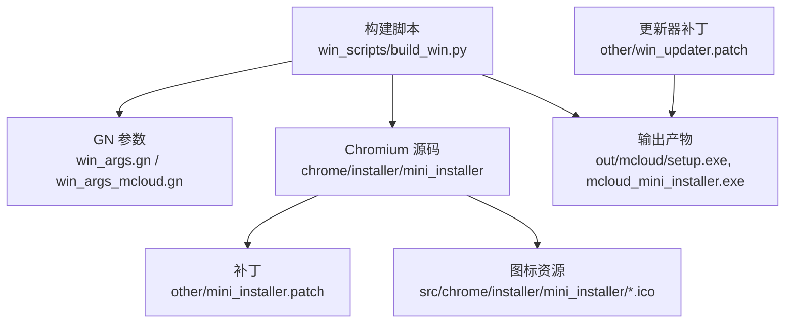
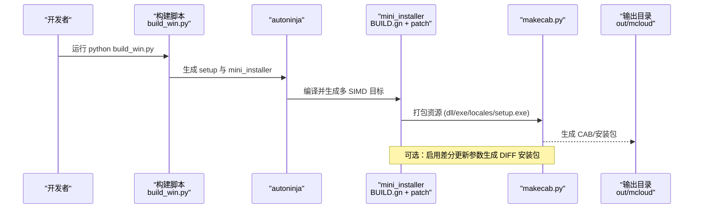
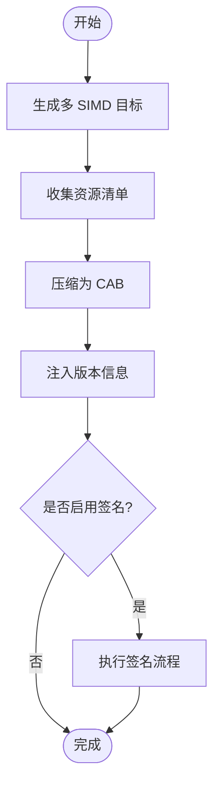
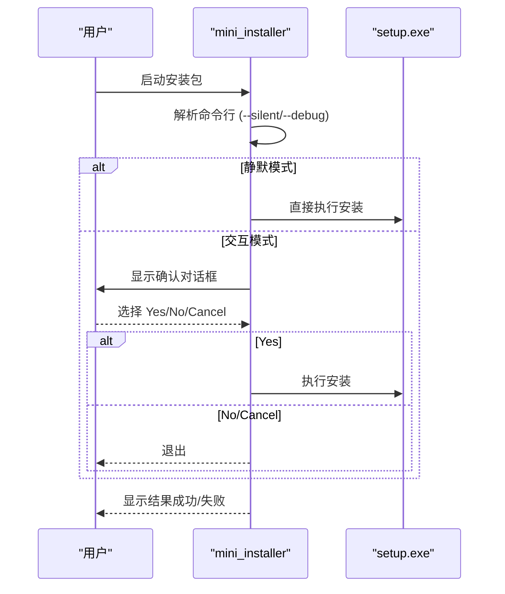
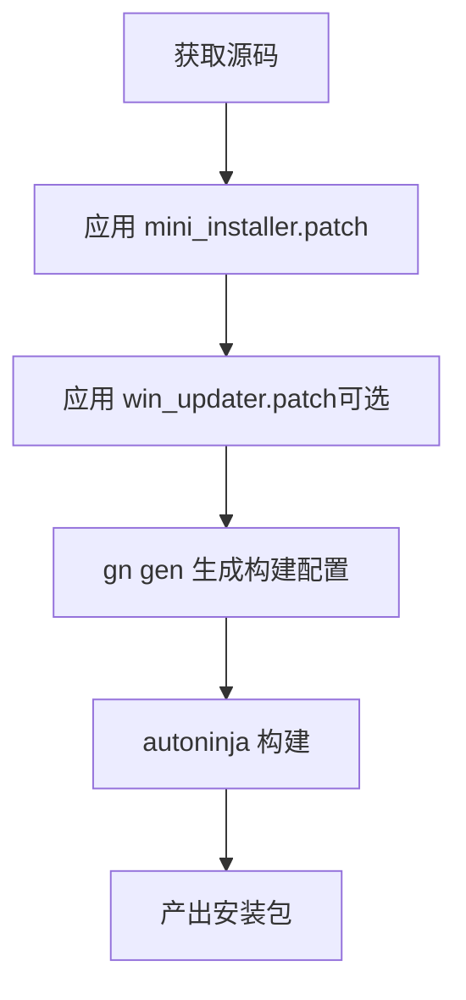
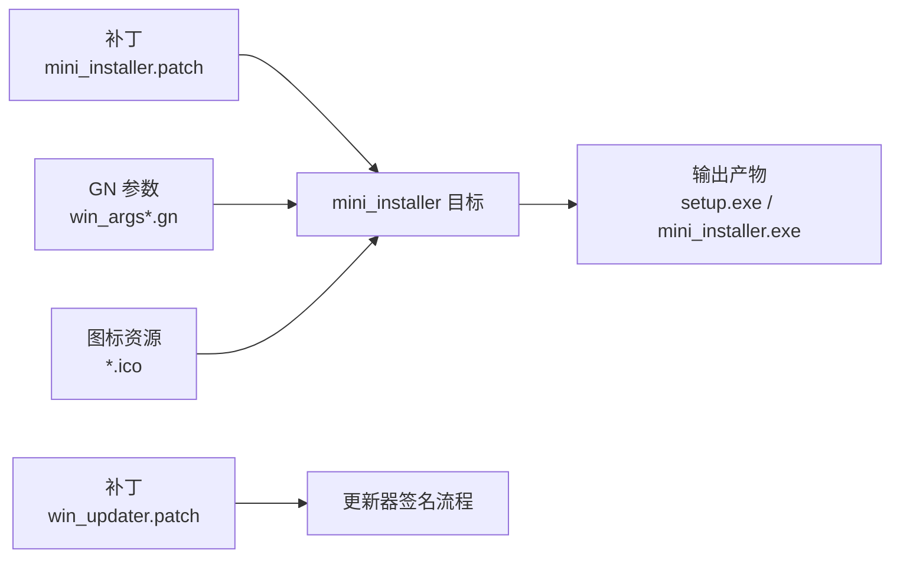

# Windows 安装包制作

<cite>
**本文引用的文件**
- [other/mini_installer.patch](file://other/mini_installer.patch)
- [win_scripts/build_win.py](file://win_scripts/build_win.py)
- [win_args.gn](file://win_args.gn)
- [win_args_mcloud.gn](file://win_args_mcloud.gn)
- [src/chrome/installer/mini_installer/failed.ico](file://src/chrome/installer/mini_installer/failed.ico)
- [src/chrome/installer/mini_installer/mini_installer.ico](file://src/chrome/installer/mini_installer/mini_installer.ico)
- [src/chrome/installer/mini_installer/success.ico](file://src/chrome/installer/mini_installer/success.ico)
- [other/win_updater.patch](file://other/win_updater.patch)
</cite>

## 目录
1. [简介](#简介)
2. [项目结构](#项目结构)
3. [核心组件](#核心组件)
4. [架构总览](#架构总览)
5. [详细组件分析](#详细组件分析)
6. [依赖关系分析](#依赖关系分析)
7. [性能与体积优化](#性能与体积优化)
8. [故障排查指南](#故障排查指南)
9. [结论](#结论)
10. [附录](#附录)

## 简介
本文件面向 Windows 平台安装包制作，聚焦 mini_installer 的构建、资源打包、数字签名、版本信息嵌入、安装程序定制、补丁应用流程、增量更新机制、界面与选项配置、权限处理以及质量检查（签名验证、完整性检查、兼容性测试）。文档基于仓库中的补丁、GN 参数与构建脚本进行说明，帮助读者在不深入源码细节的前提下完成可复现的安装包构建。

## 项目结构
Windows 安装包相关的关键位置与职责：
- other/mini_installer.patch：对 Chromium 内置 mini_installer 的增强与定制（SIMD 编译开关、多目标产物、UI 交互、命令行参数、注册表键名、资源图标等）。
- win_scripts/build_win.py：Windows 构建入口，调用 autoninja 生成 setup.exe 与 mini_installer。
- win_args.gn / win_args_mcloud.gn：Windows 构建参数，控制 SIMD、优化、媒体能力、Widevine、PGO 等。
- src/chrome/installer/mini_installer/*.ico：安装包 UI 图标资源。
- other/win_updater.patch：Windows 更新器签名流程简化与标签注入调整。

**图表来源**
- [win_scripts/build_win.py:34-50](file://win_scripts/build_win.py#L34-L50)
- [win_args.gn:1-87](file://win_args.gn#L1-L87)
- [win_args_mcloud.gn:1-126](file://win_args_mcloud.gn#L1-L126)
- [other/mini_installer.patch:1-224](file://other/mini_installer.patch#L1-L224)

**章节来源**
- [win_scripts/build_win.py:34-50](file://win_scripts/build_win.py#L34-L50)
- [win_args.gn:1-87](file://win_args.gn#L1-L87)
- [win_args_mcloud.gn:1-126](file://win_args_mcloud.gn#L1-L126)
- [other/mini_installer.patch:1-224](file://other/mini_installer.patch#L1-L224)

## 核心组件
- mini_installer 构建与打包：通过 GN 模板生成多 SIMD 目标的 mini_installer 可执行体，并将 chrome.dll、chrome_elf.dll、mcloud.exe、mcloud_flags.txt、locales、setup.exe 等资源打包进压缩包，最终由 makecab.py 生成 CAB。
- 版本信息嵌入：通过 process_version("mini_installer_version") 将 //chrome/VERSION 注入到 mini_installer_version.h，供运行时显示版本号与产品名。
- 数字签名：默认跳过签名步骤（win_updater.patch 中移除签名逻辑），便于本地构建；生产环境可按需恢复或替换为外部签名流程。
- 安装程序定制：新增 --silent、--debug、--no-cleanup、--cleanup 等命令行参数；提供 TaskDialog 交互界面，支持静默安装与日志输出重定向。
- 注册表与路径常量：将客户端键基从 Chromium 改为 Mcloud Browser，临时目录前缀改为 TH_，避免冲突。
- 增量更新：BUILD.gn 中预留了 last_chrome_installer、setup_exe_format=DIFF、diff_algorithm=ZUCCHINI 等参数以生成差分安装包（当前注释掉，按需启用）。

**章节来源**
- [other/mini_installer.patch:1-224](file://other/mini_installer.patch#L1-L224)
- [other/mini_installer.patch:224-301](file://other/mini_installer.patch#L224-L301)
- [other/mini_installer.patch:301-638](file://other/mini_installer.patch#L301-L638)
- [other/mini_installer.patch:638-796](file://other/mini_installer.patch#L638-L796)
- [other/win_updater.patch:65-121](file://other/win_updater.patch#L65-L121)

## 架构总览
下图展示 Windows 安装包从构建到产物的关键流程，包括 mini_installer 的资源打包、可选的差分生成、签名与版本信息嵌入。

**图表来源**
- [win_scripts/build_win.py:34-50](file://win_scripts/build_win.py#L34-L50)
- [other/mini_installer.patch:147-224](file://other/mini_installer.patch#L147-L224)

## 详细组件分析

### mini_installer 构建与资源打包
- 多 SIMD 目标：根据 use_sse2/use_sse3/use_sse41/use_sse42/use_avx/use_avx2/use_avx512 生成多个 mini_installer 目标，并在 group("mini_installer") 中选择合适目标。
- 资源清单：包含 mcloud.exe、mcloud_flags.txt、chrome.dll、chrome_elf.dll、locales/en-US.pak、setup.exe 等。
- 压缩与归档：使用 makecab.py 生成 CAB，支持 verbose 输出以便调试。
- 版本注入：process_version("mini_installer_version") 将 //chrome/VERSION 注入头文件，供运行时读取。

**图表来源**
- [other/mini_installer.patch:16-47](file://other/mini_installer.patch#L16-L47)
- [other/mini_installer.patch:147-224](file://other/mini_installer.patch#L147-L224)
- [other/mini_installer.patch:66-77](file://other/mini_installer.patch#L66-L77)

**章节来源**
- [other/mini_installer.patch:16-47](file://other/mini_installer.patch#L16-L47)
- [other/mini_installer.patch:147-224](file://other/mini_installer.patch#L147-L224)
- [other/mini_installer.patch:66-77](file://other/mini_installer.patch#L66-L77)

### 数字签名验证
- 默认行为：win_updater.patch 移除了签名与时间戳重试逻辑，使本地构建无需证书即可产出产物。
- 生产建议：如需恢复签名，可在 sign.py 中恢复 signtool 调用链，并配置证书与时间戳服务器；或在 CI 中引入独立签名步骤。

**章节来源**
- [other/win_updater.patch:65-121](file://other/win_updater.patch#L65-L121)

### 版本信息嵌入
- 通过 process_version("mini_installer_version") 将 //chrome/VERSION 转换为 mini_installer_version.h，供 mini_installer 在运行时读取版本号与产品名。
- 资源 RC 模板用于生成 exe 版本资源，确保系统属性中可见版本信息。

**章节来源**
- [other/mini_installer.patch:66-77](file://other/mini_installer.patch#L66-L77)

### 安装程序定制（界面、选项、权限）
- 命令行参数：
  - --system-level：系统级安装（保留原意）。
  - --silent：静默安装，跳过 UI。
  - --debug：启用日志输出并重定向到控制台。
  - --no-cleanup / --cleanup：控制是否删除解压后的临时文件。
- 用户界面：
  - 使用 TaskDialogIndirect 创建主对话框，显示“Would you like to install ...?”，支持 Yes/No/Cancel。
  - 安装进行中显示进度条与状态消息，完成后显示成功或失败对话框。
- 权限处理：
  - 系统级安装路径与注册表键基已切换至 Mcloud Browser，避免与 Chromium 冲突。
  - 静默模式适合自动化部署，非静默模式提供用户确认。

**图表来源**
- [other/mini_installer.patch:224-301](file://other/mini_installer.patch#L224-L301)
- [other/mini_installer.patch:301-638](file://other/mini_installer.patch#L301-L638)

**章节来源**
- [other/mini_installer.patch:224-301](file://other/mini_installer.patch#L224-L301)
- [other/mini_installer.patch:301-638](file://other/mini_installer.patch#L301-L638)

### 补丁文件的应用流程
- 应用顺序：先应用 mini_installer.patch 以增强 mini_installer；再根据需要应用 win_updater.patch 以调整更新器签名流程。
- 影响范围：
  - mini_installer.patch：编译开关、资源清单、UI、命令行、注册表键、版本注入。
  - win_updater.patch：更新器标签注入与签名流程简化。

**图表来源**
- [other/mini_installer.patch:1-224](file://other/mini_installer.patch#L1-L224)
- [other/win_updater.patch:1-121](file://other/win_updater.patch#L1-L121)

**章节来源**
- [other/mini_installer.patch:1-224](file://other/mini_installer.patch#L1-L224)
- [other/win_updater.patch:1-121](file://other/win_updater.patch#L1-L121)

### 增量更新机制
- 构建参数：在 mini_installer_archive action 中预留 last_chrome_installer、setup_exe_format=DIFF、diff_algorithm=ZUCCHINI 等参数，用于生成差分安装包。
- 使用方式：取消注释并传入相应参数，构建时将基于上一个安装器生成差分包，减少下载体积。

**章节来源**
- [other/mini_installer.patch:177-224](file://other/mini_installer.patch#L177-L224)

## 依赖关系分析
- 构建脚本依赖 GN 参数决定编译目标与优化策略。
- mini_installer 依赖 Chromium 的 installer/util 与 updater 模块，同时受补丁影响。
- 图标资源与 RC 模板参与资源打包与版本信息嵌入。

**图表来源**
- [other/mini_installer.patch:147-224](file://other/mini_installer.patch#L147-L224)
- [other/win_updater.patch:65-121](file://other/win_updater.patch#L65-L121)
- [win_args.gn:1-87](file://win_args.gn#L1-L87)
- [win_args_mcloud.gn:1-126](file://win_args_mcloud.gn#L1-L126)

**章节来源**
- [other/mini_installer.patch:147-224](file://other/mini_installer.patch#L147-L224)
- [other/win_updater.patch:65-121](file://other/win_updater.patch#L65-L121)
- [win_args.gn:1-87](file://win_args.gn#L1-L87)
- [win_args_mcloud.gn:1-126](file://win_args_mcloud.gn#L1-L126)

## 性能与体积优化
- SIMD 指令集：通过 win_args.gn / win_args_mcloud.gn 启用 SSE/AVX/AVX2/FMA，提升运行时性能；mini_installer 编译时按目标 CPU 自动选择最优指令集。
- 链接与裁剪：enable_stripping=true、exclude_unwind_tables=true、symbol_level=0 减小体积；use_thin_lto=true 提升链接效率。
- V8 与 WebRTC：启用 Maglev/TurboFan、WebAssembly SIMD256、WebRTC AVX2 加速。
- 媒体能力：FFmpeg/LibVPX 静态链接，禁用不必要的解码器或 DRM（如 Widevine 未下载时关闭）。
- PGO：通过 pgo_data_path 指定性能导向优化数据，进一步提升关键路径性能。
- 增量更新：启用差分算法可减少安装包体积与下载时间。

**章节来源**
- [win_args.gn:1-87](file://win_args.gn#L1-L87)
- [win_args_mcloud.gn:1-126](file://win_args_mcloud.gn#L1-L126)
- [other/mini_installer.patch:16-47](file://other/mini_installer.patch#L16-L47)
- [other/mini_installer.patch:177-224](file://other/mini_installer.patch#L177-L224)

## 故障排查指南
- 构建失败：检查 GN 参数是否正确（SIMD、target_os/target_cpu）、Python 脚本路径与 autoninja 可用。
- 签名问题：若启用签名，确保证书与时间戳服务器可达；否则保持默认跳过签名。
- 静默安装无效：确认传递了 --silent；检查日志输出（--debug）定位错误。
- 注册表冲突：确认键基已切换为 Mcloud Browser，避免与 Chromium 冲突。
- 增量更新失败：核对 last_chrome_installer 路径与差分算法参数；确保上一版本安装器存在且兼容。

**章节来源**
- [other/mini_installer.patch:224-301](file://other/mini_installer.patch#L224-L301)
- [other/mini_installer.patch:301-638](file://other/mini_installer.patch#L301-L638)
- [other/win_updater.patch:65-121](file://other/win_updater.patch#L65-L121)

## 结论
本项目通过补丁与 GN 参数对 Chromium 的 mini_installer 进行了深度定制，实现了多 SIMD 目标构建、资源打包、版本信息嵌入、静默安装与日志输出、注册表键名隔离、可选差分更新与简化签名流程。配合 win_args*.gn 的性能与体积优化，能够在 Windows 平台上高效产出高质量安装包。生产环境可根据需要恢复签名流程并完善 CI 质量门禁。

## 附录
- 构建命令参考：python win_scripts/build_win.py [jobs]
- 输出目录：out/mcloud（包含 setup.exe、mcloud_mini_installer.exe 等）
- 图标资源：src/chrome/installer/mini_installer/mini_installer.ico、success.ico、failed.ico

**章节来源**
- [win_scripts/build_win.py:34-50](file://win_scripts/build_win.py#L34-L50)
- [src/chrome/installer/mini_installer/mini_installer.ico](file://src/chrome/installer/mini_installer/mini_installer.ico)
- [src/chrome/installer/mini_installer/success.ico](file://src/chrome/installer/mini_installer/success.ico)
- [src/chrome/installer/mini_installer/failed.ico](file://src/chrome/installer/mini_installer/failed.ico)