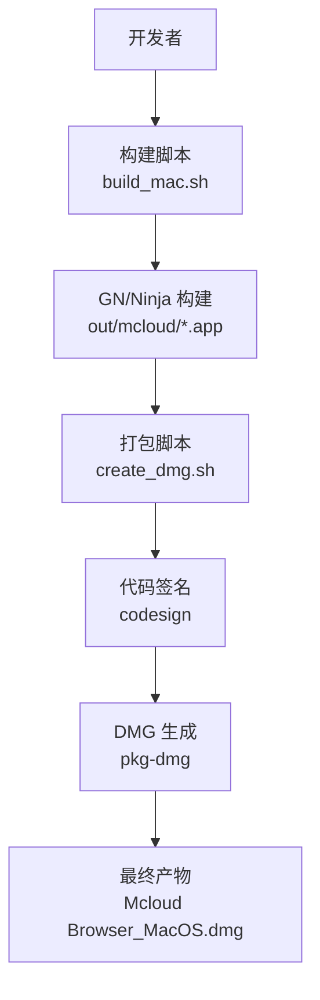
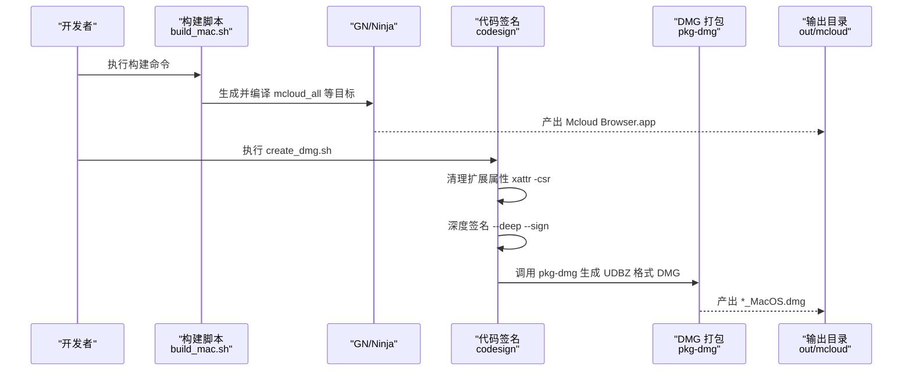
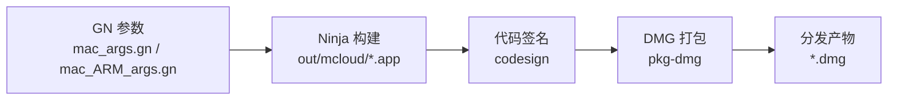
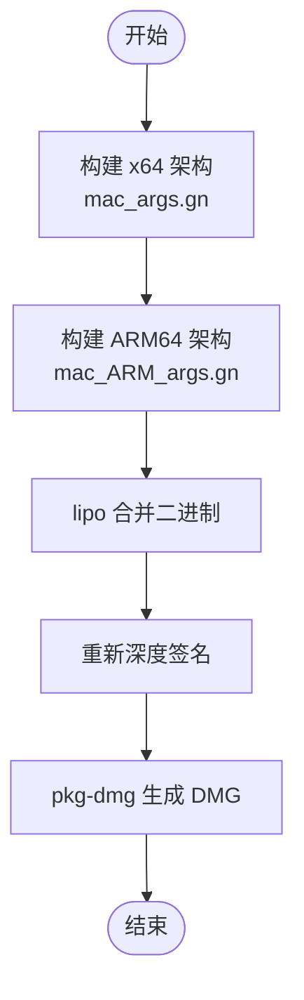
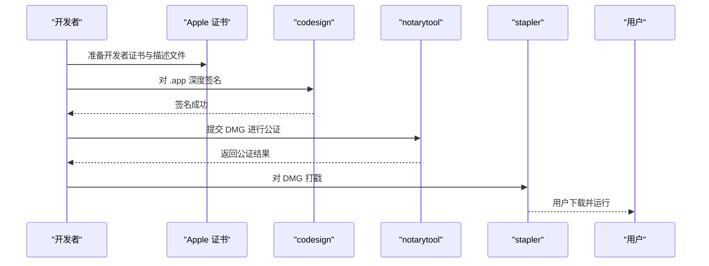

# macOS DMG 包制作

本文引用的文件

- [create_dmg.sh](https://github.com/Mcloud136/Mcloud-Browser/blob/main/create_dmg.sh)
- [build_mac.sh](https://github.com/Mcloud136/Mcloud-Browser/blob/main/build_mac.sh)
- [BUILDING_MAC.md](https://github.com/Mcloud136/Mcloud-Browser/blob/main/docs/BUILDING_MAC.md)
- [mac_args.gn](https://github.com/Mcloud136/Mcloud-Browser/blob/main/other/Mac/mac_args.gn)
- [mac_ARM_args.gn](https://github.com/Mcloud136/Mcloud-Browser/blob/main/other/Mac/mac_ARM_args.gn)
- [README.md](https://github.com/Mcloud136/Mcloud-Browser/blob/main/other/Mac/README.md)
- [build_dmg_cr.sh](https://github.com/Mcloud136/Mcloud-Browser/blob/main/infra/build_dmg_cr.sh)

## 目录
1. [简介](#简介)
2. [项目结构](#项目结构)
3. [核心组件](#核心组件)
4. [架构总览](#架构总览)
5. [详细组件分析](#详细组件分析)
6. [依赖关系分析](#依赖关系分析)
7. [性能与体积优化](#性能与体积优化)
8. [故障排查指南](#故障排查指南)
9. [结论](#结论)
10. [附录](#附录)

## 简介
本文件面向在 macOS 平台制作 Mcloud Browser（基于 Chromium）的 DMG 安装包，覆盖从构建、应用捆绑、资源组织、图标与启动配置，到代码签名、通用二进制（x64 与 ARM64）打包、DMG 压缩优化，以及质量保证流程（签名验证、架构兼容性与系统要求检查）。文档严格依据仓库中的脚本与配置文件进行说明，并提供可视化流程图帮助理解。

## 项目结构
与 macOS DMG 制作直接相关的工程结构与职责如下：
- 构建入口与产物输出
  - build_mac.sh：负责调用 GN/Ninja 构建浏览器主程序及安装器相关目标，并提示后续执行 create_dmg.sh。
  - create_dmg.sh：对已构建的 .app 进行属性修复、代码签名，并生成 DMG。
- 构建参数与平台配置
  - other/Mac/mac_args.gn：x64 平台的发布构建参数（包括 SIMD、媒体解码、Widevine、LTO、PGO 等）。
  - other/Mac/mac_ARM_args.gn：ARM64 平台的发布构建参数（与 x64 类似但 target_cpu 为 arm64）。
- 官方文档与参考
  - docs/BUILDING_MAC.md：macOS 构建环境、GN 参数设置、运行与生成 DMG 的步骤说明。
- 参考实现
  - infra/build_dmg_cr.sh：Chromium 原版的 DMG 打包脚本，可作为对照参考。

图表来源
- [build_mac.sh:63-83](https://github.com/Mcloud136/Mcloud-Browser/blob/main/build_mac.sh#L63-L83)
- [create_dmg.sh:31-40](https://github.com/Mcloud136/Mcloud-Browser/blob/main/create_dmg.sh#L31-L40)

章节来源
- [build_mac.sh:1-84](https://github.com/Mcloud136/Mcloud-Browser/blob/main/build_mac.sh#L1-L84)
- [create_dmg.sh:1-47](https://github.com/Mcloud136/Mcloud-Browser/blob/main/create_dmg.sh#L1-L47)
- [BUILDING_MAC.md:150-178](https://github.com/Mcloud136/Mcloud-Browser/blob/main/docs/BUILDING_MAC.md#L150-L178)

## 核心组件
- 构建阶段
  - 使用 GN 生成构建配置，Ninja 编译出 out/mcloud/Mcloud Browser.app。
  - 通过 build_mac.sh 统一封装并行构建与安装器目标构建。
- 打包阶段
  - 清理扩展属性后，使用 codesign 对 .app 进行深度签名。
  - 使用 chrome/installer/mac/pkg-dmg 将 .app 打包为 UDBZ 压缩格式的 DMG，并创建 /Applications 软链接以便拖拽安装。
- 平台参数
  - x64 与 ARM64 分别使用 mac_args.gn 与 mac_ARM_args.gn 控制目标 CPU、SIMD、媒体能力、Widevine、LTO、PGO 等。

章节来源
- [build_mac.sh:63-83](https://github.com/Mcloud136/Mcloud-Browser/blob/main/build_mac.sh#L63-L83)
- [create_dmg.sh:31-40](https://github.com/Mcloud136/Mcloud-Browser/blob/main/create_dmg.sh#L31-L40)
- [mac_args.gn:1-90](https://github.com/Mcloud136/Mcloud-Browser/blob/main/other/Mac/mac_args.gn#L1-L90)
- [mac_ARM_args.gn:1-83](https://github.com/Mcloud136/Mcloud-Browser/blob/main/other/Mac/mac_ARM_args.gn#L1-L83)

## 架构总览
下图展示了从源码到可分发 DMG 的完整流水线，包括构建、签名、打包与产物输出。

图表来源
- [build_mac.sh:63-83](https://github.com/Mcloud136/Mcloud-Browser/blob/main/build_mac.sh#L63-L83)
- [create_dmg.sh:31-40](https://github.com/Mcloud136/Mcloud-Browser/blob/main/create_dmg.sh#L31-L40)

## 详细组件分析

### 构建脚本 build_mac.sh
- 功能要点
  - 设置并行构建环境变量，进入 chromium/src 目录。
  - 调用 autoninja 构建 mcloud_all 与安装器相关目标。
  - 完成后提示执行 create_dmg.sh 生成 DMG。
- 关键路径
  - 构建目标：mcloud_all、chrome/installer/mac minidump_stackwalk。
  - 输出位置：out/mcloud。

章节来源
- [build_mac.sh:30-49](https://github.com/Mcloud136/Mcloud-Browser/blob/main/build_mac.sh#L30-L49)
- [build_mac.sh:63-83](https://github.com/Mcloud136/Mcloud-Browser/blob/main/build_mac.sh#L63-L83)

### DMG 打包脚本 create_dmg.sh
- 功能要点
  - 根据 CR_DIR 环境变量定位 chromium/src。
  - 清理 .app 的扩展属性，避免签名问题。
  - 使用 codesign 对 .app 进行深度签名。
  - 调用 pkg-dmg 生成 UDBZ 压缩 DMG，卷标与应用名由参数指定，并在 DMG 中创建 /Applications 软链接。
- 关键路径
  - 签名：codesign --force --deep --sign -
  - 打包：chrome/installer/mac/pkg-dmg --sourcefile --source ... --target ... --symlink /Applications:/Applications --format UDBZ

章节来源
- [create_dmg.sh:18-40](https://github.com/Mcloud136/Mcloud-Browser/blob/main/create_dmg.sh#L18-L40)

### 参考脚本 infra/build_dmg_cr.sh
- 作用
  - 提供 Chromium 原版的 DMG 打包流程，便于对比差异（如应用名称、目标路径）。
- 关键点
  - 同样使用 xattr 清理属性、codesign 签名、pkg-dmg 生成 DMG。

章节来源
- [build_dmg_cr.sh:18-40](https://github.com/Mcloud136/Mcloud-Browser/blob/main/infra/build_dmg_cr.sh#L18-L40)

### 平台构建参数
- x64 构建参数（mac_args.gn）
  - target_os=mac, target_cpu=x64, v8_target_cpu=x64。
  - 启用 SIMD（SSE/AVX/FMA）、媒体解码（FFmpeg/libvpx/HLS）、Widevine 与 CDM 宿主验证、Thin LTO、PGO。
- ARM64 构建参数（mac_ARM_args.gn）
  - target_os=mac, target_cpu=arm64, v8_target_cpu=arm64。
  - 与 x64 类似的媒体与 Widevine 配置，针对 ARM 的 NEON 等优化。

章节来源
- [mac_args.gn:1-90](https://github.com/Mcloud136/Mcloud-Browser/blob/main/other/Mac/mac_args.gn#L1-L90)
- [mac_ARM_args.gn:1-83](https://github.com/Mcloud136/Mcloud-Browser/blob/main/other/Mac/mac_ARM_args.gn#L1-L83)

### 文档与环境要求
- 系统要求
  - macOS 10.15+，APFS 卷，Xcode 与对应 SDK。
- 构建步骤
  - fetch 源码、gn args 编辑、autoninja 构建、create_dmg.sh 生成 DMG。
- 常见问题
  - Xcode 许可协议、Spotlight 索引影响构建性能等。

章节来源
- [BUILDING_MAC.md:5-33](https://github.com/Mcloud136/Mcloud-Browser/blob/main/docs/BUILDING_MAC.md#L5-L33)
- [BUILDING_MAC.md:150-178](https://github.com/Mcloud136/Mcloud-Browser/blob/main/docs/BUILDING_MAC.md#L150-L178)
- [BUILDING_MAC.md:310-339](https://github.com/Mcloud136/Mcloud-Browser/blob/main/docs/BUILDING_MAC.md#L310-L339)

## 依赖关系分析
- 构建依赖
  - depot_tools（fetch/gn/ninja）、Xcode 与 macOS SDK。
- 打包依赖
  - codesign（需有效开发者证书或本地临时签名用于测试）。
  - pkg-dmg（Chromium 内置工具，位于 chrome/installer/mac）。
- 平台差异
  - x64 与 ARM64 通过不同 GN 参数区分；如需通用二进制，需在两个架构下分别构建并合并（见“通用二进制”小节）。

图表来源
- [mac_args.gn:1-90](https://github.com/Mcloud136/Mcloud-Browser/blob/main/other/Mac/mac_args.gn#L1-L90)
- [mac_ARM_args.gn:1-83](https://github.com/Mcloud136/Mcloud-Browser/blob/main/other/Mac/mac_ARM_args.gn#L1-L83)
- [create_dmg.sh:31-40](https://github.com/Mcloud136/Mcloud-Browser/blob/main/create_dmg.sh#L31-L40)

章节来源
- [BUILDING_MAC.md:5-33](https://github.com/Mcloud136/Mcloud-Browser/blob/main/docs/BUILDING_MAC.md#L5-L33)
- [create_dmg.sh:31-40](https://github.com/Mcloud136/Mcloud-Browser/blob/main/create_dmg.sh#L31-L40)

## 性能与体积优化
- 构建期优化
  - 启用 Thin LTO 与 ICF，减少符号与重复数据。
  - 使用 PGO（profile-guided optimization）提升运行时性能。
  - 关闭调试符号（symbol_level=0），降低体积。
- 打包期优化
  - DMG 使用 UDBZ 压缩格式，平衡体积与解压速度。
  - 仅包含必要资源，避免冗余文件进入 .app 与 DMG。
- 运行时优化（建议）
  - 懒加载：按需加载大型资源模块，减少首启内存占用。
  - 资源预取：在空闲时后台预取常用资源，提升交互响应。
  - 注意：上述运行时策略属于应用层优化，需结合业务模块实现。

章节来源
- [mac_args.gn:70-90](https://github.com/Mcloud136/Mcloud-Browser/blob/main/other/Mac/mac_args.gn#L70-L90)
- [mac_ARM_args.gn:60-83](https://github.com/Mcloud136/Mcloud-Browser/blob/main/other/Mac/mac_ARM_args.gn#L60-L83)
- [create_dmg.sh:39-40](https://github.com/Mcloud136/Mcloud-Browser/blob/main/create_dmg.sh#L39-L40)

## 故障排查指南
- 常见错误与处理
  - 签名失败：确认已正确清理扩展属性（xattr -csr），并使用有效的开发者证书；若仅为本地测试，可使用临时签名。
  - 权限弹窗：首次运行可能触发钥匙串与网络权限提示，可通过命令行参数规避（开发用途）。
  - 构建性能慢：增大 vnode 缓存、启用 git fsmonitor/untracked cache、排除 Spotlight 索引。
- 验证步骤
  - 使用 codesign -vvv --deep 验证签名链。
  - 使用 file 与 lipo -info 检查二进制架构。
  - 使用 spctl --assess --type execute 验证 Gatekeeper 状态。

章节来源
- [create_dmg.sh:33-37](https://github.com/Mcloud136/Mcloud-Browser/blob/main/create_dmg.sh#L33-L37)
- [BUILDING_MAC.md:180-193](https://github.com/Mcloud136/Mcloud-Browser/blob/main/docs/BUILDING_MAC.md#L180-L193)
- [BUILDING_MAC.md:239-308](https://github.com/Mcloud136/Mcloud-Browser/blob/main/docs/BUILDING_MAC.md#L239-L308)

## 结论
本项目提供了清晰的 macOS DMG 打包流水线：通过 build_mac.sh 完成构建，再由 create_dmg.sh 进行签名与 DMG 生成。x64 与 ARM64 通过独立 GN 参数管理，满足多架构需求。结合 LTO、PGO 与 UDBZ 压缩，可在保证性能的同时控制产物体积。建议在 CI 中加入签名验证、架构检查与系统版本校验，确保交付质量。

## 附录

### 通用二进制（Universal Binary）制作方法（x64 + ARM64）
- 步骤概述
  - 分别以 mac_args.gn（x64）与 mac_ARM_args.gn（ARM64）构建两次，得到两个架构的 .app。
  - 使用 lipo 将两个架构的二进制合并为通用二进制。
  - 重新对合并后的 .app 进行深度签名。
  - 再次使用 pkg-dmg 生成 DMG。
- 注意事项
  - 确保两个架构的依赖与资源一致。
  - 合并后必须重新签名，否则 Gatekeeper 会拒绝运行。

图表来源
- [mac_args.gn:1-90](https://github.com/Mcloud136/Mcloud-Browser/blob/main/other/Mac/mac_args.gn#L1-L90)
- [mac_ARM_args.gn:1-83](https://github.com/Mcloud136/Mcloud-Browser/blob/main/other/Mac/mac_ARM_args.gn#L1-L83)
- [create_dmg.sh:31-40](https://github.com/Mcloud136/Mcloud-Browser/blob/main/create_dmg.sh#L31-L40)

### 代码签名与公证流程（要求与步骤）
- 开发者证书获取
  - 在 Apple Developer 账户创建证书与描述文件，导入到钥匙串。
  - 配置团队 ID 与 Bundle ID，确保与 Info.plist 一致。
- 代码签名验证
  - 使用 codesign -vvv --deep 验证签名链完整性。
  - 使用 spctl --assess --type execute 检查 Gatekeeper 是否允许运行。
- 应用公证（Notarization）
  - 使用 altool 或 notarytool 提交 DMG 至 Apple Notary Service。
  - 等待公证结果，使用 stapler 对 DMG 打戳。
  - 分发前再次验证签名与公证状态。

图表来源
- [create_dmg.sh:33-37](https://github.com/Mcloud136/Mcloud-Browser/blob/main/create_dmg.sh#L33-L37)
- [build_dmg_cr.sh:33-37](https://github.com/Mcloud136/Mcloud-Browser/blob/main/infra/build_dmg_cr.sh#L33-L37)

### 质量保证流程清单
- 签名验证
  - codesign -vvv --deep 检查签名链。
  - spctl --assess --type execute 检查 Gatekeeper。
- 架构兼容性
  - file 与 lipo -info 确认包含 x64 与 ARM64。
- 系统要求检查
  - 最低系统版本与 SDK 匹配（参考 BUILDING_MAC.md）。
- 自动化建议
  - 在 CI 中集成上述检查项，失败则阻断发布。

章节来源
- [BUILDING_MAC.md:5-33](https://github.com/Mcloud136/Mcloud-Browser/blob/main/docs/BUILDING_MAC.md#L5-L33)
- [create_dmg.sh:33-37](https://github.com/Mcloud136/Mcloud-Browser/blob/main/create_dmg.sh#L33-L37)