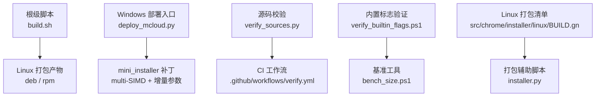
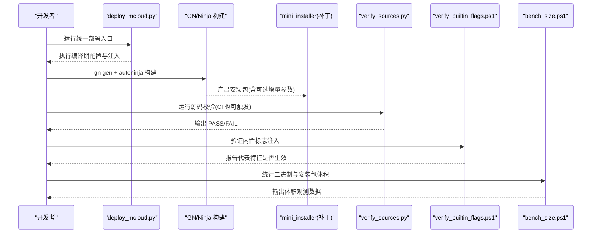
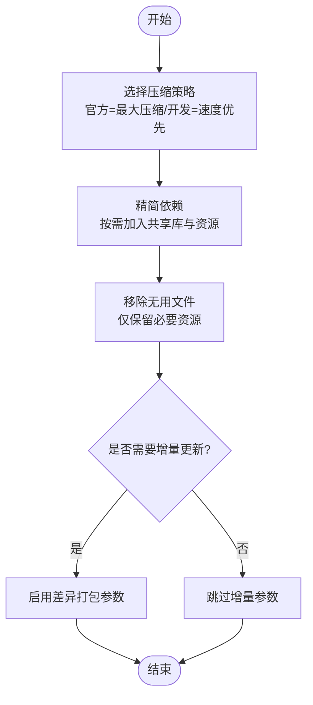
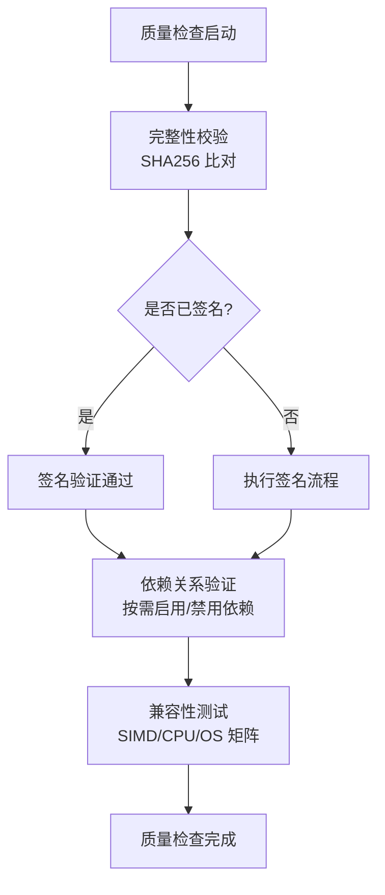
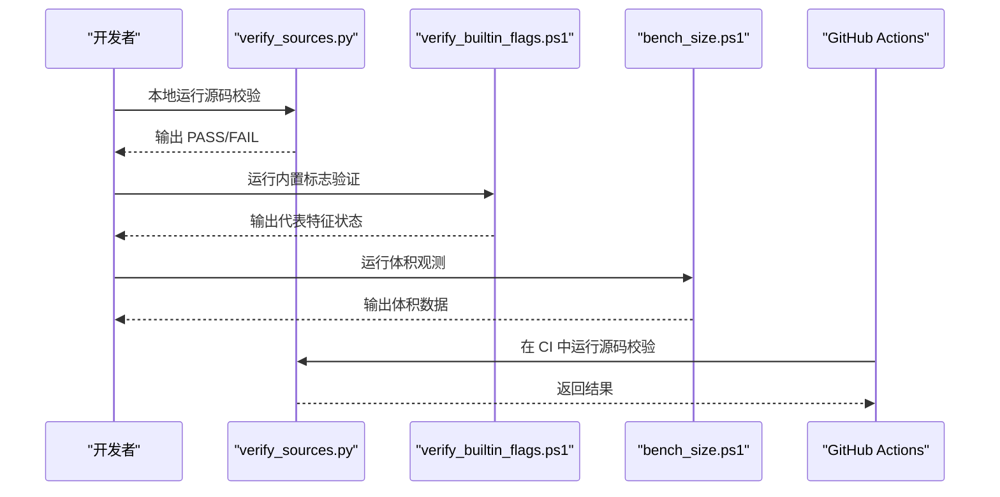
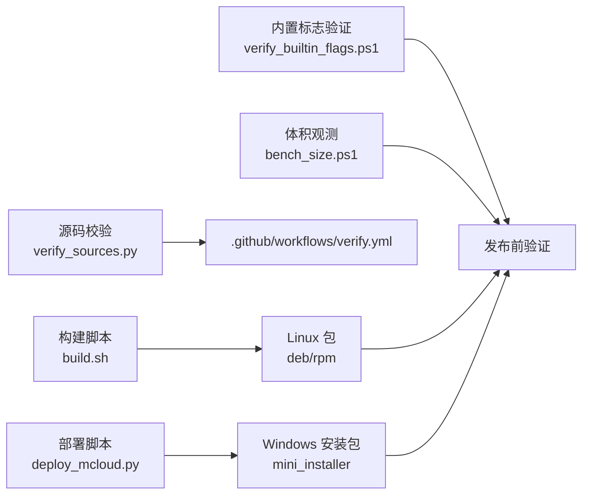

# 包优化与质量检查

<cite>
**本文引用的文件**
- [README.md](file://README.md)
- [ABOUT_RELEASES.md](file://docs/ABOUT_RELEASES.md)
- [infra/README.md](file://infra/README.md)
- [build.sh](file://build.sh)
- [win_scripts/deploy_mcloud.py](file://win_scripts/deploy_mcloud.py)
- [win_scripts/verify_sources.py](file://win_scripts/verify_sources.py)
- [.github/workflows/verify.yml](file://.github/workflows/verify.yml)
- [benchmark/tools/verify_builtin_flags.ps1](file://benchmark/tools/verify_builtin_flags.ps1)
- [benchmark/bench_size.ps1](file://benchmark/bench_size.ps1)
- [other/mini_installer.patch](file://other/mini_installer.patch)
- [src/chrome/installer/linux/BUILD.gn](file://src/chrome/installer/linux/BUILD.gn)
- [src/chrome/installer/linux/common/installer.py](file://src/chrome/installer/linux/common/installer.py)
- [src/content/test/BUILD.gn](file://src/content/test/BUILD.gn)
- [src/components/BUILD.gn](file://src/components/BUILD.gn)
- [src/sandbox/linux/BUILD.gn](file://src/sandbox/linux/BUILD.gn)
</cite>

## 目录
1. [简介](#简介)
2. [项目结构](#项目结构)
3. [核心组件](#核心组件)
4. [架构总览](#架构总览)
5. [详细组件分析](#详细组件分析)
6. [依赖关系分析](#依赖关系分析)
7. [性能考量](#性能考量)
8. [故障排除指南](#故障排除指南)
9. [结论](#结论)
10. [附录](#附录)

## 简介
本文件面向 MCloud Browser 的打包与发布流程，聚焦“包大小优化”和“质量检查”两大主题。内容覆盖：
- 包大小优化策略：资源压缩、依赖精简、无用文件清理、增量更新机制
- 质量检查流程：完整性校验、签名检查、依赖关系验证、兼容性测试
- 自动化测试脚本：单元测试、集成测试、性能基准测试使用方法
- 分发前预检清单：安全检查、许可证验证、功能测试
- 问题诊断与排障：常见打包问题的定位与解决

本项目当前仅发布 Windows x64 安装包（约 118MB），并配套 SHA256 校验文件；同时提供 Linux 构建脚本以生成 deb/rpm 包。

**章节来源**
- [README.md:18-39](file://README.md#L18-L39)

## 项目结构
围绕“打包与质量检查”，仓库中与打包相关的关键位置包括：
- 根级构建脚本：Linux 一键构建与打包（deb/rpm）
- Windows 部署与注入：统一部署入口，负责编译期标志注入、AVX2 基线、Polly 接线等
- 安装器与打包产物：mini_installer 补丁扩展了多 SIMD 目标与可选增量更新参数
- 质量检查：源码校验、内置标志注入验证、体积观测
- 平台打包清单：Linux 打包文件集合与条件依赖

**图示来源**
- [build.sh:42-51](file://build.sh#L42-L51)
- [win_scripts/deploy_mcloud.py:1-51](file://win_scripts/deploy_mcloud.py#L1-L51)
- [other/mini_installer.patch:77-99](file://other/mini_installer.patch#L77-L99)
- [win_scripts/verify_sources.py:1-144](file://win_scripts/verify_sources.py#L1-L144)
- [.github/workflows/verify.yml:1-25](file://.github/workflows/verify.yml#L1-L25)
- [benchmark/tools/verify_builtin_flags.ps1:1-98](file://benchmark/tools/verify_builtin_flags.ps1#L1-L98)
- [benchmark/bench_size.ps1:1-44](file://benchmark/bench_size.ps1#L1-L44)
- [src/chrome/installer/linux/BUILD.gn:83-115](file://src/chrome/installer/linux/BUILD.gn#L83-L115)
- [src/chrome/installer/linux/common/installer.py:510-538](file://src/chrome/installer/linux/common/installer.py#L510-L538)

**章节来源**
- [infra/README.md:1-20](file://infra/README.md#L1-L20)
- [build.sh:42-51](file://build.sh#L42-L51)
- [win_scripts/deploy_mcloud.py:1-51](file://win_scripts/deploy_mcloud.py#L1-L51)
- [other/mini_installer.patch:77-99](file://other/mini_installer.patch#L77-L99)
- [src/chrome/installer/linux/BUILD.gn:83-115](file://src/chrome/installer/linux/BUILD.gn#L83-L115)

## 核心组件
- 统一部署入口（Windows）：按序执行多项编译期配置与注入，确保 AVX2/FMA3 基线、Polly 接线、默认值修正以及 mcloud_flags.txt 复制到 out/mcloud
- mini_installer 补丁：为安装包引入多 SIMD 目标产物、可选增量更新参数、静默安装与调试日志开关
- 源码校验工具：对 win_scripts 下的 Python 脚本进行语法检查、关键脚本存在性检查、pak_src C 源文件存在性与可选语法检查
- 内置标志注入验证：通过 headless 模式抓取 chrome://version 或探测子进程命令行，验证标志是否生效
- 体积观测工具：统计 chrome.exe、mini_installer 及 out/mcloud 总体积，作为观测指标记录
- Linux 打包清单与辅助：定义打包文件集合与条件依赖，生成 wrapper 脚本与链接

**章节来源**
- [win_scripts/deploy_mcloud.py:1-51](file://win_scripts/deploy_mcloud.py#L1-L51)
- [other/mini_installer.patch:77-99](file://other/mini_installer.patch#L77-L99)
- [win_scripts/verify_sources.py:1-144](file://win_scripts/verify_sources.py#L1-L144)
- [benchmark/tools/verify_builtin_flags.ps1:1-98](file://benchmark/tools/verify_builtin_flags.ps1#L1-L98)
- [benchmark/bench_size.ps1:1-44](file://benchmark/bench_size.ps1#L1-L44)
- [src/chrome/installer/linux/BUILD.gn:83-115](file://src/chrome/installer/linux/BUILD.gn#L83-L115)
- [src/chrome/installer/linux/common/installer.py:510-538](file://src/chrome/installer/linux/common/installer.py#L510-L538)

## 架构总览
下图展示了从源码到可分发包的完整流水线，涵盖部署、构建、打包、验证与观测环节。

**图示来源**
- [win_scripts/deploy_mcloud.py:1-51](file://win_scripts/deploy_mcloud.py#L1-L51)
- [other/mini_installer.patch:77-99](file://other/mini_installer.patch#L77-L99)
- [win_scripts/verify_sources.py:1-144](file://win_scripts/verify_sources.py#L1-L144)
- [benchmark/tools/verify_builtin_flags.ps1:1-98](file://benchmark/tools/verify_builtin_flags.ps1#L1-L98)
- [benchmark/bench_size.ps1:1-44](file://benchmark/bench_size.ps1#L1-L44)

## 详细组件分析

### 包大小优化策略
- 资源压缩算法选择
  - 官方构建使用最大压缩以减少安装包体积；非官方/开发构建倾向速度优先。可通过构建参数控制压缩强度。
  - 参考路径：[fast_archive_compression 说明:2765-2774](file://infra/win_gn_args.list#L2765-L2774)
- 依赖库精简
  - Linux 打包清单中按需加入共享库与资源，避免硬依赖（如 QT shim）。
  - 参考路径：[Linux 打包文件集合:83-115](file://src/chrome/installer/linux/BUILD.gn#L83-L115)
- 无用文件清理
  - 在打包阶段仅包含必要文件（locales、预加载数据、必要的 shim 库等），减少冗余。
  - 参考路径：[打包文件列表:92-101](file://src/chrome/installer/linux/BUILD.gn#L92-L101)
- 增量更新机制
  - mini_installer 补丁支持可选增量更新参数（如 last_chrome_installer、setup_exe_format=DIFF、diff_algorithm=ZUCCHINI），用于生成差异安装包以降低下载体积。
  - 参考路径：[增量更新参数:91-99](file://other/mini_installer.patch#L91-L99)

**图示来源**
- [infra/win_gn_args.list:2765-2774](file://infra/win_gn_args.list#L2765-L2774)
- [src/chrome/installer/linux/BUILD.gn:83-115](file://src/chrome/installer/linux/BUILD.gn#L83-L115)
- [other/mini_installer.patch:91-99](file://other/mini_installer.patch#L91-L99)

**章节来源**
- [infra/win_gn_args.list:2765-2774](file://infra/win_gn_args.list#L2765-L2774)
- [src/chrome/installer/linux/BUILD.gn:83-115](file://src/chrome/installer/linux/BUILD.gn#L83-L115)
- [other/mini_installer.patch:91-99](file://other/mini_installer.patch#L91-L99)

### 质量检查流程
- 完整性验证
  - 发布产物附带 SHA256 校验文件，用户可在安装前验证完整性。
  - 参考路径：[SHA256 校验说明:36-43](file://README.md#L36-L43)
- 签名检查
  - 仓库未提供自动签名脚本；建议在 CI 或发布流程中集成代码签名步骤（例如使用 signtool），并在安装器中嵌入版本信息与签名信息。
  - 参考路径：[mini_installer 版本模板:877-906](file://other/mini_installer.patch#L877-L906)
- 依赖关系验证
  - Linux 打包时根据条件启用 SwiftShader、QT shim 等依赖，避免不必要的运行时依赖。
  - 参考路径：[条件依赖处理:102-115](file://src/chrome/installer/linux/BUILD.gn#L102-L115)
- 兼容性测试
  - 通过不同 SIMD 目标产物适配不同 CPU 能力；结合 README 中的 CPU 要求与文档说明进行兼容性验证。
  - 参考路径：[CPU/SIMD 说明:9-49](file://docs/ABOUT_RELEASES.md#L9-L49)、[系统要求:45-58](file://README.md#L45-L58)

**图示来源**
- [README.md:36-43](file://README.md#L36-L43)
- [other/mini_installer.patch:877-906](file://other/mini_installer.patch#L877-L906)
- [src/chrome/installer/linux/BUILD.gn:102-115](file://src/chrome/installer/linux/BUILD.gn#L102-L115)
- [docs/ABOUT_RELEASES.md:9-49](file://docs/ABOUT_RELEASES.md#L9-L49)
- [README.md:45-58](file://README.md#L45-L58)

**章节来源**
- [README.md:36-43](file://README.md#L36-L43)
- [other/mini_installer.patch:877-906](file://other/mini_installer.patch#L877-L906)
- [src/chrome/installer/linux/BUILD.gn:102-115](file://src/chrome/installer/linux/BUILD.gn#L102-L115)
- [docs/ABOUT_RELEASES.md:9-49](file://docs/ABOUT_RELEASES.md#L9-L49)
- [README.md:45-58](file://README.md#L45-L58)

### 自动化测试脚本使用方法
- 源码校验（Python/C）
  - 运行 verify_sources.py：检查 win_scripts 下 Python 脚本语法、关键脚本存在性、pak_src C 源文件存在性与可选语法检查。
  - 参考路径：[源码校验脚本:1-144](file://win_scripts/verify_sources.py#L1-L144)
- 内置标志注入验证
  - 运行 verify_builtin_flags.ps1：以 headless 模式抓取 chrome://version 或探测子进程命令行，验证代表特征是否生效。
  - 参考路径：[内置标志验证脚本:1-98](file://benchmark/tools/verify_builtin_flags.ps1#L1-L98)
- 体积观测（基准 K7）
  - 运行 bench_size.ps1：统计 chrome.exe、mini_installer 与 out/mcloud 总体积，作为观测指标记录。
  - 参考路径：[体积观测脚本:1-44](file://benchmark/bench_size.ps1#L1-L44)
- CI 集成
  - GitHub Actions 工作流在 push/PR 时运行源码校验。
  - 参考路径：[CI 工作流:1-25](file://.github/workflows/verify.yml#L1-L25)

**图示来源**
- [win_scripts/verify_sources.py:1-144](file://win_scripts/verify_sources.py#L1-L144)
- [benchmark/tools/verify_builtin_flags.ps1:1-98](file://benchmark/tools/verify_builtin_flags.ps1#L1-L98)
- [benchmark/bench_size.ps1:1-44](file://benchmark/bench_size.ps1#L1-L44)
- [.github/workflows/verify.yml:1-25](file://.github/workflows/verify.yml#L1-L25)

**章节来源**
- [win_scripts/verify_sources.py:1-144](file://win_scripts/verify_sources.py#L1-L144)
- [benchmark/tools/verify_builtin_flags.ps1:1-98](file://benchmark/tools/verify_builtin_flags.ps1#L1-L98)
- [benchmark/bench_size.ps1:1-44](file://benchmark/bench_size.ps1#L1-L44)
- [.github/workflows/verify.yml:1-25](file://.github/workflows/verify.yml#L1-L25)

### 单元测试、集成测试与性能基准测试
- 单元测试
  - content/test 与 components 等模块包含大量单元测试目标，可按需构建与运行。
  - 参考路径：[content/test BUILD.gn:154-175](file://src/content/test/BUILD.gn#L154-L175)、[components BUILD.gn:1301-1336](file://src/components/BUILD.gn#L1301-L1336)
- 集成测试
  - sandbox/linux 包含 seccomp-bpf 与 syscall broker 的集成测试目标。
  - 参考路径：[sandbox/linux BUILD.gn:133-175](file://src/sandbox/linux/BUILD.gn#L133-L175)
- 性能基准测试
  - benchmark 目录提供启动、内存、导航、体积等基准工具，配合 run_baseline.ps1 可采集基线并生成报告。
  - 参考路径：[基准工具概览:357-375](file://README.md#L357-L375)

**章节来源**
- [src/content/test/BUILD.gn:154-175](file://src/content/test/BUILD.gn#L154-L175)
- [src/components/BUILD.gn:1301-1336](file://src/components/BUILD.gn#L1301-L1336)
- [src/sandbox/linux/BUILD.gn:133-175](file://src/sandbox/linux/BUILD.gn#L133-L175)
- [README.md:357-375](file://README.md#L357-L375)

### 包分发前的预检清单
- 安全检查
  - 确认安装包未包含敏感信息（密钥、证书私钥等）；必要时在 CI 中加入安全扫描。
- 许可证验证
  - 确保第三方依赖许可证合规；可在发布前导出依赖清单并进行许可证审计。
- 功能测试
  - 运行内置标志注入验证、基准测试与兼容性测试，确保功能正常且性能达标。
- 完整性与签名
  - 生成并上传 SHA256 校验文件；建议集成代码签名流程并验证签名有效性。

[本节为通用指导，不直接分析具体文件]

## 依赖关系分析
- 构建与打包依赖
  - Linux：通过 build.sh 调用 ninja 构建 mcloud_all，并生成 stable_deb/stable_rpm 包。
  - Windows：通过 deploy_mcloud.py 执行编译期配置与注入，再由 mini_installer 生成安装包。
- 质量检查依赖
  - verify_sources.py 依赖 Python 环境与可选 gcc/clang；verify_builtin_flags.ps1 依赖 Windows PowerShell。
- 平台特性依赖
  - Linux 打包清单依据 enable_swiftshader、use_qt5/use_qt6 等条件添加依赖文件。

**图示来源**
- [build.sh:42-51](file://build.sh#L42-L51)
- [win_scripts/deploy_mcloud.py:1-51](file://win_scripts/deploy_mcloud.py#L1-L51)
- [win_scripts/verify_sources.py:1-144](file://win_scripts/verify_sources.py#L1-L144)
- [.github/workflows/verify.yml:1-25](file://.github/workflows/verify.yml#L1-L25)
- [benchmark/tools/verify_builtin_flags.ps1:1-98](file://benchmark/tools/verify_builtin_flags.ps1#L1-L98)
- [benchmark/bench_size.ps1:1-44](file://benchmark/bench_size.ps1#L1-L44)

**章节来源**
- [build.sh:42-51](file://build.sh#L42-L51)
- [win_scripts/deploy_mcloud.py:1-51](file://win_scripts/deploy_mcloud.py#L1-L51)
- [win_scripts/verify_sources.py:1-144](file://win_scripts/verify_sources.py#L1-L144)
- [.github/workflows/verify.yml:1-25](file://.github/workflows/verify.yml#L1-L25)
- [benchmark/tools/verify_builtin_flags.ps1:1-98](file://benchmark/tools/verify_builtin_flags.ps1#L1-L98)
- [benchmark/bench_size.ps1:1-44](file://benchmark/bench_size.ps1#L1-L44)

## 性能考量
- 编译器优化栈：AVX2+FMA3 原生编译、-O3、ThinLTO+PGO 已生效；Polly/BOLT 待工具链就绪后启用。
- 启动速度与页面加载：通过多项运行时标志优化首屏渲染、预连接、代码缓存消费等。
- 内存与多线程：标签页冻结、内存回收、锁优化等降低驻留内存与提升响应性。
- 媒体与 GPU：硬件解码、零拷贝、着色器预编译等提升视频播放与渲染效率。
- 体积观测：将安装包与构建目录体积作为观测指标，持续记录趋势变化。

**章节来源**
- [README.md:61-177](file://README.md#L61-L177)
- [benchmark/bench_size.ps1:1-44](file://benchmark/bench_size.ps1#L1-L44)

## 故障排除指南
- 源码校验失败
  - 现象：verify_sources.py 报告 Python 语法错误或关键脚本缺失。
  - 排查：检查 win_scripts 目录下脚本是否存在且语法正确；确认 pak_src 源文件齐全；在非 Windows 平台 C 语法检查会被跳过。
  - 参考路径：[源码校验逻辑:53-103](file://win_scripts/verify_sources.py#L53-L103)
- 内置标志未生效
  - 现象：verify_builtin_flags.ps1 报告代表特征未出现。
  - 排查：确认 mcloud_flags.txt 位于 exe 同目录；确认 chrome_main_delegate.cc 已编入当前构建；必要时改用子进程命令行探测。
  - 参考路径：[内置标志验证逻辑:21-31](file://benchmark/tools/verify_builtin_flags.ps1#L21-L31)、[兜底探测:66-89](file://benchmark/tools/verify_builtin_flags.ps1#L66-L89)
- 安装包体积异常增大
  - 现象：bench_size.ps1 输出体积显著增长。
  - 排查：检查是否启用了不必要的依赖（如 QT shim）、是否包含了多余资源；评估压缩策略与增量更新参数。
  - 参考路径：[体积观测:24-40](file://benchmark/bench_size.ps1#L24-L40)、[Linux 依赖条件:102-115](file://src/chrome/installer/linux/BUILD.gn#L102-L115)
- Linux 打包失败
  - 现象：build.sh 构建 deb/rpm 失败。
  - 排查：确认 CR_DIR 设置正确；检查依赖是否满足；查看构建日志定位错误。
  - 参考路径：[Linux 构建脚本:29-51](file://build.sh#L29-L51)

**章节来源**
- [win_scripts/verify_sources.py:53-103](file://win_scripts/verify_sources.py#L53-L103)
- [benchmark/tools/verify_builtin_flags.ps1:21-31](file://benchmark/tools/verify_builtin_flags.ps1#L21-L31)
- [benchmark/tools/verify_builtin_flags.ps1:66-89](file://benchmark/tools/verify_builtin_flags.ps1#L66-L89)
- [benchmark/bench_size.ps1:24-40](file://benchmark/bench_size.ps1#L24-L40)
- [src/chrome/installer/linux/BUILD.gn:102-115](file://src/chrome/installer/linux/BUILD.gn#L102-L115)
- [build.sh:29-51](file://build.sh#L29-L51)

## 结论
本仓库提供了完善的打包与质量检查基础设施：通过统一部署入口与 mini_installer 补丁实现灵活的编译期配置与增量更新；借助源码校验、内置标志验证与体积观测工具形成闭环的质量保障；Linux 与 Windows 双端构建脚本覆盖主流分发场景。建议在发布流程中补充签名与许可证审计，并持续跟踪体积与性能指标，确保交付质量稳定可控。

[本节为总结性内容，不直接分析具体文件]

## 附录
- 快速命令参考
  - Linux 构建与打包：参见 [build.sh:42-51](file://build.sh#L42-L51)
  - Windows 统一部署：参见 [deploy_mcloud.py:1-51](file://win_scripts/deploy_mcloud.py#L1-L51)
  - 源码校验：参见 [verify_sources.py:1-144](file://win_scripts/verify_sources.py#L1-L144)
  - 内置标志验证：参见 [verify_builtin_flags.ps1:1-98](file://benchmark/tools/verify_builtin_flags.ps1#L1-L98)
  - 体积观测：参见 [bench_size.ps1:1-44](file://benchmark/bench_size.ps1#L1-L44)

[本节为附录，不直接分析具体文件]