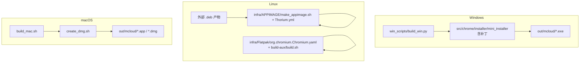
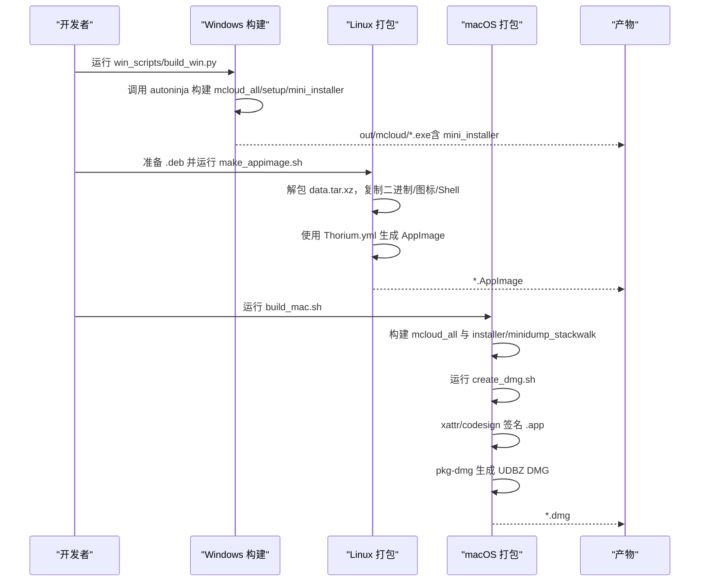
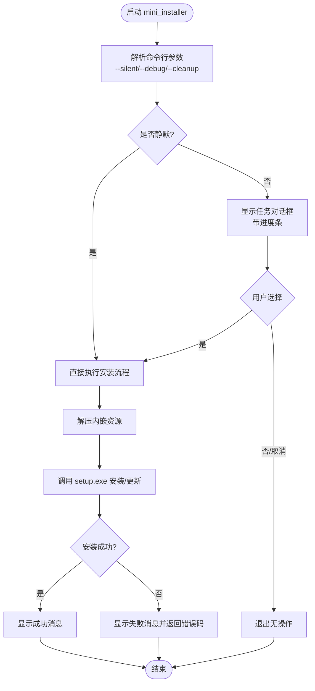
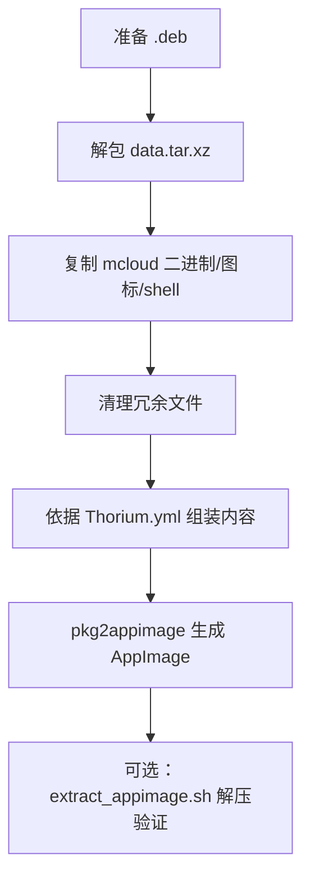
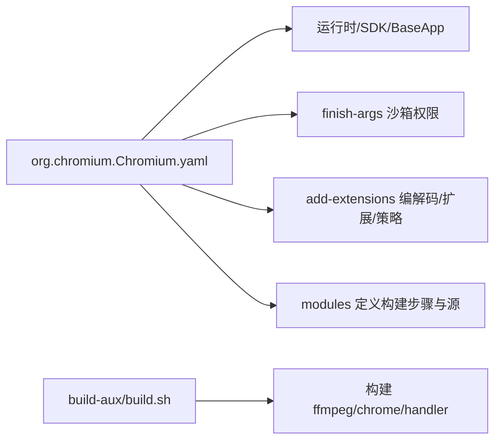
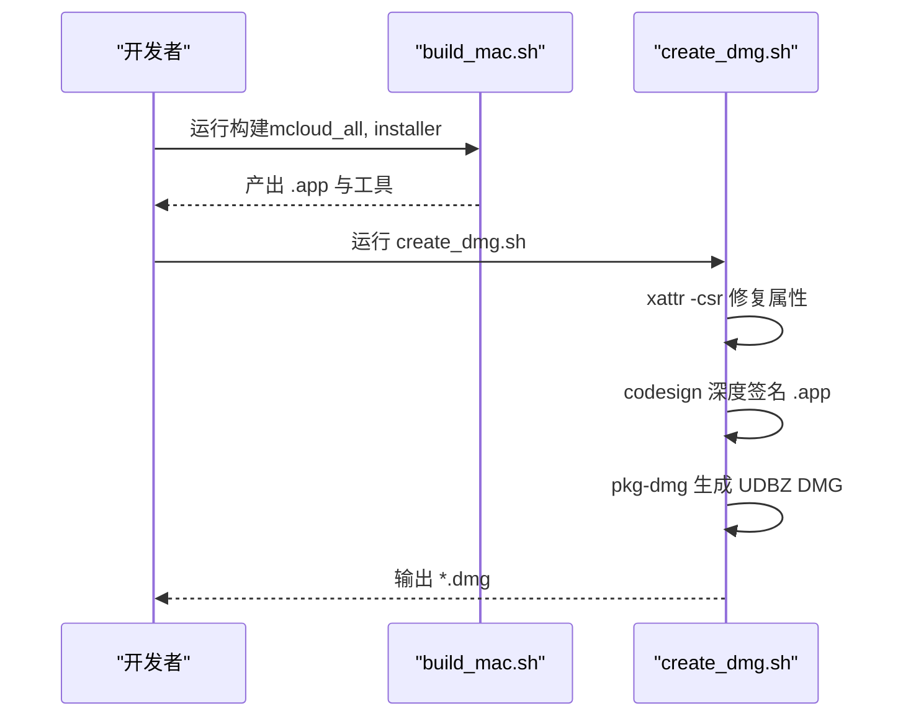
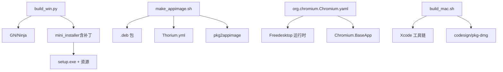

# 安装包制作

本文引用的文件

- [create_dmg.sh](https://github.com/Mcloud136/Mcloud-Browser/blob/main/create_dmg.sh)
- [build_mac.sh](https://github.com/Mcloud136/Mcloud-Browser/blob/main/build_mac.sh)
- [make_appimage.sh](https://github.com/Mcloud136/Mcloud-Browser/blob/main/infra/APPIMAGE/make_appimage.sh)
- [Thorium.yml](https://github.com/Mcloud136/Mcloud-Browser/blob/main/infra/APPIMAGE/Thorium.yml)
- [extract_appimage.sh](https://github.com/Mcloud136/Mcloud-Browser/blob/main/infra/APPIMAGE/extract_appimage.sh)
- [org.chromium.Chromium.yaml](https://github.com/Mcloud136/Mcloud-Browser/blob/main/infra/Flatpak/com.mcloud.browser/org.chromium.Chromium.yaml)
- [build.sh](https://github.com/Mcloud136/Mcloud-Browser/blob/main/infra/Flatpak/com.mcloud.browser/build-aux/build.sh)
- [mini_installer.patch](https://github.com/Mcloud136/Mcloud-Browser/blob/main/other/mini_installer.patch)
- [build_win.py](https://github.com/Mcloud136/Mcloud-Browser/blob/main/win_scripts/build_win.py)

## 目录
1. [简介](#简介)
2. [项目结构](#项目结构)
3. [核心组件](#核心组件)
4. [架构总览](#架构总览)
5. [详细组件分析](#详细组件分析)
6. [依赖关系分析](#依赖关系分析)
7. [性能与体积优化](#性能与体积优化)
8. [故障排查指南](#故障排查指南)
9. [结论](#结论)
10. [附录](#附录)

## 简介
本文件面向 MCloud Browser 的安装包制作，覆盖 Windows mini_installer、Linux AppImage/Flatpak、macOS DMG 的构建流程与定制要点。重点说明资源打包、签名验证、版本信息嵌入、安装程序界面与参数扩展、沙箱配置、分发格式转换、以及安装包大小优化与质量检查方法。

## 项目结构
MCloud Browser 在仓库中为各平台提供了独立的打包脚本与配置：
- Windows：通过 Python 脚本调用 GN/Ninja 构建 mini_installer，并生成可执行安装器；另有 mini_installer 源码补丁用于增强 UI、日志与命令行参数。
- Linux：提供基于 .deb 的 AppImage 构建脚本与 Flatpak 清单及构建辅助脚本。
- macOS：提供构建与创建 DMG 的 Shell 脚本，包含代码签名与 pkg-dmg 打包步骤。

图表来源
- [build_win.py:34-50](https://github.com/Mcloud136/Mcloud-Browser/blob/main/win_scripts/build_win.py#L34-L50)
- [make_appimage.sh:28-76](https://github.com/Mcloud136/Mcloud-Browser/blob/main/infra/APPIMAGE/make_appimage.sh#L28-L76)
- [org.chromium.Chromium.yaml:1-153](https://github.com/Mcloud136/Mcloud-Browser/blob/main/infra/Flatpak/com.mcloud.browser/org.chromium.Chromium.yaml#L1-L153)
- [build_mac.sh:63-83](https://github.com/Mcloud136/Mcloud-Browser/blob/main/build_mac.sh#L63-L83)
- [create_dmg.sh:27-45](https://github.com/Mcloud136/Mcloud-Browser/blob/main/create_dmg.sh#L27-L45)

章节来源
- [build_win.py:34-50](https://github.com/Mcloud136/Mcloud-Browser/blob/main/win_scripts/build_win.py#L34-L50)
- [make_appimage.sh:28-76](https://github.com/Mcloud136/Mcloud-Browser/blob/main/infra/APPIMAGE/make_appimage.sh#L28-L76)
- [org.chromium.Chromium.yaml:1-153](https://github.com/Mcloud136/Mcloud-Browser/blob/main/infra/Flatpak/com.mcloud.browser/org.chromium.Chromium.yaml#L1-L153)
- [build_mac.sh:63-83](https://github.com/Mcloud136/Mcloud-Browser/blob/main/build_mac.sh#L63-L83)
- [create_dmg.sh:27-45](https://github.com/Mcloud136/Mcloud-Browser/blob/main/create_dmg.sh#L27-L45)

## 核心组件
- Windows mini_installer：负责解压内嵌资源、调用 setup.exe 完成安装/更新，支持静默安装、调试日志、进度对话框等。
- Linux AppImage：将 .deb 解包后的二进制与图标、桌面条目、AppRun 封装为自包含 AppImage。
- Linux Flatpak：通过 YAML 声明运行时、权限、扩展模块与构建命令，使用 base Chromium 应用作为基础。
- macOS DMG：对 .app 进行属性修复与代码签名，再使用 pkg-dmg 生成 UDBZ 压缩的 DMG。

章节来源
- [mini_installer.patch:1-800](https://github.com/Mcloud136/Mcloud-Browser/blob/main/other/mini_installer.patch#L1-L800)
- [make_appimage.sh:28-76](https://github.com/Mcloud136/Mcloud-Browser/blob/main/infra/APPIMAGE/make_appimage.sh#L28-L76)
- [Thorium.yml:1-77](https://github.com/Mcloud136/Mcloud-Browser/blob/main/infra/APPIMAGE/Thorium.yml#L1-L77)
- [org.chromium.Chromium.yaml:1-153](https://github.com/Mcloud136/Mcloud-Browser/blob/main/infra/Flatpak/com.mcloud.browser/org.chromium.Chromium.yaml#L1-L153)
- [create_dmg.sh:27-45](https://github.com/Mcloud136/Mcloud-Browser/blob/main/create_dmg.sh#L27-L45)

## 架构总览
下图展示了从源码到最终安装包的关键路径与交互：

图表来源
- [build_win.py:34-50](https://github.com/Mcloud136/Mcloud-Browser/blob/main/win_scripts/build_win.py#L34-L50)
- [make_appimage.sh:28-76](https://github.com/Mcloud136/Mcloud-Browser/blob/main/infra/APPIMAGE/make_appimage.sh#L28-L76)
- [Thorium.yml:1-77](https://github.com/Mcloud136/Mcloud-Browser/blob/main/infra/APPIMAGE/Thorium.yml#L1-L77)
- [build_mac.sh:63-83](https://github.com/Mcloud136/Mcloud-Browser/blob/main/build_mac.sh#L63-L83)
- [create_dmg.sh:27-45](https://github.com/Mcloud136/Mcloud-Browser/blob/main/create_dmg.sh#L27-L45)

## 详细组件分析

### Windows mini_installer 生成与定制
- 构建入口：Python 脚本调用 GN/Ninja 构建 mcloud_all、setup、mini_installer，输出至 out/mcloud。
- 资源打包：mini_installer 将 chrome.dll、chrome_elf.dll、mcloud.exe、locales/en-US.pak、setup.exe 等打包进 CAB，并在运行时解压后执行 setup.exe。
- 版本信息嵌入：通过 process_version 模板从 //chrome/VERSION 生成头文件，供 mini_installer 读取版本号并显示于标题与消息中。
- 签名与校验：构建阶段会拷贝签名相关文件；实际签名通常在 CI 或发布流水线中进行。
- 安装程序定制：
  - 新增 --silent、--debug、--no-cleanup、--cleanup 等命令行参数。
  - 引入 TaskDialogIndirect 实现带进度条的确认对话框，支持“是/否/取消”，并在后台线程执行安装。
  - 修改注册表键基名以适配品牌（如客户端状态键）。
  - 根据 SIMD 能力生成多目标 mini_installer（SSE2/SSE3/SSE4/SSE4.2/AVX/AVX2/AVX512），提升兼容性。
- 扩展点：
  - 可在 configuration.cc/.h 中增加新的开关与行为分支。
  - 在 mini_installer.cc 中扩展 UI 文案、错误提示与日志输出。
  - 在 BUILD.gn 中调整打包输入（如加入自定义 flags 文件或额外资源）。

图表来源
- [mini_installer.patch:224-337](https://github.com/Mcloud136/Mcloud-Browser/blob/main/other/mini_installer.patch#L224-L337)
- [mini_installer.patch:301-637](https://github.com/Mcloud136/Mcloud-Browser/blob/main/other/mini_installer.patch#L301-L637)
- [mini_installer.patch:696-743](https://github.com/Mcloud136/Mcloud-Browser/blob/main/other/mini_installer.patch#L696-L743)

章节来源
- [build_win.py:34-50](https://github.com/Mcloud136/Mcloud-Browser/blob/main/win_scripts/build_win.py#L34-L50)
- [mini_installer.patch:1-800](https://github.com/Mcloud136/Mcloud-Browser/blob/main/other/mini_installer.patch#L1-L800)

### Linux AppImage 打包流程
- 前置条件：当前目录需存在 MCloud Browser 的 .deb 包。
- 解包与整理：
  - 使用 ar/tar 解出 data.tar.xz，复制 opt/chromium.org/mcloud/* 到临时目录。
  - 复制必要的工具（如 pak）、产品图标与 mcloud-shell。
  - 清理不需要的 cron 与浏览器主入口（保留 shell）。
- 生成 AppImage：
  - 使用 Thorium.yml 描述应用元数据、图标、桌面条目、AppRun 入口与版本写入逻辑。
  - 通过 pkg2appimage 生成自包含的 AppImage。
- 提取与二次处理：提供 extract_appimage.sh 用于解压已生成的 AppImage 以便审查或二次打包。

图表来源
- [make_appimage.sh:28-76](https://github.com/Mcloud136/Mcloud-Browser/blob/main/infra/APPIMAGE/make_appimage.sh#L28-L76)
- [Thorium.yml:1-77](https://github.com/Mcloud136/Mcloud-Browser/blob/main/infra/APPIMAGE/Thorium.yml#L1-L77)
- [extract_appimage.sh:28-48](https://github.com/Mcloud136/Mcloud-Browser/blob/main/infra/APPIMAGE/extract_appimage.sh#L28-L48)

章节来源
- [make_appimage.sh:28-76](https://github.com/Mcloud136/Mcloud-Browser/blob/main/infra/APPIMAGE/make_appimage.sh#L28-L76)
- [Thorium.yml:1-77](https://github.com/Mcloud136/Mcloud-Browser/blob/main/infra/APPIMAGE/Thorium.yml#L1-L77)
- [extract_appimage.sh:28-48](https://github.com/Mcloud136/Mcloud-Browser/blob/main/infra/APPIMAGE/extract_appimage.sh#L28-L48)

### Linux Flatpak 打包流程
- 清单与运行时：
  - org.chromium.Chromium.yaml 指定运行时、SDK、base 应用（Chromium.BaseApp）与命令。
  - finish-args 声明文件系统、设备、网络、IPC、CUPS、PulseAudio、X11/Wayland 等沙箱权限。
  - add-extensions 挂载非自由编解码器、原生消息主机、扩展与策略目录。
- 构建辅助：
  - build-aux/build.sh 链接 Node/JDK 到 Chromium 期望路径，构建 libffmpeg.so 与 chrome、crashpad_handler。
- 模块与源：
  - modules 定义 Python 工具链、readelf 符号链接、extensions 初始化、chromium 主模块及其补丁与静态文件。
- 建议：
  - 如需最小化权限，按需裁剪 finish-args。
  - 若替换 base 应用，请确保命令与路径一致。

图表来源
- [org.chromium.Chromium.yaml:1-153](https://github.com/Mcloud136/Mcloud-Browser/blob/main/infra/Flatpak/com.mcloud.browser/org.chromium.Chromium.yaml#L1-L153)
- [build.sh:1-16](https://github.com/Mcloud136/Mcloud-Browser/blob/main/infra/Flatpak/com.mcloud.browser/build-aux/build.sh#L1-L16)

章节来源
- [org.chromium.Chromium.yaml:1-153](https://github.com/Mcloud136/Mcloud-Browser/blob/main/infra/Flatpak/com.mcloud.browser/org.chromium.Chromium.yaml#L1-L153)
- [build.sh:1-16](https://github.com/Mcloud136/Mcloud-Browser/blob/main/infra/Flatpak/com.mcloud.browser/build-aux/build.sh#L1-L16)

### macOS DMG 包创建与代码签名
- 构建产物：build_mac.sh 构建 mcloud_all 与 installer/minidump_stackwalk，产出 .app 与相关工具。
- 签名与 DMG：
  - create_dmg.sh 设置 .app 的属性（xattr -csr），使用 codesign 深度签名。
  - 调用 chrome/installer/mac/pkg-dmg 生成 UDBZ 压缩的 DMG，并设置卷标与软链接。
- 注意事项：
  - 签名证书需提前配置好。
   - 若出现签名失败，检查钥匙串与 entitlements 配置。

图表来源
- [build_mac.sh:63-83](https://github.com/Mcloud136/Mcloud-Browser/blob/main/build_mac.sh#L63-L83)
- [create_dmg.sh:27-45](https://github.com/Mcloud136/Mcloud-Browser/blob/main/create_dmg.sh#L27-L45)

章节来源
- [build_mac.sh:63-83](https://github.com/Mcloud136/Mcloud-Browser/blob/main/build_mac.sh#L63-L83)
- [create_dmg.sh:27-45](https://github.com/Mcloud136/Mcloud-Browser/blob/main/create_dmg.sh#L27-L45)

### 自定义安装程序的修改方法与扩展点
- Windows mini_installer：
  - 新增命令行参数：在 configuration.cc/.h 中添加解析与字段，并在 WMainImpl 中按分支执行。
  - 扩展 UI：在 mini_installer.cc 中修改 TaskDialog 文案、图标与按钮行为。
  - 注入资源：在 BUILD.gn 的 mini_installer_archive action 中加入新资源（如 mcloud_flags.txt）。
  - 多架构产物：根据 use_sse*/use_avx* 生成不同目标的 mini_installer，保证兼容性与性能。
- Linux AppImage：
  - 修改 Thorium.yml 中的 desktop 条目、AppRun 入口、图标与版本写入逻辑。
  - 在 make_appimage.sh 中调整解包与复制的文件集合。
- Linux Flatpak：
  - 在 org.chromium.Chromium.yaml 中调整 finish-args 与 add-extensions，控制沙箱与扩展挂载。
  - 在 build-aux/build.sh 中调整构建命令与依赖链接。
- macOS：
  - 在 create_dmg.sh 中调整签名选项与 pkg-dmg 参数（卷标、软链接、压缩格式）。

章节来源
- [mini_installer.patch:1-800](https://github.com/Mcloud136/Mcloud-Browser/blob/main/other/mini_installer.patch#L1-L800)
- [Thorium.yml:1-77](https://github.com/Mcloud136/Mcloud-Browser/blob/main/infra/APPIMAGE/Thorium.yml#L1-L77)
- [make_appimage.sh:28-76](https://github.com/Mcloud136/Mcloud-Browser/blob/main/infra/APPIMAGE/make_appimage.sh#L28-L76)
- [org.chromium.Chromium.yaml:1-153](https://github.com/Mcloud136/Mcloud-Browser/blob/main/infra/Flatpak/com.mcloud.browser/org.chromium.Chromium.yaml#L1-L153)
- [create_dmg.sh:27-45](https://github.com/Mcloud136/Mcloud-Browser/blob/main/create_dmg.sh#L27-L45)

## 依赖关系分析
- Windows：
  - build_win.py 依赖 GN/Ninja 与 Visual Studio 工具链；mini_installer 依赖 setup.exe 与内嵌资源。
  - 补丁影响编译期标志（SIMD/FMA）与运行时行为（UI/日志/参数）。
- Linux：
  - AppImage 依赖 .deb 产物、pkg2appimage 与 yml 配置。
  - Flatpak 依赖 Freedesktop 运行时、Chromium BaseApp、Node/JDK 工具链与系统库。
- macOS：
  - 依赖 Xcode 工具链、codesign 与 pkg-dmg。

图表来源
- [build_win.py:34-50](https://github.com/Mcloud136/Mcloud-Browser/blob/main/win_scripts/build_win.py#L34-L50)
- [make_appimage.sh:28-76](https://github.com/Mcloud136/Mcloud-Browser/blob/main/infra/APPIMAGE/make_appimage.sh#L28-L76)
- [Thorium.yml:1-77](https://github.com/Mcloud136/Mcloud-Browser/blob/main/infra/APPIMAGE/Thorium.yml#L1-L77)
- [org.chromium.Chromium.yaml:1-153](https://github.com/Mcloud136/Mcloud-Browser/blob/main/infra/Flatpak/com.mcloud.browser/org.chromium.Chromium.yaml#L1-L153)
- [build_mac.sh:63-83](https://github.com/Mcloud136/Mcloud-Browser/blob/main/build_mac.sh#L63-L83)
- [create_dmg.sh:27-45](https://github.com/Mcloud136/Mcloud-Browser/blob/main/create_dmg.sh#L27-L45)

章节来源
- [build_win.py:34-50](https://github.com/Mcloud136/Mcloud-Browser/blob/main/win_scripts/build_win.py#L34-L50)
- [make_appimage.sh:28-76](https://github.com/Mcloud136/Mcloud-Browser/blob/main/infra/APPIMAGE/make_appimage.sh#L28-L76)
- [org.chromium.Chromium.yaml:1-153](https://github.com/Mcloud136/Mcloud-Browser/blob/main/infra/Flatpak/com.mcloud.browser/org.chromium.Chromium.yaml#L1-L153)
- [build_mac.sh:63-83](https://github.com/Mcloud136/Mcloud-Browser/blob/main/build_mac.sh#L63-L83)
- [create_dmg.sh:27-45](https://github.com/Mcloud136/Mcloud-Browser/blob/main/create_dmg.sh#L27-L45)

## 性能与体积优化
- Windows mini_installer：
  - 启用 SIMD/FMA 编译标志以提升运行性能（见补丁中的 cflags 条件）。
  - 按需启用 diff 安装器（在 mini_installer_archive 的参数中启用 last_chrome_installer/DIFF/ZUCCHINI）。
  - 精简内嵌资源，仅打包必要 DLL/Pak/Setup。
- Linux AppImage：
  - 移除冗余 libffmpeg.so（yml 中已删除重复副本）。
  - 使用 minimum 压缩级别减少体积。
  - 仅复制必要图标与二进制，避免多余文件。
- Linux Flatpak：
  - 使用 base Chromium 应用复用运行时，减少重复依赖。
  - 通过 finish-args 精确授权，避免不必要的系统访问开销。
  - 仅在必要时添加非自由编解码器扩展。
- macOS DMG：
  - 使用 UDBZ 压缩以减少体积。
  - 确保 .app 仅包含必需的二进制与资源。

章节来源
- [mini_installer.patch:17-47](https://github.com/Mcloud136/Mcloud-Browser/blob/main/other/mini_installer.patch#L17-L47)
- [mini_installer.patch:177-199](https://github.com/Mcloud136/Mcloud-Browser/blob/main/other/mini_installer.patch#L177-L199)
- [Thorium.yml:6-33](https://github.com/Mcloud136/Mcloud-Browser/blob/main/infra/APPIMAGE/Thorium.yml#L6-L33)
- [org.chromium.Chromium.yaml:1-153](https://github.com/Mcloud136/Mcloud-Browser/blob/main/infra/Flatpak/com.mcloud.browser/org.chromium.Chromium.yaml#L1-L153)
- [create_dmg.sh:37-40](https://github.com/Mcloud136/Mcloud-Browser/blob/main/create_dmg.sh#L37-L40)

## 故障排查指南
- Windows mini_installer：
  - 使用 --debug 启动以输出控制台日志，定位安装失败原因。
  - 检查注册表键基名是否正确（补丁已将 Chromium 键改为 Mcloud Browser）。
  - 若静默安装失败，检查 setup.exe 返回值与临时目录权限。
- Linux AppImage：
  - 确认 .deb 已正确放置且 data.tar.xz 可解包。
  - 若图标缺失，检查 Thorium.yml 中图标复制路径与桌面条目 Icon 字段。
  - 使用 extract_appimage.sh 解压后验证 usr/bin 与 usr/lib 内容。
- Linux Flatpak：
  - 若无法访问摄像头/麦克风/网络，检查 finish-args 是否包含相应权限。
  - 若缺少编解码器，确认 add-extensions 已正确挂载。
  - 构建失败时检查 Node/JDK 链接与 clang/llvm 预构建包。
- macOS DMG：
  - 签名失败时检查钥匙串与证书有效性，必要时重新导入。
  - 若 DMG 无法挂载，检查 pkg-dmg 参数与磁盘映像格式。

章节来源
- [mini_installer.patch:224-337](https://github.com/Mcloud136/Mcloud-Browser/blob/main/other/mini_installer.patch#L224-L337)
- [mini_installer.patch:696-743](https://github.com/Mcloud136/Mcloud-Browser/blob/main/other/mini_installer.patch#L696-L743)
- [make_appimage.sh:28-76](https://github.com/Mcloud136/Mcloud-Browser/blob/main/infra/APPIMAGE/make_appimage.sh#L28-L76)
- [Thorium.yml:1-77](https://github.com/Mcloud136/Mcloud-Browser/blob/main/infra/APPIMAGE/Thorium.yml#L1-L77)
- [org.chromium.Chromium.yaml:1-153](https://github.com/Mcloud136/Mcloud-Browser/blob/main/infra/Flatpak/com.mcloud.browser/org.chromium.Chromium.yaml#L1-L153)
- [create_dmg.sh:27-45](https://github.com/Mcloud136/Mcloud-Browser/blob/main/create_dmg.sh#L27-L45)

## 结论
MCloud Browser 在各平台提供了清晰的打包脚本与配置文件，便于定制化与自动化。Windows mini_installer 通过补丁增强了用户体验与可维护性；Linux 通过 AppImage 与 Flatpak 兼顾便携与沙箱安全；macOS 通过标准签名与 DMG 工具链保障分发质量。建议在 CI 中集成签名、体积检查与冒烟测试，确保每次发布的稳定性与一致性。

## 附录
- 常用命令参考：
  - Windows：python win_scripts/build_win.py [jobs]
  - Linux AppImage：将 .deb 放入 infra/APPIMAGE 目录后运行 make_appimage.sh
  - Linux Flatpak：使用 flatpak-builder 基于 org.chromium.Chromium.yaml 构建
  - macOS：先运行 build_mac.sh，再运行 create_dmg.sh

章节来源
- [build_win.py:34-50](https://github.com/Mcloud136/Mcloud-Browser/blob/main/win_scripts/build_win.py#L34-L50)
- [make_appimage.sh:28-76](https://github.com/Mcloud136/Mcloud-Browser/blob/main/infra/APPIMAGE/make_appimage.sh#L28-L76)
- [org.chromium.Chromium.yaml:1-153](https://github.com/Mcloud136/Mcloud-Browser/blob/main/infra/Flatpak/com.mcloud.browser/org.chromium.Chromium.yaml#L1-L153)
- [build_mac.sh:63-83](https://github.com/Mcloud136/Mcloud-Browser/blob/main/build_mac.sh#L63-L83)
- [create_dmg.sh:27-45](https://github.com/Mcloud136/Mcloud-Browser/blob/main/create_dmg.sh#L27-L45)