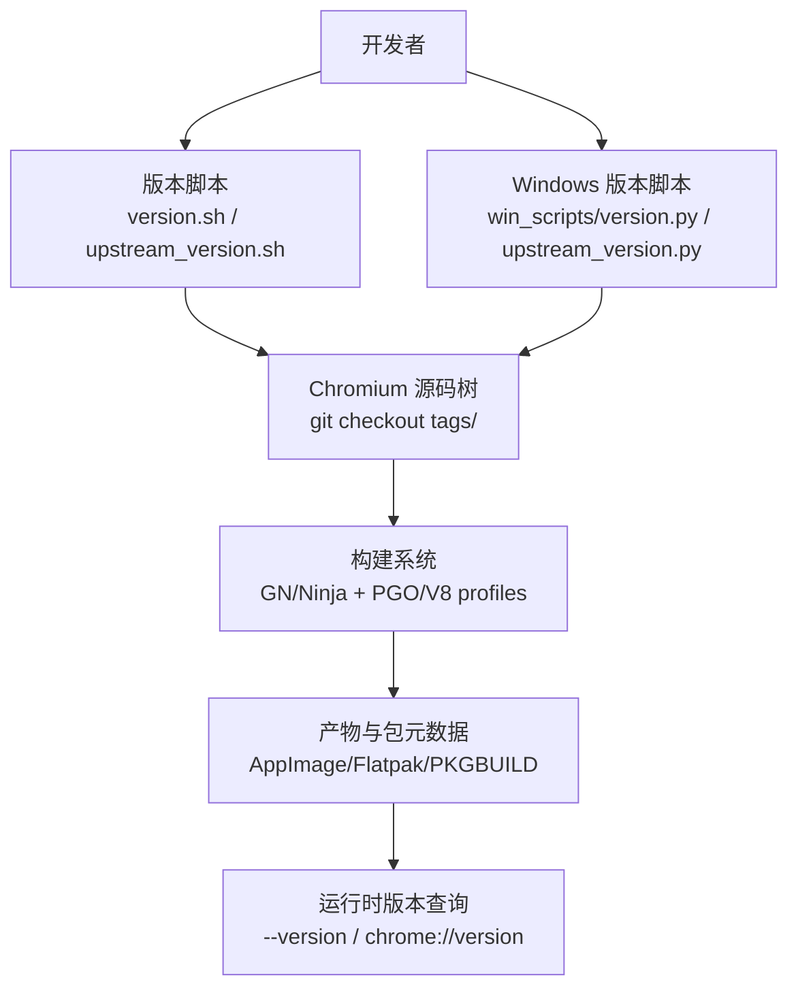
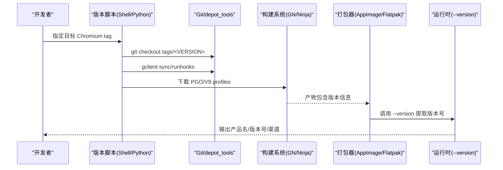
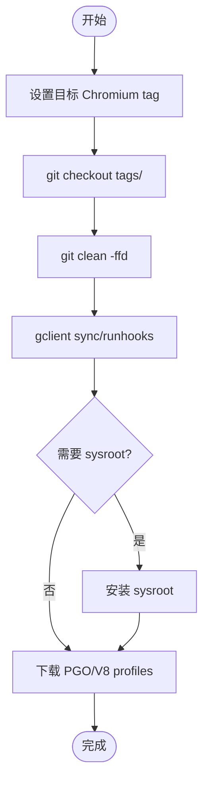
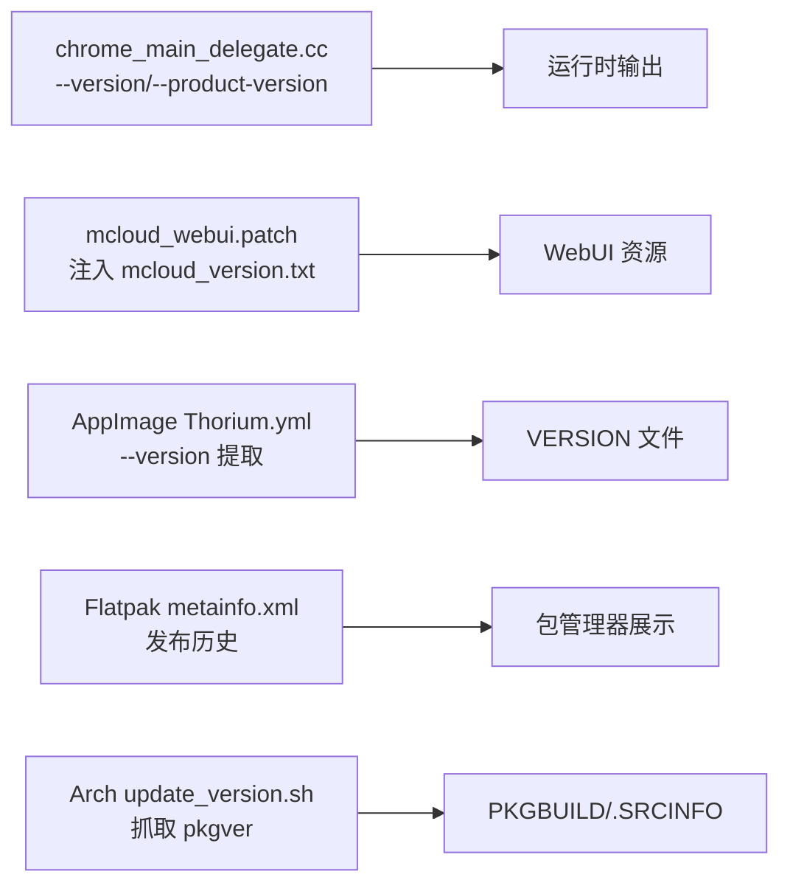
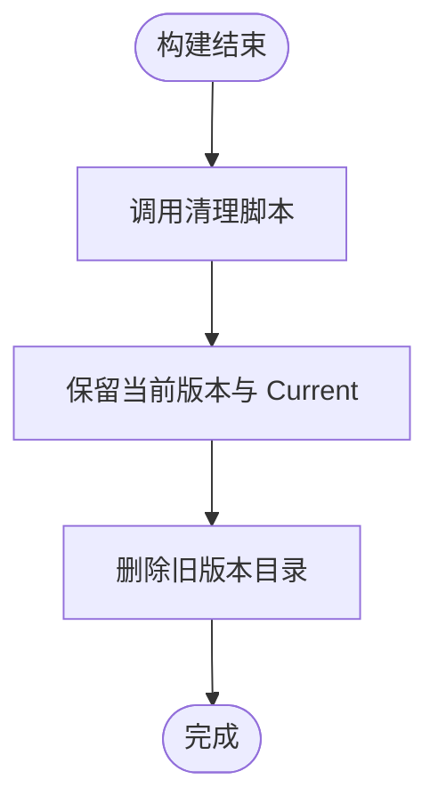
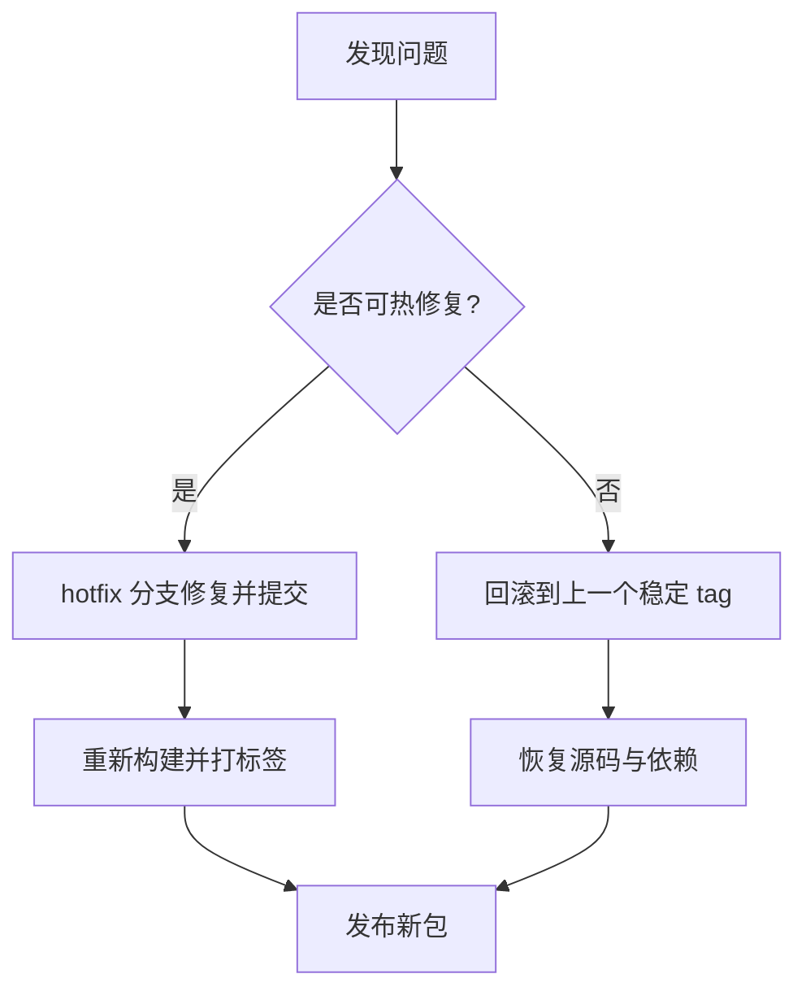
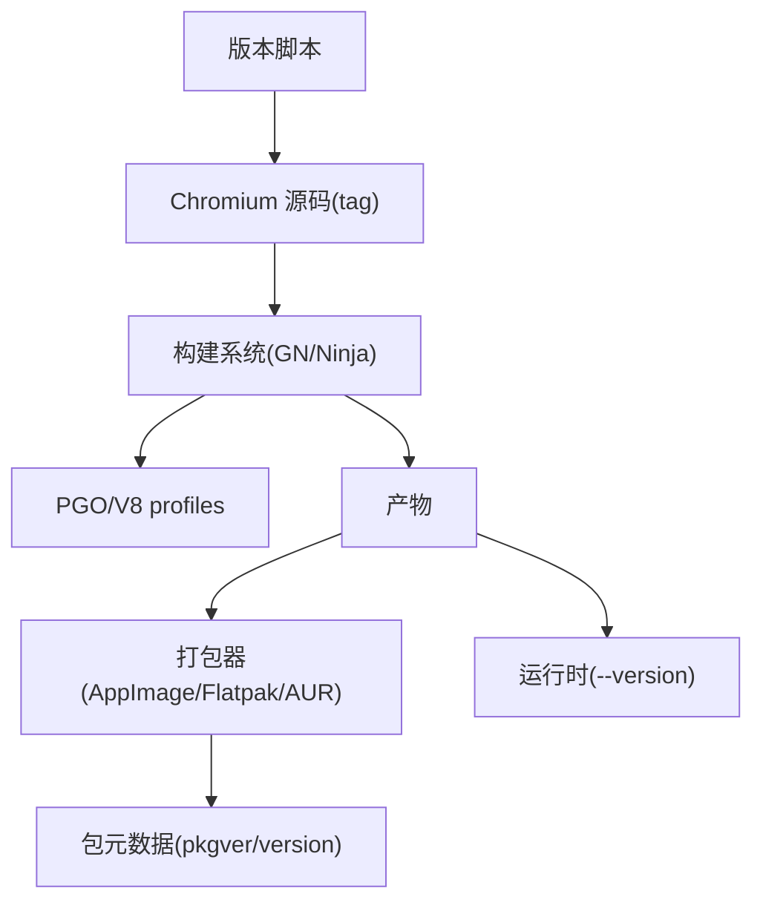

# 版本管理

本文引用的文件

- [version.sh](https://github.com/Mcloud136/Mcloud-Browser/blob/main/version.sh)
- [upstream_version.sh](https://github.com/Mcloud136/Mcloud-Browser/blob/main/upstream_version.sh)
- [win_scripts/version.py](https://github.com/Mcloud136/Mcloud-Browser/blob/main/win_scripts/version.py)
- [win_scripts/upstream_version.py](https://github.com/Mcloud136/Mcloud-Browser/blob/main/win_scripts/upstream_version.py)
- [infra/Arch_Linux/update_version.sh](https://github.com/Mcloud136/Mcloud-Browser/blob/main/infra/Arch_Linux/update_version.sh)
- [other/mcloud_webui.patch](https://github.com/Mcloud136/Mcloud-Browser/blob/main/other/mcloud_webui.patch)
- [src/chrome/BUILD.gn](https://github.com/Mcloud136/Mcloud-Browser/blob/main/src/chrome/BUILD.gn)
- [src/chrome/app/chrome_main_delegate.cc](https://github.com/Mcloud136/Mcloud-Browser/blob/main/src/chrome/app/chrome_main_delegate.cc)
- [infra/APPIMAGE/Thorium.yml](https://github.com/Mcloud136/Mcloud-Browser/blob/main/infra/APPIMAGE/Thorium.yml)
- [infra/Flatpak/com.mcloud.browser/org.chromium.Chromium.metainfo.xml](https://github.com/Mcloud136/Mcloud-Browser/blob/main/infra/Flatpak/com.mcloud.browser/org.chromium.Chromium.metainfo.xml)
- [docs/ABOUT_RELEASES.md](https://github.com/Mcloud136/Mcloud-Browser/blob/main/docs/ABOUT_RELEASES.md)
- [AGENTS.md](https://github.com/Mcloud136/Mcloud-Browser/blob/main/AGENTS.md)
- [README.md](https://github.com/Mcloud136/Mcloud-Browser/blob/main/README.md)

## 目录
1. [简介](#简介)
2. [项目结构](#项目结构)
3. [核心组件](#核心组件)
4. [架构总览](#架构总览)
5. [详细组件分析](#详细组件分析)
6. [依赖关系分析](#依赖关系分析)
7. [性能与构建特性](#性能与构建特性)
8. [故障排查指南](#故障排查指南)
9. [结论](#结论)
10. [附录](#附录)

## 简介
本文件面向 MCloud Browser 的版本管理，围绕版本号规范、上游 Chromium 同步机制、发布分支策略、版本信息自动生成与嵌入、以及回滚与降级支持进行系统化说明。MCloud Browser 基于 Chromium 的特定主版本（例如 M151）进行定制与优化，通过脚本与构建配置将上游版本、产品版本与打包元数据统一起来，确保可追溯、可复现、可回滚。

## 项目结构
与版本管理直接相关的代码与脚本分布在以下位置：
- 根级 Shell 脚本：用于在 Linux/macOS/WSL 环境下切换并同步到指定 Chromium tag，并下载 PGO 等构建资源
- Windows 侧 Python 脚本：对应上述功能的 Windows 实现
- 发行版打包配置：Linux AppImage、Flatpak、Arch PKGBUILD 更新脚本等，负责从产物或仓库状态提取版本并写入包元数据
- 源码内版本信息注入：WebUI 文本资源补丁、macOS 旧版本清理动作、命令行 --version/--product-version 处理
- 文档与导航：说明当前内核版本、升级流程与注意事项

**图示来源**
- [version.sh:39-85](https://github.com/Mcloud136/Mcloud-Browser/blob/main/version.sh#L39-L85)
- [upstream_version.sh:39-73](https://github.com/Mcloud136/Mcloud-Browser/blob/main/upstream_version.sh#L39-L73)
- [win_scripts/version.py:56-98](https://github.com/Mcloud136/Mcloud-Browser/blob/main/win_scripts/version.py#L56-L98)
- [win_scripts/upstream_version.py:43-69](https://github.com/Mcloud136/Mcloud-Browser/blob/main/win_scripts/upstream_version.py#L43-L69)
- [infra/APPIMAGE/Thorium.yml:31](https://github.com/Mcloud136/Mcloud-Browser/blob/main/infra/APPIMAGE/Thorium.yml#L31)
- [src/chrome/app/chrome_main_delegate.cc:422-441](https://github.com/Mcloud136/Mcloud-Browser/blob/main/src/chrome/app/chrome_main_delegate.cc#L422-L441)

**章节来源**
- [version.sh:39-113](https://github.com/Mcloud136/Mcloud-Browser/blob/main/version.sh#L39-L113)
- [upstream_version.sh:39-99](https://github.com/Mcloud136/Mcloud-Browser/blob/main/upstream_version.sh#L39-L99)
- [win_scripts/version.py:56-101](https://github.com/Mcloud136/Mcloud-Browser/blob/main/win_scripts/version.py#L56-L101)
- [win_scripts/upstream_version.py:43-72](https://github.com/Mcloud136/Mcloud-Browser/blob/main/win_scripts/upstream_version.py#L43-L72)
- [infra/APPIMAGE/Thorium.yml:31](https://github.com/Mcloud136/Mcloud-Browser/blob/main/infra/APPIMAGE/Thorium.yml#L31)
- [src/chrome/app/chrome_main_delegate.cc:422-441](https://github.com/Mcloud136/Mcloud-Browser/blob/main/src/chrome/app/chrome_main_delegate.cc#L422-L441)

## 核心组件
- 上游版本定位与同步
  - 通过固定变量声明目标 Chromium tag，执行 git checkout 与 gclient sync，确保源码树与目标版本一致
  - 同时下载 PGO 与 V8 builtins profile，保证构建优化与目标内核匹配
- 平台化版本脚本
  - Linux/macOS/WSL：使用 version.sh 与 upstream_version.sh
  - Windows：使用 win_scripts/version.py 与 win_scripts/upstream_version.py
- 发行版元数据更新
  - Arch Linux：update_version.sh 自动抓取远端包仓库最新版本并更新 PKGBUILD 与 .SRCINFO
  - Flatpak：metainfo.xml 维护历史发布列表
  - AppImage：从运行产物中读取 --version 输出，生成 VERSION 文件
- 运行时版本信息
  - 命令行 --version/--product-version 由浏览器入口处理并输出产品名、版本号与渠道
  - WebUI 资源通过补丁引入 mcloud_version.txt，便于在“关于”页面展示

**章节来源**
- [version.sh:39-113](https://github.com/Mcloud136/Mcloud-Browser/blob/main/version.sh#L39-L113)
- [upstream_version.sh:39-99](https://github.com/Mcloud136/Mcloud-Browser/blob/main/upstream_version.sh#L39-L99)
- [win_scripts/version.py:56-101](https://github.com/Mcloud136/Mcloud-Browser/blob/main/win_scripts/version.py#L56-L101)
- [win_scripts/upstream_version.py:43-72](https://github.com/Mcloud136/Mcloud-Browser/blob/main/win_scripts/upstream_version.py#L43-L72)
- [infra/Arch_Linux/update_version.sh:4-36](https://github.com/Mcloud136/Mcloud-Browser/blob/main/infra/Arch_Linux/update_version.sh#L4-L36)
- [infra/Flatpak/com.mcloud.browser/org.chromium.Chromium.metainfo.xml:32-99](https://github.com/Mcloud136/Mcloud-Browser/blob/main/infra/Flatpak/com.mcloud.browser/org.chromium.Chromium.metainfo.xml#L32-L99)
- [infra/APPIMAGE/Thorium.yml:31](https://github.com/Mcloud136/Mcloud-Browser/blob/main/infra/APPIMAGE/Thorium.yml#L31)
- [src/chrome/app/chrome_main_delegate.cc:422-441](https://github.com/Mcloud136/Mcloud-Browser/blob/main/src/chrome/app/chrome_main_delegate.cc#L422-L441)
- [other/mcloud_webui.patch:217-238](https://github.com/Mcloud136/Mcloud-Browser/blob/main/other/mcloud_webui.patch#L217-L238)

## 架构总览
下图展示了从“选择上游版本”到“构建产物版本信息”的端到端流程，包括源码同步、PGO 资源获取、构建产物版本提取与运行时查询。

**图示来源**
- [version.sh:49-85](https://github.com/Mcloud136/Mcloud-Browser/blob/main/version.sh#L49-L85)
- [upstream_version.sh:49-73](https://github.com/Mcloud136/Mcloud-Browser/blob/main/upstream_version.sh#L49-L73)
- [win_scripts/version.py:64-98](https://github.com/Mcloud136/Mcloud-Browser/blob/main/win_scripts/version.py#L64-L98)
- [win_scripts/upstream_version.py:50-69](https://github.com/Mcloud136/Mcloud-Browser/blob/main/win_scripts/upstream_version.py#L50-L69)
- [infra/APPIMAGE/Thorium.yml:31](https://github.com/Mcloud136/Mcloud-Browser/blob/main/infra/APPIMAGE/Thorium.yml#L31)
- [src/chrome/app/chrome_main_delegate.cc:422-441](https://github.com/Mcloud136/Mcloud-Browser/blob/main/src/chrome/app/chrome_main_delegate.cc#L422-L441)

## 详细组件分析

### 上游 Chromium 版本同步机制
- 版本源定义
  - Shell 脚本中以常量形式声明目标 tag（如 THOR_VER/CR_VER），Windows 侧 Python 脚本同理
- 同步步骤
  - 进入 Chromium 源码目录，执行 git checkout 到指定 tag
  - 清理工作区后执行 gclient sync 拉取依赖与子模块
  - 安装 sysroot（Linux/ARM64 场景）
  - 下载 PGO 与 V8 builtins profile，确保构建优化与内核版本匹配
- 兼容性检查
  - 通过固定 tag 锁定上游版本，避免 ToT 漂移
  - 构建前需重新 gn gen，确保 GN 参数与目标内核一致
  - 可通过基准测试与内置标志验证（见 README/AGENTS 中的指引）

**图示来源**
- [version.sh:49-85](https://github.com/Mcloud136/Mcloud-Browser/blob/main/version.sh#L49-L85)
- [upstream_version.sh:49-73](https://github.com/Mcloud136/Mcloud-Browser/blob/main/upstream_version.sh#L49-L73)
- [win_scripts/version.py:64-98](https://github.com/Mcloud136/Mcloud-Browser/blob/main/win_scripts/version.py#L64-L98)
- [win_scripts/upstream_version.py:50-69](https://github.com/Mcloud136/Mcloud-Browser/blob/main/win_scripts/upstream_version.py#L50-L69)

**章节来源**
- [version.sh:39-113](https://github.com/Mcloud136/Mcloud-Browser/blob/main/version.sh#L39-L113)
- [upstream_version.sh:39-99](https://github.com/Mcloud136/Mcloud-Browser/blob/main/upstream_version.sh#L39-L99)
- [win_scripts/version.py:56-101](https://github.com/Mcloud136/Mcloud-Browser/blob/main/win_scripts/version.py#L56-L101)
- [win_scripts/upstream_version.py:43-72](https://github.com/Mcloud136/Mcloud-Browser/blob/main/win_scripts/upstream_version.py#L43-L72)
- [AGENTS.md:145-157](https://github.com/Mcloud136/Mcloud-Browser/blob/main/AGENTS.md#L145-L157)
- [README.md:225-245](https://github.com/Mcloud136/Mcloud-Browser/blob/main/README.md#L225-L245)

### 版本信息与自动生成/嵌入
- 命令行版本查询
  - 浏览器入口处理 --version/--product-version，输出产品名称、版本号与渠道
- WebUI 版本文本
  - 通过补丁将 mcloud_version.txt 纳入 WebUI 资源，供“关于”页面显示
- 打包阶段版本提取
  - AppImage 构建脚本通过运行产物 --version 输出解析版本号，写入 VERSION 文件
  - Flatpak metainfo.xml 维护历史发布列表，便于包管理器展示
  - Arch Linux update_version.sh 从远端包索引抓取最新 pkgver 并更新 PKGBUILD/.SRCINFO

**图示来源**
- [src/chrome/app/chrome_main_delegate.cc:422-441](https://github.com/Mcloud136/Mcloud-Browser/blob/main/src/chrome/app/chrome_main_delegate.cc#L422-L441)
- [other/mcloud_webui.patch:217-238](https://github.com/Mcloud136/Mcloud-Browser/blob/main/other/mcloud_webui.patch#L217-L238)
- [infra/APPIMAGE/Thorium.yml:31](https://github.com/Mcloud136/Mcloud-Browser/blob/main/infra/APPIMAGE/Thorium.yml#L31)
- [infra/Flatpak/com.mcloud.browser/org.chromium.Chromium.metainfo.xml:32-99](https://github.com/Mcloud136/Mcloud-Browser/blob/main/infra/Flatpak/com.mcloud.browser/org.chromium.Chromium.metainfo.xml#L32-L99)
- [infra/Arch_Linux/update_version.sh:4-36](https://github.com/Mcloud136/Mcloud-Browser/blob/main/infra/Arch_Linux/update_version.sh#L4-L36)

**章节来源**
- [src/chrome/app/chrome_main_delegate.cc:422-441](https://github.com/Mcloud136/Mcloud-Browser/blob/main/src/chrome/app/chrome_main_delegate.cc#L422-L441)
- [other/mcloud_webui.patch:217-238](https://github.com/Mcloud136/Mcloud-Browser/blob/main/other/mcloud_webui.patch#L217-L238)
- [infra/APPIMAGE/Thorium.yml:31](https://github.com/Mcloud136/Mcloud-Browser/blob/main/infra/APPIMAGE/Thorium.yml#L31)
- [infra/Flatpak/com.mcloud.browser/org.chromium.Chromium.metainfo.xml:32-99](https://github.com/Mcloud136/Mcloud-Browser/blob/main/infra/Flatpak/com.mcloud.browser/org.chromium.Chromium.metainfo.xml#L32-L99)
- [infra/Arch_Linux/update_version.sh:4-36](https://github.com/Mcloud136/Mcloud-Browser/blob/main/infra/Arch_Linux/update_version.sh#L4-L36)

### macOS 旧版本清理与多版本共存
- 构建时清理旧版本框架
  - 通过 action 调用清理脚本，保留当前版本与 Current 链接，删除多余版本目录，避免磁盘膨胀与路径混乱
- 该机制有助于在多版本并行构建/测试时保持产物整洁

**图示来源**
- [src/chrome/BUILD.gn:687-706](https://github.com/Mcloud136/Mcloud-Browser/blob/main/src/chrome/BUILD.gn#L687-L706)

**章节来源**
- [src/chrome/BUILD.gn:687-706](https://github.com/Mcloud136/Mcloud-Browser/blob/main/src/chrome/BUILD.gn#L687-L706)

### 发布分支与热修复策略（建议）
- 主版本基线
  - 以 Chromium 主版本（如 M151）为基线，锁定 tag 并创建发布分支
- 热修复分支
  - 针对已发布主版本创建 hotfix 分支，仅合并必要的安全/稳定性修复
  - 每次热修复提交后打标签 v<MAJOR>.<MINOR>.<PATCH>+build，便于追踪
- 长期支持（LTS）
  - 对关键主版本建立 LTS 分支，定期合并上游安全补丁与少量稳定功能
  - 明确支持周期与停止维护时间，并在文档中公布

[本节为通用实践建议，不直接分析具体文件]

### 版本回滚与降级支持
- 源码级回滚
  - 通过 git checkout 回到指定 tag，再执行 gclient sync 与 runhooks 恢复依赖
  - 使用 version.sh/upstream_version.sh 或 Windows 对应脚本快速切回
- 构建产物回滚
  - 保留历史构建产物与签名，必要时回退到上一稳定版本
- 运行时降级
  - 用户侧可通过包管理器回退到上一个可用版本（如 Arch PKGBUILD 历史、Flatpak 历史版本）
  - macOS 构建会清理旧版本框架，但可通过保留历史产物实现回退

**图示来源**
- [version.sh:49-85](https://github.com/Mcloud136/Mcloud-Browser/blob/main/version.sh#L49-L85)
- [upstream_version.sh:49-73](https://github.com/Mcloud136/Mcloud-Browser/blob/main/upstream_version.sh#L49-L73)
- [win_scripts/version.py:64-98](https://github.com/Mcloud136/Mcloud-Browser/blob/main/win_scripts/version.py#L64-L98)
- [win_scripts/upstream_version.py:50-69](https://github.com/Mcloud136/Mcloud-Browser/blob/main/win_scripts/upstream_version.py#L50-L69)

**章节来源**
- [version.sh:39-113](https://github.com/Mcloud136/Mcloud-Browser/blob/main/version.sh#L39-L113)
- [upstream_version.sh:39-99](https://github.com/Mcloud136/Mcloud-Browser/blob/main/upstream_version.sh#L39-L99)
- [win_scripts/version.py:56-101](https://github.com/Mcloud136/Mcloud-Browser/blob/main/win_scripts/version.py#L56-L101)
- [win_scripts/upstream_version.py:43-72](https://github.com/Mcloud136/Mcloud-Browser/blob/main/win_scripts/upstream_version.py#L43-L72)

## 依赖关系分析
- 版本脚本与上游源码
  - Shell/Python 脚本依赖 Git 与 depot_tools，通过 tag 锁定上游版本
- 构建系统与优化资源
  - GN/Ninja 构建依赖 PGO 与 V8 builtins profile，必须与内核版本严格匹配
- 打包与元数据
  - AppImage/Flatpak/AUR 工具链从产物或远端索引提取版本，写入包元数据
- 运行时查询
  - 浏览器入口提供 --version 能力，供打包脚本与用户诊断使用

**图示来源**
- [version.sh:49-113](https://github.com/Mcloud136/Mcloud-Browser/blob/main/version.sh#L49-L113)
- [upstream_version.sh:49-99](https://github.com/Mcloud136/Mcloud-Browser/blob/main/upstream_version.sh#L49-L99)
- [win_scripts/version.py:64-101](https://github.com/Mcloud136/Mcloud-Browser/blob/main/win_scripts/version.py#L64-L101)
- [win_scripts/upstream_version.py:50-72](https://github.com/Mcloud136/Mcloud-Browser/blob/main/win_scripts/upstream_version.py#L50-L72)
- [infra/APPIMAGE/Thorium.yml:31](https://github.com/Mcloud136/Mcloud-Browser/blob/main/infra/APPIMAGE/Thorium.yml#L31)
- [infra/Arch_Linux/update_version.sh:4-36](https://github.com/Mcloud136/Mcloud-Browser/blob/main/infra/Arch_Linux/update_version.sh#L4-L36)
- [src/chrome/app/chrome_main_delegate.cc:422-441](https://github.com/Mcloud136/Mcloud-Browser/blob/main/src/chrome/app/chrome_main_delegate.cc#L422-L441)

**章节来源**
- [version.sh:39-113](https://github.com/Mcloud136/Mcloud-Browser/blob/main/version.sh#L39-L113)
- [upstream_version.sh:39-99](https://github.com/Mcloud136/Mcloud-Browser/blob/main/upstream_version.sh#L39-L99)
- [win_scripts/version.py:56-101](https://github.com/Mcloud136/Mcloud-Browser/blob/main/win_scripts/version.py#L56-L101)
- [win_scripts/upstream_version.py:43-72](https://github.com/Mcloud136/Mcloud-Browser/blob/main/win_scripts/upstream_version.py#L43-L72)
- [infra/APPIMAGE/Thorium.yml:31](https://github.com/Mcloud136/Mcloud-Browser/blob/main/infra/APPIMAGE/Thorium.yml#L31)
- [infra/Arch_Linux/update_version.sh:4-36](https://github.com/Mcloud136/Mcloud-Browser/blob/main/infra/Arch_Linux/update_version.sh#L4-L36)
- [src/chrome/app/chrome_main_delegate.cc:422-441](https://github.com/Mcloud136/Mcloud-Browser/blob/main/src/chrome/app/chrome_main_delegate.cc#L422-L441)

## 性能与构建特性
- 构建优化
  - 启用 PGO 与 V8 builtins profile，提升启动与渲染性能
  - 使用 ThinLTO、AVX2/FMA3 基线编译，提高指令集利用率
- SIMD 基线与兼容性
  - 不同 CPU 指令集支持差异影响可运行版本选择；建议根据硬件能力选择合适构建
- 构建一致性
  - 固定 tag 与 PGO 版本匹配，避免性能回归与兼容性问题

**章节来源**
- [version.sh:88-106](https://github.com/Mcloud136/Mcloud-Browser/blob/main/version.sh#L88-L106)
- [upstream_version.sh:76-94](https://github.com/Mcloud136/Mcloud-Browser/blob/main/upstream_version.sh#L76-L94)
- [docs/ABOUT_RELEASES.md:9-59](https://github.com/Mcloud136/Mcloud-Browser/blob/main/docs/ABOUT_RELEASES.md#L9-L59)
- [AGENTS.md:164-184](https://github.com/Mcloud136/Mcloud-Browser/blob/main/AGENTS.md#L164-L184)

## 故障排查指南
- 无法检出 tag
  - 确认 CR_DIR/THOR_DIR 环境变量正确指向 Chromium 源码与仓库根
  - 检查网络与 Git 可达性，必要时重试 gclient sync
- PGO/V8 profiles 不匹配
  - 确保下载的 PGO/V8 profiles 与目标 Chromium 主版本一致（如 M151=7922 系列）
- 构建失败
  - 修改 args.gn 后需重新 gn gen 并检查输出
  - 参考 AGENTS 中的已知坑（V8 flags 命名格式、Polly/BOLT 接线顺序）
- 版本信息不正确
  - 检查 WebUI 资源是否被正确注入
  - 使用 --version 验证产物版本是否与预期 tag 一致

**章节来源**
- [version.sh:39-113](https://github.com/Mcloud136/Mcloud-Browser/blob/main/version.sh#L39-L113)
- [upstream_version.sh:39-99](https://github.com/Mcloud136/Mcloud-Browser/blob/main/upstream_version.sh#L39-L99)
- [win_scripts/version.py:56-101](https://github.com/Mcloud136/Mcloud-Browser/blob/main/win_scripts/version.py#L56-L101)
- [win_scripts/upstream_version.py:43-72](https://github.com/Mcloud136/Mcloud-Browser/blob/main/win_scripts/upstream_version.py#L43-L72)
- [AGENTS.md:195-204](https://github.com/Mcloud136/Mcloud-Browser/blob/main/AGENTS.md#L195-L204)
- [other/mcloud_webui.patch:217-238](https://github.com/Mcloud136/Mcloud-Browser/blob/main/other/mcloud_webui.patch#L217-L238)

## 结论
MCloud Browser 的版本管理以“固定上游 tag + 平台化脚本 + 构建产物版本提取”为核心，确保源码、构建与产物三者一致。通过 PGO/V8 profiles 与 SIMD 基线优化，兼顾性能与兼容性；借助打包工具的版本提取与历史维护，支持热修复与回滚。建议在发布流程中引入明确的分支策略与标签规范，进一步提升可追溯性与稳定性。

## 附录
- 当前内核版本参考
  - M151（151.0.7922.x）作为示例主版本，实际 tag 以脚本与文档为准
- 常用命令
  - 切换上游版本：version.sh / upstream_version.sh（或 Windows 对应脚本）
  - 构建与部署：按 AGENTS 指引执行 deploy_mcloud.py、gn gen、autoninja
  - 版本查询：--version 或 chrome://version

**章节来源**
- [AGENTS.md:145-157](https://github.com/Mcloud136/Mcloud-Browser/blob/main/AGENTS.md#L145-L157)
- [README.md:225-245](https://github.com/Mcloud136/Mcloud-Browser/blob/main/README.md#L225-L245)
- [src/chrome/app/chrome_main_delegate.cc:422-441](https://github.com/Mcloud136/Mcloud-Browser/blob/main/src/chrome/app/chrome_main_delegate.cc#L422-L441)