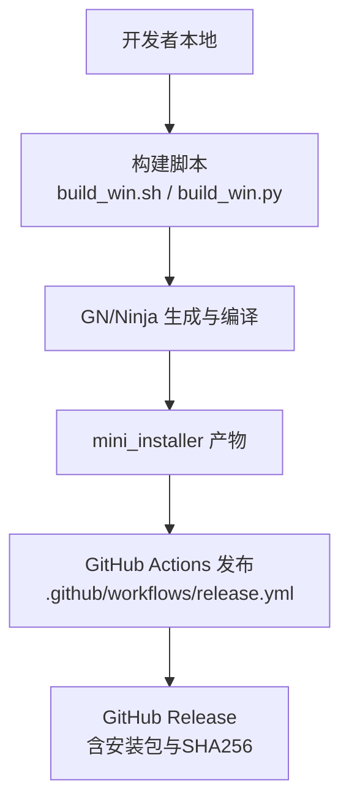
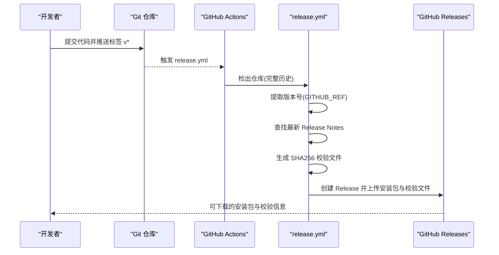
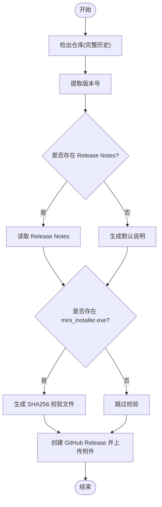
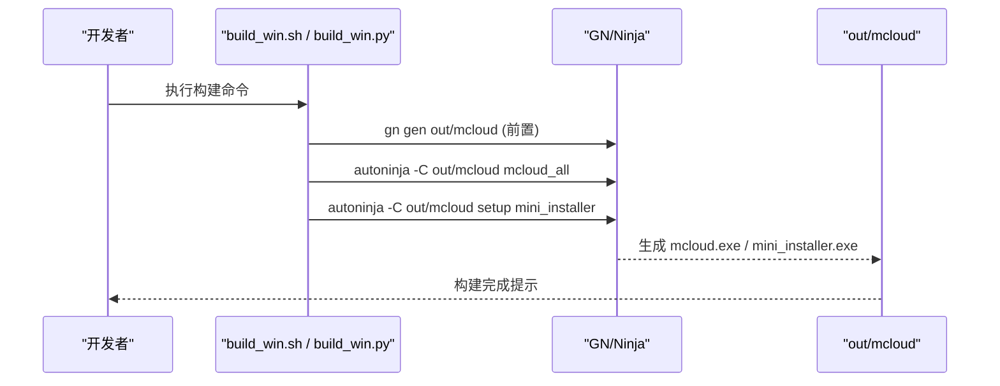
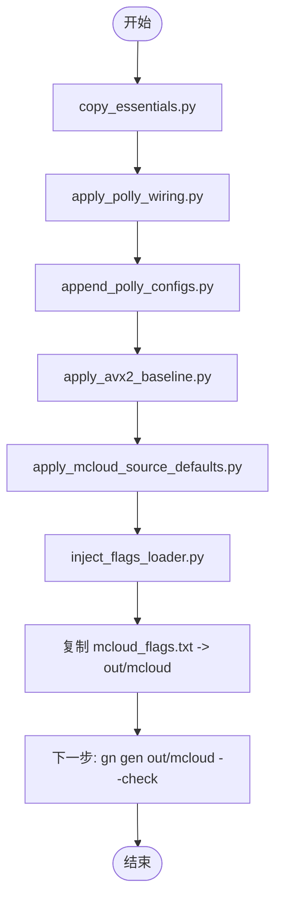
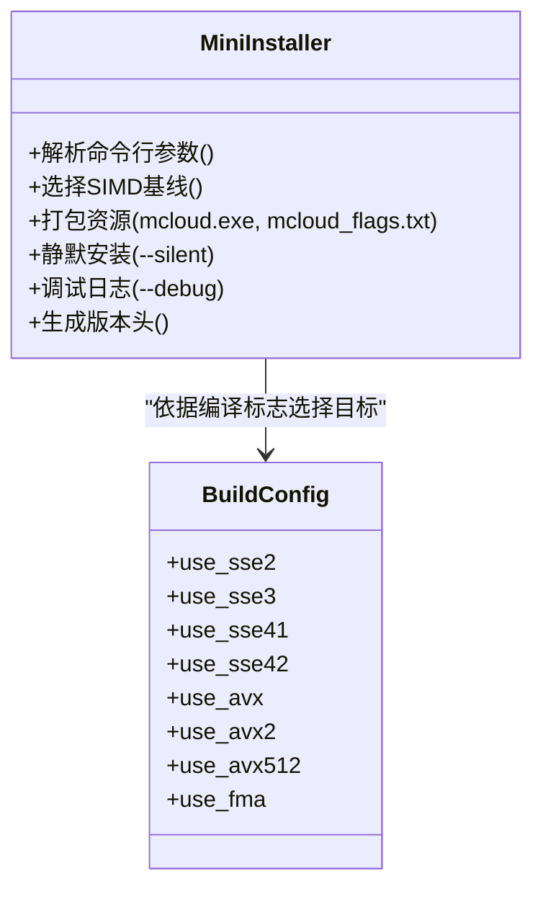
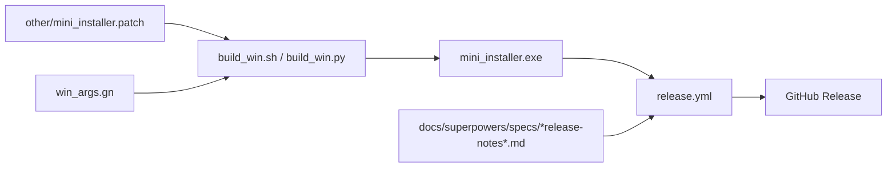

# 部署与发布

本文引用的文件

- [release.yml](https://github.com/Mcloud136/Mcloud-Browser/blob/main/.github/workflows/release.yml)
- [verify.yml](https://github.com/Mcloud136/Mcloud-Browser/blob/main/.github/workflows/verify.yml)
- [build_win.sh](https://github.com/Mcloud136/Mcloud-Browser/blob/main/build_win.sh)
- [win_scripts/build_win.py](https://github.com/Mcloud136/Mcloud-Browser/blob/main/win_scripts/build_win.py)
- [win_scripts/deploy_mcloud.py](https://github.com/Mcloud136/Mcloud-Browser/blob/main/win_scripts/deploy_mcloud.py)
- [win_scripts/version.py](https://github.com/Mcloud136/Mcloud-Browser/blob/main/win_scripts/version.py)
- [win_scripts/upstream_version.py](https://github.com/Mcloud136/Mcloud-Browser/blob/main/win_scripts/upstream_version.py)
- [other/mini_installer.patch](https://github.com/Mcloud136/Mcloud-Browser/blob/main/other/mini_installer.patch)
- [win_args.gn](https://github.com/Mcloud136/Mcloud-Browser/blob/main/win_args.gn)
- [docs/BUILDING_WIN.md](https://github.com/Mcloud136/Mcloud-Browser/blob/main/docs/BUILDING_WIN.md)
- [docs/ABOUT_RELEASES.md](https://github.com/Mcloud136/Mcloud-Browser/blob/main/docs/ABOUT_RELEASES.md)
- [README.md](https://github.com/Mcloud136/Mcloud-Browser/blob/main/README.md)

## 目录
1. [简介](#简介)
2. [项目结构](#项目结构)
3. [核心组件](#核心组件)
4. [架构总览](#架构总览)
5. [详细组件分析](#详细组件分析)
6. [依赖关系分析](#依赖关系分析)
7. [性能考量](#性能考量)
8. [故障排除指南](#故障排除指南)
9. [结论](#结论)
10. [附录](#附录)

## 简介
本文件面向 MCloud Browser 的部署与发布，重点说明 GitHub Actions CI/CD 流水线、Windows 平台安装包制作（mini_installer）、版本管理、完整性校验、发布自动化以及本地构建与回滚策略。当前工作流采用“本地编译 + 云端发布”的简化模式：仓库仅负责在推送 v* 标签时读取 Release Notes 并上传已生成的安装包到 GitHub Release，不参与耗时编译。

## 项目结构
- CI/CD 配置位于 .github/workflows，包含 release.yml（发布）与 verify.yml（源码验证）。
- Windows 构建脚本集中在根目录 build_win.sh 与 win_scripts 下，用于调用 Ninja/GN 生成与打包 mini_installer。
- mini_installer 的定制逻辑通过 other/mini_installer.patch 对 Chromium 安装器进行增强（SIMD 基线选择、静默安装、日志输出、资源打包等）。
- 构建参数由 win_args.gn 集中管理，控制 SIMD、优化、Widevine、PGO 等关键选项。
- 文档 docs/BUILDING_WIN.md 提供 Windows 环境准备与完整构建步骤；docs/ABOUT_RELEASES.md 解释不同 SIMD 版本的适用场景。

**图表来源**
- [release.yml:1-79](https://github.com/Mcloud136/Mcloud-Browser/blob/main/.github/workflows/release.yml#L1-L79)
- [build_win.sh:1-59](https://github.com/Mcloud136/Mcloud-Browser/blob/main/build_win.sh#L1-L59)
- [win_scripts/build_win.py:1-51](https://github.com/Mcloud136/Mcloud-Browser/blob/main/win_scripts/build_win.py#L1-L51)

**章节来源**
- [release.yml:1-79](https://github.com/Mcloud136/Mcloud-Browser/blob/main/.github/workflows/release.yml#L1-L79)
- [verify.yml:1-26](https://github.com/Mcloud136/Mcloud-Browser/blob/main/.github/workflows/verify.yml#L1-L26)
- [build_win.sh:1-59](https://github.com/Mcloud136/Mcloud-Browser/blob/main/build_win.sh#L1-L59)
- [win_scripts/build_win.py:1-51](https://github.com/Mcloud136/Mcloud-Browser/blob/main/win_scripts/build_win.py#L1-L51)

## 核心组件
- 发布流水线（release.yml）：监听 v* 标签，提取版本号，查找最新 Release Notes，计算 SHA256，创建 GitHub Release 并上传安装包与校验文件。
- 源码验证（verify.yml）：在 push/main 或 PR 触发时运行 verify_sources.py，确保源码与脚本一致性。
- Windows 构建入口（build_win.sh / build_win.py）：封装 GN 生成与 Ninja 编译，产出 mcloud_all 与 mini_installer。
- 部署编排（deploy_mcloud.py）：按序执行一系列补丁与注入步骤，确保编译器配置、Polly 接线、AVX2 基线与 flags 加载器正确应用。
- 版本同步（version.py / upstream_version.py）：切换 Chromium/MCloud 对应 tag，清理并同步子模块，下载 PGO 数据。
- mini_installer 定制（other/mini_installer.patch）：为安装器增加多 SIMD 目标、静默安装、调试日志、资源打包与品牌化常量。
- 构建参数（win_args.gn）：定义 SIMD、优化、符号级别、Widevine、PGO 路径等。

**章节来源**
- [release.yml:1-79](https://github.com/Mcloud136/Mcloud-Browser/blob/main/.github/workflows/release.yml#L1-L79)
- [verify.yml:1-26](https://github.com/Mcloud136/Mcloud-Browser/blob/main/.github/workflows/verify.yml#L1-L26)
- [build_win.sh:1-59](https://github.com/Mcloud136/Mcloud-Browser/blob/main/build_win.sh#L1-L59)
- [win_scripts/build_win.py:1-51](https://github.com/Mcloud136/Mcloud-Browser/blob/main/win_scripts/build_win.py#L1-L51)
- [win_scripts/deploy_mcloud.py:1-51](https://github.com/Mcloud136/Mcloud-Browser/blob/main/win_scripts/deploy_mcloud.py#L1-L51)
- [win_scripts/version.py:1-101](https://github.com/Mcloud136/Mcloud-Browser/blob/main/win_scripts/version.py#L1-L101)
- [win_scripts/upstream_version.py:1-72](https://github.com/Mcloud136/Mcloud-Browser/blob/main/win_scripts/upstream_version.py#L1-L72)
- [other/mini_installer.patch:1-800](https://github.com/Mcloud136/Mcloud-Browser/blob/main/other/mini_installer.patch#L1-L800)
- [win_args.gn:1-87](https://github.com/Mcloud136/Mcloud-Browser/blob/main/win_args.gn#L1-L87)

## 架构总览
下图展示从本地构建到云端发布的端到端流程，包括版本提取、Release Notes 处理、校验和生成与发布动作。

**图表来源**
- [release.yml:1-79](https://github.com/Mcloud136/Mcloud-Browser/blob/main/.github/workflows/release.yml#L1-L79)

**章节来源**
- [release.yml:1-79](https://github.com/Mcloud136/Mcloud-Browser/blob/main/.github/workflows/release.yml#L1-L79)

## 详细组件分析

### 发布流水线（release.yml）
- 触发条件：push tags['v*']。
- 权限：contents: write。
- 步骤：
  - 检出仓库并获取完整历史。
  - 从标签提取版本号。
  - 搜索 docs/superpowers/specs/*release-notes*.md 作为发布说明，若不存在则使用默认模板。
  - 若存在 mini_installer.exe，则生成 SHA256 校验文件。
  - 使用 softprops/action-gh-release 创建 Release 并上传安装包与校验文件。

**图表来源**
- [release.yml:1-79](https://github.com/Mcloud136/Mcloud-Browser/blob/main/.github/workflows/release.yml#L1-L79)

**章节来源**
- [release.yml:1-79](https://github.com/Mcloud136/Mcloud-Browser/blob/main/.github/workflows/release.yml#L1-L79)

### 源码验证（verify.yml）
- 触发条件：push main、pull_request、workflow_dispatch。
- 步骤：设置 Python 3.12，运行 win_scripts/verify_sources.py 以验证源码与脚本一致性。

**章节来源**
- [verify.yml:1-26](https://github.com/Mcloud136/Mcloud-Browser/blob/main/.github/workflows/verify.yml#L1-L26)

### Windows 构建与打包（build_win.sh / build_win.py）
- build_win.sh：设置环境变量与并行度，调用 autoninja 构建 mcloud_all 与 mini_installer，输出至 out/mcloud。
- build_win.py：Windows 等效入口，自动确定线程数，构建 mcloud_all 与 setup/mini_installer，并在完成后提示产物位置。

**图表来源**
- [build_win.sh:1-59](https://github.com/Mcloud136/Mcloud-Browser/blob/main/build_win.sh#L1-L59)
- [win_scripts/build_win.py:1-51](https://github.com/Mcloud136/Mcloud-Browser/blob/main/win_scripts/build_win.py#L1-L51)

**章节来源**
- [build_win.sh:1-59](https://github.com/Mcloud136/Mcloud-Browser/blob/main/build_win.sh#L1-L59)
- [win_scripts/build_win.py:1-51](https://github.com/Mcloud136/Mcloud-Browser/blob/main/win_scripts/build_win.py#L1-L51)

### 部署编排（deploy_mcloud.py）
- 作用：统一执行定点部署步骤，确保编译器配置、Polly 接线、AVX2 基线、MCloud 源默认项与 flags 加载器正确注入。
- 步骤顺序：
  1) copy_essentials.py
  2) apply_polly_wiring.py
  3) append_polly_configs.py
  4) apply_avx2_baseline.py
  5) apply_mcloud_source_defaults.py
  6) inject_flags_loader.py
  7) 复制 mcloud_flags.txt 到 out/mcloud
- 幂等设计：支持重复运行，失败即中止并返回错误码。

**图表来源**
- [win_scripts/deploy_mcloud.py:1-51](https://github.com/Mcloud136/Mcloud-Browser/blob/main/win_scripts/deploy_mcloud.py#L1-L51)

**章节来源**
- [win_scripts/deploy_mcloud.py:1-51](https://github.com/Mcloud136/Mcloud-Browser/blob/main/win_scripts/deploy_mcloud.py#L1-L51)

### 版本管理（version.py / upstream_version.py）
- version.py：切换到 MCloud 指定的 Chromium tag，复制必要 DEPS/.gitmodules，执行 gclient sync 与 runhooks，下载 PGO 数据。
- upstream_version.py：切换到上游 Chromium tag，执行相同清理与同步流程。
- 用途：保证本地环境与上游一致，便于复现构建与发布。

**章节来源**
- [win_scripts/version.py:1-101](https://github.com/Mcloud136/Mcloud-Browser/blob/main/win_scripts/version.py#L1-L101)
- [win_scripts/upstream_version.py:1-72](https://github.com/Mcloud136/Mcloud-Browser/blob/main/win_scripts/upstream_version.py#L1-L72)

### mini_installer 定制（other/mini_installer.patch）
- 多 SIMD 目标：根据 use_sse2/use_sse3/use_sse41/use_sse42/use_avx/use_avx2/use_avx512/use_fma 动态选择编译标志，生成多个 mini_installer 目标。
- 资源打包：将 mcloud.exe 与 mcloud_flags.txt 纳入安装包资源。
- 静默安装与日志：新增 --silent 与 --debug 参数，支持无交互安装与控制台日志输出。
- 品牌化常量：修改注册表键前缀与客户端键基路径，适配 MCloud 品牌。
- 版本头：通过 process_version 生成 mini_installer_version.h，嵌入版本字符串。

**图表来源**
- [other/mini_installer.patch:1-800](https://github.com/Mcloud136/Mcloud-Browser/blob/main/other/mini_installer.patch#L1-L800)

**章节来源**
- [other/mini_installer.patch:1-800](https://github.com/Mcloud136/Mcloud-Browser/blob/main/other/mini_installer.patch#L1-L800)

### 构建参数（win_args.gn）
- SIMD 与优化：启用 SSE/SSE4/AVX 相关开关，关闭 AVX2/AVX512（可按需调整），开启 Thin LTO、V8 优化、WebUI 优化等。
- 媒体与 DRM：启用 FFmpeg、libvpx、HLS、Widevine、HEVC/H.264/H.265 解码等。
- PGO：设置 chrome_pgo_phase=2 与 pgo_data_path，提升发布版性能。
- 符号与调试：symbol_level=0、exclude_unwind_tables=true，减小体积。

**章节来源**
- [win_args.gn:1-87](https://github.com/Mcloud136/Mcloud-Browser/blob/main/win_args.gn#L1-L87)

## 依赖关系分析
- 发布流水线依赖：
  - 本地产物：mini_installer.exe（由 build_win.sh / build_win.py 生成）。
  - 发布说明：docs/superpowers/specs/*release-notes*.md（可选）。
  - 工具：softprops/action-gh-release@v2。
- 构建脚本依赖：
  - depot_tools、Visual Studio 2022、GN/Ninja。
  - 补丁：other/mini_installer.patch 应用于 Chromium 安装器。
- 版本管理依赖：
  - git、gclient、Python 3.12（verify 流程）。
  - PGO 数据文件（由 version.py 下载）。

**图表来源**
- [build_win.sh:1-59](https://github.com/Mcloud136/Mcloud-Browser/blob/main/build_win.sh#L1-L59)
- [win_scripts/build_win.py:1-51](https://github.com/Mcloud136/Mcloud-Browser/blob/main/win_scripts/build_win.py#L1-L51)
- [release.yml:1-79](https://github.com/Mcloud136/Mcloud-Browser/blob/main/.github/workflows/release.yml#L1-L79)
- [other/mini_installer.patch:1-800](https://github.com/Mcloud136/Mcloud-Browser/blob/main/other/mini_installer.patch#L1-L800)
- [win_args.gn:1-87](https://github.com/Mcloud136/Mcloud-Browser/blob/main/win_args.gn#L1-L87)

**章节来源**
- [build_win.sh:1-59](https://github.com/Mcloud136/Mcloud-Browser/blob/main/build_win.sh#L1-L59)
- [win_scripts/build_win.py:1-51](https://github.com/Mcloud136/Mcloud-Browser/blob/main/win_scripts/build_win.py#L1-L51)
- [release.yml:1-79](https://github.com/Mcloud136/Mcloud-Browser/blob/main/.github/workflows/release.yml#L1-L79)
- [other/mini_installer.patch:1-800](https://github.com/Mcloud136/Mcloud-Browser/blob/main/other/mini_installer.patch#L1-L800)
- [win_args.gn:1-87](https://github.com/Mcloud136/Mcloud-Browser/blob/main/win_args.gn#L1-L87)

## 性能考量
- 构建阶段：
  - 使用 Thin LTO、V8 内置优化与 WebUI 优化减少体积与提升启动速度。
  - PGO Phase 2 结合预下载的 profdata 提升运行时性能。
- 安装包阶段：
  - mini_installer 针对多 SIMD 基线生成目标，避免不必要的指令集开销。
  - 资源打包包含 mcloud_flags.txt，便于运行时加载器按需启用特性。
- 发布阶段：
  - 仅上传安装包与 SHA256，减少网络与存储压力。
  - 发布说明自动生成，降低维护成本。

[本节为通用指导，不直接分析具体文件]

## 故障排除指南
- 构建失败：
  - 检查 VS2022 与 SDK 版本是否符合要求，确认 DEPOT_TOOLS_WIN_TOOLCHAIN 与 vs2022_install 环境变量。
  - 确认 GN 生成成功（gn gen out/mcloud --check），再执行构建。
  - 若 PGO 数据缺失，运行 version.py 重新下载。
- mini_installer 问题：
  - 使用 --debug 参数查看控制台日志，定位安装失败原因。
  - 确认 mcloud.exe 与 mcloud_flags.txt 已正确打包进资源。
- 发布失败：
  - 确认 mini_installer.exe 存在于工作目录，且具备 contents: write 权限。
  - 若 Release Notes 未找到，将使用默认模板；如需自定义，请放置于 docs/superpowers/specs/*release-notes*.md。
- 回滚策略：
  - 删除错误的 GitHub Release 并重新推送正确的标签与产物。
  - 保留旧版本安装包与校验文件，以便用户回退。

**章节来源**
- [docs/BUILDING_WIN.md:1-288](https://github.com/Mcloud136/Mcloud-Browser/blob/main/docs/BUILDING_WIN.md#L1-L288)
- [other/mini_installer.patch:1-800](https://github.com/Mcloud136/Mcloud-Browser/blob/main/other/mini_installer.patch#L1-L800)
- [release.yml:1-79](https://github.com/Mcloud136/Mcloud-Browser/blob/main/.github/workflows/release.yml#L1-L79)

## 结论
本项目采用“本地构建 + 云端发布”的简化 CI/CD 架构，显著降低云端资源消耗与维护成本。通过统一的部署编排脚本、完善的 mini_installer 定制与严格的版本管理，确保了安装包质量与发布效率。建议在生产环境中严格遵循版本标记与校验流程，并结合 README 中的发布步骤实现标准化操作。

[本节为总结性内容，不直接分析具体文件]

## 附录

### 本地构建与发布完整指南
- 环境准备：
  - 安装 Visual Studio 2022 与 Windows 11 SDK，配置 depot_tools 与 PATH。
  - 参考 docs/BUILDING_WIN.md 完成系统与环境设置。
- 构建步骤：
  - 使用 build_win.sh 或 win_scripts/build_win.py 构建 mcloud_all 与 mini_installer。
  - 如需应用补丁与注入，先运行 win_scripts/deploy_mcloud.py。
- 发布步骤：
  - 本地生成 mini_installer.exe 与 SHA256 校验文件。
  - 提交代码并推送 v* 标签，触发 release.yml 自动创建 GitHub Release。
  - 参考 README.md 中的 gh CLI 方式手动发布（可选）。

**章节来源**
- [docs/BUILDING_WIN.md:1-288](https://github.com/Mcloud136/Mcloud-Browser/blob/main/docs/BUILDING_WIN.md#L1-L288)
- [build_win.sh:1-59](https://github.com/Mcloud136/Mcloud-Browser/blob/main/build_win.sh#L1-L59)
- [win_scripts/build_win.py:1-51](https://github.com/Mcloud136/Mcloud-Browser/blob/main/win_scripts/build_win.py#L1-L51)
- [win_scripts/deploy_mcloud.py:1-51](https://github.com/Mcloud136/Mcloud-Browser/blob/main/win_scripts/deploy_mcloud.py#L1-L51)
- [README.md:265-301](https://github.com/Mcloud136/Mcloud-Browser/blob/main/README.md#L265-L301)

### 多平台构建支持与差异处理
- Windows：
  - 通过 mini_installer.patch 支持多 SIMD 基线（SSE2/SSE3/SSE4/AVX/AVX2/AVX512），按目标 CPU 能力选择最优构建。
  - 构建参数由 win_args.gn 统一管理，便于跨分支复用。
- 其他平台：
  - 仓库包含 Linux AppImage、Flatpak、macOS DMG 等基础设施，但当前 CI/CD 仅聚焦 Windows 发布。
  - 若需扩展 CI，可参照 release.yml 的模式添加新平台任务。

**章节来源**
- [other/mini_installer.patch:1-800](https://github.com/Mcloud136/Mcloud-Browser/blob/main/other/mini_installer.patch#L1-L800)
- [win_args.gn:1-87](https://github.com/Mcloud136/Mcloud-Browser/blob/main/win_args.gn#L1-L87)
- [docs/ABOUT_RELEASES.md:1-59](https://github.com/Mcloud136/Mcloud-Browser/blob/main/docs/ABOUT_RELEASES.md#L1-L59)