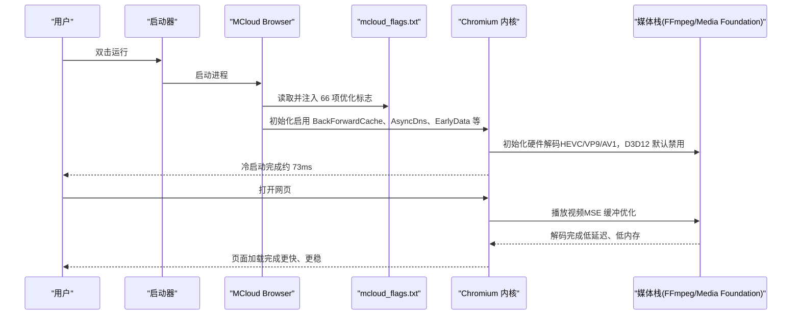
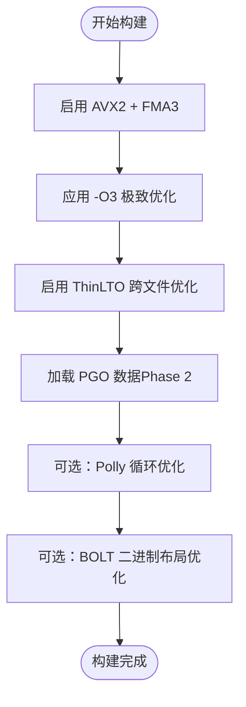
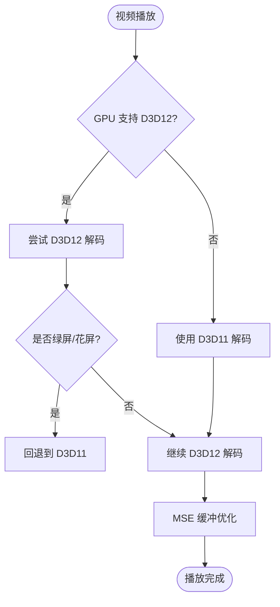

# 项目概述

<cite>
**本文引用的文件**
- [README.md](file://README.md)
- [mcloud_flags.txt](file://mcloud_flags.txt)
- [args.gn](file://args.gn)
- [docs/ABOUT_RELEASES.md](file://docs/ABOUT_RELEASES.md)
- [docs/BUILDING.md](file://docs/BUILDING.md)
- [docs/dev-logs/M150-benchmark.md](file://docs/dev-logs/M150-benchmark.md)
- [docs/dev-logs/M151-benchmark.md](file://docs/dev-logs/M151-benchmark.md)
- [docs/dev-logs/M151-opt-benchmark.md](file://docs/dev-logs/M151-opt-benchmark.md)
- [docs/superpowers/specs/2026-06-08-mcloud-browser-m149-upgrade-design.md](file://docs/superpowers/specs/2026-06-08-mcloud-browser-m149-upgrade-design.md)
- [docs/superpowers/specs/2026-06-19-performance-optimization-design.md](file://docs/superpowers/specs/2026-06-19-performance-optimization-design.md)
- [.github/workflows/release.yml](file://.github/workflows/release.yml)
</cite>

## 目录
1. [简介](#简介)
2. [项目结构](#项目结构)
3. [核心组件](#核心组件)
4. [架构总览](#架构总览)
5. [详细组件分析](#详细组件分析)
6. [依赖关系分析](#依赖关系分析)
7. [性能考量](#性能考量)
8. [故障排查指南](#故障排查指南)
9. [结论](#结论)
10. [附录](#附录)

## 简介
MCloud Browser 是基于 Chromium M151（151.0.7922.99）的高性能浏览器，面向追求极致速度与稳定性的桌面用户。其核心价值主张是：在保持与 Chromium 生态兼容的前提下，通过“AVX2 原生编译 + -O3 + ThinLTO + PGO 三重编译器优化 + 66 项运行时优化标志”的组合，显著改善启动速度、页面加载、内存占用与媒体播放体验。当前仅发布 Windows x64 平台，目标用户为现代 CPU（支持 AVX2）的 Windows 10/11 用户。

- 技术特性
  - AVX2 + FMA3 原生编译，充分利用 SIMD 指令集加速计算密集型任务
  - -O3 极致优化、ThinLTO 跨文件优化、PGO 热点路径优化协同工作
  - 66 项运行时优化标志覆盖启动、V8 脚本、页面加载、内存、多线程、渲染、视频缓冲等全链路
  - 硬件视频解码（HEVC/VP9/AV1/D3D12 回退 D3D11），完整编解码器支持（含 Dolby Vision、AC3、DTS、MPEG-H）
  - Chrome Web Store 扩展商店支持

- 系统要求
  - 操作系统：Windows 10/11 x64
  - CPU：支持 AVX2（Intel Haswell 及以后 / AMD Excavator 或 Ryzen 及以后）
  - 内存：建议 8 GB 以上（推荐 16 GB）
  - 磁盘：至少 500 MB 可用空间

- 主要功能
  - 高性能浏览体验（启动更快、页面加载更流畅、多标签内存更优）
  - 媒体播放优化（Bilibili/YouTube MSE 缓冲优化、硬件解码链路）
  - 网络优化（BackForwardCache、AsyncDns、EarlyData、预取/预连接）
  - 安全与隐私相关默认配置（如禁用 RLZ 追踪）

**章节来源**
- [README.md:18-58](file://README.md#L18-L58)
- [docs/ABOUT_RELEASES.md:9-49](file://docs/ABOUT_RELEASES.md#L9-L49)

## 项目结构
仓库采用“Chromium 源码 + MCloud 定制层”的组织方式：
- src/：Chromium 源码树（M151），包含浏览器内核、渲染引擎、媒体栈等
- win_scripts/：Windows 构建与部署脚本（包括 AVX2 基线注入、Polly 接线、flags 加载器注入等）
- infra/：打包与分发工具（AppImage、Flatpak、便携版、安装器等）
- docs/：构建指南、基准报告、设计文档与进度记录
- benchmark/：自动化基准测试套件（启动、内存、导航、体积等）
- mcloud_flags.txt：运行时优化标志清单（启动时自动注入）
- args.gn/win_args_mcloud.gn：GN 构建参数模板（SIMD、LTO、PGO、媒体、DRM 等）

**图表来源**
- [README.md:194-264](file://README.md#L194-L264)
- [docs/BUILDING.md:122-156](file://docs/BUILDING.md#L122-L156)

**章节来源**
- [README.md:194-264](file://README.md#L194-L264)
- [docs/BUILDING.md:122-156](file://docs/BUILDING.md#L122-L156)

## 核心组件
- 编译期优化栈
  - AVX2 + FMA3 原生编译：启用 use_avx2/use_fma，使 V8、FFmpeg、Skia、WebRTC 等模块生成 AVX2 指令路径
  - -O3 极致优化：全局性能提升
  - ThinLTO + PGO：跨文件优化与基于真实负载的热点路径优化
  - Polly/BOLT：循环优化与二进制布局优化（待工具链就绪后启用）

- 运行时优化标志（66 项）
  - 启动速度：SendGPUChannelEarly、DeferSpeculativeRFHCreation、InitialWebUI、TransientKeepAlivePolicy、SpareRendererForSitePerProcess、BrowserProcessAboveNormalPriority、Prerender2WarmUpCompositor*、LoadingPreconnectToRedirectTarget、PreloadTopChromeWebUI、BookmarkTriggerForPreconnect
  - V8 脚本加速：--js-flags 中 invocation_count_for_maglev=200、invocation_count_for_turbofan=1500、osr-from-maglev、sparkplug-plus
  - 页面加载：ThreadedPreloadScanner、ConsumeCodeCacheOffThread、InlineScriptCache、PreloadSystemFonts、HttpDiskCachePrewarming、LCPPAutoPreconnectLcpOrigin
  - 内存优化：DiscardOnCommitLimit、SustainedPMUrgentDiscarding、PartitionAllocSortActiveSlotSpans、PartitionAllocUsePriorityInheritanceLocks、LowerPAMemoryLimitForNonMainRenderers、ReclaimOldPrepaintTiles、PruneOldTransferCacheEntries、InfiniteTabsFreezing、InfiniteTabsFreezingOnMemoryPressure、PartitionAllocEventuallyZeroFreedMemory、PartitionAllocMemoryReclaimer
  - 多线程：IOThreadInteractiveThreadType、MojoDedicatedThread、BaseLockTrySpin、BoostClosingTabs、UnimportantFramesPriority
  - 视频/媒体：DedicatedMediaServiceThread、DirectOpusAudioDecoding、EncryptedMediaOcclusionTracking、MediaFoundationBatchRead、MediaFoundationD3D11VideoCaptureZeroCopy、PlatformHEVCDecoderSupport、HardwareSecureDecryptionAv1
  - GPU/渲染：IncreasedCmdBufferParseSlice、SkiaGraphitePrecompilation、ResourcePoolPreferExactSizeReuse、HighFramerateRequestFromClient
  - 网络：BackForwardCache、AsyncDns、EarlyData、BookmarkTriggerForPrefetch、NewTabPageTriggerForPrefetch、CacheControlNoStoreEnterBackForwardCache

- 媒体与编解码器
  - 硬件解码：HEVC/VP9/AV1/D3D12（因核显首帧缺陷，默认禁用 D3D12VideoDecoder，回退至 D3D11）
  - 完整编解码器：H.264/AVC、VP9、AV1、HEVC/H.265、Dolby Vision、AC3/E-AC3、DTS、MPEG-H

**章节来源**
- [mcloud_flags.txt:8-120](file://mcloud_flags.txt#L8-L120)
- [args.gn:1-87](file://args.gn#L1-L87)
- [docs/superpowers/specs/2026-06-08-mcloud-browser-m149-upgrade-design.md:148-226](file://docs/superpowers/specs/2026-06-08-mcloud-browser-m149-upgrade-design.md#L148-L226)
- [docs/superpowers/specs/2026-06-19-performance-optimization-design.md:60-98](file://docs/superpowers/specs/2026-06-19-performance-optimization-design.md#L60-L98)
- [README.md:179-191](file://README.md#L179-L191)

## 架构总览
MCloud Browser 的架构围绕“Chromium 内核 + MCloud 定制层”展开：
- 构建阶段：通过 GN 参数启用 AVX2/FMA、-O3、ThinLTO、PGO；脚本注入 flags 加载器与 AVX2 基线
- 运行阶段：启动时自动注入 66 项优化标志，覆盖启动、脚本、加载、内存、多线程、渲染、媒体、网络等
- 媒体栈：FFmpeg + Media Foundation，启用 HEVC/AV1/VP9 硬解，针对 Bilibili/YouTube 做 MSE 缓冲优化
- 分发：Windows mini_installer 安装包，附带 mcloud_flags.txt，安装后自动生效

**图表来源**
- [README.md:20-33](file://README.md#L20-L33)
- [mcloud_flags.txt:8-120](file://mcloud_flags.txt#L8-L120)
- [docs/dev-logs/M151-benchmark.md:19-26](file://docs/dev-logs/M151-benchmark.md#L19-L26)

## 详细组件分析

### 编译期优化栈（AVX2 + -O3 + ThinLTO + PGO）
- AVX2 + FMA3 原生编译：通过 use_avx2/use_fma 启用，使 V8、FFmpeg、Skia、WebRTC 等模块使用 AVX2 指令路径
- -O3 极致优化：全局性能提升 5-15%
- ThinLTO + PGO：跨文件优化与基于真实负载的热点路径优化
- Polly/BOLT：循环优化与二进制布局优化（待工具链就绪后启用）

**图表来源**
- [docs/superpowers/specs/2026-06-08-mcloud-browser-m149-upgrade-design.md:148-226](file://docs/superpowers/specs/2026-06-08-mcloud-browser-m149-upgrade-design.md#L148-L226)
- [args.gn:1-87](file://args.gn#L1-L87)

**章节来源**
- [docs/superpowers/specs/2026-06-08-mcloud-browser-m149-upgrade-design.md:148-226](file://docs/superpowers/specs/2026-06-08-mcloud-browser-m149-upgrade-design.md#L148-L226)
- [args.gn:1-87](file://args.gn#L1-L87)

### 运行时优化标志（66 项）
- 启动速度：提前发送 GPU 通道、延迟创建推测性渲染帧、精简 InitialWebUI、临时保持策略、预热渲染进程等
- V8 脚本加速：降低 Maglev/TurboFan 编译阈值，启用 OSR 升级与 Sparkplug 动态修补
- 页面加载：线程化 preload 扫描、离线程代码缓存消费、内联脚本缓存、系统字体预载、HTTP 磁盘缓存预热、LCP 源自动预连接
- 内存优化：标签页丢弃、紧急回收、内存碎片整理、优先级继承锁、非主框架内存限制、预绘制瓦片回收、传输缓存清理、标签页冻结、释放内存清零、内存回收器
- 多线程：IO 线程交互式类型、Mojo 专用线程、用户态自旋锁、关闭标签页优先级提升、非重要框架优先级调整
- 视频/媒体：专用媒体服务线程、DirectOpus 音频解码、加密媒体遮挡跟踪、MediaFoundation 批量读取、零拷贝捕获、HEVC 硬件解码、AV1 硬件安全解密
- GPU/渲染：增加命令缓冲区解析切片、Skia Graphite 预编译、资源池精确大小复用、高帧率请求
- 网络：BackForwardCache、异步 DNS、TLS 1.3 Early Data、书签/新标签页预取、更多页面可快速恢复

```mermaid
classDiagram
class 启动优化 {
+SendGPUChannelEarly
+DeferSpeculativeRFHCreation
+InitialWebUI
+TransientKeepAlivePolicy
+SpareRendererForSitePerProcess
+BrowserProcessAboveNormalPriority
+Prerender2WarmUpCompositorForNewTabPage
+Prerender2WarmUpCompositorForBookmarkBar
+LoadingPreconnectToRedirectTarget
+PreloadTopChromeWebUI
+BookmarkTriggerForPreconnect
}
class V8脚本优化 {
+invocation_count_for_maglev=200
+invocation_count_for_turbofan=1500
+osr-from-maglev
+sparkplug-plus
}
class 页面加载优化 {
+ThreadedPreloadScanner
+ConsumeCodeCacheOffThread
+InlineScriptCache
+PreloadSystemFonts
+HttpDiskCachePrewarming
+LCPPAutoPreconnectLcpOrigin
}
class 内存优化 {
+DiscardOnCommitLimit
+SustainedPMUrgentDiscarding
+PartitionAllocSortActiveSlotSpans
+PartitionAllocUsePriorityInheritanceLocks
+LowerPAMemoryLimitForNonMainRenderers
+ReclaimOldPrepaintTiles
+PruneOldTransferCacheEntries
+InfiniteTabsFreezing
+InfiniteTabsFreezingOnMemoryPressure
+PartitionAllocEventuallyZeroFreedMemory
+PartitionAllocMemoryReclaimer
}
class 多线程优化 {
+IOThreadInteractiveThreadType
+MojoDedicatedThread
+BaseLockTrySpin
+BoostClosingTabs
+UnimportantFramesPriority
}
class 视频媒体优化 {
+DedicatedMediaServiceThread
+DirectOpusAudioDecoding
+EncryptedMediaOcclusionTracking
+MediaFoundationBatchRead
+MediaFoundationD3D11VideoCaptureZeroCopy
+PlatformHEVCDecoderSupport
+HardwareSecureDecryptionAv1
}
class GPU渲染优化 {
+IncreasedCmdBufferParseSlice
+SkiaGraphitePrecompilation
+ResourcePoolPreferExactSizeReuse
+HighFramerateRequestFromClient
}
class 网络优化 {
+BackForwardCache
+AsyncDns
+EarlyData
+BookmarkTriggerForPrefetch
+NewTabPageTriggerForPrefetch
+CacheControlNoStoreEnterBackForwardCache
}
```

**图表来源**
- [mcloud_flags.txt:8-120](file://mcloud_flags.txt#L8-L120)

**章节来源**
- [mcloud_flags.txt:8-120](file://mcloud_flags.txt#L8-L120)

### 媒体与编解码器
- 硬件解码：HEVC/VP9/AV1/D3D12（因 Intel 核显首帧缺陷，默认禁用 D3D12VideoDecoder，回退至 D3D11）
- 完整编解码器：H.264/AVC、VP9、AV1、HEVC/H.265、Dolby Vision、AC3/E-AC3、DTS、MPEG-H
- MSE 缓冲优化：针对 Bilibili/YouTube 的导航提速与内存优化

**图表来源**
- [mcloud_flags.txt:83-88](file://mcloud_flags.txt#L83-L88)
- [README.md:179-191](file://README.md#L179-L191)

**章节来源**
- [mcloud_flags.txt:83-88](file://mcloud_flags.txt#L83-L88)
- [README.md:179-191](file://README.md#L179-L191)

## 依赖关系分析
- 构建依赖
  - Visual Studio 2026 Build Tools（或 2022）
  - Git、Python 3.8+
  - depot_tools
  - 至少 100 GB 可用磁盘空间、16 GB 内存
- 运行依赖
  - Windows 10/11 x64
  - 支持 AVX2 的处理器
  - 8 GB 以上内存（推荐 16 GB）
- 外部集成
  - Chrome Web Store 扩展商店
  - Widevine DRM（可选，需单独下载 CDM）
  - Google API 密钥（可选，用于同步/翻译/地理定位等服务）

**图表来源**
- [docs/BUILDING.md:194-204](file://docs/BUILDING.md#L194-L204)
- [README.md:194-204](file://README.md#L194-L204)

**章节来源**
- [docs/BUILDING.md:194-204](file://docs/BUILDING.md#L194-L204)
- [README.md:194-204](file://README.md#L194-L204)

## 性能考量
- 启动速度
  - M151 冷启动中位数约 73ms（同机同方法对比 M150 的 71ms，差异在噪声范围内）
  - 预载类优化在 Bilibili 场景下导航提速 5.6%
- 内存使用
  - M151 相比 M150 内存占用降低 0.9%（2646MB vs 2669MB）
  - 移除 3 项高内存低收益预载项后，真实站点 50 标签内存节省 203MB
- 页面加载
  - 线程化 preload 扫描、离线程代码缓存消费、内联脚本缓存、系统字体预载、HTTP 磁盘缓存预热、LCP 源自动预连接
- 视频播放
  - MSE 缓冲优化、硬件解码链路、D3D11 回退避免核显绿屏问题
- 多线程与网络
  - IO 线程交互式类型、Mojo 专用线程、异步 DNS、TLS 1.3 Early Data、BackForwardCache

**章节来源**
- [docs/dev-logs/M151-benchmark.md:19-26](file://docs/dev-logs/M151-benchmark.md#L19-L26)
- [docs/dev-logs/M151-opt-benchmark.md:34-61](file://docs/dev-logs/M151-opt-benchmark.md#L34-L61)
- [README.md:336-353](file://README.md#L336-L353)

## 故障排查指南
- 启动失败或崩溃
  - 检查 CPU 是否支持 AVX2（Intel Haswell 及以后 / AMD Excavator 或 Ryzen 及以后）
  - 确认已安装正确的 VS2026 Build Tools 与 ATL 头文件路径
- 视频播放异常
  - 若出现绿屏/花屏，确认已禁用 D3D12VideoDecoder（默认已禁用，回退至 D3D11）
  - 检查 GPU 驱动版本与硬件支持
- 网络断流
  - 确认 DNS-over-HTTPS 模式为自动（kAutomatic），失败时回退普通 DNS
- 构建失败
  - 检查 depot_tools 路径与环境变量
  - 确认 args.gn 中 pgo_data_path 指向正确的 profdata 文件
  - 确保已执行 gclient runhooks 安装依赖

**章节来源**
- [docs/progress.md:99-104](file://docs/progress.md#L99-L104)
- [mcloud_flags.txt:83-88](file://mcloud_flags.txt#L83-L88)
- [docs/BUILDING.md:122-156](file://docs/BUILDING.md#L122-L156)

## 结论
MCloud Browser 通过“AVX2 原生编译 + -O3 + ThinLTO + PGO + 66 项运行时优化标志”的组合，在启动速度、页面加载、内存占用与媒体播放方面实现了显著提升。其目标用户为现代 CPU 的 Windows 10/11 用户，提供高性能、稳定、兼容的浏览体验。项目持续迭代，已实现从 M149 到 M151 的内核升级，并在基准测试中验证了性能收益。未来将继续优化预载类功能与内存占用，平衡速度与资源消耗。

## 附录
- 版本信息
  - 当前版本：M151（151.0.7922.99）
  - 历史版本：M150（150.0.7871.x）、M149（149.0.7827.53）
- 社区生态
  - 开源协议：MIT
  - 贡献方式：Fork 仓库、创建分支、提交更改、发起 Pull Request
  - CI/CD：GitHub Actions 工作流（release.yml）用于发布流程

**章节来源**
- [README.md:391-408](file://README.md#L391-L408)
- [docs/progress.md:10-45](file://docs/progress.md#L10-L45)
- [.github/workflows/release.yml:1-40](file://.github/workflows/release.yml#L1-L40)